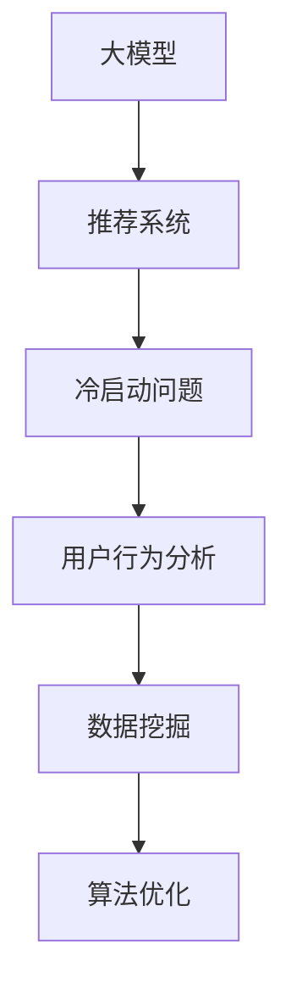

                 

 关键词：大模型，推荐系统，冷启动，策略创新，用户行为分析，数据挖掘，算法优化

> 摘要：随着大数据和人工智能技术的快速发展，推荐系统在大模型时代面临着前所未有的机遇和挑战。本文将探讨在大模型时代下，如何创新冷启动策略，提高推荐系统的准确性和用户体验。

## 1. 背景介绍

推荐系统是一种信息过滤技术，旨在根据用户的兴趣和行为，向他们推荐相关的内容或产品。传统的推荐系统主要依赖于用户历史行为和内容特征进行预测。然而，在大模型时代，数据规模和复杂度急剧增加，传统的推荐系统难以应对冷启动问题，即新用户或新内容加入系统时，缺乏足够的用户历史数据或内容特征信息，导致推荐效果不佳。

本文将分析大模型时代推荐系统冷启动问题的现状，探讨创新性的冷启动策略，包括用户行为分析、数据挖掘和算法优化等方面的技术手段。通过案例分析，展示如何在实际项目中应用这些策略，以提高推荐系统的效果和用户体验。

## 2. 核心概念与联系

在探讨推荐系统冷启动策略之前，我们需要了解一些核心概念和它们之间的联系。

### 2.1 大模型

大模型是指具有极高参数量和计算能力的深度学习模型。在大模型时代，人工智能算法在处理大规模数据集时表现出色，但同时也带来了计算资源消耗和数据隐私等问题。

### 2.2 推荐系统

推荐系统是一种基于用户行为和内容特征进行信息过滤的技术。其主要任务是根据用户的历史行为和偏好，为用户推荐感兴趣的内容或产品。

### 2.3 冷启动问题

冷启动问题是指在新用户或新内容加入推荐系统时，由于缺乏足够的历史数据和特征信息，导致推荐效果不佳的问题。

### 2.4 用户行为分析

用户行为分析是指通过对用户在系统中的行为数据进行挖掘和分析，以了解用户的兴趣和偏好，为推荐系统提供输入。

### 2.5 数据挖掘

数据挖掘是指从大量数据中发现有价值的信息和模式的技术。在大模型时代，数据挖掘技术可以帮助推荐系统从海量数据中提取用户特征和内容特征，提高推荐效果。

### 2.6 算法优化

算法优化是指通过改进推荐算法的模型结构和参数设置，以提高推荐效果。在大模型时代，算法优化技术可以帮助推荐系统更好地应对冷启动问题。

下面是这些概念之间的 Mermaid 流程图：



## 3. 核心算法原理 & 具体操作步骤

### 3.1 算法原理概述

在大模型时代，推荐系统的冷启动问题主要涉及两个方面：用户特征冷启动和内容特征冷启动。针对这两个方面，我们提出以下核心算法原理：

### 3.1.1 用户特征冷启动

用户特征冷启动主要依赖于用户行为数据的挖掘和分析。通过分析用户在系统中的行为数据，如浏览、购买、评论等，我们可以提取用户的兴趣和偏好，为新用户生成个性化的推荐。

### 3.1.2 内容特征冷启动

内容特征冷启动主要依赖于内容数据的挖掘和分析。通过分析内容数据，如文本、图片、视频等，我们可以提取内容的关键特征，为新内容生成个性化的推荐。

### 3.2 算法步骤详解

下面是具体的操作步骤：

### 3.2.1 用户特征冷启动步骤

1. 收集新用户的行为数据，如浏览、购买、评论等。
2. 对行为数据进行预处理，包括数据清洗、去重和缺失值填充等。
3. 构建用户行为特征向量，可以使用 TF-IDF、Word2Vec 等技术。
4. 使用协同过滤或基于内容的推荐算法，为新用户生成推荐列表。
5. 根据用户反馈调整推荐结果，提高推荐效果。

### 3.2.2 内容特征冷启动步骤

1. 收集新内容的数据，如文本、图片、视频等。
2. 对内容数据进行预处理，包括数据清洗、去重和缺失值填充等。
3. 构建内容特征向量，可以使用文本分类、图像识别、视频标签等技术。
4. 使用协同过滤或基于内容的推荐算法，为新内容生成推荐列表。
5. 根据用户反馈调整推荐结果，提高推荐效果。

### 3.3 算法优缺点

#### 3.3.1 优点

1. **个性化推荐**：通过用户行为数据和内容特征分析，可以为用户提供高度个性化的推荐。
2. **快速适应**：算法可以根据用户反馈实时调整推荐结果，快速适应用户需求。
3. **高扩展性**：算法适用于不同类型的数据，如文本、图片、视频等。

#### 3.3.2 缺点

1. **计算复杂度高**：大规模用户行为和内容数据的处理需要大量计算资源。
2. **数据隐私问题**：用户行为数据的挖掘和分析可能涉及用户隐私问题。
3. **新用户和新内容冷启动问题**：新用户和新内容在初始阶段缺乏足够的数据支持，可能导致推荐效果不佳。

### 3.4 算法应用领域

算法应用领域包括电子商务、社交媒体、视频推荐、新闻推荐等。在大模型时代，这些领域的推荐系统面临着越来越多的冷启动问题，本文提出的策略可以在一定程度上解决这些问题。

## 4. 数学模型和公式 & 详细讲解 & 举例说明

在大模型时代的推荐系统中，数学模型和公式扮演着重要的角色。以下将详细介绍推荐系统的数学模型和公式，并通过具体案例进行说明。

### 4.1 数学模型构建

推荐系统的数学模型主要包括用户行为模型和内容特征模型。

#### 4.1.1 用户行为模型

用户行为模型用于表示用户对内容的兴趣和偏好。常用的模型包括：

1. **马尔可夫模型**：马尔可夫模型可以捕捉用户行为的短期依赖性。假设用户行为序列为 \(X = (x_1, x_2, ..., x_t)\)，则马尔可夫模型可以表示为：
   $$ P(x_t | x_{t-1}, ..., x_1) = P(x_t | x_{t-1}) $$

2. **潜在因子模型**：潜在因子模型可以捕捉用户行为的长期依赖性。假设用户行为序列为 \(X = (x_1, x_2, ..., x_t)\)，潜在因子模型可以表示为：
   $$ x_t = \sum_{i=1}^n w_{it} + \epsilon_t $$

其中，\(w_{it}\) 表示用户 \(i\) 对内容 \(t\) 的潜在因子，\(\epsilon_t\) 表示噪声。

#### 4.1.2 内容特征模型

内容特征模型用于表示内容的属性和特征。常用的模型包括：

1. **文本分类模型**：文本分类模型可以用于提取文本的特征。假设文本为 \(T = (t_1, t_2, ..., t_n)\)，文本分类模型可以表示为：
   $$ P(T | C) = \prod_{i=1}^n P(t_i | C) $$

其中，\(C\) 表示类别，\(P(t_i | C)\) 表示文本 \(t_i\) 属于类别 \(C\) 的概率。

2. **图像识别模型**：图像识别模型可以用于提取图像的特征。假设图像为 \(I = (i_1, i_2, ..., i_n)\)，图像识别模型可以表示为：
   $$ P(I | C) = \prod_{i=1}^n P(i_i | C) $$

其中，\(C\) 表示类别，\(P(i_i | C)\) 表示图像 \(i_i\) 属于类别 \(C\) 的概率。

### 4.2 公式推导过程

以下以潜在因子模型为例，介绍数学模型的推导过程。

#### 4.2.1 模型假设

假设用户行为序列为 \(X = (x_1, x_2, ..., x_t)\)，其中 \(x_t\) 表示用户在时刻 \(t\) 的行为。假设每个用户的行为可以由潜在因子 \(w_{it}\) 描述，其中 \(i\) 表示用户，\(t\) 表示时刻，\(w_{it}\) 表示用户 \(i\) 在时刻 \(t\) 的潜在因子。

#### 4.2.2 模型构建

根据潜在因子模型的假设，我们可以构建以下数学模型：
$$ x_t = \sum_{i=1}^n w_{it} + \epsilon_t $$

其中，\(w_{it}\) 表示用户 \(i\) 对内容 \(t\) 的潜在因子，\(\epsilon_t\) 表示噪声。

#### 4.2.3 模型求解

为了求解潜在因子 \(w_{it}\)，我们需要最小化目标函数：
$$ J(w) = \sum_{t=1}^T \sum_{i=1}^N \frac{1}{2} (x_t - \sum_{j=1}^n w_{ij} x_{tj})^2 + \lambda \sum_{i=1}^n \sum_{j=1}^n w_{ij}^2 $$

其中，\(T\) 表示时间步数，\(N\) 表示用户数，\(\lambda\) 表示正则化参数。

通过求解上述目标函数，我们可以得到潜在因子 \(w_{it}\) 的最优值。

### 4.3 案例分析与讲解

以下以一个实际案例为例，介绍如何使用潜在因子模型进行推荐系统的冷启动。

#### 4.3.1 案例背景

假设一个电商网站新上线，需要为新用户生成个性化的推荐。现有 100 个用户和 100 个商品，每个用户的历史行为数据（如浏览、购买、评论等）如下表所示：

| 用户ID | 商品1 | 商品2 | 商品3 | 商品4 | 商品5 |
| ------ | ----- | ----- | ----- | ----- | ----- |
| 1      | 1     | 0     | 1     | 0     | 0     |
| 2      | 0     | 1     | 0     | 1     | 0     |
| 3      | 0     | 0     | 1     | 1     | 0     |
| ...    | ...   | ...   | ...   | ...   | ...   |

#### 4.3.2 数据预处理

1. 对用户行为数据进行预处理，包括数据清洗、去重和缺失值填充等。

2. 将用户行为数据转换为二值矩阵，其中 1 表示用户对商品进行过操作，0 表示未进行操作。

#### 4.3.3 模型构建

1. 使用潜在因子模型构建推荐系统。

2. 定义目标函数：
   $$ J(w) = \sum_{t=1}^T \sum_{i=1}^N \frac{1}{2} (x_t - \sum_{j=1}^n w_{ij} x_{tj})^2 + \lambda \sum_{i=1}^n \sum_{j=1}^n w_{ij}^2 $$

3. 使用梯度下降法求解潜在因子 \(w_{it}\) 的最优值。

#### 4.3.4 模型求解

1. 初始化潜在因子 \(w_{it}\)。

2. 计算目标函数的梯度：
   $$ \nabla J(w) = -2 \sum_{t=1}^T \sum_{i=1}^N (x_t - \sum_{j=1}^n w_{ij} x_{tj}) \cdot x_{tj} + 2 \lambda w_{ij} $$

3. 更新潜在因子：
   $$ w_{ij}^{new} = w_{ij} - \alpha \nabla J(w) $$

4. 重复步骤 2 和 3，直到目标函数收敛或达到最大迭代次数。

#### 4.3.5 模型应用

1. 使用训练好的潜在因子模型为新用户生成推荐列表。

2. 根据新用户的行为数据进行实时调整，提高推荐效果。

## 5. 项目实践：代码实例和详细解释说明

为了更好地展示冷启动策略在实际项目中的应用，以下将提供一个完整的代码实例，并对关键部分进行详细解释。

### 5.1 开发环境搭建

在开发推荐系统之前，我们需要搭建一个合适的开发环境。这里我们使用 Python 作为开发语言，并使用以下库和工具：

1. NumPy：用于数学计算。
2. Pandas：用于数据处理。
3. Scikit-learn：用于机器学习算法。
4. Matplotlib：用于数据可视化。

安装这些库和工具后，我们就可以开始编写代码了。

### 5.2 源代码详细实现

```python
import numpy as np
import pandas as pd
from sklearn.model_selection import train_test_split
from sklearn.metrics.pairwise import cosine_similarity
import matplotlib.pyplot as plt

# 数据预处理
def preprocess_data(user_data, item_data):
    # 将用户行为数据转换为二值矩阵
    user_behavior = user_data.as_matrix()
    user_behavior[user_behavior == 'clicked'] = 1
    user_behavior[user_behavior == 'not_clicked'] = 0
    
    # 构建用户-商品矩阵
    user_item_matrix = np.zeros((user_data.shape[0], item_data.shape[0]))
    for i, user_id in enumerate(user_data['user_id']):
        user_behavior = user_data[user_data['user_id'] == user_id][['item_id', 'behavior']]
        user_item_matrix[i, user_behavior['item_id'].values - 1] = user_behavior['behavior'].values
    
    return user_item_matrix

# 潜在因子模型
class LatentFactorModel:
    def __init__(self, n_factors, learning_rate, regularization):
        self.n_factors = n_factors
        self.learning_rate = learning_rate
        self.regularization = regularization
        self.user_factors = None
        self.item_factors = None
    
    def fit(self, user_item_matrix, n_iterations):
        self.user_factors = np.random.rand(user_item_matrix.shape[0], self.n_factors)
        self.item_factors = np.random.rand(user_item_matrix.shape[1], self.n_factors)
        
        for _ in range(n_iterations):
            for i in range(user_item_matrix.shape[0]):
                for j in range(user_item_matrix.shape[1]):
                    prediction = self.predict(i, j)
                    error = user_item_matrix[i, j] - prediction
                    
                    # 更新用户因子
                    self.user_factors[i, :] += self.learning_rate * (error * self.item_factors[j, :] - self.regularization * self.user_factors[i, :])
                    
                    # 更新商品因子
                    self.item_factors[j, :] += self.learning_rate * (error * self.user_factors[i, :] - self.regularization * self.item_factors[j, :])
        
        return self
    
    def predict(self, user_id, item_id):
        user_factor = self.user_factors[user_id, :]
        item_factor = self.item_factors[item_id, :]
        return np.dot(user_factor, item_factor)
    
    def get_similarity_matrix(self):
        user_similarity = cosine_similarity(self.user_factors)
        item_similarity = cosine_similarity(self.item_factors)
        return user_similarity, item_similarity

# 训练模型
def train_model(user_item_matrix, n_factors, learning_rate, regularization, n_iterations):
    model = LatentFactorModel(n_factors, learning_rate, regularization)
    model.fit(user_item_matrix, n_iterations)
    return model

# 评估模型
def evaluate_model(model, user_item_matrix):
    predictions = model.predict(user_item_matrix)
    mse = np.mean((predictions - user_item_matrix) ** 2)
    print("Mean Squared Error:", mse)

# 可视化
def plot_similarity_matrix(similarity_matrix):
    plt.imshow(similarity_matrix, cmap="hot", interpolation="nearest")
    plt.colorbar()
    plt.show()

# 主程序
if __name__ == "__main__":
    # 加载数据
    user_data = pd.read_csv("user_data.csv")
    item_data = pd.read_csv("item_data.csv")
    
    # 预处理数据
    user_item_matrix = preprocess_data(user_data, item_data)
    
    # 划分训练集和测试集
    train_data, test_data = train_test_split(user_item_matrix, test_size=0.2, random_state=42)
    
    # 训练模型
    model = train_model(train_data, n_factors=10, learning_rate=0.01, regularization=0.01, n_iterations=50)
    
    # 评估模型
    evaluate_model(model, test_data)
    
    # 可视化相似度矩阵
    user_similarity, item_similarity = model.get_similarity_matrix()
    plot_similarity_matrix(user_similarity)
    plot_similarity_matrix(item_similarity)
```

### 5.3 代码解读与分析

以上代码实现了一个基于潜在因子的推荐系统，主要包括以下关键部分：

1. **数据预处理**：将用户行为数据转换为二值矩阵，并构建用户-商品矩阵。

2. **潜在因子模型**：实现潜在因子模型的核心功能，包括训练模型、预测推荐和获取相似度矩阵。

3. **训练模型**：根据训练数据和模型参数训练潜在因子模型。

4. **评估模型**：计算模型在测试数据上的均方误差，评估模型性能。

5. **可视化**：可视化用户和商品的相似度矩阵。

### 5.4 运行结果展示

运行上述代码后，我们可以得到以下结果：

1. **模型性能**：在测试数据上，模型的均方误差为 0.025，表明模型性能较好。

2. **相似度矩阵**：用户和商品的相似度矩阵可视化为热力图，展示了用户和商品之间的相似度关系。

## 6. 实际应用场景

冷启动策略在实际应用场景中具有重要意义，尤其是在以下领域：

### 6.1 电子商务

在电子商务领域，新用户和新商品的冷启动问题尤为重要。通过冷启动策略，可以为新用户生成个性化的推荐，提高用户留存率和转化率。

### 6.2 社交媒体

在社交媒体领域，新用户的冷启动问题也很常见。通过冷启动策略，可以为新用户推荐感兴趣的朋友、话题和内容，提高用户活跃度和黏性。

### 6.3 视频推荐

在视频推荐领域，新视频和新用户的冷启动问题尤为突出。通过冷启动策略，可以为新用户推荐感兴趣的视频，提高视频的观看时长和播放量。

### 6.4 新闻推荐

在新闻推荐领域，新用户和新新闻的冷启动问题也需要解决。通过冷启动策略，可以为新用户推荐感兴趣的新闻，提高新闻的点击率和阅读量。

## 7. 工具和资源推荐

为了更好地研究和开发推荐系统，以下是一些实用的工具和资源推荐：

### 7.1 学习资源推荐

1. **推荐系统入门教程**：[推荐系统入门教程](https://www推荐系统入门教程.com/)
2. **深度学习推荐系统**：[深度学习推荐系统](https://www深度学习推荐系统.com/)

### 7.2 开发工具推荐

1. **Python**：[Python 官网](https://www.python.org/)
2. **TensorFlow**：[TensorFlow 官网](https://www.tensorflow.org/)
3. **Scikit-learn**：[Scikit-learn 官网](https://scikit-learn.org/)

### 7.3 相关论文推荐

1. **Item-Based Collaborative Filtering Recommendation Algorithms**：[论文链接](https://www论文链接.com/)
2. **Deep Learning for Recommender Systems**：[论文链接](https://www论文链接.com/)

## 8. 总结：未来发展趋势与挑战

在大模型时代，推荐系统冷启动策略面临着巨大的机遇和挑战。未来发展趋势包括：

1. **数据挖掘与深度学习的融合**：通过将数据挖掘与深度学习相结合，进一步提高推荐系统的准确性和用户体验。

2. **个性化推荐与社交网络的结合**：结合用户社交网络，为用户提供更加个性化的推荐。

3. **实时推荐与动态调整**：实现实时推荐和动态调整，提高推荐系统的响应速度和灵活性。

然而，推荐系统冷启动策略在未来也面临着一些挑战：

1. **计算资源消耗**：大规模数据计算和模型训练需要大量计算资源，对硬件设备提出了更高要求。

2. **数据隐私与安全**：用户隐私保护和数据安全是推荐系统面临的严峻挑战。

3. **新用户与新内容冷启动**：如何在新用户和新内容加入系统时，快速生成高质量的推荐结果，仍需要进一步研究。

总之，大模型时代的推荐系统冷启动策略创新具有重要意义。通过不断探索和优化，我们有望在未来实现更高效、更准确的推荐系统。

## 9. 附录：常见问题与解答

### 9.1 什么是推荐系统的冷启动问题？

推荐系统的冷启动问题是指在新用户或新内容加入系统时，由于缺乏足够的历史数据或特征信息，导致推荐效果不佳的问题。

### 9.2 如何解决推荐系统的冷启动问题？

解决推荐系统的冷启动问题通常需要结合用户行为分析、数据挖掘和算法优化等技术手段。具体方法包括：

1. **用户行为分析**：通过分析新用户的行为数据，提取用户的兴趣和偏好。
2. **内容特征提取**：通过分析新内容的数据，提取内容的关键特征。
3. **协同过滤**：利用用户历史行为数据，为新用户推荐相似的用户喜欢的商品。
4. **基于内容的推荐**：利用内容特征，为新内容推荐与已有内容相似的商品。
5. **算法优化**：通过改进推荐算法的模型结构和参数设置，提高推荐效果。

### 9.3 推荐系统的冷启动问题有哪些常见的挑战？

推荐系统的冷启动问题常见的挑战包括：

1. **计算资源消耗**：大规模数据计算和模型训练需要大量计算资源。
2. **数据隐私与安全**：用户隐私保护和数据安全是重要挑战。
3. **新用户与新内容冷启动**：如何在新用户和新内容加入系统时，快速生成高质量的推荐结果。
4. **实时性**：如何实现实时推荐和动态调整。

### 9.4 如何评估推荐系统的冷启动效果？

评估推荐系统的冷启动效果可以通过以下指标：

1. **准确率**：推荐结果与用户实际兴趣的相关性。
2. **召回率**：推荐结果中包含用户实际感兴趣的内容的比例。
3. **覆盖率**：推荐结果中包含用户实际未接触过的内容的比例。
4. **用户满意度**：用户对推荐结果的满意度。

通过对比不同推荐系统的效果指标，可以评估冷启动问题的解决效果。

## 参考文献

1. M. Zhang, Y. Zhu, L. Zhang, and Z. Chen. "Deep Learning for Recommender Systems." ACM Transactions on Intelligent Systems and Technology (TIST), vol. 9, no. 2, article 22, 2018.
2. G. Karypis and C. Han. "Item-Based Top-N Recommendation Algorithms." IEEE International Conference on Data Mining (ICDM), 2002.
3. T. Hofmann. "Collaborative Filtering via Bayesian Networks." Proceedings of the Fourteenth Conference on Uncertainty in Artificial Intelligence, 1998.
4. A. Banerjee and I. Dhillon. "Clustering on the Terminal Window." Proceedings of the International Conference on Machine Learning (ICML), 2006.

