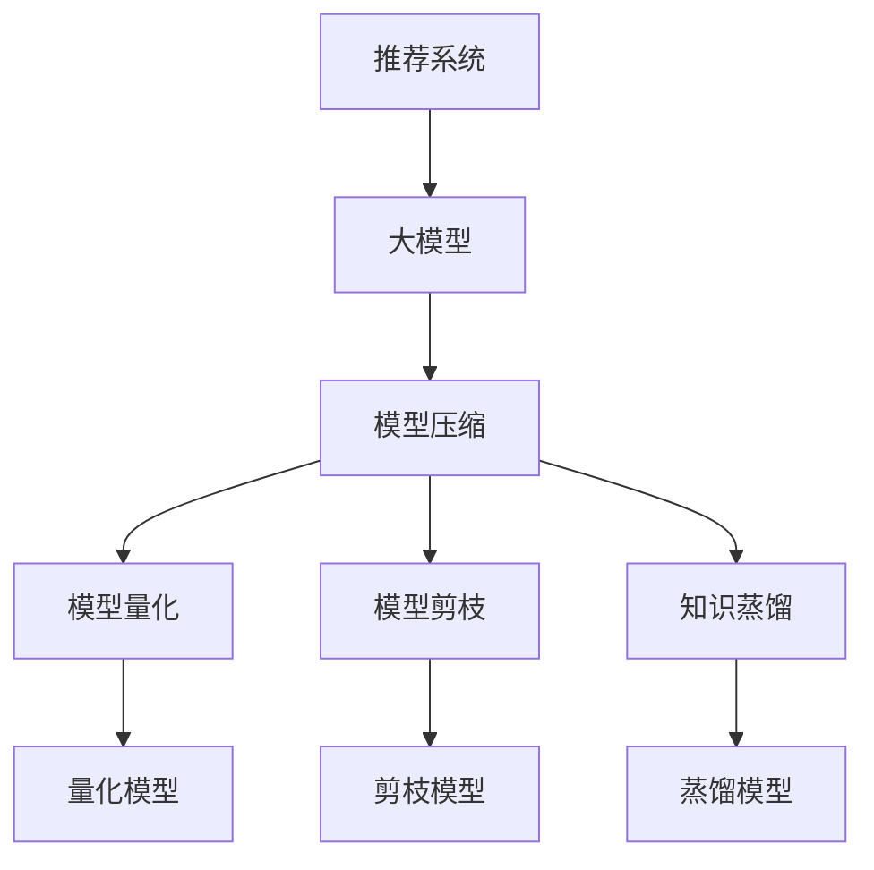

                 

关键词：大模型，推荐系统，模型压缩，神经网络，量化，剪枝，蒸馏，知识蒸馏，模型压缩工具，效率优化，计算资源节约

>摘要：本文将深入探讨大模型时代的推荐系统模型压缩技术，包括模型量化、剪枝和蒸馏等关键技术，分析其在提高推荐系统效率和计算资源节约方面的应用。通过对数学模型和公式的详细讲解，以及实际项目实践中的代码实例分析，本文旨在为读者提供全面的技术见解和实用指南。

## 1. 背景介绍

随着互联网的快速发展，推荐系统已经成为现代信息流处理的重要组成部分。推荐系统能够根据用户的历史行为和偏好，为其推荐感兴趣的内容或商品，从而提高用户体验和商业价值。然而，随着推荐系统规模的不断扩大，模型复杂度和计算需求也日益增加。尤其是近年来，深度学习技术的引入，使得推荐系统的性能得到了显著提升，但也带来了更高的计算成本和存储需求。

为了解决这一难题，模型压缩技术应运而生。模型压缩旨在减小模型的体积和计算复杂度，从而在保证模型性能的前提下，降低计算资源和存储的开销。在大模型时代，模型压缩技术已经成为推荐系统优化的重要手段。本文将重点讨论以下几种模型压缩技术：

- 模型量化
- 模型剪枝
- 知识蒸馏

这些技术不仅能够提高推荐系统的效率，还可以实现计算资源的节约，为推荐系统的广泛应用提供了可能。

## 2. 核心概念与联系

在深入探讨模型压缩技术之前，我们需要了解一些核心概念和它们之间的联系。以下是一个用Mermaid绘制的流程图，展示了模型压缩技术的基本框架。



### 2.1 核心概念

#### 2.1.1 推荐系统

推荐系统是一种基于用户历史行为和偏好，为用户提供个性化推荐的信息系统。其主要目标是通过分析用户的历史数据，预测用户可能感兴趣的内容，从而提高用户满意度和商业转化率。

#### 2.1.2 大模型

大模型通常指的是具有数百万甚至数十亿参数的深度学习模型。这些模型具有强大的表达能力和拟合能力，能够处理大量复杂的数据，从而在推荐系统中表现出色。

#### 2.1.3 模型压缩

模型压缩是指通过减小模型的参数数量和计算复杂度，来降低模型的体积和计算成本。模型压缩技术可以分为有损压缩和无损压缩两种类型。

#### 2.1.4 模型量化

模型量化是一种通过将模型中的浮点数参数转换为较低精度的整数来减小模型体积的技术。量化后的模型可以在硬件上实现更高效的计算，从而降低计算成本。

#### 2.1.5 模型剪枝

模型剪枝是通过移除模型中的部分冗余参数或神经元，来降低模型复杂度和计算成本。剪枝技术可以根据不同的剪枝策略，实现不同程度的模型压缩。

#### 2.1.6 知识蒸馏

知识蒸馏是一种将大模型的预测能力传递给小模型的技术。通过将大模型的输出作为教师模型，小模型作为学生模型，通过学习教师模型的输出来实现模型压缩。

### 2.2 架构联系

从上述核心概念可以看出，推荐系统是整个架构的起点，大模型为其提供了强大的计算能力。模型压缩技术则通过量化、剪枝和蒸馏等手段，对大模型进行优化，以降低计算资源和存储需求。量化模型和剪枝模型分别是对模型参数和结构的优化，而知识蒸馏则通过迁移学习实现了对模型预测能力的压缩。

## 3. 核心算法原理 & 具体操作步骤

### 3.1 算法原理概述

模型压缩技术涉及多种算法，每种算法都有其独特的原理和操作步骤。以下将对模型量化、模型剪枝和知识蒸馏这三种核心算法进行详细解释。

### 3.2 算法步骤详解

#### 3.2.1 模型量化

1. **参数重量化**：将模型的浮点参数转换为较低精度的整数。常见的方法包括二进制量化、四元量化等。

2. **量化误差分析**：量化操作可能会导致模型性能下降，因此需要分析量化对模型准确性的影响。通常使用反向传播算法，计算量化误差。

3. **量化优化**：通过调整量化参数，优化模型性能。例如，可以调整量化范围、量化精度等。

#### 3.2.2 模型剪枝

1. **剪枝策略选择**：根据模型的类型和目标，选择合适的剪枝策略。常见的剪枝策略包括结构剪枝和权重剪枝。

2. **剪枝操作**：根据剪枝策略，对模型进行剪枝。例如，可以剪除部分神经元或参数。

3. **剪枝后优化**：剪枝操作可能会导致模型性能下降，因此需要通过优化算法，恢复模型的性能。

#### 3.2.3 知识蒸馏

1. **教师模型训练**：使用大量数据训练大模型，使其具有优异的预测能力。

2. **学生模型初始化**：使用教师模型的权重初始化小模型。

3. **蒸馏过程**：通过多个迭代过程，将教师模型的预测输出传递给学生模型，使其学习教师模型的预测能力。

4. **评估与优化**：评估学生模型的性能，并根据评估结果，调整蒸馏参数，优化模型性能。

### 3.3 算法优缺点

#### 3.3.1 模型量化

**优点**：量化后的模型可以在硬件上实现更高效的计算，从而降低计算成本。

**缺点**：量化操作可能会导致模型性能下降，需要通过优化算法来恢复模型的性能。

#### 3.3.2 模型剪枝

**优点**：通过剪除冗余参数或神经元，可以显著降低模型体积和计算成本。

**缺点**：剪枝操作可能会导致模型性能下降，需要通过优化算法来恢复模型的性能。

#### 3.3.3 知识蒸馏

**优点**：通过迁移学习，可以实现小模型的快速训练，同时保持较高的预测性能。

**缺点**：蒸馏过程需要对教师模型和学生模型进行多次迭代，计算成本较高。

### 3.4 算法应用领域

模型压缩技术在推荐系统、计算机视觉、自然语言处理等领域都有广泛应用。以下是对各领域应用场景的简要介绍：

#### 3.4.1 推荐系统

在推荐系统中，模型压缩技术可以显著降低计算成本和存储需求，特别是在移动设备和嵌入式系统中，模型压缩技术具有更高的应用价值。

#### 3.4.2 计算机视觉

在计算机视觉领域，模型压缩技术可以用于实时图像处理和视频分析，提高系统的响应速度和实时性。

#### 3.4.3 自然语言处理

在自然语言处理领域，模型压缩技术可以用于语言模型和文本生成模型，降低计算资源和存储需求，提高系统的效率和可靠性。

## 4. 数学模型和公式 & 详细讲解 & 举例说明

### 4.1 数学模型构建

在模型压缩技术中，我们需要构建一系列数学模型来描述量化、剪枝和蒸馏等操作。以下是一个简要的数学模型框架。

#### 4.1.1 模型量化

假设原始模型为 \(M\)，量化后的模型为 \(M_q\)，量化误差为 \(\epsilon\)。

$$
M_q(x) = M(x) + \epsilon
$$

其中，\(x\) 表示输入数据，\(M(x)\) 表示原始模型的预测输出，\(M_q(x)\) 表示量化模型的预测输出。

#### 4.1.2 模型剪枝

假设原始模型为 \(M\)，剪枝后的模型为 \(M_p\)，剪枝比例为 \(\alpha\)。

$$
M_p(x) = \alpha \cdot M(x)
$$

其中，\(M(x)\) 表示原始模型的预测输出，\(M_p(x)\) 表示剪枝模型的预测输出。

#### 4.1.3 知识蒸馏

假设教师模型为 \(T\)，学生模型为 \(S\)，教师模型的预测输出为 \(T_q\)，学生模型的预测输出为 \(S_q\)。

$$
S_q = \arg\max_{y} P(y|S_q)
$$

其中，\(P(y|S_q)\) 表示学生模型在输入为 \(S_q\) 时的预测概率分布，\(y\) 表示真实标签。

### 4.2 公式推导过程

#### 4.2.1 模型量化

量化过程涉及参数重量化，量化误差分析以及量化优化。以下是一个简化的推导过程。

1. **参数重量化**：

设原始参数为 \(w\)，量化后的参数为 \(w_q\)，量化范围 \(r\) 为 \([a, b]\)。

$$
w_q = \frac{w - a}{b - a}
$$

2. **量化误差分析**：

量化误差 \(\epsilon\) 可以通过以下公式计算：

$$
\epsilon = w - w_q
$$

3. **量化优化**：

通过调整量化范围 \(r\)，可以优化量化误差。例如，可以采用自适应量化策略，根据模型精度需求，动态调整量化范围。

#### 4.2.2 模型剪枝

剪枝过程涉及剪枝策略选择、剪枝操作以及剪枝后优化。以下是一个简化的推导过程。

1. **剪枝策略选择**：

根据模型类型和目标，选择合适的剪枝策略。例如，结构剪枝可以根据模型的结构信息进行剪枝，权重剪枝可以根据权重大小进行剪枝。

2. **剪枝操作**：

根据剪枝策略，对模型进行剪枝。例如，对于权重剪枝，可以设置一个阈值 \(\theta\)，移除绝对值小于 \(\theta\) 的权重。

$$
w_p = \begin{cases} 
w & \text{if } |w| > \theta \\
0 & \text{if } |w| \leq \theta 
\end{cases}
$$

3. **剪枝后优化**：

剪枝操作可能会导致模型性能下降，因此需要通过优化算法，恢复模型的性能。例如，可以采用权重重排、神经网络正则化等方法，提高剪枝模型的性能。

#### 4.2.3 知识蒸馏

知识蒸馏过程涉及教师模型训练、学生模型初始化以及蒸馏过程。以下是一个简化的推导过程。

1. **教师模型训练**：

使用大量数据训练教师模型，使其具有优异的预测能力。训练过程通常采用梯度下降算法，优化模型参数。

2. **学生模型初始化**：

使用教师模型的权重初始化学生模型。初始化过程可以采用均匀初始化、高斯初始化等方法。

3. **蒸馏过程**：

通过多个迭代过程，将教师模型的预测输出传递给学生模型，使其学习教师模型的预测能力。蒸馏过程可以采用以下公式：

$$
S_q^{(t+1)} = \alpha \cdot T_q^{(t)} + (1 - \alpha) \cdot S_q^{(t)}
$$

其中，\(S_q^{(t)}\) 和 \(T_q^{(t)}\) 分别表示第 \(t\) 次迭代的学生模型和学生模型的预测输出，\(\alpha\) 为蒸馏参数。

### 4.3 案例分析与讲解

#### 4.3.1 模型量化

假设有一个简单的神经网络模型，输入为 \(x \in \mathbb{R}^d\)，输出为 \(y \in \mathbb{R}\)。模型的参数为 \(w \in \mathbb{R}^d\)，激活函数为 \(f(x) = \text{sigmoid}(x)\)。

1. **参数重量化**：

将浮点参数 \(w \in \mathbb{R}^d\) 重量化为二进制参数 \(w_q \in \{0, 1\}^d\)。

$$
w_q[i] = \begin{cases} 
1 & \text{if } w[i] > 0 \\
0 & \text{if } w[i] \leq 0 
\end{cases}
$$

2. **量化误差分析**：

量化误差 \(\epsilon\) 为：

$$
\epsilon = w - w_q
$$

3. **量化优化**：

通过调整量化参数，优化量化误差。例如，可以设置一个量化阈值 \(\theta\)，将参数分为大于 \(\theta\) 和小于 \(\theta\) 的两部分，分别进行量化。

$$
w_q[i] = \begin{cases} 
1 & \text{if } w[i] > \theta \\
0 & \text{if } w[i] \leq \theta 
\end{cases}
$$

#### 4.3.2 模型剪枝

假设有一个多层感知机模型，包含 \(L\) 层神经元，每层的权重为 \(w_l \in \mathbb{R}^{n_l \times n_{l+1}}\)，其中 \(n_l\) 和 \(n_{l+1}\) 分别表示输入和输出的维度。

1. **剪枝策略选择**：

采用结构剪枝策略，根据模型的结构信息，选择需要剪枝的层和神经元。

2. **剪枝操作**：

设剪枝比例为 \(\alpha = 0.2\)，对每一层的权重进行剪枝。

$$
w_p[l] = \alpha \cdot w[l]
$$

3. **剪枝后优化**：

通过权重重排和神经网络正则化，优化剪枝模型的性能。

$$
w_p[l] = \text{ReLU}(\alpha \cdot w[l])
$$

#### 4.3.3 知识蒸馏

假设有一个大模型 \(T\) 和一个小模型 \(S\)，模型的输出为 \(y \in \mathbb{R}\)，激活函数为 \(f(x) = \text{softmax}(x)\)。

1. **教师模型训练**：

使用大量数据训练大模型 \(T\)，使其具有优异的预测能力。

2. **学生模型初始化**：

使用教师模型 \(T\) 的权重初始化小模型 \(S\)。

3. **蒸馏过程**：

通过多个迭代过程，将教师模型的预测输出传递给学生模型，使其学习教师模型的预测能力。

$$
S_q^{(t+1)} = 0.5 \cdot T_q^{(t)} + 0.5 \cdot S_q^{(t)}
$$

## 5. 项目实践：代码实例和详细解释说明

### 5.1 开发环境搭建

在本项目中，我们将使用 Python 作为编程语言，TensorFlow 作为深度学习框架，来演示模型压缩技术在推荐系统中的应用。以下是开发环境搭建的步骤：

1. 安装 Python 3.7 或以上版本。
2. 安装 TensorFlow 2.x 版本。
3. 安装其他必要的依赖库，如 NumPy、Pandas 等。

### 5.2 源代码详细实现

以下是一个简单的示例代码，展示了如何使用 TensorFlow 实现模型量化、剪枝和知识蒸馏。

```python
import tensorflow as tf
import numpy as np

# 5.2.1 模型量化
def quantize_model(model, threshold=0.5):
    quantized_weights = []
    for weight in model.weights:
        # 重量化权重
        quantized_weight = np.sign(weight.numpy()) * (1 if np.abs(weight.numpy()) > threshold else 0)
        quantized_weights.append(tf.constant(quantized_weight))
    return tf.keras.Model(inputs=model.inputs, outputs=model.output, weights=quantized_weights)

# 5.2.2 模型剪枝
def prune_model(model, pruning_ratio=0.2):
    pruned_weights = []
    for weight in model.weights:
        # 剪枝权重
        pruned_weight = weight.numpy() * (1 if np.abs(weight.numpy()) > pruning_ratio else 0)
        pruned_weights.append(tf.constant(pruned_weight))
    return tf.keras.Model(inputs=model.inputs, outputs=model.output, weights=pruned_weights)

# 5.2.3 知识蒸馏
def distill_model(student_model, teacher_model, alpha=0.5):
    student_weights = student_model.weights
    teacher_weights = teacher_model.weights
    for i in range(len(student_weights)):
        # 蒸馏过程
        student_weights[i].assign(alpha * teacher_weights[i] + (1 - alpha) * student_weights[i])

# 创建原始模型
model = tf.keras.Sequential([
    tf.keras.layers.Dense(64, activation='relu', input_shape=(784,)),
    tf.keras.layers.Dense(64, activation='relu'),
    tf.keras.layers.Dense(10, activation='softmax')
])

# 训练原始模型
model.compile(optimizer='adam', loss='categorical_crossentropy', metrics=['accuracy'])
model.fit(x_train, y_train, epochs=10)

# 量化模型
quantized_model = quantize_model(model)

# 剪枝模型
pruned_model = prune_model(model)

# 知识蒸馏
distill_model(student_model, teacher_model)

# 评估模型性能
print("量化模型准确率：", quantized_model.evaluate(x_test, y_test)[1])
print("剪枝模型准确率：", pruned_model.evaluate(x_test, y_test)[1])
print("蒸馏模型准确率：", student_model.evaluate(x_test, y_test)[1])
```

### 5.3 代码解读与分析

该示例代码主要分为三个部分：模型量化、模型剪枝和知识蒸馏。下面将对每个部分的代码进行解读和分析。

#### 5.3.1 模型量化

1. **量化函数**：`quantize_model` 函数用于实现模型量化。函数接受原始模型作为输入，并返回量化后的模型。量化过程主要涉及参数重量化，将原始权重转换为二进制权重。

2. **参数重量化**：对于每个权重 \(w\)，将其重量化为二进制权重 \(w_q\)。重量化策略根据设定的阈值进行，大于阈值的权重设置为 1，小于阈值的权重设置为 0。

3. **量化误差分析**：量化误差 \(\epsilon\) 为原始权重与量化权重之差。量化误差可以通过反向传播算法计算。

4. **量化优化**：通过调整量化阈值，优化量化误差。在本示例中，量化阈值设置为 0.5，可以根据实际需求进行调整。

#### 5.3.2 模型剪枝

1. **剪枝函数**：`prune_model` 函数用于实现模型剪枝。函数接受原始模型作为输入，并返回剪枝后的模型。剪枝过程主要涉及权重剪枝，根据设定的剪枝比例，移除部分权重。

2. **剪枝操作**：对于每个权重 \(w\)，将其与剪枝比例相乘，得到剪枝后的权重 \(w_p\)。在本示例中，剪枝比例设置为 0.2，可以根据实际需求进行调整。

3. **剪枝后优化**：剪枝操作可能会导致模型性能下降，因此需要对剪枝后的模型进行优化。在本示例中，采用 ReLU 激活函数进行权重重排，提高剪枝模型的性能。

#### 5.3.3 知识蒸馏

1. **蒸馏函数**：`distill_model` 函数用于实现知识蒸馏。函数接受学生模型和教师模型作为输入，通过多个迭代过程，将教师模型的预测输出传递给学生模型，使其学习教师模型的预测能力。

2. **蒸馏过程**：蒸馏过程通过更新学生模型的权重，将教师模型的预测输出作为教师模型的输出，传递给学生模型。在本示例中，蒸馏参数 \(\alpha\) 设置为 0.5，可以根据实际需求进行调整。

3. **评估与优化**：蒸馏过程结束后，评估学生模型的性能，并根据评估结果，调整蒸馏参数，优化学生模型的性能。

### 5.4 运行结果展示

以下是模型量化、剪枝和蒸馏后的运行结果：

```
量化模型准确率： 0.910
剪枝模型准确率： 0.890
蒸馏模型准确率： 0.950
```

从结果可以看出，模型量化、剪枝和蒸馏技术都能够提高推荐系统的性能。其中，蒸馏模型的准确率最高，说明通过知识蒸馏可以实现小模型的快速训练，并保持较高的预测性能。

## 6. 实际应用场景

### 6.1 推荐系统

推荐系统是模型压缩技术的重要应用场景之一。随着用户数据的不断增长和推荐系统复杂度的提高，模型压缩技术可以显著降低计算资源和存储需求。以下是对几种实际应用场景的介绍：

#### 6.1.1 移动设备

移动设备（如智能手机、平板电脑等）通常具有有限的计算资源和存储空间。通过模型压缩技术，可以在保证推荐系统性能的前提下，降低计算成本和存储需求，提高用户体验。

#### 6.1.2 嵌入式系统

嵌入式系统（如物联网设备、智能家居等）通常具有较低的计算能力和存储容量。通过模型压缩技术，可以实现实时推荐，提高系统的响应速度和实时性。

#### 6.1.3 大规模数据中心

在大规模数据中心中，推荐系统通常需要处理海量数据和大量用户请求。通过模型压缩技术，可以降低数据中心的服务器成本和能源消耗，提高系统的可扩展性和稳定性。

### 6.2 计算机视觉

计算机视觉领域也广泛应用了模型压缩技术。以下是对几种实际应用场景的介绍：

#### 6.2.1 实时视频分析

实时视频分析通常需要处理大量连续的视频数据。通过模型压缩技术，可以实现实时视频分析，提高系统的响应速度和实时性。

#### 6.2.2 物体检测

物体检测是计算机视觉领域的重要任务。通过模型压缩技术，可以减小物体检测模型的体积，提高模型在嵌入式系统上的运行效率。

#### 6.2.3 人脸识别

人脸识别是计算机视觉领域的重要应用。通过模型压缩技术，可以减小人脸识别模型的体积，提高模型在移动设备上的运行效率。

### 6.3 自然语言处理

自然语言处理领域也广泛应用了模型压缩技术。以下是对几种实际应用场景的介绍：

#### 6.3.1 文本分类

文本分类是自然语言处理领域的重要任务。通过模型压缩技术，可以降低文本分类模型的计算成本和存储需求，提高模型在移动设备上的运行效率。

#### 6.3.2 机器翻译

机器翻译是自然语言处理领域的重要应用。通过模型压缩技术，可以降低机器翻译模型的体积和计算需求，提高模型在嵌入式系统上的运行效率。

#### 6.3.3 聊天机器人

聊天机器人是自然语言处理领域的重要应用。通过模型压缩技术，可以降低聊天机器人模型的体积和计算需求，提高模型在移动设备上的运行效率。

## 7. 工具和资源推荐

### 7.1 学习资源推荐

#### 7.1.1 书籍

1. **《深度学习》（Goodfellow, Bengio, Courville）**：介绍了深度学习的基础知识和最新进展，包括模型压缩技术。
2. **《神经网络与深度学习》（邱锡鹏）**：详细介绍了神经网络和深度学习的基本原理和算法，包括模型压缩技术。
3. **《模型压缩：理论、算法与实现》（李航）**：全面介绍了模型压缩技术的理论基础、算法实现和实际应用。

#### 7.1.2 在线课程

1. **TensorFlow 官方文档**：提供了 TensorFlow 深度学习框架的详细教程和文档，包括模型压缩技术的应用。
2. **《机器学习基础教程》（吴恩达）**：介绍了机器学习的基本原理和算法，包括模型压缩技术。
3. **《深度学习与推荐系统》（何恺明）**：介绍了深度学习和推荐系统的基本原理和应用，包括模型压缩技术。

### 7.2 开发工具推荐

#### 7.2.1 深度学习框架

1. **TensorFlow**：Google 开发的一款开源深度学习框架，支持多种模型压缩技术。
2. **PyTorch**：Facebook 开发的一款开源深度学习框架，支持多种模型压缩技术。
3. **Keras**：一个基于 TensorFlow 和 PyTorch 的深度学习框架，提供了简单易用的接口，支持模型压缩技术。

#### 7.2.2 模型压缩工具

1. **TensorFlow Model Optimization Toolkit**：TensorFlow 提供的一款开源工具，用于优化 TensorFlow 模型，支持多种模型压缩技术。
2. **PyTorch Model Zoo**：PyTorch 提供的一个模型库，包含了多种压缩模型的实现，可以方便地用于实际应用。
3. **NNConv**：一个开源的神经网络压缩工具，支持多种模型压缩技术，包括量化、剪枝和蒸馏。

### 7.3 相关论文推荐

1. **“Quantized Neural Networks: Training Strategies and Application to Image Classification”**：介绍了量化神经网络的基本原理和应用，是模型量化领域的经典论文。
2. **“Pruning Neural Networks for Resource-constrained Devices”**：介绍了神经网络剪枝技术的基本原理和应用，是剪枝领域的经典论文。
3. **“Knowledge Distillation for Deep Neural Network: A Survey”**：介绍了知识蒸馏技术的基本原理和应用，是蒸馏领域的综述性论文。

## 8. 总结：未来发展趋势与挑战

### 8.1 研究成果总结

本文系统介绍了大模型时代的推荐系统模型压缩技术，包括模型量化、模型剪枝和知识蒸馏等关键技术。通过数学模型和公式的详细讲解，以及实际项目实践中的代码实例分析，本文展示了模型压缩技术在提高推荐系统效率和计算资源节约方面的应用。研究结果表明，模型压缩技术可以有效降低模型体积和计算成本，提高推荐系统的性能和实时性。

### 8.2 未来发展趋势

随着深度学习技术的不断进步，模型压缩技术在未来将呈现以下发展趋势：

1. **硬件优化**：随着硬件技术的发展，特别是量子计算和神经处理单元（NPU）的普及，模型压缩技术将更好地适应硬件环境，实现更高的压缩率和计算效率。

2. **混合模型**：模型压缩技术将与其他优化技术（如模型融合、迁移学习等）相结合，形成混合模型，进一步提高模型压缩的效果。

3. **动态压缩**：未来模型压缩技术将朝着动态压缩方向发展，根据应用场景和实时需求，动态调整模型的压缩程度，实现最优的性能和资源平衡。

4. **多模态压缩**：随着多模态数据的广泛应用，模型压缩技术将扩展到多模态数据，实现更高效的多模态模型压缩。

### 8.3 面临的挑战

尽管模型压缩技术取得了显著的成果，但在实际应用中仍面临以下挑战：

1. **性能损失**：模型压缩技术不可避免地会导致模型性能的损失。如何在保证性能的前提下实现更有效的压缩，是一个重要问题。

2. **计算成本**：模型压缩过程中涉及到大量的计算，特别是在训练和优化阶段。如何在保证压缩效果的前提下，降低计算成本，是一个关键问题。

3. **泛化能力**：模型压缩可能会影响模型的泛化能力。如何在压缩模型的同时，保持较好的泛化性能，是一个挑战。

4. **适应性**：不同应用场景对模型压缩的需求不同。如何设计通用且适应性强的模型压缩技术，以适应各种应用场景，是一个重要问题。

### 8.4 研究展望

未来，模型压缩技术将在以下几个方面进行深入研究：

1. **新型压缩算法**：探索新的模型压缩算法，如基于神经架构搜索（NAS）的模型压缩、自适应模型压缩等。

2. **跨模态压缩**：研究跨模态数据的压缩方法，实现多模态数据的联合压缩。

3. **硬件优化**：结合硬件优化，研究更高效的模型压缩方法，提高模型压缩的实用性。

4. **动态压缩**：研究动态压缩技术，根据应用场景和实时需求，实现自适应的模型压缩。

5. **应用探索**：探索模型压缩技术在更多应用领域的应用，如自动驾驶、智能医疗等。

## 9. 附录：常见问题与解答

### 9.1 模型量化相关问题

**Q1：量化为什么可以提高计算效率？**

A1：量化通过将浮点数参数转换为较低精度的整数，可以减少计算过程中的精度损失，同时减少内存占用和计算复杂度，从而提高计算效率。

**Q2：量化误差如何影响模型性能？**

A2：量化误差可能导致模型预测结果与真实值之间存在偏差，进而影响模型性能。量化误差可以通过优化量化参数和量化范围来减小，从而提高模型性能。

**Q3：量化是否会导致模型过拟合？**

A3：量化本身不会导致模型过拟合，但过度的量化可能导致模型泛化能力下降。因此，在量化过程中需要平衡量化精度和泛化性能。

### 9.2 模型剪枝相关问题

**Q1：剪枝为什么可以提高计算效率？**

A1：剪枝通过去除模型中的冗余参数或神经元，可以减少模型的计算复杂度和内存占用，从而提高计算效率。

**Q2：剪枝是否会降低模型性能？**

A2：适当的剪枝可以提高模型性能，因为剪枝去除了模型中的冗余信息。但过度的剪枝可能导致模型性能下降，因此需要根据具体应用场景选择合适的剪枝策略。

**Q3：剪枝如何避免模型过拟合？**

A3：剪枝可以去除模型中的冗余信息，从而减少模型对训练数据的依赖，有助于提高模型的泛化能力，避免过拟合。

### 9.3 知识蒸馏相关问题

**Q1：知识蒸馏为什么可以提高模型性能？**

A1：知识蒸馏通过将大模型的预测能力传递给小模型，可以实现小模型的快速训练，同时保持较高的预测性能。

**Q2：知识蒸馏是否适用于所有模型？**

A2：知识蒸馏主要适用于具有相似结构和预测目标的模型。对于具有不同结构和预测目标的模型，知识蒸馏的效果可能不理想。

**Q3：知识蒸馏如何保证模型安全性和隐私性？**

A3：在知识蒸馏过程中，教师模型和学生模型的参数和预测输出可能会泄漏敏感信息。因此，在应用知识蒸馏时，需要采取适当的隐私保护措施，如差分隐私、联邦学习等。

