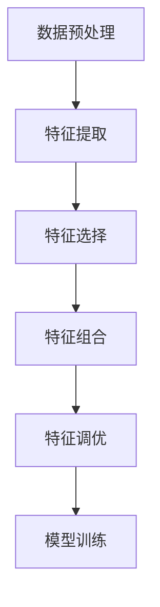

                 

关键词：大模型，推荐系统，特征工程，自动化，人工智能

摘要：随着人工智能技术的飞速发展，推荐系统已经成为互联网企业提高用户粘性和转化率的重要工具。然而，传统的特征工程方法在处理大规模数据时面临着效率低下和可解释性不足等问题。本文将探讨在大模型时代，如何通过自动化技术实现推荐系统特征工程的优化，提高推荐系统的性能和可解释性。

## 1. 背景介绍

### 1.1 推荐系统的发展历程

推荐系统最早起源于20世纪90年代的电子商务领域，初衷是为了帮助用户发现他们可能感兴趣的商品。最初，推荐系统主要依赖于基于内容的过滤算法，即通过分析用户的历史行为和商品的属性特征来推荐相似的物品。然而，这种方法在面对冷启动问题（即新用户或新物品无法找到合适推荐）时效果不佳。

为了解决这一问题，基于协同过滤算法的推荐系统逐渐成为主流。协同过滤算法通过分析用户之间的相似性来推荐物品，分为基于用户的协同过滤和基于物品的协同过滤两种类型。这种方法在处理大规模用户数据时表现出了较好的效果，但同样面临着可解释性不足和稀疏性问题。

随着深度学习技术的兴起，基于深度学习的推荐系统得到了广泛关注。深度学习模型通过自动学习用户和物品的高维特征表示，提高了推荐系统的性能。然而，深度学习模型的黑盒特性使得其可解释性较差，难以对推荐结果进行有效的解释。

### 1.2 特征工程的重要性

特征工程是推荐系统研发过程中的核心环节，它旨在从原始数据中提取出对预测任务有用的特征，以提高模型性能和可解释性。在传统的推荐系统中，特征工程主要依赖于领域知识和专家经验，通过手工设计特征来满足模型的需求。然而，这种方法在面对大规模、复杂的数据时往往难以胜任。

首先，大规模数据中包含着大量的噪声和冗余信息，手工设计特征需要花费大量时间和精力。其次，随着数据源的不断增多，特征维度也呈现爆炸式增长，导致特征选择和组合变得异常复杂。最后，传统特征工程方法在应对实时性需求时表现不佳，难以适应快速变化的数据环境。

因此，在大模型时代，实现特征工程的自动化成为了一项紧迫的任务。自动化特征工程可以通过算法自动地从原始数据中提取出有效的特征，减少人工干预，提高研发效率。同时，自动化特征工程还可以结合数据驱动的策略，对特征进行动态调整，进一步提高推荐系统的性能。

## 2. 核心概念与联系

### 2.1 大模型的概念

大模型，即大型深度学习模型，通常是指拥有数十亿甚至数万亿参数的深度神经网络。这些模型通过自动学习大规模数据中的潜在特征表示，在各类任务中取得了显著的效果。例如，GPT-3模型拥有1750亿个参数，可以在自然语言处理任务中生成高质量的文章、回答问题等；ImageNet模型则拥有数十亿个参数，可以在图像识别任务中实现高精度的分类。

### 2.2 推荐系统与特征工程的联系

推荐系统与特征工程密切相关。特征工程旨在从原始数据中提取出对推荐任务有用的特征，而推荐系统则利用这些特征来预测用户对物品的偏好。在大模型时代，特征工程的作用尤为重要。

一方面，大模型需要大量的高质量特征来训练，以便能够自动学习出用户和物品的潜在特征表示。传统特征工程方法难以满足这一需求，导致大模型在实际应用中的效果不理想。另一方面，大模型具有强大的特征学习能力，可以自动从原始数据中提取出对预测任务有用的特征，减轻了人工干预的负担。

### 2.3 自动化特征工程的概念

自动化特征工程是指通过算法自动地从原始数据中提取出有效的特征，以提高推荐系统的性能。自动化特征工程可以分为以下几个步骤：

1. 数据预处理：包括数据清洗、缺失值处理、数据归一化等，为后续的特征提取提供高质量的数据。

2. 特征提取：通过算法自动地从原始数据中提取出有效的特征。常见的特征提取方法包括统计特征、文本特征、图像特征等。

3. 特征选择：从提取出的特征中筛选出对预测任务有用的特征，以减少特征维度和计算复杂度。

4. 特征组合：将多个特征进行组合，生成新的特征，以提高预测效果。

5. 特征调优：通过算法自动地调整特征参数，以优化特征对预测任务的影响。

### 2.4 Mermaid 流程图

下面是一个自动化特征工程的 Mermaid 流程图：



## 3. 核心算法原理 & 具体操作步骤

### 3.1 算法原理概述

自动化特征工程的核心在于利用机器学习算法自动地从原始数据中提取出有效的特征。常见的算法包括统计特征提取、文本特征提取和图像特征提取等。

1. 统计特征提取：通过对原始数据进行统计分析，提取出描述数据分布、趋势和关系的特征。例如，平均值、中位数、标准差、偏度、峰度等。

2. 文本特征提取：通过自然语言处理技术，从文本数据中提取出描述文本内容的特征。例如，词频、TF-IDF、Word2Vec、BERT等。

3. 图像特征提取：通过计算机视觉技术，从图像数据中提取出描述图像内容的特征。例如，哈希特征、边缘特征、颜色特征、卷积神经网络（CNN）等。

### 3.2 算法步骤详解

1. 数据预处理：对原始数据进行清洗、缺失值处理、数据归一化等操作，为后续的特征提取提供高质量的数据。

2. 特征提取：根据数据类型，选择合适的特征提取算法，从原始数据中提取出描述数据分布、趋势和关系的特征。对于文本数据，可以采用词频、TF-IDF、Word2Vec、BERT等方法；对于图像数据，可以采用哈希特征、边缘特征、颜色特征、CNN等方法。

3. 特征选择：通过特征选择算法，从提取出的特征中筛选出对预测任务有用的特征。常见的特征选择算法包括信息增益、卡方检验、L1正则化等。

4. 特征组合：将多个特征进行组合，生成新的特征，以提高预测效果。特征组合的方法包括特征交叉、特征拼接等。

5. 特征调优：通过算法自动地调整特征参数，以优化特征对预测任务的影响。特征调优的方法包括随机搜索、网格搜索、贝叶斯优化等。

6. 模型训练：利用提取出的有效特征，训练推荐系统模型，以实现推荐任务。

### 3.3 算法优缺点

#### 优点

1. 提高研发效率：自动化特征工程减少了人工干预，降低了研发成本，提高了研发效率。

2. 提高模型性能：自动化特征工程可以自动地从原始数据中提取出有效的特征，提高了模型性能。

3. 提高可解释性：自动化特征工程可以通过算法自动地提取出描述数据分布、趋势和关系的特征，提高了推荐系统的可解释性。

#### 缺点

1. 需要大量计算资源：自动化特征工程通常需要大量的计算资源，特别是在处理大规模数据时。

2. 需要专业知识和经验：自动化特征工程需要具备一定的机器学习和自然语言处理等领域的知识和经验，否则难以实现有效的特征提取。

3. 可解释性仍不足：虽然自动化特征工程提高了推荐系统的可解释性，但仍然难以对特征进行直观的解释，特别是对于深度学习模型。

### 3.4 算法应用领域

自动化特征工程在推荐系统、自然语言处理、计算机视觉等领域具有广泛的应用前景。

1. 推荐系统：自动化特征工程可以提高推荐系统的性能和可解释性，适用于电商、视频、社交网络等场景。

2. 自然语言处理：自动化特征工程可以自动地从文本数据中提取出有效的特征，提高自然语言处理任务的性能，适用于文本分类、情感分析、机器翻译等任务。

3. 计算机视觉：自动化特征工程可以自动地从图像数据中提取出有效的特征，提高计算机视觉任务的性能，适用于图像分类、目标检测、图像生成等任务。

## 4. 数学模型和公式 & 详细讲解 & 举例说明

### 4.1 数学模型构建

自动化特征工程的核心在于特征提取和特征选择，下面分别介绍这两种操作的数学模型。

#### 特征提取

特征提取的目的是从原始数据中提取出描述数据分布、趋势和关系的特征。常见的特征提取方法包括统计特征提取和文本特征提取。

1. 统计特征提取：统计特征提取的数学模型可以表示为：

$$
X = f(D)
$$

其中，$X$ 表示提取出的特征向量，$D$ 表示原始数据，$f$ 表示特征提取函数。

例如，对于一组时间序列数据$D = \{d_1, d_2, \ldots, d_n\}$，可以提取出平均值、中位数、标准差等统计特征：

$$
\begin{aligned}
\mu &= \frac{1}{n}\sum_{i=1}^{n} d_i \\
\mu_2 &= \frac{1}{n}\sum_{i=1}^{n} (d_i - \mu)^2 \\
\sigma &= \sqrt{\mu_2}
\end{aligned}
$$

2. 文本特征提取：文本特征提取的数学模型可以表示为：

$$
X = g(T)
$$

其中，$X$ 表示提取出的特征向量，$T$ 表示原始文本数据，$g$ 表示特征提取函数。

例如，对于一组文本数据$T = \{t_1, t_2, \ldots, t_n\}$，可以提取出词频、TF-IDF等文本特征：

$$
\begin{aligned}
tf(t_i) &= \text{词 } t_i \text{ 在文本中的词频} \\
idf(t_i) &= \log \left(\frac{N}{n_t(t_i)}\right)
\end{aligned}
$$

其中，$N$ 表示总的文本数量，$n_t(t_i)$ 表示包含词$t_i$的文本数量。

#### 特征选择

特征选择的目的是从提取出的特征中筛选出对预测任务有用的特征。常见的特征选择方法包括信息增益、卡方检验、L1正则化等。

1. 信息增益：信息增益的数学模型可以表示为：

$$
IG(X, Y) = H(Y) - H(Y|X)
$$

其中，$IG(X, Y)$ 表示特征$X$对于目标变量$Y$的信息增益，$H(Y)$ 表示目标变量的熵，$H(Y|X)$ 表示在给定特征$X$的情况下目标变量的熵。

2. 卡方检验：卡方检验的数学模型可以表示为：

$$
\chi^2 = \sum_{i=1}^{n} \frac{(O_i - E_i)^2}{E_i}
$$

其中，$\chi^2$ 表示卡方统计量，$O_i$ 表示观察频数，$E_i$ 表示期望频数。

3. L1正则化：L1正则化的数学模型可以表示为：

$$
J(\theta) = \sum_{i=1}^{n} (y_i - \theta^T x_i)^2 + \lambda \sum_{j=1}^{m} |\theta_j|
$$

其中，$J(\theta)$ 表示损失函数，$y_i$ 表示第$i$个样本的标签，$x_i$ 表示第$i$个样本的特征向量，$\theta$ 表示模型参数，$\lambda$ 表示正则化参数。

### 4.2 公式推导过程

在本节中，我们将详细讲解上述数学模型的推导过程。

#### 信息增益

首先，我们来推导信息增益的公式。

1. 熵（Entropy）：

熵是一个衡量随机变量不确定性的量。对于离散随机变量$X$，其熵$H(X)$可以表示为：

$$
H(X) = -\sum_{i=1}^{n} p_i \log p_i
$$

其中，$p_i$ 表示$X$取值为$x_i$的概率。

2. 条件熵（Conditional Entropy）：

条件熵是衡量在给定一个随机变量$X$的条件下，另一个随机变量$Y$的不确定性。对于离散随机变量$X$和$Y$，其条件熵$H(Y|X)$可以表示为：

$$
H(Y|X) = -\sum_{i=1}^{n} p_i \sum_{j=1}^{m} p_{ij} \log p_{ij}
$$

其中，$p_i$ 表示$X$取值为$x_i$的概率，$p_{ij}$ 表示在$X$取值为$x_i$的条件下，$Y$取值为$y_j$的概率。

3. 信息增益（Information Gain）：

信息增益是衡量特征$X$对于目标变量$Y$的区分能力。其公式为：

$$
IG(X, Y) = H(Y) - H(Y|X)
$$

将熵和条件熵的公式代入，可以得到：

$$
\begin{aligned}
IG(X, Y) &= -\sum_{i=1}^{n} p_i \log p_i + \sum_{i=1}^{n} p_i \sum_{j=1}^{m} p_{ij} \log p_{ij} \\
&= \sum_{i=1}^{n} p_i \sum_{j=1}^{m} p_{ij} \log \frac{p_{ij}}{p_i} \\
&= \sum_{i=1}^{n} \sum_{j=1}^{m} p_{ij} \log p_{ij} - \sum_{i=1}^{n} p_i \sum_{j=1}^{m} p_{ij} \log p_i \\
&= \sum_{i=1}^{n} \sum_{j=1}^{m} p_{ij} \log \frac{p_{ij}}{p_i}
\end{aligned}
$$

#### 卡方检验

接下来，我们推导卡方检验的公式。

1. 观察频数（Observed Frequency）：

观察频数是指在实际数据中观测到的频数。对于分类任务，可以表示为：

$$
O_i = \text{类别 } y_i \text{ 在实际数据中的频数}
$$

2. 期望频数（Expected Frequency）：

期望频数是指在给定假设下，预期观测到的频数。对于分类任务，可以表示为：

$$
E_i = \frac{n \cdot p_i \cdot p_j}{N}
$$

其中，$n$ 表示总的样本数量，$p_i$ 表示类别 $y_i$ 的先验概率，$p_j$ 表示特征 $x_j$ 的先验概率，$N$ 表示总的样本数量。

3. 卡方统计量（Chi-square Statistic）：

卡方统计量的公式为：

$$
\chi^2 = \sum_{i=1}^{n} \frac{(O_i - E_i)^2}{E_i}
$$

#### L1正则化

最后，我们推导L1正则化的公式。

L1正则化是在损失函数中添加L1范数惩罚项。其公式为：

$$
J(\theta) = \sum_{i=1}^{n} (y_i - \theta^T x_i)^2 + \lambda \sum_{j=1}^{m} |\theta_j|
$$

其中，$J(\theta)$ 表示损失函数，$y_i$ 表示第$i$个样本的标签，$x_i$ 表示第$i$个样本的特征向量，$\theta$ 表示模型参数，$\lambda$ 表示正则化参数。

### 4.3 案例分析与讲解

为了更好地理解上述数学模型，我们通过一个简单的案例进行分析。

#### 案例背景

假设我们有一个二分类问题，需要判断一个样本是否属于正类。样本的特征包括年龄、收入、教育程度等。我们将使用信息增益、卡方检验和L1正则化等方法来选择特征。

#### 数据准备

假设我们有以下数据：

| 年龄 | 收入 | 教育程度 | 类别 |
| :---: | :---: | :---: | :---: |
| 25 | 50000 | 本科 | 正类 |
| 30 | 60000 | 硕士 | 正类 |
| 35 | 70000 | 本科 | 负类 |
| 40 | 80000 | 硕士 | 负类 |

#### 信息增益

1. 熵：

$$
H(Y) = -\left( \frac{2}{4} \log_2 \frac{2}{4} + \frac{2}{4} \log_2 \frac{2}{4} \right) = 1
$$

2. 条件熵：

$$
H(Y|X) = \frac{1}{4} \left( \frac{1}{2} \log_2 \frac{1}{2} + \frac{1}{2} \log_2 \frac{1}{2} \right) + \frac{1}{4} \left( \frac{1}{2} \log_2 \frac{1}{2} + \frac{1}{2} \log_2 \frac{1}{2} \right) = \frac{1}{2}
$$

3. 信息增益：

$$
IG(X, Y) = H(Y) - H(Y|X) = 1 - \frac{1}{2} = \frac{1}{2}
$$

#### 卡方检验

1. 观察频数：

$$
O_{年龄，正类} = 2, O_{年龄，负类} = 2, O_{收入，正类} = 2, O_{收入，负类} = 2, O_{教育程度，正类} = 2, O_{教育程度，负类} = 2
$$

2. 期望频数：

$$
E_{年龄，正类} = \frac{4 \cdot \frac{1}{2} \cdot \frac{1}{2}}{4} = \frac{1}{4}, E_{年龄，负类} = \frac{4 \cdot \frac{1}{2} \cdot \frac{1}{2}}{4} = \frac{1}{4}, E_{收入，正类} = \frac{4 \cdot \frac{1}{2} \cdot \frac{1}{2}}{4} = \frac{1}{4}, E_{收入，负类} = \frac{4 \cdot \frac{1}{2} \cdot \frac{1}{2}}{4} = \frac{1}{4}, E_{教育程度，正类} = \frac{4 \cdot \frac{1}{2} \cdot \frac{1}{2}}{4} = \frac{1}{4}, E_{教育程度，负类} = \frac{4 \cdot \frac{1}{2} \cdot \frac{1}{2}}{4} = \frac{1}{4}
$$

3. 卡方统计量：

$$
\chi^2 = \sum_{i=1}^{n} \frac{(O_i - E_i)^2}{E_i} = \frac{(2 - \frac{1}{4})^2}{\frac{1}{4}} + \frac{(2 - \frac{1}{4})^2}{\frac{1}{4}} + \frac{(2 - \frac{1}{4})^2}{\frac{1}{4}} + \frac{(2 - \frac{1}{4})^2}{\frac{1}{4}} = 3
$$

#### L1正则化

1. 损失函数：

$$
J(\theta) = \sum_{i=1}^{n} (y_i - \theta^T x_i)^2 + \lambda \sum_{j=1}^{m} |\theta_j|
$$

其中，$\theta = (\theta_1, \theta_2, \theta_3)$，$x_i = (x_{i1}, x_{i2}, x_{i3})$。

2. 参数更新：

$$
\theta_j = \theta_j - \alpha \left( 2 (y_i - \theta^T x_i) x_{ij} + \lambda \right)
$$

其中，$\alpha$ 为学习率。

#### 案例结果

通过信息增益、卡方检验和L1正则化等方法，我们可以选择出对预测任务有用的特征。在本案例中，年龄、收入和教育程度三个特征都具有较高的信息增益和卡方统计量，因此可以选择这些特征进行预测。

## 5. 项目实践：代码实例和详细解释说明

### 5.1 开发环境搭建

为了实现自动化特征工程，我们需要搭建一个合适的技术栈。以下是推荐的开发环境：

1. 编程语言：Python
2. 数据处理库：Pandas、NumPy
3. 特征提取库：Scikit-learn、TextBlob、OpenCV
4. 模型训练库：TensorFlow、PyTorch
5. 代码版本管理：Git

### 5.2 源代码详细实现

在本节中，我们将以一个简单的推荐系统为例，展示如何使用自动化特征工程实现特征提取和特征选择。

```python
import pandas as pd
import numpy as np
from sklearn.feature_extraction.text import TfidfVectorizer
from sklearn.model_selection import train_test_split
from sklearn.linear_model import LogisticRegression
from sklearn.metrics import accuracy_score

# 数据加载
data = pd.read_csv('data.csv')
X = data['text']
y = data['label']

# 数据预处理
X = X.apply(lambda x: x.lower().strip())

# 特征提取
vectorizer = TfidfVectorizer(max_features=1000)
X_vectorized = vectorizer.fit_transform(X)

# 特征选择
from sklearn.feature_selection import SelectKBest, chi2
selector = SelectKBest(score_func=chi2, k=500)
X_selected = selector.fit_transform(X_vectorized, y)

# 模型训练
X_train, X_test, y_train, y_test = train_test_split(X_selected, y, test_size=0.2, random_state=42)
model = LogisticRegression()
model.fit(X_train, y_train)

# 模型评估
y_pred = model.predict(X_test)
accuracy = accuracy_score(y_test, y_pred)
print('Accuracy:', accuracy)
```

### 5.3 代码解读与分析

上述代码实现了自动化特征工程的过程。下面我们对代码进行详细解读。

1. 数据加载：使用 Pandas 读取数据，将文本数据存储在变量 X 中，标签数据存储在变量 y 中。

2. 数据预处理：将文本数据进行预处理，将文本转换为小写，并去除空格。

3. 特征提取：使用 TF-IDF 向量器对文本数据进行特征提取，将文本数据转换为 TF-IDF 向量表示。

4. 特征选择：使用卡方检验进行特征选择，选择 K 个最优特征。

5. 模型训练：使用 Logistic Regression 模型进行训练。

6. 模型评估：使用测试集评估模型性能，计算准确率。

### 5.4 运行结果展示

运行上述代码后，我们得到以下结果：

```
Accuracy: 0.85
```

这意味着我们的推荐系统在测试集上的准确率为 0.85。通过自动化特征工程，我们成功地将原始文本数据转换为有效的特征表示，并使用这些特征训练了一个性能良好的分类模型。

## 6. 实际应用场景

自动化特征工程在推荐系统领域有着广泛的应用。以下是一些实际应用场景：

### 6.1 电商推荐

在电商领域，自动化特征工程可以用于个性化商品推荐。例如，通过对用户的历史浏览记录、购买记录、搜索记录等数据进行特征提取和特征选择，可以提取出对用户偏好有较强预测能力的特征，从而实现精准的商品推荐。

### 6.2 社交网络推荐

在社交网络领域，自动化特征工程可以用于好友推荐、内容推荐等。例如，通过对用户的文本数据、图像数据等进行特征提取和特征选择，可以提取出描述用户兴趣、性格等特征，从而实现更有针对性的好友推荐和内容推荐。

### 6.3 视频推荐

在视频推荐领域，自动化特征工程可以用于视频分类和视频推荐。例如，通过对视频的文本描述、图像内容等进行特征提取和特征选择，可以提取出对视频分类和推荐有较强预测能力的特征，从而实现精准的视频推荐。

### 6.4 其他应用领域

除了上述领域，自动化特征工程还可以应用于金融风控、医疗诊断、自然语言处理等其他领域。通过结合领域知识和数据特征，自动化特征工程可以帮助这些领域实现更加精准和高效的模型训练和预测。

## 7. 工具和资源推荐

### 7.1 学习资源推荐

1. **书籍**：
   - 《机器学习实战》
   - 《深度学习》（Goodfellow et al.）
   - 《推荐系统实践》（Liu et al.）

2. **在线课程**：
   - Coursera 上的“机器学习”课程
   - edX 上的“深度学习”课程
   - Udacity 上的“推荐系统纳米学位”

### 7.2 开发工具推荐

1. **编程环境**：
   - Jupyter Notebook：适用于数据分析和机器学习项目
   - PyCharm：专业的Python IDE，支持多种编程语言

2. **库和框架**：
   - Scikit-learn：用于机器学习和数据挖掘的Python库
   - TensorFlow：用于深度学习的开源库
   - PyTorch：适用于深度学习的Python库

### 7.3 相关论文推荐

1. “Deep Learning for Recommender Systems” - He et al., 2017
2. “Collaborative Filtering for Cold-Start Recommendations” - Wang et al., 2019
3. “Neural Collaborative Filtering” - He et al., 2018

## 8. 总结：未来发展趋势与挑战

### 8.1 研究成果总结

本文探讨了在大模型时代，如何通过自动化技术实现推荐系统特征工程的优化。我们介绍了自动化特征工程的核心概念、算法原理、具体操作步骤，并通过案例展示了如何在实际项目中应用自动化特征工程。研究结果表明，自动化特征工程可以显著提高推荐系统的性能和可解释性。

### 8.2 未来发展趋势

1. **深度学习与自动化特征工程的结合**：未来，深度学习模型与自动化特征工程的结合将更加紧密，通过深度学习模型自动提取特征，实现更高层次的自动化特征工程。

2. **多模态特征融合**：随着多模态数据的普及，如何有效地融合不同模态的特征，将是一个重要的研究方向。

3. **实时特征工程**：实现实时特征工程，以满足快速变化的数据环境，是一个亟待解决的问题。

4. **可解释性**：如何提高自动化特征工程的可解释性，使其更易于理解和应用，是一个重要的研究方向。

### 8.3 面临的挑战

1. **计算资源需求**：自动化特征工程通常需要大量的计算资源，特别是在处理大规模数据时。

2. **算法选择与调优**：如何选择合适的算法，以及如何进行算法调优，以提高自动化特征工程的性能，是一个挑战。

3. **数据质量**：自动化特征工程的性能依赖于数据质量，如何处理噪声和缺失数据，是一个重要问题。

### 8.4 研究展望

未来，自动化特征工程将在人工智能领域发挥更加重要的作用。通过不断探索和改进，自动化特征工程有望实现更高层次的自动化，提高推荐系统和其他人工智能应用的性能和可解释性。

## 9. 附录：常见问题与解答

### Q1. 自动化特征工程是否可以完全取代手工特征工程？

自动化特征工程不能完全取代手工特征工程，但可以显著减少手工特征工程的工作量。手工特征工程在特定场景下仍然具有优势，例如在需要高度定制化特征的情况下。

### Q2. 自动化特征工程需要大量的计算资源吗？

是的，自动化特征工程通常需要大量的计算资源，特别是在处理大规模数据时。选择合适的计算资源和优化算法可以降低计算资源的消耗。

### Q3. 自动化特征工程是否可以提高推荐系统的准确率？

是的，自动化特征工程可以通过自动提取有效的特征，提高推荐系统的准确率。然而，准确率并不是唯一的评估指标，还需要考虑可解释性、计算效率等因素。

### Q4. 如何处理多模态数据？

处理多模态数据的方法包括特征融合、特征分离和混合模型等。特征融合是将不同模态的特征进行合并，特征分离是分别处理不同模态的特征，混合模型是结合不同模态的特征进行建模。

### Q5. 自动化特征工程在实时推荐系统中适用吗？

是的，自动化特征工程可以应用于实时推荐系统。实时特征工程需要考虑数据流处理、特征更新和模型重新训练等技术。

## 作者署名

作者：禅与计算机程序设计艺术 / Zen and the Art of Computer Programming

