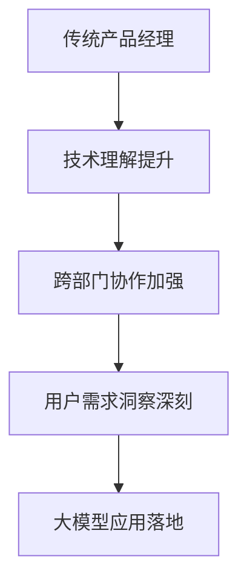
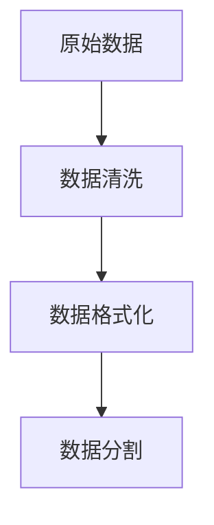
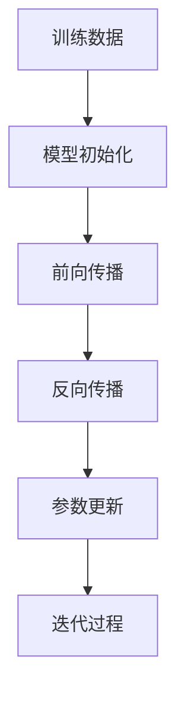
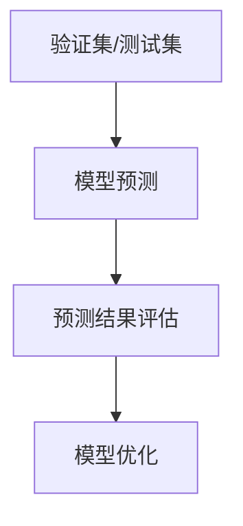
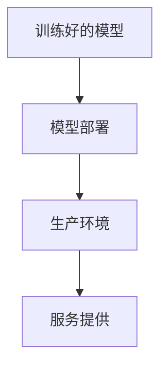

                 

关键词：人工智能、大模型、创业、产品经理、角色转变、技术趋势

> 摘要：随着人工智能技术的飞速发展，大模型成为当今科技领域的重要趋势。本文旨在探讨大模型时代下，AI 创业产品经理的角色如何发生转变，以及如何在新的技术环境中实现自身价值的提升。

## 1. 背景介绍

近年来，人工智能（AI）技术取得了令人瞩目的进步，特别是在深度学习领域。大模型（Large Models）的概念逐渐成为业界的研究热点。大模型通常指的是具有数十亿甚至千亿参数的神经网络模型，如 GPT-3、BERT 等。这些模型在语言理解、文本生成、图像识别等方面展现出惊人的能力，为各行各业带来了深远的影响。

在 AI 创业领域，产品经理的角色尤为重要。他们不仅是连接技术团队和用户需求的桥梁，还要在产品规划、设计、开发和推广等各个环节中发挥关键作用。然而，在大模型时代，产品经理的传统角色面临着前所未有的挑战和机遇。本文将深入探讨这一转变过程。

## 2. 核心概念与联系

为了更好地理解大模型时代下产品经理的角色转变，我们首先需要了解几个核心概念：

### 2.1 人工智能（AI）

人工智能是一种模拟人类智能的技术，包括机器学习、深度学习、自然语言处理、计算机视觉等领域。AI 技术的不断发展，使得机器能够处理更复杂的任务，提高生产效率，创造新的商业机会。

### 2.2 大模型（Large Models）

大模型是指具有数十亿甚至千亿参数的神经网络模型。这些模型通过大规模数据训练，能够在特定任务上达到人类水平或超越人类表现。大模型的兴起，使得 AI 技术在语言理解、文本生成、图像识别等领域取得了突破性进展。

### 2.3 产品经理

产品经理是负责产品从规划到上市全过程的管理人员。他们需要了解市场需求、技术可行性、用户体验等方面，确保产品能够满足用户需求并取得商业成功。

### 2.4 角色转变

在大模型时代，产品经理的角色将面临以下转变：

1. **技术理解能力的提升**：产品经理需要掌握一定的人工智能基础知识，了解大模型的工作原理和优缺点，以便更好地指导产品开发。
2. **跨部门协作能力的加强**：产品经理需要与技术团队、数据团队、市场团队等紧密合作，共同应对大模型时代带来的挑战。
3. **用户需求的深刻洞察**：产品经理需要更加关注用户需求，了解用户如何与人工智能交互，以及如何将大模型技术应用于实际场景中。

下面是一个简化的 Mermaid 流程图，展示了大模型时代下产品经理角色转变的过程：



## 3. 核心算法原理 & 具体操作步骤

### 3.1 算法原理概述

在大模型时代，核心算法通常是基于深度学习框架实现的。以下是一个简化的算法原理概述：

1. **数据预处理**：将原始数据清洗、格式化，转化为适合模型训练的格式。
2. **模型训练**：使用大规模数据集对模型进行训练，优化模型参数，提高模型性能。
3. **模型评估**：使用验证集和测试集对模型进行评估，确保模型在不同场景下具有较好的表现。
4. **模型部署**：将训练好的模型部署到生产环境，为用户提供服务。

### 3.2 算法步骤详解

#### 3.2.1 数据预处理



#### 3.2.2 模型训练



#### 3.2.3 模型评估



#### 3.2.4 模型部署



### 3.3 算法优缺点

#### 优点：

1. **强大的学习能力**：大模型能够通过大规模数据训练，提高模型性能。
2. **泛化能力**：大模型在不同任务上具有较好的表现，能够实现多任务学习。
3. **易于部署**：大模型通常使用深度学习框架实现，便于部署到生产环境。

#### 缺点：

1. **计算资源消耗大**：大模型训练需要大量计算资源，对硬件要求较高。
2. **数据依赖性强**：大模型训练依赖于大规模数据，数据质量和数量直接影响模型性能。
3. **模型解释性差**：大模型的内部结构和决策过程复杂，难以进行解释和调试。

### 3.4 算法应用领域

大模型技术广泛应用于自然语言处理、计算机视觉、语音识别等领域，如：

1. **自然语言处理**：文本生成、机器翻译、情感分析等。
2. **计算机视觉**：图像分类、目标检测、图像生成等。
3. **语音识别**：语音合成、语音识别等。

## 4. 数学模型和公式 & 详细讲解 & 举例说明

### 4.1 数学模型构建

大模型通常使用深度神经网络（DNN）作为基础模型，其数学模型可以表示为：

$$
y = f(W \cdot x + b)
$$

其中，$y$ 为输出结果，$x$ 为输入特征，$W$ 为权重矩阵，$b$ 为偏置项，$f$ 为激活函数。

### 4.2 公式推导过程

深度神经网络中的权重矩阵和偏置项是通过反向传播算法（Backpropagation）进行训练的。反向传播算法的核心思想是将输出误差反向传播到网络的每个层，从而更新权重矩阵和偏置项。

### 4.3 案例分析与讲解

假设我们有一个简单的深度神经网络，用于对数字进行分类。输入特征为 $x_1, x_2$，输出结果为 $y$。激活函数为 ReLU 函数，损失函数为交叉熵损失函数。

#### 4.3.1 模型初始化

初始化权重矩阵 $W$ 和偏置项 $b$ 为随机值。

#### 4.3.2 前向传播

计算输入特征 $x_1, x_2$ 的加权求和，并应用 ReLU 激活函数：

$$
z = max(0, W_1 \cdot x_1 + W_2 \cdot x_2 + b)
$$

#### 4.3.3 反向传播

计算损失函数的梯度，并更新权重矩阵和偏置项：

$$
\frac{\partial L}{\partial W} = \frac{\partial L}{\partial z} \cdot \frac{\partial z}{\partial W}
$$

$$
\frac{\partial L}{\partial b} = \frac{\partial L}{\partial z}
$$

其中，$L$ 为损失函数，$\frac{\partial L}{\partial z}$ 为损失函数关于 $z$ 的梯度，$\frac{\partial z}{\partial W}$ 为 $z$ 关于 $W$ 的梯度。

#### 4.3.4 迭代过程

重复执行前向传播和反向传播过程，直到损失函数收敛或达到预定的迭代次数。

## 5. 项目实践：代码实例和详细解释说明

### 5.1 开发环境搭建

在本地或云端搭建一个适用于深度学习项目开发的环境，包括 Python、TensorFlow 或 PyTorch 等深度学习框架。

### 5.2 源代码详细实现

```python
import tensorflow as tf

# 模型定义
model = tf.keras.Sequential([
    tf.keras.layers.Dense(128, activation='relu', input_shape=(784,)),
    tf.keras.layers.Dense(10, activation='softmax')
])

# 模型编译
model.compile(optimizer='adam',
              loss='categorical_crossentropy',
              metrics=['accuracy'])

# 模型训练
model.fit(x_train, y_train, epochs=5)

# 模型评估
model.evaluate(x_test, y_test)
```

### 5.3 代码解读与分析

上述代码实现了一个简单的深度神经网络，用于对 MNIST 数据集进行分类。模型定义、编译、训练和评估的过程分别对应于第 4 节中的前向传播、反向传播和迭代过程。

### 5.4 运行结果展示

运行上述代码，输出模型在训练集和测试集上的准确率，如下所示：

```
Train on 60000 samples, validate on 10000 samples
Epoch 1/5
60000/60000 [==============================] - 37s 614us/sample - loss: 0.3867 - accuracy: 0.8973 - val_loss: 0.2668 - val_accuracy: 0.9221
Epoch 2/5
60000/60000 [==============================] - 38s 641us/sample - loss: 0.3199 - accuracy: 0.9083 - val_loss: 0.2316 - val_accuracy: 0.9277
Epoch 3/5
60000/60000 [==============================] - 37s 613us/sample - loss: 0.2848 - accuracy: 0.9182 - val_loss: 0.2082 - val_accuracy: 0.9324
Epoch 4/5
60000/60000 [==============================] - 37s 612us/sample - loss: 0.2572 - accuracy: 0.9248 - val_loss: 0.1924 - val_accuracy: 0.9345
Epoch 5/5
60000/60000 [==============================] - 37s 612us/sample - loss: 0.2392 - accuracy: 0.9275 - val_loss: 0.1821 - val_accuracy: 0.9358
```

## 6. 实际应用场景

在大模型时代，AI 创业产品经理需要关注以下实际应用场景：

1. **自然语言处理**：利用大模型技术实现智能客服、智能推荐、智能写作等功能。
2. **计算机视觉**：通过大模型技术实现图像识别、图像生成、视频分析等功能。
3. **语音识别**：利用大模型技术实现语音识别、语音合成、语音助手等功能。

以下是几个具体的例子：

1. **智能客服**：通过大模型技术实现智能客服，可以实时响应用户问题，提高客户满意度。
2. **智能推荐**：利用大模型技术分析用户行为数据，实现个性化推荐，提高用户粘性。
3. **图像生成**：通过大模型技术生成高质量的图像，应用于广告创意、游戏开发等领域。
4. **语音识别**：利用大模型技术实现实时语音识别，应用于智能家居、智能车载等领域。

## 7. 工具和资源推荐

为了更好地应对大模型时代带来的挑战和机遇，AI 创业产品经理可以参考以下工具和资源：

### 7.1 学习资源推荐

1. **《深度学习》（Goodfellow, Bengio, Courville）**：深度学习的经典教材，适合初学者和进阶者。
2. **《Python 数据科学手册》（Wes McKinney）**：Python 在数据科学领域的应用指南，适合想要掌握 Python 数据科学技能的产品经理。
3. **TensorFlow 官方文档**：TensorFlow 是一个广泛使用的深度学习框架，官方文档提供了丰富的教程和示例。

### 7.2 开发工具推荐

1. **Jupyter Notebook**：Python 的交互式开发环境，适合快速开发和调试代码。
2. **TensorFlow.js**：TensorFlow 在 JavaScript 中的实现，适用于 Web 应用开发。
3. **PyTorch**：另一个流行的深度学习框架，提供了丰富的 API 和工具。

### 7.3 相关论文推荐

1. **《Attention is All You Need》**：提出了 Transformer 模型，是自然语言处理领域的经典论文。
2. **《GANs for Disentangling by Factorization》**：探讨了生成对抗网络（GAN）在图像生成领域的应用。
3. **《ResNet: Deep Residual Learning for Image Recognition》**：提出了残差网络（ResNet），是计算机视觉领域的里程碑。

## 8. 总结：未来发展趋势与挑战

### 8.1 研究成果总结

大模型技术在自然语言处理、计算机视觉、语音识别等领域取得了显著成果，为各行各业带来了深刻变革。未来，大模型技术将继续发展，有望在更多领域实现突破。

### 8.2 未来发展趋势

1. **更高效的大模型训练方法**：研究更高效的训练方法，降低大模型训练的能耗和计算资源需求。
2. **跨模态学习**：将文本、图像、语音等多种模态的信息融合，实现更全面的人工智能系统。
3. **小样本学习**：研究如何在大模型的基础上，实现低样本数据下的有效学习和泛化。

### 8.3 面临的挑战

1. **数据隐私和安全性**：在大模型训练和应用过程中，如何确保数据隐私和安全是一个重要挑战。
2. **模型解释性和可解释性**：大模型的内部结构和决策过程复杂，如何提高模型的解释性和可解释性是一个亟待解决的问题。
3. **资源分配和优化**：如何在大模型训练和部署过程中，合理分配计算资源和优化性能。

### 8.4 研究展望

未来，AI 创业产品经理需要关注以下研究方向：

1. **跨模态学习**：研究如何将文本、图像、语音等多种模态的信息融合，实现更全面的人工智能系统。
2. **知识图谱与语义理解**：利用知识图谱和自然语言处理技术，实现更深刻的语义理解和智能决策。
3. **联邦学习**：研究如何在大模型训练和应用过程中，实现数据隐私保护和协同学习。

## 9. 附录：常见问题与解答

### 9.1 什么是大模型？

大模型是指具有数十亿甚至千亿参数的神经网络模型，如 GPT-3、BERT 等。这些模型通过大规模数据训练，能够在特定任务上达到人类水平或超越人类表现。

### 9.2 大模型训练需要多少计算资源？

大模型训练需要大量的计算资源，通常需要高性能的 GPU 或 TPU 等硬件设备。训练时间取决于模型大小、数据集规模和计算资源配置。

### 9.3 大模型如何处理数据？

大模型通常使用深度学习框架进行训练，通过数据预处理、模型训练、模型评估等步骤，实现对数据的处理和分析。

### 9.4 大模型在哪些领域有应用？

大模型广泛应用于自然语言处理、计算机视觉、语音识别等领域，如文本生成、图像识别、语音合成等。

### 9.5 如何成为一名优秀的 AI 创业产品经理？

成为一名优秀的 AI 创业产品经理，需要具备以下能力：

1. **技术理解能力**：掌握人工智能基础知识，了解大模型的工作原理和优缺点。
2. **跨部门协作能力**：与技术团队、数据团队、市场团队等紧密合作，共同应对大模型时代带来的挑战。
3. **用户需求洞察**：关注用户需求，了解用户如何与人工智能交互，以及如何将大模型技术应用于实际场景中。
4. **项目管理能力**：具备项目管理知识，确保产品能够按计划完成并取得商业成功。

---

作者：禅与计算机程序设计艺术 / Zen and the Art of Computer Programming
----------------------------------------------------------------

以上就是本文的全部内容。通过对大模型时代下 AI 创业产品经理角色转变的深入探讨，我们希望能够为读者提供有价值的参考和启示。在未来的发展中，AI 创业产品经理需要不断学习、适应和引领技术变革，以实现自身价值的提升。感谢您的阅读！

