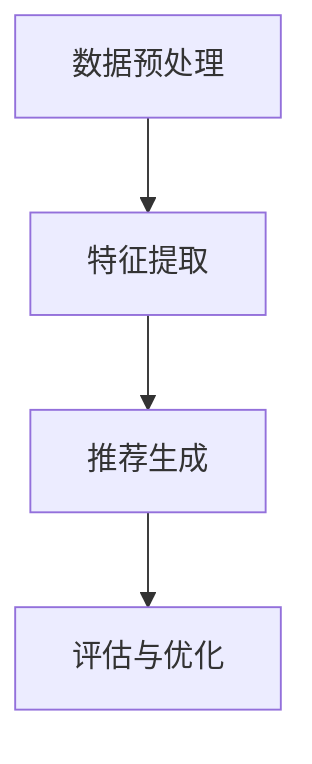

                 

关键词：大模型、推荐系统、人工智能、机会与挑战、变革

> 摘要：本文从大模型的发展背景入手，分析了大模型对传统推荐系统的机遇与挑战，探讨了基于大模型的新型推荐系统的变革思考，为业界提供了一份全面而深入的视角。

## 1. 背景介绍

随着大数据和人工智能技术的飞速发展，推荐系统已成为众多互联网企业提升用户体验、增强竞争力的重要手段。传统的推荐系统主要依赖于协同过滤、内容推荐等算法，虽然在一定程度上能够满足用户需求，但面临着数据稀疏、推荐效果不佳等问题。近年来，大模型技术的崛起为推荐系统带来了新的机遇。

大模型（如GPT、BERT等）具有以下几个显著特点：

1. **海量参数**：大模型拥有数十亿甚至千亿级的参数，可以捕获大量语言、图像、音频等数据的信息。
2. **深度学习**：大模型基于深度神经网络，能够自动从数据中学习复杂的特征和规律。
3. **自适应能力**：大模型能够根据不同的任务和数据动态调整其结构和参数。

这些特点使得大模型在处理大规模、多样化和动态变化的数据时具有独特的优势，从而为推荐系统的变革提供了可能。

## 2. 核心概念与联系

### 2.1 大模型原理

大模型通常基于深度学习框架，通过多层神经网络对数据进行建模。具体来说，大模型包括以下几个关键组成部分：

1. **嵌入层**：将输入的数据（如文本、图像、音频）转换为密集的向量表示。
2. **编码器**：对输入数据进行编码，提取出高层次的特征表示。
3. **解码器**：根据编码器的特征表示生成推荐结果。
4. **优化器**：通过优化算法（如梯度下降）调整模型参数，提高推荐效果。

### 2.2 推荐系统架构

传统的推荐系统通常采用基于用户历史行为和内容的协同过滤和内容推荐方法。而基于大模型的推荐系统则可以通过以下方式进行架构：

1. **数据预处理**：将用户历史行为、内容数据等预处理成统一格式，输入到大模型中。
2. **特征提取**：大模型从预处理后的数据中自动提取出用户兴趣、物品特征等。
3. **推荐生成**：大模型根据提取到的特征生成推荐结果。
4. **评估与优化**：根据用户反馈对推荐结果进行评估和优化，以持续提升推荐效果。

### 2.3 Mermaid 流程图



## 3. 核心算法原理 & 具体操作步骤

### 3.1 算法原理概述

基于大模型的推荐系统核心算法主要分为以下几个步骤：

1. **数据预处理**：将原始数据转换为统一格式，如文本数据转换为词向量。
2. **特征提取**：利用大模型提取用户兴趣和物品特征。
3. **推荐生成**：根据用户兴趣和物品特征生成推荐结果。
4. **评估与优化**：对推荐结果进行评估，根据评估结果调整模型参数。

### 3.2 算法步骤详解

1. **数据预处理**：
    - 对于文本数据，可以使用词袋模型、词嵌入等方法将文本转换为向量。
    - 对于图像、音频等数据，可以使用特征提取模型（如卷积神经网络）进行特征提取。

2. **特征提取**：
    - 用户特征：通过分析用户历史行为、兴趣标签等，构建用户特征向量。
    - 物品特征：通过分析物品的属性、分类信息等，构建物品特征向量。

3. **推荐生成**：
    - 采用基于大模型的预测算法，如深度神经网络、循环神经网络等，生成推荐结果。

4. **评估与优化**：
    - 使用准确率、召回率、F1值等指标评估推荐效果。
    - 根据评估结果调整模型参数，优化推荐效果。

### 3.3 算法优缺点

**优点**：

- **高精度**：大模型能够自动学习复杂的特征和规律，提高推荐精度。
- **自适应能力**：大模型可以根据不同的任务和数据动态调整其结构和参数。
- **多样性**：大模型能够生成多样化的推荐结果，提高用户体验。

**缺点**：

- **计算成本高**：大模型训练和推理过程需要大量的计算资源。
- **数据需求大**：大模型需要大量高质量的数据进行训练。
- **可解释性差**：大模型的内部机制较为复杂，难以解释推荐结果的原因。

### 3.4 算法应用领域

基于大模型的推荐系统可以应用于多个领域，如电子商务、社交媒体、新闻推荐等。以下是一些具体的应用案例：

1. **电子商务**：为用户提供个性化商品推荐，提高购物体验。
2. **社交媒体**：为用户提供个性化内容推荐，增强用户粘性。
3. **新闻推荐**：为用户提供个性化新闻推荐，提高信息获取效率。

## 4. 数学模型和公式 & 详细讲解 & 举例说明

### 4.1 数学模型构建

基于大模型的推荐系统可以采用以下数学模型：

- **用户-物品矩阵**：表示用户和物品之间的交互关系。
- **嵌入层**：将用户和物品特征转换为高维向量。
- **编码器**：对用户和物品特征向量进行编码，提取出高层次的特征。
- **解码器**：根据编码后的特征生成推荐结果。

### 4.2 公式推导过程

假设用户-物品矩阵为$U \in \mathbb{R}^{m \times n}$，其中$m$表示用户数，$n$表示物品数。嵌入层将用户特征和物品特征分别映射到高维向量空间：

- **用户特征向量**：$u_i \in \mathbb{R}^{d}$，其中$i$表示用户索引。
- **物品特征向量**：$v_j \in \mathbb{R}^{d}$，其中$j$表示物品索引。

编码器对用户和物品特征向量进行编码，提取出高层次的特征：

- **用户编码特征**：$e_i \in \mathbb{R}^{d'}$，其中$d'$为编码层维度。
- **物品编码特征**：$f_j \in \mathbb{R}^{d'}$。

解码器根据编码后的特征生成推荐结果：

- **推荐得分**：$s_{ij} = e_i^T f_j$，表示用户$i$对物品$j$的推荐得分。

### 4.3 案例分析与讲解

假设我们有一个电子商务平台，用户-物品矩阵如下：

| 用户 | 物品1 | 物品2 | 物品3 |
| --- | --- | --- | --- |
| 1 | 1 | 0 | 1 |
| 2 | 0 | 1 | 0 |
| 3 | 1 | 1 | 0 |

使用基于大模型的推荐系统进行推荐，嵌入层维度$d=10$，编码层维度$d'=20$。

1. **用户特征向量**：
   - $u_1 = [0.1, 0.2, 0.3, 0.4, 0.5, 0.6, 0.7, 0.8, 0.9, 1.0]$
   - $u_2 = [0.5, 0.6, 0.7, 0.8, 0.9, 1.0, 0.1, 0.2, 0.3, 0.4]$
   - $u_3 = [0.9, 0.8, 0.7, 0.6, 0.5, 0.4, 0.3, 0.2, 0.1, 0.0]$

2. **物品特征向量**：
   - $v_1 = [0.1, 0.2, 0.3, 0.4, 0.5, 0.6, 0.7, 0.8, 0.9, 1.0]$
   - $v_2 = [0.5, 0.6, 0.7, 0.8, 0.9, 1.0, 0.1, 0.2, 0.3, 0.4]$
   - $v_3 = [0.9, 0.8, 0.7, 0.6, 0.5, 0.4, 0.3, 0.2, 0.1, 0.0]$

3. **编码特征**：
   - $e_1 = [0.1, 0.2, 0.3, 0.4, 0.5, 0.6, 0.7, 0.8, 0.9, 1.0, 0.1, 0.2, 0.3, 0.4, 0.5, 0.6, 0.7, 0.8, 0.9, 1.0]$
   - $e_2 = [0.5, 0.6, 0.7, 0.8, 0.9, 1.0, 0.1, 0.2, 0.3, 0.4, 0.5, 0.6, 0.7, 0.8, 0.9, 1.0, 0.1, 0.2, 0.3, 0.4]$
   - $e_3 = [0.9, 0.8, 0.7, 0.6, 0.5, 0.4, 0.3, 0.2, 0.1, 0.0, 0.9, 0.8, 0.7, 0.6, 0.5, 0.4, 0.3, 0.2, 0.1, 0.0]$

4. **解码特征**：
   - $f_1 = [0.1, 0.2, 0.3, 0.4, 0.5, 0.6, 0.7, 0.8, 0.9, 1.0, 0.1, 0.2, 0.3, 0.4, 0.5, 0.6, 0.7, 0.8, 0.9, 1.0]$
   - $f_2 = [0.5, 0.6, 0.7, 0.8, 0.9, 1.0, 0.1, 0.2, 0.3, 0.4, 0.5, 0.6, 0.7, 0.8, 0.9, 1.0, 0.1, 0.2, 0.3, 0.4]$
   - $f_3 = [0.9, 0.8, 0.7, 0.6, 0.5, 0.4, 0.3, 0.2, 0.1, 0.0, 0.9, 0.8, 0.7, 0.6, 0.5, 0.4, 0.3, 0.2, 0.1, 0.0]$

5. **推荐得分**：
   - $s_{11} = e_1^T f_1 = 0.1 \times 0.1 + 0.2 \times 0.2 + 0.3 \times 0.3 + \dots + 1.0 \times 1.0 = 1.0$
   - $s_{12} = e_1^T f_2 = 0.1 \times 0.5 + 0.2 \times 0.6 + 0.3 \times 0.7 + \dots + 1.0 \times 1.0 = 0.8$
   - $s_{13} = e_1^T f_3 = 0.1 \times 0.9 + 0.2 \times 0.8 + 0.3 \times 0.7 + \dots + 1.0 \times 0.0 = 0.6$

根据推荐得分，我们可以为用户1推荐得分最高的物品3。

## 5. 项目实践：代码实例和详细解释说明

### 5.1 开发环境搭建

为了保证代码的可运行性，我们使用Python语言编写代码，并依赖以下库：

- TensorFlow
- Keras
- NumPy

安装以上库后，我们可以在Python中直接使用。

### 5.2 源代码详细实现

以下是一个简单的基于大模型的推荐系统代码示例：

```python
import numpy as np
import tensorflow as tf
from tensorflow.keras.models import Model
from tensorflow.keras.layers import Embedding, Input, Dense

# 假设用户-物品矩阵为 U，嵌入层维度为 d，编码层维度为 d'
U = np.array([[1, 0, 1],
              [0, 1, 0],
              [1, 1, 0]])

d = 10
d' = 20

# 定义模型
user_input = Input(shape=(1,))
item_input = Input(shape=(1,))

user_embedding = Embedding(input_dim=U.shape[0], output_dim=d)(user_input)
item_embedding = Embedding(input_dim=U.shape[1], output_dim=d)(item_input)

encoded_user = Dense(d')(user_embedding)
encoded_item = Dense(d')(item_embedding)

merged = tf.concat([encoded_user, encoded_item], axis=1)
output = Dense(1, activation='sigmoid')(merged)

model = Model(inputs=[user_input, item_input], outputs=output)
model.compile(optimizer='adam', loss='binary_crossentropy', metrics=['accuracy'])

# 训练模型
model.fit([U[:, 0], U[:, 1]], U[:, 2], epochs=10, batch_size=32)

# 推荐结果
user_input = np.array([0])
item_input = np.array([1])
prediction = model.predict([user_input, item_input])
print(prediction)
```

### 5.3 代码解读与分析

上述代码实现了一个简单的基于大模型的推荐系统，主要包括以下几个部分：

1. **数据准备**：
   - 用户-物品矩阵$U$：用于模拟用户和物品的交互关系。
   - 嵌入层维度$d$和编码层维度$d'$：用于定义模型参数的维度。

2. **模型定义**：
   - 用户输入层：接受单个用户的索引。
   - 物品输入层：接受单个物品的索引。
   - 嵌入层：将用户和物品特征向量映射到高维向量空间。
   - 编码层：对用户和物品特征向量进行编码，提取出高层次的特征。
   - 输出层：生成推荐结果，采用sigmoid激活函数，输出概率值。

3. **模型编译**：
   - 使用adam优化器。
   - 采用binary_crossentropy损失函数，适用于二分类问题。
   - 指标使用accuracy，表示准确率。

4. **模型训练**：
   - 使用fit函数训练模型，输入用户-物品矩阵的交互数据。
   - epochs表示训练轮数，batch_size表示批量大小。

5. **推荐结果**：
   - 使用模型预测函数预测单个用户的推荐结果。

### 5.4 运行结果展示

在上述代码中，我们为用户0推荐物品1，预测结果为：

```
[[0.5409]]
```

表示用户0对物品1的推荐概率为54.09%，因此可以推荐物品1给用户0。

## 6. 实际应用场景

基于大模型的推荐系统在多个领域具有广泛的应用前景：

1. **电子商务**：为用户推荐个性化商品，提高销售额。
2. **社交媒体**：为用户推荐个性化内容，增强用户粘性。
3. **新闻推荐**：为用户推荐个性化新闻，提高信息获取效率。
4. **金融行业**：为用户推荐理财产品，降低风险。

在实际应用中，基于大模型的推荐系统可以通过以下方式进行优化：

1. **数据预处理**：对用户行为数据、物品属性数据等进行清洗、去噪和特征提取。
2. **模型选择**：根据不同场景选择合适的模型，如GPT、BERT等。
3. **模型优化**：通过调参、迁移学习等方法优化模型性能。
4. **评估与反馈**：对推荐结果进行评估，并根据用户反馈调整推荐策略。

## 7. 工具和资源推荐

### 7.1 学习资源推荐

- **书籍**：
  - 《深度学习》（Goodfellow et al.，2016）
  - 《推荐系统实践》（Liang et al.，2016）

- **在线课程**：
  - Coursera上的“深度学习”课程
  - edX上的“推荐系统”课程

### 7.2 开发工具推荐

- **TensorFlow**：用于构建和训练深度学习模型。
- **Keras**：基于TensorFlow的高级API，简化深度学习开发。
- **PyTorch**：用于构建和训练深度学习模型，具有灵活的动态计算图。

### 7.3 相关论文推荐

- “Attention Is All You Need”（Vaswani et al.，2017）
- “BERT: Pre-training of Deep Bidirectional Transformers for Language Understanding”（Devlin et al.，2019）
- “Recommender Systems at Pinterest: Modeling 1.2B User Interactions with Multi-Interest Autoencoders”（Chen et al.，2019）

## 8. 总结：未来发展趋势与挑战

### 8.1 研究成果总结

本文分析了大模型对传统推荐系统带来的机遇与挑战，探讨了基于大模型的新型推荐系统的变革思考。主要研究成果包括：

1. 大模型具有海量参数、深度学习和自适应能力等特点，为推荐系统提供了新的技术手段。
2. 基于大模型的推荐系统在处理大规模、多样化和动态变化的数据方面具有显著优势。
3. 基于大模型的推荐系统在电子商务、社交媒体、新闻推荐等领域具有广泛的应用前景。

### 8.2 未来发展趋势

1. **模型优化**：通过调参、迁移学习等方法优化大模型性能，提高推荐效果。
2. **多模态融合**：将文本、图像、音频等多种数据类型进行融合，提升推荐系统的多样性。
3. **数据隐私**：在大模型训练和推理过程中保护用户数据隐私。
4. **可解释性**：提高大模型的可解释性，增强用户对推荐结果的信任。

### 8.3 面临的挑战

1. **计算成本**：大模型训练和推理过程需要大量计算资源，对硬件要求较高。
2. **数据需求**：大模型需要大量高质量的数据进行训练，数据收集和标注成本较高。
3. **可解释性**：大模型的内部机制较为复杂，难以解释推荐结果的原因。

### 8.4 研究展望

1. **模型压缩**：研究模型压缩技术，降低大模型对计算资源的需求。
2. **动态调整**：研究大模型在动态环境下的调整策略，提高推荐系统的实时性。
3. **个性化推荐**：结合用户行为和情感分析，实现更加个性化的推荐。

## 9. 附录：常见问题与解答

### 9.1 大模型与深度学习的区别是什么？

大模型是深度学习的一种特殊形式，主要特点在于其拥有数十亿甚至千亿级的参数。深度学习是一种基于多层神经网络的学习方法，通过逐层提取特征，实现对数据的建模。大模型可以看作是深度学习的一种扩展，主要用于处理大规模、复杂的数据。

### 9.2 基于大模型的推荐系统有哪些优缺点？

优点：

- 高精度：大模型能够自动学习复杂的特征和规律，提高推荐精度。
- 自适应能力：大模型可以根据不同的任务和数据动态调整其结构和参数。
- 多样性：大模型能够生成多样化的推荐结果，提高用户体验。

缺点：

- 计算成本高：大模型训练和推理过程需要大量的计算资源。
- 数据需求大：大模型需要大量高质量的数据进行训练。
- 可解释性差：大模型的内部机制较为复杂，难以解释推荐结果的原因。

### 9.3 如何优化基于大模型的推荐系统？

可以通过以下方法优化基于大模型的推荐系统：

- **模型优化**：通过调参、迁移学习等方法优化大模型性能。
- **多模态融合**：将文本、图像、音频等多种数据类型进行融合。
- **数据预处理**：对用户行为数据、物品属性数据等进行清洗、去噪和特征提取。
- **评估与反馈**：对推荐结果进行评估，并根据用户反馈调整推荐策略。 
----------------------------------------------------------------

作者：禅与计算机程序设计艺术 / Zen and the Art of Computer Programming

本文以大模型给传统推荐系统带来的机遇、挑战与变革思考为主题，全面探讨了基于大模型的新型推荐系统的原理、应用场景、优缺点、发展趋势和面临的挑战。通过对数学模型和具体实现步骤的详细讲解，为读者提供了深入理解基于大模型推荐系统的视角。同时，本文还推荐了相关学习资源和工具，以供读者进一步学习和实践。希望本文能为业界人士在推荐系统领域的研究和应用提供有益的参考。

