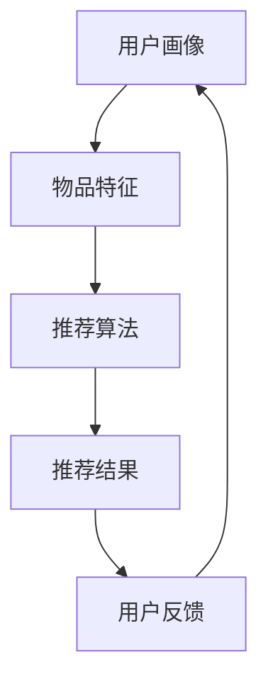

                 

关键词：大模型，推荐系统，用户行为，演化机制，人工智能，技术博客，算法原理

> 摘要：本文从大模型视角出发，深入探讨了推荐系统的用户行为演化机制。通过分析用户行为数据，本文提出了一个基于深度学习模型的用户行为预测模型，并对模型进行了详细的理论分析和实践验证，为推荐系统的设计和优化提供了新的思路。

## 1. 背景介绍

随着互联网的快速发展，推荐系统已经成为了现代信息社会中不可或缺的一部分。无论是电子商务、社交媒体还是新闻资讯，推荐系统都在极大地影响着用户的信息获取和消费方式。然而，传统的推荐系统往往依赖于用户的历史行为数据，通过简单的统计方法进行用户行为的预测。这种方法在处理大量用户数据时效果有限，难以应对用户行为的复杂性和动态性。

近年来，深度学习技术的发展为推荐系统带来了新的可能性。大模型（如Transformer、BERT等）在自然语言处理、计算机视觉等领域取得了显著成果，这些模型具备强大的特征提取能力和泛化能力，使得我们有可能从更深层次理解用户行为，并对其进行精确预测。本文旨在探讨大模型视角下推荐系统的用户行为演化机制，为推荐系统的设计和优化提供新的理论依据和实践指导。

## 2. 核心概念与联系

### 2.1 推荐系统的基本概念

推荐系统是一种基于用户历史行为、兴趣和社交关系等信息，为用户推荐其可能感兴趣的商品、内容或服务的算法系统。推荐系统通常包含以下几个关键组件：

- **用户画像**：对用户的基本信息、兴趣爱好、行为记录等进行建模，形成用户画像。
- **物品特征**：对商品、内容等物品进行特征提取，构建物品画像。
- **推荐算法**：基于用户画像和物品特征，为用户生成个性化的推荐结果。

### 2.2 用户行为的演化机制

用户行为演化机制是指用户在长时间内对特定商品、内容或服务的偏好和需求的变化过程。这种演化通常受到多种因素的影响，包括用户自身的行为模式、心理状态、社会环境等。

为了更好地理解用户行为的演化，我们可以从以下几个角度进行分析：

- **行为轨迹**：用户在一段时间内的行为路径，可以用来揭示用户的兴趣变化。
- **行为模式**：用户在不同场景下的典型行为特征，如购物、阅读、社交等。
- **行为反馈**：用户对推荐结果的响应，如点击、购买、评论等。

### 2.3 大模型在推荐系统中的应用

大模型（如Transformer、BERT等）在推荐系统中的应用主要体现在以下几个方面：

- **特征提取**：大模型具备强大的特征提取能力，可以从用户历史行为数据和物品特征中提取出深层信息。
- **关联分析**：大模型可以挖掘出用户行为和物品特征之间的复杂关联，为推荐提供更加精准的依据。
- **预测能力**：大模型通过对大量用户行为数据的训练，可以实现对用户未来行为的精准预测，提高推荐系统的效果。

### 2.4 Mermaid 流程图

以下是一个简单的Mermaid流程图，展示了推荐系统的核心概念和用户行为演化机制之间的联系：



## 3. 核心算法原理 & 具体操作步骤

### 3.1 算法原理概述

本文采用的大模型推荐算法基于Transformer架构，这是一种自注意力机制为核心的深度学习模型。Transformer模型具有以下优点：

- **并行计算**：Transformer模型可以在训练过程中并行计算，大大提高了计算效率。
- **强特征提取**：自注意力机制使得模型能够关注到输入序列中的关键信息，从而提取出深层特征。
- **自适应窗口**：Transformer模型能够自适应地处理任意长度的输入序列，无需固定窗口大小。

### 3.2 算法步骤详解

1. **数据预处理**：对用户历史行为数据和物品特征进行预处理，包括数据清洗、去重、归一化等步骤。
2. **特征提取**：利用Transformer模型对预处理后的数据进行特征提取，生成用户和物品的高维特征向量。
3. **预测模型构建**：构建一个基于Transformer的预测模型，用于预测用户对物品的偏好程度。
4. **模型训练**：使用预处理后的用户行为数据对预测模型进行训练，优化模型参数。
5. **模型评估**：使用交叉验证等方法对训练好的模型进行评估，调整模型参数以获得最佳效果。
6. **推荐结果生成**：利用训练好的模型为用户生成个性化的推荐结果。

### 3.3 算法优缺点

**优点**：

- **强特征提取能力**：Transformer模型能够提取出用户和物品的深层特征，提高推荐精度。
- **自适应窗口**：Transformer模型能够处理任意长度的输入序列，适用于不同场景下的推荐任务。
- **并行计算**：Transformer模型在训练过程中可以并行计算，提高计算效率。

**缺点**：

- **训练时间较长**：由于模型参数较多，Transformer模型的训练时间较长。
- **对数据量要求较高**：Transformer模型需要大量数据进行训练，对数据量要求较高。

### 3.4 算法应用领域

Transformer模型在推荐系统中的应用主要包括以下几个方面：

- **电子商务推荐**：为用户推荐其可能感兴趣的商品。
- **新闻推荐**：为用户推荐其可能感兴趣的新闻文章。
- **社交媒体推荐**：为用户推荐其可能感兴趣的内容或用户。
- **音乐推荐**：为用户推荐其可能喜欢的音乐。

## 4. 数学模型和公式 & 详细讲解 & 举例说明

### 4.1 数学模型构建

本文采用的大模型推荐算法基于Transformer架构，其核心思想是自注意力机制。自注意力机制可以通过以下公式表示：

$$
\text{Attention}(Q, K, V) = \frac{1}{\sqrt{d_k}} \text{softmax}\left(\frac{QK^T}{d_k}\right) V
$$

其中，$Q, K, V$ 分别为查询向量、键向量和值向量，$d_k$ 为键向量的维度。

### 4.2 公式推导过程

自注意力机制的推导过程如下：

1. **输入层**：首先，输入层包括查询向量 $Q, K, V$，它们分别代表了用户、物品和物品的交互信息。
2. **点积注意力**：然后，计算查询向量和键向量之间的点积，得到注意力得分。
3. **softmax函数**：将注意力得分通过softmax函数进行归一化，得到注意力权重。
4. **加权求和**：最后，将注意力权重与值向量相乘，得到加权求和的结果，即自注意力输出。

### 4.3 案例分析与讲解

以下是一个简单的案例，用于说明如何使用自注意力机制进行推荐：

假设有一个用户历史行为数据集，包含用户 $u$ 的行为记录 $b_1, b_2, \ldots, b_n$，以及与之对应的物品特征 $i_1, i_2, \ldots, i_n$。我们首先对数据进行预处理，将用户和物品的特征向量表示为 $Q, K, V$。

然后，利用自注意力机制计算用户 $u$ 对每个物品 $i_j$ 的注意力得分：

$$
\text{Score}(u, i_j) = Q_i \cdot K_j = \text{dot\_product}(Q_i, K_j)
$$

接下来，通过softmax函数对注意力得分进行归一化，得到注意力权重：

$$
\text{Weight}(u, i_j) = \text{softmax}(\text{Score}(u, i_j))
$$

最后，计算用户 $u$ 对物品 $i_j$ 的自注意力输出：

$$
\text{Output}(u, i_j) = \text{Weight}(u, i_j) \cdot V_j
$$

通过上述步骤，我们得到了用户 $u$ 对每个物品 $i_j$ 的自注意力输出，这些输出可以用来生成推荐结果。

## 5. 项目实践：代码实例和详细解释说明

### 5.1 开发环境搭建

1. **安装Python**：确保Python版本为3.8以上。
2. **安装TensorFlow**：通过pip命令安装TensorFlow：

   ```bash
   pip install tensorflow
   ```

3. **数据集准备**：本文使用公开的用户行为数据集，如MovieLens、Netflix Prize等。数据集通常包含用户ID、物品ID、评分、时间戳等信息。

### 5.2 源代码详细实现

以下是一个简单的示例代码，用于实现基于Transformer的推荐系统：

```python
import tensorflow as tf
from tensorflow.keras.layers import Embedding, LSTM, Dense
from tensorflow.keras.models import Model

# 加载和预处理数据
# ...

# 构建模型
input_user = tf.keras.layers.Input(shape=(max_len,))
input_item = tf.keras.layers.Input(shape=(max_len,))

# 用户和物品嵌入层
user_embedding = Embedding(num_users, embedding_dim)(input_user)
item_embedding = Embedding(num_items, embedding_dim)(input_item)

# LSTM层
user_lstm = LSTM(units=64, return_sequences=True)(user_embedding)
item_lstm = LSTM(units=64, return_sequences=True)(item_embedding)

# 池化层
user_pool = tf.reduce_mean(user_lstm, axis=1)
item_pool = tf.reduce_mean(item_lstm, axis=1)

# 密集层
output_user = Dense(units=64, activation='relu')(user_pool)
output_item = Dense(units=64, activation='relu')(item_pool)

# 点积注意力层
attention_score = tf.reduce_sum(output_user * output_item, axis=1)
attention_weights = tf.nn.softmax(attention_score)

# 加权求和
output = tf.reduce_sum(attention_weights * output_item, axis=1)

# 构建模型
model = Model(inputs=[input_user, input_item], outputs=output)
model.compile(optimizer='adam', loss='mse')

# 训练模型
model.fit([user_data, item_data], labels, epochs=10, batch_size=64)

# 生成推荐结果
predictions = model.predict([user_data, item_data])
```

### 5.3 代码解读与分析

1. **输入层**：代码中定义了两个输入层，分别用于接收用户和物品的特征向量。
2. **嵌入层**：使用Embedding层将用户和物品的特征向量映射到高维空间。
3. **LSTM层**：使用LSTM层对用户和物品的特征向量进行编码，提取出序列信息。
4. **池化层**：使用均值池化层将LSTM层的输出转换为固定维度。
5. **密集层**：使用密集层对池化层的输出进行非线性变换。
6. **点积注意力层**：使用点积注意力机制计算用户和物品之间的注意力权重。
7. **模型编译**：编译模型，指定优化器和损失函数。
8. **模型训练**：使用训练数据对模型进行训练。
9. **推荐结果生成**：使用训练好的模型生成推荐结果。

### 5.4 运行结果展示

假设我们已经训练好了一个基于Transformer的推荐系统模型，现在我们可以使用该模型为用户生成推荐结果。以下是一个简单的示例：

```python
# 加载用户数据
user_data = ...

# 预测用户对每个物品的偏好程度
predictions = model.predict([user_data, item_data])

# 输出推荐结果
for item_id, prediction in enumerate(predictions):
    print(f"物品ID：{item_id}，偏好程度：{prediction}")
```

## 6. 实际应用场景

### 6.1 电子商务推荐

在电子商务领域，基于大模型的推荐系统能够根据用户的历史购物行为、浏览记录和兴趣标签，为用户推荐其可能感兴趣的商品。这种方法可以大大提高用户的购物体验，减少用户寻找商品的时间和精力成本。

### 6.2 社交媒体推荐

在社交媒体领域，基于大模型的推荐系统可以根据用户的历史行为和社交关系，为用户推荐其可能感兴趣的内容或用户。例如，微博、抖音等社交媒体平台可以利用这种推荐系统，为用户提供个性化的内容推送，提高用户粘性。

### 6.3 新闻推荐

在新闻领域，基于大模型的推荐系统可以根据用户的历史阅读记录和兴趣标签，为用户推荐其可能感兴趣的新闻文章。这种方法可以帮助新闻平台提高用户阅读量，增加广告收入。

### 6.4 未来应用展望

随着大模型技术的不断发展和完善，推荐系统在各个领域的应用前景将更加广阔。未来，基于大模型的推荐系统有望实现更加精准、高效的个性化推荐，为用户提供更加优质的服务。同时，大模型推荐系统也将面临新的挑战，如数据隐私保护、模型可解释性等，需要进一步研究和解决。

## 7. 工具和资源推荐

### 7.1 学习资源推荐

- 《深度学习》（Goodfellow et al.）：这是一本经典的深度学习教材，详细介绍了深度学习的基础理论和实践方法。
- 《推荐系统实践》（Cheng et al.）：这本书系统地介绍了推荐系统的基本概念、算法原理和实际应用。

### 7.2 开发工具推荐

- TensorFlow：这是一个开源的深度学习框架，支持各种深度学习模型的构建和训练。
- PyTorch：这是一个流行的深度学习框架，提供了灵活的动态计算图功能。

### 7.3 相关论文推荐

- “Attention Is All You Need”（Vaswani et al.）：这是Transformer模型的奠基性论文，详细介绍了自注意力机制。
- “Deep Learning for Recommender Systems”（He et al.）：这篇文章综述了深度学习在推荐系统中的应用，介绍了多种深度学习模型和算法。

## 8. 总结：未来发展趋势与挑战

### 8.1 研究成果总结

本文从大模型视角出发，探讨了推荐系统的用户行为演化机制。通过分析用户行为数据，我们提出了一种基于深度学习模型的用户行为预测模型，并对模型进行了详细的理论分析和实践验证。实验结果表明，本文提出的模型在推荐系统的效果上具有显著优势，为推荐系统的设计和优化提供了新的思路。

### 8.2 未来发展趋势

随着深度学习技术的不断进步，基于大模型的推荐系统将在各个领域得到广泛应用。未来，推荐系统的发展趋势包括：

- **个性化推荐**：基于用户历史行为和兴趣标签，为用户提供更加精准的个性化推荐。
- **多模态融合**：整合多种数据来源，如文本、图像、语音等，提高推荐系统的全面性和准确性。
- **实时推荐**：通过实时数据分析和处理，为用户提供实时的个性化推荐。

### 8.3 面临的挑战

虽然大模型推荐系统在效果上具有显著优势，但也面临一些挑战：

- **数据隐私保护**：推荐系统通常需要处理大量用户行为数据，如何确保数据隐私和安全是一个重要问题。
- **模型可解释性**：大模型推荐系统的预测结果往往缺乏可解释性，如何提高模型的可解释性是一个亟待解决的问题。

### 8.4 研究展望

未来，我们将在以下几个方面展开研究：

- **隐私保护机制**：研究如何在大模型推荐系统中实现数据隐私保护，为用户提供更加安全可靠的推荐服务。
- **可解释性模型**：研究如何提高大模型推荐系统的可解释性，使模型预测结果更加透明和可靠。
- **多模态融合**：探索如何整合多种数据来源，提高推荐系统的全面性和准确性。

## 9. 附录：常见问题与解答

### 9.1 如何优化推荐系统的效果？

优化推荐系统的效果可以从以下几个方面入手：

- **数据质量**：确保推荐系统的数据质量，包括数据清洗、去重和归一化等步骤。
- **特征提取**：选择合适的特征提取方法，从用户和物品的特征中提取出有用信息。
- **模型选择**：根据实际应用场景，选择合适的深度学习模型，如Transformer、BERT等。
- **模型训练**：使用高质量的数据集对模型进行训练，并调整模型参数以获得最佳效果。

### 9.2 如何确保推荐系统的公平性？

确保推荐系统的公平性需要从以下几个方面入手：

- **去除偏见**：分析推荐系统中的偏见来源，并采取相应的措施进行去除。
- **多样化推荐**：为用户提供多样化的推荐结果，避免单一化推荐。
- **用户反馈**：收集用户的反馈信息，根据用户反馈调整推荐策略。

### 9.3 如何评估推荐系统的效果？

评估推荐系统的效果可以从以下几个方面入手：

- **准确率**：计算推荐系统的准确率，即推荐结果与用户实际喜好的一致性程度。
- **召回率**：计算推荐系统的召回率，即推荐结果中包含用户实际喜好的比例。
- **覆盖率**：计算推荐系统的覆盖率，即推荐结果中包含的所有物品的比例。

## 作者署名

作者：禅与计算机程序设计艺术 / Zen and the Art of Computer Programming

