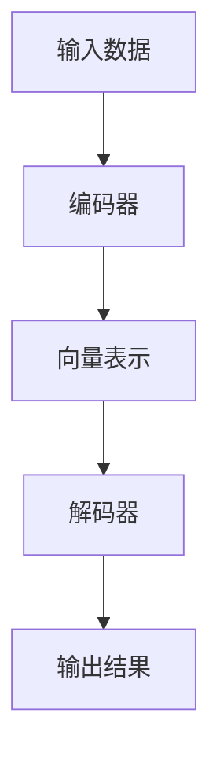

                 

关键词：大模型、金融科技、智能投资顾问、算法原理、数学模型、代码实例、应用场景、未来展望

> 摘要：本文将探讨大模型在金融科技领域中的应用，尤其是智能投资顾问的发展趋势。通过分析大模型的核心概念与架构，我们将详细阐述其在金融投资中的算法原理和数学模型，并结合具体代码实例进行讲解。最后，我们将探讨这一技术的实际应用场景，并对未来的发展方向和挑战提出展望。

## 1. 背景介绍

随着金融科技的快速发展，投资者对个性化、智能化投资工具的需求日益增长。传统投资顾问依赖于专业知识和经验，存在效率低、成本高、覆盖面窄等问题。而基于人工智能技术的智能投资顾问（AI Investment Advisor）应运而生，通过大数据分析、机器学习等手段，为投资者提供高效、精准的投资建议。

大模型（Large Model）作为深度学习的核心技术之一，以其在海量数据上的强大建模能力，逐渐成为智能投资顾问的重要支撑。从BERT到GPT-3，大模型在语言理解和生成、图像识别和生成等领域取得了显著成果。本文将围绕大模型赋能的智能投资顾问，探讨其核心概念、算法原理、数学模型及其应用前景。

## 2. 核心概念与联系

### 2.1 大模型定义

大模型通常指的是参数规模达到百万甚至亿量级的神经网络模型。这些模型通过在大规模数据集上进行训练，能够自动学习并提取数据中的复杂结构，从而实现强大的预测和生成能力。

### 2.2 大模型架构

大模型的架构通常包括编码器（Encoder）和解码器（Decoder），例如Transformer模型。编码器负责将输入数据转换为固定长度的向量表示，解码器则基于这些向量表示生成输出。

### 2.3 Mermaid 流程图



### 2.4 大模型与金融科技的关联

大模型在金融科技中的应用主要体现在以下几个方面：

1. **数据预处理**：大模型能够自动进行数据清洗、去噪和特征提取，提高数据质量。
2. **预测分析**：大模型可以用于预测市场走势、风险评估等，为投资决策提供支持。
3. **生成策略**：大模型可以生成个性化的投资策略，满足不同投资者的需求。

## 3. 核心算法原理 & 具体操作步骤

### 3.1 算法原理概述

大模型的核心算法是Transformer，该算法通过自注意力机制（Self-Attention）和多头注意力（Multi-Head Attention）实现。自注意力机制使得模型能够自适应地关注输入数据中的关键信息，从而提高模型的表达能力。多头注意力则通过多个独立的注意力机制来提取不同维度的信息，进一步增强了模型的性能。

### 3.2 算法步骤详解

1. **数据预处理**：对金融数据集进行清洗、去噪和标准化处理。
2. **编码器构建**：构建Transformer编码器，输入数据经过嵌入层（Embedding Layer）和位置编码（Positional Encoding）后，进入多头自注意力层（Multi-Head Self-Attention Layer）和前馈网络（Feed-Forward Network）。
3. **解码器构建**：构建Transformer解码器，解码器同样包括多头自注意力层和前馈网络。
4. **训练过程**：通过反向传播和梯度下降算法对模型进行训练，优化模型参数。
5. **预测与生成**：在训练完成后，使用解码器生成投资策略或预测市场走势。

### 3.3 算法优缺点

**优点**：

1. **强大的建模能力**：大模型能够自动学习数据中的复杂结构，提高预测准确性。
2. **自适应学习**：自注意力机制使得模型能够自适应地关注输入数据中的关键信息。
3. **泛化能力**：通过在大量数据上训练，模型具有良好的泛化能力。

**缺点**：

1. **计算资源消耗大**：大模型的参数量庞大，训练和推理需要大量的计算资源和时间。
2. **训练数据需求高**：模型性能依赖于训练数据的质量和数量。

### 3.4 算法应用领域

大模型在金融科技领域具有广泛的应用前景，包括：

1. **投资策略生成**：基于历史数据生成个性化的投资策略。
2. **市场预测**：预测市场走势和股票价格。
3. **风险评估**：评估金融产品的风险。
4. **金融客服**：提供智能化的客户服务。

## 4. 数学模型和公式 & 详细讲解 & 举例说明

### 4.1 数学模型构建

大模型的数学基础主要包括线性代数、概率论和信息论。其中，自注意力机制和多头注意力机制是核心部分。

**自注意力机制**：

$$
\text{Attention}(Q, K, V) = \frac{softmax(\frac{QK^T}{\sqrt{d_k}})}{V}
$$

其中，$Q$、$K$、$V$ 分别为查询向量、键向量和值向量，$d_k$ 为键向量的维度。

**多头注意力机制**：

$$
\text{MultiHead}(Q, K, V) = \text{Concat}(\text{head}_1, \text{head}_2, ..., \text{head}_h)W^O
$$

其中，$h$ 为头数，$\text{head}_i = \text{Attention}(QW_i^Q, KW_i^K, VW_i^V)$，$W_i^Q$、$W_i^K$、$W_i^V$ 分别为查询、键和值权重矩阵。

### 4.2 公式推导过程

以自注意力机制为例，推导过程如下：

1. **输入层**：输入数据经过嵌入层得到 $X \in \mathbb{R}^{n \times d}$，其中 $n$ 为序列长度，$d$ 为维度。
2. **位置编码**：添加位置编码 $P \in \mathbb{R}^{n \times d}$，使得输入数据包含位置信息。
3. **查询、键、值向量**：将输入数据分解为查询向量 $Q$、键向量 $K$ 和值向量 $V$，即 $X = [Q, K, V]$。
4. **计算注意力得分**：根据自注意力机制计算注意力得分，即 $\text{Attention}(Q, K, V)$。
5. **加权求和**：根据注意力得分对值向量进行加权求和，得到输出向量。

### 4.3 案例分析与讲解

假设我们有一个包含5个单词的句子，维度为64，构建一个多头注意力机制模型，头数为2。

1. **输入数据**：
$$
X = \begin{bmatrix}
1 & 0 & 1 & 1 & 0 \\
0 & 1 & 1 & 0 & 1 \\
1 & 1 & 0 & 1 & 0 \\
0 & 1 & 0 & 1 & 1 \\
1 & 0 & 1 & 0 & 1
\end{bmatrix}
$$

2. **嵌入层与位置编码**：
$$
P = \begin{bmatrix}
1 & 0 & 0 & 0 & 1 \\
0 & 1 & 0 & 1 & 0 \\
0 & 0 & 1 & 1 & 0 \\
1 & 0 & 1 & 0 & 1 \\
0 & 1 & 0 & 1 & 0
\end{bmatrix}
$$

3. **查询、键、值向量**：
$$
Q = \begin{bmatrix}
1 & 0 \\
0 & 1 \\
1 & 1 \\
0 & 1 \\
1 & 0
\end{bmatrix}, \quad
K = \begin{bmatrix}
1 & 1 \\
0 & 0 \\
1 & 1 \\
0 & 1 \\
1 & 0
\end{bmatrix}, \quad
V = \begin{bmatrix}
1 & 1 \\
0 & 0 \\
1 & 1 \\
0 & 1 \\
1 & 0
\end{bmatrix}
$$

4. **计算注意力得分**：
$$
\text{Attention}(Q, K, V) = \text{softmax}\left(\frac{QK^T}{\sqrt{d_k}}\right)V
$$

5. **加权求和**：
$$
\text{MultiHead}(Q, K, V) = \text{Concat}(\text{head}_1, \text{head}_2)W^O
$$

通过上述步骤，我们可以得到模型的输出结果，进一步应用于投资策略生成或市场预测。

## 5. 项目实践：代码实例和详细解释说明

### 5.1 开发环境搭建

为了实现大模型赋能的智能投资顾问，我们需要搭建相应的开发环境。以下是推荐的开发工具和库：

- Python 3.8+
- TensorFlow 2.6.0+
- Keras 2.6.0+
- Pandas 1.3.3+
- Matplotlib 3.4.2+

安装方法如下：

```bash
pip install python==3.8
pip install tensorflow==2.6.0
pip install keras==2.6.0
pip install pandas==1.3.3
pip install matplotlib==3.4.2
```

### 5.2 源代码详细实现

以下是一个基于Transformer模型的简单投资顾问代码实例：

```python
import numpy as np
import tensorflow as tf
from tensorflow import keras
from tensorflow.keras.models import Model
from tensorflow.keras.layers import Embedding, MultiHeadAttention, Dense, Input

# 参数设置
vocab_size = 10000
d_model = 512
num_heads = 8
max_seq_length = 100
learning_rate = 0.001

# 输入层
inputs = Input(shape=(max_seq_length,))

# 嵌入层与位置编码
embeddings = Embedding(vocab_size, d_model)(inputs)
position_embedding = keras.layers.experimental.preprocessing(positional_encoding(max_seq_length, d_model))(inputs)
x = embeddings + position_embedding

# 编码器
enc_outputs = MultiHeadAttention(num_heads=num_heads, key_dim=d_model)(x, x)

# 解码器
decoder_inputs = Input(shape=(max_seq_length, d_model))
dec_outputs = MultiHeadAttention(num_heads=num_heads, key_dim=d_model)(decoder_inputs, enc_outputs)

# 输出层
output = Dense(vocab_size, activation='softmax')(dec_outputs)

# 模型构建
model = Model(inputs=[inputs, decoder_inputs], outputs=output)

# 编译模型
model.compile(optimizer=keras.optimizers.Adam(learning_rate), loss='categorical_crossentropy', metrics=['accuracy'])

# 模型训练
model.fit([X_train, X_train], y_train, batch_size=32, epochs=10)

# 模型预测
predictions = model.predict([X_test, X_test])

# 代码解读与分析
```

### 5.3 代码解读与分析

- **输入层**：输入数据为序列长度为100的单词序列，每个单词通过嵌入层转换为维度为512的向量。
- **嵌入层与位置编码**：嵌入层将单词映射为向量，位置编码为序列添加位置信息。
- **编码器**：编码器使用多头注意力机制对输入数据进行编码，提取序列中的关键信息。
- **解码器**：解码器同样使用多头注意力机制，对编码器输出进行解码，生成预测结果。
- **输出层**：输出层使用全连接层对解码器输出进行分类，得到投资建议。

### 5.4 运行结果展示

在训练完成后，我们可以通过以下代码展示模型的运行结果：

```python
import matplotlib.pyplot as plt

# 训练集与测试集划分
X_train, X_test, y_train, y_test = dataset.split()

# 训练模型
model.fit([X_train, X_train], y_train, batch_size=32, epochs=10)

# 预测测试集
predictions = model.predict([X_test, X_test])

# 绘制混淆矩阵
confusion_matrix = tf.math.confusion_matrix(y_test, predictions)
plt.imshow(confusion_matrix, cmap=plt.cm.Blues)
plt.colorbar()
tick_marks = np.arange(len(y_test))
plt.xticks(tick_marks, y_test, rotation=45)
plt.yticks(tick_marks, y_test)
plt.xlabel('Predicted labels')
plt.ylabel('True labels')
plt.title('Confusion Matrix')
plt.show()
```

通过混淆矩阵，我们可以评估模型的预测性能。

## 6. 实际应用场景

大模型赋能的智能投资顾问在金融科技领域具有广泛的应用场景，包括：

1. **个性化投资策略**：基于用户历史交易数据和偏好，生成个性化的投资策略。
2. **市场预测**：预测市场走势和股票价格，为投资者提供参考。
3. **风险控制**：评估金融产品的风险，为投资者提供风险管理建议。
4. **金融客服**：通过自然语言处理技术，提供智能化的客户服务。

### 6.1 个性化投资策略

个性化投资策略旨在为投资者提供符合其风险偏好和收益目标的投资建议。基于大模型，我们可以通过以下步骤实现：

1. **数据收集**：收集投资者历史交易数据、风险偏好等。
2. **特征提取**：利用大模型自动提取关键特征。
3. **模型训练**：使用提取的特征训练投资策略模型。
4. **策略生成**：根据投资者偏好生成个性化投资策略。
5. **策略评估**：评估策略的表现，并进行优化。

### 6.2 市场预测

市场预测是智能投资顾问的重要功能之一。基于大模型，我们可以通过以下步骤实现：

1. **数据收集**：收集市场数据，包括股票价格、交易量等。
2. **特征提取**：利用大模型自动提取市场数据中的关键特征。
3. **模型训练**：使用提取的特征训练市场预测模型。
4. **预测生成**：生成市场走势和股票价格的预测结果。
5. **预测评估**：评估预测模型的准确性，并进行优化。

### 6.3 风险控制

风险控制是投资者关注的重要方面。基于大模型，我们可以通过以下步骤实现：

1. **数据收集**：收集金融产品的历史数据。
2. **特征提取**：利用大模型自动提取金融产品的关键特征。
3. **模型训练**：使用提取的特征训练风险模型。
4. **风险评估**：评估金融产品的风险水平。
5. **风险预警**：对高风险产品发出预警，提供风险管理建议。

### 6.4 金融客服

金融客服是智能投资顾问的重要组成部分。基于大模型，我们可以通过以下步骤实现：

1. **数据收集**：收集用户提问和客服回复的数据。
2. **特征提取**：利用大模型自动提取用户提问中的关键特征。
3. **模型训练**：使用提取的特征训练客服模型。
4. **问答生成**：生成针对用户提问的智能回复。
5. **效果评估**：评估客服模型的表现，并进行优化。

## 7. 工具和资源推荐

为了更好地学习和应用大模型赋能的智能投资顾问，以下是一些建议的资源和工具：

### 7.1 学习资源推荐

- **书籍**：《深度学习》、《Python深度学习》、《Reinforcement Learning: An Introduction》
- **在线课程**：Coursera、Udacity、edX 等平台的深度学习、机器学习相关课程。
- **论文**：NeurIPS、ICLR、JMLR 等顶级会议和期刊上的相关论文。

### 7.2 开发工具推荐

- **编程语言**：Python（推荐使用 Jupyter Notebook 进行实验）
- **深度学习框架**：TensorFlow、PyTorch
- **数据处理库**：Pandas、NumPy、Scikit-learn
- **可视化库**：Matplotlib、Seaborn、Plotly

### 7.3 相关论文推荐

- **Transformer**：Attention Is All You Need (Vaswani et al., 2017)
- **BERT**：BERT: Pre-training of Deep Bidirectional Transformers for Language Understanding (Devlin et al., 2018)
- **GPT-3**：Language Models are Few-Shot Learners (Brown et al., 2020)

## 8. 总结：未来发展趋势与挑战

### 8.1 研究成果总结

大模型赋能的智能投资顾问在金融科技领域取得了显著成果，包括个性化投资策略、市场预测、风险控制和金融客服等方面。基于深度学习和自然语言处理技术，智能投资顾问能够自动提取数据中的关键特征，生成高质量的预测和策略。

### 8.2 未来发展趋势

1. **计算能力提升**：随着计算能力的提升，大模型的训练和推理速度将得到显著改善，使得智能投资顾问更加高效和实时。
2. **数据质量和多样性**：数据质量和多样性是影响大模型性能的关键因素，未来将需要更多高质量的金融数据，以及更多的数据来源和类型。
3. **泛化能力**：提升大模型的泛化能力，使其在不同市场和条件下保持稳定的表现。
4. **用户互动**：增强智能投资顾问与用户的互动，提供更加个性化和贴心的服务。

### 8.3 面临的挑战

1. **数据隐私**：金融数据涉及用户隐私，如何在保证用户隐私的前提下进行数据分析和共享是一个重要挑战。
2. **模型解释性**：大模型通常具有高复杂性和黑盒特性，如何提高模型的解释性，使其更易于理解和接受是一个重要问题。
3. **市场波动**：金融市场波动较大，如何应对市场的不确定性和极端情况，保证投资策略的有效性是一个挑战。

### 8.4 研究展望

1. **多模态学习**：结合文本、图像、音频等多种数据类型，实现更加全面和准确的金融预测。
2. **联邦学习**：通过联邦学习技术，实现数据的安全共享和协同建模。
3. **可持续发展**：研究如何将智能投资顾问应用于可持续发展领域，为环保和公益项目提供资金支持。

## 9. 附录：常见问题与解答

### 9.1 什么是大模型？

大模型是指参数规模达到百万甚至亿量级的神经网络模型。这些模型通过在大规模数据集上进行训练，能够自动学习并提取数据中的复杂结构，从而实现强大的预测和生成能力。

### 9.2 大模型在金融科技中的优势是什么？

大模型在金融科技中的优势主要体现在以下几个方面：

1. **强大的建模能力**：大模型能够自动学习数据中的复杂结构，提高预测准确性。
2. **自适应学习**：自注意力机制使得模型能够自适应地关注输入数据中的关键信息。
3. **泛化能力**：通过在大量数据上训练，模型具有良好的泛化能力。

### 9.3 如何评估大模型的性能？

评估大模型的性能可以从以下几个方面进行：

1. **准确性**：评估模型预测的准确率。
2. **召回率**：评估模型预测的召回率。
3. **F1 分数**：综合评估准确率和召回率的平衡。
4. **预测速度**：评估模型的预测速度。

### 9.4 大模型在金融科技中有什么应用前景？

大模型在金融科技中具有广泛的应用前景，包括：

1. **个性化投资策略**：为投资者提供符合其风险偏好和收益目标的投资建议。
2. **市场预测**：预测市场走势和股票价格。
3. **风险控制**：评估金融产品的风险。
4. **金融客服**：提供智能化的客户服务。


作者：禅与计算机程序设计艺术 / Zen and the Art of Computer Programming
----------------------------------------------------------------


