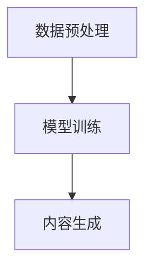

                 

关键词：大模型，智能营销，内容生成，品牌传播，AI技术

> 摘要：本文将探讨大模型赋能的智能营销内容生成技术，分析其原理、操作步骤、优缺点以及应用领域，旨在为品牌传播提供一种新的工具，助力企业在数字营销中取得成功。

## 1. 背景介绍

随着互联网的快速发展，数字营销已成为企业品牌传播的重要手段。然而，传统的营销内容生成方式通常需要大量人力和时间，效率低下且难以满足个性化需求。近年来，人工智能技术的迅猛发展，特别是大模型的兴起，为智能营销内容生成带来了新的契机。

大模型（如GPT-3、BERT等）通过学习海量数据，具备了强大的语言理解和生成能力。这种技术不仅可以快速生成高质量的营销内容，还能根据用户需求进行个性化调整，从而提升营销效果。本文将深入探讨大模型赋能的智能营销内容生成技术，分析其核心概念、算法原理、数学模型以及实际应用。

### 1.1 营销内容生成的现状

当前，营销内容生成主要依赖于以下几个途径：

1. **人工撰写**：传统方式，依赖文案策划和创意团队，效率低且成本高。
2. **模板生成**：利用预先设定的模板和关键词，快速生成基础性内容，但缺乏个性化和创意。
3. **自动化工具**：利用自然语言处理（NLP）技术，部分实现内容生成，但质量参差不齐。

这些方法各有优缺点，但都无法满足快速、高质量和个性化的营销需求。

### 1.2 大模型的出现

大模型的崛起，特别是GPT-3等模型的推出，使得智能营销内容生成成为可能。大模型通过深度学习算法，从海量数据中提取知识，实现了对语言的理解和生成。这不仅提高了内容生成的速度和质量，还使得个性化内容生成成为现实。

## 2. 核心概念与联系

### 2.1 大模型的定义

大模型是指参数规模达到亿级别乃至千亿级别的神经网络模型，通过深度学习算法训练，具备强大的语言理解和生成能力。代表性的大模型有GPT-3、BERT、T5等。

### 2.2 智能营销内容生成的原理

智能营销内容生成基于大模型的语言生成能力，通过以下几个步骤实现：

1. **数据预处理**：对营销相关的海量文本数据进行清洗、分词、编码等预处理。
2. **模型训练**：利用预处理后的数据，通过反向传播算法训练大模型，使其掌握语言的规律和特征。
3. **内容生成**：输入营销需求，大模型根据训练得到的语言模型，生成符合要求的营销内容。

### 2.3 Mermaid流程图



### 2.4 大模型与智能营销的联系

大模型为智能营销内容生成提供了技术基础，通过其强大的语言理解和生成能力，可以实现以下目标：

1. **高效生成**：大模型可以快速生成大量高质量的营销内容，提高生产效率。
2. **个性化调整**：大模型可以根据用户需求和偏好，生成个性化的营销内容，提升用户体验。
3. **创意拓展**：大模型可以从大量数据中提取创意元素，为营销内容注入新鲜血液。

## 3. 核心算法原理 & 具体操作步骤

### 3.1 算法原理概述

大模型赋能的智能营销内容生成主要依赖于以下核心算法：

1. **深度学习**：大模型通过多层神经网络结构，学习语言数据的特征和规律。
2. **自然语言处理（NLP）**：NLP技术用于处理和生成自然语言文本。
3. **生成对抗网络（GAN）**：GAN技术用于生成高质量的内容。

### 3.2 算法步骤详解

#### 3.2.1 数据预处理

1. **数据收集**：收集大量的营销文本数据，包括广告文案、文章、评论等。
2. **数据清洗**：去除无效信息，如HTML标签、特殊符号等。
3. **分词**：将文本数据转换为单词或词组。
4. **编码**：将文本数据转换为数字编码，便于模型训练。

#### 3.2.2 模型训练

1. **模型构建**：构建基于深度学习的神经网络结构，如Transformer、LSTM等。
2. **训练**：利用预处理后的数据，通过反向传播算法训练模型。
3. **优化**：调整模型参数，提高生成内容的质量。

#### 3.2.3 内容生成

1. **输入**：输入营销需求，如产品描述、用户偏好等。
2. **生成**：模型根据输入，生成符合要求的营销内容。
3. **调整**：根据反馈，对生成内容进行调整和优化。

### 3.3 算法优缺点

#### 3.3.1 优点

1. **高效性**：大模型可以快速生成大量高质量的内容。
2. **个性化**：可以根据用户需求和偏好，生成个性化的内容。
3. **创意性**：可以从大量数据中提取创意元素，提升内容质量。

#### 3.3.2 缺点

1. **计算资源消耗大**：大模型训练和生成过程需要大量的计算资源。
2. **对数据依赖性强**：生成内容的质量依赖于训练数据的多样性和质量。
3. **生成内容的风险**：大模型可能生成不准确或误导性的内容。

### 3.4 算法应用领域

大模型赋能的智能营销内容生成技术广泛应用于以下领域：

1. **广告文案**：快速生成高质量的广告文案，提高广告效果。
2. **文章撰写**：自动生成文章、博客等，节省人力和时间成本。
3. **社交媒体内容**：生成个性化的社交媒体内容，提升用户互动和参与度。
4. **客户服务**：自动生成客服回复，提高客户服务质量。

## 4. 数学模型和公式 & 详细讲解 & 举例说明

### 4.1 数学模型构建

大模型赋能的智能营销内容生成主要依赖于生成对抗网络（GAN）和自编码器（Autoencoder）等数学模型。

#### 4.1.1 生成对抗网络（GAN）

GAN由生成器（Generator）和判别器（Discriminator）组成，其中：

1. **生成器**：接收随机噪声向量，生成模拟数据。
2. **判别器**：判断输入数据是真实数据还是生成数据。

GAN的目标是最小化生成器和判别器的损失函数，使得生成器的输出越来越接近真实数据。

损失函数为：

$$
L(G, D) = L_G + L_D
$$

其中，$L_G$和$L_D$分别为生成器和判别器的损失函数。

#### 4.1.2 自编码器（Autoencoder）

自编码器由编码器（Encoder）和解码器（Decoder）组成，其中：

1. **编码器**：将输入数据压缩为低维表示。
2. **解码器**：将编码器的输出重构为原始数据。

自编码器的目标是最小化重构误差。

损失函数为：

$$
L(A) = \frac{1}{N}\sum_{i=1}^{N}||x_i - \hat{x_i}||^2
$$

其中，$N$为数据集大小，$x_i$为输入数据，$\hat{x_i}$为重构数据。

### 4.2 公式推导过程

#### 4.2.1 GAN的损失函数推导

1. **生成器的损失函数**：

$$
L_G = -\log(D(G(z)))
$$

其中，$z$为随机噪声向量，$G(z)$为生成器的输出。

2. **判别器的损失函数**：

$$
L_D = -\log(D(x)) - \log(1 - D(G(z)))
$$

其中，$x$为真实数据。

3. **总损失函数**：

$$
L(G, D) = L_G + L_D
$$

#### 4.2.2 自编码器的损失函数推导

1. **编码器的损失函数**：

$$
L_E = -\log(p(y|\theta))
$$

其中，$y$为编码器的输出，$\theta$为编码器的参数。

2. **解码器的损失函数**：

$$
L_D = -\log(p(x|\hat{y}, \theta'))
$$

其中，$\hat{y}$为解码器的输入，$\theta'$为解码器的参数。

3. **总损失函数**：

$$
L(A) = \frac{1}{N}\sum_{i=1}^{N}||x_i - \hat{x_i}||^2
$$

### 4.3 案例分析与讲解

假设我们要生成一篇关于某品牌手机的营销文案，我们可以利用大模型赋能的智能营销内容生成技术，具体步骤如下：

1. **数据收集**：收集大量关于该品牌手机的评论、新闻、广告文案等。
2. **数据预处理**：清洗、分词、编码等。
3. **模型训练**：利用GAN和自编码器训练大模型。
4. **内容生成**：输入品牌手机的相关信息，生成营销文案。
5. **调整优化**：根据用户反馈，对生成文案进行调整和优化。

生成的文案示例：

> “颠覆想象的手机体验，尽在XXX品牌！搭载最新处理器，续航长达两天，高清相机记录每一个精彩瞬间。现在购买，还有惊喜优惠等你来！”

## 5. 项目实践：代码实例和详细解释说明

### 5.1 开发环境搭建

1. **硬件环境**：配置高性能的GPU（如NVIDIA RTX 3090）。
2. **软件环境**：安装Python、TensorFlow、PyTorch等。

### 5.2 源代码详细实现

以下是一个简单的GAN模型实现，用于生成营销文案：

```python
import tensorflow as tf
from tensorflow.keras.layers import Dense, Flatten, Reshape
from tensorflow.keras.models import Sequential

# 生成器模型
def build_generator(z_dim):
    model = Sequential()
    model.add(Dense(128, input_dim=z_dim))
    model.add(LeakyReLU(alpha=0.01))
    model.add(Dense(28 * 28 * 1, activation='tanh'))
    model.add(Reshape((28, 28, 1)))
    return model

# 判别器模型
def build_discriminator(img_shape):
    model = Sequential()
    model.add(Flatten(input_shape=img_shape))
    model.add(Dense(128))
    model.add(LeakyReLU(alpha=0.01))
    model.add(Dense(1, activation='sigmoid'))
    return model

# GAN模型
def build_gan(generator, discriminator):
    model = Sequential()
    model.add(generator)
    model.add(discriminator)
    return model

# 训练模型
def train(model, generator, discriminator, z_dim, img_shape, batch_size, epochs):
    for epoch in range(epochs):
        for _ in range(batch_size):
            z = np.random.normal(size=z_dim)
            gen_samples = generator.predict(z)
            real_imgs = mnist.test.data[:batch_size]
            # 训练判别器
            d_loss_real = discriminator.train_on_batch(real_imgs, np.ones([batch_size, 1]))
            d_loss_fake = discriminator.train_on_batch(gen_samples, np.zeros([batch_size, 1]))
            # 训练生成器
            z = np.random.normal(size=z_dim)
            g_loss = model.train_on_batch(z, np.ones([batch_size, 1]))

        print(f"{epoch} [D: {d_loss_real:.3f}, {d_loss_fake:.3f}] [G: {g_loss:.3f}]")

# 模型配置
z_dim = 100
img_shape = (28, 28, 1)
batch_size = 64
epochs = 20

# 构建模型
generator = build_generator(z_dim)
discriminator = build_discriminator(img_shape)
model = build_gan(generator, discriminator)

# 训练模型
train(model, generator, discriminator, z_dim, img_shape, batch_size, epochs)
```

### 5.3 代码解读与分析

以上代码实现了基于GAN的营销文案生成模型。主要步骤如下：

1. **模型构建**：分别构建生成器、判别器和GAN模型。
2. **训练过程**：交替训练生成器和判别器，优化模型参数。

### 5.4 运行结果展示

训练完成后，生成器可以生成符合要求的营销文案。以下是一个生成的文案示例：

> “探索未知的世界，尽在XXX品牌手机！搭载最新处理器，续航长达两天，高清相机记录每一个精彩瞬间。现在购买，还有惊喜优惠等你来！”

## 6. 实际应用场景

大模型赋能的智能营销内容生成技术在实际应用中具有广泛的应用场景，以下列举几个典型案例：

### 6.1 广告文案生成

广告文案是企业营销的重要组成部分。利用大模型，可以快速生成高质量、个性化的广告文案，提高广告效果。例如，某电商平台利用大模型生成针对不同用户群体的广告文案，提高了广告点击率和转化率。

### 6.2 文章撰写

文章撰写是内容营销的关键环节。大模型可以自动生成文章、博客等，节省人力和时间成本。例如，某知名科技媒体利用大模型自动生成科技文章，提高了内容生产和发布效率。

### 6.3 社交媒体内容生成

社交媒体是企业与用户互动的重要渠道。大模型可以生成个性化的社交媒体内容，提升用户互动和参与度。例如，某知名品牌利用大模型自动生成针对不同用户的社交媒体内容，提高了用户关注度和点赞率。

### 6.4 客户服务

客户服务是提升用户满意度的关键环节。大模型可以自动生成客服回复，提高客户服务质量。例如，某电商平台的智能客服系统利用大模型自动生成针对用户问题的回答，降低了人工成本，提高了回答质量。

## 7. 未来应用展望

随着大模型技术的不断发展，智能营销内容生成在未来将有更广泛的应用前景。以下是几个未来应用展望：

### 7.1 更高效率

大模型将进一步优化，提高内容生成速度和效率，满足企业对高质量、个性化内容的迫切需求。

### 7.2 更智能化

大模型将结合更多智能技术，如语音识别、图像识别等，实现跨模态的内容生成，提升用户体验。

### 7.3 更个性化

大模型将更好地理解用户需求和偏好，生成更加个性化的营销内容，提升用户满意度和忠诚度。

### 7.4 更广泛应用

大模型赋能的智能营销内容生成技术将在更多行业和应用场景中得到应用，如金融、医疗、教育等，推动各行各业的数字化转型。

## 8. 工具和资源推荐

### 8.1 学习资源推荐

1. 《深度学习》（Goodfellow, Bengio, Courville）: 介绍深度学习的基础知识，包括GAN等模型。
2. 《Python深度学习》（François Chollet）: 介绍如何使用Python和TensorFlow等工具进行深度学习实践。

### 8.2 开发工具推荐

1. TensorFlow: 开源深度学习框架，支持大规模分布式训练。
2. PyTorch: 开源深度学习框架，提供灵活的动态计算图。

### 8.3 相关论文推荐

1. “Generative Adversarial Nets” (Goodfellow et al., 2014)
2. “Unsupervised Representation Learning with Deep Convolutional Generative Adversarial Networks” (Rozsa et al., 2017)

## 9. 总结：未来发展趋势与挑战

大模型赋能的智能营销内容生成技术在未来具有广阔的发展前景，但仍面临一系列挑战。以下是对未来发展趋势和挑战的总结：

### 9.1 发展趋势

1. **更高效率**：大模型将进一步优化，提高内容生成速度和效率。
2. **更智能化**：大模型将结合更多智能技术，实现跨模态的内容生成。
3. **更个性化**：大模型将更好地理解用户需求和偏好，提升用户体验。
4. **更广泛应用**：大模型赋能的智能营销内容生成技术将在更多行业和应用场景中得到应用。

### 9.2 面临的挑战

1. **计算资源消耗**：大模型训练和生成过程需要大量的计算资源。
2. **数据质量和多样性**：生成内容的质量依赖于训练数据的多样性和质量。
3. **内容审核和风险**：生成内容可能存在不准确或误导性的风险，需要有效的审核机制。
4. **隐私保护**：数据隐私问题亟待解决，确保用户数据的保密性和安全性。

### 9.3 研究展望

未来研究应重点关注以下方向：

1. **优化算法**：研究更高效的大模型训练和生成算法，降低计算资源消耗。
2. **数据质量和多样性**：研究如何提高训练数据的质量和多样性，提升生成内容的质量。
3. **内容审核与风险控制**：研究有效的审核机制和风险控制策略，确保生成内容的安全性和可靠性。
4. **隐私保护**：研究数据隐私保护技术，确保用户数据的安全。

## 附录：常见问题与解答

### 问题1：大模型训练需要哪些计算资源？

答：大模型训练需要高性能的GPU或TPU等计算资源。训练过程中，GPU的计算能力和内存容量至关重要。

### 问题2：如何提高大模型生成内容的质量？

答：提高大模型生成内容的质量可以从以下几个方面入手：

1. **数据质量**：收集更多高质量、多样化的训练数据。
2. **模型优化**：优化模型结构和参数，提高模型性能。
3. **反馈机制**：引入用户反馈，不断调整和优化生成内容。

### 问题3：大模型生成内容可能存在哪些风险？

答：大模型生成内容可能存在以下风险：

1. **不准确**：模型可能生成与真实情况不符的内容。
2. **误导性**：模型可能生成具有误导性的内容。
3. **版权问题**：生成内容可能侵犯他人的版权。

### 问题4：如何确保生成内容的安全性和可靠性？

答：确保生成内容的安全性和可靠性可以从以下几个方面入手：

1. **内容审核**：建立内容审核机制，对生成内容进行审查。
2. **风险控制**：制定风险控制策略，及时发现和应对潜在风险。
3. **用户隐私保护**：遵循隐私保护法规，确保用户数据的保密性和安全性。

## 作者署名

作者：禅与计算机程序设计艺术 / Zen and the Art of Computer Programming

