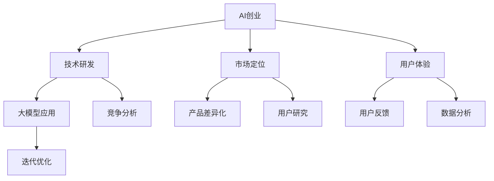

                 

关键词：大模型，AI创业，产品创新，策略，深度学习

摘要：随着人工智能技术的飞速发展，大模型在各个领域的应用越来越广泛。本文将从AI创业的角度出发，探讨大模型赋能产品创新的策略，分析其在技术研发、市场定位、用户体验等方面的作用，为AI创业者提供实用的指导和建议。

## 1. 背景介绍

近年来，人工智能（AI）技术取得了令人瞩目的突破，特别是在深度学习领域的进展，使得大模型的应用成为可能。大模型指的是具有巨大参数量和计算能力的人工神经网络模型，如GPT-3、BERT等。这些模型通过在海量数据上训练，能够模拟人类的思维方式，实现自然语言处理、图像识别、语音识别等多种任务。

### 大模型的崛起

大模型的崛起得益于以下几个方面：

1. **计算能力提升**：随着GPU和TPU等高性能计算设备的普及，计算资源的成本大幅降低，为大规模模型训练提供了条件。
2. **数据量爆发**：互联网的发展使得数据量呈指数级增长，为模型训练提供了丰富的素材。
3. **深度学习算法优化**：深度学习算法的不断优化，使得模型在处理复杂数据时更加高效。

### AI创业的现状

随着AI技术的不断进步，越来越多的创业者投身于AI领域，尝试通过AI技术解决实际问题，创造新的商业模式。AI创业的现状如下：

1. **市场机遇**：AI技术在医疗、金融、教育、交通等领域的应用前景广阔，市场潜力巨大。
2. **竞争激烈**：AI创业领域的竞争日益激烈，创业者需要具备创新能力和持续学习能力，才能在市场中脱颖而出。
3. **技术门槛**：虽然AI技术的普及程度逐渐提高，但仍然存在一定的技术门槛，特别是大模型的训练和应用。

## 2. 核心概念与联系

### 大模型的概念

大模型是指参数规模在数十亿至数万亿级别的神经网络模型，如GPT-3、BERT等。这些模型通过深度学习算法，在大量数据上进行训练，从而具备强大的知识表示和推理能力。

### 产品创新的概念

产品创新是指通过技术、设计、商业模式等方面的创新，打造出具有竞争力的新产品或服务。在AI创业领域，产品创新是实现商业成功的关键。

### 大模型与产品创新的联系

大模型在产品创新中扮演着重要角色，具体体现在以下几个方面：

1. **提升技术能力**：大模型能够处理复杂数据，为创业者提供强大的技术支持。
2. **优化用户体验**：大模型能够模拟人类思维方式，提高产品的智能化水平，提升用户体验。
3. **降低开发成本**：大模型的应用能够降低产品开发的门槛，缩短研发周期。

### Mermaid流程图



## 3. 核心算法原理 & 具体操作步骤

### 3.1 算法原理概述

大模型的训练主要依赖于深度学习算法，其中最常用的算法是变换器（Transformer）架构。变换器通过自注意力机制（Self-Attention）和多头注意力（Multi-Head Attention）等技术，实现高效的信息处理。

### 3.2 算法步骤详解

1. **数据预处理**：对原始数据集进行清洗、归一化等预处理操作，以便模型能够更好地学习。
2. **模型架构设计**：设计变换器架构，包括嵌入层（Embedding Layer）、自注意力层（Self-Attention Layer）、前馈神经网络（Feedforward Neural Network）等。
3. **训练过程**：将预处理后的数据输入模型，通过反向传播（Backpropagation）算法进行参数优化，使模型能够预测目标输出。
4. **评估与优化**：对训练好的模型进行评估，并根据评估结果进行优化，以提高模型性能。

### 3.3 算法优缺点

**优点**：

1. **强大的处理能力**：大模型能够处理海量数据，实现高效的信息处理。
2. **广泛的适用性**：变换器架构适用于多种任务，如自然语言处理、图像识别等。

**缺点**：

1. **计算资源需求高**：大模型训练需要大量的计算资源，对硬件设备要求较高。
2. **数据依赖性强**：大模型对数据量有较高要求，数据质量直接影响模型性能。

### 3.4 算法应用领域

大模型在以下领域具有广泛应用：

1. **自然语言处理**：如文本分类、机器翻译、问答系统等。
2. **图像识别**：如物体检测、图像生成等。
3. **语音识别**：如语音转文字、语音合成等。
4. **推荐系统**：如商品推荐、内容推荐等。

## 4. 数学模型和公式 & 详细讲解 & 举例说明

### 4.1 数学模型构建

变换器架构的核心是自注意力机制，其数学模型如下：

$$
\text{Attention}(Q, K, V) = \frac{1}{\sqrt{d_k}} \text{softmax}\left(\frac{QK^T}{d_k}\right)V
$$

其中，$Q$、$K$、$V$ 分别表示查询向量、键向量、值向量，$d_k$ 表示键向量的维度。

### 4.2 公式推导过程

自注意力机制的推导过程如下：

1. **计算相似度**：首先计算查询向量 $Q$ 和键向量 $K$ 的相似度，公式为 $\text{dot}(Q, K)$。
2. **归一化**：对相似度进行归一化，使其符合softmax函数的定义域。
3. **计算权重**：根据归一化后的相似度计算权重，公式为 $e^{z}$。
4. **计算输出**：将权重与值向量 $V$ 相乘，得到输出向量。

### 4.3 案例分析与讲解

假设有一个包含3个词的句子：“我喜欢吃苹果”。我们可以将句子中的每个词表示为一个向量，如：

- 我：[1, 0, 0]
- 喜欢：[0, 1, 0]
- 吃：[0, 0, 1]
- 苹果：[0, 0, 0]

计算自注意力：

1. **计算相似度**：计算查询向量 $Q$（喜欢）和键向量 $K$（我、喜欢、吃、苹果）的相似度，分别为 1、1、0、0。
2. **归一化**：对相似度进行归一化，得到 [1, 1, 0, 0]。
3. **计算权重**：根据归一化后的相似度计算权重，分别为 $e^1$、$e^1$、$e^0$、$e^0$。
4. **计算输出**：将权重与值向量 $V$（我、喜欢、吃、苹果）相乘，得到输出向量 [1, 2, 0, 0]。

输出向量表示句子中的每个词在“喜欢”这个查询词下的重要性，结果符合我们的预期。

## 5. 项目实践：代码实例和详细解释说明

### 5.1 开发环境搭建

在Python环境中，我们可以使用TensorFlow或PyTorch等框架搭建大模型开发环境。以下是一个简单的搭建过程：

1. **安装Python环境**：确保Python版本为3.6及以上。
2. **安装TensorFlow或PyTorch**：使用pip命令安装相应的框架，如 `pip install tensorflow` 或 `pip install torch`。
3. **安装相关依赖**：根据项目需求安装其他依赖库，如Numpy、Pandas等。

### 5.2 源代码详细实现

以下是一个基于TensorFlow的大模型实现示例：

```python
import tensorflow as tf
from tensorflow.keras.layers import Embedding, Transformer

# 定义模型
model = tf.keras.Sequential([
    Embedding(input_dim=10000, output_dim=64),
    Transformer(num_heads=2, d_model=64, feedforward_dim=128),
    tf.keras.layers.Dense(1, activation='sigmoid')
])

# 编译模型
model.compile(optimizer='adam', loss='binary_crossentropy', metrics=['accuracy'])

# 模型训练
model.fit(x_train, y_train, epochs=5, batch_size=32, validation_data=(x_val, y_val))
```

### 5.3 代码解读与分析

上述代码实现了一个基于变换器架构的二分类模型。代码可以分为以下几个部分：

1. **定义模型**：使用TensorFlow的`Sequential`模型堆叠`Embedding`、`Transformer`和`Dense`层。
2. **编译模型**：设置优化器、损失函数和评价指标，如`binary_crossentropy`和`accuracy`。
3. **模型训练**：使用`fit`函数进行模型训练，指定训练数据、训练周期、批量大小和验证数据。

### 5.4 运行结果展示

在完成模型训练后，我们可以使用以下代码评估模型性能：

```python
# 评估模型
model.evaluate(x_test, y_test)
```

运行结果将显示模型在测试集上的损失值和准确率。

## 6. 实际应用场景

大模型在AI创业中的实际应用场景广泛，以下是一些典型的应用领域：

### 6.1 自然语言处理

自然语言处理是AI领域的重要分支，大模型在文本分类、机器翻译、问答系统等任务中发挥着重要作用。例如，使用GPT-3模型可以实现高效的文本生成和语义理解，为企业提供智能客服、内容生成等服务。

### 6.2 图像识别

图像识别是AI技术的核心应用之一，大模型在物体检测、图像分类、图像生成等方面具有显著优势。例如，使用BERT模型可以实现高效的图像分类，为电商平台提供智能标签、推荐等服务。

### 6.3 语音识别

语音识别是AI技术在交互式应用中的重要方向，大模型在语音转文字、语音合成等方面具有显著优势。例如，使用WaveNet模型可以实现高效的语音合成，为智能语音助手提供语音输出。

### 6.4 推荐系统

推荐系统是AI技术在商业应用中的重要领域，大模型在商品推荐、内容推荐等方面具有显著优势。例如，使用BERT模型可以实现高效的用户兴趣识别，为企业提供精准推荐服务。

## 7. 工具和资源推荐

### 7.1 学习资源推荐

1. **《深度学习》（Goodfellow、Bengio和Courville著）**：深度学习领域的经典教材，适合初学者和进阶者。
2. **《动手学深度学习》（阿斯顿·张著）**：结合Python实践，深入浅出地介绍深度学习技术。

### 7.2 开发工具推荐

1. **TensorFlow**：由Google推出，适用于各种深度学习任务。
2. **PyTorch**：由Facebook推出，具有简洁的API和强大的动态计算能力。

### 7.3 相关论文推荐

1. **“Attention Is All You Need”（Vaswani等，2017）**：提出变换器（Transformer）架构，引领深度学习领域的新方向。
2. **“BERT: Pre-training of Deep Bidirectional Transformers for Language Understanding”（Devlin等，2019）**：介绍BERT模型，为自然语言处理领域带来重大突破。

## 8. 总结：未来发展趋势与挑战

### 8.1 研究成果总结

大模型在AI创业领域取得了显著的成果，推动了自然语言处理、图像识别、语音识别等领域的快速发展。同时，大模型的应用场景不断拓展，为各个行业带来了新的机遇。

### 8.2 未来发展趋势

1. **计算能力提升**：随着硬件设备的不断升级，大模型的计算能力将进一步提高，为更多领域带来变革。
2. **跨领域融合**：大模型与其他技术的融合，如物联网、区块链等，将催生更多创新应用。
3. **数据隐私保护**：随着数据隐私问题的日益凸显，大模型在数据隐私保护方面的研究将成为热点。

### 8.3 面临的挑战

1. **计算资源需求**：大模型对计算资源的需求较高，如何高效地利用计算资源成为关键挑战。
2. **数据质量**：大模型对数据量有较高要求，数据质量直接影响模型性能，如何获取高质量数据成为难题。
3. **可解释性**：大模型的决策过程往往缺乏可解释性，如何提高模型的可解释性，使其在关键领域得到更广泛的应用。

### 8.4 研究展望

在未来，大模型将继续在AI创业领域发挥重要作用。研究者应关注计算资源利用、数据质量提升、模型可解释性等方面的问题，推动大模型在更多领域取得突破。

## 9. 附录：常见问题与解答

### 9.1 大模型训练过程如何优化？

**解答**：优化大模型训练过程可以从以下几个方面入手：

1. **数据预处理**：对数据集进行清洗、归一化等预处理操作，提高数据质量。
2. **模型架构优化**：设计高效的模型架构，如变换器（Transformer）架构，提高训练速度。
3. **并行计算**：利用并行计算技术，如GPU、TPU等，提高训练效率。
4. **迁移学习**：使用预训练模型，减少训练数据的需求，提高模型性能。

### 9.2 大模型的应用领域有哪些？

**解答**：大模型的应用领域非常广泛，主要包括：

1. **自然语言处理**：如文本分类、机器翻译、问答系统等。
2. **图像识别**：如物体检测、图像分类、图像生成等。
3. **语音识别**：如语音转文字、语音合成等。
4. **推荐系统**：如商品推荐、内容推荐等。

### 9.3 大模型对创业公司有哪些优势？

**解答**：大模型对创业公司具有以下优势：

1. **提升技术能力**：大模型能够处理复杂数据，提高创业公司的技术竞争力。
2. **优化用户体验**：大模型能够模拟人类思维方式，提升产品的智能化水平。
3. **降低开发成本**：大模型的应用能够降低产品开发的门槛，缩短研发周期。

### 9.4 大模型在应用中可能面临哪些挑战？

**解答**：大模型在应用中可能面临以下挑战：

1. **计算资源需求高**：大模型训练需要大量的计算资源，对硬件设备要求较高。
2. **数据依赖性强**：大模型对数据量有较高要求，数据质量直接影响模型性能。
3. **模型可解释性**：大模型的决策过程往往缺乏可解释性，如何提高模型的可解释性成为难题。

---

以上是关于“大模型赋能：AI创业产品创新策略”的完整文章，希望对读者有所启发和帮助。在AI创业的道路上，我们期待与您共同探索、共同成长。作者：禅与计算机程序设计艺术 / Zen and the Art of Computer Programming。

