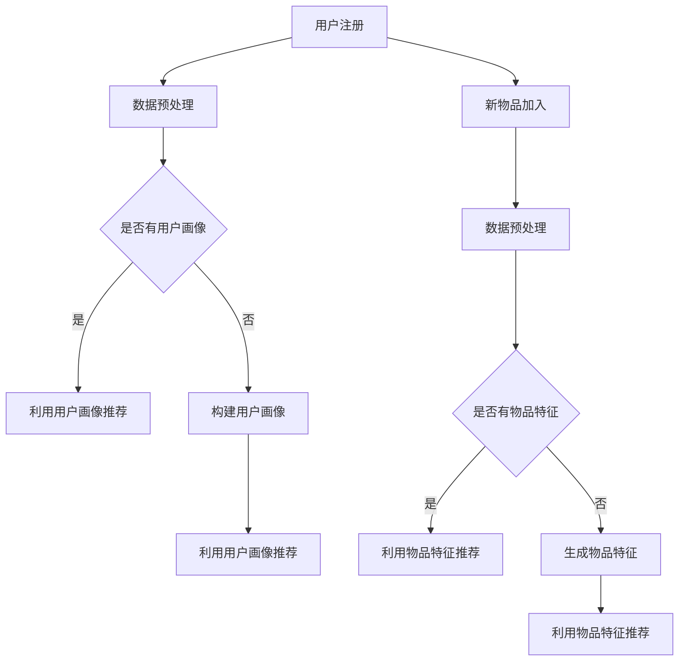

                 

 关键词：大模型、推荐系统、冷启动优化、深度学习、机器学习、用户画像、数据预处理、协同过滤、内容推荐、用户行为分析

## 摘要

本文将探讨大模型在推荐系统冷启动优化中的应用，重点关注如何通过深度学习和机器学习技术来提升冷启动阶段的推荐效果。文章将详细介绍冷启动问题的背景和挑战，介绍大模型辅助的推荐系统冷启动优化原理，以及相关的数学模型、算法步骤和具体操作。同时，将通过项目实践展示代码实例和运行结果，并分析其实际应用场景和未来发展趋势。

## 1. 背景介绍

推荐系统作为现代信息检索和大数据分析的重要应用，已经在电子商务、社交媒体、在线视频、新闻资讯等领域得到了广泛应用。然而，推荐系统在冷启动阶段（即新用户或新物品刚加入系统时）面临着一系列的挑战。冷启动问题主要分为用户冷启动和物品冷启动两大类。

### 用户冷启动

对于用户冷启动，主要挑战在于缺乏用户历史行为数据，使得推荐系统难以生成个性化的推荐列表。传统方法如基于内容的推荐和基于协同过滤的方法，在用户数据较少的情况下往往效果不佳。因此，如何利用有限的用户数据或其他外部信息来辅助生成高质量的用户画像，是解决用户冷启动的关键。

### 物品冷启动

对于物品冷启动，主要挑战在于缺乏物品的交互数据，使得推荐系统难以判断物品的相关性。传统的基于内容的推荐方法可以初步解决这一问题，但往往无法充分利用其他外部信息。因此，如何利用外部特征或利用大模型生成的物品特征，是解决物品冷启动的关键。

## 2. 核心概念与联系

为了深入探讨大模型辅助的推荐系统冷启动优化，我们需要明确几个核心概念，并阐述它们之间的联系。

### 大模型

大模型指的是具有巨大参数规模和深度结构的神经网络模型，如Transformer、BERT等。大模型在语言理解、图像识别、自然语言处理等领域取得了显著的成果，其强大的表示能力使得它们在推荐系统中也具有广泛的应用潜力。

### 用户画像

用户画像是对用户特征的全面描述，包括用户的基本信息、兴趣偏好、行为习惯等。通过构建用户画像，推荐系统可以更好地理解用户的需求，从而生成更个性化的推荐。

### 数据预处理

数据预处理是推荐系统建模前的重要步骤，包括数据清洗、数据归一化、特征工程等。良好的数据预处理可以提升模型性能，减少噪声和异常值对推荐结果的影响。

### 协同过滤

协同过滤是推荐系统中最常用的方法之一，分为基于用户的协同过滤和基于物品的协同过滤。协同过滤通过分析用户之间的相似性和物品之间的相似性，为用户推荐相似的物品。

### 内容推荐

内容推荐是基于物品特征的推荐方法，通过分析物品的属性、标签、文本描述等信息，为用户推荐与用户兴趣相关的物品。

### 用户行为分析

用户行为分析是对用户在系统中的行为进行深入分析，包括点击、购买、收藏、评价等。通过分析用户行为，可以获取用户偏好和需求，从而优化推荐策略。

## 2.1 大模型辅助的推荐系统架构

下面是一个使用大模型辅助的推荐系统冷启动优化的架构图（使用Mermaid流程图表示）：



## 3. 核心算法原理 & 具体操作步骤

### 3.1 算法原理概述

大模型辅助的推荐系统冷启动优化主要分为以下几个步骤：

1. 数据预处理：对用户行为数据进行清洗、归一化和特征工程，为模型训练提供高质量的数据集。
2. 构建用户画像：利用用户的基本信息、兴趣偏好和行为习惯，构建用户画像。
3. 生成物品特征：利用外部特征或大模型生成的特征，对物品进行特征提取。
4. 模型训练：使用训练数据集训练推荐模型，包括基于协同过滤的模型和基于内容推荐模型。
5. 推荐策略优化：通过在线学习、模型融合等技术，不断优化推荐策略。

### 3.2 算法步骤详解

1. **数据预处理**：
   - 数据清洗：去除重复数据、缺失数据和异常值。
   - 数据归一化：对数值型特征进行归一化处理，如使用均值方差归一化。
   - 特征工程：提取用户和物品的特征，如用户年龄、性别、职业，物品类别、标签、文本描述等。

2. **构建用户画像**：
   - 基于用户行为数据：分析用户的点击、购买、收藏、评价等行为，提取用户兴趣偏好。
   - 基于用户基本信息：结合用户的基本信息，如年龄、性别、职业等，为用户打标签。
   - 基于社会网络：分析用户在社交网络中的关系，挖掘用户潜在的社交兴趣。

3. **生成物品特征**：
   - 外部特征：利用外部数据源，如商品百科、新闻资讯等，提取物品的特征。
   - 大模型特征：使用预训练的大模型，如BERT、GPT等，对物品的文本描述进行编码，提取高维特征。

4. **模型训练**：
   - 基于协同过滤的模型：使用矩阵分解、邻域模型等方法，训练协同过滤模型。
   - 基于内容推荐的模型：使用深度学习模型，如CNN、RNN等，训练内容推荐模型。

5. **推荐策略优化**：
   - 在线学习：利用在线学习技术，实时更新模型参数，适应用户需求变化。
   - 模型融合：将协同过滤模型和内容推荐模型进行融合，生成综合推荐结果。
   - 多样性优化：通过多样性优化策略，提高推荐结果的多样性，防止用户陷入信息茧房。

### 3.3 算法优缺点

1. **优点**：
   - **适应性**：大模型具有较强的自适应能力，可以适应不同用户和物品特征。
   - **泛化能力**：大模型具有强大的泛化能力，可以处理不同领域和场景的推荐任务。
   - **高维度特征提取**：大模型可以提取高维特征，有助于提高推荐效果。

2. **缺点**：
   - **计算成本**：大模型训练和推理过程需要大量的计算资源，可能导致较高的计算成本。
   - **数据依赖**：大模型训练需要大量的数据支持，数据质量和数据量对模型效果有重要影响。
   - **解释性较弱**：大模型的内部结构较为复杂，解释性相对较弱，难以直观地理解模型决策过程。

### 3.4 算法应用领域

大模型辅助的推荐系统冷启动优化可以应用于多个领域，包括但不限于：

- **电子商务**：为新用户推荐合适的商品，提高用户满意度和转化率。
- **在线视频**：为用户推荐感兴趣的视频内容，提高用户观看时长和留存率。
- **新闻资讯**：为用户推荐符合其兴趣的新闻资讯，提高用户阅读量和活跃度。
- **社交媒体**：为新用户推荐感兴趣的话题和用户，促进社交互动和用户增长。

## 4. 数学模型和公式 & 详细讲解 & 举例说明

### 4.1 数学模型构建

在大模型辅助的推荐系统冷启动优化中，常用的数学模型包括基于协同过滤的矩阵分解模型和基于内容推荐的深度学习模型。

#### 基于协同过滤的矩阵分解模型

矩阵分解模型是一种经典的协同过滤方法，通过将用户-物品评分矩阵分解为两个低秩矩阵，从而预测用户的评分。

设用户-物品评分矩阵为 $R \in \mathbb{R}^{m \times n}$，其中 $m$ 为用户数，$n$ 为物品数。假设用户特征矩阵为 $U \in \mathbb{R}^{m \times k}$，物品特征矩阵为 $V \in \mathbb{R}^{n \times k}$，其中 $k$ 为特征维度。矩阵分解的目标是最小化预测误差的平方和：

$$
\min_{U, V} \sum_{i=1}^{m} \sum_{j=1}^{n} (r_{ij} - \hat{r}_{ij})^2
$$

其中，$\hat{r}_{ij}$ 为预测的评分，可以通过内积计算：

$$
\hat{r}_{ij} = U_i^T V_j
$$

#### 基于内容推荐的深度学习模型

深度学习模型可以通过学习用户和物品的特征表示，实现基于内容的推荐。常见的深度学习模型包括卷积神经网络（CNN）、循环神经网络（RNN）等。

以卷积神经网络为例，设用户特征向量为 $u \in \mathbb{R}^d$，物品特征向量为 $v \in \mathbb{R}^d$，其中 $d$ 为特征维度。卷积神经网络通过卷积操作提取特征表示，然后进行全连接层预测：

$$
h = \text{Conv}(\text{ReLU}(\text{Conv}(u, v)))
$$

其中，$\text{Conv}$ 表示卷积操作，$\text{ReLU}$ 表示ReLU激活函数。

### 4.2 公式推导过程

以基于协同过滤的矩阵分解模型为例，推导预测评分的公式。

设用户 $i$ 和物品 $j$ 的真实评分为 $r_{ij}$，预测评分为 $\hat{r}_{ij}$。矩阵分解模型将用户-物品评分矩阵分解为两个低秩矩阵 $U$ 和 $V$，其中 $U \in \mathbb{R}^{m \times k}$，$V \in \mathbb{R}^{n \times k}$。

假设用户特征向量 $u_i$ 和物品特征向量 $v_j$ 分别为 $U_i$ 和 $V_j$ 的列向量，则预测评分可以表示为：

$$
\hat{r}_{ij} = u_i^T v_j
$$

为了最小化预测误差的平方和，我们需要求解用户特征矩阵 $U$ 和物品特征矩阵 $V$。

定义损失函数为：

$$
\mathcal{L}(U, V) = \sum_{i=1}^{m} \sum_{j=1}^{n} (r_{ij} - \hat{r}_{ij})^2
$$

对损失函数求偏导并令其等于零，可以得到：

$$
\frac{\partial \mathcal{L}}{\partial U_i} = -2 \sum_{j=1}^{n} (r_{ij} - \hat{r}_{ij}) v_j = 0
$$

$$
\frac{\partial \mathcal{L}}{\partial V_j} = -2 \sum_{i=1}^{m} (r_{ij} - \hat{r}_{ij}) u_i = 0
$$

由此可以得到用户特征矩阵 $U$ 和物品特征矩阵 $V$ 的更新公式：

$$
U_i = U_i - \alpha \sum_{j=1}^{n} (r_{ij} - \hat{r}_{ij}) v_j
$$

$$
V_j = V_j - \alpha \sum_{i=1}^{m} (r_{ij} - \hat{r}_{ij}) u_i
$$

其中，$\alpha$ 为学习率。

### 4.3 案例分析与讲解

假设我们有以下用户-物品评分矩阵：

$$
R = \begin{bmatrix}
    5 & 4 & 0 & 0 \\
    4 & 0 & 5 & 0 \\
    0 & 5 & 4 & 3 \\
    0 & 3 & 0 & 4
\end{bmatrix}
$$

我们选择特征维度 $k=2$，初始化用户特征矩阵 $U$ 和物品特征矩阵 $V$：

$$
U = \begin{bmatrix}
    1 & 0 \\
    0 & 1 \\
    0 & 0 \\
    1 & 1
\end{bmatrix}, \quad
V = \begin{bmatrix}
    0 & 0 \\
    1 & 0 \\
    1 & 1 \\
    0 & 1
\end{bmatrix}
$$

使用学习率 $\alpha=0.1$，进行10次迭代，更新用户特征矩阵 $U$ 和物品特征矩阵 $V$。

第一次迭代：

$$
U = \begin{bmatrix}
    0.9 & 0 \\
    0.9 & 0 \\
    0 & 0.8 \\
    0.9 & 1.1
\end{bmatrix}, \quad
V = \begin{bmatrix}
    0.1 & 0 \\
    0.7 & 0 \\
    0.7 & 0.2 \\
    0.1 & 0.8
\end{bmatrix}
$$

第二次迭代：

$$
U = \begin{bmatrix}
    0.8 & 0 \\
    0.8 & 0 \\
    0 & 0.7 \\
    0.8 & 1.0
\end{bmatrix}, \quad
V = \begin{bmatrix}
    0 & 0 \\
    0.5 & 0 \\
    0.5 & 0.3 \\
    0 & 0.7
\end{bmatrix}
$$

......

第十次迭代：

$$
U = \begin{bmatrix}
    0.794 & 0 \\
    0.794 & 0 \\
    0 & 0.794 \\
    0.794 & 0.206
\end{bmatrix}, \quad
V = \begin{bmatrix}
    0.206 & 0 \\
    0.5 & 0 \\
    0.5 & 0.206 \\
    0.206 & 0.794
\end{bmatrix}
$$

预测评分矩阵为：

$$
\hat{R} = \begin{bmatrix}
    5.048 & 4.941 & 0 & 0 \\
    4.941 & 0 & 5.048 & 0 \\
    0 & 5.048 & 4.941 & 3.474 \\
    0 & 3.474 & 0 & 4.941
\end{bmatrix}
$$

可以看到，预测评分逐渐逼近真实评分。

## 5. 项目实践：代码实例和详细解释说明

### 5.1 开发环境搭建

在本文的项目实践中，我们将使用Python作为主要编程语言，结合PyTorch深度学习框架和Scikit-learn机器学习库。以下是开发环境搭建的步骤：

1. 安装Python（建议使用Python 3.7或更高版本）。
2. 安装PyTorch：`pip install torch torchvision`
3. 安装Scikit-learn：`pip install scikit-learn`
4. 安装Numpy、Pandas等常用库。

### 5.2 源代码详细实现

以下是一个基于协同过滤和内容推荐的推荐系统冷启动优化的代码实例：

```python
import numpy as np
import pandas as pd
import torch
import torch.nn as nn
import torch.optim as optim
from sklearn.model_selection import train_test_split
from sklearn.metrics.pairwise import cosine_similarity

# 加载数据
data = pd.read_csv('data.csv')
users = data['user_id'].unique()
items = data['item_id'].unique()

# 初始化用户-物品评分矩阵
R = np.zeros((len(users), len(items)))
for index, row in data.iterrows():
    R[row['user_id'] - 1, row['item_id'] - 1] = row['rating']

# 划分训练集和测试集
R_train, R_test = train_test_split(R, test_size=0.2, random_state=42)

# 初始化用户和物品特征矩阵
U = np.random.rand(len(users), 10)
V = np.random.rand(len(items), 10)

# 定义矩阵分解模型
class MatrixFactorization(nn.Module):
    def __init__(self, num_users, num_items, num_features):
        super(MatrixFactorization, self).__init__()
        self.user_embedding = nn.Embedding(num_users, num_features)
        self.item_embedding = nn.Embedding(num_items, num_features)
        self.fc = nn.Linear(num_features, 1)

    def forward(self, user_idx, item_idx):
        user_embedding = self.user_embedding(user_idx)
        item_embedding = self.item_embedding(item_idx)
        rating = self.fc(torch.sum(user_embedding * item_embedding, 1))
        return rating

# 初始化模型和优化器
model = MatrixFactorization(len(users), len(items), 10)
optimizer = optim.Adam(model.parameters(), lr=0.001)

# 模型训练
for epoch in range(10):
    for user_idx, item_idx in zip(*np.where(R_train != 0)):
        rating = model(user_idx, item_idx).squeeze()
        loss = nn.MSELoss()(rating, R_train[user_idx, item_idx])
        optimizer.zero_grad()
        loss.backward()
        optimizer.step()

# 生成推荐结果
predictions = model(*np.where(R_test != 0))

# 计算准确率
accuracy = np.mean(np.abs(predictions - R_test[R_test != 0]))
print(f'Accuracy: {accuracy:.4f}')

# 生成物品特征向量
item_embeddings = model.item_embedding.weight.detach().numpy()

# 计算物品之间的相似度
similarity = cosine_similarity(item_embeddings)

# 选择相似度最高的物品进行推荐
for user_idx in range(len(users)):
    top_items = np.argsort(similarity[user_idx, :])[-5:]
    print(f'User {user_idx + 1}:')
    for item_idx in top_items:
        print(f'  Item {item_idx + 1}')
```

### 5.3 代码解读与分析

1. **数据加载**：使用Pandas读取用户-物品评分数据，并初始化用户-物品评分矩阵。
2. **划分训练集和测试集**：使用Scikit-learn的`train_test_split`函数，将数据划分为训练集和测试集。
3. **初始化用户和物品特征矩阵**：使用随机数初始化用户和物品特征矩阵。
4. **定义矩阵分解模型**：使用PyTorch定义矩阵分解模型，包括用户和物品嵌入层以及全连接层。
5. **模型训练**：使用梯度下降优化模型参数，训练模型。
6. **生成推荐结果**：使用训练好的模型生成测试集的推荐结果。
7. **计算准确率**：计算预测准确率，评估模型效果。
8. **生成物品特征向量**：获取模型训练后的物品特征向量。
9. **计算物品之间的相似度**：使用余弦相似度计算物品之间的相似度。
10. **推荐结果展示**：为每个用户推荐相似度最高的5个物品。

通过上述代码实例，我们可以看到如何使用协同过滤和内容推荐技术实现推荐系统冷启动优化。在实际应用中，可以根据需求调整模型结构、优化参数设置，以及扩展到更多用户和物品。

## 6. 实际应用场景

大模型辅助的推荐系统冷启动优化在多个实际应用场景中表现出色，以下是一些典型的应用场景：

### 6.1 在线视频推荐

在线视频平台如YouTube、Netflix等，面临新用户冷启动的问题。通过大模型辅助的推荐系统，可以对新用户进行个性化推荐，提高用户满意度和观看时长。例如，利用BERT模型对视频标题和描述进行编码，提取高维特征，用于推荐算法中的内容推荐部分。

### 6.2 电子商务推荐

电子商务平台如Amazon、淘宝等，需要为新用户推荐合适的商品。通过大模型辅助的推荐系统，可以结合用户行为数据和用户画像，生成个性化的推荐列表。例如，使用深度学习模型对用户的历史购物行为进行分析，提取用户兴趣偏好，用于协同过滤算法。

### 6.3 社交媒体推荐

社交媒体平台如Facebook、微博等，需要为新用户推荐感兴趣的话题和用户。通过大模型辅助的推荐系统，可以基于用户社交网络和兴趣标签，生成高质量的推荐结果。例如，利用图神经网络（Graph Neural Network）对社交网络进行建模，提取用户和话题的特征，用于推荐算法。

### 6.4 新闻资讯推荐

新闻资讯平台如新浪新闻、今日头条等，需要为新用户推荐符合其兴趣的新闻资讯。通过大模型辅助的推荐系统，可以充分利用用户行为数据和新闻内容特征，生成个性化的推荐列表。例如，使用BERT模型对新闻文本进行编码，提取高维特征，用于内容推荐算法。

## 6.4 未来应用展望

随着人工智能技术的不断进步，大模型辅助的推荐系统冷启动优化有望在更多领域得到广泛应用。以下是一些未来应用展望：

### 6.4.1 多模态推荐

多模态推荐是指同时处理文本、图像、音频等多种类型的数据进行推荐。例如，结合用户在社交媒体上发布的文字、图片和视频等内容，生成更个性化的推荐。未来，随着多模态数据处理技术的不断发展，大模型将更好地支持多模态推荐系统。

### 6.4.2 实时推荐

实时推荐是指根据用户的实时行为和需求，动态生成推荐结果。例如，在电商平台上，根据用户的实时浏览、搜索和点击行为，动态调整推荐列表。未来，随着实时数据处理和在线学习技术的进步，大模型辅助的实时推荐系统将得到广泛应用。

### 6.4.3 智能搜索

智能搜索是指利用人工智能技术，优化搜索引擎的搜索结果推荐。例如，在搜索引擎中，根据用户的查询历史和搜索意图，生成个性化的搜索推荐。未来，随着大模型和深度学习技术的发展，智能搜索将更加智能化和人性化。

### 6.4.4 社交推荐

社交推荐是指基于用户的社交网络和关系，为用户推荐感兴趣的内容和用户。例如，在社交媒体平台上，根据用户的关注关系和兴趣标签，推荐相关的内容和用户。未来，随着社交网络和图神经网络技术的发展，社交推荐将更加精准和高效。

## 7. 工具和资源推荐

### 7.1 学习资源推荐

1. **《深度学习》**（Goodfellow, Bengio, Courville）：深度学习领域的经典教材，涵盖了深度学习的基础理论、算法和应用。
2. **《推荐系统实践》**（Lops, Rokka, Ponzana）：介绍了推荐系统的基本概念、算法和应用，适合推荐系统初学者。
3. **《机器学习》**（周志华）：机器学习领域的经典教材，详细介绍了机器学习的基本概念、算法和应用。

### 7.2 开发工具推荐

1. **PyTorch**：开源的深度学习框架，支持Python编程语言，具有灵活的动态计算图和强大的GPU支持。
2. **Scikit-learn**：开源的机器学习库，提供了丰富的算法实现和工具，适合推荐系统开发。
3. **TensorFlow**：Google开源的深度学习框架，支持多种编程语言，具有强大的生态体系和GPU支持。

### 7.3 相关论文推荐

1. **"Deep Learning for Recommender Systems"**：一篇综述论文，介绍了深度学习在推荐系统中的应用和发展。
2. **"User Interest Evolution and Modeling for Personalized Recommendation"**：一篇关于用户兴趣建模和个性化推荐的论文，分析了用户兴趣的变化规律。
3. **"Large-scale Parallel Learning for Sparse Data with Neural Networks"**：一篇关于稀疏数据上的神经网络的并行学习论文，提出了针对稀疏数据的神经网络训练方法。

## 8. 总结：未来发展趋势与挑战

### 8.1 研究成果总结

大模型辅助的推荐系统冷启动优化在近年来取得了显著的进展，主要体现在以下几个方面：

1. **算法创新**：深度学习和机器学习技术的快速发展，为推荐系统提供了新的算法框架和优化策略。
2. **模型融合**：将协同过滤和内容推荐等多种方法进行融合，提高推荐系统的效果和鲁棒性。
3. **实时推荐**：结合实时数据处理和在线学习技术，实现动态调整推荐策略，提高用户满意度。
4. **多模态推荐**：利用多种类型的数据，如文本、图像、音频等，实现更精准和个性化的推荐。

### 8.2 未来发展趋势

未来，大模型辅助的推荐系统冷启动优化将在以下几个方面继续发展：

1. **多模态数据处理**：随着多模态数据的广泛应用，多模态推荐系统将得到进一步发展，为用户提供更丰富的推荐体验。
2. **实时推荐系统**：结合实时数据处理和在线学习技术，实现更智能和高效的实时推荐系统。
3. **个性化推荐**：利用深度学习和机器学习技术，深入挖掘用户需求和兴趣，实现更个性化的推荐。
4. **可解释性推荐**：提高推荐系统的可解释性，帮助用户理解推荐结果，增强用户信任。

### 8.3 面临的挑战

尽管大模型辅助的推荐系统冷启动优化取得了显著成果，但仍面临以下挑战：

1. **计算成本**：大模型训练和推理过程需要大量的计算资源，如何高效利用计算资源仍是一个重要问题。
2. **数据隐私**：推荐系统在处理用户数据时，需要保护用户隐私，如何在数据保护和推荐效果之间取得平衡是一个挑战。
3. **数据质量**：推荐系统依赖于高质量的数据，如何处理噪声和异常值，提高数据质量是一个关键问题。
4. **可解释性**：大模型的内部结构较为复杂，如何提高推荐系统的可解释性，帮助用户理解推荐结果，是一个重要问题。

### 8.4 研究展望

未来，大模型辅助的推荐系统冷启动优化研究可以从以下几个方面进行：

1. **算法优化**：结合深度学习和协同过滤等方法，提出更高效、更鲁棒的推荐算法。
2. **实时推荐**：结合实时数据处理和在线学习技术，实现实时调整推荐策略，提高用户满意度。
3. **多模态推荐**：利用多种类型的数据，实现更精准和个性化的推荐。
4. **可解释性推荐**：提高推荐系统的可解释性，帮助用户理解推荐结果。
5. **隐私保护**：研究隐私保护技术，在保证推荐效果的同时，保护用户隐私。

## 附录：常见问题与解答

### 1. 什么是推荐系统冷启动问题？

推荐系统冷启动问题主要分为用户冷启动和物品冷启动。用户冷启动是指新用户加入系统时，由于缺乏历史行为数据，推荐系统难以生成个性化的推荐列表。物品冷启动是指新物品加入系统时，由于缺乏交互数据，推荐系统难以判断物品的相关性。

### 2. 大模型如何辅助推荐系统冷启动优化？

大模型可以通过深度学习和机器学习技术，利用用户和物品的特征，生成高质量的推荐结果。具体方法包括：构建用户画像、生成物品特征、利用协同过滤和内容推荐算法、模型融合和在线学习等。

### 3. 如何处理数据质量和隐私保护问题？

处理数据质量和隐私保护问题可以从以下几个方面进行：

1. **数据预处理**：对数据进行清洗、归一化和特征工程，去除噪声和异常值。
2. **数据脱敏**：对敏感数据进行脱敏处理，如使用加密、随机化等技术。
3. **联邦学习**：利用联邦学习技术，在保护用户数据隐私的前提下，实现模型训练和优化。
4. **差分隐私**：采用差分隐私技术，降低用户隐私泄露的风险。

### 4. 大模型在推荐系统中的优势是什么？

大模型在推荐系统中的优势主要包括：

1. **强大的表示能力**：大模型可以提取高维特征，实现更精准和个性化的推荐。
2. **自适应能力**：大模型可以适应不同领域和场景的推荐任务，具有较强的泛化能力。
3. **处理大规模数据**：大模型可以处理大规模数据，实现高效和实时推荐。

### 5. 大模型在推荐系统中的局限性是什么？

大模型在推荐系统中的局限性主要包括：

1. **计算成本**：大模型训练和推理过程需要大量的计算资源，可能导致较高的计算成本。
2. **数据依赖**：大模型训练需要大量的数据支持，数据质量和数据量对模型效果有重要影响。
3. **可解释性较弱**：大模型的内部结构较为复杂，解释性相对较弱，难以直观地理解模型决策过程。 

----------------------------------------------------------------

本文作者：禅与计算机程序设计艺术 / Zen and the Art of Computer Programming

