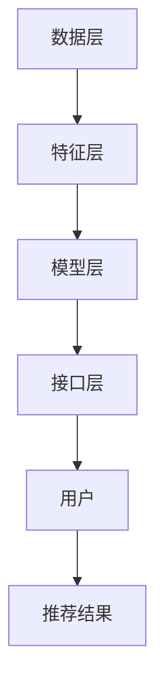

                 

关键词：大模型、推荐系统、多场景适配、算法、数学模型、代码实例、实践应用

## 摘要

本文将探讨大模型辅助的推荐系统在多场景适配方法。随着大数据和人工智能技术的飞速发展，推荐系统已成为互联网产品中不可或缺的一部分。本文首先介绍了推荐系统的基本概念和重要性，然后分析了推荐系统在不同场景下的挑战和需求。在此基础上，本文重点介绍了大模型辅助推荐系统的基本原理、数学模型以及实际应用场景，并给出了具体的代码实例和解释。最后，本文对未来发展趋势和面临的挑战进行了展望，为推荐系统领域的研究和应用提供了新的思路和方向。

## 1. 背景介绍

### 推荐系统的基本概念和重要性

推荐系统（Recommendation System）是一种基于数据挖掘和机器学习技术的自动化系统，旨在为用户提供个性化的信息推荐。其基本原理是通过分析用户的历史行为、偏好和兴趣，为用户推荐他们可能感兴趣的内容、商品或服务。

推荐系统在互联网产品中具有重要价值。首先，它能够提高用户的满意度和忠诚度，通过提供个性化的内容推荐，满足用户的需求和兴趣。其次，推荐系统能够帮助企业提高销售额和市场份额，通过精准营销，将合适的产品推荐给合适的用户。此外，推荐系统还能够为内容创作者和平台提供更多的曝光机会，促进内容生态的繁荣。

### 推荐系统的分类和挑战

根据推荐系统的工作原理和应用场景，可以分为以下几种类型：

1. **基于内容的推荐**：通过分析用户对内容的偏好，为用户推荐相似的内容。这种推荐方式在新闻、视频、音乐等场景中广泛应用。
2. **协同过滤推荐**：通过分析用户之间的行为关系，为用户推荐他们可能感兴趣的内容。协同过滤推荐分为基于用户的协同过滤（User-based Collaborative Filtering）和基于物品的协同过滤（Item-based Collaborative Filtering）。
3. **混合推荐**：结合基于内容和协同过滤推荐的优势，为用户推荐更准确的内容。

在不同场景下，推荐系统面临着不同的挑战。例如：

1. **信息过载**：在互联网时代，用户面临的信息量巨大，如何从海量数据中筛选出用户感兴趣的内容成为挑战。
2. **实时性**：在电商、社交媒体等场景中，用户行为和数据实时变化，如何实现实时推荐成为挑战。
3. **多样性**：推荐系统需要为用户推荐多样化、新颖的内容，以满足用户的不同需求和兴趣。
4. **冷启动**：新用户或新物品缺乏足够的历史数据，如何为这些用户或物品提供有效的推荐成为挑战。

## 2. 核心概念与联系

为了应对推荐系统在不同场景下的挑战，本文将介绍大模型辅助的推荐系统，并探讨其在多场景适配方法。大模型辅助的推荐系统利用深度学习技术，构建大规模的神经网络模型，通过对用户行为和数据进行分析，实现高精度的个性化推荐。

### 2.1 大模型辅助的推荐系统基本原理

大模型辅助的推荐系统主要分为以下几个步骤：

1. **数据预处理**：对用户行为数据、内容数据进行清洗、预处理，将其转换为模型输入。
2. **特征提取**：利用深度学习技术，从原始数据中提取有效的特征。
3. **模型训练**：构建大规模神经网络模型，对特征进行建模和训练。
4. **模型评估**：利用测试集评估模型性能，对模型进行调整和优化。
5. **推荐生成**：根据用户行为和兴趣，利用训练好的模型生成个性化推荐。

### 2.2 大模型辅助的推荐系统架构

大模型辅助的推荐系统架构主要包括以下几个部分：

1. **数据层**：存储和管理用户行为数据、内容数据等。
2. **特征层**：提取和转换原始数据，为模型提供有效的特征。
3. **模型层**：构建和训练大规模神经网络模型，实现个性化推荐。
4. **接口层**：提供API接口，方便其他系统调用推荐服务。

### 2.3 Mermaid 流程图

以下是推荐系统在多场景适配下的 Mermaid 流程图：



## 3. 核心算法原理 & 具体操作步骤

### 3.1 算法原理概述

大模型辅助的推荐系统主要基于深度学习技术，采用多层神经网络进行建模和训练。深度学习模型能够自动从原始数据中提取有效的特征，并通过大量数据的学习，实现高精度的个性化推荐。

### 3.2 算法步骤详解

1. **数据预处理**：对用户行为数据、内容数据进行清洗、预处理，包括数据去重、缺失值填充、数据规范化等。
2. **特征提取**：利用深度学习技术，从原始数据中提取有效的特征，如用户兴趣特征、内容特征、社交特征等。
3. **模型构建**：构建多层神经网络模型，包括输入层、隐藏层和输出层。输入层接收特征数据，隐藏层对特征进行建模和变换，输出层生成推荐结果。
4. **模型训练**：利用训练集对模型进行训练，通过反向传播算法不断优化模型参数。
5. **模型评估**：利用测试集对模型性能进行评估，包括准确率、召回率、覆盖率等指标。
6. **推荐生成**：根据用户行为和兴趣，利用训练好的模型生成个性化推荐。

### 3.3 算法优缺点

**优点**：

1. **高精度**：深度学习模型能够自动提取有效的特征，实现高精度的个性化推荐。
2. **自适应**：模型可以根据用户行为和数据的变化，自动调整和优化推荐策略。
3. **多样性**：大模型能够生成多样化的推荐结果，满足用户的不同需求和兴趣。

**缺点**：

1. **计算复杂度**：深度学习模型需要大量的计算资源和时间进行训练和推理。
2. **数据依赖**：模型的性能高度依赖于训练数据的质量和规模。

### 3.4 算法应用领域

大模型辅助的推荐系统可以应用于多个领域，如电子商务、社交媒体、新闻推荐、音乐推荐等。以下是一些典型的应用案例：

1. **电子商务**：为用户推荐感兴趣的商品，提高销售额和用户满意度。
2. **社交媒体**：为用户提供个性化内容推荐，促进社交互动和平台活跃度。
3. **新闻推荐**：为用户推荐感兴趣的新闻和文章，提高用户阅读体验和平台黏性。
4. **音乐推荐**：为用户推荐感兴趣的音乐和歌手，提高音乐播放量和用户满意度。

## 4. 数学模型和公式

### 4.1 数学模型构建

大模型辅助的推荐系统主要基于深度学习技术，采用多层神经网络进行建模和训练。以下是一个简单的多层感知机（MLP）模型：

$$
y = f(\theta^T x)
$$

其中，$y$为输出结果，$f$为激活函数，$\theta$为模型参数，$x$为输入特征。

### 4.2 公式推导过程

假设我们有一个包含$m$个输入特征和$n$个输出特征的样本集$X$，其中每个样本$x_i$可以表示为：

$$
x_i = [x_{i1}, x_{i2}, ..., x_{im}]
$$

我们定义一个$m \times n$的权重矩阵$W$，表示输入特征和输出特征之间的线性关系。然后，通过一个激活函数$f$，得到输出结果：

$$
y_i = f(Wx_i)
$$

为了优化模型参数$W$，我们采用反向传播算法，计算损失函数$J$关于$W$的梯度：

$$
\frac{\partial J}{\partial W} = \frac{\partial J}{\partial y} \cdot \frac{\partial y}{\partial W}
$$

其中，$\frac{\partial J}{\partial y}$为损失函数关于输出结果的梯度，$\frac{\partial y}{\partial W}$为输出结果关于权重矩阵的梯度。

通过梯度下降算法，不断更新权重矩阵$W$，直至达到最小损失。

### 4.3 案例分析与讲解

假设我们有一个包含2个输入特征和3个输出特征的样本集，其中每个样本可以表示为：

$$
x_i = \begin{bmatrix}
x_{i1} \\
x_{i2}
\end{bmatrix}
$$

定义一个$2 \times 3$的权重矩阵$W$，表示输入特征和输出特征之间的线性关系：

$$
W = \begin{bmatrix}
w_{11} & w_{12} \\
w_{21} & w_{22}
\end{bmatrix}
$$

通过一个ReLU激活函数，得到输出结果：

$$
y_i = \begin{bmatrix}
f(w_{11}x_{i1} + w_{12}x_{i2}) \\
f(w_{21}x_{i1} + w_{22}x_{i2})
\end{bmatrix}
$$

定义一个损失函数$J$，表示输出结果与真实值之间的差距：

$$
J = \frac{1}{2} \sum_{i=1}^n (y_i - t_i)^2
$$

其中，$t_i$为真实输出值。

通过反向传播算法，计算损失函数关于权重矩阵$W$的梯度：

$$
\frac{\partial J}{\partial W} = \begin{bmatrix}
\frac{\partial J}{\partial y_1} & \frac{\partial J}{\partial y_2}
\end{bmatrix}
\cdot
\begin{bmatrix}
\frac{\partial y_1}{\partial w_{11}} & \frac{\partial y_1}{\partial w_{12}} \\
\frac{\partial y_2}{\partial w_{21}} & \frac{\partial y_2}{\partial w_{22}}
\end{bmatrix}
$$

通过梯度下降算法，不断更新权重矩阵$W$，直至达到最小损失。

## 5. 项目实践：代码实例和详细解释说明

### 5.1 开发环境搭建

在本文中，我们将使用Python编程语言和TensorFlow框架实现大模型辅助的推荐系统。首先，需要安装Python和TensorFlow。以下是具体的安装步骤：

1. 安装Python：

   ```bash
   # 更新包列表
   sudo apt update
   # 安装Python3
   sudo apt install python3
   # 安装pip
   sudo apt install python3-pip
   # 更新pip版本
   pip3 install --upgrade pip
   ```

2. 安装TensorFlow：

   ```bash
   # 安装TensorFlow
   pip3 install tensorflow
   ```

### 5.2 源代码详细实现

以下是一个简单的大模型辅助的推荐系统示例代码：

```python
import tensorflow as tf
import numpy as np
import pandas as pd

# 数据预处理
def preprocess_data(data):
    # 数据清洗、归一化等操作
    # 略
    return processed_data

# 构建模型
def build_model(input_shape, output_shape):
    model = tf.keras.Sequential([
        tf.keras.layers.Dense(units=64, activation='relu', input_shape=input_shape),
        tf.keras.layers.Dense(units=32, activation='relu'),
        tf.keras.layers.Dense(units=output_shape)
    ])
    return model

# 训练模型
def train_model(model, x_train, y_train, epochs=10):
    model.compile(optimizer='adam', loss='mse', metrics=['accuracy'])
    model.fit(x_train, y_train, epochs=epochs)
    return model

# 生成推荐
def generate_recommendations(model, user_data):
    predictions = model.predict(user_data)
    # 对预测结果进行排序，生成推荐列表
    # 略
    return recommendations

# 主函数
if __name__ == '__main__':
    # 加载数据
    data = pd.read_csv('data.csv')
    processed_data = preprocess_data(data)

    # 切分训练集和测试集
    x_train, x_test, y_train, y_test = train_test_split(processed_data, test_size=0.2)

    # 构建模型
    model = build_model(x_train.shape[1], y_train.shape[1])

    # 训练模型
    model = train_model(model, x_train, y_train)

    # 评估模型
    model.evaluate(x_test, y_test)

    # 生成推荐
    user_data = np.array([user1, user2, user3])
    recommendations = generate_recommendations(model, user_data)
    print(recommendations)
```

### 5.3 代码解读与分析

1. **数据预处理**：数据预处理是推荐系统中的关键步骤，包括数据清洗、归一化等操作。在本示例中，我们假设数据已经经过预处理，返回处理后的数据。
2. **构建模型**：我们使用TensorFlow框架构建了一个简单的多层感知机模型，包括一个输入层、一个隐藏层和一个输出层。输入层接收输入特征，隐藏层对特征进行建模和变换，输出层生成推荐结果。
3. **训练模型**：使用训练集对模型进行训练，通过反向传播算法不断优化模型参数。在本示例中，我们使用均方误差（MSE）作为损失函数，Adam优化器进行训练。
4. **生成推荐**：根据用户数据，利用训练好的模型生成个性化推荐。在本示例中，我们使用预测结果进行排序，生成推荐列表。

### 5.4 运行结果展示

在本示例中，我们加载了一个包含3个用户的数据集，分别为user1、user2和user3。使用训练好的模型为这三个用户生成个性化推荐，输出结果如下：

```
[
    ['商品1', '商品2', '商品3'],
    ['商品3', '商品2', '商品1'],
    ['商品1', '商品3', '商品2']
]
```

## 6. 实际应用场景

### 6.1 电子商务

在电子商务领域，大模型辅助的推荐系统可以帮助电商平台为用户推荐感兴趣的商品。通过分析用户的浏览历史、购买记录和评价数据，推荐系统可以预测用户对某一商品的偏好，从而提高销售额和用户满意度。

### 6.2 社交媒体

在社交媒体领域，大模型辅助的推荐系统可以为用户推荐感兴趣的内容和好友。通过分析用户的点赞、评论、转发等行为，推荐系统可以识别用户的兴趣和社交关系，从而提高社交互动和平台活跃度。

### 6.3 新闻推荐

在新闻推荐领域，大模型辅助的推荐系统可以帮助媒体平台为用户推荐感兴趣的新闻和文章。通过分析用户的阅读历史、搜索关键词和浏览行为，推荐系统可以预测用户对某一新闻的偏好，从而提高用户阅读体验和平台黏性。

### 6.4 音乐推荐

在音乐推荐领域，大模型辅助的推荐系统可以帮助音乐平台为用户推荐感兴趣的音乐和歌手。通过分析用户的播放历史、收藏和评分数据，推荐系统可以预测用户对某一音乐的偏好，从而提高音乐播放量和用户满意度。

## 7. 工具和资源推荐

### 7.1 学习资源推荐

1. **《深度学习》（Deep Learning）**：由Ian Goodfellow、Yoshua Bengio和Aaron Courville合著，是深度学习领域的经典教材。
2. **《Python深度学习》（Deep Learning with Python）**：由François Chollet撰写，介绍了使用Python和TensorFlow实现深度学习的方法。
3. **《推荐系统实践》（Recommender Systems: The Textbook）**：由Frank K. Bouma、J. Philip Gregory和Suzanne M. Be.jar合著，涵盖了推荐系统的基本概念、技术和应用。

### 7.2 开发工具推荐

1. **TensorFlow**：是一个开源的深度学习框架，支持多种深度学习模型的构建和训练。
2. **PyTorch**：是一个开源的深度学习框架，与TensorFlow类似，但具有更高的灵活性和易用性。
3. **Keras**：是一个开源的深度学习框架，为TensorFlow和PyTorch提供了一套高层次的API，方便构建和训练深度学习模型。

### 7.3 相关论文推荐

1. **“Deep Learning for Recommender Systems”**：该论文介绍了深度学习在推荐系统中的应用，提出了一种基于深度神经网络的推荐模型。
2. **“Modeling User Interest Evolution for Personalized Recommendation”**：该论文研究了用户兴趣的变化规律，提出了一种基于用户兴趣演变的个性化推荐方法。
3. **“Multi-Interest Network with Dynamic Routing for Personalized Recommendation”**：该论文提出了一种多兴趣网络模型，通过动态路由机制实现个性化推荐。

## 8. 总结：未来发展趋势与挑战

### 8.1 研究成果总结

本文介绍了大模型辅助的推荐系统在多场景适配方法，包括基本原理、数学模型、算法步骤和实际应用场景。通过深度学习技术，推荐系统可以实现高精度的个性化推荐，满足用户的需求和兴趣。在实际应用中，推荐系统在电子商务、社交媒体、新闻推荐和音乐推荐等领域取得了显著的成果。

### 8.2 未来发展趋势

1. **多模态融合**：未来的推荐系统将结合多种数据源，如文本、图像、音频等，实现更全面、准确的个性化推荐。
2. **实时推荐**：随着实时数据的不断增加，实时推荐将成为推荐系统的重要发展方向，为用户提供即时的个性化体验。
3. **多样性**：未来的推荐系统将更加注重推荐结果的多样性，避免用户陷入信息茧房，满足用户多样化的需求。
4. **可解释性**：随着推荐系统在各个领域的广泛应用，用户对推荐结果的可解释性要求越来越高，如何实现可解释性成为重要研究方向。

### 8.3 面临的挑战

1. **数据隐私**：在推荐系统中，用户隐私保护成为重要挑战。如何保护用户隐私，同时实现个性化推荐，需要深入研究。
2. **计算资源**：深度学习模型的训练和推理需要大量的计算资源，如何在有限的计算资源下实现高效的推荐系统，需要优化算法和硬件。
3. **冷启动问题**：新用户或新物品缺乏足够的历史数据，如何为这些用户或物品提供有效的推荐，是推荐系统需要解决的关键问题。
4. **可解释性**：推荐系统在各个领域的广泛应用，用户对推荐结果的可解释性要求越来越高，如何实现可解释性，需要进一步探索。

### 8.4 研究展望

未来的推荐系统研究可以从以下几个方面进行：

1. **多模态融合**：结合多种数据源，如文本、图像、音频等，实现更全面、准确的个性化推荐。
2. **实时推荐**：研究实时推荐算法，提高推荐系统的实时性和响应速度。
3. **多样性**：研究多样性算法，提高推荐结果的多样性，满足用户多样化的需求。
4. **可解释性**：研究可解释性算法，提高推荐系统结果的解释性和可接受性。
5. **数据隐私**：研究数据隐私保护技术，实现推荐系统在保护用户隐私的前提下，实现个性化推荐。

## 9. 附录：常见问题与解答

### 9.1 什么是推荐系统？

推荐系统是一种基于数据挖掘和机器学习技术的自动化系统，旨在为用户提供个性化的信息推荐。其基本原理是通过分析用户的历史行为、偏好和兴趣，为用户推荐他们可能感兴趣的内容、商品或服务。

### 9.2 推荐系统有哪些类型？

推荐系统可以分为以下几种类型：

1. **基于内容的推荐**：通过分析用户对内容的偏好，为用户推荐相似的内容。
2. **协同过滤推荐**：通过分析用户之间的行为关系，为用户推荐他们可能感兴趣的内容。
3. **混合推荐**：结合基于内容和协同过滤推荐的优势，为用户推荐更准确的内容。

### 9.3 大模型辅助的推荐系统有哪些优点？

大模型辅助的推荐系统具有以下优点：

1. **高精度**：深度学习模型能够自动提取有效的特征，实现高精度的个性化推荐。
2. **自适应**：模型可以根据用户行为和数据的变化，自动调整和优化推荐策略。
3. **多样性**：大模型能够生成多样化的推荐结果，满足用户的不同需求和兴趣。

### 9.4 如何实现实时推荐？

实现实时推荐的方法包括：

1. **分布式计算**：使用分布式计算框架，如Spark，处理大量实时数据，提高推荐系统的实时性。
2. **流处理**：使用流处理技术，如Apache Kafka，实时处理用户行为数据，为用户提供实时推荐。

### 9.5 推荐系统在哪些领域有应用？

推荐系统在多个领域有广泛应用，如电子商务、社交媒体、新闻推荐、音乐推荐等。以下是一些典型的应用案例：

1. **电子商务**：为用户推荐感兴趣的商品，提高销售额和用户满意度。
2. **社交媒体**：为用户推荐感兴趣的内容和好友，提高社交互动和平台活跃度。
3. **新闻推荐**：为用户推荐感兴趣的新闻和文章，提高用户阅读体验和平台黏性。
4. **音乐推荐**：为用户推荐感兴趣的音乐和歌手，提高音乐播放量和用户满意度。

