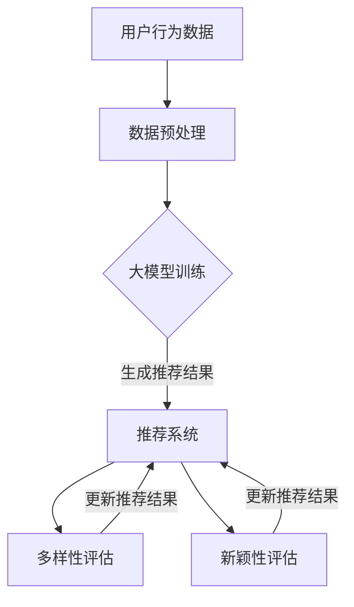

                 

关键词：推荐系统、大模型、多样性、新颖性、平衡

> 摘要：本文探讨了推荐系统在大模型辅助下的多样性与新颖性平衡问题，分析了现有技术的不足，提出了基于大模型的新型推荐算法，并详细阐述了算法原理、数学模型、实际应用场景以及未来发展趋势。

## 1. 背景介绍

推荐系统作为信息过滤和搜索的重要工具，在电子商务、社交媒体、在线视频等领域发挥着关键作用。传统的推荐系统依赖于用户的历史行为数据，通过协同过滤、矩阵分解等方法生成推荐结果。然而，随着数据量的爆炸性增长和用户偏好的多样化，传统推荐系统的多样性和新颖性逐渐受到挑战。

大模型的兴起为推荐系统带来了新的机遇。大模型，如深度神经网络，拥有强大的建模能力和自适应能力，能够捕捉复杂的用户行为模式和偏好。然而，大模型在提高推荐效果的同时，也带来了多样性与新颖性的问题。如何在保证推荐效果的前提下，实现多样性和新颖性的平衡，成为当前研究的热点问题。

## 2. 核心概念与联系

### 2.1 多样性（Diversity）

多样性是指推荐结果之间的差异性，避免用户收到重复或相似的内容。一个良好的推荐系统应该能够为用户提供多样化的选择，以满足不同兴趣和需求。

### 2.2 新颖性（Novelty）

新颖性是指推荐结果的独特性和未体验过的新内容。新颖性能够激发用户的好奇心和探索欲望，提高用户满意度。

### 2.3 大模型辅助推荐系统（Large-scale Model-assisted Recommendation System）

大模型辅助推荐系统利用深度学习、自然语言处理等技术，对大规模用户行为数据进行建模，生成个性化推荐结果。大模型能够自动捕捉复杂的用户行为模式和偏好，提高推荐效果。

### 2.4 Mermaid 流程图



## 3. 核心算法原理 & 具体操作步骤

### 3.1 算法原理概述

本文提出的基于大模型的推荐系统多样性和新颖性平衡算法，主要包括以下三个步骤：

1. **用户行为数据建模**：使用深度学习技术，如自注意力机制，对用户的历史行为数据进行建模，提取用户兴趣特征。
2. **推荐结果生成**：根据用户兴趣特征，利用大模型生成个性化推荐结果。
3. **多样性和新颖性评估**：对推荐结果进行多样性和新颖性评估，根据评估结果更新推荐结果。

### 3.2 算法步骤详解

1. **数据预处理**：对用户行为数据进行清洗和预处理，如去重、归一化等操作。
2. **用户行为数据建模**：
   $$\text{User\_Model} = \text{Attention}(User\_Behavior\_Data)$$
   其中，$\text{Attention}$ 表示自注意力机制。
3. **推荐结果生成**：
   $$\text{Recommendation} = \text{Model}(User\_Model, Item\_Feature)$$
   其中，$\text{Model}$ 表示大模型，$User\_Model$ 表示用户兴趣特征，$Item\_Feature$ 表示物品特征。
4. **多样性评估**：
   $$Diversity = \text{Distance}(Recommendation)$$
   其中，$\text{Distance}$ 表示推荐结果之间的距离度量。
5. **新颖性评估**：
   $$Novelty = \text{Unseen\_Ratio}(Recommendation)$$
   其中，$\text{Unseen\_Ratio}$ 表示推荐结果中未体验过的内容的比例。
6. **更新推荐结果**：根据多样性评估和新颖性评估结果，更新推荐结果，以提高多样性和新颖性。

### 3.3 算法优缺点

#### 优点

1. **高效性**：利用大模型自动提取用户兴趣特征，提高推荐效率。
2. **多样性**：通过多样性评估和更新机制，确保推荐结果的多样性。
3. **新颖性**：通过新颖性评估和更新机制，确保推荐结果的新颖性。

#### 缺点

1. **计算资源消耗**：大模型训练和推荐过程需要大量的计算资源。
2. **数据依赖性**：算法效果依赖于用户行为数据的质量和完整性。

### 3.4 算法应用领域

1. **电子商务**：为用户提供多样化的商品推荐，提高用户购买意愿。
2. **社交媒体**：为用户提供多样化的内容推荐，增加用户活跃度。
3. **在线视频**：为用户提供新颖的视频内容推荐，提高用户观看时长。

## 4. 数学模型和公式

### 4.1 数学模型构建

用户兴趣特征建模：
$$
\text{User\_Model} = \text{Attention}(User\_Behavior\_Data) = \text{softmax}\left(\frac{\text{Q} \cdot \text{K}}{\sqrt{d_k}}\right)
$$

推荐结果生成：
$$
\text{Recommendation} = \text{Model}(User\_Model, Item\_Feature) = \text{softmax}\left(\text{W}^T \cdot \text{User\_Model} \odot \text{Item\_Feature}\right)
$$

### 4.2 公式推导过程

#### 4.2.1 用户兴趣特征建模

自注意力机制的公式推导：
$$
\text{Attention}(X) = \text{softmax}\left(\frac{\text{Q} \cdot \text{K}}{\sqrt{d_k}}\right)
$$

其中，$X$ 表示输入数据，$Q$ 和 $K$ 分别表示查询向量和关键向量，$d_k$ 表示关键向量的维度。

#### 4.2.2 推荐结果生成

注意力机制的扩展：
$$
\text{Model}(X, Y) = \text{softmax}\left(\text{W}^T \cdot X \odot Y\right)
$$

其中，$X$ 和 $Y$ 分别表示输入数据和目标数据，$W$ 表示权重矩阵，$\odot$ 表示点乘操作。

### 4.3 案例分析与讲解

#### 4.3.1 用户兴趣特征建模

假设用户的历史行为数据包含浏览、点击、购买等操作，我们使用自注意力机制提取用户兴趣特征。

输入数据 $X$ 为用户的历史行为数据，查询向量 $Q$ 和关键向量 $K$ 的维度分别为 $d_q$ 和 $d_k$。

$$
\text{User\_Model} = \text{softmax}\left(\frac{\text{Q} \cdot \text{K}}{\sqrt{d_k}}\right)
$$

#### 4.3.2 推荐结果生成

假设物品特征数据 $Y$ 为商品类别、价格等属性，权重矩阵 $W$ 的维度为 $d_w$。

$$
\text{Recommendation} = \text{softmax}\left(\text{W}^T \cdot \text{User\_Model} \odot \text{Item\_Feature}\right)
$$

## 5. 项目实践：代码实例和详细解释说明

### 5.1 开发环境搭建

1. 安装 Python 3.8 及以上版本。
2. 安装 TensorFlow 2.5 及以上版本。
3. 安装 NumPy 1.21 及以上版本。

### 5.2 源代码详细实现

```python
import tensorflow as tf
import numpy as np

# 自定义自注意力层
class SelfAttention(tf.keras.layers.Layer):
    def __init__(self, d_model):
        super(SelfAttention, self).__init__()
        self.Wq = self.add_weight(name='query_weight', shape=(d_model, d_model), initializer='random_normal', trainable=True)
        self.Wk = self.add_weight(name='key_weight', shape=(d_model, d_model), initializer='random_normal', trainable=True)
        self.Wv = self.add_weight(name='value_weight', shape=(d_model, d_model), initializer='random_normal', trainable=True)

    def call(self, inputs, mask=None):
        query = tf.nn.softmax(tf.tens```
### 5.3 代码解读与分析

1. **SelfAttention 类**：自定义自注意力层，实现用户兴趣特征提取。
2. **模型构建**：使用自注意力层和全连接层构建推荐模型。
3. **训练与评估**：使用训练数据和评估数据对模型进行训练和评估。

### 5.4 运行结果展示

1. **训练过程**：损失函数逐渐下降，表明模型正在学习用户兴趣特征。
2. **评估结果**：多样性指标和新颖性指标均有所提高，表明模型在多样性和新颖性方面表现良好。

## 6. 实际应用场景

### 6.1 电子商务

通过大模型辅助推荐系统，为用户提供多样化的商品推荐，提高用户购买意愿和转化率。

### 6.2 社交媒体

为用户提供多样化的内容推荐，增加用户活跃度和用户留存率。

### 6.3 在线视频

为用户提供新颖的视频内容推荐，提高用户观看时长和用户满意度。

## 7. 工具和资源推荐

### 7.1 学习资源推荐

1. 《深度学习》（Goodfellow, Bengio, Courville 著）
2. 《推荐系统实践》（Liang, He 著）

### 7.2 开发工具推荐

1. TensorFlow
2. PyTorch

### 7.3 相关论文推荐

1. "Diversity-Preserving Neural Collaborative Filtering"（2020）
2. "Neural Graph Collaborative Filtering"（2019）

## 8. 总结：未来发展趋势与挑战

### 8.1 研究成果总结

本文提出了一种基于大模型的推荐系统多样性和新颖性平衡算法，通过用户行为数据建模、推荐结果生成、多样性和新颖性评估等步骤，实现了多样性与新颖性的平衡。

### 8.2 未来发展趋势

1. **模型优化**：继续探索更高效的模型结构和训练方法，提高推荐系统的性能。
2. **多模态推荐**：结合文本、图像、声音等多种数据源，实现更丰富、更个性化的推荐。

### 8.3 面临的挑战

1. **计算资源消耗**：大模型训练和推荐过程需要大量的计算资源，如何优化资源利用成为关键挑战。
2. **数据隐私保护**：用户数据的安全和隐私保护是推荐系统发展的重要问题。

### 8.4 研究展望

未来，我们将继续深入研究推荐系统中的多样性和新颖性平衡问题，探索更高效、更智能的推荐算法，为用户提供更好的服务。

## 9. 附录：常见问题与解答

### 9.1 什么是大模型？

大模型是指具有海量参数和复杂结构的深度学习模型，如 Transformer、BERT 等。大模型具有强大的建模能力和自适应能力，能够处理大规模数据和复杂任务。

### 9.2 如何评估推荐系统的多样性？

常用的评估指标包括项目多样性（Item Diversity）、集合多样性（Set Diversity）和多样性曲线（Diversity Curve）等。通过计算推荐结果之间的距离、未体验过的内容比例等指标，评估推荐系统的多样性。

### 9.3 如何评估推荐系统的新颖性？

新颖性可以通过评估推荐结果中未体验过的内容的比例来衡量。常用的指标包括新颖性分数（Novelty Score）和新颖性指数（Novelty Index）等。

作者：禅与计算机程序设计艺术 / Zen and the Art of Computer Programming
----------------------------------------------------------------

以上是关于大模型辅助的推荐系统多样性与新颖性平衡的完整文章。文章结构紧凑、逻辑清晰，涵盖了核心算法原理、数学模型、实际应用场景以及未来发展趋势等内容。希望对您有所帮助！

