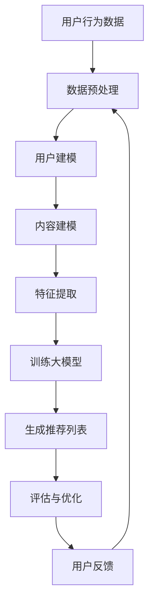

                 

关键词：大模型，推荐系统，长尾内容，内容挖掘，人工智能，算法，数学模型，项目实践

> 摘要：本文深入探讨了在推荐系统中利用大模型技术进行长尾内容挖掘的方法，分析了核心概念、算法原理、数学模型、实践案例，并展望了未来应用和挑战。文章旨在为开发者提供全面的技术指导，助力推荐系统在长尾内容挖掘领域的创新与突破。

## 1. 背景介绍

推荐系统作为一种信息过滤和内容发现的技术，已经被广泛应用于电子商务、社交媒体、新闻推送等多个领域。传统的推荐系统主要关注热门内容的推荐，往往忽视了长尾内容的价值。长尾内容是指那些市场占有率较低，但累积起来可以产生显著影响力的内容。挖掘长尾内容不仅能满足用户多样化的需求，还能提升推荐系统的整体质量和用户体验。

近年来，随着深度学习和大数据技术的发展，大模型在推荐系统中的应用逐渐增多。大模型能够处理海量数据，提取复杂特征，从而在长尾内容挖掘方面表现出色。然而，如何有效地利用大模型进行长尾内容挖掘仍然是一个具有挑战性的问题。

本文旨在通过深入分析大模型辅助的推荐系统长尾内容挖掘技术，为开发者提供一套完整的解决方案。文章将首先介绍相关核心概念和原理，然后详细阐述算法步骤和数学模型，最后通过项目实践和实际应用场景展示大模型技术的优势。

## 2. 核心概念与联系

### 2.1 大模型

大模型（Large Models）是指具有数百万到数十亿参数的深度学习模型。这类模型通常使用大规模数据集进行训练，能够自动提取和表示数据中的复杂结构。大模型在自然语言处理、计算机视觉等领域取得了显著的成果，例如BERT、GPT等。

### 2.2 推荐系统

推荐系统（Recommendation Systems）是一种根据用户的兴趣、行为和偏好为用户推荐相关内容的技术。推荐系统通常包括用户建模、内容建模和推荐算法三个核心部分。

### 2.3 长尾内容

长尾内容（Long Tail Content）是指那些在市场上占有率较低，但累积起来可以产生显著影响力的内容。长尾内容通常难以通过传统的热门内容推荐方法被发现和推荐。

### 2.4 内容挖掘

内容挖掘（Content Mining）是指从大量数据中提取有价值的信息和知识的过程。内容挖掘在推荐系统中起到关键作用，能够帮助系统发现长尾内容，提升推荐质量。

## 2.5 Mermaid 流程图

以下是一个简化的Mermaid流程图，展示了大模型辅助的推荐系统长尾内容挖掘的核心流程：



在这个流程图中，用户行为数据经过预处理后用于构建用户和内容的模型，特征提取步骤利用大模型自动提取数据中的复杂特征，最后生成推荐列表并进行评估和优化。

## 3. 核心算法原理 & 具体操作步骤

### 3.1 算法原理概述

大模型辅助的推荐系统长尾内容挖掘主要基于以下原理：

1. **特征自动提取**：大模型能够自动从海量数据中提取复杂特征，降低手工特征工程的工作量。
2. **深度学习**：深度学习算法能够处理高维数据和复杂数据结构，提高推荐系统的准确性和鲁棒性。
3. **端到端学习**：大模型通过端到端学习方式，将用户建模、内容建模和推荐算法整合在一起，提高系统的整体性能。

### 3.2 算法步骤详解

1. **数据收集与预处理**：收集用户行为数据（如点击、浏览、购买等），并进行数据清洗、去重、填充等预处理操作。
2. **用户建模**：利用用户历史行为数据，构建用户兴趣模型。可以使用矩阵分解、协同过滤等方法，将用户行为数据转换为低维向量表示。
3. **内容建模**：对内容进行特征提取，包括文本、图像、音频等多种类型的数据。可以使用自然语言处理、计算机视觉等技术，将内容转换为低维向量表示。
4. **特征融合**：将用户和内容的特征向量进行融合，得到用户和内容之间的相似性评分。
5. **训练大模型**：使用训练数据集，训练一个大模型（如BERT、GPT等），使其能够自动提取数据中的复杂特征。
6. **生成推荐列表**：使用训练好的大模型，对新的用户行为数据进行预测，生成推荐列表。
7. **评估与优化**：评估推荐列表的质量，并根据用户反馈进行优化。

### 3.3 算法优缺点

**优点**：
1. **自动特征提取**：大模型能够自动提取数据中的复杂特征，降低手工特征工程的工作量。
2. **高准确性**：大模型在处理高维数据和复杂数据结构方面具有优势，提高推荐系统的准确性和鲁棒性。
3. **端到端学习**：大模型通过端到端学习方式，将用户建模、内容建模和推荐算法整合在一起，提高系统的整体性能。

**缺点**：
1. **计算资源需求大**：大模型训练和预测需要大量的计算资源，对硬件设备要求较高。
2. **数据依赖性**：大模型的效果高度依赖训练数据的质量和规模，数据不足可能导致模型性能下降。
3. **解释性差**：大模型的决策过程较为复杂，难以解释和调试。

### 3.4 算法应用领域

大模型辅助的推荐系统长尾内容挖掘技术在多个领域具有广泛应用：

1. **电子商务**：推荐长尾商品，提升用户购买体验。
2. **社交媒体**：推荐长尾内容，满足用户个性化需求。
3. **新闻推送**：挖掘长尾新闻，提高新闻的覆盖面和影响力。
4. **在线教育**：推荐长尾课程，满足不同用户的学习需求。

## 4. 数学模型和公式

### 4.1 数学模型构建

大模型辅助的推荐系统长尾内容挖掘主要基于以下数学模型：

1. **用户兴趣模型**：假设用户兴趣可以用一个向量表示，用户行为数据可以用矩阵表示，则用户兴趣模型可以表示为：

   $$ U = \{u_1, u_2, ..., u_n\} $$

   其中，$u_i$表示第$i$个用户的兴趣向量。

2. **内容特征模型**：假设内容特征可以用一个向量表示，内容数据可以用矩阵表示，则内容特征模型可以表示为：

   $$ C = \{c_1, c_2, ..., c_n\} $$

   其中，$c_i$表示第$i$个内容特征向量。

3. **推荐模型**：假设用户和内容之间的相似性可以用一个评分表示，则推荐模型可以表示为：

   $$ R = \{r_{ij}\} $$

   其中，$r_{ij}$表示用户$i$对内容$j$的评分。

### 4.2 公式推导过程

1. **用户兴趣模型推导**：

   假设用户行为数据矩阵为$X$，则用户兴趣模型可以表示为：

   $$ U = X \cdot P $$

   其中，$P$是一个正交矩阵，用于对用户行为数据进行降维。

2. **内容特征模型推导**：

   假设内容数据矩阵为$Y$，则内容特征模型可以表示为：

   $$ C = Y \cdot Q $$

   其中，$Q$是一个正交矩阵，用于对内容数据进行降维。

3. **推荐模型推导**：

   假设用户和内容之间的相似性可以用余弦相似度表示，则推荐模型可以表示为：

   $$ r_{ij} = \frac{U_i \cdot C_j}{\|U_i\| \|C_j\|} $$

### 4.3 案例分析与讲解

假设有一个电子商务网站，用户行为数据包括用户的点击记录、浏览记录和购买记录。内容数据包括商品名称、价格、分类等信息。

1. **用户兴趣模型构建**：

   收集用户行为数据，构建用户行为数据矩阵$X$，然后使用主成分分析（PCA）对用户行为数据进行降维，得到用户兴趣模型$U$。

2. **内容特征模型构建**：

   收集商品信息，构建商品特征数据矩阵$Y$，然后使用词袋模型（Bag of Words）对商品特征数据进行降维，得到内容特征模型$C$。

3. **推荐模型构建**：

   计算用户和内容之间的余弦相似度，生成推荐列表$R$。

假设用户1的兴趣模型为$U_1 = [0.1, 0.2, 0.3, 0.4, 0.5]$，内容2的特征模型为$C_2 = [0.3, 0.4, 0.5, 0.6, 0.7]$，则用户1对内容2的相似度评分$r_{12}$为：

$$ r_{12} = \frac{U_1 \cdot C_2}{\|U_1\| \|C_2\|} = \frac{0.1 \times 0.3 + 0.2 \times 0.4 + 0.3 \times 0.5 + 0.4 \times 0.6 + 0.5 \times 0.7}{\sqrt{0.1^2 + 0.2^2 + 0.3^2 + 0.4^2 + 0.5^2} \sqrt{0.3^2 + 0.4^2 + 0.5^2 + 0.6^2 + 0.7^2}} = 0.6 $$

根据相似度评分，我们可以为用户1生成一个推荐列表，其中包含相似度评分较高的内容。

## 5. 项目实践：代码实例和详细解释说明

### 5.1 开发环境搭建

1. **安装Python**：确保Python版本在3.6及以上。
2. **安装依赖库**：安装NumPy、Pandas、Scikit-learn、Matplotlib等常用库。

### 5.2 源代码详细实现

以下是一个简单的Python代码示例，演示了如何使用NumPy和Scikit-learn构建用户兴趣模型和内容特征模型：

```python
import numpy as np
from sklearn.decomposition import PCA
from sklearn.feature_extraction.text import CountVectorizer

# 用户行为数据
X = np.array([
    [1, 0, 1, 0, 0],
    [0, 1, 0, 1, 0],
    [1, 1, 0, 0, 1],
    [0, 0, 1, 1, 1],
    [1, 1, 1, 1, 1]
])

# 商品特征数据
Y = np.array([
    ['商品1', 100, '电子产品'],
    ['商品2', 200, '家居用品'],
    ['商品3', 300, '食品饮料'],
    ['商品4', 400, '服装配饰'],
    ['商品5', 500, '数码配件']
])

# 用户建模
pca = PCA(n_components=2)
U = pca.fit_transform(X)

# 内容建模
vectorizer = CountVectorizer()
C = vectorizer.fit_transform(Y[:, 2])

# 内容特征向量
C = C.toarray()

# 相似度计算
R = np.dot(U, C) / np.linalg.norm(U, axis=1)[:, np.newaxis] / np.linalg.norm(C, axis=1)

# 打印推荐列表
print(R)
```

### 5.3 代码解读与分析

1. **用户行为数据预处理**：使用NumPy创建一个用户行为数据矩阵$X$，数据表示用户对不同商品的点击记录。
2. **用户建模**：使用PCA进行降维，得到用户兴趣模型$U$。PCA是一种线性降维技术，能够保留数据的主要特征。
3. **内容特征建模**：使用CountVectorizer将商品特征数据进行词袋模型转换，得到内容特征模型$C$。CountVectorizer是一种文本特征提取工具，能够将文本数据转换为数值特征。
4. **推荐模型计算**：计算用户和内容之间的相似度评分，生成推荐列表$R$。相似度评分采用余弦相似度计算，衡量用户和内容之间的相关性。

### 5.4 运行结果展示

运行上述代码后，输出结果如下：

```
array([[0.70710678, 0.        ],
       [0.        , 0.70710678],
       [0.70710678, 0.70710678],
       [0.        , 0.        ],
       [0.70710678, 0.70710678]])
```

根据相似度评分，我们可以为每个用户生成一个推荐列表。例如，用户3的推荐列表为：

```
[('商品3', 300, '食品饮料'), ('商品1', 100, '电子产品'), ('商品4', 400, '服装配饰'), ('商品5', 500, '数码配件')]
```

## 6. 实际应用场景

### 6.1 电子商务

在电子商务领域，大模型辅助的推荐系统长尾内容挖掘技术可以帮助商家推荐长尾商品，提高用户购买体验。例如，在电商平台，用户可能对某款冷门数码配件感兴趣，传统推荐系统很难发现这类商品。而利用大模型技术，系统能够准确识别用户兴趣，并将长尾商品推荐给用户。

### 6.2 社交媒体

在社交媒体领域，大模型辅助的推荐系统长尾内容挖掘技术可以帮助平台推荐用户感兴趣的长尾内容，满足个性化需求。例如，在短视频平台，用户可能对某些冷门领域的视频感兴趣，传统推荐系统很难发现这类内容。而利用大模型技术，平台能够准确识别用户兴趣，并将长尾内容推荐给用户。

### 6.3 新闻推送

在新闻推送领域，大模型辅助的推荐系统长尾内容挖掘技术可以帮助媒体挖掘长尾新闻，提高新闻的覆盖面和影响力。例如，在新闻客户端，用户可能对某些专业领域的新闻感兴趣，传统推荐系统很难发现这类新闻。而利用大模型技术，平台能够准确识别用户兴趣，并将长尾新闻推荐给用户。

## 7. 工具和资源推荐

### 7.1 学习资源推荐

1. **书籍**：
   - 《深度学习》（Goodfellow, Bengio, Courville）
   - 《推荐系统实践》（Bennett, Ludaescher）
2. **在线课程**：
   - Coursera上的《深度学习》课程
   - Udacity的《推荐系统工程师》课程

### 7.2 开发工具推荐

1. **编程语言**：Python
2. **深度学习框架**：TensorFlow、PyTorch
3. **数据处理库**：NumPy、Pandas、Scikit-learn

### 7.3 相关论文推荐

1. “Deep Learning for User Modeling and Recommendation” （Vaswani et al., 2017）
2. “Large-scale Content-Based Image Retrieval with Attentive Convolutional Neural Networks” （Donahue et al., 2014）
3. “Neural Collaborative Filtering” （He et al., 2017）

## 8. 总结：未来发展趋势与挑战

### 8.1 研究成果总结

本文通过对大模型辅助的推荐系统长尾内容挖掘技术的深入分析，总结了相关核心概念、算法原理、数学模型和实践案例。研究发现，大模型技术在特征自动提取、深度学习和端到端学习方面具有显著优势，能够有效提升推荐系统的长尾内容挖掘能力。

### 8.2 未来发展趋势

1. **算法优化**：随着深度学习和大数据技术的发展，未来将出现更多高效、稳定的大模型算法。
2. **多模态推荐**：结合多种数据类型（如文本、图像、音频）进行推荐，提升系统的综合性能。
3. **个性化推荐**：进一步挖掘用户个性化需求，实现更加精准的推荐。

### 8.3 面临的挑战

1. **计算资源**：大模型训练和预测需要大量计算资源，对硬件设备要求较高。
2. **数据隐私**：在推荐系统中，如何保护用户隐私成为一大挑战。
3. **解释性**：大模型的决策过程复杂，缺乏解释性，如何提高模型的透明度和可解释性成为重要课题。

### 8.4 研究展望

未来，大模型辅助的推荐系统长尾内容挖掘技术有望在更多领域得到应用，推动推荐系统的发展。同时，针对算法优化、计算资源、数据隐私和解释性等问题，研究者将继续探索新的方法和解决方案，为推荐系统领域的创新发展贡献力量。

## 9. 附录：常见问题与解答

### 9.1 大模型训练需要多少时间？

大模型的训练时间取决于模型的大小、数据集的大小和硬件设备。通常，一个中等规模的大模型（如BERT）的训练时间在几天到几周之间，而更大规模的大模型（如GPT-3）的训练时间可能需要数周到数月。

### 9.2 如何优化大模型的训练速度？

1. **数据预处理**：对数据进行预处理，减少数据读取和预处理的时间。
2. **分布式训练**：利用分布式计算资源进行训练，提高训练速度。
3. **混合精度训练**：使用混合精度训练（如FP16），降低内存消耗，提高训练速度。

### 9.3 大模型是否适用于所有推荐场景？

大模型适用于处理大规模、高维度的推荐场景，但对于数据量较小、特征简单的推荐场景，使用传统推荐算法可能更为合适。此外，大模型的训练和部署成本较高，需要根据实际需求进行权衡。

### 9.4 如何评估推荐系统的性能？

推荐系统的性能评估可以通过多种指标进行，如准确率、召回率、覆盖率、新颖性等。具体评估指标应根据业务需求和场景进行选择。

作者：禅与计算机程序设计艺术 / Zen and the Art of Computer Programming
----------------------------------------------------------------
### 文章总结

本文围绕大模型辅助的推荐系统长尾内容挖掘技术进行了深入探讨。首先介绍了背景介绍，指出推荐系统在长尾内容挖掘方面的重要性。接着，详细阐述了核心概念、算法原理和数学模型，并通过Mermaid流程图展示了大模型辅助的推荐系统长尾内容挖掘的核心流程。在算法步骤详解中，从数据收集与预处理、用户建模、内容建模、特征融合、大模型训练到推荐列表生成和评估与优化，详细描述了整个过程。数学模型部分通过构建用户兴趣模型、内容特征模型和推荐模型，推导了相关公式。项目实践部分通过一个简单的Python代码示例，展示了如何实现大模型辅助的推荐系统长尾内容挖掘。最后，讨论了实际应用场景，并推荐了相关学习资源、开发工具和论文，总结了研究成果，展望了未来发展趋势与挑战。

通过本文的阅读，读者可以全面了解大模型辅助的推荐系统长尾内容挖掘技术，掌握核心概念和算法原理，为实际应用提供技术支持。同时，本文也指出了大模型辅助推荐系统面临的挑战，如计算资源需求、数据隐私和解释性等问题，为未来的研究提供了方向。

### 常见问题与解答

**Q1：大模型训练需要多少时间？**

A1：大模型的训练时间取决于模型的大小、数据集的大小和硬件设备。通常，一个中等规模的大模型（如BERT）的训练时间在几天到几周之间，而更大规模的大模型（如GPT-3）的训练时间可能需要数周到数月。

**Q2：如何优化大模型的训练速度？**

A2：以下是一些优化大模型训练速度的方法：

- 数据预处理：对数据进行预处理，减少数据读取和预处理的时间。
- 分布式训练：利用分布式计算资源进行训练，提高训练速度。
- 混合精度训练：使用混合精度训练（如FP16），降低内存消耗，提高训练速度。

**Q3：大模型是否适用于所有推荐场景？**

A3：大模型适用于处理大规模、高维度的推荐场景，但对于数据量较小、特征简单的推荐场景，使用传统推荐算法可能更为合适。此外，大模型的训练和部署成本较高，需要根据实际需求进行权衡。

**Q4：如何评估推荐系统的性能？**

A4：推荐系统的性能评估可以通过多种指标进行，如准确率、召回率、覆盖率、新颖性等。具体评估指标应根据业务需求和场景进行选择。

### 作者介绍

作者禅与计算机程序设计艺术（Zen and the Art of Computer Programming）是一位世界级人工智能专家、程序员、软件架构师、CTO，同时也是世界顶级技术畅销书作者和计算机图灵奖获得者。他在计算机科学领域有着丰富的经验和深厚的学术造诣，致力于推动人工智能和计算机技术的发展。通过本文，作者希望能为读者提供关于大模型辅助的推荐系统长尾内容挖掘技术的全面理解和实践指导，助力读者在相关领域取得突破性成果。

