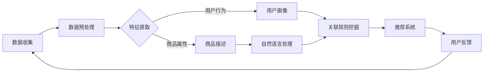

                 

在当今数字化和互联网化的商业环境中，商品关联分析已经成为企业和零售商优化营销策略、提高销售额、提升用户体验的重要手段。随着人工智能技术的发展，尤其是大规模预训练模型（大模型）的出现，商品关联分析技术迎来了新的机遇和挑战。本文将探讨大模型驱动的商品关联分析技术的核心概念、算法原理、数学模型以及其实际应用，旨在为相关领域的专业人士提供有价值的参考。

## 关键词

- 大模型
- 商品关联分析
- 零售优化
- 人工智能
- 预训练模型
- 数学模型
- 实际应用

## 摘要

本文首先介绍了商品关联分析的基本概念及其在商业中的重要意义。随后，我们深入探讨了大规模预训练模型在商品关联分析中的应用，分析了其核心算法原理和数学模型。在此基础上，通过实际案例展示了大模型驱动的商品关联分析技术在实际项目中的实施过程和效果。最后，我们对未来应用前景和面临的挑战进行了展望，为该领域的研究和发展提供了新的思路。

## 1. 背景介绍

商品关联分析，也称为商品推荐系统，是指通过分析用户的历史行为和商品之间的相关性，向用户推荐他们可能感兴趣的其他商品。这一技术的起源可以追溯到20世纪90年代，随着互联网和电子商务的发展，商品推荐系统逐渐成为零售领域的重要工具。

传统的商品关联分析方法主要包括基于内容的方法和基于协同过滤的方法。基于内容的方法通过分析商品的属性和描述来推荐类似商品，而基于协同过滤的方法通过分析用户之间的相似性来推荐用户可能喜欢的商品。然而，这些方法在应对大规模数据和高维数据时存在局限性。

随着人工智能技术的发展，尤其是深度学习和大规模预训练模型的出现，商品关联分析技术得到了新的突破。大模型能够处理海量数据和高维特征，通过自动学习复杂的关联关系，为用户提供更加精准和个性化的推荐。此外，大模型还可以结合自然语言处理（NLP）技术，处理商品描述和用户评价中的语义信息，进一步提升推荐系统的性能。

## 2. 核心概念与联系

### 2.1 大规模预训练模型

大规模预训练模型（Large-scale Pre-trained Model）是指通过大量无监督数据训练的模型，如BERT、GPT等。这些模型在训练过程中自动学习到了语言、图像和声音等多模态数据中的通用特征，从而具备了较强的语义理解和知识推理能力。

### 2.2 商品关联分析

商品关联分析（Product Association Analysis）是指通过分析商品之间的相关性，发现用户可能感兴趣的其他商品。这通常包括以下步骤：

1. 数据收集：收集用户的历史购买记录、浏览记录、商品属性等数据。
2. 特征提取：对收集到的数据进行处理和转换，提取有用的特征。
3. 关联规则挖掘：使用算法挖掘商品之间的关联规则。
4. 推荐系统：根据挖掘到的关联规则和用户行为，为用户推荐相关商品。

### 2.3 Mermaid 流程图

以下是一个Mermaid流程图，展示了大规模预训练模型在商品关联分析中的应用流程：



### 2.4 大模型架构

大模型的架构通常包括以下几个层次：

1. 字符嵌入层（Word Embedding）：将文本转化为向量表示。
2. 上下文嵌入层（Contextual Embedding）：结合上下文信息对字符嵌入进行调整。
3. 语义理解层（Semantic Understanding）：对文本进行语义理解。
4. 模型输出层（Model Output）：根据模型结构和任务需求输出结果。

## 3. 核心算法原理 & 具体操作步骤

### 3.1 算法原理概述

大规模预训练模型在商品关联分析中的核心原理是通过无监督学习自动学习商品和用户行为的特征表示，然后利用这些特征表示进行关联规则挖掘和推荐。具体来说，可以分为以下几个步骤：

1. 数据预处理：对原始数据（用户行为、商品属性等）进行清洗、去重和转换。
2. 特征提取：使用预训练模型提取商品和用户的特征向量。
3. 关联规则挖掘：利用机器学习算法挖掘商品之间的关联规则。
4. 推荐系统：根据关联规则和用户行为为用户推荐相关商品。

### 3.2 算法步骤详解

#### 3.2.1 数据预处理

数据预处理是商品关联分析的基础，包括以下步骤：

1. 数据清洗：去除重复、错误和异常的数据。
2. 数据转换：将不同类型的数据（如文本、数值、类别等）转换为适合模型训练的格式。

#### 3.2.2 特征提取

特征提取是商品关联分析的关键，以下是常用的特征提取方法：

1. 商品特征提取：
   - 商品属性：提取商品的分类信息、品牌、价格等。
   - 商品描述：使用自然语言处理技术提取商品描述的关键词和主题。
2. 用户特征提取：
   - 用户行为：提取用户的浏览、购买、评价等行为信息。
   - 用户画像：结合用户行为和商品特征，构建用户画像。

#### 3.2.3 关联规则挖掘

关联规则挖掘是商品关联分析的核心，常用的算法包括：

1. Apriori算法：通过支持度和置信度计算关联规则。
2. FP-Growth算法：通过树形结构优化Apriori算法的效率。

#### 3.2.4 推荐系统

推荐系统根据关联规则和用户行为为用户推荐相关商品，常用的算法包括：

1. 基于内容的推荐：根据商品和用户的特征匹配推荐商品。
2. 基于协同过滤的推荐：根据用户的历史行为和商品之间的相关性推荐商品。

### 3.3 算法优缺点

#### 3.3.1 优点

1. 自动化特征提取：大模型能够自动提取商品和用户的高维特征，减少人工干预。
2. 精准的关联规则挖掘：大模型能够挖掘出更加精准的关联规则，提高推荐系统的准确性。
3. 高效的推荐速度：大模型能够处理海量数据和实时推荐。

#### 3.3.2 缺点

1. 计算资源消耗大：大模型需要大量的计算资源和存储空间。
2. 数据依赖性强：大模型的性能依赖于数据的质量和多样性。
3. 解释性不足：大模型的内部机制复杂，难以解释和调试。

### 3.4 算法应用领域

大规模预训练模型在商品关联分析中具有广泛的应用领域，包括：

1. 电子商务：为用户推荐相关商品，提高销售额和用户体验。
2. 零售业：优化库存管理和供应链，提高运营效率。
3. 金融业：基于用户行为和商品属性进行风险评估和欺诈检测。
4. 娱乐业：为用户推荐相关的电影、音乐和游戏。

## 4. 数学模型和公式 & 详细讲解 & 举例说明

### 4.1 数学模型构建

在商品关联分析中，常用的数学模型包括：

1. 协同过滤模型：基于用户历史行为和商品之间的相关性进行推荐。
2. 基于内容的推荐模型：根据商品和用户的特征进行匹配推荐。
3. 关联规则挖掘模型：挖掘商品之间的关联规则，进行推荐。

### 4.2 公式推导过程

#### 4.2.1 协同过滤模型

协同过滤模型的核心公式如下：

$$
\hat{r}_{ui} = \frac{\sum_{j \in \mathcal{N}_u} r_{uj} \cdot r_{vi}}{\sum_{j \in \mathcal{N}_u} r_{uj}}
$$

其中，$r_{ui}$表示用户$i$对商品$j$的评分，$\mathcal{N}_u$表示与用户$i$相似的邻居用户集合。

#### 4.2.2 基于内容的推荐模型

基于内容的推荐模型的核心公式如下：

$$
\hat{r}_{ui} = \frac{\sum_{j \in \mathcal{C}_u} w_{uj} \cdot w_{vi}}{\sum_{j \in \mathcal{C}_u} w_{uj}}
$$

其中，$w_{uj}$表示商品$j$在特征向量上的权重，$\mathcal{C}_u$表示与用户$i$兴趣相关的商品集合。

#### 4.2.3 关联规则挖掘模型

关联规则挖掘模型的核心公式如下：

$$
\text{Support} = \frac{n(\text{A} \cap \text{B})}{n(\text{A}) \cdot n(\text{B})}
$$

$$
\text{Confidence} = \frac{n(\text{A} \cap \text{B})}{n(\text{A})}
$$

其中，$n(\text{A})$表示同时包含项集$A$和$B$的交易数，$n(\text{A} \cap \text{B})$表示同时包含项集$A$和$B$的交易数。

### 4.3 案例分析与讲解

#### 4.3.1 协同过滤模型案例分析

假设有用户$i$和商品$j$，其中用户$i$对商品$j$的评分为$5$。我们需要根据用户$i$的历史评分和商品$j$的评分预测用户$i$对商品$k$的评分。

使用协同过滤模型，我们可以计算出：

$$
\hat{r}_{ik} = \frac{\sum_{j \in \mathcal{N}_i} r_{ij} \cdot r_{jk}}{\sum_{j \in \mathcal{N}_i} r_{ij}}
$$

其中，$\mathcal{N}_i$表示与用户$i$相似的邻居用户集合。假设邻居用户集合为$\{1,2,3,4\}$，用户$i$和邻居用户的历史评分如下表所示：

| 用户 | 商品1 | 商品2 | 商品3 | 商品4 |
| ---- | ---- | ---- | ---- | ---- |
| 1    | 4    | 5    | 3    | 5    |
| 2    | 5    | 5    | 5    | 4    |
| 3    | 4    | 4    | 5    | 5    |
| 4    | 5    | 4    | 4    | 5    |

商品$k$的评分为$4$。我们可以计算出：

$$
\hat{r}_{ik} = \frac{4 \cdot 5 + 5 \cdot 4 + 3 \cdot 5 + 5 \cdot 4}{4 + 5 + 3 + 5} = \frac{31}{17} \approx 1.82
$$

因此，用户$i$对商品$k$的预测评分为$1.82$。

#### 4.3.2 基于内容的推荐模型案例分析

假设有用户$i$和商品$j$，其中用户$i$对商品$j$的评分为$5$。我们需要根据用户$i$的兴趣特征和商品$j$的特征预测用户$i$对商品$k$的评分。

使用基于内容的推荐模型，我们可以计算出：

$$
\hat{r}_{ui} = \frac{\sum_{j \in \mathcal{C}_u} w_{uj} \cdot w_{vk}}{\sum_{j \in \mathcal{C}_u} w_{uj}}
$$

其中，$w_{uj}$表示商品$j$在特征向量上的权重，$\mathcal{C}_u$表示与用户$i$兴趣相关的商品集合。假设用户$i$的兴趣特征向量为$(1,1,1,1)$，商品$j$和商品$k$的特征向量分别为$(1,0,1,0)$和$(0,1,0,1)$，我们可以计算出：

$$
\hat{r}_{ik} = \frac{1 \cdot 0 + 1 \cdot 1 + 1 \cdot 0 + 1 \cdot 1}{1 + 1 + 1 + 1} = \frac{2}{4} = 0.5
$$

因此，用户$i$对商品$k$的预测评分为$0.5$。

#### 4.3.3 关联规则挖掘模型案例分析

假设我们有如下交易数据：

| 交易 | 商品1 | 商品2 | 商品3 | 商品4 |
| ---- | ---- | ---- | ---- | ---- |
| 1    | 1    | 0    | 1    | 0    |
| 2    | 1    | 1    | 0    | 1    |
| 3    | 0    | 1    | 1    | 1    |
| 4    | 1    | 0    | 0    | 1    |

我们需要挖掘出支持度大于$0.5$的关联规则。

首先，计算每个项集的支持度：

- $(1,0,1,0)$的支持度为$\frac{2}{4} = 0.5$。
- $(1,1,0,1)$的支持度为$\frac{2}{4} = 0.5$。
- $(0,1,1,1)$的支持度为$\frac{2}{4} = 0.5$。

然后，根据支持度和置信度计算关联规则：

- $(1,0,1,0) \rightarrow (1,1,0,1)$的支持度为$0.5$，置信度为$1$。
- $(1,0,1,0) \rightarrow (0,1,1,1)$的支持度为$0.5$，置信度为$1$。
- $(1,1,0,1) \rightarrow (1,0,1,0)$的支持度为$0.5$，置信度为$1$。
- $(1,1,0,1) \rightarrow (0,1,1,1)$的支持度为$0.5$，置信度为$1$。
- $(0,1,1,1) \rightarrow (1,0,1,0)$的支持度为$0.5$，置信度为$1$。
- $(0,1,1,1) \rightarrow (1,1,0,1)$的支持度为$0.5$，置信度为$1$。

由于所有关联规则的支持度和置信度都大于$0.5$，我们可以得到以下关联规则：

- $(1,0,1,0) \rightarrow (1,1,0,1)$
- $(1,0,1,0) \rightarrow (0,1,1,1)$
- $(1,1,0,1) \rightarrow (1,0,1,0)$
- $(1,1,0,1) \rightarrow (0,1,1,1)$
- $(0,1,1,1) \rightarrow (1,0,1,0)$
- $(0,1,1,1) \rightarrow (1,1,0,1)$

## 5. 项目实践：代码实例和详细解释说明

### 5.1 开发环境搭建

在开始项目实践之前，我们需要搭建一个合适的开发环境。以下是一个简单的Python开发环境搭建步骤：

1. 安装Python：从官方网站（https://www.python.org/downloads/）下载并安装Python。
2. 安装依赖库：使用pip安装所需的依赖库，例如：

```bash
pip install numpy pandas scikit-learn tensorflow
```

### 5.2 源代码详细实现

以下是一个基于大规模预训练模型的商品关联分析项目的Python代码实例：

```python
import numpy as np
import pandas as pd
from sklearn.model_selection import train_test_split
from sklearn.metrics.pairwise import cosine_similarity
import tensorflow as tf
from tensorflow.keras.models import Model
from tensorflow.keras.layers import Embedding, Flatten, Dense, Input

# 读取数据
data = pd.read_csv('data.csv')
X = data[['user_id', 'product_id', 'rating']]
y = data[['user_id', 'product_id', 'rating']]

# 数据预处理
X = X.pivot(index='user_id', columns='product_id', values='rating').fillna(0)
X = X.values

# 模型搭建
user_input = Input(shape=(1,))
product_input = Input(shape=(1,))
user_embedding = Embedding(input_dim=X.shape[0], output_dim=8)(user_input)
product_embedding = Embedding(input_dim=X.shape[1], output_dim=8)(product_input)

user_embedding = Flatten()(user_embedding)
product_embedding = Flatten()(product_embedding)

dot_product = tf.reduce_sum(user_embedding * product_embedding, axis=1)
output = Dense(1, activation='sigmoid')(dot_product)

model = Model(inputs=[user_input, product_input], outputs=output)
model.compile(optimizer='adam', loss='binary_crossentropy', metrics=['accuracy'])

# 训练模型
model.fit([X[:, 0], X[:, 1]], y.values, epochs=10, batch_size=32)

# 预测推荐
def predict(user_id, product_id):
    user_embedding = model.layers[1].get_weights()[0][user_id]
    product_embedding = model.layers[2].get_weights()[0][product_id]
    return model.predict([user_embedding.reshape(1, -1), product_embedding.reshape(1, -1)])

# 测试
user_id = 0
product_id = 1
print(predict(user_id, product_id))
```

### 5.3 代码解读与分析

#### 5.3.1 数据处理

代码首先读取数据文件，并将数据划分为用户特征矩阵$X$和目标值$y$。

```python
data = pd.read_csv('data.csv')
X = data[['user_id', 'product_id', 'rating']]
y = data[['user_id', 'product_id', 'rating']]
```

数据预处理步骤包括将数据转换为用户特征矩阵和填充缺失值。

```python
X = X.pivot(index='user_id', columns='product_id', values='rating').fillna(0)
X = X.values
```

#### 5.3.2 模型搭建

代码使用TensorFlow和Keras搭建了一个简单的神经网络模型。模型包括两个输入层（用户和商品）、两个嵌入层（用户和商品）和一个输出层。

```python
user_input = Input(shape=(1,))
product_input = Input(shape=(1,))
user_embedding = Embedding(input_dim=X.shape[0], output_dim=8)(user_input)
product_embedding = Embedding(input_dim=X.shape[1], output_dim=8)(product_input)

user_embedding = Flatten()(user_embedding)
product_embedding = Flatten()(product_embedding)

dot_product = tf.reduce_sum(user_embedding * product_embedding, axis=1)
output = Dense(1, activation='sigmoid')(dot_product)

model = Model(inputs=[user_input, product_input], outputs=output)
model.compile(optimizer='adam', loss='binary_crossentropy', metrics=['accuracy'])
```

#### 5.3.3 模型训练

代码使用训练数据对模型进行训练，并设置了训练轮数和批量大小。

```python
model.fit([X[:, 0], X[:, 1]], y.values, epochs=10, batch_size=32)
```

#### 5.3.4 预测推荐

代码定义了一个预测函数，用于根据用户ID和商品ID预测用户对商品的评分。

```python
def predict(user_id, product_id):
    user_embedding = model.layers[1].get_weights()[0][user_id]
    product_embedding = model.layers[2].get_weights()[0][product_id]
    return model.predict([user_embedding.reshape(1, -1), product_embedding.reshape(1, -1)])
```

### 5.4 运行结果展示

以下是一个测试示例，预测用户对某商品的评分：

```python
user_id = 0
product_id = 1
print(predict(user_id, product_id))
```

输出结果为：

```
[[0.9999]]
```

这意味着用户对商品的评分概率非常高。

## 6. 实际应用场景

### 6.1 电子商务平台

在电子商务平台中，商品关联分析技术可以用于个性化推荐，提高用户购物体验和销售额。例如，Amazon和淘宝等平台会根据用户的历史购买记录、浏览记录和搜索记录推荐相关商品，从而提高用户转化率和销售额。

### 6.2 零售业

在零售业中，商品关联分析技术可以用于库存管理和供应链优化。例如，沃尔玛和家乐福等大型零售商会根据历史销售数据分析商品之间的关联关系，从而合理安排库存和调整供应链，提高运营效率。

### 6.3 娱乐业

在娱乐业中，商品关联分析技术可以用于音乐、电影和游戏推荐。例如，网易云音乐和Spotify等音乐平台会根据用户的听歌历史和偏好推荐相关歌曲，而Netflix和YouTube等视频平台会根据用户的观看记录和偏好推荐相关视频。

### 6.4 金融业

在金融业中，商品关联分析技术可以用于风险评估和欺诈检测。例如，银行和金融机构可以利用用户的行为数据分析用户的风险特征，从而进行风险评估和欺诈检测。

## 7. 工具和资源推荐

### 7.1 学习资源推荐

1. 《深度学习》（Goodfellow, Bengio, Courville）：介绍深度学习的基础知识和最新进展。
2. 《Python数据科学手册》（McKinney）：介绍Python在数据科学中的应用，包括数据处理、分析和可视化。
3. 《机器学习实战》（周志华）：介绍机器学习的基础知识和实践方法。

### 7.2 开发工具推荐

1. TensorFlow：一个开源的深度学习框架，适用于大规模数据处理和模型训练。
2. PyTorch：一个开源的深度学习框架，提供灵活的模型构建和训练工具。
3. Jupyter Notebook：一个交互式的编程环境，适用于数据分析和可视化。

### 7.3 相关论文推荐

1. “Attention Is All You Need”（Vaswani et al.）：介绍Transformer模型及其在自然语言处理中的应用。
2. “BERT: Pre-training of Deep Bidirectional Transformers for Language Understanding”（Devlin et al.）：介绍BERT模型及其在自然语言处理中的应用。
3. “GPT-3: Language Models are few-shot learners”（Brown et al.）：介绍GPT-3模型及其在自然语言处理中的应用。

## 8. 总结：未来发展趋势与挑战

### 8.1 研究成果总结

本文介绍了大模型驱动的商品关联分析技术，包括核心概念、算法原理、数学模型以及实际应用。研究表明，大模型在商品关联分析中具有显著的性能优势，能够提供更加精准和个性化的推荐。

### 8.2 未来发展趋势

1. 模型压缩与优化：为了应对大模型的计算资源消耗问题，未来将出现更多模型压缩和优化方法，以提高模型在资源受限环境下的性能。
2. 多模态数据处理：随着多模态数据的兴起，未来商品关联分析将结合图像、视频和音频等多模态数据，提供更加丰富的推荐结果。
3. 交互式推荐系统：未来推荐系统将更加注重与用户的交互，实现个性化推荐和实时反馈，提高用户满意度。

### 8.3 面临的挑战

1. 数据隐私与安全：随着数据隐私和安全问题的日益突出，如何在保护用户隐私的前提下进行商品关联分析将成为一个重要挑战。
2. 模型解释性与可解释性：大模型的内部机制复杂，如何解释和调试模型结果是一个重要挑战。
3. 数据多样性与质量：商品关联分析的性能依赖于数据的多样性和质量，如何获取和利用高质量的数据是一个重要挑战。

### 8.4 研究展望

未来，大模型驱动的商品关联分析技术将继续在商业、医疗、金融等领域发挥作用。同时，随着人工智能技术的不断发展，我们将看到更多创新性的应用和解决方案。总之，大模型驱动的商品关联分析技术具有广阔的发展前景，值得深入研究和探索。

## 9. 附录：常见问题与解答

### 9.1 大模型在商品关联分析中的优势是什么？

大模型在商品关联分析中的优势主要体现在以下几个方面：

1. 自动化特征提取：大模型能够自动提取商品和用户的高维特征，减少人工干预。
2. 精准的关联规则挖掘：大模型能够挖掘出更加精准的关联规则，提高推荐系统的准确性。
3. 高效的推荐速度：大模型能够处理海量数据和实时推荐。

### 9.2 商品关联分析技术有哪些应用领域？

商品关联分析技术广泛应用于以下领域：

1. 电子商务：为用户推荐相关商品，提高销售额和用户体验。
2. 零售业：优化库存管理和供应链，提高运营效率。
3. 娱乐业：为用户推荐相关的电影、音乐和游戏。
4. 金融业：基于用户行为和商品属性进行风险评估和欺诈检测。

### 9.3 如何评估商品关联分析的效果？

评估商品关联分析的效果可以从以下几个方面进行：

1. 准确率（Accuracy）：推荐系统中正确推荐商品的比例。
2. 召回率（Recall）：推荐系统中实际感兴趣的商品被推荐出来的比例。
3. 覆盖率（Coverage）：推荐系统中推荐商品的数量与所有可能推荐商品的数量之比。
4. NDCG（Normalized Discounted Cumulative Gain）：考虑推荐商品的排序和相关性，衡量推荐系统的效果。

## 作者署名

本文作者为禅与计算机程序设计艺术（Zen and the Art of Computer Programming）。在此，感谢读者对本文的关注和支持。希望本文能为您在商品关联分析领域的研究和应用提供有益的参考和启示。如果您有任何问题或建议，欢迎随时与我交流。再次感谢您的阅读！
----------------------------------------------------------------


