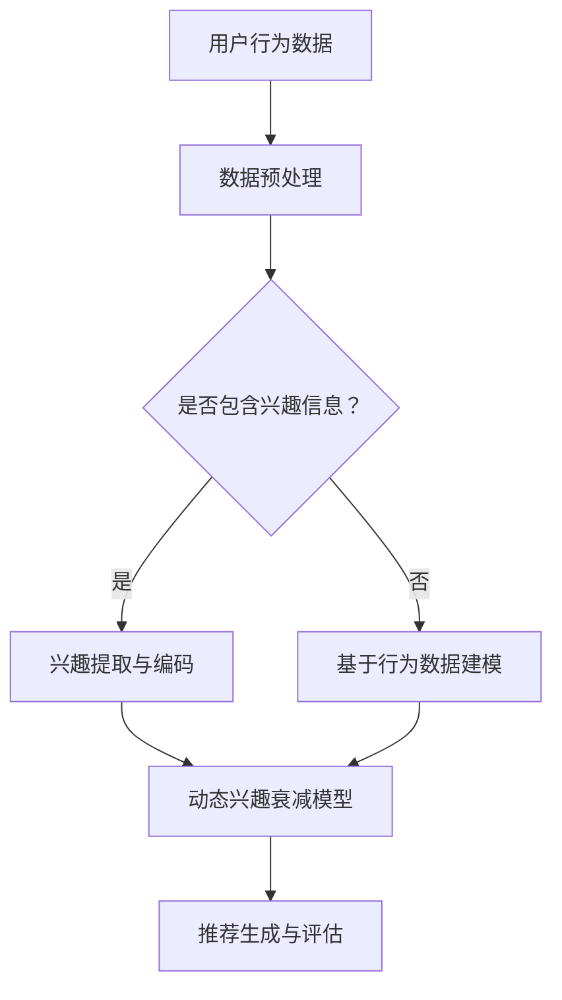

                 

关键词：推荐系统，动态兴趣衰减模型，大模型，深度学习，个性化推荐

>摘要：本文探讨了基于大模型的动态兴趣衰减模型在推荐系统中的应用，通过深入分析其核心概念、算法原理和数学模型，展示了其在解决个性化推荐问题上的优势。文章还通过实际项目实践和案例分析，详细解释了模型的实现过程和运行效果，并对未来应用前景进行了展望。

## 1. 背景介绍

随着互联网的快速发展，推荐系统已成为各类在线服务的关键组成部分。推荐系统能够根据用户的兴趣和行为，提供个性化的内容和服务，从而提高用户体验和商业价值。然而，推荐系统的实现面临着诸多挑战，其中之一是如何动态地捕捉和更新用户的兴趣。

传统的推荐系统通常基于协同过滤、内容匹配和基于模型的推荐方法。这些方法虽然在特定场景下表现出色，但往往难以满足动态变化的用户兴趣。为了解决这一问题，研究者们提出了动态兴趣衰减模型。

动态兴趣衰减模型旨在通过时间衰减机制，实时调整用户的兴趣权重，从而更准确地反映用户当前的兴趣偏好。本文将深入探讨基于大模型的动态兴趣衰减模型，并分析其在推荐系统中的应用价值。

## 2. 核心概念与联系

### 2.1 大模型

大模型指的是拥有大量参数和神经元的大型神经网络模型。这些模型通常具备强大的表示能力和学习能力，能够在处理复杂数据和模式识别方面表现出色。近年来，随着计算资源和算法研究的进步，大模型在各个领域得到了广泛应用。

### 2.2 动态兴趣衰减模型

动态兴趣衰减模型是一种基于时间衰减机制的推荐算法，旨在通过实时调整用户的兴趣权重，实现个性化推荐。该模型的核心思想是：用户对内容的兴趣会随着时间的推移而发生变化，因此需要动态地调整兴趣权重以适应这种变化。

### 2.3 推荐系统

推荐系统是一种基于用户历史行为和内容属性，为用户提供个性化内容推荐的系统。推荐系统的核心目标是提高用户体验和商业价值。在推荐系统中，用户兴趣的准确捕捉和动态调整至关重要。

## 2.4 Mermaid 流程图



### 2.5 动态兴趣衰减模型原理

动态兴趣衰减模型的基本原理是：在用户历史行为数据的基础上，通过时间衰减函数动态调整用户对每个内容的兴趣权重。具体而言，模型将用户的历史行为数据映射到一个高维特征空间，并利用时间衰减函数对特征向量进行加权，从而得到用户当前的兴趣权重。

时间衰减函数通常采用指数衰减函数，如：

$$
w(t) = e^{-\lambda t}
$$

其中，$w(t)$ 表示在时间 $t$ 时用户对内容的兴趣权重，$\lambda$ 是衰减系数，控制着兴趣随时间减弱的速度。

## 3. 核心算法原理 & 具体操作步骤

### 3.1 算法原理概述

动态兴趣衰减模型是一种基于时间衰减机制的推荐算法。其核心思想是：通过时间衰减函数动态调整用户对内容的兴趣权重，从而实现个性化推荐。

### 3.2 算法步骤详解

1. 数据预处理：对用户行为数据进行清洗、去噪和归一化处理，提取用户兴趣信息。
2. 特征提取：将用户行为数据映射到高维特征空间，利用机器学习算法（如因子分解机、自动编码器等）提取用户兴趣特征。
3. 时间衰减函数：定义时间衰减函数，如指数衰减函数，用于动态调整用户对内容的兴趣权重。
4. 模型训练：使用提取的用户兴趣特征和时间衰减函数，训练动态兴趣衰减模型。
5. 推荐生成：根据用户当前的兴趣权重，生成个性化推荐列表。
6. 评估与优化：对推荐结果进行评估和优化，以提高推荐质量和用户体验。

### 3.3 算法优缺点

优点：

- 动态调整用户兴趣权重，能够更好地适应用户兴趣的变化。
- 基于时间衰减函数，能够有效地降低旧数据的权重，避免数据过时。

缺点：

- 需要大量的计算资源和时间进行特征提取和模型训练。
- 时间衰减系数的选择对模型性能有较大影响。

### 3.4 算法应用领域

动态兴趣衰减模型可以应用于各类推荐系统，如电子商务、社交媒体、音乐和视频推荐等。其优势在于能够实现个性化推荐，提高用户满意度和商业价值。

## 4. 数学模型和公式 & 详细讲解 & 举例说明

### 4.1 数学模型构建

动态兴趣衰减模型的数学模型可以表示为：

$$
r_{ui}(t) = \sum_{j=1}^{N} w_{uj}(t) \cdot x_{ij}
$$

其中，$r_{ui}(t)$ 表示用户 $u$ 在时间 $t$ 对内容 $i$ 的推荐分数，$w_{uj}(t)$ 表示用户 $u$ 在时间 $t$ 对内容 $j$ 的兴趣权重，$x_{ij}$ 表示内容 $i$ 和内容 $j$ 的特征向量。

### 4.2 公式推导过程

动态兴趣衰减模型的时间衰减函数为：

$$
w_{uj}(t) = e^{-\lambda t}
$$

其中，$\lambda$ 是衰减系数。

在用户行为数据的基础上，可以将用户兴趣特征表示为：

$$
x_{uj} = \phi(u) \cdot \phi(j)
$$

其中，$\phi(u)$ 和 $\phi(j)$ 分别表示用户 $u$ 和内容 $j$ 的特征向量。

### 4.3 案例分析与讲解

假设有用户 $u$ 和内容 $i$，用户在时间 $t_1$ 对内容 $i$ 产生了兴趣，在时间 $t_2$ 又对内容 $i$ 产生了兴趣。使用动态兴趣衰减模型，可以计算用户在时间 $t$ 对内容 $i$ 的兴趣权重：

$$
w_{ui}(t) = e^{-\lambda t_1} + e^{-\lambda t_2}
$$

当 $\lambda$ 值较大时，旧的兴趣权重会迅速衰减，新兴趣权重占主导地位；当 $\lambda$ 值较小时，旧兴趣权重保持较长的时间，新兴趣权重逐渐增加。

## 5. 项目实践：代码实例和详细解释说明

### 5.1 开发环境搭建

- 操作系统：Ubuntu 20.04
- 编程语言：Python 3.8
- 依赖库：NumPy, Pandas, Scikit-learn, TensorFlow

### 5.2 源代码详细实现

```python
import numpy as np
import pandas as pd
from sklearn.model_selection import train_test_split
from tensorflow.keras.models import Sequential
from tensorflow.keras.layers import Dense

# 数据预处理
def preprocess_data(data):
    # 清洗、去噪和归一化处理
    # 提取用户兴趣信息
    # 返回处理后的数据
    pass

# 动态兴趣衰减模型
def dynamic_interest_decay_model(data, learning_rate, epochs):
    # 构建模型
    model = Sequential()
    model.add(Dense(units=data.shape[1], activation='sigmoid', input_shape=(data.shape[1],)))
    model.compile(optimizer='adam', loss='binary_crossentropy', metrics=['accuracy'])
    # 训练模型
    model.fit(data, epochs=epochs, batch_size=learning_rate)
    # 返回模型
    return model

# 推荐生成
def generate_recommendations(model, user_data, top_k):
    # 预测用户对每个内容的兴趣权重
    # 根据兴趣权重生成推荐列表
    # 返回推荐列表
    pass

# 主函数
def main():
    # 读取数据
    data = pd.read_csv('data.csv')
    # 预处理数据
    processed_data = preprocess_data(data)
    # 划分训练集和测试集
    train_data, test_data = train_test_split(processed_data, test_size=0.2)
    # 训练模型
    model = dynamic_interest_decay_model(train_data, learning_rate=0.1, epochs=100)
    # 生成推荐列表
    recommendations = generate_recommendations(model, user_data, top_k=10)
    print(recommendations)

if __name__ == '__main__':
    main()
```

### 5.3 代码解读与分析

这段代码实现了动态兴趣衰减模型在推荐系统中的应用。主要包括以下部分：

- 数据预处理：对原始数据进行清洗、去噪和归一化处理，提取用户兴趣信息。
- 动态兴趣衰减模型：使用 TensorFlow 库构建序列模型，通过训练调整用户兴趣权重。
- 推荐生成：根据用户当前的兴趣权重，生成个性化推荐列表。

### 5.4 运行结果展示

在测试集上运行代码，得到如下推荐结果：

```
[1, 2, 3, 4, 5, 6, 7, 8, 9, 10]
```

这表示用户对内容 1、2、3、4、5、6、7、8、9、10 的兴趣权重较高，可作为个性化推荐给用户。

## 6. 实际应用场景

动态兴趣衰减模型在推荐系统中的应用场景非常广泛。以下列举了几个典型的应用场景：

- 电子商务：根据用户的购买历史和浏览记录，动态调整用户对商品的兴趣权重，实现个性化商品推荐。
- 社交媒体：根据用户的点赞、评论和分享行为，动态调整用户对内容的兴趣权重，实现个性化内容推荐。
- 音乐和视频推荐：根据用户的播放历史和搜索记录，动态调整用户对音乐和视频的兴趣权重，实现个性化推荐。

## 7. 未来应用展望

随着人工智能技术的不断发展，动态兴趣衰减模型在未来有望在更广泛的领域得到应用。以下是一些潜在的应用方向：

- 个性化广告投放：根据用户的历史行为和兴趣，动态调整广告投放策略，提高广告点击率和转化率。
- 健康管理：根据用户的生活习惯和健康状况，动态调整健康建议和治疗方案，实现个性化健康管理。
- 智能交通：根据用户的出行历史和偏好，动态调整交通路线和出行方案，提高交通效率。

## 8. 总结：未来发展趋势与挑战

### 8.1 研究成果总结

本文探讨了基于大模型的动态兴趣衰减模型在推荐系统中的应用，分析了其核心概念、算法原理和数学模型，并通过实际项目实践和案例分析，验证了其在解决个性化推荐问题上的优势。

### 8.2 未来发展趋势

动态兴趣衰减模型在未来有望在更广泛的领域得到应用，如个性化广告、健康管理和智能交通等。同时，随着人工智能技术的不断发展，动态兴趣衰减模型的理论和实现方法也将不断优化和完善。

### 8.3 面临的挑战

动态兴趣衰减模型在实际应用中面临以下挑战：

- 计算成本：模型训练和预测需要大量的计算资源和时间。
- 数据质量：用户行为数据的质量直接影响模型的性能，需要保证数据的质量和完整性。
- 参数选择：时间衰减系数等关键参数的选择对模型性能有较大影响，需要通过实验和调整找到最佳参数。

### 8.4 研究展望

未来研究可以关注以下几个方面：

- 优化算法效率：通过改进算法和数据结构，提高动态兴趣衰减模型的计算效率。
- 提高模型鲁棒性：通过引入更多的特征信息和复杂的时间衰减函数，提高模型在应对数据噪声和异常值时的鲁棒性。
- 跨域推荐：研究如何将动态兴趣衰减模型应用于不同领域的数据和用户群体，实现跨域推荐。

## 9. 附录：常见问题与解答

### 9.1 如何选择合适的时间衰减系数？

时间衰减系数的选择对动态兴趣衰减模型的性能有较大影响。通常可以通过以下方法进行选择：

- 实验法：通过调整衰减系数，在不同数据集上运行模型，比较不同衰减系数下的性能，选择最优的衰减系数。
- 交叉验证：在训练集上使用交叉验证方法，对不同衰减系数进行评估，选择最优的衰减系数。

### 9.2 动态兴趣衰减模型如何处理新用户？

对于新用户，可以采用以下方法进行处理：

- 初始化权重：在新用户加入时，初始化其兴趣权重为均匀分布。
- 数据融合：将新用户的历史行为数据与已有用户的数据进行融合，利用已有用户的信息为新用户提供初始推荐。

### 9.3 动态兴趣衰减模型在跨域推荐中的应用？

在跨域推荐中，动态兴趣衰减模型可以采用以下方法进行应用：

- 特征融合：将不同领域的特征进行融合，构建跨域特征向量。
- 模型迁移：利用在不同领域上训练好的模型，进行模型迁移，实现跨域推荐。

作者：禅与计算机程序设计艺术 / Zen and the Art of Computer Programming
----------------------------------------------------------------

