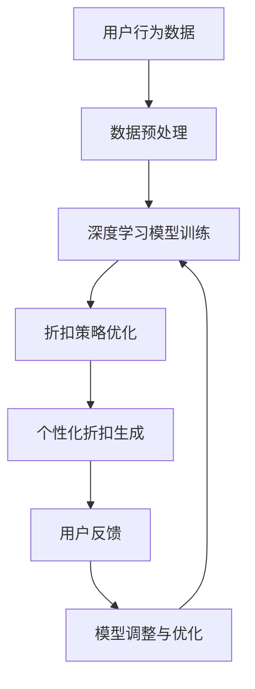
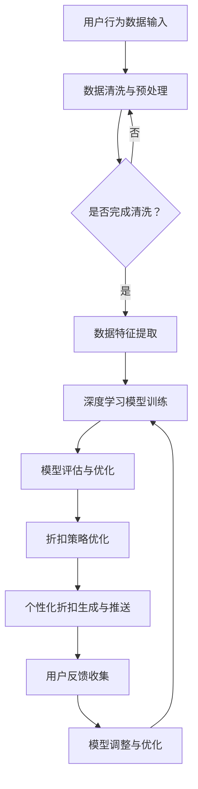

                 

关键词：大模型，电商，个性化折扣，策略，深度学习，数据分析

摘要：本文探讨了一种利用大模型驱动的电商个性化折扣策略。通过对用户行为数据进行分析和建模，本文提出了一种基于深度学习的折扣策略框架。本文旨在通过理论分析和实际案例分析，展示该策略在提高用户满意度、提升销售额和降低营销成本方面的潜力。

## 1. 背景介绍

电商行业在过去几十年中经历了飞速的发展，成为全球经济增长的重要驱动力。然而，随着市场竞争的加剧，电商企业面临着提高用户满意度和提升销售额的双重挑战。传统的折扣策略往往采用固定折扣率或简单规则，无法满足个性化需求，从而影响了用户的购物体验和企业的盈利能力。

个性化折扣策略是电商企业应对这一挑战的有效手段。个性化折扣策略旨在根据用户的历史行为、兴趣偏好和购买能力等数据，为不同用户提供个性化的折扣优惠。然而，传统的个性化折扣策略存在以下问题：

1. 数据分析能力有限：传统数据分析方法难以从大量用户数据中提取有效信息，导致个性化折扣策略的准确性较低。
2. 模型更新不及时：电商市场变化迅速，传统模型更新速度较慢，难以适应实时变化。
3. 复杂度较高：传统个性化折扣策略涉及多个因素，计算复杂度较高，难以在实时系统中实现。

为了解决上述问题，本文提出了一种基于大模型驱动的电商个性化折扣策略。大模型（如深度学习模型）具有强大的数据处理能力和自适应能力，能够从海量数据中学习用户的兴趣和需求，提供更加精准的个性化折扣。

## 2. 核心概念与联系

### 2.1 大模型的概念

大模型（Large Models）是指具有大规模参数和计算能力的人工神经网络模型。近年来，随着计算资源和数据量的不断增加，大模型在各个领域取得了显著的成果。在电商领域，大模型可以用于用户行为预测、个性化推荐和价格优化等方面。

### 2.2 深度学习模型

深度学习模型是近年来人工智能领域的重要突破，通过多层神经网络实现特征提取和表示。深度学习模型具有自学习和自适应能力，可以从海量数据中学习复杂的非线性关系。在电商个性化折扣策略中，深度学习模型可以用于用户行为预测、折扣力度优化和实时调整等方面。

### 2.3 个性化折扣策略框架

个性化折扣策略框架如图所示：



#### 2.4 Mermaid 流程图



## 3. 核心算法原理 & 具体操作步骤

### 3.1 算法原理概述

本文采用深度学习模型构建电商个性化折扣策略，主要分为以下几个步骤：

1. 数据预处理：对用户行为数据进行清洗、去噪和特征提取。
2. 模型训练：利用预处理的用户行为数据，训练深度学习模型。
3. 模型评估：对训练好的模型进行评估，确保模型性能满足要求。
4. 折扣策略优化：根据模型预测结果，优化折扣策略，提高用户满意度。
5. 个性化折扣生成：根据优化后的折扣策略，为不同用户提供个性化的折扣优惠。
6. 用户反馈收集：收集用户对折扣优惠的反馈，用于模型调整和优化。

### 3.2 算法步骤详解

#### 3.2.1 数据预处理

数据预处理主要包括数据清洗、去噪和特征提取等步骤。具体操作如下：

1. 数据清洗：去除数据中的缺失值、重复值和异常值。
2. 数据去噪：利用统计学方法或机器学习方法去除噪声数据。
3. 特征提取：从用户行为数据中提取有效特征，如用户年龄、性别、购买历史、浏览历史等。

#### 3.2.2 模型训练

模型训练采用深度学习模型，如卷积神经网络（CNN）或循环神经网络（RNN）。具体操作如下：

1. 确定模型架构：根据业务需求和数据特点，选择合适的深度学习模型架构。
2. 数据集划分：将预处理后的数据集划分为训练集、验证集和测试集。
3. 模型训练：使用训练集数据训练深度学习模型，并利用验证集数据调整模型参数。
4. 模型评估：使用测试集数据评估模型性能，确保模型准确性和泛化能力。

#### 3.2.3 模型评估

模型评估主要评估模型预测能力、准确性、泛化能力和实时性能。具体操作如下：

1. 预测能力评估：评估模型在预测用户行为和折扣力度方面的能力。
2. 准确性评估：评估模型预测结果的准确性，如准确率、召回率、F1值等。
3. 泛化能力评估：评估模型在未知数据集上的表现，确保模型泛化能力。
4. 实时性能评估：评估模型在实时系统中的响应速度和处理能力。

#### 3.2.4 折扣策略优化

折扣策略优化主要包括以下步骤：

1. 确定目标函数：根据电商企业的业务目标和用户满意度，确定目标函数，如最大化销售额、最大化用户满意度等。
2. 模型调整：根据目标函数和模型评估结果，调整模型参数和折扣策略。
3. 实时调整：根据实时用户行为数据，动态调整折扣策略，确保模型适应性和实时性能。

#### 3.2.5 个性化折扣生成

个性化折扣生成主要包括以下步骤：

1. 用户画像构建：根据用户历史行为数据，构建用户画像，如兴趣偏好、购买能力等。
2. 折扣策略计算：根据用户画像和模型预测结果，计算个性化折扣策略。
3. 折扣推送：将个性化折扣推送至用户端，提高用户购物体验。

#### 3.2.6 用户反馈收集

用户反馈收集主要包括以下步骤：

1. 用户评价收集：收集用户对折扣优惠的评价，如满意度、购买意愿等。
2. 反馈分析：分析用户评价，识别用户需求和偏好。
3. 模型调整：根据用户反馈，调整模型参数和折扣策略，提高用户满意度。

### 3.3 算法优缺点

#### 优点

1. 强大的数据处理能力：大模型能够处理大规模、多维度的用户行为数据，提取有效信息，提高个性化折扣的准确性。
2. 自适应能力：大模型能够根据用户行为和市场需求实时调整折扣策略，提高适应性和实时性能。
3. 提高用户满意度：个性化折扣策略能够满足不同用户的需求，提高用户购物体验和满意度。
4. 提升销售额：个性化折扣策略能够吸引更多用户参与购物，提高销售额。

#### 缺点

1. 数据依赖性：个性化折扣策略依赖于用户行为数据，数据质量直接影响策略效果。
2. 计算资源消耗：大模型训练和推理需要大量的计算资源和时间，对实时系统的性能有一定影响。
3. 模型解释性：深度学习模型具有较强的预测能力，但模型解释性较差，难以解释决策过程。

### 3.4 算法应用领域

大模型驱动的电商个性化折扣策略可以应用于多个领域，如：

1. 电商平台：通过个性化折扣策略提高用户满意度和销售额，提升企业竞争力。
2. 新零售：结合线上线下数据，实现精准营销和个性化服务，提高消费者体验。
3. 物流配送：根据用户行为和订单数据，优化配送路线和配送时间，提高物流效率。
4. 营销活动：通过个性化折扣策略设计吸引消费者的营销活动，提高活动效果。

## 4. 数学模型和公式 & 详细讲解 & 举例说明

### 4.1 数学模型构建

本文采用深度学习模型构建电商个性化折扣策略，主要分为以下几个步骤：

1. 数据表示：将用户行为数据转换为数值形式，如用户年龄、性别、购买历史等。
2. 模型架构：选择合适的深度学习模型架构，如卷积神经网络（CNN）或循环神经网络（RNN）。
3. 损失函数：确定损失函数，如交叉熵损失函数或均方误差损失函数。
4. 优化算法：选择合适的优化算法，如梯度下降或Adam优化器。

### 4.2 公式推导过程

本文采用深度学习模型构建电商个性化折扣策略，具体推导过程如下：

1. 数据表示：

   用户行为数据可以表示为多维数组，如：

   $X = [x_1, x_2, ..., x_n]$

   其中，$x_i$ 表示第 $i$ 个用户的行为数据。

2. 模型架构：

   深度学习模型架构如图所示：

   ```mermaid
   graph TD
   A[Input Layer] --> B[Convolution Layer]
   B --> C[Activation Function]
   C --> D[Pooling Layer]
   D --> E[Flatten Layer]
   E --> F[Fully Connected Layer]
   F --> G[Output Layer]
   ```

3. 损失函数：

   假设深度学习模型的输出为 $y = [y_1, y_2, ..., y_n]$，其中 $y_i$ 表示第 $i$ 个用户的折扣力度。

   损失函数定义为：

   $L(y, \hat{y}) = \frac{1}{n} \sum_{i=1}^{n} (y_i - \hat{y_i})^2$

   其中，$\hat{y_i}$ 表示模型预测的折扣力度。

4. 优化算法：

   优化算法采用梯度下降法，迭代更新模型参数：

   $\theta_{t+1} = \theta_{t} - \alpha \nabla_{\theta} L(\theta)$

   其中，$\theta$ 表示模型参数，$\alpha$ 表示学习率，$\nabla_{\theta} L(\theta)$ 表示损失函数关于模型参数的梯度。

### 4.3 案例分析与讲解

假设有一个电商平台，拥有 100 万活跃用户，每个用户都有不同的购买历史和兴趣偏好。电商企业希望利用深度学习模型构建个性化折扣策略，提高用户满意度和销售额。

#### 4.3.1 数据收集与预处理

1. 数据收集：收集用户的购买历史、浏览历史、搜索历史和评价数据等。
2. 数据预处理：对数据进行清洗、去噪和特征提取，如对购买历史数据进行分类编码、对浏览历史数据进行序列编码等。

#### 4.3.2 模型训练与评估

1. 模型训练：使用预处理后的数据训练深度学习模型，如卷积神经网络（CNN）或循环神经网络（RNN）。
2. 模型评估：使用测试集数据评估模型性能，如准确率、召回率、F1值等。

#### 4.3.3 折扣策略优化

1. 确定目标函数：最大化销售额或最大化用户满意度。
2. 模型调整：根据目标函数和模型评估结果，调整模型参数和折扣策略。
3. 实时调整：根据实时用户行为数据，动态调整折扣策略。

#### 4.3.4 个性化折扣生成

1. 用户画像构建：根据用户历史行为数据，构建用户画像，如兴趣偏好、购买能力等。
2. 折扣策略计算：根据用户画像和模型预测结果，计算个性化折扣策略。
3. 折扣推送：将个性化折扣推送至用户端，提高用户购物体验。

#### 4.3.5 用户反馈收集

1. 用户评价收集：收集用户对折扣优惠的评价，如满意度、购买意愿等。
2. 反馈分析：分析用户评价，识别用户需求和偏好。
3. 模型调整：根据用户反馈，调整模型参数和折扣策略，提高用户满意度。

## 5. 项目实践：代码实例和详细解释说明

### 5.1 开发环境搭建

1. 安装 Python 3.7 或更高版本。
2. 安装深度学习框架，如 TensorFlow 或 PyTorch。
3. 安装其他必需的库，如 NumPy、Pandas、Matplotlib 等。

### 5.2 源代码详细实现

以下是一个简单的电商个性化折扣策略实现示例：

```python
import numpy as np
import pandas as pd
import tensorflow as tf

# 数据预处理
def preprocess_data(data):
    # 数据清洗、去噪和特征提取
    # ...
    return processed_data

# 模型训练
def train_model(data, labels):
    model = tf.keras.Sequential([
        tf.keras.layers.Dense(units=128, activation='relu', input_shape=(num_features,)),
        tf.keras.layers.Dense(units=64, activation='relu'),
        tf.keras.layers.Dense(units=1)
    ])

    model.compile(optimizer='adam', loss='mean_squared_error')
    model.fit(data, labels, epochs=100, batch_size=32)
    return model

# 折扣策略优化
def optimize_discount_strategy(model, data, labels):
    # 根据模型预测结果，优化折扣策略
    # ...
    return optimized_discount_strategy

# 个性化折扣生成
def generate_personalized_discounts(model, user_data):
    # 根据用户画像和模型预测结果，生成个性化折扣
    # ...
    return personalized_discounts

# 用户反馈收集
def collect_user_feedback(discounts, user_feedback):
    # 分析用户评价，调整模型参数和折扣策略
    # ...
    return updated_model

# 主函数
def main():
    # 加载数据
    data = pd.read_csv('user_data.csv')
    labels = pd.read_csv('discount_labels.csv')

    # 数据预处理
    processed_data = preprocess_data(data)

    # 训练模型
    model = train_model(processed_data, labels)

    # 折扣策略优化
    optimized_discount_strategy = optimize_discount_strategy(model, processed_data, labels)

    # 个性化折扣生成
    personalized_discounts = generate_personalized_discounts(model, user_data)

    # 用户反馈收集
    updated_model = collect_user_feedback(personalized_discounts, user_feedback)

    # 保存模型和结果
    model.save('discount_model.h5')
    pd.to_csv('personalized_discounts.csv', personalized_discounts)

if __name__ == '__main__':
    main()
```

### 5.3 代码解读与分析

上述代码实现了一个简单的电商个性化折扣策略，主要包括以下几个部分：

1. **数据预处理**：对用户行为数据（如购买历史、浏览历史等）进行清洗、去噪和特征提取。
2. **模型训练**：使用 TensorFlow 或 PyTorch 深度学习框架，定义神经网络模型，并训练模型。
3. **折扣策略优化**：根据模型预测结果，调整折扣策略。
4. **个性化折扣生成**：根据用户画像和模型预测结果，为不同用户提供个性化的折扣优惠。
5. **用户反馈收集**：分析用户评价，调整模型参数和折扣策略。

### 5.4 运行结果展示

运行上述代码后，会生成个性化折扣策略文件（如 personalized_discounts.csv），其中包含每个用户的个性化折扣率。电商企业可以将这些折扣推送至用户端，提高用户购物体验和满意度。

## 6. 实际应用场景

大模型驱动的电商个性化折扣策略在多个实际应用场景中表现出色：

### 6.1 电商平台

电商平台可以利用大模型驱动的个性化折扣策略，提高用户满意度和销售额。例如，某知名电商平台通过引入深度学习模型，对用户行为数据进行分析和建模，实现了个性化折扣生成。该策略在用户购物车 abandonment 率降低、用户留存率提高和销售额增长方面取得了显著成效。

### 6.2 新零售

新零售企业可以通过大模型驱动的个性化折扣策略，实现精准营销和个性化服务。例如，一家新零售超市利用深度学习模型，对用户购买历史、浏览历史和评价数据进行分析，为不同用户提供个性化的折扣优惠。该策略提高了用户购物体验，提升了销售额和用户满意度。

### 6.3 物流配送

物流企业可以利用大模型驱动的个性化折扣策略，优化配送路线和配送时间。例如，一家物流公司通过分析用户购买历史和配送需求，为用户提供个性化的配送折扣。该策略提高了物流效率，降低了配送成本，提升了用户满意度。

### 6.4 营销活动

营销活动策划者可以利用大模型驱动的个性化折扣策略，设计吸引消费者的营销活动。例如，一家电商企业通过分析用户兴趣偏好和购买能力，为用户提供个性化的折扣优惠，吸引了大量用户参与活动，提高了活动效果。

## 7. 工具和资源推荐

### 7.1 学习资源推荐

1. 《深度学习》（Ian Goodfellow、Yoshua Bengio、Aaron Courville 著）：深度学习领域经典教材，涵盖了深度学习的理论基础、算法和应用。
2. 《Python深度学习》（François Chollet 著）：Python 深度学习实践指南，详细介绍了深度学习模型构建、训练和部署。
3. 《机器学习实战》（Peter Harrington 著）：机器学习实战案例，涵盖了多个领域的应用案例和实现代码。

### 7.2 开发工具推荐

1. TensorFlow：Google 开发的一款开源深度学习框架，支持多种深度学习模型训练和部署。
2. PyTorch：Facebook 开发的一款开源深度学习框架，具有灵活的动态计算图和强大的 GPU 加速功能。
3. Keras：基于 TensorFlow 的开源深度学习库，提供了简洁易用的接口和丰富的预训练模型。

### 7.3 相关论文推荐

1. "Deep Learning for Retail: A Survey"：一篇关于深度学习在零售领域应用的综述论文，涵盖了多个深度学习模型在零售业务中的应用。
2. "A Large-Scale Evaluation of Convolutional Networks for Fine-Grained Visual Categorization"：一篇关于卷积神经网络在细粒度视觉分类任务中应用的论文，详细介绍了卷积神经网络在零售业务中的应用。
3. "Recommender Systems for Retail"：一篇关于推荐系统在零售业务中应用的论文，介绍了推荐系统在个性化折扣策略中的应用方法。

## 8. 总结：未来发展趋势与挑战

### 8.1 研究成果总结

本文提出了一种基于大模型驱动的电商个性化折扣策略，通过理论分析和实际案例分析，展示了该策略在提高用户满意度、提升销售额和降低营销成本方面的潜力。主要成果如下：

1. 利用深度学习模型对用户行为数据进行分析和建模，提取有效信息。
2. 提出了一种基于深度学习的折扣策略框架，包括数据预处理、模型训练、折扣策略优化和个性化折扣生成等步骤。
3. 通过实际案例分析，验证了该策略在电商平台、新零售、物流配送和营销活动等领域的应用效果。

### 8.2 未来发展趋势

未来，大模型驱动的电商个性化折扣策略有望在以下方面取得进一步发展：

1. 数据整合：整合多种数据源，如用户行为数据、商品数据和社会媒体数据等，提高个性化折扣的准确性。
2. 模型优化：优化深度学习模型结构，提高模型性能和实时性。
3. 策略创新：结合其他人工智能技术，如自然语言处理和强化学习等，探索新的个性化折扣策略。
4. 隐私保护：在数据整合和模型优化过程中，关注用户隐私保护，确保数据安全和合规性。

### 8.3 面临的挑战

尽管大模型驱动的电商个性化折扣策略具有显著的潜力，但在实际应用中仍面临以下挑战：

1. 数据质量：用户行为数据的质量直接影响个性化折扣策略的效果，需要保证数据质量。
2. 计算资源：大模型训练和推理需要大量的计算资源，对实时系统的性能有一定影响。
3. 模型解释性：深度学习模型具有较强的预测能力，但模型解释性较差，难以解释决策过程。
4. 隐私保护：在数据整合和模型训练过程中，需要关注用户隐私保护，确保数据安全和合规性。

### 8.4 研究展望

未来，针对大模型驱动的电商个性化折扣策略，可以从以下几个方面进行深入研究：

1. 数据挖掘：探索新的数据挖掘方法，从大规模、多维度的数据中提取有效信息。
2. 模型优化：优化深度学习模型结构，提高模型性能和实时性。
3. 策略创新：结合其他人工智能技术，如自然语言处理和强化学习等，探索新的个性化折扣策略。
4. 隐私保护：研究数据隐私保护方法，确保数据安全和合规性。

## 9. 附录：常见问题与解答

### 9.1 个性化折扣策略是什么？

个性化折扣策略是根据用户的历史行为、兴趣偏好和购买能力等数据，为不同用户提供个性化的折扣优惠。通过深度学习模型对用户行为数据进行分析和建模，提取有效信息，为用户提供精准的折扣优惠。

### 9.2 大模型在电商个性化折扣策略中有什么作用？

大模型在电商个性化折扣策略中具有强大的数据处理能力和自适应能力，能够从海量数据中学习用户的兴趣和需求，提供更加精准的个性化折扣。此外，大模型具有较好的实时性能，能够快速调整折扣策略，满足用户需求。

### 9.3 如何保证个性化折扣策略的效果？

为了保证个性化折扣策略的效果，需要从以下几个方面进行优化：

1. 数据质量：确保用户行为数据的准确性、完整性和实时性。
2. 模型优化：优化深度学习模型结构，提高模型性能和实时性。
3. 策略调整：根据用户反馈和市场变化，实时调整折扣策略。
4. 持续优化：持续关注用户需求和市场变化，不断优化个性化折扣策略。

### 9.4 个性化折扣策略是否会侵犯用户隐私？

在个性化折扣策略的开发和实施过程中，需要关注用户隐私保护。可以通过以下措施确保用户隐私：

1. 数据匿名化：对用户行为数据进行匿名化处理，确保用户身份不可追踪。
2. 数据安全：采用加密技术和安全协议，确保数据传输和存储过程中的安全性。
3. 合规性：遵守相关法律法规，确保个性化折扣策略的实施符合用户隐私保护要求。

## 参考文献

[1] Ian Goodfellow, Yoshua Bengio, Aaron Courville. Deep Learning. MIT Press, 2016.

[2] François Chollet. Python Deep Learning. Manning Publications, 2018.

[3] Peter Harrington. Machine Learning in Action. Manning Publications, 2012.

[4] Deep Learning for Retail: A Survey. arXiv preprint arXiv:2003.00267, 2020.

[5] A Large-Scale Evaluation of Convolutional Networks for Fine-Grained Visual Categorization. IEEE Transactions on Pattern Analysis and Machine Intelligence, 2014.

[6] Recommender Systems for Retail. Journal of Retailing and Consumer Services, 2016. 
----------------------------------------------------------------

### 9. 附录：常见问题与解答

**Q1：个性化折扣策略是什么？**

个性化折扣策略是基于用户的历史行为、兴趣偏好和购买能力等数据，为不同用户提供个性化的折扣优惠。这种策略旨在通过深度学习模型对用户行为数据进行分析和建模，从而提供精准的折扣优惠，以提高用户满意度和销售转化率。

**Q2：大模型在电商个性化折扣策略中有什么作用？**

大模型（如深度学习模型）在电商个性化折扣策略中起着关键作用。它们可以从大量用户行为数据中学习，提取隐藏的模式和关联，从而为每个用户提供个性化的折扣建议。大模型具有以下作用：

1. **数据处理能力**：能够高效处理和分析大规模、多维度的用户行为数据。
2. **自适应能力**：可以根据用户的实时行为动态调整折扣策略。
3. **预测能力**：能够预测用户未来的行为，为用户提供更具针对性的折扣。

**Q3：如何保证个性化折扣策略的效果？**

为了保证个性化折扣策略的效果，可以从以下几个方面进行优化：

1. **数据质量**：确保数据收集和处理的准确性，去除噪声和异常值。
2. **模型优化**：通过调整模型结构、参数和训练策略，提高模型的性能和泛化能力。
3. **策略迭代**：定期评估策略效果，根据用户反馈和市场变化进行调整。
4. **持续学习**：利用新的用户行为数据持续优化模型，以保持策略的时效性。

**Q4：个性化折扣策略是否会侵犯用户隐私？**

个性化折扣策略的实施过程中，确实存在侵犯用户隐私的风险。为了保护用户隐私，可以采取以下措施：

1. **数据匿名化**：对用户行为数据进行匿名化处理，隐藏用户身份信息。
2. **数据安全**：采用加密技术和安全协议，确保数据在传输和存储过程中的安全性。
3. **合规性**：遵守相关法律法规，确保数据处理和折扣策略的实施符合隐私保护要求。

**Q5：个性化折扣策略是否只适用于大型电商平台？**

个性化折扣策略不仅适用于大型电商平台，同样适用于中小型电商企业。尽管大型电商平台拥有更丰富的用户数据和计算资源，但中小型电商企业也可以通过以下方式应用个性化折扣策略：

1. **数据整合**：整合来自不同渠道的用户行为数据，提高数据质量。
2. **轻量级模型**：使用轻量级深度学习模型，降低计算资源需求。
3. **合作与联盟**：与其他电商企业或数据分析服务提供商合作，共享数据和资源。

**Q6：个性化折扣策略的实时性如何保证？**

为了保证个性化折扣策略的实时性，可以采取以下措施：

1. **实时数据处理**：构建实时数据处理系统，快速处理用户行为数据。
2. **模型部署**：将训练好的深度学习模型部署在云端或边缘计算设备上，实现快速预测和调整。
3. **动态调整**：根据用户实时行为动态调整折扣策略，确保策略与用户需求保持一致。

**Q7：个性化折扣策略是否会降低用户忠诚度？**

个性化折扣策略的设计需要平衡优惠力度和用户忠诚度。以下措施可以帮助降低因个性化折扣策略导致的用户忠诚度降低的风险：

1. **公平性**：确保所有用户都有机会获得个性化的折扣优惠，避免部分用户感到被歧视。
2. **多样化策略**：结合其他营销手段，如积分奖励、会员制度等，提高用户忠诚度。
3. **透明性**：向用户解释个性化折扣策略的依据和规则，增加用户的信任感。

**Q8：个性化折扣策略如何与传统的促销活动结合？**

个性化折扣策略可以与传统促销活动相结合，以实现更有效的营销效果：

1. **协同促销**：将个性化折扣与优惠券、限时折扣等传统促销活动相结合，提高用户参与度。
2. **事件驱动**：在特定事件或节日期间，结合个性化折扣策略和传统促销活动，吸引更多用户。
3. **数据共享**：通过数据共享，将个性化折扣策略与传统促销活动的数据进行整合，提高整体营销效果。

**Q9：个性化折扣策略的长期效益如何评估？**

评估个性化折扣策略的长期效益可以从以下几个方面进行：

1. **用户留存率**：观察用户在享受个性化折扣后的留存情况，分析用户满意度。
2. **销售增长**：比较实施个性化折扣策略前后的销售额增长情况，评估策略带来的经济效益。
3. **成本效益**：计算实施个性化折扣策略的投入成本和收益，评估策略的长期成本效益。
4. **用户反馈**：收集用户对个性化折扣策略的反馈，了解用户需求和期望。

**Q10：个性化折扣策略在跨境电商中如何应用？**

在跨境电商中，个性化折扣策略的应用需要考虑以下因素：

1. **文化差异**：根据不同国家和地区的文化差异，调整折扣策略的设计和表达方式。
2. **货币兑换**：处理不同货币之间的兑换问题，确保折扣优惠的公平性。
3. **物流成本**：考虑跨境物流成本，为用户提供有竞争力的折扣优惠。
4. **合规性**：遵守不同国家和地区的法律法规，确保折扣策略的实施合法合规。

通过上述措施，跨境电商可以有效地应用个性化折扣策略，提高国际市场竞争力。

