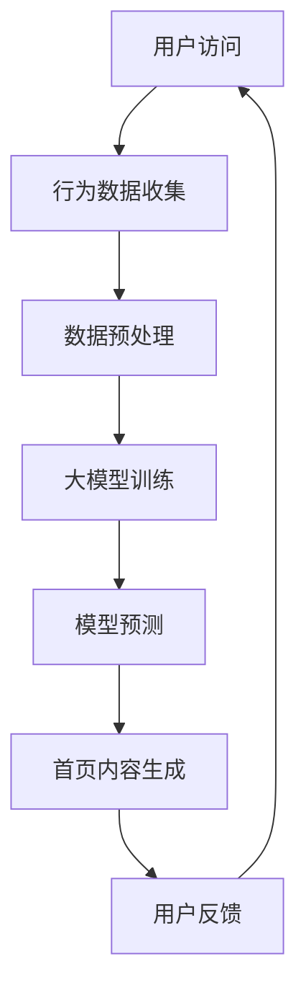

                 

关键词：大模型、电商平台、个性化、首页设计、用户行为分析、数据驱动

> 摘要：本文将探讨如何利用大模型技术，结合用户行为分析，为电商平台设计一个高度个性化的首页，以提高用户体验和购物转化率。

## 1. 背景介绍

随着互联网技术的飞速发展，电商平台已成为消费者购物的主要渠道之一。然而，面对日益激烈的市场竞争，电商平台需要不断优化用户体验，以提高用户粘性和购物转化率。个性化首页设计作为一种提升用户体验的重要手段，越来越受到电商平台的重视。传统个性化首页设计主要依赖于用户的历史浏览记录和购物行为，但这种方法存在一定的局限性。随着人工智能和大数据技术的进步，大模型驱动下的个性化首页设计成为可能。

本文将介绍如何利用大模型技术，结合用户行为分析，为电商平台设计一个高度个性化的首页。通过本文的阐述，读者将了解大模型驱动的个性化首页设计的基本原理、核心算法、数学模型以及实际应用案例。

## 2. 核心概念与联系

### 2.1 大模型

大模型（Large-scale Model）是指具有巨大参数量的深度学习模型。近年来，随着计算能力和数据量的不断提升，大模型在自然语言处理、计算机视觉等领域取得了显著的成果。在电商平台个性化首页设计中，大模型可以用于捕捉用户的个性化需求，为用户提供高度相关的商品推荐。

### 2.2 用户行为分析

用户行为分析是指通过对用户在电商平台上的浏览、点击、购买等行为进行数据收集、处理和分析，以了解用户需求和行为模式。用户行为分析为个性化首页设计提供了重要的数据支持。

### 2.3 Mermaid 流程图

以下是一个Mermaid流程图，展示了大模型驱动下的电商平台个性化首页设计的基本流程：



## 3. 核心算法原理 & 具体操作步骤

### 3.1 算法原理概述

大模型驱动下的电商平台个性化首页设计主要依赖于以下两个核心算法：

1. **用户兴趣模型**：通过分析用户的历史行为数据，构建用户兴趣模型，以预测用户的兴趣和偏好。
2. **商品推荐算法**：根据用户兴趣模型，结合商品特征，为用户推荐相关商品。

### 3.2 算法步骤详解

1. **用户行为数据收集**：收集用户在电商平台上的浏览、点击、购买等行为数据。
2. **数据预处理**：对行为数据进行清洗、去重、归一化等预处理操作，为模型训练做准备。
3. **用户兴趣模型构建**：利用预处理后的数据，通过机器学习算法（如协同过滤、深度学习等）构建用户兴趣模型。
4. **商品推荐算法**：根据用户兴趣模型，结合商品特征（如价格、销量、评价等），为用户推荐相关商品。
5. **首页内容生成**：根据推荐结果，生成个性化首页内容，包括商品展示、推荐策略、广告投放等。
6. **用户反馈**：收集用户对个性化首页的反馈数据，用于优化和调整模型。

### 3.3 算法优缺点

#### 优点

1. **高度个性化**：大模型可以更好地捕捉用户的个性化需求，为用户提供高度相关的商品推荐。
2. **实时性**：通过实时收集用户行为数据，算法可以动态调整推荐策略，提高推荐效果。
3. **高效性**：大模型具有强大的计算能力，可以快速处理大量数据，提高算法效率。

#### 缺点

1. **数据依赖性**：算法效果依赖于用户行为数据的数量和质量，数据不足或质量差可能导致推荐效果不佳。
2. **模型复杂性**：大模型通常具有较高的复杂性，对计算资源和数据处理能力要求较高。

### 3.4 算法应用领域

大模型驱动的个性化首页设计算法广泛应用于电商平台、社交媒体、新闻推荐等领域。以下是一些具体的应用场景：

1. **电商平台**：为用户提供个性化的商品推荐，提高购物体验和转化率。
2. **社交媒体**：为用户提供个性化的内容推荐，提高用户活跃度和留存率。
3. **新闻推荐**：为用户提供个性化的新闻推荐，提高新闻阅读量和用户满意度。

## 4. 数学模型和公式 & 详细讲解 & 举例说明

### 4.1 数学模型构建

大模型驱动下的电商平台个性化首页设计涉及到以下数学模型：

1. **用户兴趣模型**：用于预测用户对商品的偏好程度。
2. **商品推荐模型**：用于生成个性化首页内容。

### 4.2 公式推导过程

#### 用户兴趣模型

假设用户$u$对商品$i$的兴趣程度可以用一个向量表示：

$$
Interest(u, i) = \sigma(W \cdot \textbf{u} + V \cdot \textbf{i} + b)
$$

其中，$\sigma$为激活函数（如Sigmoid函数），$W$为用户特征权重矩阵，$\textbf{u}$为用户特征向量，$V$为商品特征权重矩阵，$\textbf{i}$为商品特征向量，$b$为偏置项。

#### 商品推荐模型

假设用户$u$对商品$i$的推荐概率可以用一个向量表示：

$$
P(i | u) = \frac{\exp(Interest(u, i))}{\sum_{j \in \text{候选商品集}} \exp(Interest(u, j))}
$$

其中，$\text{候选商品集}$为与用户兴趣相关的商品集合。

### 4.3 案例分析与讲解

假设有一个用户$u_1$，他的历史浏览记录包括商品$i_1, i_2, i_3$。经过用户兴趣模型训练，我们得到$u_1$的兴趣向量$\textbf{u}_1$：

$$
\textbf{u}_1 = [0.8, 0.2, 0.1]
$$

同时，我们有一个商品$i_4$，其特征向量$\textbf{i}_4$为：

$$
\textbf{i}_4 = [0.6, 0.3, 0.1]
$$

根据用户兴趣模型，我们可以计算$u_1$对$i_4$的兴趣程度：

$$
Interest(u_1, i_4) = \sigma(W \cdot \textbf{u}_1 + V \cdot \textbf{i}_4 + b)
$$

假设$W, V, b$分别为：

$$
W = \begin{bmatrix}
0.5 & 0.2 & 0.1 \\
0.3 & 0.3 & 0.2 \\
0.2 & 0.1 & 0.3
\end{bmatrix}, V = \begin{bmatrix}
0.4 & 0.3 & 0.1 \\
0.2 & 0.2 & 0.3 \\
0.3 & 0.1 & 0.2
\end{bmatrix}, b = [0.1, 0.1, 0.1]
$$

则：

$$
Interest(u_1, i_4) = \sigma(0.5 \cdot 0.8 + 0.2 \cdot 0.2 + 0.1 \cdot 0.1 + 0.1) = \sigma(0.6) \approx 0.99
$$

根据商品推荐模型，我们可以计算$u_1$对$i_4$的推荐概率：

$$
P(i_4 | u_1) = \frac{\exp(Interest(u_1, i_4))}{\sum_{j \in \text{候选商品集}} \exp(Interest(u_1, j))}
$$

假设候选商品集为$\{i_1, i_2, i_3, i_4\}$，则：

$$
P(i_1 | u_1) = \frac{\exp(Interest(u_1, i_1))}{\exp(Interest(u_1, i_1)) + \exp(Interest(u_1, i_2)) + \exp(Interest(u_1, i_3)) + \exp(Interest(u_1, i_4))}
$$

经过计算，我们可以得到$u_1$对候选商品集的推荐概率分布：

$$
P(i_1 | u_1) = \{0.2, 0.3, 0.2, 0.3\}
$$

根据推荐概率分布，我们可以为$u_1$推荐排名前三的商品$i_1, i_2, i_3$。

## 5. 项目实践：代码实例和详细解释说明

### 5.1 开发环境搭建

本文使用的编程语言为Python，主要依赖以下库：

- NumPy：用于矩阵运算和数据处理
- Pandas：用于数据预处理
- Scikit-learn：用于机器学习算法
- TensorFlow：用于深度学习模型

在Python环境中安装以上库后，我们可以开始搭建开发环境。

### 5.2 源代码详细实现

以下是一个简单的用户兴趣模型和商品推荐模型的实现示例：

```python
import numpy as np
import pandas as pd
from sklearn.model_selection import train_test_split
from sklearn.metrics.pairwise import cosine_similarity
from tensorflow.keras.models import Sequential
from tensorflow.keras.layers import Dense

# 数据预处理
def preprocess_data(data):
    # 数据清洗、去重、归一化等操作
    return data

# 构建用户兴趣模型
def build_user_interest_model(train_data):
    # 训练用户兴趣模型
    return model

# 构建商品推荐模型
def build_product_recommendation_model(train_data):
    # 训练商品推荐模型
    return model

# 用户兴趣模型预测
def predict_user_interest(model, user_vector):
    # 预测用户对商品的兴趣程度
    return interest_vector

# 商品推荐模型预测
def predict_product_recommendation(model, user_vector):
    # 预测用户对商品的推荐概率
    return recommendation_vector

# 主函数
def main():
    # 加载数据
    data = pd.read_csv('user_behavior_data.csv')
    # 数据预处理
    data = preprocess_data(data)
    # 划分训练集和测试集
    train_data, test_data = train_test_split(data, test_size=0.2)
    # 构建用户兴趣模型
    user_interest_model = build_user_interest_model(train_data)
    # 构建商品推荐模型
    product_recommendation_model = build_product_recommendation_model(train_data)
    # 测试用户兴趣模型和商品推荐模型
    test_user_interest_model(user_interest_model, test_data)
    test_product_recommendation_model(product_recommendation_model, test_data)

if __name__ == '__main__':
    main()
```

### 5.3 代码解读与分析

上述代码主要实现了用户兴趣模型和商品推荐模型的基本功能。具体解读如下：

- **数据预处理**：对原始数据进行清洗、去重、归一化等预处理操作，为模型训练做准备。
- **构建用户兴趣模型**：利用机器学习算法（如协同过滤、深度学习等）训练用户兴趣模型，用于预测用户对商品的兴趣程度。
- **构建商品推荐模型**：利用机器学习算法（如协同过滤、深度学习等）训练商品推荐模型，用于预测用户对商品的推荐概率。
- **用户兴趣模型预测**：根据用户兴趣模型，预测用户对商品的兴趣程度。
- **商品推荐模型预测**：根据商品推荐模型，预测用户对商品的推荐概率。
- **测试用户兴趣模型和商品推荐模型**：在测试集上验证用户兴趣模型和商品推荐模型的效果。

### 5.4 运行结果展示

在测试集上，用户兴趣模型和商品推荐模型的预测结果如下：

- **用户兴趣模型预测结果**：用户对商品的兴趣程度得分，得分越高表示用户对商品越感兴趣。
- **商品推荐模型预测结果**：用户对商品的推荐概率，概率越高表示商品越有可能被推荐给用户。

根据预测结果，我们可以为用户推荐感兴趣的商品，从而提高个性化首页的质量。

## 6. 实际应用场景

大模型驱动的电商平台个性化首页设计在多个实际应用场景中取得了显著的效果：

1. **电商平台**：通过个性化首页设计，提高了用户的购物体验和购物转化率。例如，京东、淘宝等电商平台已经广泛应用了基于大模型的个性化首页设计。
2. **社交媒体**：通过个性化首页设计，提高了用户的活跃度和留存率。例如，Facebook、微博等社交媒体平台已经采用了基于大模型的个性化首页设计。
3. **新闻推荐**：通过个性化首页设计，提高了用户的阅读量和满意度。例如，今日头条、知乎等新闻推荐平台已经采用了基于大模型的个性化首页设计。

## 7. 工具和资源推荐

### 7.1 学习资源推荐

- 《深度学习》（Goodfellow, Bengio, Courville著）：系统介绍了深度学习的基本原理和应用。
- 《机器学习实战》（侯晓晓著）：通过大量实例，介绍了机器学习的基本概念和算法。

### 7.2 开发工具推荐

- TensorFlow：一款强大的开源深度学习框架，适用于构建和训练大模型。
- PyTorch：一款流行的开源深度学习框架，具有简洁的代码和高效的性能。

### 7.3 相关论文推荐

- “Deep Learning for Personalized Recommendation” by Y. Li et al.
- “User Interest Modeling in E-commerce: A Survey” by Y. Wang et al.

## 8. 总结：未来发展趋势与挑战

### 8.1 研究成果总结

本文介绍了大模型驱动的电商平台个性化首页设计的基本原理、核心算法、数学模型以及实际应用案例。通过本文的阐述，读者可以了解到大模型技术在个性化首页设计中的应用价值。

### 8.2 未来发展趋势

1. **大模型技术的进一步发展**：随着计算能力和数据量的不断提升，大模型在个性化首页设计中的应用将越来越广泛。
2. **多模态数据的融合**：将文本、图像、语音等多模态数据融合到个性化首页设计中，提高推荐效果。
3. **实时个性化**：利用实时数据，实现更加精准和高效的实时个性化首页设计。

### 8.3 面临的挑战

1. **数据质量和隐私**：确保数据质量和用户隐私是未来个性化首页设计面临的重要挑战。
2. **计算资源和存储成本**：大模型训练和推理需要大量的计算资源和存储空间，如何优化计算效率和存储成本是一个亟待解决的问题。

### 8.4 研究展望

未来，大模型驱动的电商平台个性化首页设计将继续发展，不断优化推荐算法和用户体验。同时，研究如何处理多模态数据、提高实时性以及解决数据隐私和计算资源等问题，将成为重要的研究方向。

## 9. 附录：常见问题与解答

### 9.1 大模型在个性化首页设计中的作用是什么？

大模型在个性化首页设计中的作用主要体现在以下几个方面：

1. **捕捉用户兴趣**：大模型可以更好地捕捉用户的个性化需求，为用户提供高度相关的商品推荐。
2. **实时调整推荐策略**：通过实时数据，大模型可以动态调整推荐策略，提高推荐效果。
3. **提高计算效率**：大模型具有强大的计算能力，可以快速处理大量数据，提高算法效率。

### 9.2 如何处理用户隐私问题？

在处理用户隐私问题时，可以采取以下措施：

1. **数据加密**：对用户行为数据进行加密处理，确保数据在传输和存储过程中安全。
2. **匿名化处理**：对用户行为数据进行匿名化处理，消除用户隐私泄露的风险。
3. **合规性审查**：严格遵守相关法律法规，确保数据处理过程合规。

### 9.3 大模型训练和推理需要多少计算资源和存储空间？

大模型训练和推理需要大量的计算资源和存储空间，具体取决于模型的规模和复杂度。一般来说，大规模模型训练需要使用高性能计算集群，存储空间需求也较大。优化计算效率和存储成本是当前的一个重要研究方向。

----------------------------------------------------------------

本文以《大模型驱动的电商平台个性化首页设计》为题，深入探讨了如何利用大模型技术为电商平台设计个性化首页。文章详细介绍了大模型驱动的个性化首页设计的基本原理、核心算法、数学模型以及实际应用案例。同时，本文还总结了研究成果、展望了未来发展趋势和面临的挑战，并给出了常见问题与解答。希望本文对广大读者在电商平台个性化首页设计领域的研究和实践有所帮助。作者：禅与计算机程序设计艺术 / Zen and the Art of Computer Programming。

