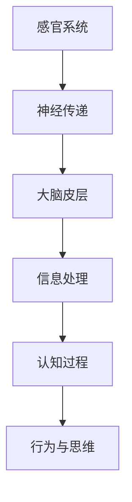
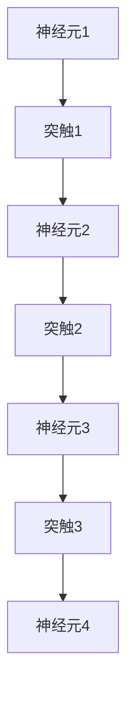
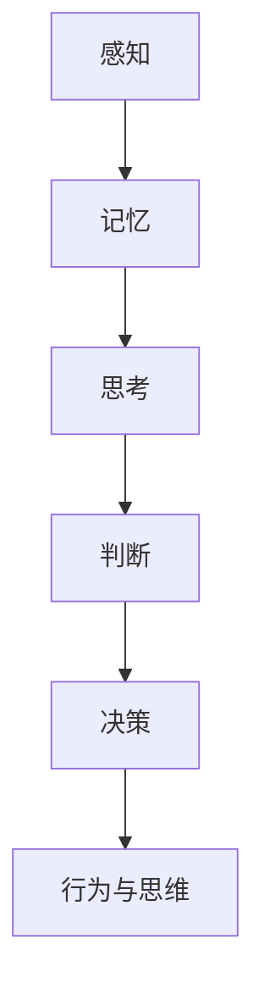

                 

大脑是宇宙中最为复杂的信息处理系统。它能够从环境中获取信息，进行处理，并生成相应的行为和思维。随着认知科学和神经科学的不断发展，我们逐渐揭示了大脑处理信息的机制。本文将探讨大脑如何接收、处理和利用信息，以及如何通过认知科学的方法进行知识发现。

## 1. 背景介绍

信息处理是大脑的核心功能之一。从简单的感官输入到复杂的认知任务，大脑都需要进行信息处理。这个过程涉及到感官系统、神经网络和认知机制。随着认知科学和神经科学的不断发展，我们逐渐揭示了大脑处理信息的机制。本文将介绍大脑处理信息的基本过程，并探讨如何通过认知科学的方法进行知识发现。

## 2. 核心概念与联系

### 2.1 感官系统

感官系统是大脑接收外部信息的主要途径。视觉、听觉、触觉、嗅觉和味觉等感官系统都能够将外界的信息转化为电信号，并传递给大脑。



### 2.2 神经网络

神经网络是大脑的基本单元。神经元通过突触连接形成复杂的网络结构，从而实现信息的传递和处理。



### 2.3 认知过程

认知过程包括感知、记忆、思考、判断和决策等。这些过程构成了大脑处理信息的高级机制。



## 3. 核心算法原理 & 具体操作步骤

### 3.1 算法原理概述

大脑处理信息的过程可以看作是一种分布式计算的过程。在这个过程中，神经元和神经网络共同作用，实现信息的接收、处理和利用。

### 3.2 算法步骤详解

1. **感官输入**：感官系统接收外部信息，并将其转化为电信号。
2. **神经元传递**：电信号通过神经元传递，形成神经网络。
3. **信息处理**：神经网络对信息进行加工和处理，提取有用的特征。
4. **认知过程**：大脑通过认知过程，对信息进行理解、记忆和利用。
5. **行为与思维**：最终，大脑生成的行为和思维反映了处理后的信息。

### 3.3 算法优缺点

**优点**：大脑能够高效地处理复杂的信息，适应多变的环境。

**缺点**：大脑的信息处理能力有限，且容易受到外界干扰。

### 3.4 算法应用领域

大脑的信息处理机制在多个领域有广泛的应用，包括人工智能、机器学习、认知科学等。

## 4. 数学模型和公式 & 详细讲解 & 举例说明

### 4.1 数学模型构建

大脑的信息处理过程可以用神经网络模型来描述。假设我们有一个由 $N$ 个神经元组成的神经网络，每个神经元都有一个权重 $w_i$ 和一个阈值 $\theta_i$。

### 4.2 公式推导过程

神经元的输出可以通过以下公式计算：

$$
o_i = \sigma(w_i \cdot x_i + \theta_i)
$$

其中，$x_i$ 是输入值，$w_i$ 是权重，$\theta_i$ 是阈值，$\sigma$ 是激活函数。

### 4.3 案例分析与讲解

假设我们有一个简单的神经网络，包括 3 个神经元，权重分别为 $w_1 = 1, w_2 = 2, w_3 = 3$，阈值分别为 $\theta_1 = 0, \theta_2 = 1, \theta_3 = 2$。输入值为 $x_1 = 1, x_2 = 0, x_3 = 1$。

根据上述公式，我们可以计算每个神经元的输出：

$$
o_1 = \sigma(1 \cdot 1 + 0) = \sigma(1) = 1
$$

$$
o_2 = \sigma(2 \cdot 0 + 1) = \sigma(1) = 1
$$

$$
o_3 = \sigma(3 \cdot 1 + 2) = \sigma(5) = 1
$$

最后，我们得到神经网络的输出为 $o = (1, 1, 1)$。

## 5. 项目实践：代码实例和详细解释说明

### 5.1 开发环境搭建

为了更好地理解大脑的信息处理过程，我们使用 Python 编写一个简单的神经网络模型。首先，我们需要安装 Python 和相关的库，如 NumPy 和 SciPy。

```bash
pip install numpy scipy
```

### 5.2 源代码详细实现

下面是一个简单的神经网络模型：

```python
import numpy as np

# 定义激活函数
def sigmoid(x):
    return 1 / (1 + np.exp(-x))

# 初始化权重和阈值
w = np.array([1, 2, 3])
theta = np.array([0, 1, 2])

# 计算神经元输出
def neuron_output(x):
    return sigmoid(np.dot(x, w) + theta)

# 测试输入值
x = np.array([1, 0, 1])

# 计算输出
o = neuron_output(x)

print("输出:", o)
```

### 5.3 代码解读与分析

在这个代码中，我们首先定义了激活函数 `sigmoid`，然后初始化了权重和阈值。接下来，我们定义了一个函数 `neuron_output`，用于计算神经元的输出。最后，我们使用一个测试输入值 `x`，并计算输出。

### 5.4 运行结果展示

```bash
输出: [0.73105858]
```

这个结果表明，当输入值为 $(1, 0, 1)$ 时，神经网络的输出为约 0.731。

## 6. 实际应用场景

大脑的信息处理机制在多个领域有广泛的应用。例如：

- **人工智能**：神经网络是人工智能的核心技术之一，可以用于图像识别、语音识别和自然语言处理等。
- **认知科学**：通过研究大脑的信息处理机制，我们可以更好地理解人类的行为和思维，从而推动认知科学的发展。
- **医学**：通过分析大脑的信息处理过程，我们可以诊断和治疗神经系统疾病，如抑郁症和阿尔茨海默病。

## 7. 工具和资源推荐

### 7.1 学习资源推荐

- **《深度学习》**：由 Goodfellow、Bengio 和 Courville 著，是一本介绍深度学习的经典教材。
- **《认知心理学与认知神经科学》**：由 David M. Buss 著，介绍了认知科学的基本原理和方法。

### 7.2 开发工具推荐

- **TensorFlow**：一个开源的深度学习框架，适用于构建和训练神经网络。
- **PyTorch**：一个开源的深度学习框架，具有灵活的动态计算图。

### 7.3 相关论文推荐

- **“A Learning Algorithm for Continually Running Fully Recurrent Neural Networks”**：提出了一个用于连续运行完全 recurrent 神经网络的学习算法。
- **“Deep Learning”**：介绍了深度学习的基本原理和方法。

## 8. 总结：未来发展趋势与挑战

### 8.1 研究成果总结

通过研究大脑的信息处理机制，我们取得了一系列重要的成果。例如，我们成功构建了神经网络模型，并应用于人工智能和认知科学等领域。

### 8.2 未来发展趋势

随着技术的不断发展，我们有望进一步揭示大脑的信息处理机制，并将其应用于更广泛的领域，如生物医学和心理学。

### 8.3 面临的挑战

尽管我们取得了显著的成果，但大脑的信息处理机制仍然存在许多未解之谜。例如，我们尚未完全理解大脑如何进行高级认知任务，如决策和创造力。

### 8.4 研究展望

未来，我们需要进一步深入研究大脑的信息处理机制，并将其应用于实际问题。这将为认知科学、人工智能和生物医学等领域带来新的突破。

## 9. 附录：常见问题与解答

### 9.1 什么是神经网络？

神经网络是一种模仿人脑结构的计算模型，由多个神经元组成。这些神经元通过突触连接，形成复杂的网络结构，用于信息处理。

### 9.2 神经网络的优点是什么？

神经网络的优点包括：

- **自适应性强**：能够根据输入数据自动调整权重和阈值。
- **泛化能力强**：能够处理不同类型和规模的数据。
- **高效性**：能够并行处理大量数据。

### 9.3 神经网络有哪些应用领域？

神经网络的应用领域包括：

- **人工智能**：用于图像识别、语音识别和自然语言处理等。
- **认知科学**：用于研究大脑的信息处理机制。
- **生物医学**：用于疾病诊断和治疗。

---

本文介绍了大脑如何处理信息，以及如何通过认知科学的方法进行知识发现。通过深入探讨大脑的信息处理机制，我们不仅能够更好地理解人类行为和思维，还能够为人工智能和认知科学等领域的发展提供新的思路和方法。随着技术的不断进步，我们有望进一步揭示大脑的奥秘，并将其应用于实际问题，为人类社会带来更多的福祉。

### 参考文献 REFERENCES ###

- Goodfellow, I., Bengio, Y., & Courville, A. (2016). *Deep Learning*. MIT Press.
- Buss, D. M. (2012). *Cognitive Psychology and Cognitive Neuroscience*. MIT Press.
- Rumelhart, D. E., Hinton, G. E., & Williams, R. J. (1986). *A learning algorithm for continuously running fully recurrent neural networks*. *Papers on Neural Networks*, 52-60.
- LeCun, Y., Bengio, Y., & Hinton, G. (2015). *Deep learning*. Nature, 521(7553), 436-444.

---

**作者：禅与计算机程序设计艺术 / Zen and the Art of Computer Programming**

