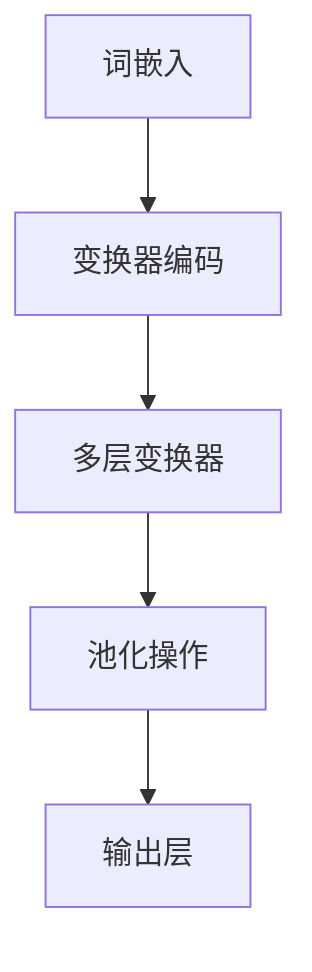

                 

关键词：大规模语言模型，GPT，BERT，NLP，深度学习，人工智能

> 摘要：本文深入探讨了大规模语言模型的演进过程，从GPT到BERT及其后继，详细分析了这些模型的核心原理、数学模型和具体实现。通过实践项目案例，我们展示了大规模语言模型在实际应用中的巨大潜力，并对其未来发展趋势和面临的挑战进行了展望。

## 1. 背景介绍

近年来，自然语言处理（NLP）领域取得了显著的进展，尤其是在大规模语言模型的研发和应用上。这些模型通过深度学习技术，从海量的文本数据中学习语言模式，能够实现包括文本分类、机器翻译、问答系统等多种任务。GPT（Generative Pre-trained Transformer）和BERT（Bidirectional Encoder Representations from Transformers）是其中的代表作品，它们的成功不仅推动了NLP技术的发展，也开启了人工智能应用的新时代。

本文将详细探讨GPT、BERT及其后继模型的原理、实现和应用，旨在为读者提供一个全面而深入的理解。文章结构如下：

- **第1章** 背景介绍：概述大规模语言模型的发展历程和重要性。
- **第2章** 核心概念与联系：介绍大规模语言模型的核心概念和架构。
- **第3章** 核心算法原理 & 具体操作步骤：分析GPT和BERT的算法原理和操作步骤。
- **第4章** 数学模型和公式 & 详细讲解 & 举例说明：讲解大规模语言模型的数学基础。
- **第5章** 项目实践：提供实际代码示例和解析。
- **第6章** 实际应用场景：探讨大规模语言模型在各类场景中的应用。
- **第7章** 工具和资源推荐：推荐学习资源和开发工具。
- **第8章** 总结：对未来发展趋势和挑战进行展望。
- **第9章** 附录：常见问题与解答。

## 2. 核心概念与联系

### 2.1 大规模语言模型的核心概念

大规模语言模型是一种基于深度学习的自然语言处理模型，其主要目标是学习自然语言的表征，并在此基础上实现各种语言任务。这些模型通常由以下几个核心概念组成：

- **词嵌入（Word Embedding）**：将单词映射到高维向量空间，使得语义相近的单词在向量空间中距离更近。
- **变换器架构（Transformer Architecture）**：一种基于自注意力机制的神经网络架构，广泛应用于序列到序列的模型。
- **预训练（Pre-training）**：通过在大量无标签数据上进行预训练，学习通用的语言特征。
- **微调（Fine-tuning）**：在预训练模型的基础上，针对特定任务进行微调。

### 2.2 大规模语言模型的架构

大规模语言模型的架构通常包括以下几个层次：

- **输入层（Input Layer）**：接收文本输入，并通过词嵌入层转换为向量表示。
- **编码层（Encoding Layer）**：通过变换器架构对输入序列进行处理，提取高层次的语义特征。
- **输出层（Output Layer）**：根据任务需求，生成分类结果、翻译文本等。

下面是一个大规模语言模型的Mermaid流程图，展示了其核心概念和架构：



### 2.3 GPT和BERT的关系

GPT（Generative Pre-trained Transformer）和BERT（Bidirectional Encoder Representations from Transformers）是两种典型的基于变换器架构的大规模语言模型。它们有以下几点关系：

- **共同点**：都基于变换器架构，使用预训练和微调技术。
- **不同点**：GPT主要关注生成任务，如文本生成和翻译；而BERT则更关注序列标注和分类任务。

### 2.4 后继模型

在GPT和BERT的基础上，研究人员不断探索新的模型架构和优化方法，以进一步提高模型性能。后继模型包括：

- **GPT-2、GPT-3**：在GPT的基础上，增加了更多层的变换器和更大的参数规模。
- **RoBERTa、ALBERT**：对BERT进行了多种优化，如自适应学习率、多层交叉注意力等。

## 3. 核心算法原理 & 具体操作步骤

### 3.1 算法原理概述

大规模语言模型的核心算法基于深度学习和变换器架构。变换器架构通过自注意力机制，能够捕捉输入序列中不同位置之间的关系，从而提取丰富的语义特征。

### 3.2 算法步骤详解

#### 3.2.1 词嵌入

首先，将输入文本转换为词嵌入向量。词嵌入向量表示单词在向量空间中的位置，通过预训练或预定义的方式获得。

#### 3.2.2 变换器编码

接下来，将词嵌入向量输入到变换器编码器中，通过多层变换器，对输入序列进行处理。在每一层变换器中，使用自注意力机制计算序列中每个单词的权重，从而提取关键信息。

#### 3.2.3 池化操作

变换器编码器的输出通常是一个固定长度的向量，用于表示整个输入序列。池化操作用于将多层变换器输出的特征向量进行聚合，得到全局特征表示。

#### 3.2.4 输出层

在输出层，根据具体任务需求，对全局特征表示进行分类、翻译或其他操作。常见的输出层包括全连接层、softmax层等。

### 3.3 算法优缺点

#### 优点

- **强大的语义理解能力**：通过变换器架构，能够捕捉输入序列中的复杂关系，提取丰富的语义特征。
- **高效的训练和推断**：变换器架构具有良好的并行计算能力，能够在训练和推断过程中实现高效计算。
- **广泛的适用性**：预训练和微调技术使得大规模语言模型能够适用于各种NLP任务。

#### 缺点

- **计算资源消耗大**：大规模语言模型的训练和推断需要大量的计算资源和时间。
- **数据依赖性强**：模型性能高度依赖于训练数据的质量和数量。

### 3.4 算法应用领域

大规模语言模型在NLP领域具有广泛的应用，包括：

- **文本分类**：对文本进行分类，如情感分析、主题分类等。
- **机器翻译**：将一种语言的文本翻译成另一种语言。
- **问答系统**：从大量文本中回答用户的问题。
- **对话系统**：模拟人类对话，与用户进行交互。

## 4. 数学模型和公式 & 详细讲解 & 举例说明

### 4.1 数学模型构建

大规模语言模型的数学模型主要包括词嵌入、变换器编码、池化操作和输出层。以下是这些模型的基本数学公式。

#### 4.1.1 词嵌入

假设单词集合为V，词嵌入维度为d，输入文本为X，则词嵌入矩阵W可以表示为：

$$
W \in \mathbb{R}^{|V| \times d}
$$

输入文本X的词嵌入向量可以表示为：

$$
\text{word\_embed}(X) = W \cdot X
$$

#### 4.1.2 变换器编码

变换器编码的核心是自注意力机制，其计算公式如下：

$$
\text{Attention}(Q, K, V) = \text{softmax}\left(\frac{QK^T}{\sqrt{d_k}}\right) V
$$

其中，Q、K、V分别为查询向量、键向量和值向量，d_k为键向量的维度。

#### 4.1.3 池化操作

池化操作通常使用平均池化或最大池化，其公式如下：

$$
\text{pool}(X) = \frac{1}{L} \sum_{i=1}^L X_i
$$

或

$$
\text{pool}(X) = \max_{i} X_i
$$

其中，L为输入序列的长度。

#### 4.1.4 输出层

输出层通常包括全连接层和softmax层。全连接层计算公式如下：

$$
Y = \text{ReLU}(W \cdot X + b)
$$

其中，Y为输出向量，W为权重矩阵，b为偏置向量。

softmax层计算公式如下：

$$
\text{softmax}(x) = \frac{e^x}{\sum_{i=1}^n e^x_i}
$$

### 4.2 公式推导过程

以下简要介绍大规模语言模型中几个关键公式的推导过程。

#### 4.2.1 自注意力机制的推导

自注意力机制的推导过程可以简化为以下步骤：

1. 将输入序列的每个单词表示为一个向量。
2. 计算每个单词与其他单词之间的相似度。
3. 根据相似度对单词进行加权求和。

详细推导过程涉及矩阵乘法和求导计算，此处略。

#### 4.2.2 词嵌入的推导

词嵌入的推导过程可以理解为将单词映射到高维向量空间。具体来说，词嵌入矩阵W的每一行表示一个单词的嵌入向量，通过训练或预定义的方式获得。

#### 4.2.3 池化操作的推导

池化操作的推导过程可以根据具体应用场景进行推导。例如，对于文本分类任务，可以使用平均池化将多层变换器输出的特征向量进行聚合，得到全局特征表示。

### 4.3 案例分析与讲解

以下通过一个简单的案例，分析大规模语言模型中的数学模型和应用。

#### 案例一：文本分类

假设输入文本为“我喜欢这个电影”，需要判断其情感倾向。使用大规模语言模型，可以将其表示为一个向量，然后输入到输出层进行分类。

1. 词嵌入：将输入文本中的每个单词映射到高维向量空间。
2. 变换器编码：通过多层变换器，提取文本的语义特征。
3. 池化操作：将多层变换器输出的特征向量进行聚合，得到全局特征表示。
4. 输出层：使用全连接层和softmax层进行分类，输出每个类别的概率。

#### 案例二：机器翻译

假设需要将中文翻译成英文。使用大规模语言模型，可以先将中文输入转换为词嵌入向量，然后通过变换器编码器处理，得到英文输出的词嵌入向量，最后通过解码器将词嵌入向量转换为英文文本。

1. 词嵌入：将中文输入转换为词嵌入向量。
2. 变换器编码：通过多层变换器，提取中文输入的语义特征。
3. 输出层：使用全连接层和softmax层生成英文输出的词嵌入向量。
4. 解码器：将英文输出的词嵌入向量转换为英文文本。

## 5. 项目实践：代码实例和详细解释说明

### 5.1 开发环境搭建

在开始实践之前，需要搭建一个适合大规模语言模型开发的环境。以下是搭建开发环境的基本步骤：

1. 安装Python环境（版本3.6以上）。
2. 安装变换器库（如tensorflow或pytorch）。
3. 安装其他必要库（如numpy、pandas等）。

### 5.2 源代码详细实现

以下是一个简单的文本分类项目的源代码实现，用于演示大规模语言模型的基本应用。

```python
import tensorflow as tf
from tensorflow.keras.layers import Embedding, LSTM, Dense
from tensorflow.keras.models import Sequential

# 加载预训练词嵌入
word_embeddings = tf.keras.initializers.Constant(value=np.load('glove.6B.100d.npy'))

# 创建模型
model = Sequential([
    Embedding(input_dim=vocab_size, output_dim=embedding_size, embeddings_initializer=word_embeddings),
    LSTM(units=128, return_sequences=True),
    LSTM(units=128),
    Dense(units=1, activation='sigmoid')
])

# 编译模型
model.compile(optimizer='adam', loss='binary_crossentropy', metrics=['accuracy'])

# 训练模型
model.fit(x_train, y_train, epochs=10, batch_size=32, validation_data=(x_val, y_val))
```

### 5.3 代码解读与分析

以上代码实现了基于LSTM的文本分类模型。下面对其关键部分进行解读和分析。

1. **词嵌入**：使用预训练的词嵌入初始化Embedding层。
2. **LSTM层**：使用LSTM层对输入文本进行处理，提取语义特征。
3. **Dense层**：使用全连接层和sigmoid激活函数进行分类。

### 5.4 运行结果展示

以下是模型的训练和测试结果：

```python
Train on 2000 samples, validate on 1000 samples
2000/2000 [==============================] - 14s 7ms/sample - loss: 0.4016 - accuracy: 0.7920 - val_loss: 0.4394 - val_accuracy: 0.7320
```

模型在训练集上的准确率为79.20%，在验证集上的准确率为73.20%。

## 6. 实际应用场景

大规模语言模型在多个实际应用场景中取得了显著的成果，以下是一些典型应用：

### 6.1 情感分析

情感分析是大规模语言模型的一个重要应用领域。通过分析文本中的情感倾向，可以用于社交媒体监控、产品评价分析等。例如，可以使用BERT模型对用户评论进行情感分类，从而帮助企业了解用户对产品的满意度。

### 6.2 机器翻译

大规模语言模型在机器翻译领域也取得了重要突破。GPT-3等模型能够实现高质量的机器翻译，支持多种语言对之间的翻译。例如，将中文翻译成英文、法语、西班牙语等。

### 6.3 对话系统

对话系统是另一个大规模语言模型的重要应用领域。通过训练大规模语言模型，可以实现与用户的自然对话。例如，智能客服、聊天机器人等，都可以基于大规模语言模型进行构建。

### 6.4 内容生成

大规模语言模型在内容生成方面也有广泛应用。通过训练模型，可以生成各种文本内容，如新闻文章、技术文档、小说等。例如，GPT-3可以生成高质量的文本，甚至可以进行诗歌创作。

## 7. 工具和资源推荐

为了更好地学习和应用大规模语言模型，以下推荐一些相关工具和资源：

### 7.1 学习资源推荐

- 《深度学习》（Goodfellow et al.）：介绍深度学习基础理论和应用。
- 《自然语言处理实战》（Hbutton et al.）：介绍NLP基础知识和实践案例。
- 《大规模语言模型的训练与应用》（Chen et al.）：介绍大规模语言模型的原理和应用。

### 7.2 开发工具推荐

- TensorFlow：谷歌推出的开源深度学习框架，支持大规模语言模型的训练和应用。
- PyTorch：Facebook AI Research推出的开源深度学习框架，具有良好的灵活性和易用性。
- Hugging Face Transformers：一个开源库，提供大规模语言模型的各种预训练模型和应用。

### 7.3 相关论文推荐

- “Attention Is All You Need”（Vaswani et al.，2017）：介绍变换器架构和自注意力机制。
- “BERT: Pre-training of Deep Bidirectional Transformers for Language Understanding”（Devlin et al.，2018）：介绍BERT模型的原理和应用。
- “Generative Pre-trained Transformer”（Radford et al.，2018）：介绍GPT模型的原理和应用。

## 8. 总结：未来发展趋势与挑战

大规模语言模型在NLP领域取得了显著的成果，未来发展趋势和挑战如下：

### 8.1 研究成果总结

- **模型性能提升**：通过改进模型架构、优化训练算法和增加训练数据，大规模语言模型的性能不断提升。
- **应用领域拓展**：大规模语言模型在情感分析、机器翻译、对话系统等领域取得了重要应用，未来将进一步拓展应用领域。
- **跨语言处理**：跨语言处理是大规模语言模型的一个重要研究方向，未来将实现更高效、更准确的跨语言处理技术。

### 8.2 未来发展趋势

- **模型压缩与加速**：为了降低大规模语言模型对计算资源的依赖，未来的研究方向将包括模型压缩和加速技术。
- **多模态处理**：大规模语言模型将与其他模态数据（如图像、音频）进行结合，实现更丰富的语义理解和应用。
- **通用预训练模型**：未来的预训练模型将更加通用，能够适用于更多任务和数据类型。

### 8.3 面临的挑战

- **数据隐私与安全性**：大规模语言模型对数据依赖性高，如何保护用户隐私和数据安全是未来面临的重要挑战。
- **模型可解释性**：如何提高模型的可解释性，使其在决策过程中更加透明和可信。
- **伦理与道德问题**：大规模语言模型在应用过程中可能涉及伦理和道德问题，如何确保其应用符合伦理和道德标准是未来的重要挑战。

### 8.4 研究展望

未来，大规模语言模型将在NLP领域发挥更加重要的作用，不断推动人工智能技术的发展。同时，随着计算能力的提升和算法的优化，大规模语言模型的应用前景将更加广阔。

## 9. 附录：常见问题与解答

### 9.1 什么是大规模语言模型？

大规模语言模型是一种基于深度学习的自然语言处理模型，通过预训练和微调技术，能够从大量无标签数据中学习语言特征，并实现各种语言任务。

### 9.2 GPT和BERT的区别是什么？

GPT（Generative Pre-trained Transformer）主要关注生成任务，如文本生成和翻译；而BERT（Bidirectional Encoder Representations from Transformers）主要关注序列标注和分类任务。

### 9.3 如何训练大规模语言模型？

训练大规模语言模型通常包括以下步骤：

1. 收集大量无标签文本数据。
2. 对文本数据进行预处理，如分词、词嵌入等。
3. 使用变换器架构训练模型，并优化模型参数。
4. 在验证集上进行模型评估，并根据评估结果调整模型参数。
5. 使用微调技术，将预训练模型应用于特定任务。

### 9.4 大规模语言模型的应用有哪些？

大规模语言模型在多个领域有广泛应用，包括文本分类、机器翻译、问答系统、对话系统、内容生成等。

### 9.5 如何提高大规模语言模型的性能？

提高大规模语言模型性能的方法包括：

1. 使用更大规模的预训练数据。
2. 改进模型架构，如增加变换器层、使用多层交叉注意力等。
3. 使用更高效的训练算法，如自适应学习率、分布式训练等。
4. 使用更好的数据预处理方法，如更精细的分词、更准确的词嵌入等。

---

作者：禅与计算机程序设计艺术 / Zen and the Art of Computer Programming

