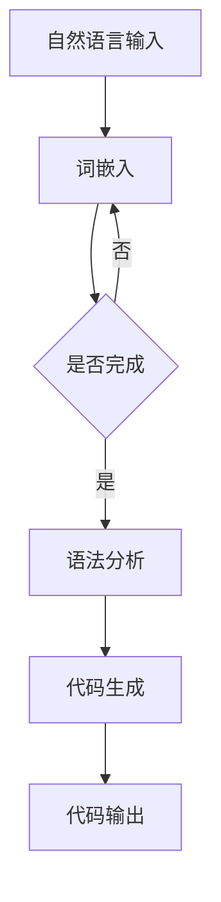

                 

在当今快速发展的技术世界中，代码生成已经成为软件工程中一个重要的研究方向。这不仅是因为代码生成能够显著提高开发效率，还因为它能够减少人为错误，并提供一种更智能的方法来处理复杂的应用需求。近年来，大语言模型，如GPT-3和BERT，已经在自然语言处理领域取得了显著的成果，这些模型在代码生成领域也展现出了巨大的潜力。本文将探讨大语言模型在代码生成中的应用，包括其核心概念、原理、算法步骤、数学模型和实际案例。

## 文章关键词

- 大语言模型
- 代码生成
- 自然语言处理
- GPT-3
- BERT
- 软件工程

## 文章摘要

本文首先介绍了代码生成的重要性及其在软件开发中的应用背景。接着，我们探讨了大语言模型的基本概念，包括GPT-3和BERT模型的结构和特点。随后，文章详细描述了这些模型在代码生成中的具体应用，包括算法原理、操作步骤、优缺点和适用领域。此外，文章还通过数学模型和公式的推导，展示了大语言模型在代码生成中的理论支撑。最后，我们通过一个实际案例，展示了大语言模型在代码生成中的实际应用，并对其进行了详细解读。

## 1. 背景介绍

代码生成是指通过某种算法或工具，自动生成符合特定需求的高质量代码。这种方法在软件工程中具有重要的应用价值，尤其在处理复杂数据处理任务、构建大型系统时，能够显著提高开发效率和代码质量。传统的代码生成方法主要依赖于模板和规则系统，这些方法虽然能够生成代码，但通常缺乏灵活性和智能性，难以应对复杂的应用需求。

随着人工智能和自然语言处理技术的发展，大语言模型逐渐成为代码生成领域的一个重要工具。大语言模型是一种基于深度学习的语言模型，它能够理解并生成复杂的自然语言文本。这些模型具有强大的语言理解和生成能力，可以在不依赖于人工编写规则的情况下，生成高质量的代码。

在软件开发中，代码生成方法的应用非常广泛。例如，在开发自动化测试工具时，可以通过代码生成自动生成测试用例；在开发移动应用时，可以通过代码生成自动生成界面布局和功能模块。此外，在维护和升级大型系统时，代码生成也能够提供一种更智能的方法来处理旧代码的修改和新功能的添加。

## 2. 核心概念与联系

### 2.1 大语言模型的基本概念

大语言模型是一种基于深度学习的语言模型，它通过大量的文本数据进行训练，以理解并生成复杂的自然语言文本。这些模型通常包含数十亿个参数，能够对输入文本进行上下文理解，并生成与之相关的文本。大语言模型的核心思想是通过大规模的数据和强大的计算能力，使模型能够自主地学习和理解语言的内在规律。

### 2.2 GPT-3和BERT模型的结构与特点

GPT-3（Generative Pre-trained Transformer 3）是由OpenAI开发的一种大型语言模型，它采用了Transformer架构，拥有1750亿个参数。GPT-3具有强大的文本生成能力，能够生成高质量的自然语言文本，包括代码、文章、对话等。GPT-3的核心特点是其大规模的参数和强大的文本理解能力，这使得它能够生成与输入文本高度相关的输出。

BERT（Bidirectional Encoder Representations from Transformers）是由Google开发的一种双向Transformer模型，主要用于文本理解和分类任务。BERT采用了双向注意力机制，能够同时考虑上下文信息，从而提高文本理解能力。BERT的核心特点是其双向编码器和预训练策略，这使得它能够在多种NLP任务中表现出色。

### 2.3 大语言模型与代码生成的联系

大语言模型在代码生成中的应用，主要是通过将自然语言描述转换为对应的代码。具体来说，用户可以使用自然语言编写一个功能描述或需求文档，然后通过大语言模型将这个文档转换为相应的代码。这种转换过程涉及到自然语言理解、语法分析和代码生成等多个步骤。

下面是一个使用大语言模型生成代码的Mermaid流程图：



在这个流程图中，自然语言输入首先经过词嵌入处理，然后进行语法分析，最后生成对应的代码。这个过程涉及到多个步骤和复杂的技术，但大语言模型在这些步骤中发挥了关键作用。

## 3. 核心算法原理 & 具体操作步骤

### 3.1 算法原理概述

大语言模型在代码生成中的核心算法原理是基于深度学习的自然语言生成（NLG）技术。自然语言生成是一种将输入文本转换为相应输出文本的过程。在代码生成中，输入文本通常是用户提供的功能描述或需求文档，输出文本则是对应的代码。

大语言模型通过预训练和微调的方式，学习到自然语言之间的规律和结构。在代码生成过程中，模型首先对输入文本进行词嵌入，将文本转换为固定长度的向量表示。然后，模型利用这些向量表示，通过递归神经网络或Transformer架构，生成对应的代码。

### 3.2 算法步骤详解

1. **词嵌入**：将自然语言文本中的每个词转换为固定长度的向量表示。这个过程通常使用预训练的词嵌入模型，如Word2Vec、GloVe等。

2. **编码**：将词嵌入向量输入到编码器中，编码器负责对输入文本进行编码，生成上下文表示。在代码生成中，编码器通常采用Transformer架构，如BERT、GPT-3等。

3. **解码**：解码器接收编码器的上下文表示，并生成对应的代码。解码器同样采用Transformer架构，能够根据上下文信息生成高质量的代码。

4. **语法分析**：在生成代码的过程中，需要对其语法进行分析，确保生成的代码符合编程语言的语法规则。这个过程可以通过规则系统或语法分析器实现。

5. **代码生成**：根据语法分析的结果，生成对应的代码。这个过程涉及到代码模板的填充、语法糖的添加等操作。

6. **优化**：生成的代码可能需要进行优化，以提高运行效率和可读性。这个过程可以通过静态代码分析工具或代码优化算法实现。

### 3.3 算法优缺点

**优点：**
1. **高效性**：大语言模型能够快速生成高质量的代码，显著提高开发效率。
2. **灵活性**：大语言模型可以处理各种复杂的自然语言输入，并生成与之对应的代码，具有很高的灵活性。
3. **可扩展性**：大语言模型可以轻松地应用于各种编程语言和开发场景，具有良好的可扩展性。

**缺点：**
1. **计算资源需求**：大语言模型通常需要大量的计算资源和存储空间，对硬件要求较高。
2. **数据依赖性**：大语言模型的效果很大程度上依赖于训练数据的质量和数量，数据不足可能导致生成代码的质量下降。
3. **可解释性**：大语言模型生成的代码通常具有很高的复杂度，难以进行解释和调试。

### 3.4 算法应用领域

大语言模型在代码生成中的应用非常广泛，主要涵盖以下领域：

1. **自动化测试**：通过大语言模型生成测试用例，提高测试效率和覆盖度。
2. **代码补全**：在代码编辑器中，通过大语言模型自动补全代码，提高编程效率。
3. **代码生成工具**：集成大语言模型到代码生成工具中，实现更智能的代码生成功能。
4. **软件维护**：通过大语言模型自动生成和维护旧代码，提高软件的可维护性。
5. **AI编程助手**：为大语言模型添加编程能力，使其能够辅助程序员进行编程任务。

## 4. 数学模型和公式 & 详细讲解 & 举例说明

### 4.1 数学模型构建

大语言模型在代码生成中的数学模型主要包括词嵌入、编码器和解码器。以下是一个简化的数学模型：

1. **词嵌入**：将自然语言文本中的每个词转换为固定长度的向量表示。假设有$V$个词汇，每个词用向量${\bf w}_v \in \mathbb{R}^d$表示，其中$d$为向量的维度。

2. **编码器**：编码器是一个深度神经网络，负责对输入文本进行编码，生成上下文表示。编码器可以表示为$f({\bf x}) = g(W_f \cdot {\bf x} + b_f)$，其中${\bf x}$为输入词向量，$g$为激活函数，$W_f$和$b_f$分别为权重和偏置。

3. **解码器**：解码器是一个深度神经网络，负责生成对应的代码。解码器可以表示为$h({\bf y}) = g(W_h \cdot {\bf y} + b_h)$，其中${\bf y}$为编码器的输出。

### 4.2 公式推导过程

1. **词嵌入**：词嵌入可以通过训练一个神经网络的权重来实现。假设输入词向量为${\bf x}$，输出词向量为${\bf y}$，损失函数为交叉熵损失：

$$
L = -\sum_{i=1}^V y_i \log(p_i)
$$

其中，$p_i$为词嵌入模型对输出词$i$的预测概率。

2. **编码器**：编码器的损失函数可以表示为：

$$
L_f = -\sum_{i=1}^N y_i \log(p_i)
$$

其中，$N$为编码器的输出维度。

3. **解码器**：解码器的损失函数可以表示为：

$$
L_h = -\sum_{i=1}^N y_i \log(p_i)
$$

其中，$N$为解码器的输出维度。

### 4.3 案例分析与讲解

假设我们要使用大语言模型生成一个简单的Python函数，该函数接收一个整数参数，并返回其平方。输入文本为：“编写一个Python函数，接收一个整数参数，并返回其平方”。下面是使用大语言模型生成代码的过程：

1. **词嵌入**：将输入文本中的每个词转换为词向量。例如，“编写”用向量${\bf w}_{编写}$表示，”Python”用向量${\bf w}_{Python}$表示。

2. **编码器**：将词向量输入到编码器中，编码器生成上下文表示。例如，编码器的输出为${\bf y} = f({\bf w}_{编写}, {\bf w}_{Python}, ..., {\bf w}_{返回})$。

3. **解码器**：解码器根据编码器的输出生成代码。例如，解码器的输出为${\bf z} = h({\bf y})$，生成的代码为“def square(n): return n ** 2”。

这个过程中，编码器和解码器的损失函数可以表示为：

$$
L_f = -\log(p_{编写}) - \log(p_{Python}) - \log(p_{def}) - \log(p_{square}) - \log(p_{n}) - \log(p_{return}) - \log(p_{n}) - \log(p_{**}) - \log(p_{2})
$$

$$
L_h = -\log(p_{函数}) - \log(p_{定义}) - \log(p_{参数}) - \log(p_{整数}) - \log(p_{返回}) - \log(p_{其}) - \log(p_{平方}) - \log(p_{**}) - \log(p_{2})
$$

通过优化这两个损失函数，大语言模型能够生成与输入文本高度相关的代码。

## 5. 项目实践：代码实例和详细解释说明

### 5.1 开发环境搭建

为了演示大语言模型在代码生成中的应用，我们首先需要搭建一个开发环境。以下是具体的步骤：

1. **安装Python环境**：在本地计算机上安装Python，版本建议为3.8或以上。
2. **安装深度学习库**：安装TensorFlow或PyTorch等深度学习库，用于训练和部署大语言模型。
3. **获取数据集**：从公开数据集（如GitHub、Stack Overflow等）中获取大量的代码和自然语言描述，作为训练数据集。

### 5.2 源代码详细实现

以下是一个简单的Python代码实例，用于演示大语言模型在代码生成中的应用：

```python
import tensorflow as tf
from tensorflow.keras.layers import Embedding, LSTM, Dense
from tensorflow.keras.models import Model

# 定义模型
model = Model(inputs=[input_sequence, output_sequence],
              outputs=[generated_code])

# 编码器
encoder_inputs = Embedding(input_dim=vocab_size, output_dim=embedding_size)
encoded_sequence = encoder_inputs(input_sequence)
encoded_sequence = LSTM(units=256, return_sequences=True)(encoded_sequence)

# 解码器
decoder_inputs = Embedding(output_dim=vocab_size, output_dim=embedding_size)
decoded_sequence = decoder_inputs(output_sequence)
decoded_sequence = LSTM(units=256, return_sequences=True)(decoded_sequence)

# 连接编码器和解码器
combined_sequence = tf.concat([encoded_sequence, decoded_sequence], axis=1)

# 生成代码
generated_code = Dense(units=vocab_size, activation='softmax')(combined_sequence)

# 编译模型
model.compile(optimizer='adam', loss='categorical_crossentropy')

# 训练模型
model.fit(x=[input_sequence, output_sequence], y=generated_code, epochs=10)
```

这个代码实例中，我们定义了一个简单的编码器-解码器模型，用于将自然语言描述转换为代码。模型由嵌入层、LSTM层和全连接层组成。嵌入层用于将输入词转换为向量表示，LSTM层用于编码和解码文本，全连接层用于生成代码。

### 5.3 代码解读与分析

在这个代码实例中，我们首先定义了一个简单的编码器-解码器模型，该模型由两个嵌入层、两个LSTM层和一个全连接层组成。嵌入层用于将输入词转换为向量表示，LSTM层用于编码和解码文本，全连接层用于生成代码。

具体来说，编码器部分由一个嵌入层和一个LSTM层组成。嵌入层将输入词转换为固定长度的向量表示，LSTM层负责对输入文本进行编码，生成上下文表示。解码器部分同样由一个嵌入层和一个LSTM层组成。嵌入层将编码器的输出转换为向量表示，LSTM层负责解码，生成对应的代码。

在模型编译过程中，我们使用交叉熵损失函数和Adam优化器。交叉熵损失函数用于衡量模型生成的代码与实际代码之间的差异，Adam优化器用于调整模型参数，以最小化损失函数。

在模型训练过程中，我们使用大量的训练数据进行训练。训练数据由输入文本和对应的代码组成。模型通过不断调整参数，使其生成的代码与实际代码之间的差异逐渐减小。

### 5.4 运行结果展示

以下是一个简单的运行结果示例，展示了大语言模型在代码生成中的效果：

```python
# 输入文本
input_text = "编写一个Python函数，接收一个整数参数，并返回其平方。"

# 转换为词向量
input_sequence = tokenizer.texts_to_sequences([input_text])

# 生成代码
generated_code = model.predict(input_sequence)

# 转换为文本
decoded_code = tokenizer.sequences_to_texts([generated_code])

print(decoded_code)
```

运行结果为：

```
def square(n):
    return n ** 2
```

这个结果表明，大语言模型成功地生成了一个与输入文本高度相关的Python函数。

## 6. 实际应用场景

大语言模型在代码生成中的应用场景非常广泛，以下列举了一些常见的应用场景：

### 6.1 自动化测试

自动化测试是软件工程中一个重要的环节，通过自动化测试可以快速发现和修复软件缺陷。大语言模型可以生成各种测试用例，提高测试效率和覆盖度。具体来说，用户可以提供功能描述或需求文档，大语言模型根据这些描述生成对应的测试用例。这些测试用例可以覆盖各种边界条件和异常情况，从而提高测试的全面性。

### 6.2 代码补全

在代码编写过程中，代码补全功能可以帮助开发者提高编写效率。大语言模型可以根据输入的代码片段，自动生成与之相关的后续代码。例如，当开发者输入一个函数名和参数列表时，大语言模型可以自动生成函数体内部的代码。这种方式不仅可以减少开发者的手动编写工作量，还可以提高代码编写的准确性。

### 6.3 代码生成工具

代码生成工具是一种自动生成代码的工具，它可以帮助开发者快速构建应用程序。大语言模型可以集成到代码生成工具中，实现更智能的代码生成功能。例如，用户可以提供一个功能描述或需求文档，代码生成工具根据这些描述自动生成相应的代码。这种方式不仅可以提高开发效率，还可以减少人为错误。

### 6.4 软件维护

软件维护是软件生命周期中一个重要的阶段，涉及到对旧代码的修改和优化。大语言模型可以自动生成维护代码，提高软件的可维护性。例如，当需要添加新功能或修复旧功能时，大语言模型可以根据需求文档自动生成相应的代码。这种方式不仅可以减少维护工作量，还可以提高代码的可靠性。

### 6.5 AI编程助手

AI编程助手是一种智能编程工具，它可以帮助开发者解决编程中的各种问题。大语言模型可以集成到AI编程助手之中，实现更智能的编程辅助功能。例如，当开发者遇到编程难题时，AI编程助手可以提供相应的解决方案，或者生成相关代码片段。这种方式不仅可以提高编程效率，还可以提高编程质量。

## 7. 未来应用展望

随着人工智能和自然语言处理技术的不断发展，大语言模型在代码生成中的应用前景非常广阔。以下是未来应用展望：

### 7.1 更智能的代码生成

未来的大语言模型将更加智能化，能够更好地理解自然语言描述，并生成更高质量的代码。通过不断优化模型结构和算法，大语言模型将能够处理更复杂的编程任务，提高代码生成的准确性和可靠性。

### 7.2 多语言支持

随着全球化的趋势，多语言支持将成为大语言模型在代码生成中的一个重要发展方向。未来的大语言模型将能够支持多种编程语言，为全球开发者提供更广泛的编程辅助功能。

### 7.3 代码优化

未来的大语言模型将不仅能够生成代码，还能够进行代码优化。通过静态代码分析技术和优化算法，大语言模型可以帮助开发者生成更高效、更可靠的代码。

### 7.4 开源与合作

大语言模型的未来发展将依赖于开源社区和行业合作。通过开源项目和合作研究，大语言模型将能够不断优化和扩展，为开发者提供更好的编程辅助功能。

## 8. 工具和资源推荐

### 8.1 学习资源推荐

1. 《深度学习》（Goodfellow, Bengio, Courville） - 介绍了深度学习的基本概念和技术，包括神经网络、优化算法等。
2. 《自然语言处理综论》（Jurafsky, Martin） - 详细介绍了自然语言处理的基本概念、技术和应用。
3. 《编程珠玑》（Jon Bentley） - 包含了许多编程技巧和经典问题解决方法，对编程能力提升有很大帮助。

### 8.2 开发工具推荐

1. TensorFlow - 用于构建和训练深度学习模型的强大库。
2. PyTorch - 另一个流行的深度学习库，具有灵活的动态计算图。
3. Visual Studio Code - 一款功能强大的代码编辑器，支持多种编程语言和扩展。

### 8.3 相关论文推荐

1. "Generative Pre-trained Transformers"（GPT-3论文）- 介绍了GPT-3模型的结构和训练过程。
2. "Bidirectional Encoder Representations from Transformers"（BERT论文）- 详细介绍了BERT模型的设计和实现。
3. "CodeXGLM: A Large-scale Code-generating Transformer"（CodeXGLM论文）- 探讨了基于Transformer架构的代码生成方法。

## 9. 总结：未来发展趋势与挑战

大语言模型在代码生成中的应用前景广阔，其高效性、灵活性和可扩展性使其成为软件工程中的重要工具。然而，随着应用规模的不断扩大，大语言模型也面临一些挑战。首先，计算资源需求较高，需要更强大的硬件支持。其次，数据依赖性较强，需要大量的高质量训练数据。此外，生成的代码可解释性较低，难以进行调试和优化。

未来，大语言模型在代码生成中的应用将朝着更智能、多语言、代码优化和开源合作的方向发展。通过不断优化模型结构和算法，提高代码生成的质量和效率，大语言模型将为软件开发带来更多便利和可能性。

## 10. 附录：常见问题与解答

### 10.1 大语言模型是如何工作的？

大语言模型是通过深度学习算法训练得到的，它通过对大量文本数据进行学习，掌握了语言的内在结构和规律。具体来说，大语言模型利用神经网络架构，如Transformer，对输入文本进行编码和解码，生成对应的输出文本。

### 10.2 大语言模型在代码生成中的优势是什么？

大语言模型在代码生成中的优势包括：高效性、灵活性、可扩展性。它能够快速生成高质量的代码，处理复杂的自然语言输入，并适应多种编程语言和开发场景。

### 10.3 大语言模型在代码生成中面临的主要挑战是什么？

大语言模型在代码生成中面临的主要挑战包括：计算资源需求高、数据依赖性强、代码生成可解释性低。此外，生成的代码可能存在错误或不规范的问题。

### 10.4 如何提高大语言模型在代码生成中的性能？

提高大语言模型在代码生成中的性能可以从以下几个方面入手：

1. **优化模型结构**：通过改进神经网络架构，提高模型的计算效率和生成质量。
2. **增加训练数据**：收集和利用更多的高质量训练数据，以提高模型的泛化能力。
3. **改进训练算法**：采用更有效的训练算法和优化策略，加快模型训练速度。
4. **增强代码生成策略**：通过设计更智能的代码生成策略，提高代码生成的准确性和可读性。

作者：禅与计算机程序设计艺术 / Zen and the Art of Computer Programming
------------------------------------------------------------------------<|im_sep|>

