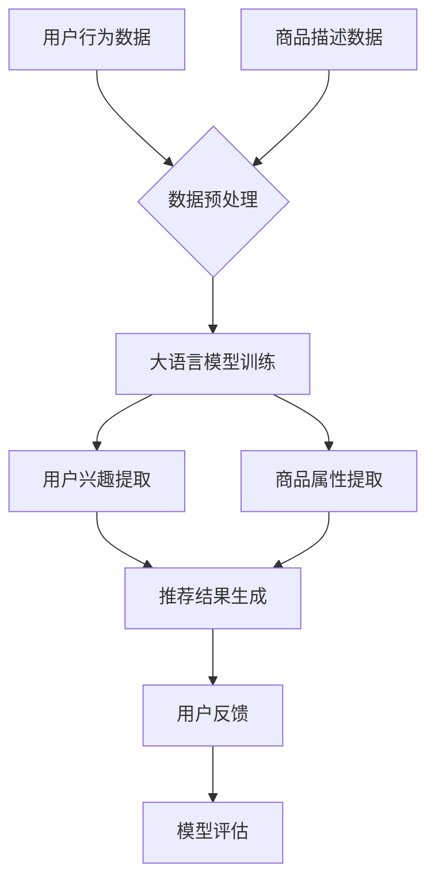

                 

关键词：大语言模型，推荐系统，多任务学习，深度学习，自然语言处理，个性化推荐

>摘要：本文将探讨大语言模型在推荐系统中的多任务学习应用。通过对多任务学习的介绍和具体算法原理的阐述，我们将展示如何利用大语言模型提高推荐系统的准确性和效果，并在实际项目中验证其优势。同时，文章还将展望大语言模型在未来推荐系统领域的应用前景。

## 1. 背景介绍

推荐系统作为信息过滤和搜索的重要工具，广泛应用于电子商务、社交媒体、在线新闻等众多领域。随着用户生成内容和交互数据的爆炸性增长，推荐系统面临着如何提供更精准、更个性化的推荐结果的巨大挑战。传统的推荐算法主要基于协同过滤、基于内容的方法，它们在一定程度上能够满足用户的个性化需求，但随着推荐场景的复杂化和用户行为的多样化，这些算法的局限性也逐渐显现。

大语言模型，作为一种强大的深度学习模型，近年来在自然语言处理领域取得了显著进展。大语言模型能够理解并生成自然语言，其具备的强大表示能力使其在许多任务中表现出色。多任务学习（Multi-Task Learning，MTL）作为一种利用多个相关任务的共同特征进行学习的策略，可以有效提高模型的泛化能力和计算效率。因此，将大语言模型应用于推荐系统中的多任务学习，有望解决传统推荐算法的局限性，提升推荐系统的性能。

## 2. 核心概念与联系

### 2.1 多任务学习原理

多任务学习是一种训练模型同时解决多个任务的方法。通过共享特征表示，多任务学习能够利用不同任务之间的关联性，提高模型的泛化能力和效率。多任务学习的基本原理可以概括为以下几点：

1. **共享底层特征表示**：不同任务在底层特征上存在一定程度的重叠，通过共享这些底层特征，可以减少模型的参数量，提高学习效率。
2. **任务间迁移学习**：通过将一个任务的模型知识迁移到另一个任务，可以加速新任务的模型训练过程，提高模型在新任务上的性能。
3. **多任务协同优化**：在训练过程中，多任务学习通过协同优化各任务的目标函数，使得每个任务都能从其他任务中受益，提高整体模型性能。

### 2.2 大语言模型与推荐系统的结合

大语言模型在推荐系统中的多任务学习应用，主要依赖于其强大的自然语言处理能力和多任务学习的优势。具体来说，大语言模型与推荐系统的结合可以从以下几个方面展开：

1. **用户行为分析**：通过分析用户的浏览、搜索、点击等行为，大语言模型可以提取用户的兴趣偏好，为推荐系统提供更精准的用户画像。
2. **商品描述理解**：大语言模型能够理解商品描述中的语义信息，帮助推荐系统更好地捕捉商品的属性和特征，从而提高推荐的相关性。
3. **多任务协同优化**：在多任务学习中，大语言模型可以同时处理推荐系统的多个任务，如商品推荐、广告投放、用户反馈等，通过任务间的协同优化，提升推荐系统的整体性能。

### 2.3 Mermaid 流程图

以下是一个简化的多任务学习在推荐系统中的应用的Mermaid流程图：



## 3. 核心算法原理 & 具体操作步骤

### 3.1 算法原理概述

多任务学习在推荐系统中的应用，主要依赖于大语言模型的两大特性：多任务共享特征表示和任务间迁移学习。具体来说，算法原理如下：

1. **共享特征表示**：大语言模型通过训练大规模的文本数据集，可以提取出丰富的语义特征。这些特征不仅适用于自然语言处理任务，如文本分类、情感分析等，还可以应用于推荐系统的用户画像和商品属性提取。
2. **任务间迁移学习**：在多任务学习中，不同任务的模型参数通过共享部分神经网络层进行更新。这种共享机制使得一个任务的学习成果可以迁移到其他任务，从而加速模型的训练过程，提高模型在新任务上的性能。
3. **多任务协同优化**：在多任务学习中，模型的训练目标不仅包括各个任务的目标函数，还包括任务间的协同优化目标。通过协同优化，模型可以更好地捕捉不同任务之间的关联性，提高整体推荐系统的性能。

### 3.2 算法步骤详解

#### 3.2.1 数据预处理

数据预处理是多任务学习的基础，主要包括以下步骤：

1. **文本数据预处理**：对用户行为数据和商品描述数据进行分词、去停用词、词向量化等处理，将文本数据转化为计算机可处理的数字形式。
2. **特征工程**：根据不同任务的需求，提取用户行为和商品描述中的关键特征，如用户兴趣标签、商品类别、关键词等。

#### 3.2.2 大语言模型训练

1. **模型选择**：选择合适的大语言模型，如BERT、GPT等，根据任务需求和数据规模进行调整。
2. **训练过程**：使用预处理的用户行为数据和商品描述数据对大语言模型进行训练，通过迭代优化模型参数，使其能够提取出丰富的语义特征。
3. **模型评估**：在训练过程中，定期评估模型在不同任务上的性能，如用户兴趣提取准确率、商品属性提取准确率等。

#### 3.2.3 用户兴趣提取和商品属性提取

1. **用户兴趣提取**：利用训练好的大语言模型，对用户行为数据进行语义分析，提取用户兴趣标签。
2. **商品属性提取**：对商品描述数据进行语义分析，提取商品的关键属性和特征。

#### 3.2.4 推荐结果生成

1. **推荐算法**：根据用户兴趣标签和商品属性，使用协同过滤、基于内容的算法等传统推荐算法生成推荐结果。
2. **融合策略**：将大语言模型提取的用户兴趣和商品属性与传统的推荐算法结果进行融合，生成最终推荐结果。

#### 3.2.5 用户反馈和模型评估

1. **用户反馈**：收集用户对推荐结果的反馈，如点击、购买、评分等。
2. **模型评估**：根据用户反馈评估推荐系统的性能，如准确率、召回率、覆盖率等。

### 3.3 算法优缺点

#### 优点：

1. **提高推荐精度**：通过多任务学习和大语言模型的强大表示能力，可以有效提高推荐系统的准确性。
2. **减少数据预处理成本**：大语言模型能够直接处理文本数据，减少了对传统特征工程的需求，降低了数据预处理成本。
3. **任务间迁移学习**：多任务学习中的任务间迁移学习可以加速模型训练过程，提高模型在新任务上的性能。

#### 缺点：

1. **计算资源消耗**：大语言模型的训练和推理过程需要大量的计算资源，对硬件要求较高。
2. **数据隐私问题**：大语言模型在处理用户数据时，可能涉及用户隐私信息的泄露，需要加强数据安全和隐私保护。

### 3.4 算法应用领域

多任务学习在推荐系统中的应用非常广泛，以下是一些具体的应用领域：

1. **电子商务推荐**：通过分析用户行为和商品属性，提供个性化的商品推荐。
2. **社交媒体推荐**：根据用户的浏览、点赞、评论等行为，推荐感兴趣的内容和用户。
3. **在线新闻推荐**：根据用户的阅读偏好，推荐相关的新闻内容。

## 4. 数学模型和公式 & 详细讲解 & 举例说明

### 4.1 数学模型构建

多任务学习在推荐系统中的应用，可以看作是一个多输出神经网络模型。假设有 $m$ 个任务，每个任务都有相应的损失函数。多任务学习的目标是最小化所有任务的总损失：

$$
\min_{\theta} \sum_{i=1}^{m} L_i(\theta)
$$

其中，$L_i(\theta)$ 是第 $i$ 个任务的损失函数，$\theta$ 是模型的参数。

对于每个任务 $i$，损失函数可以表示为：

$$
L_i(\theta) = \frac{1}{N_i} \sum_{n=1}^{N_i} L(\theta^{(i)}; x_n^{(i)}, y_n^{(i)})
$$

其中，$N_i$ 是第 $i$ 个任务的数据集大小，$x_n^{(i)}$ 和 $y_n^{(i)}$ 分别是第 $i$ 个任务的第 $n$ 个样本的特征和标签，$L$ 是损失函数。

### 4.2 公式推导过程

在多任务学习中，每个任务都共享一部分神经网络层，但每个任务也有独立的输出层。假设有 $L$ 层神经网络，其中前 $L_{\text{share}}$ 层是共享的，后 $L - L_{\text{share}}$ 层是独立的。

对于第 $i$ 个任务的共享层输出，可以表示为：

$$
h^{(l)}_{i} = \sigma \left( W^{(l)} h^{(l-1)}_{i} + b^{(l)} \right)
$$

其中，$h^{(l)}_{i}$ 是第 $i$ 个任务在第 $l$ 层的输出，$\sigma$ 是激活函数，$W^{(l)}$ 和 $b^{(l)}$ 是第 $l$ 层的权重和偏置。

对于第 $i$ 个任务的独立层输出，可以表示为：

$$
z^{(l)}_{i} = \sigma \left( W^{(l)}_{i} h^{(l)}_{i} + b^{(l)}_{i} \right)
$$

其中，$z^{(l)}_{i}$ 是第 $i$ 个任务在第 $l$ 层的输出，$W^{(l)}_{i}$ 和 $b^{(l)}_{i}$ 是第 $l$ 层独立输出的权重和偏置。

最终，每个任务的第 $L$ 层输出可以表示为：

$$
y^{(i)} = f^{(i)}(z^{(L)}_{i})
$$

其中，$f^{(i)}$ 是第 $i$ 个任务的输出函数。

### 4.3 案例分析与讲解

假设我们有一个包含两个任务的多任务学习模型，任务一是分类任务，任务二是回归任务。我们使用神经网络进行建模。

#### 任务一：分类任务

对于分类任务，我们使用交叉熵损失函数：

$$
L_1(z^{(L)}_{i}, y^{(i)}) = -\sum_{k=1}^{K} y_k^{(i)} \log z_k^{(L)}_{i}
$$

其中，$K$ 是分类标签的数量，$y^{(i)}$ 是第 $i$ 个任务的标签，$z^{(L)}_{i}$ 是第 $i$ 个任务的第 $L$ 层输出。

#### 任务二：回归任务

对于回归任务，我们使用均方误差损失函数：

$$
L_2(z^{(L)}_{i}, y^{(i)}) = \frac{1}{2} \sum_{k=1}^{M} (y_k^{(i)} - z_k^{(L)}_{i})^2
$$

其中，$M$ 是回归标签的数量，$y^{(i)}$ 是第 $i$ 个任务的标签，$z^{(L)}_{i}$ 是第 $i$ 个任务的第 $L$ 层输出。

#### 模型训练

在模型训练过程中，我们同时优化分类任务和回归任务的损失函数。假设第 $l$ 层的共享权重和偏置为 $W^{(l)}$ 和 $b^{(l)}$，分类任务的独立权重和偏置为 $W_1^{(l)}$ 和 $b_1^{(l)}$，回归任务的独立权重和偏置为 $W_2^{(l)}$ 和 $b_2^{(l)}$。

$$
\min_{W^{(l)}, b^{(l)}, W_1^{(l)}, b_1^{(l)}, W_2^{(l)}, b_2^{(l)}} \left( -\sum_{i=1}^{m} \left[ y_1^{(i)} \log z_1^{(L)}_{i} + (1 - y_1^{(i)}) \log (1 - z_1^{(L)}_{i}) \right] + \frac{1}{2} \sum_{i=1}^{m} \sum_{k=1}^{M} (y_k^{(i)} - z_k^{(L)}_{i})^2 \right)
$$

## 5. 项目实践：代码实例和详细解释说明

### 5.1 开发环境搭建

在项目实践中，我们使用Python作为主要编程语言，结合TensorFlow和PyTorch等深度学习框架，搭建多任务学习模型。以下是一个简单的开发环境搭建步骤：

1. **安装Python**：确保系统已经安装了Python 3.6及以上版本。
2. **安装TensorFlow**：通过pip安装TensorFlow：

   ```shell
   pip install tensorflow
   ```

3. **安装PyTorch**：通过pip安装PyTorch：

   ```shell
   pip install torch torchvision
   ```

### 5.2 源代码详细实现

以下是一个简单的多任务学习在推荐系统中的应用示例：

```python
import tensorflow as tf
from tensorflow.keras.layers import Input, Dense, LSTM
from tensorflow.keras.models import Model

# 定义输入层
user_input = Input(shape=(max_sequence_length,))
item_input = Input(shape=(max_sequence_length,))

# 定义共享层
shared_lstm = LSTM(units=64, return_sequences=True)
shared_output = shared_lstm(user_input)

# 定义任务一的输出层
task1_output = Dense(units=1, activation='sigmoid', name='task1_output')(shared_output)

# 定义任务二的输出层
task2_output = Dense(units=1, name='task2_output')(shared_output)

# 定义模型
model = Model(inputs=[user_input, item_input], outputs=[task1_output, task2_output])

# 编译模型
model.compile(optimizer='adam', loss=['binary_crossentropy', 'mse'], metrics=['accuracy'])

# 模型训练
model.fit([user_data, item_data], [task1_targets, task2_targets], batch_size=32, epochs=10)
```

### 5.3 代码解读与分析

上述代码展示了如何使用TensorFlow搭建一个简单的多任务学习模型。以下是代码的详细解读：

1. **定义输入层**：`user_input` 和 `item_input` 分别表示用户行为数据和商品描述数据，每个输入层的大小为 `max_sequence_length`。

2. **定义共享层**：使用 `shared_lstm` 定义一个共享的LSTM层，用于提取用户行为数据和商品描述数据的共同特征。`shared_output` 是共享层的输出。

3. **定义任务一的输出层**：`task1_output` 是一个单节点全连接层，用于分类任务。`sigmoid` 激活函数用于输出概率。

4. **定义任务二的输出层**：`task2_output` 是一个单节点全连接层，用于回归任务。

5. **定义模型**：使用 `Model` 类创建一个模型，输入为 `[user_input, item_input]`，输出为 `[task1_output, task2_output]`。

6. **编译模型**：使用 `compile` 方法编译模型，指定优化器、损失函数和评估指标。

7. **模型训练**：使用 `fit` 方法训练模型，输入为 `[user_data, item_data]`，输出为 `[task1_targets, task2_targets]`，指定 `batch_size` 和 `epochs`。

### 5.4 运行结果展示

在实际运行过程中，我们可以通过以下代码展示模型的运行结果：

```python
# 评估模型
losses, metrics = model.evaluate([user_data, item_data], [task1_targets, task2_targets])

# 打印评估结果
print("Losses:", losses)
print("Metrics:", metrics)
```

运行结果将包括模型的损失值和评估指标，如准确率、均方误差等，帮助我们评估模型的性能。

## 6. 实际应用场景

### 6.1 电子商务推荐

在电子商务领域，大语言模型在推荐系统中的应用主要体现在用户兴趣提取和商品属性提取上。通过分析用户的浏览、搜索、购买等行为，大语言模型可以提取出用户的兴趣偏好，从而为用户提供更个性化的商品推荐。同时，大语言模型能够理解商品描述中的语义信息，提高推荐商品的相关性。

### 6.2 社交媒体推荐

在社交媒体领域，大语言模型可以用于内容推荐和用户互动推荐。通过分析用户的浏览、点赞、评论等行为，大语言模型可以提取出用户的兴趣偏好，为用户提供感兴趣的内容。同时，大语言模型可以理解用户之间的互动关系，为用户提供更精准的朋友推荐和话题推荐。

### 6.3 在线新闻推荐

在线新闻推荐是另一个典型的应用场景。通过分析用户的阅读行为和兴趣偏好，大语言模型可以为用户提供个性化的新闻推荐。此外，大语言模型还可以理解新闻内容之间的关联性，为用户提供更丰富的话题推荐和专题推荐。

## 7. 未来应用展望

随着大语言模型和推荐系统技术的不断发展，未来应用前景十分广阔。以下是一些潜在的应用方向：

### 7.1 智能客服

大语言模型在智能客服领域具有巨大的潜力。通过理解用户的提问和需求，大语言模型可以为用户提供智能化的回答和建议，提高客服效率和用户体验。

### 7.2 智能广告投放

大语言模型可以帮助广告系统更精准地定位用户，提高广告投放的效果。通过分析用户的兴趣和行为，大语言模型可以推荐更符合用户需求的广告，提高广告的点击率和转化率。

### 7.3 智能教育

大语言模型在教育领域也有广泛的应用前景。通过分析学生的学习行为和知识需求，大语言模型可以为学生提供个性化的学习建议和资源推荐，提高学习效果和兴趣。

## 8. 工具和资源推荐

### 8.1 学习资源推荐

1. **《深度学习》**：由Ian Goodfellow、Yoshua Bengio和Aaron Courville合著，是深度学习领域的经典教材。
2. **《自然语言处理入门》**：由Daniel Jurafsky和James H. Martin合著，介绍了自然语言处理的基本概念和技术。

### 8.2 开发工具推荐

1. **TensorFlow**：谷歌开发的开源深度学习框架，广泛应用于推荐系统、自然语言处理等领域。
2. **PyTorch**：Facebook开发的开源深度学习框架，具有灵活的动态图操作和高效的模型训练速度。

### 8.3 相关论文推荐

1. **“BERT: Pre-training of Deep Bidirectional Transformers for Language Understanding”**：由Google Research团队提出，是近年来自然语言处理领域的重要进展。
2. **“GPT-3: Language Models are Few-Shot Learners”**：由OpenAI团队提出，展示了大语言模型在零样本学习任务中的强大能力。

## 9. 总结：未来发展趋势与挑战

### 9.1 研究成果总结

大语言模型在推荐系统中的多任务学习应用，为提高推荐系统的准确性和效果提供了新的思路和方法。通过共享特征表示和任务间迁移学习，多任务学习可以有效提高模型的泛化能力和计算效率。同时，大语言模型在用户行为分析和商品描述理解方面的优势，使其在推荐系统中表现出色。

### 9.2 未来发展趋势

未来，随着大语言模型和推荐系统技术的不断进步，预计会出现以下趋势：

1. **更精准的个性化推荐**：通过不断优化大语言模型和推荐算法，实现更精准的个性化推荐。
2. **跨模态推荐**：结合文本、图像、音频等多模态数据，实现更丰富的推荐场景。
3. **实时推荐**：利用实时数据流处理技术，实现实时推荐，提高用户体验。

### 9.3 面临的挑战

尽管大语言模型在推荐系统中具有巨大的潜力，但仍面临以下挑战：

1. **计算资源消耗**：大语言模型的训练和推理过程需要大量的计算资源，对硬件要求较高。
2. **数据隐私问题**：大语言模型在处理用户数据时，可能涉及用户隐私信息的泄露，需要加强数据安全和隐私保护。
3. **模型可解释性**：大语言模型作为一种深度学习模型，其内部决策过程相对复杂，需要提高模型的可解释性，以便更好地理解和信任。

### 9.4 研究展望

未来，研究者可以关注以下方向：

1. **高效的大语言模型压缩技术**：研究如何减少大语言模型的参数量，降低计算资源消耗。
2. **跨模态数据融合**：研究如何有效融合多模态数据，提高推荐系统的性能。
3. **模型可解释性**：研究如何提高大语言模型的可解释性，使其更易于理解和应用。

## 附录：常见问题与解答

### Q：大语言模型在推荐系统中的应用有哪些优势？

A：大语言模型在推荐系统中的应用优势主要体现在以下几个方面：

1. **强大的自然语言处理能力**：大语言模型能够理解并生成自然语言，可以帮助提取用户兴趣和商品属性，提高推荐相关性。
2. **多任务学习优势**：大语言模型支持多任务学习，可以通过共享特征表示和任务间迁移学习，提高模型性能和计算效率。
3. **任务间协同优化**：多任务学习可以通过协同优化不同任务的目标函数，提升推荐系统的整体性能。

### Q：如何处理大语言模型训练过程中的计算资源消耗问题？

A：处理大语言模型训练过程中的计算资源消耗问题，可以采取以下措施：

1. **模型压缩**：研究并应用模型压缩技术，如剪枝、量化、蒸馏等，减少模型的参数量和计算量。
2. **分布式训练**：利用分布式计算资源，如GPU集群、TPU等，加快模型训练速度。
3. **训练数据预处理**：优化训练数据预处理流程，如并行处理、数据缓存等，提高数据处理效率。

### Q：如何确保大语言模型处理用户数据时的隐私保护？

A：确保大语言模型处理用户数据时的隐私保护，可以采取以下措施：

1. **数据加密**：对用户数据进行加密处理，防止数据在传输和存储过程中被窃取。
2. **隐私匿名化**：对用户数据进行匿名化处理，隐藏敏感信息，降低隐私泄露风险。
3. **数据访问控制**：设置严格的数据访问权限，确保只有授权人员才能访问和处理用户数据。

## 作者署名

作者：禅与计算机程序设计艺术 / Zen and the Art of Computer Programming

