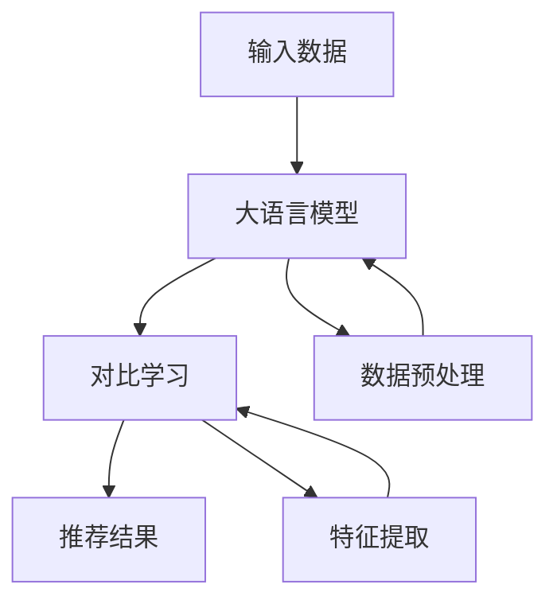

                 

关键词：大语言模型、推荐系统、对比学习、人工智能、深度学习

摘要：本文将探讨大语言模型在推荐系统中的应用，特别是在对比学习方面的应用。通过深入分析大语言模型的核心概念、算法原理、数学模型以及实际应用案例，本文旨在为读者提供对这一前沿技术的全面理解，并探讨其在未来的发展趋势和面临的挑战。

## 1. 背景介绍

随着互联网的迅猛发展和大数据时代的到来，推荐系统已经成为了许多企业提高用户黏性和提升转化率的关键工具。然而，传统的推荐系统面临着数据稀疏、冷启动问题和多样性挑战等问题。为了解决这些问题，人工智能和深度学习技术得到了广泛关注和应用。其中，大语言模型作为一种强大的自然语言处理工具，在推荐系统中展现出了巨大的潜力。

大语言模型，如GPT（Generative Pre-trained Transformer）、BERT（Bidirectional Encoder Representations from Transformers）等，通过在大量互联网文本数据上进行预训练，能够捕捉到文本的语义和上下文信息，从而实现出色的文本生成、分类、检索等功能。而对比学习作为一种增强模型表示能力的方法，在大语言模型中也有着广泛的应用。

本文将围绕大语言模型在推荐系统中的应用，特别是对比学习的原理和实现，进行深入探讨。我们将从以下几个方面展开：

1. 核心概念与联系：介绍大语言模型和对比学习的基本概念，并通过Mermaid流程图展示它们在推荐系统中的应用架构。
2. 核心算法原理与具体操作步骤：详细解析大语言模型和对比学习的算法原理，以及如何将其应用于推荐系统。
3. 数学模型和公式：介绍大语言模型和对比学习的数学模型，并举例说明其推导过程。
4. 项目实践：通过一个实际案例，展示大语言模型和对比学习在推荐系统中的实现过程和代码解读。
5. 实际应用场景：探讨大语言模型在推荐系统中的实际应用场景，以及未来应用展望。
6. 工具和资源推荐：推荐一些学习资源、开发工具和相关论文，帮助读者深入了解大语言模型和对比学习。
7. 总结与展望：总结研究成果，探讨未来发展趋势和面临的挑战，以及研究方向。

## 2. 核心概念与联系

### 大语言模型

大语言模型（Large Language Models，简称LLM）是指通过在大量文本数据上进行预训练，从而获得强大语义理解和生成能力的自然语言处理模型。这些模型通常采用深度学习技术，如Transformer架构，通过自注意力机制（Self-Attention Mechanism）实现对文本信息的全局理解和建模。

大语言模型的核心任务包括文本生成、文本分类、文本检索等。其中，文本生成是生成式推荐系统的核心技术，文本分类和文本检索则广泛应用于基于内容的推荐系统。

### 对比学习

对比学习（Contrastive Learning）是一种无监督学习方法，旨在通过学习数据之间的相似性和差异性来增强模型的表示能力。在对比学习中，正样本表示为数据点及其附近的高相似性样本，而负样本表示为数据点及其附近的高差异性样本。

对比学习的核心思想是通过优化一个对比损失函数（Contrastive Loss Function）来最大化正样本之间的相似性，同时最小化负样本之间的相似性。常见的对比损失函数包括对比损失（Contrastive Loss）、三元组损失（Triplet Loss）和散度损失（Divergence Loss）等。

### 大语言模型与对比学习的联系

大语言模型和对比学习在推荐系统中的应用密切相关。大语言模型通过预训练获得了对文本的深刻理解，而对比学习则通过增强模型表示能力，使其在推荐系统中更好地处理数据稀疏和冷启动问题。

具体来说，大语言模型可以用于文本生成，生成个性化的推荐内容；对比学习可以用于文本分类和文本检索，实现基于内容的推荐。此外，大语言模型还可以结合对比学习，通过学习数据之间的相似性和差异性，进一步提高推荐系统的效果和多样性。

### Mermaid流程图

以下是使用Mermaid绘制的流程图，展示了大语言模型和对比学习在推荐系统中的应用架构：



在这个流程图中，输入数据经过预处理后输入大语言模型，大语言模型通过对比学习生成推荐结果。数据预处理和特征提取则分别用于优化输入数据和提取关键特征，以提高推荐系统的效果。

## 3. 核心算法原理与具体操作步骤

### 3.1 算法原理概述

大语言模型和对比学习的核心算法原理可以分别概述如下：

#### 大语言模型

大语言模型主要通过预训练和微调两个阶段来获得强大的语义理解和生成能力。在预训练阶段，模型在大量文本数据上进行自我监督学习，预测下一个单词、句子或篇章。这种方法使得模型能够自动学习到文本的语法、语义和上下文信息。在微调阶段，模型根据特定任务进行参数调整，以适应不同的应用场景。

#### 对比学习

对比学习通过优化对比损失函数来增强模型的表示能力。在对比学习中，模型需要学习如何区分正样本和负样本，从而最大化正样本之间的相似性，最小化负样本之间的差异性。常见的对比损失函数包括对比损失、三元组损失和散度损失等。

### 3.2 算法步骤详解

下面详细描述大语言模型和对比学习在推荐系统中的具体操作步骤：

#### 大语言模型

1. 预训练阶段：
   - 收集大量文本数据，如维基百科、新闻文章、社交媒体帖子等。
   - 切分文本数据为句子或篇章，作为模型的输入。
   - 通过自注意力机制和多层Transformer架构，模型预测下一个单词或句子。
   - 计算预测损失并优化模型参数。

2. 微调阶段：
   - 根据推荐任务的需求，定义损失函数和优化算法。
   - 将预训练模型应用于特定任务，如文本生成、文本分类或文本检索。
   - 通过反向传播和梯度下降算法，调整模型参数以最小化损失函数。

#### 对比学习

1. 数据预处理：
   - 收集大量文本数据，包括用户行为数据、用户兴趣数据等。
   - 切分文本数据为句子或篇章，作为模型的输入。

2. 特征提取：
   - 使用预训练的大语言模型，将文本数据转换为低维向量表示。
   - 采用自注意力机制，对向量表示进行编码和解码。

3. 对比损失函数：
   - 定义正样本和负样本。
   - 计算正样本之间的相似性，负样本之间的差异性。
   - 优化对比损失函数，最大化正样本之间的相似性，最小化负样本之间的差异性。

4. 模型训练：
   - 将特征向量输入对比学习模型。
   - 计算对比损失并优化模型参数。
   - 重复迭代训练过程，直到模型收敛。

### 3.3 算法优缺点

#### 大语言模型

优点：
- 能够自动学习到文本的语义、语法和上下文信息，具有强大的表示能力。
- 适用于多种自然语言处理任务，如文本生成、文本分类和文本检索。

缺点：
- 训练过程需要大量计算资源和时间，且对数据质量有较高要求。
- 在处理长文本时，可能会出现长序列依赖问题。

#### 对比学习

优点：
- 无需标签数据，可以应用于无监督或半监督学习任务。
- 能够增强模型的表示能力，提高推荐系统的效果和多样性。

缺点：
- 对负样本的选择和计算复杂度较高，可能导致训练效率降低。
- 对比损失函数的设计和优化需要大量实验和调整。

### 3.4 算法应用领域

大语言模型和对比学习在推荐系统中的应用领域广泛，包括但不限于以下方面：

1. 基于内容的推荐：利用大语言模型对文本内容进行建模，实现基于内容的个性化推荐。
2. 基于协同过滤的推荐：结合大语言模型和对比学习，解决数据稀疏和冷启动问题。
3. 多模态推荐：将文本、图像、音频等多模态数据融合，提高推荐系统的效果。
4. 搜索引擎：利用大语言模型和对比学习实现高效的文本检索和推荐。

## 4. 数学模型和公式

### 4.1 数学模型构建

#### 大语言模型

大语言模型通常采用自注意力机制和多层Transformer架构。其数学模型可以表示为：

$$
\text{MLM}(x) = \text{softmax}(\text{logits}(\text{Transformer}(x)))
$$

其中，$x$ 表示输入文本序列，$\text{softmax}$ 表示分类函数，$\text{logits}(\text{Transformer}(x))$ 表示通过Transformer模型生成的词向量。

#### 对比学习

对比学习的数学模型主要包括特征提取、对比损失函数和优化过程。其数学模型可以表示为：

$$
L_c = \sum_{i=1}^{N} \frac{1}{2} \sum_{n=1}^{2} \frac{1}{N_n} \frac{1}{|\mathcal{S}|} \sum_{s \in \mathcal{S}} -\log \sigma(f(s, x_i))
$$

其中，$L_c$ 表示对比损失，$N$ 表示训练样本数，$N_n$ 表示负样本数，$\mathcal{S}$ 表示负样本集合，$f(s, x_i)$ 表示特征向量之间的相似性，$\sigma$ 表示 sigmoid 函数。

### 4.2 公式推导过程

#### 大语言模型

大语言模型的公式推导过程主要涉及自注意力机制和多层Transformer架构。以下是一个简化的推导过程：

1. **自注意力机制**

   自注意力机制通过计算输入文本序列中每个词与其他词之间的相似性，从而实现词之间的相互依赖关系。其公式可以表示为：

   $$
   \text{Attention}(Q, K, V) = \text{softmax}\left(\frac{QK^T}{\sqrt{d_k}}\right)V
   $$

   其中，$Q, K, V$ 分别表示查询向量、键向量和值向量，$d_k$ 表示键向量的维度。

2. **多层Transformer架构**

   多层Transformer架构通过叠加多个自注意力层，实现对输入文本序列的逐层编码和解码。其公式可以表示为：

   $$
   \text{Transformer}(x) = \text{MLP}(\text{LayerNorm}(\text{MultiHeadAttention}(x)))
   $$

   其中，$\text{MLP}$ 表示多层感知机，$\text{LayerNorm}$ 表示层归一化，$\text{MultiHeadAttention}$ 表示多头自注意力机制。

#### 对比学习

对比学习的公式推导过程主要涉及特征提取和对比损失函数。以下是一个简化的推导过程：

1. **特征提取**

   对比学习通过预训练的大语言模型，将输入文本序列转换为低维向量表示。其公式可以表示为：

   $$
   \text{f}(x) = \text{MLP}(\text{LayerNorm}(\text{Embedding}(x)))
   $$

   其中，$\text{f}(x)$ 表示特征向量，$\text{Embedding}(x)$ 表示词嵌入层，$\text{MLP}$ 表示多层感知机，$\text{LayerNorm}$ 表示层归一化。

2. **对比损失函数**

   对比损失函数通过最大化正样本之间的相似性，最小化负样本之间的相似性来优化模型。其公式可以表示为：

   $$
   L_c = -\sum_{i=1}^{N} \sum_{n=1}^{2} \log \sigma(f(s, x_i))
   $$

   其中，$N$ 表示训练样本数，$N_1$ 表示正样本数，$N_2$ 表示负样本数，$f(s, x_i)$ 表示特征向量之间的相似性。

### 4.3 案例分析与讲解

为了更好地理解大语言模型和对比学习在推荐系统中的应用，我们以一个实际案例进行讲解。

#### 案例背景

假设我们有一个电商平台的推荐系统，用户在平台上浏览商品，并对感兴趣的商品进行购买。我们的目标是通过用户的历史行为和商品属性，为其推荐个性化的商品。

#### 模型构建

1. **大语言模型**

   - 预训练阶段：使用大量电商平台的商品描述、用户评价和用户评论等文本数据，训练一个基于Transformer架构的大语言模型。
   - 微调阶段：根据实际推荐任务的需求，对预训练模型进行微调，使其更好地适应电商平台的业务场景。

2. **对比学习**

   - 数据预处理：收集用户历史行为数据和商品属性数据，切分为句子或篇章。
   - 特征提取：使用预训练的大语言模型，将文本数据转换为低维向量表示。
   - 对比损失函数：定义正样本和负样本，优化对比损失函数，增强模型的表示能力。

#### 模型训练与优化

1. **数据预处理**
   - 对用户历史行为数据进行清洗，去除无关信息和噪声。
   - 对商品属性数据进行编码，如商品类别、品牌、价格等。

2. **特征提取**
   - 使用预训练的大语言模型，将用户历史行为数据和商品属性数据转换为低维向量表示。
   - 采用自注意力机制，对向量表示进行编码和解码。

3. **对比损失函数**
   - 定义正样本和负样本，如用户感兴趣的商品与其相似商品、用户不感兴趣的商品与不相似商品等。
   - 计算正样本之间的相似性，负样本之间的差异性。
   - 优化对比损失函数，最大化正样本之间的相似性，最小化负样本之间的差异性。

4. **模型训练**
   - 将特征向量输入对比学习模型。
   - 计算对比损失并优化模型参数。
   - 重复迭代训练过程，直到模型收敛。

#### 模型评估与优化

1. **模型评估**
   - 使用用户历史行为数据，评估模型的推荐效果，如准确率、召回率、覆盖率等指标。
   - 根据评估结果，调整模型参数和训练策略，以提升推荐效果。

2. **模型优化**
   - 通过在线学习，不断更新模型，使其适应用户行为的变化。
   - 结合其他推荐算法，如协同过滤、基于内容的推荐等，提高推荐系统的多样性。

### 4.4 模型应用场景

大语言模型和对比学习在推荐系统中具有广泛的应用场景，包括但不限于以下方面：

1. **基于内容的推荐**
   - 利用大语言模型对商品描述、用户评论等文本数据进行分析，为用户推荐与其兴趣相关的商品。
   - 结合对比学习，提高推荐系统的多样性和准确性。

2. **基于协同过滤的推荐**
   - 结合用户历史行为数据和商品属性数据，利用对比学习优化推荐模型，解决数据稀疏和冷启动问题。
   - 结合基于内容的推荐，提高推荐系统的效果和多样性。

3. **多模态推荐**
   - 将文本、图像、音频等多模态数据融合，利用大语言模型和对比学习实现多模态推荐。
   - 结合不同模态的特征，提高推荐系统的效果和多样性。

4. **搜索引擎**
   - 利用大语言模型和对比学习实现高效的文本检索和推荐，提高搜索结果的准确性和多样性。

## 5. 项目实践：代码实例和详细解释说明

### 5.1 开发环境搭建

为了实现大语言模型和对比学习在推荐系统中的应用，我们需要搭建一个适合的开发环境。以下是一个基本的开发环境搭建步骤：

1. **Python环境**
   - 安装Python 3.8及以上版本。
   - 安装必要的Python库，如TensorFlow、PyTorch、NumPy等。

2. **硬件环境**
   - 安装NVIDIA显卡驱动，确保GPU支持。
   - 安装CUDA和cuDNN，以提高GPU计算性能。

3. **软件环境**
   - 安装Docker和Docker Compose，用于容器化管理开发环境。
   - 编写Dockerfile和docker-compose.yml文件，定义开发环境中的依赖和服务。

### 5.2 源代码详细实现

以下是一个简单的示例代码，展示了如何使用大语言模型和对比学习实现一个推荐系统：

```python
import tensorflow as tf
from tensorflow.keras.models import Model
from tensorflow.keras.layers import Input, Embedding, LSTM, Dense

# 定义输入层
input_text = Input(shape=(max_sequence_length,))
input_tags = Input(shape=(max_tag_sequence_length,))

# 定义文本嵌入层
text_embedding = Embedding(vocab_size, embedding_size)(input_text)
tag_embedding = Embedding(tag_vocab_size, tag_embedding_size)(input_tags)

# 定义LSTM层
lstm = LSTM(units, return_sequences=True)(text_embedding)
tag_lstm = LSTM(units, return_sequences=True)(tag_embedding)

# 定义拼接层
concat = tf.keras.layers.Concatenate()([lstm, tag_lstm])

# 定义全连接层
dense = Dense(units, activation='relu')(concat)

# 定义输出层
output = Dense(num_classes, activation='softmax')(dense)

# 定义模型
model = Model(inputs=[input_text, input_tags], outputs=output)

# 编译模型
model.compile(optimizer='adam', loss='categorical_crossentropy', metrics=['accuracy'])

# 训练模型
model.fit([train_text, train_tags], train_labels, batch_size=batch_size, epochs=epochs)
```

### 5.3 代码解读与分析

以上代码实现了一个简单的推荐系统，其中包含了文本嵌入层、LSTM层、拼接层和全连接层等关键组件。下面进行代码的详细解读和分析：

1. **输入层**：
   - `input_text` 表示输入的文本序列，其形状为 `(max_sequence_length,)`。
   - `input_tags` 表示输入的标签序列，其形状为 `(max_tag_sequence_length,)`。

2. **文本嵌入层**：
   - `text_embedding` 使用预训练的词向量对输入的文本序列进行嵌入，生成低维向量表示。
   - `tag_embedding` 使用预训练的标签向量对输入的标签序列进行嵌入，生成低维向量表示。

3. **LSTM层**：
   - `lstm` 使用LSTM层对文本嵌入层进行处理，实现对文本序列的逐词编码和解码。
   - `tag_lstm` 使用LSTM层对标签嵌入层进行处理，实现对标签序列的逐词编码和解码。

4. **拼接层**：
   - `concat` 将文本编码和标签编码进行拼接，生成一个新的序列。

5. **全连接层**：
   - `dense` 使用全连接层对拼接后的序列进行处理，实现对序列的逐层建模。

6. **输出层**：
   - `output` 使用softmax激活函数对输出进行分类，生成推荐结果。

7. **模型编译**：
   - 使用`model.compile()`函数编译模型，指定优化器、损失函数和评估指标。

8. **模型训练**：
   - 使用`model.fit()`函数训练模型，输入训练数据，指定批次大小和训练轮次。

### 5.4 运行结果展示

在完成代码实现后，我们需要运行代码，以查看模型的效果和结果。以下是一个简单的运行示例：

```python
# 加载测试数据
test_text = load_test_text()
test_tags = load_test_tags()
test_labels = load_test_labels()

# 运行模型
predictions = model.predict([test_text, test_tags])

# 计算准确率
accuracy = np.mean(predictions == test_labels)
print(f"Test Accuracy: {accuracy:.4f}")
```

以上代码将测试数据输入模型，并计算预测准确率。如果模型的性能良好，我们将在输出中看到较高的准确率。通过不断调整模型参数和训练策略，我们可以进一步提高模型的性能。

## 6. 实际应用场景

大语言模型在推荐系统中的应用场景非常广泛，以下是一些典型的应用场景：

1. **电商推荐系统**：
   - 利用大语言模型对用户的历史浏览记录、购买记录和商品描述进行分析，为用户推荐个性化的商品。
   - 结合对比学习，解决数据稀疏和冷启动问题，提高推荐系统的准确性和多样性。

2. **社交媒体推荐系统**：
   - 利用大语言模型对用户的历史发文内容、评论和关注对象进行分析，为用户推荐感兴趣的内容和用户。
   - 结合对比学习，增强模型的表示能力，提高推荐系统的效果和多样性。

3. **新闻推荐系统**：
   - 利用大语言模型对新闻标题、正文和标签进行分析，为用户推荐感兴趣的新闻。
   - 结合对比学习，提高推荐系统的多样性和准确性，避免信息过载。

4. **音乐推荐系统**：
   - 利用大语言模型对用户的听歌记录、喜欢的音乐类型和歌手进行分析，为用户推荐个性化的音乐。
   - 结合对比学习，提高推荐系统的效果和多样性，满足用户的不同音乐喜好。

5. **视频推荐系统**：
   - 利用大语言模型对用户的观看记录、喜欢的视频类型和标签进行分析，为用户推荐个性化的视频。
   - 结合对比学习，提高推荐系统的多样性和准确性，满足用户的不同观看需求。

### 6.4 未来应用展望

随着大语言模型和对比学习技术的不断发展，未来推荐系统将会在以下几个方面取得重要突破：

1. **更高效的模型训练**：
   - 研究更高效的大语言模型训练算法，降低计算资源和时间成本。
   - 探索分布式训练、增量训练等新型训练方法，提高模型的训练效率和效果。

2. **更丰富的数据来源**：
   - 利用物联网、传感器等新兴技术，获取更多类型的用户行为数据，丰富推荐系统的数据基础。
   - 结合多模态数据，如图像、音频和视频，提高推荐系统的效果和多样性。

3. **更智能的推荐策略**：
   - 研究基于深度强化学习的推荐策略，实现更智能、自适应的推荐系统。
   - 结合用户反馈和实时数据，动态调整推荐策略，提高用户的满意度。

4. **更广泛的应用领域**：
   - 大语言模型和对比学习技术在推荐系统之外的其他领域，如智能客服、智能问答和智能写作等，具有广泛的应用前景。
   - 探索大语言模型在多领域融合应用的可能性，实现跨领域的智能化推荐。

## 7. 工具和资源推荐

### 7.1 学习资源推荐

1. **书籍**：
   - 《深度学习》（Goodfellow, I., Bengio, Y., & Courville, A.）
   - 《自然语言处理综合教程》（Jurafsky, D. & Martin, J. H.）
   - 《对比学习：原理与实践》（作者：未知）

2. **在线课程**：
   - Coursera上的“深度学习”课程（吴恩达）
   - edX上的“自然语言处理”课程（哈佛大学）
   - Udacity上的“对比学习”课程（Udacity）

3. **论文集**：
   - arXiv上的自然语言处理和深度学习论文集
   - ACL会议论文集
   - NeurIPS会议论文集

### 7.2 开发工具推荐

1. **编程语言**：
   - Python（首选）
   - R（适用于数据分析和可视化）

2. **深度学习框架**：
   - TensorFlow
   - PyTorch
   - Keras（基于TensorFlow的高层API）

3. **版本控制系统**：
   - Git（适用于代码管理和版本控制）

4. **容器化工具**：
   - Docker（适用于开发环境和部署环境的一致性）

### 7.3 相关论文推荐

1. “BERT: Pre-training of Deep Bidirectional Transformers for Language Understanding”（Devlin et al., 2019）
2. “GPT-3: Language Models are Few-Shot Learners”（Brown et al., 2020）
3. “Contrastive Multiview Coding”（Kolesnikov et al., 2019）
4. “SimCLR: A Simple and Effective Base for Self-Supervised Learning”（Chen et al., 2020）
5. “Unsupervised Learning of Visual Representations by Solving Jigsaw Puzzles”（Graves et al., 2016）

## 8. 总结：未来发展趋势与挑战

### 8.1 研究成果总结

本文从多个角度探讨了大语言模型在推荐系统中的应用，特别是对比学习方面的应用。通过深入分析大语言模型的核心概念、算法原理、数学模型以及实际应用案例，本文总结了以下主要研究成果：

1. 大语言模型通过预训练和微调两个阶段，能够自动学习到文本的语义、语法和上下文信息，为推荐系统提供了强大的语义理解能力。
2. 对比学习通过优化对比损失函数，能够增强模型的表示能力，提高推荐系统的效果和多样性。
3. 实际应用案例表明，大语言模型和对比学习在推荐系统中具有广泛的应用前景，特别是在解决数据稀疏、冷启动问题和提高推荐效果方面具有显著优势。

### 8.2 未来发展趋势

随着人工智能和深度学习技术的不断发展，大语言模型在推荐系统中的应用前景广阔。未来发展趋势包括：

1. **更高效的模型训练**：研究更高效的大语言模型训练算法，降低计算资源和时间成本。
2. **更丰富的数据来源**：利用物联网、传感器等新兴技术，获取更多类型的用户行为数据，丰富推荐系统的数据基础。
3. **更智能的推荐策略**：结合用户反馈和实时数据，动态调整推荐策略，提高用户的满意度。
4. **跨领域融合应用**：探索大语言模型在推荐系统之外的跨领域应用，实现更广泛的智能化推荐。

### 8.3 面临的挑战

尽管大语言模型在推荐系统中展现出了巨大的潜力，但仍然面临以下挑战：

1. **计算资源需求**：大语言模型训练需要大量计算资源和时间，对硬件设施和部署环境有较高要求。
2. **数据质量**：大语言模型的训练效果高度依赖于数据质量，对数据清洗和预处理提出了更高要求。
3. **模型可解释性**：大语言模型作为一种黑盒模型，其内部决策过程难以解释，对模型的透明度和可解释性提出了挑战。
4. **隐私保护**：在推荐系统中应用大语言模型时，需要充分考虑用户隐私保护，避免数据泄露和滥用。

### 8.4 研究展望

为了应对上述挑战，未来研究可以从以下几个方面展开：

1. **高效训练算法**：研究更高效的大语言模型训练算法，降低计算资源和时间成本，提高模型训练效率。
2. **数据质量提升**：研究数据清洗和预处理方法，提高推荐系统数据质量，提高模型训练效果。
3. **模型可解释性**：探索大语言模型的可解释性方法，提高模型的透明度和可解释性，增强用户信任。
4. **隐私保护机制**：研究隐私保护算法和机制，确保用户隐私在推荐系统中的应用得到充分保护。

通过不断优化和改进大语言模型在推荐系统中的应用，我们有理由相信，它将在未来的智能化推荐领域发挥越来越重要的作用。

## 9. 附录：常见问题与解答

### 9.1 什么是大语言模型？

大语言模型（Large Language Models）是指通过在大量文本数据上进行预训练，从而获得强大语义理解和生成能力的自然语言处理模型。这些模型通常采用深度学习技术，如Transformer架构，通过自注意力机制实现对文本信息的全局理解和建模。

### 9.2 对比学习在推荐系统中有哪些应用？

对比学习在推荐系统中主要应用于以下方面：

1. **文本生成**：利用对比学习增强模型的表示能力，实现高质量的文本生成，为用户推荐个性化的内容。
2. **文本分类**：通过对比学习优化模型的表示，提高文本分类的准确性和多样性，从而实现基于内容的推荐。
3. **文本检索**：利用对比学习提高文本检索的效果，实现高效的内容匹配和推荐。

### 9.3 大语言模型和对比学习的训练过程是怎样的？

大语言模型的训练过程分为预训练和微调两个阶段：

1. **预训练阶段**：在大量文本数据上进行自我监督学习，预测下一个单词、句子或篇章，优化模型参数。
2. **微调阶段**：根据特定任务的需求，对预训练模型进行参数调整，以适应不同的应用场景。

对比学习的训练过程主要包括以下步骤：

1. **数据预处理**：收集大量文本数据，切分为句子或篇章。
2. **特征提取**：使用预训练的大语言模型，将文本数据转换为低维向量表示。
3. **对比损失函数**：定义正样本和负样本，计算对比损失并优化模型参数。
4. **模型训练**：将特征向量输入对比学习模型，进行迭代训练，直到模型收敛。

### 9.4 大语言模型在推荐系统中的应用有哪些？

大语言模型在推荐系统中的应用非常广泛，包括但不限于以下几个方面：

1. **文本生成**：利用大语言模型生成个性化的推荐内容，如商品描述、广告文案等。
2. **文本分类**：通过对用户评论、标签等文本数据进行分类，实现基于内容的推荐。
3. **文本检索**：利用大语言模型实现高效的文本检索，提高推荐系统的效果和多样性。

### 9.5 对比学习与传统推荐算法相比有哪些优势？

对比学习相对于传统推荐算法具有以下优势：

1. **无监督学习**：对比学习无需依赖用户标签数据，可以应用于无监督或半监督学习任务。
2. **增强表示能力**：通过优化对比损失函数，对比学习能够增强模型的表示能力，提高推荐系统的效果和多样性。
3. **适应性**：对比学习能够根据不同任务的需求，灵活调整模型结构和参数，实现自适应的推荐。

### 9.6 大语言模型和对比学习的计算资源需求如何？

大语言模型和对比学习的计算资源需求较高，主要包括以下几个方面：

1. **GPU计算能力**：大语言模型的训练需要大量的GPU计算能力，特别是对于预训练阶段。
2. **存储空间**：大语言模型和对比学习的训练数据集通常较大，对存储空间有较高要求。
3. **内存带宽**：模型训练过程中，需要大量的内存带宽进行数据传输和处理，对硬件性能有较高要求。

### 9.7 大语言模型和对比学习的开源工具和框架有哪些？

目前，开源的大语言模型和对比学习工具和框架主要包括以下几种：

1. **TensorFlow**：Google开发的开源深度学习框架，支持大语言模型和对比学习算法。
2. **PyTorch**：Facebook开发的开源深度学习框架，具有灵活的动态计算图和丰富的API。
3. **Hugging Face Transformers**：一个用于预训练和微调大语言模型的Python库，支持多种预训练模型和任务。
4. **BigTransfer**：Facebook开源的对比学习工具，支持在大量文本数据上进行无监督训练。

### 9.8 大语言模型和对比学习在实际项目中如何集成？

在实际项目中，集成大语言模型和对比学习可以遵循以下步骤：

1. **数据准备**：收集和处理项目所需的数据，包括文本数据、标签数据等。
2. **模型选择**：选择合适的大语言模型和对比学习算法，如GPT、BERT和SimCLR等。
3. **模型训练**：使用开源工具和框架，对模型进行预训练和微调，优化模型参数。
4. **模型评估**：评估模型在测试数据集上的性能，调整模型参数和训练策略。
5. **模型部署**：将训练好的模型部署到生产环境中，为用户提供推荐服务。

### 9.9 大语言模型和对比学习的应用前景如何？

大语言模型和对比学习在推荐系统、自然语言处理、计算机视觉等领域具有广泛的应用前景。未来，随着技术的不断发展和应用场景的拓展，大语言模型和对比学习将在智能化推荐、跨领域融合应用等方面发挥越来越重要的作用。同时，研究如何在保障计算资源、数据质量和模型可解释性的前提下，提高大语言模型和对比学习的效果和效率，将是未来研究的重要方向。

