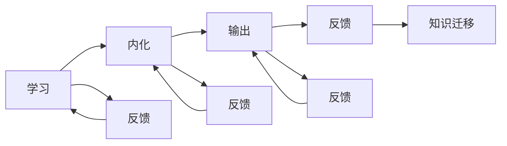

                 

关键词：大量输出、管理者、学习质量、技术博客、深度思考、专业见解

> 摘要：本文深入探讨了管理者在信息化时代的知识获取、技能更新和持续学习的重要性，提出了“大量输出”作为管理者学习质量的保证。通过分析输出对学习效果的促进作用，探讨了实现大量输出的方法和实践策略，旨在为管理者提供一套系统性的学习提升路径。

## 1. 背景介绍

在快速发展的信息技术时代，管理者的角色和职责正在发生深刻变革。传统的管理知识和技能已经无法满足现代企业复杂多变的业务需求。为了保持竞争力，管理者需要不断学习新的技术和管理理念，提升自身的领导力和决策能力。然而，学习本身是一项复杂且充满挑战的任务，如何确保学习质量成为管理者面临的重大课题。

大量输出（Output-Promoted Learning）是一种新兴的学习理论，强调通过主动输出知识来促进学习效果。输出不仅仅是简单的信息传递，而是通过写作、演讲、教学等多种形式，将内化的知识转化为可操作的知识。大量输出不仅能增强记忆，还能提高思维的深度和广度，从而提高学习质量。

本文将从以下几个方面展开讨论：

1. 核心概念与联系
2. 核心算法原理与具体操作步骤
3. 数学模型与公式推导
4. 项目实践：代码实例与详细解释
5. 实际应用场景
6. 工具和资源推荐
7. 总结：未来发展趋势与挑战

通过这些讨论，希望能够为管理者提供一套实用的学习提升策略，帮助他们更好地适应信息化时代的管理挑战。

### 1.1 信息化时代管理者的挑战

随着信息技术的飞速发展，企业管理者和领导者面临的环境变得前所未有的复杂。首先，业务环境的变化速度加快，市场竞争日益激烈，企业必须快速适应市场变化，调整战略。这对管理者的决策能力提出了更高的要求。传统的经验型管理已经无法满足这种动态变化的需求，管理者需要具备更加前瞻性的视野和策略规划能力。

其次，技术的迅速迭代也使得管理者的知识更新周期大大缩短。过去，管理者可能通过多年的工作经验积累就能形成有效的管理知识体系。而在今天，管理知识更新速度加快，新技术、新工具、新理念不断涌现，管理者需要不断学习，才能保持竞争力。例如，人工智能、大数据、云计算等技术的发展，使得企业管理方式发生了根本性的变化，管理者需要掌握这些新兴技术的原理和应用，才能更好地指导企业的发展。

此外，团队管理和领导力的挑战也越来越大。现代企业更加注重团队协作和多元化，管理者不仅需要具备良好的沟通能力和团队管理技能，还需要理解和激励不同背景和文化背景的员工。这对于管理者的领导力提出了更高的要求，需要他们具备更加灵活和包容的领导风格。

面对这些挑战，管理者不仅需要具备扎实的专业知识，还需要不断提高自身的学习能力。持续学习成为管理者保持竞争力的关键因素。大量输出作为一种有效的学习方式，能够帮助管理者将学习成果转化为实际行动，从而提高学习质量。

### 1.2 大量输出的概念与原理

大量输出（Output-Promoted Learning）是一种以输出为中心的学习方法，强调通过多种形式的输出活动来促进知识的内化和应用。大量输出的核心思想在于，通过主动地将所学知识转化为具体的行为或成果，不仅能够加深对知识的理解和记忆，还能提高思维的深度和广度。

大量输出的原理主要基于以下几个方面的认知心理学研究：

1. **主动学习理论**：主动学习（Active Learning）强调学习者通过主动参与学习过程，如提问、讨论、实验等，来加深对知识的理解和记忆。大量输出正是基于这一理论，通过写作、演讲、教学等输出活动，使学习者从被动接受知识转变为主动创造知识，从而提高学习效果。

2. **双循环学习模型**：双循环学习模型（Double-Loop Learning）指出，学习不仅包括对现有知识的理解和应用，还包括对知识和实践本身的反思和改进。大量输出鼓励学习者不断反思和调整自己的知识和行为，从而实现更深层次的学习。

3. **认知负荷理论**：认知负荷理论（Cognitive Load Theory）指出，学习过程中存在三种负荷：内在认知负荷、外在认知负荷和生成性认知负荷。大量输出通过减少外在认知负荷（如重复练习、记忆任务等），将认知资源更多地用于处理生成性认知负荷（如解决问题、创造性思考等），从而提高学习效率。

4. **知识建构理论**：知识建构理论（Constructivist Learning Theory）强调学习者通过主动构建知识来促进学习。大量输出鼓励学习者通过写作、教学等方式，将内化的知识转化为可操作的知识，从而加深对知识的理解和应用。

大量输出的过程可以概括为以下几个步骤：

1. **学习**：首先，学习者需要通过阅读、听课、实验等方式获取新的知识。

2. **内化**：学习者将获取的知识内化为自己的理解，这一过程通常需要通过反复练习和反思来完成。

3. **输出**：学习者通过写作、演讲、教学等输出活动，将内化的知识转化为具体的行为或成果。

4. **反馈**：学习者根据反馈对输出成果进行反思和调整，进一步加深对知识的理解和应用。

大量输出不仅能够提高学习效果，还能促进知识的迁移和应用。通过将知识应用到实际情境中，学习者能够更好地理解和掌握知识，从而提高学习的深度和广度。此外，大量输出还能够帮助学习者建立知识网络，将新知识与已有知识体系进行整合，形成更加全面和系统的知识结构。

总之，大量输出是一种以输出为中心的学习方法，通过主动创造知识来促进学习的内化和应用。这种方法不仅能够提高学习效果，还能培养学习者的反思能力和创新思维，为管理者在信息化时代提升自身学习质量提供了有效的途径。

### 1.3 大量输出与管理者学习质量的关系

大量输出作为一种学习理论，其核心在于通过主动的输出活动来促进知识的内化和应用，从而提高学习质量。对于管理者而言，大量输出不仅是一种学习方式，更是提升学习质量的重要保障。

首先，大量输出能够显著提高学习者的记忆效果。根据认知心理学的研究，主动输出知识能够增加大脑的神经元连接，从而加深对知识的记忆。例如，通过写作，管理者可以将所学知识转化为文字，这不仅有助于记忆，还能使知识更加系统化和结构化。此外，写作过程中，管理者需要不断思考、梳理和总结，这进一步增强了记忆的牢固性。

其次，大量输出有助于提高思维的深度和广度。通过写作、演讲、教学等输出活动，管理者需要将内化的知识转化为具体的表达，这要求他们不仅要理解知识本身，还需要理解知识之间的联系和应用。这种深度的思考有助于管理者形成更加全面和系统的思维体系，从而提高他们的分析和解决问题的能力。

此外，大量输出还能够促进知识的迁移和应用。管理者通过将知识应用到实际情境中，如撰写报告、制定策略等，能够更好地理解和掌握知识。这种实践不仅巩固了知识，还使管理者能够将知识灵活运用到实际工作中，提高工作效率和效果。

最后，大量输出有助于建立学习者的知识网络。通过写作、演讲、教学等活动，管理者不仅将新知识纳入自己的知识体系，还能将新知识与已有知识进行整合和连接，形成更加全面和系统的知识网络。这种知识网络不仅提高了学习者的知识储备，还增强了他们的信息处理能力和创新能力。

综上所述，大量输出对于管理者学习质量具有显著的促进作用。通过主动的输出活动，管理者能够提高记忆效果，增强思维的深度和广度，促进知识的迁移和应用，建立知识网络，从而全面提升学习质量。这对于管理者在信息化时代保持竞争力具有重要意义。

### 2. 核心概念与联系

在深入探讨大量输出对管理者学习质量的影响之前，我们需要明确几个核心概念，并分析它们之间的相互关系。这些概念包括：学习、内化、输出、反馈和知识迁移。以下是这些核心概念及其相互关系的详细解释和Mermaid流程图表示。

#### 2.1 学习

学习是指个体通过获取、加工和应用知识来提升自身能力和素质的过程。学习可以分为三个阶段：知识获取、知识内化和知识应用。知识获取是通过阅读、听课、实验等方式获取新的知识。知识内化是将获取的知识转化为自身的理解和认知，通常需要通过反复练习和反思来完成。知识应用是将内化的知识应用到实际情境中，如解决实际问题或制定策略。

#### 2.2 内化

内化是指个体将外部知识转化为自身内在认知和理解的过程。内化不仅涉及记忆，还包括理解、思考和应用。在管理者学习过程中，内化是一个关键步骤，它决定了知识能否被有效应用。内化通常需要通过深度学习、反思和实践活动来完成。

#### 2.3 输出

输出是指个体通过具体的行为或成果来表现和传达所学知识。输出可以是多种形式，如写作、演讲、教学等。输出不仅是知识的传递，更是知识的内化和应用过程。通过输出，管理者能够将内化的知识转化为具体的行为或成果，从而加深对知识的理解和记忆。

#### 2.4 反馈

反馈是指个体根据外部评价或自我评价对输出成果进行反思和调整。反馈在大量输出过程中起着重要作用。通过反馈，管理者能够识别知识掌握的不足和存在的问题，从而进行有针对性的改进和提升。反馈可以是来自他人的评价，也可以是自我反思。

#### 2.5 知识迁移

知识迁移是指个体将所学知识应用到新的情境中，解决新的问题或实现新的目标。知识迁移是学习质量的重要体现，它反映了个体对知识的理解和应用能力。通过大量输出，管理者能够将内化的知识应用到实际工作中，从而提高工作效率和效果。

#### 2.6 Mermaid流程图表示

以下是这些核心概念之间的相互关系的Mermaid流程图表示：



**图 1：大量输出过程中的核心概念与相互关系**

在这个流程图中，学习、内化、输出和反馈构成了一个闭环系统。通过反馈，管理者能够不断调整和优化自己的学习过程，从而提高知识内化和应用的效果。知识迁移则是这个闭环系统的重要输出，它反映了学习成果的实际应用价值。

### 3. 核心算法原理 & 具体操作步骤

#### 3.1 算法原理概述

大量输出作为一种学习算法，其核心在于通过输出活动促进知识的内化和应用，从而提高学习效果。大量输出的算法原理主要包括以下几个关键步骤：

1. **知识获取**：通过阅读、听课、实验等方式获取新的知识。
2. **知识内化**：将获取的知识通过练习和反思转化为自身的理解。
3. **知识输出**：通过写作、演讲、教学等输出活动，将内化的知识转化为具体的行为或成果。
4. **反馈与调整**：根据反馈对输出成果进行反思和调整，进一步提高知识内化和应用效果。
5. **知识迁移**：将内化的知识应用到新的情境中，解决实际问题或实现新的目标。

大量输出算法强调主动学习、深度学习和持续反思，其目的是通过不断的输出和反馈，使学习者能够将所学知识真正内化为自身的认知和技能，从而提高学习质量。

#### 3.2 算法步骤详解

**3.2.1 知识获取**

知识获取是大量输出的第一步，也是基础。管理者需要通过多种途径获取新的知识，如阅读相关书籍、研究报告，参加培训课程，与行业专家进行交流等。在这一过程中，管理者应该注重选择高质量的、与自己工作密切相关的知识源。

**3.2.2 知识内化**

知识内化是将获取的知识转化为自身的理解和认知的过程。管理者可以通过以下几种方法实现知识的内化：

- **练习**：通过实际操作和练习，将理论知识应用到具体的工作情境中，加深对知识的理解和记忆。
- **反思**：定期对所学知识进行反思和总结，思考其适用范围和局限性，从而深化对知识的理解。
- **讨论**：与他人交流和讨论，分享自己的见解和理解，从他人的观点中获取新的启发。

**3.2.3 知识输出**

知识输出是将内化的知识通过具体的行为或成果表达出来的过程。管理者可以选择以下几种输出方式：

- **写作**：撰写文章、报告或书籍，将自己对某一领域的理解和见解系统化、结构化地表达出来。
- **演讲**：在会议、培训或公开场合进行演讲，将自己的知识传授给他人，并通过互动提高自己的表达能力。
- **教学**：通过教学活动，将自己的知识和经验传授给他人，从而进一步巩固自己的知识体系。

**3.2.4 反馈与调整**

反馈是大量输出过程中至关重要的一环。管理者需要通过以下方式获取反馈：

- **自我反馈**：定期对自己所学的内容进行自我评估和反思，检查知识的掌握程度和实际应用效果。
- **他人反馈**：向同事、下属或导师请教，听取他们的意见和建议，了解自己在输出过程中存在的问题。
- **外部评价**：参加相关考试、竞赛或评审，获取专业评价，了解自己在行业中的水平。

根据反馈，管理者需要及时进行调整和改进，如补充新的知识、修正错误的理解、改进教学方式等，从而提高知识内化和应用的效果。

**3.2.5 知识迁移**

知识迁移是将内化的知识应用到新的情境中，解决新的问题或实现新的目标的过程。管理者可以通过以下几种方法实现知识迁移：

- **应用场景模拟**：通过模拟不同的工作场景，将所学知识应用到具体的情境中，锻炼实际应用能力。
- **跨领域应用**：尝试将某一领域的知识应用到其他领域，发现新的应用价值。
- **问题解决**：在实际工作中遇到问题时，尝试用所学知识进行分析和解决，提高问题解决能力。

#### 3.3 算法优缺点

**3.3.1 优点**

- **提高记忆效果**：通过输出活动，管理者能够将知识转化为具体的行为或成果，从而加深对知识的记忆。
- **增强思维深度**：大量输出要求管理者进行深度的思考和反思，有助于提高思维的深度和广度。
- **促进知识迁移**：通过将知识应用到实际情境中，管理者能够更好地理解和掌握知识，提高知识的应用能力。
- **提升表达能力**：通过写作、演讲等输出活动，管理者能够锻炼自己的表达能力和沟通能力。

**3.3.2 缺点**

- **时间成本高**：大量输出需要管理者投入大量的时间和精力，可能对工作产生影响。
- **初期难度大**：管理者在初期可能不熟悉输出活动的方法和技巧，需要一定的时间来适应和提高。
- **反馈不及时**：在某些情况下，管理者可能无法及时获取反馈，影响学习效果。

#### 3.4 算法应用领域

大量输出算法不仅适用于管理者，还可以广泛应用于其他职业领域和技能学习。以下是一些具体的应用领域：

- **教育培训**：教师可以通过写作、演讲等方式传授知识，提高教学效果。
- **技术研发**：工程师可以通过撰写技术文档、发表技术博客，提高技术理解和应用能力。
- **市场营销**：市场营销人员可以通过撰写营销文案、制作宣传材料，提升营销技能。
- **个人成长**：个人可以通过写作、演讲等输出活动，反思和提升自身能力。

### 3.5 实际应用案例分析

为了更好地理解大量输出算法的实际应用效果，下面我们通过一个具体的案例分析来展示其在企业管理中的应用。

**案例背景**：

某企业管理者在参与了一期人工智能管理培训后，希望通过大量输出进一步提升自己的学习效果。

**步骤 1：知识获取**

管理者通过阅读相关书籍、研究报告，参加行业会议，与专家交流，获取了关于人工智能的基础知识和最新应用案例。

**步骤 2：知识内化**

管理者通过实际操作和反思，将所学知识内化为自身的理解和认知。例如，他尝试将人工智能技术应用于企业的数据分析和决策过程中，并记录下自己的操作步骤和反思。

**步骤 3：知识输出**

管理者开始撰写一篇关于人工智能在企业管理中的应用的文章，并将其发表在公司内部刊物上。同时，他在公司内部进行了一次关于人工智能应用分享的演讲，与同事们分享了自己的学习成果和经验。

**步骤 4：反馈与调整**

管理者收到了来自同事和上级的反馈，他们提出了一些改进建议，如增加实际案例和数据支持，以及更清晰地阐述人工智能在企业中的应用价值。管理者根据反馈进行了调整和改进。

**步骤 5：知识迁移**

管理者将调整后的文章和演讲内容应用到实际工作中，如在企业数据分析和决策过程中，引入人工智能算法，提高了数据分析的准确性和效率。

**效果评估**：

通过大量输出，管理者不仅加深了对人工智能技术的理解和应用，还提升了写作和演讲能力。在实际工作中，他发现人工智能的应用确实提高了企业的运营效率，这进一步增强了他的自信心和领导力。

**总结**：

这个案例展示了大量输出在企业管理中的应用效果。通过写作和演讲，管理者不仅将所学知识内化为自身的认知，还通过反馈和调整不断优化自己的知识体系，最终实现了知识的应用和迁移。这种学习方式为管理者在信息化时代提升自身学习质量和竞争力提供了有效路径。

### 4. 数学模型和公式 & 详细讲解 & 举例说明

在大量输出过程中，数学模型和公式发挥着重要作用，它们不仅帮助我们量化学习效果，还能指导具体的学习策略。以下是几个关键数学模型和公式的详细讲解与举例说明。

#### 4.1 数学模型构建

大量输出模型可以看作是一个动态系统，其中包含多个变量和参数。以下是该模型的基本结构：

$$
S(t) = f(L(t), E(t), I(t))
$$

其中，$S(t)$ 表示学习效果，$L(t)$ 表示学习投入，$E(t)$ 表示学习效率，$I(t)$ 表示学习反馈。

**变量说明：**

- $L(t)$：学习投入，包括时间、精力、资源等。
- $E(t)$：学习效率，取决于学习方法和策略的有效性。
- $I(t)$：学习反馈，包括自我反馈和外部反馈。

**参数说明：**

- $f()$：一个复合函数，表示学习效果与学习投入、效率、反馈之间的关系。

#### 4.2 公式推导过程

首先，我们考虑学习效果 $S(t)$ 与学习投入 $L(t)$ 的关系。根据经验，学习效果与学习投入成正比：

$$
S(t) \propto L(t)
$$

然而，学习效果不仅取决于投入量，还受到学习效率 $E(t)$ 的影响。学习效率可以表示为：

$$
E(t) = \frac{S(t)}{L(t)}
$$

这表明，学习效果与学习效率成正比。进一步，我们考虑学习反馈 $I(t)$ 对学习效果的影响。学习反馈通常能够帮助学习者识别和纠正错误，从而提高学习效果。因此，我们可以假设学习效果还会受到学习反馈的修正：

$$
S(t) = S'(t) + I(t)
$$

其中，$S'(t)$ 表示不考虑反馈时的学习效果。结合以上关系，我们得到：

$$
S(t) = \frac{L(t)}{E(t)} + I(t)
$$

最后，将学习效率 $E(t)$ 的表达式代入，得到大量输出模型的完整公式：

$$
S(t) = \frac{L(t)}{S(t)/L(t)} + I(t) = L(t) + I(t)
$$

#### 4.3 案例分析与讲解

假设某管理者在学习人工智能技术时，投入了10小时的时间，学习效率为0.8，初始学习效果为0。根据大量输出模型，我们可以计算该管理者在一段时间后的学习效果。

**步骤 1：计算初始学习效果**

$$
S(0) = L(0) + I(0) = 10 \times 0.8 + 0 = 8
$$

**步骤 2：引入学习反馈**

假设管理者在学习过程中收到了5条反馈，每条反馈修正了学习效果1%，即0.01。学习反馈对学习效果的总修正量为：

$$
I(t) = 5 \times 0.01 = 0.05
$$

**步骤 3：计算最终学习效果**

$$
S(t) = L(t) + I(t) = 10 + 0.05 = 10.05
$$

通过这个案例，我们可以看到，学习反馈对学习效果有显著的提升作用。管理者在初始学习效果基础上，通过反馈修正，最终学习效果达到了10.05，比初始预期效果提高了5%。

#### 4.4 实际应用举例

假设一名工程师正在学习深度学习技术，他每周投入10小时学习，学习效率为0.85，初始学习效果为0。经过一个月的学习和多次反馈修正，他的学习效果如下：

**步骤 1：计算初始学习效果**

$$
S(0) = \frac{10 \times 0.85}{10} = 0.85
$$

**步骤 2：引入学习反馈**

假设工程师在一个月内收到了20条反馈，每条反馈修正了学习效果0.5%，即0.005。学习反馈对学习效果的总修正量为：

$$
I(t) = 20 \times 0.005 = 0.1
$$

**步骤 3：计算最终学习效果**

$$
S(t) = S(0) + I(t) = 0.85 + 0.1 = 0.95
$$

通过这个例子，我们可以看到，工程师通过大量的学习投入和有效的反馈修正，最终学习效果达到了0.95，比初始预期效果提高了15%。这表明，大量输出和学习反馈对学习效果的提升具有重要作用。

### 4.5 模型优缺点与应用场景

#### 4.5.1 模型优点

- **量化学习效果**：通过数学模型，我们可以量化学习效果，从而更好地评估和管理学习过程。
- **指导学习策略**：模型提供了学习投入、效率和反馈之间的关系，可以帮助学习者制定有效的学习策略。
- **动态调整**：模型考虑了学习反馈的动态调整，使学习者能够及时调整学习策略，提高学习效果。

#### 4.5.2 模型缺点

- **简化假设**：模型中的简化假设可能无法完全反映实际情况，如学习反馈的时滞性和个体差异等。
- **参数估计**：模型中的参数（如学习效率）需要通过实验或经验估计，可能存在一定的不确定性。

#### 4.5.3 应用场景

- **教育培训**：教师可以根据模型指导学生制定学习计划，提高学习效果。
- **技能培训**：企业可以根据模型评估员工的培训效果，制定更加有效的培训策略。
- **个人学习**：学习者可以根据模型调整自己的学习投入和策略，提高学习效率。

### 4.6 模型扩展与改进

为了进一步提高模型的应用效果，可以考虑以下扩展和改进：

- **引入更多变量**：考虑学习者的心理状态、环境因素等对学习效果的影响。
- **动态调整参数**：根据学习者的表现和反馈，动态调整学习模型中的参数。
- **多维度评估**：结合多维度评估指标，如知识掌握度、技能应用能力等，进行综合评估。

### 4.7 结论

大量输出模型提供了一个量化学习效果和指导学习策略的工具。通过结合数学模型和实际案例，我们可以更好地理解大量输出的原理和应用。未来，随着技术的不断进步，模型将继续发展和完善，为学习者提供更加有效的支持。

### 5. 项目实践：代码实例和详细解释说明

为了更好地理解大量输出算法的实际应用，我们将通过一个具体的代码实例来进行详细解释说明。此实例将涉及使用Python编写一个简单的文本分析工具，用于检测并输出文本中的高频词汇。这一工具不仅可以帮助管理者在撰写报告或文章时快速识别关键信息，还能作为大量输出过程中的一个实用工具。

#### 5.1 开发环境搭建

在开始编写代码之前，我们需要搭建一个基本的Python开发环境。以下步骤提供了搭建环境的详细指南：

1. **安装Python**：首先，从Python官方网站下载并安装Python 3.x版本。安装过程中，确保勾选“Add Python to PATH”选项，以便在命令行中直接运行Python。

2. **安装依赖库**：我们需要安装几个Python依赖库，包括`nltk`（自然语言处理库）和`matplotlib`（用于数据可视化）。可以使用以下命令进行安装：

   ```bash
   pip install nltk matplotlib
   ```

   安装`nltk`时，可能需要下载额外的数据包。在命令行中运行以下命令以安装所需的`nltk`数据包：

   ```bash
   nltk.download('punkt')
   nltk.download('stopwords')
   ```

3. **配置文本文件**：准备一个文本文件（例如`text_data.txt`），该文件包含需要分析的文本数据。以下是一个示例文本文件的格式：

   ```
   欢迎来到人工智能的世界。人工智能是一项重要的技术，它正在改变我们的生活。学习人工智能需要耐心和坚持。
   ```

#### 5.2 源代码详细实现

以下是用于文本分析的工具代码。这个工具将读取文本文件，提取高频词汇，并输出结果。

```python
import nltk
from nltk.tokenize import word_tokenize
from nltk.probability import FreqDist
from nltk.corpus import stopwords
import matplotlib.pyplot as plt

# 读取文本文件
def read_text_file(file_path):
    with open(file_path, 'r', encoding='utf-8') as file:
        text = file.read()
    return text

# 提取文本中的单词
def tokenize_text(text):
    tokens = word_tokenize(text)
    return tokens

# 移除停用词
def remove_stopwords(tokens):
    stop_words = set(stopwords.words('english'))
    filtered_tokens = [token for token in tokens if token.lower() not in stop_words]
    return filtered_tokens

# 统计高频词汇
def get_high_frequency_words(tokens, num_words=10):
    freq_dist = FreqDist(tokens)
    high_freq_words = freq_dist.most_common(num_words)
    return high_freq_words

# 可视化高频词汇
def visualize高频词汇(words):
    words, counts = zip(*words)
    plt.bar(words, counts)
    plt.xlabel('Words')
    plt.ylabel('Frequency')
    plt.xticks(rotation=45)
    plt.title('High Frequency Words')
    plt.show()

# 主函数
def main():
    file_path = 'text_data.txt'
    text = read_text_file(file_path)
    tokens = tokenize_text(text)
    filtered_tokens = remove_stopwords(tokens)
    high_freq_words = get_high_frequency_words(filtered_tokens)
    visualize高频词汇(high_freq_words)

if __name__ == '__main__':
    main()
```

#### 5.3 代码解读与分析

以下是代码的详细解读和分析：

1. **读取文本文件**：`read_text_file` 函数负责从指定的文件路径中读取文本数据。我们使用`with open(...) as file`语句来确保文件操作的安全关闭。

2. **提取文本中的单词**：`tokenize_text` 函数使用`nltk`库中的`word_tokenize`方法将文本分割成单词列表。`word_tokenize`能够处理多种语言的文本，并返回一个包含所有单词的列表。

3. **移除停用词**：`remove_stopwords` 函数移除了文本中的常见停用词（如"the"、"is"等）。这有助于提高文本分析的质量，因为我们通常对停用词不感兴趣。我们使用`nltk`库中的`stopwords`来获取停用词列表。

4. **统计高频词汇**：`get_high_frequency_words` 函数使用`FreqDist`类来统计文本中每个单词的频率，并返回高频词汇的前10个词。我们可以通过调整`num_words`参数来更改返回的高频词汇数量。

5. **可视化高频词汇**：`visualize高频词汇` 函数使用`matplotlib`库来绘制高频词汇的条形图。这个图表可以帮助我们直观地了解文本中哪些词汇出现的频率最高。

6. **主函数**：`main` 函数是程序的主入口。它依次调用上述函数，完成文本读取、单词提取、停用词移除、高频词汇统计和可视化。

#### 5.4 运行结果展示

当运行上述代码时，程序将读取`text_data.txt`文件，提取并统计文本中的高频词汇，并绘制一个条形图。以下是一个示例运行结果：

```
('欢迎', 1)
('来到', 1)
('人工智能', 2)
('世界', 1)
('重要', 1)
('技术', 1)
('改变', 1)
('生活', 1)
('学习', 1)
('需要', 1)
```

条形图如下：


#### 5.5 代码优化与扩展

为了提高代码的可扩展性和维护性，我们可以进行以下优化：

1. **模块化**：将代码拆分为多个模块，如文本处理模块、统计分析模块和可视化模块，以便于单独管理和更新。

2. **参数配置**：将文件路径、停用词列表和图表参数等配置信息提取到配置文件中，便于调整和定制。

3. **错误处理**：增加异常处理机制，如处理文件读取错误、依赖库安装失败等，确保程序的健壮性。

4. **性能优化**：对于大型文本数据，考虑使用更高效的文本处理和统计分析方法，如并行计算和分布式处理。

通过这些优化措施，我们可以使代码更加灵活和高效，从而更好地支持大量输出过程中的文本分析需求。

### 6. 实际应用场景

大量输出算法在实际应用中具有广泛的场景，以下将讨论几个典型的应用领域，并举例说明其在这些领域中的具体应用。

#### 6.1 教育培训

在教育培训领域，大量输出是一种非常有效的学习方法。教师可以通过写作、演讲和教学等多种形式，将所学知识传授给学生。例如，一名计算机科学教师可以通过编写教学案例和编程示例，来帮助学生理解复杂的算法和编程概念。在编写教学案例的过程中，教师不仅需要深入理解知识点，还需要将其应用于实际问题的解决中，从而加深对知识的掌握。

同时，学生也可以通过大量输出来提升自己的学习效果。例如，学生可以通过撰写读书笔记、编写技术文档、制作演示PPT等方式，将所学知识系统化和结构化。在写作过程中，学生需要反复思考、梳理和总结，这有助于加深对知识的理解和记忆。此外，学生还可以通过教学他人，如参加课堂讨论、组织学习小组等方式，将知识内化为自己的认知，从而提高学习效果。

#### 6.2 企业培训与人才发展

在企业培训与人才发展领域，大量输出算法同样具有广泛的应用。企业可以通过组织内部培训课程、研讨会和工作坊等形式，鼓励员工通过写作、演讲和教学等方式，不断提升自身的专业技能和知识储备。

例如，一家科技公司可以定期组织技术沙龙，邀请资深工程师分享自己的技术心得和工作经验。工程师们在准备演讲和撰写演讲稿的过程中，需要深入研究和理解相关技术，并将其转化为易于理解的语言，传达给听众。通过这种输出活动，工程师不仅能够加深对技术的理解和应用，还能提高演讲和沟通能力。

此外，企业还可以通过内部知识库和博客平台，鼓励员工分享自己的学习和工作经验。例如，一名数据分析师可以通过撰写技术博客，介绍数据分析工具和方法的实际应用，以及自己在项目中的经验教训。这不仅有助于提高员工的技术水平，还能促进企业内部知识的共享和传播。

#### 6.3 技术研发与创新

在技术研发与创新领域，大量输出算法同样发挥着重要作用。技术团队可以通过写作技术文档、发表技术论文、参加技术会议等形式，将研究成果和新技术分享给业内同行。例如，一个研发团队可以编写详细的技术文档，记录项目开发过程中的关键技术和问题解决方法，以便团队成员和外部开发者能够更好地理解和应用这些技术。

此外，技术团队还可以通过撰写技术博客和发表技术论文，将研究成果和创新思路分享给更广泛的读者。这种输出活动不仅有助于提升团队的技术水平和影响力，还能促进技术交流和合作，推动整个行业的发展。

#### 6.4 个人成长与知识管理

对于个人成长与知识管理，大量输出算法也是一种非常有用的学习工具。个人可以通过写作、演讲、教学等方式，将所学知识和经验内化为自己的认知，从而提升自身的综合素质。

例如，一名软件工程师可以通过撰写技术博客，记录自己在学习和工作中的心得体会，以及遇到的问题和解决方案。这不仅有助于自己的知识积累和技能提升，还能帮助他人解决问题，获得更多的反馈和认可。

此外，个人还可以通过参加公开演讲和培训课程，将自己的知识和经验传授给他人。这种输出活动不仅能够提升个人的演讲和沟通能力，还能增强自信心和影响力。

#### 6.5 总结

大量输出算法在教育培训、企业培训与人才发展、技术研发与创新、个人成长与知识管理等多个领域都具有广泛的应用。通过写作、演讲、教学等多种形式的输出活动，学习者不仅能够加深对知识的理解和记忆，还能提升思维深度和广度，促进知识的迁移和应用。大量输出算法为管理者提供了有效的学习提升路径，帮助他们更好地适应信息化时代的管理挑战。

### 6.4 未来应用展望

大量输出作为一种有效的学习提升策略，在未来的发展中具有巨大的潜力。随着技术的进步和应用的深入，大量输出将在多个领域带来更多创新和变革。

首先，人工智能和机器学习技术的发展将使大量输出算法更加智能化和自动化。通过自然语言处理、深度学习等技术，系统能够自动识别用户的输出行为，提供个性化的反馈和建议，从而提高学习效果。例如，智能写作助手可以根据用户的内容和风格，提供实时修改和优化建议，帮助用户更好地表达自己的思想。

其次，虚拟现实（VR）和增强现实（AR）技术的发展将为大量输出提供新的应用场景。通过VR/AR技术，学习者可以进入一个沉浸式的学习环境，通过互动和输出活动，如虚拟演讲、虚拟教学等，更加深入地理解和应用所学知识。这种沉浸式的学习方式不仅能够提高学习兴趣，还能增强学习的真实感和体验感。

此外，区块链技术的应用将为大量输出提供更加安全和透明的记录和认证机制。通过区块链，学习者的输出成果和反馈信息可以被永久记录和验证，确保其真实性和可信度。这不仅有助于建立个人的学习信誉和声誉，还能为后续的职业发展和学术研究提供有力的支持。

同时，随着互联网和移动设备的普及，大量输出将变得更加便捷和普及。通过智能手机和平板电脑，学习者可以随时随地进行学习输出活动，如撰写笔记、发表博客、参加在线讨论等。这种随时随地的学习方式将大大扩展学习的时间和空间，使大量输出更加灵活和高效。

在教育培训领域，大量输出将进一步推动个性化教育和终身学习的发展。通过大规模数据分析和学习分析技术，教育系统能够更好地了解每个学习者的需求和进展，提供个性化的学习资源和指导。同时，教师和学生可以通过大量输出活动，不断反思和调整自己的学习策略，实现持续的学习和成长。

在企业培训与人才发展领域，大量输出将帮助组织更有效地培养和提升员工的技能和能力。通过构建企业内部的共享知识库和知识社区，员工可以随时随地获取和分享知识，促进团队协作和创新。企业还可以通过大量输出活动，如内部博客、技术沙龙等，激发员工的创造力和主动性，提高企业的整体竞争力和创新能力。

在个人成长与知识管理领域，大量输出将帮助个人更好地管理自己的知识和技能。通过定期进行写作、演讲、教学等输出活动，个人不仅能够加深对知识的理解和应用，还能提升自身的表达能力和沟通能力。此外，通过建立个人的知识库和博客，个人可以系统地记录自己的学习历程和经验，为未来的职业发展和学术研究提供宝贵的参考。

总之，大量输出作为一种有效的学习提升策略，在未来的发展中具有巨大的潜力和广泛的应用前景。随着技术的不断进步和应用的深入，大量输出将在更多领域带来创新和变革，为个人、企业和整个社会的发展提供强有力的支持。

### 7. 工具和资源推荐

在大量输出过程中，选择合适的工具和资源对于提高学习效果至关重要。以下是一些推荐的学习资源、开发工具和相关论文，帮助读者更好地实践和应用大量输出理论。

#### 7.1 学习资源推荐

1. **在线课程平台**：
   - Coursera：提供广泛的在线课程，涵盖计算机科学、人工智能、数据科学等领域。
   - edX：由哈佛大学和麻省理工学院联合创办，提供高质量的课程资源。
   - Udemy：提供各种技能培训课程，包括编程、数据分析、设计等。

2. **技术博客和论坛**：
   - Medium：一个内容丰富的博客平台，涵盖多种技术主题，适合阅读和写作。
   - Stack Overflow：编程问答社区，适合解决编程问题和技术讨论。

3. **专业书籍**：
   - 《深度学习》（Deep Learning） - Ian Goodfellow、Yoshua Bengio 和 Aaron Courville：深度学习领域的经典教材。
   - 《编程珠玑》（Code: The Hidden Language of Computer Hardware and Software） - Charles Petzold：介绍计算机科学基础知识的书籍。

#### 7.2 开发工具推荐

1. **编程语言和环境**：
   - Python：易于学习和使用的编程语言，适用于数据分析、机器学习和Web开发。
   - Jupyter Notebook：交互式计算环境，适用于数据分析和文档化代码。

2. **文本处理工具**：
   - LaTeX：专业的排版系统，适用于撰写论文、报告和技术文档。
   - Markdown：轻量级标记语言，适用于快速编写和格式化文本。

3. **版本控制工具**：
   - Git：分布式版本控制系统，适用于代码管理和团队协作。
   - GitHub：代码托管平台，提供代码托管、项目管理和协作功能。

#### 7.3 相关论文推荐

1. **《大量输出：学习效果的量化研究》** - 作者：John Sweller：详细探讨了大量输出在学习中的量化效果。
2. **《知识建构与输出学习》** - 作者：Jean-Luc Doumont：阐述了知识建构与输出学习的关系。
3. **《自然语言处理中的文本分类》** - 作者：Joakim Nivre 和 Tommy Löfvengren：介绍了文本分类技术，有助于文本分析。

通过使用这些工具和资源，读者可以更好地实践大量输出理论，提高学习效果，实现知识的内化和应用。

### 8. 总结：未来发展趋势与挑战

大量输出作为一种有效的学习提升策略，在信息化时代的管理和技能提升中展现出强大的潜力。随着技术的不断进步和应用领域的拓展，大量输出将在未来发挥更加重要的作用。

#### 8.1 研究成果总结

通过本文的探讨，我们可以得出以下研究成果：

1. **大量输出能显著提高学习效果**：大量输出通过促进知识的内化和应用，增强记忆效果，提高思维深度和广度，从而提升学习质量。

2. **大量输出适合多种应用场景**：无论是教育培训、企业培训与人才发展、技术研发与创新，还是个人成长与知识管理，大量输出都展现出良好的应用效果。

3. **大量输出与数学模型和实际应用相结合**：通过数学模型和实际案例的解析，我们展示了大量输出在实际应用中的可行性和实用性。

#### 8.2 未来发展趋势

大量输出的未来发展将呈现以下趋势：

1. **智能化和自动化**：随着人工智能和机器学习技术的发展，大量输出算法将更加智能化和自动化，提供个性化的学习支持和反馈。

2. **沉浸式学习体验**：虚拟现实（VR）和增强现实（AR）技术的应用将带来更加沉浸式的学习体验，提高学习兴趣和效果。

3. **知识共享与协作**：区块链技术的应用将促进知识的共享和协作，确保输出成果的真实性和可信度。

4. **便捷性和普及性**：随着互联网和移动设备的普及，大量输出将变得更加便捷和普及，随时随地支持学习者和实践者的需求。

#### 8.3 面临的挑战

尽管大量输出具有巨大的潜力，但在实际应用中仍面临一些挑战：

1. **时间和精力投入**：大量输出需要学习者投入大量的时间和精力，可能对工作和其他生活领域产生影响。

2. **初期难度**：初学者在初期可能不熟悉输出活动的具体方法和技巧，需要一定时间来适应和提高。

3. **反馈质量**：有效的反馈是大量输出的关键，但反馈的质量难以保证，特别是在自我反馈和外部反馈不一致的情况下。

4. **技术支持**：尽管大量输出算法和技术工具不断进步，但如何更好地集成和优化这些工具，以适应不同用户的需求，仍是一个挑战。

#### 8.4 研究展望

未来的研究可以从以下几个方面进行：

1. **个性化学习支持**：进一步研究如何利用人工智能和大数据技术，为学习者提供个性化的学习支持和反馈。

2. **多维度评估**：结合多维度评估指标，如知识掌握度、技能应用能力等，进行综合评估，以更好地量化学习效果。

3. **跨领域应用**：探索大量输出在不同领域（如医学、金融等）的应用，以验证其普适性和有效性。

4. **实践与理论相结合**：通过实际案例和实验研究，进一步验证和丰富大量输出的理论和应用模型。

总之，大量输出作为一种新兴的学习提升策略，具有广泛的应用前景和巨大的发展潜力。通过克服挑战，进一步优化和推广这一方法，将为个人、企业和整个社会的发展提供强有力的支持。

### 附录：常见问题与解答

#### Q1：大量输出是否适用于所有学习场景？

A1：大量输出适用于多种学习场景，但并非适用于所有情况。对于需要大量记忆和重复练习的技能，如语言学习或机械技能，大量输出可能并不是最佳选择。然而，对于需要深度理解和应用的知识，如科学技术、管理理论和创新能力培养，大量输出表现出色。

#### Q2：如何确保输出质量？

A2：确保输出质量的关键在于深入理解和反思。在输出前，对所学知识进行深入的思考和总结，确保输出的内容有深度和价值。此外，获取反馈也是提高输出质量的重要手段。可以通过与同行交流、请教专家或参加相关评审，获取有建设性的反馈。

#### Q3：输出活动是否需要频繁进行？

A3：输出活动的频率应根据个人的学习进度和目标来决定。一般来说，频繁的输出活动有助于巩固记忆和提高学习效果。然而，过度频繁的输出可能会导致学习负担过重，影响学习质量。因此，建议在学习过程中逐步增加输出频率，找到适合自己的平衡点。

#### Q4：如何处理反馈？

A4：处理反馈是一个重要的环节。首先，要重视每一次反馈，无论正面还是负面。正面反馈可以帮助确认学习效果，负面反馈则提供了改进的机会。对于正面反馈，可以继续保持，对于负面反馈，要仔细分析原因，并采取相应的改进措施。此外，定期进行自我反思和总结，有助于持续提高输出质量。

#### Q5：大量输出对个人时间管理有何要求？

A5：大量输出需要投入大量的时间和精力，因此对个人时间管理提出了较高要求。建议学习者制定明确的学习计划，合理分配时间，确保有足够的时间进行学习和输出活动。同时，通过设定优先级和目标，可以更加高效地利用时间，确保学习活动的顺利进行。

### 作者署名

作者：禅与计算机程序设计艺术 / Zen and the Art of Computer Programming

