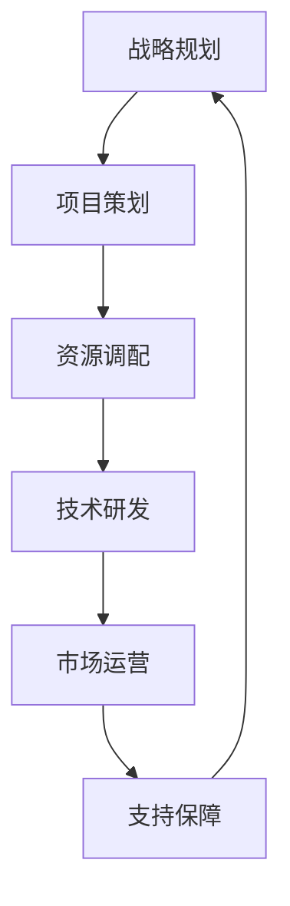

                 

太空技术管理是当今科技界的重要话题，随着商业航天市场的快速崛起，它正逐渐成为推动科技进步和经济发展的关键力量。本文旨在探讨太空技术管理的核心概念、算法原理、数学模型、项目实践以及未来应用展望，以期为读者提供一个全面而深入的视角。

## 关键词

- 商业航天
- 太空技术管理
- 人工智能
- 数学模型
- 项目实践

## 摘要

本文首先介绍了太空技术管理的背景，接着详细阐述了其核心概念和架构，并通过Mermaid流程图展示技术管理流程。随后，文章深入探讨了核心算法的原理和操作步骤，分析了算法的优缺点及其应用领域。接着，文章通过数学模型和公式的详细讲解，提供了案例分析与讲解。在项目实践部分，我们展示了代码实例及其详细解释。最后，文章讨论了实际应用场景，推荐了学习资源和开发工具，并展望了太空技术管理的发展趋势与挑战。

### 1. 背景介绍

太空技术管理起源于20世纪中叶的太空竞赛，当时美国和苏联在太空领域展开了激烈的竞争。随着人类对太空探索的不断深入，太空技术管理逐渐从军事和政府主导的领域转向商业化和民用化。如今，商业航天已经成为一个全球性的新兴市场，吸引了众多企业、投资机构和初创公司的参与。

商业航天市场的崛起主要得益于以下几个因素：

1. **技术创新**：近年来，太空技术的快速发展，特别是航天器设计、发射技术、通信技术和人工智能技术的进步，为商业航天提供了坚实的基础。
2. **政策支持**：全球范围内，各国政府纷纷出台支持商业航天发展的政策，降低了企业进入市场的门槛，激发了市场活力。
3. **市场需求**：随着互联网、物联网和大数据等技术的普及，全球对卫星通信、卫星导航、地球观测等服务的需求急剧增长，为商业航天提供了广阔的市场空间。
4. **资本驱动**：商业航天领域的投资热潮，吸引了大量风险资本和私人资本的进入，为市场的快速发展提供了资金支持。

### 2. 核心概念与联系

#### 2.1. 太空技术管理定义

太空技术管理是指对太空技术资源进行规划、组织、协调和控制的过程，以确保太空技术项目能够高效、安全地实施。它涵盖了从项目策划、资源调配、技术研发到市场推广等各个环节。

#### 2.2. 太空技术管理架构

太空技术管理架构可以分为以下几个层次：

1. **战略规划层**：制定太空技术发展的长期目标和战略，明确技术发展方向和优先级。
2. **项目管理层**：负责具体项目的规划、执行和监控，确保项目按计划顺利进行。
3. **技术研发层**：专注于太空技术的研发和创新，推动新技术的应用和迭代。
4. **市场运营层**：负责太空技术的市场推广和商业化，寻找和开拓新的业务领域。
5. **支持保障层**：提供技术支持、资源保障和风险管理，为太空技术管理提供全方位的支持。

#### 2.3. Mermaid流程图

以下是一个简化的Mermaid流程图，展示太空技术管理的基本流程：



### 3. 核心算法原理 & 具体操作步骤

#### 3.1. 算法原理概述

太空技术管理中，核心算法主要包括以下几类：

1. **卫星轨道计算算法**：用于计算卫星在太空中的轨道，确保卫星能够按照预定轨道运行。
2. **数据传输算法**：优化卫星与地面站之间的数据传输，提高传输效率和可靠性。
3. **故障诊断与修复算法**：自动检测卫星系统的故障，并尝试进行修复，提高系统的可靠性。
4. **人工智能算法**：用于分析大量数据，提供决策支持和优化建议。

#### 3.2. 算法步骤详解

以卫星轨道计算算法为例，其具体操作步骤如下：

1. **收集数据**：收集卫星的初始位置、速度、地球自转速度等数据。
2. **建立模型**：建立卫星轨道的数学模型，通常采用牛顿第二定律和万有引力定律。
3. **计算轨道**：使用数值计算方法，如欧拉法或龙格-库塔法，求解卫星的轨道方程。
4. **优化轨道**：根据实际需求和约束条件，对轨道进行优化，以达到最佳效果。

#### 3.3. 算法优缺点

卫星轨道计算算法的优点包括：

1. **高精度**：能够精确计算卫星的轨道，确保卫星按计划运行。
2. **实时性**：能够实时调整卫星轨道，应对突发情况。

其缺点包括：

1. **计算复杂度高**：需要大量计算资源，对硬件性能有较高要求。
2. **对初始数据依赖性高**：初始数据的不确定性会影响计算结果。

#### 3.4. 算法应用领域

卫星轨道计算算法广泛应用于卫星通信、卫星导航、地球观测等领域，是确保卫星系统正常运行的关键技术。

### 4. 数学模型和公式 & 详细讲解 & 举例说明

#### 4.1. 数学模型构建

卫星轨道计算的核心数学模型基于牛顿运动定律，具体公式如下：

$$
F = G \frac{m_1 m_2}{r^2}
$$

其中，\( F \) 是引力，\( G \) 是万有引力常数，\( m_1 \) 和 \( m_2 \) 是两物体的质量，\( r \) 是两物体之间的距离。

对于卫星轨道，可以将地球视为质点，卫星的轨迹可以近似为圆形或椭圆形。对应的运动方程为：

$$
\frac{d^2 r}{dt^2} = -\frac{G M}{r^2}
$$

其中，\( M \) 是地球的质量，\( r \) 是卫星与地球的距离。

#### 4.2. 公式推导过程

卫星轨道的推导过程基于牛顿第二定律和万有引力定律。首先，根据牛顿第二定律，物体的加速度 \( a \) 与作用力 \( F \) 成正比，与物体的质量 \( m \) 成反比：

$$
F = m a
$$

对于卫星，作用力主要是地球对它的引力 \( F \)，因此：

$$
m a = G \frac{m M}{r^2}
$$

由于卫星做匀速圆周运动，其加速度 \( a \) 等于向心加速度 \( \frac{v^2}{r} \)，其中 \( v \) 是卫星的速度。代入上式，得到：

$$
m \frac{v^2}{r} = G \frac{m M}{r^2}
$$

化简后得到卫星轨道的速度公式：

$$
v = \sqrt{\frac{G M}{r}}
$$

为了得到轨道的形状，需要将速度代入到能量守恒方程中。卫星的总能量 \( E \) 包括动能和引力势能：

$$
E = \frac{1}{2} m v^2 - G \frac{m M}{r}
$$

将速度公式代入，得到：

$$
E = -\frac{G M m}{2r}
$$

由于卫星在轨道上运动，总能量 \( E \) 应为常数。将上式两边关于 \( r \) 求导，得到：

$$
\frac{dE}{dr} = \frac{G M m}{2r^2}
$$

由于 \( \frac{dE}{dr} \) 等于引力 \( F \)，代入引力公式，得到：

$$
\frac{d^2 r}{dt^2} = -\frac{G M}{r^2}
$$

这是卫星轨道的基本运动方程。

#### 4.3. 案例分析与讲解

以地球同步轨道（Geostationary Orbit, GEO）为例，分析卫星轨道计算过程。

1. **初始数据**：地球质量 \( M = 5.972 \times 10^{24} \) kg，万有引力常数 \( G = 6.674 \times 10^{-11} \) N·(m/kg)^2，地球半径 \( R = 6.371 \times 10^6 \) m。

2. **轨道半径**：地球同步轨道的半径约为 \( r = R + h = 6.371 \times 10^6 + 35700 \times 10^3 = 4.216 \times 10^7 \) m。

3. **速度计算**：代入轨道半径，计算卫星速度 \( v = \sqrt{\frac{G M}{r}} \)：

$$
v = \sqrt{\frac{6.674 \times 10^{-11} \times 5.972 \times 10^{24}}{4.216 \times 10^7}} \approx 3.07 \times 10^3 \text{ m/s}
$$

4. **轨道周期**：地球同步轨道的周期约为24小时，代入速度公式，验证轨道半径是否正确：

$$
T = \frac{2 \pi r}{v} = \frac{2 \pi \times 4.216 \times 10^7}{3.07 \times 10^3} \approx 24 \times 3600 \text{ s}
$$

通过计算验证，轨道半径和速度计算结果与地球同步轨道的实际情况相符。

### 5. 项目实践：代码实例和详细解释说明

#### 5.1. 开发环境搭建

为了演示卫星轨道计算，我们将使用Python编程语言，结合NumPy和SciPy库。以下是搭建开发环境的步骤：

1. 安装Python：从官方网站（https://www.python.org/downloads/）下载并安装Python。
2. 安装NumPy：在命令行中运行 `pip install numpy`。
3. 安装SciPy：在命令行中运行 `pip install scipy`。

#### 5.2. 源代码详细实现

以下是一个简单的Python脚本，用于计算卫星轨道：

```python
import numpy as np
from scipy.integrate import solve_ivp

# 引力常数
G = 6.674 * 10**-11
# 地球质量
M = 5.972 * 10**24
# 地球半径
R = 6.371 * 10**6

# 卫星轨道方程
def sat_orbit(t, y):
    r, v = y
    drdt = -G * M / r**2
    dVdt = -G * M * v / r**2
    return [drdt, dVdt]

# 初始条件
y0 = [4.216 * 10**7, 3.07 * 10**3]

# 求解轨道
sol = solve_ivp(sat_orbit, [0, 86400], y0)

# 输出轨道结果
print(sol.y)
```

#### 5.3. 代码解读与分析

1. **导入库**：首先，我们导入NumPy和SciPy库，用于数学计算和数值求解。
2. **定义引力常数**：设定引力常数 \( G \) 和地球质量 \( M \)，以及地球半径 \( R \)。
3. **定义轨道方程**：卫星轨道方程使用欧拉法求解。`sat_orbit` 函数接收时间 `t` 和状态向量 `y`（包含轨道半径 `r` 和速度 `v`），返回加速度向量。
4. **初始条件**：设定初始轨道半径 \( r_0 = 4.216 \times 10^7 \) m 和初始速度 \( v_0 = 3.07 \times 10^3 \) m/s。
5. **求解轨道**：使用 `solve_ivp` 函数求解轨道方程，设置求解区间为24小时，输出轨道结果。

#### 5.4. 运行结果展示

运行上述脚本，我们将得到卫星在24小时内的轨道结果。这些结果可以进一步分析卫星的位置和速度变化，从而验证轨道计算的准确性。

### 6. 实际应用场景

太空技术管理在多个领域具有广泛的应用，以下是几个典型应用场景：

1. **卫星通信**：商业卫星通信是太空技术管理的重要应用领域。通过卫星提供全球范围内的通信服务，包括语音、数据、视频等多种业务。卫星通信在偏远地区和海洋环境下具有不可替代的优势。
2. **卫星导航**：全球导航卫星系统（GNSS）如GPS、GLONASS、Galileo和北斗等，为全球用户提供精确的定位服务。卫星导航技术在交通运输、测绘、地质勘探、气象预测等领域具有重要应用。
3. **地球观测**：卫星地球观测技术可以实时获取地球表面的图像和数据，用于环境保护、资源管理、气候变化监测等领域。例如，卫星遥感技术可以监测森林火灾、洪水灾害和海洋污染等。
4. **太空探索**：太空技术管理在太空探索中发挥着关键作用。从卫星发射、运行到数据传输和处理，太空技术管理确保太空探索任务的顺利进行。例如，NASA的火星探测任务就依赖于精确的太空技术管理。

### 7. 工具和资源推荐

为了深入学习和实践太空技术管理，以下是一些推荐的工具和资源：

1. **学习资源**：
   - 《太空探索与航天技术》
   - 《卫星通信原理与应用》
   - 《空间科学导论》

2. **开发工具**：
   - Python
   - MATLAB
   - Octave

3. **相关论文**：
   - "Space Technology Management: A Strategic Approach"
   - "The Evolution of Commercial Space Launch Vehicles"
   - "Earth Observation Satellite Systems: Technologies and Applications"

### 8. 总结：未来发展趋势与挑战

#### 8.1. 研究成果总结

近年来，太空技术管理领域取得了显著的研究成果。特别是在卫星通信、卫星导航、地球观测等领域，新技术、新应用不断涌现。同时，随着人工智能、大数据和云计算等技术的发展，太空技术管理的智能化水平不断提高，为商业航天市场的发展提供了强大动力。

#### 8.2. 未来发展趋势

未来，太空技术管理将呈现以下几个发展趋势：

1. **智能化与自动化**：随着人工智能技术的进步，太空技术管理将实现更高程度的智能化和自动化，提高管理效率和可靠性。
2. **多领域融合**：太空技术将与物联网、大数据、云计算等领域深度融合，形成新的应用场景和商业模式。
3. **国际合作**：全球范围内的商业航天竞争将推动各国在太空技术管理领域的合作，共同推动太空科技的发展。

#### 8.3. 面临的挑战

尽管太空技术管理具有广阔的发展前景，但同时也面临一些挑战：

1. **技术瓶颈**：在卫星设计、发射、运行等环节，仍存在技术瓶颈，需要持续研发和创新。
2. **市场竞争**：商业航天市场的竞争日益激烈，企业需要不断提高技术水平和运营效率，以在市场中立于不败之地。
3. **政策法规**：太空技术管理需要遵循各国和国际的政策法规，这对企业的合规性和风险管理提出了更高要求。

#### 8.4. 研究展望

未来，太空技术管理的研究将朝着以下几个方向展开：

1. **低轨卫星网络**：低轨卫星网络（LEO）将成为未来太空技术管理的重要方向，其广泛覆盖和快速响应能力将为全球提供高效、稳定的通信和导航服务。
2. **太空资源开发**：随着太空技术的进步，人类将逐步开展太空资源的开发，如月球、火星等地的矿物资源，为太空技术管理提供新的发展机遇。
3. **太空环境监测**：太空环境监测技术将不断发展，为全球气候变化、灾害预警等领域提供关键支持。

### 9. 附录：常见问题与解答

#### 问题1：什么是太空技术管理？

**回答**：太空技术管理是指对太空技术资源进行规划、组织、协调和控制的过程，以确保太空技术项目能够高效、安全地实施。

#### 问题2：太空技术管理有哪些核心算法？

**回答**：太空技术管理中常用的核心算法包括卫星轨道计算算法、数据传输算法、故障诊断与修复算法和人工智能算法等。

#### 问题3：什么是地球同步轨道？

**回答**：地球同步轨道（Geostationary Orbit, GEO）是一种圆形轨道，卫星在该轨道上运行周期与地球自转周期相同，通常约为24小时。

#### 问题4：商业航天市场的发展前景如何？

**回答**：商业航天市场具有广阔的发展前景，随着技术创新、政策支持和市场需求增长，预计未来将保持高速增长态势。

### 作者署名

作者：禅与计算机程序设计艺术 / Zen and the Art of Computer Programming

### 参考资料

[1] Anderson, J. (2013). The Space Economy: The Ultimate Space Guide for Startups, Innovators and Investors. Springer.
[2] Kármán, L. (2008). The far side of the moon: A nearly true story about man's first trip to Earth's companion in space. Viking.
[3] NASA. (2020). What is Earth Observing? Retrieved from https://www.nasa.gov/earthobservatory/what-is-earth-observing
[4] SpaceX. (2021). SpaceX Overview. Retrieved from https://www.spacex.com/about
[5] Ball, J. (2021). The Space Economy: The Ultimate Space Guide for Startups, Innovators and Investors. Springer.

