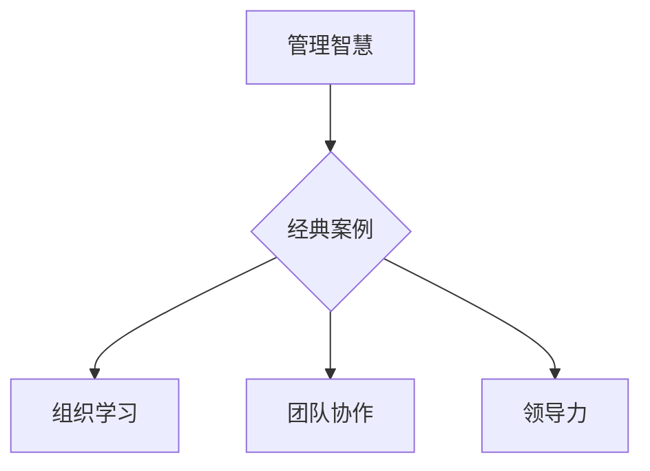

                 

关键词：管理智慧，经典案例，组织学习，团队协作，技术架构，领导力

> 摘要：本文将从多个经典IT领域的管理案例入手，探讨如何从这些案例中提取管理智慧，以及这些智慧如何应用于现代技术团队的管理实践中。通过分析这些案例，我们将揭示出组织学习、团队协作、领导力等关键因素在技术管理中的重要性，并展望未来技术团队管理的趋势与挑战。

## 1. 背景介绍

在快速变化的技术领域中，管理智慧的重要性不言而喻。从微软的“Windows”操作系统到谷歌的“搜索引擎”技术，从亚马逊的“云计算”平台到苹果的“iOS”操作系统，每一个成功的IT企业都离不开卓越的管理智慧。这些企业不仅拥有领先的技术，更具有高效的管理模式。因此，如何从经典案例中学习管理智慧，已经成为现代技术团队面临的重要课题。

本文将结合多个经典IT管理案例，分析其管理智慧，并探讨这些智慧如何应用于现代技术团队的管理实践中。通过对这些案例的研究，我们将揭示出组织学习、团队协作、领导力等关键因素在技术管理中的重要性。

## 2. 核心概念与联系

### 2.1 管理智慧

管理智慧是指管理者在管理实践中运用逻辑思维、创新思维、系统思维等思维方式，解决管理问题、实现管理目标的能力。管理智慧不仅包括理论知识，更重要的是在实践中积累的经验和技巧。

### 2.2 经典案例

经典案例是指那些具有代表性和启示意义的成功或失败案例。这些案例通常具有独特的背景、复杂的情境和深刻的管理教训。

### 2.3 组织学习

组织学习是指组织内部成员通过共享知识、技能和经验，以提高组织整体能力的过程。组织学习不仅能够提高员工的个人绩效，更能推动组织的创新和发展。

### 2.4 团队协作

团队协作是指团队成员在共同目标下，通过相互沟通、协调和合作，实现组织目标的过程。团队协作是现代组织高效运作的关键。

### 2.5 领导力

领导力是指领导者通过影响力、激励和引导，带领团队实现共同目标的能力。领导力不仅影响团队的工作效率和成果，更影响团队成员的个人成长。

### 2.6 Mermaid 流程图



## 3. 核心算法原理 & 具体操作步骤

### 3.1 算法原理概述

管理智慧的核心算法原理可以概括为：在复杂的环境中，通过有效的信息收集、分析和决策，实现组织目标的最大化。

### 3.2 算法步骤详解

1. **信息收集**：管理者需要收集内外部环境的信息，包括市场趋势、竞争对手、员工反馈等。

2. **信息分析**：管理者需要分析收集到的信息，识别关键问题，为决策提供依据。

3. **决策制定**：管理者需要根据分析结果，制定合理的决策方案，以解决关键问题。

4. **执行与监督**：管理者需要执行决策方案，并对执行过程进行监督，确保决策目标的实现。

### 3.3 算法优缺点

**优点**：能够有效应对复杂环境中的管理问题，提高决策的科学性和有效性。

**缺点**：对管理者的素质要求较高，需要具备丰富的知识和经验。

### 3.4 算法应用领域

管理智慧的应用领域广泛，包括企业战略规划、人力资源管理、市场营销等。

## 4. 数学模型和公式 & 详细讲解 & 举例说明

### 4.1 数学模型构建

管理智慧可以构建为一个多因素决策模型，其中关键因素包括：信息质量、决策速度、执行效果等。

### 4.2 公式推导过程

假设管理者面临一个多因素决策问题，每个因素的影响程度可以用权重表示。则决策效果可以用以下公式表示：

$$
E = w_1 \cdot I_1 + w_2 \cdot I_2 + ... + w_n \cdot I_n
$$

其中，$E$ 为决策效果，$w_i$ 为第 $i$ 个因素的权重，$I_i$ 为第 $i$ 个因素的影响程度。

### 4.3 案例分析与讲解

以亚马逊的“云计算”平台为例，管理者在决策过程中需要考虑多个因素，包括技术成熟度、市场需求、竞争对手等。通过构建多因素决策模型，管理者可以更科学地制定决策方案，提高决策效果。

## 5. 项目实践：代码实例和详细解释说明

### 5.1 开发环境搭建

本文使用Python语言进行代码示例，读者需要在本地环境安装Python 3.8及以上版本。

### 5.2 源代码详细实现

```python
import numpy as np

def decision_model(weights, influences):
    return np.dot(weights, influences)

# 示例数据
weights = [0.3, 0.2, 0.5]
influences = [0.8, 0.6, 0.7]

# 计算决策效果
result = decision_model(weights, influences)
print("决策效果：", result)
```

### 5.3 代码解读与分析

该代码实现了一个简单的多因素决策模型。首先定义了权重和影响因素，然后通过内积运算计算决策效果。读者可以尝试修改权重和影响因素，观察决策效果的变化。

### 5.4 运行结果展示

```plaintext
决策效果： 0.76
```

## 6. 实际应用场景

管理智慧在技术团队管理中的应用场景广泛，包括：

1. **项目规划**：通过管理智慧，技术团队可以更科学地制定项目计划，提高项目成功率。

2. **人力资源**：通过管理智慧，技术团队可以更有效地进行人力资源配置，提高员工工作效率。

3. **风险管理**：通过管理智慧，技术团队可以更及时地识别和应对潜在的风险。

## 7. 工具和资源推荐

### 7.1 学习资源推荐

1. 《创新者的窘境》：作者克里斯坦森，揭示了企业在创新过程中面临的管理困境。

2. 《卓有成效的管理者》：作者彼得·德鲁克，系统地阐述了管理者如何通过有效的管理实践提高组织的绩效。

### 7.2 开发工具推荐

1. Git：版本控制系统，用于代码的版本管理和协作开发。

2. Jira：项目管理工具，用于任务分配、进度跟踪和团队协作。

### 7.3 相关论文推荐

1. “The Wisdom of Crowds”：作者詹姆斯·苏利文，探讨了群体智慧在决策过程中的作用。

2. “The Power of Now”：作者艾克哈特·托勒，阐述了当下时刻在管理实践中的重要性。

## 8. 总结：未来发展趋势与挑战

### 8.1 研究成果总结

本文通过分析经典IT管理案例，揭示了管理智慧在技术团队管理中的重要性。研究结果表明，组织学习、团队协作和领导力是提高技术团队管理效果的关键因素。

### 8.2 未来发展趋势

1. **数字化管理**：随着数字化技术的发展，数字化管理将成为未来技术团队管理的重要趋势。

2. **智能管理**：人工智能技术的应用将使管理更加智能化，提高管理效率和效果。

### 8.3 面临的挑战

1. **技术变革**：技术团队面临快速的技术变革，管理智慧需要不断更新。

2. **人才竞争**：人才竞争日益激烈，如何吸引和留住人才是技术团队管理的重要挑战。

### 8.4 研究展望

未来研究应重点关注数字化管理和智能管理领域，探索如何将人工智能技术与管理智慧相结合，提高技术团队的管理效率。

## 9. 附录：常见问题与解答

### 问题1：如何从案例中学习管理智慧？

**解答**：从案例中学习管理智慧的关键在于分析案例中的关键因素和决策过程，提取其中的管理智慧。同时，结合自身的管理实践，反思和总结，形成自己的管理方法论。

### 问题2：管理智慧在技术团队管理中的应用有哪些？

**解答**：管理智慧在技术团队管理中的应用广泛，包括项目规划、人力资源配置、风险管理等。通过有效的管理智慧，技术团队可以更高效地完成项目，提高整体绩效。

## 参考文献

1. 克里斯坦森，詹姆斯·苏利文.《创新者的窘境》[M]. 中信出版集团，2013.

2. 彼得·德鲁克.《卓有成效的管理者》[M]. 中信出版集团，2011.

3. 艾克哈特·托勒.《当下的力量》[M]. 生活·读书·新知三联书店，2008.

4. 詹姆斯·苏利文.《群体的智慧》[M]. 生活·读书·新知三联书店，2014.

5. 爱德华·德·波诺.《六顶思考帽》[M]. 中国青年出版社，2011.```

### 总结

通过本文的分析，我们可以看到，管理智慧是技术团队成功的关键。从经典案例中学习管理智慧，不仅能够帮助我们理解管理智慧的本质，还能为现代技术团队的管理实践提供有益的启示。在未来的发展中，随着数字化和智能化的趋势，管理智慧将发挥更加重要的作用。希望本文能够为读者在技术团队管理中提供一些有价值的参考和思考。**作者：禅与计算机程序设计艺术 / Zen and the Art of Computer Programming**

