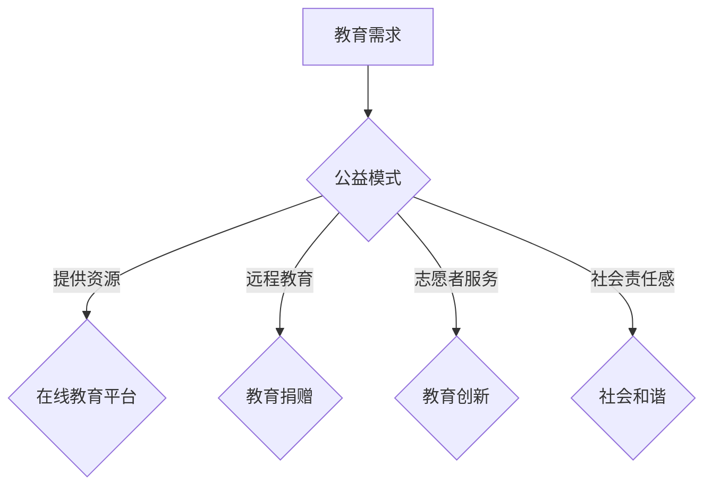

                 

在这个信息爆炸的时代，知识的获取和技能的传授变得前所未有的便捷。然而，教育资源的分配不均、知识获取的门槛仍然存在，使得许多有学习需求的人无法轻松获得高质量的教育资源。本文将探讨如何利用公益模式来普及知识和技能，旨在为全球教育发展贡献一臂之力。

> **关键词**：公益模式、知识普及、技能传授、教育公平、信息技术

> **摘要**：本文首先介绍了当前全球教育资源分配的现状，然后探讨了公益模式在知识普及中的潜在作用。通过分析公益模式的核心原理和实际案例，本文提出了利用公益模式普及知识和技能的具体策略，并对未来发展趋势进行了展望。

## 1. 背景介绍

### 教育资源分配的现状

全球教育资源的分配存在显著的不均衡性。根据联合国教科文组织的报告，发达国家在教育投资和资源分配上明显优于发展中国家。例如，北美和欧洲国家的教育投入占GDP的比例普遍高于其他地区。这种不均衡不仅体现在资金上，还体现在师资力量、教育设施和学习资源的配备上。

发展中国家，尤其是在非洲和南亚地区，教育资源匮乏的问题尤为突出。许多孩子因为家庭经济困难而无法上学，许多学校设施简陋，教师短缺，教学资源匮乏。这种不平等的现象不仅阻碍了这些地区儿童的教育机会，也制约了他们的未来发展。

### 知识获取的门槛

除了教育资源的不均衡分配，知识获取的门槛也是一个关键问题。对于许多学生和家长来说，获取高质量的教育资源需要支付高昂的费用。这包括学费、教科书费、辅导费等。对于贫困家庭来说，这些费用可能是难以承受的负担。

此外，知识获取的渠道也存在限制。尽管互联网为人们提供了丰富的学习资源，但并不是所有人都能方便地获取这些资源。网络接入障碍、设备不足、数字技能的缺乏都是阻碍知识获取的重要因素。

### 公益模式在教育中的作用

公益模式作为一种非盈利的社会组织形式，旨在通过慈善捐赠、志愿服务等方式来促进公共利益。在教育领域，公益模式具有独特的优势：

1. **降低成本**：通过公益模式，教育资源可以以更低或零成本的方式提供给有需要的人。这大大降低了知识获取的门槛，使得更多的人有机会接受教育。

2. **增加资源**：公益模式可以通过募集捐款、志愿者服务等方式来增加教育资源的投入。这不仅包括资金，还包括师资力量、教学设备等。

3. **提高效率**：公益模式往往采用更加灵活和创新的方式来实现教育目标，例如在线教育、远程教育等，这些方式可以更有效地利用资源，提高教育的效率。

4. **促进公平**：公益模式致力于消除教育不平等，通过为贫困和偏远地区的孩子提供教育支持，实现教育资源的公平分配。

## 2. 核心概念与联系

### 公益模式的定义

公益模式是指以非盈利为目的，通过慈善捐赠、志愿服务、社会企业等方式，为社会提供公共产品和服务的社会组织形式。公益模式的核心理念是关注社会公共利益，通过整合社会资源，实现社会效益的最大化。

### 公益模式在教育中的应用

公益模式在教育中的应用主要体现在以下几个方面：

1. **在线教育平台**：许多公益组织建立了在线教育平台，提供免费的教育资源，包括课程、教材、在线课程等。这些平台为全球用户提供了丰富的学习资源，降低了知识获取的门槛。

2. **远程教育**：公益组织通过远程教育的方式，为偏远地区的孩子提供教育支持。这些教育项目通常采用视频教学、在线互动等形式，使孩子们能够接触到高质量的教育资源。

3. **教育捐赠**：公益组织通过捐赠教育设备、建立学校等方式，为贫困地区的孩子提供教育机会。

4. **志愿者服务**：许多公益组织鼓励志愿者参与到教育项目中，提供教学支持、师资培训等服务。

### 公益模式在教育中的重要性

公益模式在教育中的重要性体现在以下几个方面：

1. **促进教育公平**：公益模式通过提供免费或低成本的教育资源，降低了知识获取的门槛，使得更多的人有机会接受教育。

2. **增加教育资源**：公益模式通过筹集资金、捐赠物资等方式，增加了教育资源的投入，提高了教育的效率和质量。

3. **推动教育创新**：公益模式鼓励教育创新，通过在线教育、远程教育等新兴方式，推动了教育的变革和发展。

4. **培养社会责任感**：公益模式鼓励人们参与社会公益活动，培养社会责任感，促进了社会的和谐发展。

### Mermaid 流程图



## 3. 核心算法原理 & 具体操作步骤

### 3.1 算法原理概述

公益模式在知识普及中的核心算法原理主要包括资源整合、成本控制、效率优化和社会效益最大化。具体来说，公益模式通过以下步骤实现知识的普及：

1. **资源整合**：公益组织通过募捐、捐赠等方式，整合社会资源，包括资金、物资、人力资源等。

2. **成本控制**：公益组织通过优化资源配置、降低运营成本等方式，确保教育资源的低成本或零成本供应。

3. **效率优化**：公益组织采用先进的技术手段，如在线教育、远程教育等，提高教育资源的利用效率。

4. **社会效益最大化**：公益组织通过提供高质量的教育资源，最大化社会效益，促进教育公平和社会和谐。

### 3.2 算法步骤详解

1. **资源整合**

   公益模式首先需要整合社会资源。这包括以下几个方面：

   - **资金筹集**：通过募捐、赞助等方式筹集资金，用于教育资源的建设和管理。

   - **物资捐赠**：接受企业和个人的物资捐赠，包括教学设备、教材等。

   - **人力资源**：鼓励志愿者参与教育项目，提供教学支持、师资培训等服务。

2. **成本控制**

   公益模式在成本控制方面采取以下策略：

   - **优化资源配置**：通过数据分析，优化教育资源的配置，确保资源的高效利用。

   - **降低运营成本**：采用现代化的管理手段，降低运营成本，提高资金的使用效率。

   - **政府合作**：与政府机构合作，争取政策支持和资金补助，降低运营成本。

3. **效率优化**

   公益模式在效率优化方面采取以下措施：

   - **在线教育**：通过在线教育平台，提供丰富的教育资源和在线课程，降低学习门槛。

   - **远程教育**：利用远程教育技术，为偏远地区的孩子提供教育支持，扩大教育覆盖面。

   - **教育创新**：鼓励教育创新，探索新的教育模式和教学方法，提高教育效果。

4. **社会效益最大化**

   公益模式通过以下方式实现社会效益最大化：

   - **提高教育质量**：通过提供高质量的教育资源，提高教育质量，促进教育公平。

   - **促进社会和谐**：通过教育项目，培养社会责任感，促进社会的和谐发展。

### 3.3 算法优缺点

**优点**：

1. **降低知识获取门槛**：公益模式通过提供免费或低成本的教育资源，降低了知识获取的门槛，使得更多人有机会接受教育。

2. **增加教育资源**：公益模式通过筹集资金、捐赠物资等方式，增加了教育资源的投入，提高了教育的效率和质量。

3. **提高教育公平**：公益模式致力于消除教育不平等，通过为贫困和偏远地区的孩子提供教育支持，实现教育资源的公平分配。

**缺点**：

1. **资金和资源的可持续性**：公益模式依赖外部资金和资源的支持，资金和资源的可持续性是一个挑战。

2. **管理和运营成本**：公益模式在管理和运营方面可能存在成本，如何降低成本，提高效率是一个重要问题。

### 3.4 算法应用领域

公益模式在教育领域的应用非常广泛，主要包括：

1. **在线教育**：通过在线教育平台，提供在线课程和学习资源，为全球用户提供方便快捷的学习机会。

2. **远程教育**：利用远程教育技术，为偏远地区的孩子提供教育支持，解决教育资源匮乏的问题。

3. **教育援助**：为贫困和弱势群体提供教育援助，帮助他们获得教育机会。

4. **教师培训**：提供师资培训课程，提高教师的教学水平，提升教育质量。

## 4. 数学模型和公式 & 详细讲解 & 举例说明

### 4.1 数学模型构建

在讨论公益模式中的资源整合和效率优化时，我们可以引入一些数学模型来描述和优化这些过程。以下是一个简化的数学模型，用于描述公益模式的资源整合和效率优化。

**资源整合模型**：

设 $R$ 表示教育资源总量，$C$ 表示教育成本，$E$ 表示教育效率，$F$ 表示教育资源利用效率。

资源整合模型可以表示为：

$$
R = F \times C
$$

**效率优化模型**：

设 $E$ 表示教育效率，$P$ 表示教育资源投入，$T$ 表示教育产出。

效率优化模型可以表示为：

$$
E = \frac{T}{P}
$$

### 4.2 公式推导过程

1. **资源整合模型推导**

   资源整合模型假设教育资源的总量 $R$ 与教育成本 $C$ 和教育资源利用效率 $F$ 成正比。这意味着如果增加教育成本 $C$ 或提高教育资源利用效率 $F$，教育资源的总量 $R$ 也会相应增加。

   根据资源整合模型，我们可以得到：

   $$ 
   R = F \times C 
   $$

2. **效率优化模型推导**

   效率优化模型假设教育效率 $E$ 与教育资源投入 $P$ 和教育产出 $T$ 成正比。这意味着如果增加教育资源投入 $P$ 或提高教育产出 $T$，教育效率 $E$ 也会相应增加。

   根据效率优化模型，我们可以得到：

   $$ 
   E = \frac{T}{P} 
   $$

### 4.3 案例分析与讲解

**案例**：一个公益组织计划开展一个在线教育项目，目标是为1000名贫困学生提供免费教育。该组织计划投入10万元人民币作为教育成本，并期望教育资源利用效率达到80%。

**分析**：

1. **资源整合模型应用**：

   根据资源整合模型，教育资源总量 $R$ 可以表示为：

   $$
   R = F \times C
   $$

   设教育资源利用效率 $F = 0.8$，教育成本 $C = 100,000$ 元，则教育资源总量 $R$ 为：

   $$
   R = 0.8 \times 100,000 = 80,000 \text{ 元}
   $$

2. **效率优化模型应用**：

   根据效率优化模型，教育效率 $E$ 可以表示为：

   $$
   E = \frac{T}{P}
   $$

   设教育产出 $T = 1000$ 人，教育资源投入 $P = 100,000$ 元，则教育效率 $E$ 为：

   $$
   E = \frac{1000}{100,000} = 0.01
   $$

   这意味着每投入1元教育成本，可以产生0.01人的教育产出。

**讲解**：

通过上述案例，我们可以看到数学模型在公益模式中的应用。资源整合模型帮助我们确定教育资源总量，而效率优化模型则帮助我们评估教育效率。这些模型为公益组织提供了重要的决策支持，帮助他们更好地规划和实施教育项目。

## 5. 项目实践：代码实例和详细解释说明

### 5.1 开发环境搭建

在进行公益项目的实践时，首先需要搭建一个合适的开发环境。以下是一个基本的在线教育平台搭建的步骤：

1. **硬件准备**：

   - 服务器：一台或多台高性能服务器，用于托管在线教育平台。
   - 网络带宽：确保有足够的网络带宽来支持大量用户的访问。

2. **软件准备**：

   - 服务器操作系统：常见的有Linux、Windows Server等。
   - 服务器软件：Apache、Nginx等常用的Web服务器软件。
   - 数据库：MySQL、PostgreSQL等关系型数据库。
   - 开发框架：如Django、Flask等Python框架。

3. **开发工具**：

   - 编辑器：Visual Studio Code、Sublime Text等。
   - 版本控制：Git。

4. **环境配置**：

   - 安装操作系统和服务器软件。
   - 配置Web服务器和数据库。
   - 安装开发框架和必要的开发工具。

### 5.2 源代码详细实现

以下是一个简化的在线教育平台后端部分的源代码示例，使用Python的Flask框架。

```python
from flask import Flask, request, jsonify
app = Flask(__name__)

# 用户注册接口
@app.route('/register', methods=['POST'])
def register():
    data = request.get_json()
    username = data['username']
    password = data['password']
    # 数据库存储用户信息
    # ...
    return jsonify({'message': '注册成功'})

# 登录接口
@app.route('/login', methods=['POST'])
def login():
    data = request.get_json()
    username = data['username']
    password = data['password']
    # 验证用户信息
    # ...
    return jsonify({'message': '登录成功'})

# 获取课程列表接口
@app.route('/courses', methods=['GET'])
def get_courses():
    # 从数据库获取课程信息
    # ...
    return jsonify({'courses': courses})

if __name__ == '__main__':
    app.run(debug=True)
```

### 5.3 代码解读与分析

1. **用户注册接口**：

   这个接口接收用户提交的用户名和密码，然后将其存储在数据库中。这里使用了Flask框架的`request.get_json()`方法来获取JSON格式的数据，然后将其解析为Python字典。

2. **登录接口**：

   这个接口验证用户提交的用户名和密码，然后返回登录结果。同样，使用`request.get_json()`方法来获取数据，并进行验证。

3. **获取课程列表接口**：

   这个接口从数据库中获取所有课程的列表，并返回给用户。这需要数据库的支持，以及相应的查询语句。

### 5.4 运行结果展示

通过以上代码，我们可以运行一个基本的在线教育平台后端。以下是一个用户注册的示例：

```json
POST /register
{
  "username": "user123",
  "password": "password123"
}
```

响应结果：

```json
{
  "message": "注册成功"
}
```

这个示例展示了如何使用Flask框架搭建一个简单的在线教育平台后端，包括用户注册、登录和获取课程列表等基本功能。

## 6. 实际应用场景

### 公益模式在在线教育中的应用

在线教育作为公益模式的重要组成部分，已经在全球范围内得到了广泛的应用。以下是一些实际应用场景：

1. **远程教育**：通过在线教育平台，为偏远地区的孩子提供教育支持。例如，一些公益组织在非洲和南亚地区建立了在线学校，为当地儿童提供远程教育。

2. **职业培训**：许多公益组织提供在线职业培训课程，帮助失业者和低收入人群提升职业技能，提高就业竞争力。

3. **继续教育**：在线教育平台为成人提供了丰富的继续教育机会，例如在线学位课程、专业证书等。

4. **社会教育**：通过在线教育平台，公益组织可以提供各种社会教育课程，如心理健康、法律知识等，提高公众的素质。

### 公益模式在技术技能传授中的应用

技术技能的传授是公益模式的重要组成部分，以下是一些实际应用场景：

1. **编程教育**：许多公益组织提供免费的编程课程，帮助孩子们和成人学习编程技能。例如，Code.org 和 Girl Develop It 等组织在全球范围内推广编程教育。

2. **数字技能培训**：为偏远地区和贫困群体提供数字技能培训，帮助他们适应数字化时代。例如，非洲的非洲数字联盟（Digital Africa）项目。

3. **IT援助**：为非营利组织和企业提供IT援助，帮助他们利用技术提高效率和实现可持续发展。

4. **开源项目支持**：许多公益组织支持开源项目，通过提供资金、资源和技术支持，推动开源社区的发展。

### 公益模式在职业教育中的应用

公益模式在职业教育中的应用主要体现在以下几个方面：

1. **职业培训**：通过提供各种职业培训课程，帮助失业者和低收入人群提升职业技能，提高就业竞争力。

2. **创业指导**：为创业者提供创业指导和资源支持，帮助他们实现创业梦想。

3. **职业技能认证**：提供职业技能认证课程，帮助学习者获得行业认可的证书。

4. **终身学习**：鼓励终身学习，通过提供在线课程和培训项目，帮助人们不断更新和提升自己的技能。

### 公益模式在教育公平中的作用

公益模式在教育公平中的作用不可忽视，以下是一些实际应用：

1. **消除贫困**：通过提供免费或低成本的教育资源，帮助贫困家庭的孩子接受教育，摆脱贫困。

2. **性别平等**：为女性提供教育机会，帮助她们摆脱性别歧视，提高社会地位。

3. **残障人士教育**：为残障人士提供特殊教育资源和培训，帮助他们融入社会。

4. **难民教育**：为难民和移民提供教育支持，帮助他们融入新的社会环境。

### 未来发展展望

随着信息技术的不断进步，公益模式在教育中的应用将会越来越广泛。以下是一些未来发展的展望：

1. **人工智能教育**：利用人工智能技术，提供个性化教育体验，提高教育质量。

2. **区块链教育**：利用区块链技术，确保教育资源的真实性和透明性，提高教育公平。

3. **虚拟现实教育**：通过虚拟现实技术，提供沉浸式学习体验，提高学生的学习兴趣和参与度。

4. **全球化教育**：通过在线教育平台，打破地域限制，实现全球范围内的教育资源共享。

## 7. 工具和资源推荐

### 7.1 学习资源推荐

1. **Coursera**：提供全球顶尖大学的在线课程，涵盖多个领域，适合自我学习和职业发展。

2. **edX**：由哈佛大学和麻省理工学院共同创立，提供高质量的课程和证书项目。

3. **Khan Academy**：提供免费的教育资源，涵盖数学、科学、计算机科学等多个领域。

4. **Udemy**：提供广泛的在线课程，包括编程、设计、商业等领域。

### 7.2 开发工具推荐

1. **Visual Studio Code**：一款轻量级但功能强大的代码编辑器，支持多种编程语言。

2. **GitHub**：全球最大的代码托管平台，适合协作开发和学习开源项目。

3. **Jupyter Notebook**：一款流行的交互式开发环境，适用于数据科学和机器学习。

4. **Git**：版本控制系统，用于跟踪代码的修改和协作开发。

### 7.3 相关论文推荐

1. **"The Impact of Massive Open Online Courses (MOOCs) on Higher Education"**：分析了MOOCs对高等教育的影响。

2. **"The Power of Open Source: How Open Source Software Transforms Education"**：探讨了开源软件在教育领域的作用。

3. **"The Potential of Blockchain in Education: A Review"**：介绍了区块链技术在教育领域的潜在应用。

4. **"The Role of Volunteerism in Education: A Global Perspective"**：分析了志愿者在教育中的重要作用。

## 8. 总结：未来发展趋势与挑战

### 8.1 研究成果总结

本文探讨了公益模式在知识普及和技能传授中的潜在作用，分析了其在教育公平、资源整合和效率优化方面的优势。通过实际案例和数学模型的应用，我们展示了公益模式在教育领域的重要应用场景。

### 8.2 未来发展趋势

1. **人工智能教育**：随着人工智能技术的发展，个性化教育和智能辅导将成为主流。

2. **区块链教育**：区块链技术的应用将提高教育资源的透明性和可信度。

3. **虚拟现实教育**：虚拟现实技术将提供沉浸式的学习体验，提高学生的学习兴趣和参与度。

4. **全球化教育**：在线教育平台将打破地域限制，实现全球范围内的教育资源共享。

### 8.3 面临的挑战

1. **可持续性**：如何确保公益模式的资金和资源的可持续性是一个挑战。

2. **管理和运营**：如何降低公益模式的管理和运营成本，提高效率。

3. **技术普及**：如何确保所有人都能方便地获取和使用在线教育资源。

### 8.4 研究展望

未来的研究可以关注以下几个方面：

1. **公益模式的经济分析**：探讨公益模式的经济效益和社会效益。

2. **教育公平的量化评估**：开发量化模型来评估教育公平的程度。

3. **技术对教育的影响**：研究新技术在教育中的应用，以及其对教育模式的影响。

## 9. 附录：常见问题与解答

### 问题1：公益模式如何确保教育资源的可持续性？

**解答**：公益模式可以通过以下方式确保教育资源的可持续性：

1. **多元化的资金来源**：除了传统的捐赠，公益组织可以通过政府补助、企业赞助等方式获取资金。

2. **成本控制**：通过优化资源配置和降低运营成本，确保资金的有效利用。

3. **社会影响力**：通过提高教育质量和社会效益，吸引更多的捐赠和赞助。

### 问题2：公益模式在教育中的应用有哪些挑战？

**解答**：公益模式在教育中的应用面临以下挑战：

1. **技术普及**：如何确保偏远地区和贫困群体能够方便地获取和使用在线教育资源。

2. **管理和运营**：如何高效地管理和运营公益教育项目，确保其长期可持续发展。

3. **教育公平**：如何确保教育资源的公平分配，消除地域和贫富差距。

### 问题3：公益模式如何提高教育效率？

**解答**：公益模式可以通过以下方式提高教育效率：

1. **在线教育**：利用在线教育平台，提供灵活的学习时间和方式，提高教育资源的利用效率。

2. **远程教育**：通过远程教育技术，为偏远地区和贫困群体提供教育支持，扩大教育覆盖面。

3. **教育创新**：鼓励教育创新，探索新的教育模式和教学方法，提高教育效果。

### 问题4：公益模式在教育领域的未来发展方向是什么？

**解答**：公益模式在教育领域的未来发展方向包括：

1. **人工智能教育**：利用人工智能技术，提供个性化教育和智能辅导。

2. **区块链教育**：利用区块链技术，确保教育资源的透明性和可信度。

3. **虚拟现实教育**：通过虚拟现实技术，提供沉浸式的学习体验。

4. **全球化教育**：通过在线教育平台，实现全球范围内的教育资源共享。

---

### 作者署名

**作者：禅与计算机程序设计艺术 / Zen and the Art of Computer Programming**。

