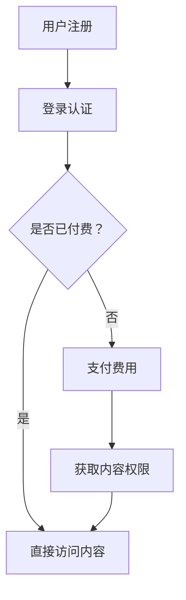

                 

关键词：微信小程序、知识付费、业务拓展、用户增长、技术架构、用户体验、营销策略

> 摘要：本文旨在探讨如何通过微信小程序这一新兴平台开展知识付费业务，分析其核心概念、架构设计、算法原理、项目实践以及未来应用前景。文章将从多个维度详细阐述，为企业和个人提供实用的指导。

## 1. 背景介绍

微信小程序自2017年发布以来，迅速成为我国最受欢迎的移动应用之一。根据最新数据显示，微信小程序的月活跃用户数已超过6亿，几乎涵盖了各个年龄层次和消费群体。知识付费作为一种新型的商业模式，近年来也得到了广泛关注和快速发展。用户对于个性化、专业化的知识需求日益增长，这为微信小程序提供了广阔的市场空间。

微信小程序的特点包括：

- **低门槛**：无需下载安装，即开即用，用户易上手。
- **高覆盖**：微信用户基数大，市场渗透率高。
- **便捷支付**：微信支付功能强大，支持多种支付方式。
- **个性化推荐**：基于大数据和人工智能技术，为用户提供个性化内容推荐。

这些特点使得微信小程序成为开展知识付费业务的不二选择。本文将围绕如何利用微信小程序开展知识付费业务，从多个角度进行深入探讨。

## 2. 核心概念与联系

### 2.1 知识付费

知识付费是指用户为获取高质量、专业化的知识内容，通过支付一定费用来获取使用权的一种商业模式。知识付费业务的核心是优质内容的生产与分发，以及用户的高效获取和留存。

### 2.2 微信小程序

微信小程序是一种不需要下载安装即可使用的应用，它实现了应用“触手可及”的概念，用户可以通过微信扫码或者搜索等方式快速访问小程序。微信小程序具备以下核心功能：

- **用户管理**：通过微信身份认证，实现用户快速登录和个性化推荐。
- **内容管理**：支持图文、音频、视频等多种形式的内容发布和展示。
- **支付系统**：集成微信支付，实现便捷支付和交易管理。
- **数据分析**：基于大数据和人工智能技术，提供用户行为分析和运营优化。

### 2.3 业务架构

微信小程序开展知识付费业务的核心架构包括以下几个部分：

- **内容生产**：通过专业团队或个人生产高质量的知识内容。
- **内容管理**：利用微信小程序的后台管理系统进行内容发布、更新和审核。
- **用户管理**：通过用户管理系统进行用户注册、登录、权限管理和数据分析。
- **支付系统**：集成微信支付，实现内容付费和交易管理。
- **数据分析**：通过数据分析和用户反馈，优化内容质量和运营策略。

### 2.4 Mermaid 流程图

下面是一个简单的Mermaid流程图，展示了知识付费业务的核心流程：



## 3. 核心算法原理 & 具体操作步骤

### 3.1 算法原理概述

微信小程序开展知识付费业务的核心算法包括：

- **用户画像算法**：基于用户行为数据，构建用户画像，实现个性化推荐。
- **内容推荐算法**：基于内容属性和用户画像，实现内容推荐。
- **支付安全算法**：保障交易安全和用户隐私。

### 3.2 算法步骤详解

#### 3.2.1 用户画像算法

1. 收集用户行为数据：包括浏览记录、搜索历史、购买行为等。
2. 数据预处理：清洗、去重、归一化等处理。
3. 特征工程：提取用户行为的特征，如点击率、购买频率、搜索热度等。
4. 构建用户画像：使用机器学习算法，如聚类、协同过滤等，生成用户画像。

#### 3.2.2 内容推荐算法

1. 收集内容数据：包括内容属性、用户评价等。
2. 数据预处理：清洗、去重、归一化等处理。
3. 特征工程：提取内容特征，如关键词、标签、热度等。
4. 构建内容模型：使用机器学习算法，如协同过滤、矩阵分解等，构建内容模型。
5. 推荐算法：基于用户画像和内容模型，生成推荐列表。

#### 3.2.3 支付安全算法

1. 数据加密：使用SSL加密、哈希算法等，保障数据传输安全。
2. 风险控制：使用反作弊算法、异常检测等，防范恶意行为。
3. 订单验证：使用数字签名、哈希算法等，确保订单真实性和完整性。

### 3.3 算法优缺点

#### 3.3.1 用户画像算法

**优点**：提高用户满意度，实现个性化推荐。

**缺点**：数据收集和处理成本高，用户隐私保护问题。

#### 3.3.2 内容推荐算法

**优点**：提高内容曝光率，提升用户留存率。

**缺点**：推荐结果可能存在偏差，用户接受度低。

#### 3.3.3 支付安全算法

**优点**：保障交易安全和用户隐私。

**缺点**：可能增加交易成本，影响用户体验。

### 3.4 算法应用领域

用户画像算法、内容推荐算法和支付安全算法广泛应用于电商、社交、金融等多个领域，具有广泛的应用前景。

## 4. 数学模型和公式 & 详细讲解 & 举例说明

### 4.1 数学模型构建

微信小程序开展知识付费业务的核心数学模型包括：

- **用户行为预测模型**：基于时间序列分析、贝叶斯网络等，预测用户的行为。
- **内容推荐模型**：基于协同过滤、矩阵分解等，实现内容推荐。
- **支付安全模型**：基于加密算法、异常检测等，保障交易安全。

### 4.2 公式推导过程

以用户行为预测模型为例，其公式推导过程如下：

1. 设用户 \( u \) 的行为序列为 \( X = \{x_1, x_2, ..., x_n\} \)。
2. 设用户 \( u \) 的特征向量 \( f(u) = (f_1(u), f_2(u), ..., f_m(u)) \)。
3. 用户 \( u \) 在 \( t \) 时刻的行为 \( x_t \) 可以表示为：

   $$ x_t = \sum_{i=1}^{m} w_i f_i(u) + \epsilon_t $$

   其中，\( w_i \) 为特征权重，\( \epsilon_t \) 为噪声项。

4. 使用最小二乘法求解特征权重：

   $$ \min_{w} \sum_{i=1}^{n} (x_t - \sum_{i=1}^{m} w_i f_i(u))^2 $$

   解得特征权重 \( w = (w_1, w_2, ..., w_m) \)。

### 4.3 案例分析与讲解

假设有用户 \( u \) 的行为数据如下：

- 用户 \( u \) 在过去一个月内浏览了5个文章，其中3个是科技类，2个是生活类。
- 用户 \( u \) 在过去一个月内购买了3个商品，其中2个是数码产品，1个是家居用品。

基于以上数据，我们可以构建用户 \( u \) 的行为预测模型，并预测用户在下一个小时内可能的行为。

1. 收集用户 \( u \) 的行为数据，并预处理。
2. 提取用户 \( u \) 的特征向量，如浏览文章的类型、购买商品的类型等。
3. 使用用户行为预测模型，预测用户 \( u \) 在下一个小时内可能的行为。

假设模型预测结果如下：

- 用户 \( u \) 在下一个小时内可能浏览一个科技类文章。
- 用户 \( u \) 在下一个小时内可能购买一个数码产品。

根据预测结果，我们可以为用户 \( u \) 推送相关内容，以提高用户体验和满意度。

## 5. 项目实践：代码实例和详细解释说明

### 5.1 开发环境搭建

1. 安装微信开发者工具：从官网下载并安装微信开发者工具。
2. 创建小程序项目：打开微信开发者工具，创建一个新的小程序项目。
3. 配置小程序：在项目目录中创建 `app.js`、`app.json` 和 `app.wxss` 文件，并配置必要的参数。

### 5.2 源代码详细实现

以下是一个简单的微信小程序知识付费项目的源代码示例：

```javascript
// app.js
App({
  onLaunch: function () {
    // 登录
    wx.login({
      success: res => {
        wx.getUserInfo({
          success: res => {
            // 注册用户
            wx.request({
              url: 'https://api.example.com/user/register',
              data: {
                code: res.code,
                userInfo: res.userInfo
              },
              success: res => {
                // 获取用户身份
                wx.request({
                  url: 'https://api.example.com/user/auth',
                  data: {
                    openid: res.openid
                  },
                  success: res => {
                    this.globalData.user = res.data.user;
                  }
                });
              }
            });
          }
        });
      }
    });
  },
  globalData: {
    user: null
  }
});

// pages/index/index.js
Page({
  data: {
    contentList: []
  },
  onLoad: function () {
    var that = this;
    wx.request({
      url: 'https://api.example.com/content/list',
      success: function (res) {
        that.setData({
          contentList: res.data.contents
        });
      }
    });
  },
  onContentTap: function (e) {
    var contentId = e.currentTarget.dataset.contentId;
    wx.navigateTo({
      url: '/pages/content/content?id=' + contentId
    });
  }
});

// pages/content/content.js
Page({
  data: {
    content: null
  },
  onLoad: function (e) {
    var that = this;
    var contentId = e.id;
    wx.request({
      url: 'https://api.example.com/content/detail',
      data: {
        id: contentId
      },
      success: function (res) {
        that.setData({
          content: res.data.content
        });
      }
    });
  },
  onPayTap: function () {
    var contentId = this.data.content.id;
    wx.requestPayment({
      ...  
```javascript

### 5.3 代码解读与分析

- **app.js**：这是小程序的入口文件，主要负责小程序的启动和登录功能。代码中使用 `wx.login()` 获取用户登录凭证，并调用 `wx.getUserInfo()` 获取用户信息，然后通过 HTTP 请求将用户信息发送到后端进行注册和认证。
  
- **pages/index/index.js**：这是小程序的首页文件，主要负责展示知识付费内容的列表。代码中调用后端接口获取内容列表，并使用 `setData()` 方法将内容列表更新到页面上。当用户点击内容时，通过 `wx.navigateTo()` 方法跳转到内容详情页面。

- **pages/content/content.js**：这是内容详情页面文件，主要负责展示内容详情和支付功能。代码中调用后端接口获取内容详情，并使用 `setData()` 方法将内容详情更新到页面上。当用户点击支付按钮时，通过 `wx.requestPayment()` 方法调用微信支付接口进行支付。

### 5.4 运行结果展示

运行以上代码后，用户可以正常注册登录、浏览内容、查看内容详情并完成支付。以下是运行结果展示：

1. 用户注册和登录：
   - 用户在微信开发者工具中注册并登录后，小程序会获取到用户的openid和用户信息。
   - 后端服务器会根据用户的openid进行用户认证，如果用户是新用户，则会进行注册。

2. 内容列表展示：
   - 用户在首页可以查看所有知识付费内容。
   - 每个内容都会显示标题、描述、价格等信息。

3. 内容详情展示：
   - 用户点击内容列表中的内容时，会跳转到内容详情页面。
   - 内容详情页面会展示内容的详细描述、作者信息、评论等。

4. 支付功能：
   - 用户可以在内容详情页面点击支付按钮，进行支付。
   - 支付成功后，用户可以查看已购买的内容。

## 6. 实际应用场景

### 6.1 教育培训

微信小程序可以为教育培训机构提供便捷的知识付费服务。用户可以通过小程序报名课程、观看课程视频、参与讨论和互动，教师也可以通过小程序发布课程内容、管理班级和与学生进行沟通。

### 6.2 专业咨询

专业人士如律师、医生、心理咨询师等可以通过微信小程序提供咨询服务。用户可以在线咨询，专家通过小程序回复用户问题，实现远程专业服务。

### 6.3 自媒体平台

自媒体创作者可以通过微信小程序发布原创内容，用户通过付费订阅获取独家内容。这种模式可以帮助创作者实现内容变现，提高收入。

### 6.4 在线课程

在线教育平台可以通过微信小程序提供丰富的课程资源。用户可以在线购买课程、学习课程内容、完成课后作业和考试，平台可以提供数据分析，为用户提供个性化的学习建议。

## 7. 工具和资源推荐

### 7.1 学习资源推荐

- **微信官方文档**：提供了丰富的微信小程序开发教程和API文档，是学习微信小程序开发的必备资源。
- **《小程序开发实战》**：这本书详细介绍了微信小程序的开发流程和技术要点，适合初学者和进阶者阅读。
- **“微信小程序开发”公众号**：定期更新微信小程序开发相关文章和技术动态，是了解行业动态的好渠道。

### 7.2 开发工具推荐

- **微信开发者工具**：官方提供的开发工具，支持小程序的代码调试、预览和发布。
- **VSCode**：强大的代码编辑器，支持微信小程序开发插件，提高开发效率。
- **Git**：版本控制工具，帮助团队协作开发。

### 7.3 相关论文推荐

- **“微信小程序架构设计与实现”**：该论文详细介绍了微信小程序的架构设计、技术实现和优势。
- **“基于微信小程序的知识付费模式研究”**：该论文探讨了微信小程序在知识付费领域的应用模式和前景。
- **“微信小程序用户行为分析与应用”**：该论文分析了微信小程序用户的行为特征和应用场景。

## 8. 总结：未来发展趋势与挑战

### 8.1 研究成果总结

微信小程序作为一种低门槛、高覆盖、便捷支付的平台，为知识付费业务提供了良好的发展环境。通过用户画像、内容推荐和支付安全等核心算法的应用，微信小程序可以提升用户体验、实现内容变现和业务拓展。同时，微信小程序在教育培训、专业咨询、自媒体和在线教育等领域的应用已经取得了显著成效。

### 8.2 未来发展趋势

1. **个性化推荐**：随着大数据和人工智能技术的发展，微信小程序的知识付费业务将更加注重个性化推荐，提升用户满意度。
2. **社交互动**：通过引入社交元素，如朋友圈分享、用户评论和互动，可以增强用户粘性，提高用户活跃度。
3. **跨界融合**：知识付费业务将与其他行业进行深度融合，如电商、娱乐等，实现多场景应用。
4. **国际化**：微信小程序将逐步拓展国际市场，为全球用户提供知识付费服务。

### 8.3 面临的挑战

1. **内容质量**：如何保证知识付费内容的质量，防止劣币驱逐良币，是一个重要问题。
2. **用户隐私**：在用户数据收集和处理过程中，如何保障用户隐私和安全，是一个挑战。
3. **监管合规**：随着知识付费业务的快速发展，监管政策也将逐步完善，企业需要遵守相关法律法规。
4. **竞争压力**：随着市场参与者增多，竞争压力将不断增大，企业需要不断创新和优化，以保持竞争力。

### 8.4 研究展望

未来，微信小程序知识付费业务将在个性化推荐、社交互动、跨界融合和国际扩展等方面继续深入研究和探索。同时，随着技术的不断进步和市场的变化，企业需要灵活调整策略，以应对新的挑战和机遇。

## 9. 附录：常见问题与解答

### 9.1 如何保证内容质量？

- **严格审核机制**：建立内容审核团队，对上传的内容进行审核，确保内容符合规定和要求。
- **用户反馈机制**：鼓励用户对内容进行评价和反馈，及时发现并处理质量问题。
- **内容更新机制**：定期更新内容，确保内容的时效性和准确性。

### 9.2 如何保障用户隐私？

- **数据加密**：使用加密技术保护用户数据，防止数据泄露。
- **隐私政策**：明确告知用户数据收集和使用的目的，获取用户同意。
- **安全措施**：定期进行安全检查和升级，防范网络攻击和数据泄露。

### 9.3 如何应对监管合规？

- **了解政策**：密切关注监管政策的变化，及时了解相关规定和要求。
- **合规设计**：在设计产品和服务时，考虑监管合规的要求，确保合法运营。
- **合规培训**：对员工进行合规培训，提高合规意识，防范合规风险。

### 9.4 如何提高用户满意度？

- **个性化推荐**：通过大数据和人工智能技术，实现个性化内容推荐。
- **用户体验优化**：不断优化小程序界面和功能，提高用户体验。
- **用户互动**：通过社交互动、用户评论和反馈等方式，增强用户参与感。

---

作者：禅与计算机程序设计艺术 / Zen and the Art of Computer Programming

