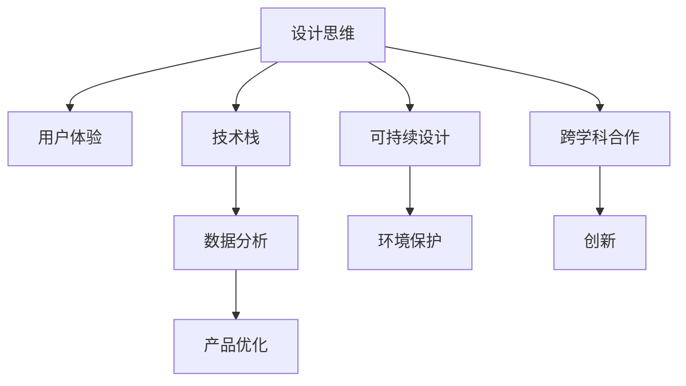

                 

  
## 1. 背景介绍

在当今数字化时代，技术已经成为了产品设计过程中不可或缺的一部分。随着计算机科学的不断发展，我们拥有越来越多的工具和方法来帮助产品设计师创造出更加优秀和高效的产品。然而，如何将这些技术能力有效地转化为产品设计的过程中，依然是一个挑战。本文将探讨如何利用技术能力进行产品设计，帮助设计师们更好地理解和应用技术，从而提升产品的质量和用户体验。

### 文章关键词：

- 技术能力
- 产品设计
- 设计流程
- 用户体验
- 技术应用

### 文章摘要：

本文旨在探讨技术能力在产品设计中的应用。我们将从背景介绍出发，介绍技术能力在产品设计中的重要性，然后深入探讨核心概念、算法原理、数学模型、项目实践和实际应用场景。最后，我们将对工具和资源进行推荐，并总结未来发展趋势和挑战，为读者提供全面的指导。

## 2. 核心概念与联系

在设计产品时，技术能力不仅仅是一个工具，它更是一种思维方式和工具选择的能力。以下是几个核心概念及其之间的联系：

### 2.1. 设计思维与用户体验

设计思维是一种以用户为中心的思考方式，它强调在产品开发过程中持续关注用户的需求和体验。用户体验（UX）设计则是在设计思维指导下，通过视觉、交互和功能设计来提升用户对产品的满意度和使用效果。

### 2.2. 技术栈与工具选择

技术栈是指设计师和开发者需要掌握的一系列编程语言、框架和工具。合理选择和掌握技术栈，能够提高工作效率，实现设计创意。

### 2.3. 数据分析与产品优化

数据分析是现代产品设计的重要工具，通过收集和分析用户数据，可以更好地理解用户行为，从而进行产品优化和改进。

### 2.4. 可持续设计与环境保护

可持续设计是一种关注环境和社会影响的设计方法，通过减少资源消耗、优化材料选择和设计生命周期，实现可持续发展。

### 2.5. 跨学科合作与创新

跨学科合作能够汇集不同领域的知识和技能，促进创新。在产品设计中，技术能力可以与其他学科如心理学、社会学等相结合，创造出更加符合用户需求和社会期望的产品。

### 2.6. Mermaid 流程图

以下是一个简单的 Mermaid 流程图，展示了核心概念之间的联系：



### 2.7. 结论

通过上述核心概念及其联系的介绍，我们可以看到技术能力在产品设计中的重要性。理解这些概念及其相互关系，将为后续的讨论打下坚实的基础。

## 3. 核心算法原理 & 具体操作步骤

### 3.1 算法原理概述

在产品设计过程中，算法原理的应用至关重要。以下是几个常见算法原理及其在产品设计中的应用：

#### 3.1.1. 用户行为预测

用户行为预测算法可以帮助我们了解用户在产品中的行为模式，从而进行个性化推荐和优化。常见的方法包括机器学习中的决策树、随机森林和神经网络等。

#### 3.1.2. 交互设计优化

交互设计优化算法用于提升用户在产品中的操作体验。常见的优化方法包括A/B测试和启发式评价。

#### 3.1.3. 数据可视化

数据可视化算法可以将复杂的数据以直观的方式呈现给用户，帮助用户更好地理解和分析数据。常见的方法包括散点图、折线图和饼图等。

### 3.2 算法步骤详解

#### 3.2.1. 用户行为预测

1. 数据收集：收集用户在产品中的行为数据，如点击、浏览和搜索等。
2. 数据预处理：对数据进行清洗、转换和归一化等处理，以便后续分析。
3. 特征工程：提取有助于预测用户行为的特征，如用户年龄、性别、地理位置等。
4. 模型选择：选择合适的机器学习模型，如决策树、随机森林和神经网络等。
5. 模型训练：使用训练数据对模型进行训练。
6. 模型评估：使用测试数据对模型进行评估，如准确率、召回率和F1值等。
7. 预测与应用：使用训练好的模型对用户行为进行预测，并根据预测结果进行产品优化。

#### 3.2.2. 交互设计优化

1. 定义优化目标：明确优化目标，如提高用户操作速度、降低用户犯错率等。
2. 设计实验方案：设计A/B测试或启发式评价实验，以验证不同设计方案的效果。
3. 数据收集与处理：收集实验数据，并对数据进行预处理和分析。
4. 结果分析：分析实验结果，比较不同设计方案的优劣。
5. 设计优化：根据实验结果进行设计优化，以实现优化目标。

#### 3.2.3. 数据可视化

1. 数据准备：准备好需要可视化的数据。
2. 选择可视化方法：根据数据类型和可视化目标选择合适的可视化方法，如散点图、折线图和饼图等。
3. 设计可视化布局：设计可视化布局，以便用户更好地理解和分析数据。
4. 实现可视化：使用可视化工具或库（如D3.js、ECharts等）实现可视化效果。
5. 验证与优化：验证可视化效果，并根据用户反馈进行优化。

### 3.3 算法优缺点

#### 3.3.1. 用户行为预测

优点：

- 能够帮助产品设计师更好地了解用户需求和行为模式。
- 支持个性化推荐和优化，提高用户体验。

缺点：

- 需要大量的数据和计算资源。
- 模型泛化能力可能有限。

#### 3.3.2. 交互设计优化

优点：

- 能够通过实验验证不同设计方案的效果，提高设计质量。
- 支持快速迭代和改进。

缺点：

- 可能需要较长时间的数据收集和分析。
- 实验结果可能受到外部因素的影响。

#### 3.3.3. 数据可视化

优点：

- 能够将复杂的数据以直观的方式呈现给用户。
- 增强用户对数据的理解和分析能力。

缺点：

- 可视化方法的选择和设计可能比较复杂。
- 可视化效果可能受到数据质量和数据类型的限制。

### 3.4 算法应用领域

用户行为预测、交互设计优化和数据可视化算法在产品设计中的应用非常广泛，以下是一些具体的应用领域：

- 电子商务：个性化推荐、购物车优化、广告投放优化等。
- 社交媒体：用户行为分析、内容推荐、社区管理等。
- 娱乐行业：游戏设计、音乐推荐、电影推荐等。
- 医疗健康：患者数据分析、医疗设备设计、健康监测等。

## 4. 数学模型和公式 & 详细讲解 & 举例说明

在产品设计过程中，数学模型和公式可以帮助我们更好地理解和分析数据，从而优化产品设计。以下是几个常见的数学模型和公式，以及它们的详细讲解和举例说明。

### 4.1 数学模型构建

#### 4.1.1. 逻辑回归

逻辑回归是一种广泛应用于分类问题的统计模型，它可以用来预测某个事件发生的概率。假设我们有一个二分类问题，其中 \(y\) 是结果变量，它可以取两个值 \(0\) 或 \(1\)。我们用 \(x_1, x_2, ..., x_n\) 表示影响结果的 \(n\) 个自变量。逻辑回归模型的公式如下：

$$
P(y=1) = \frac{1}{1 + e^{-(\beta_0 + \beta_1 x_1 + \beta_2 x_2 + ... + \beta_n x_n})}
$$

其中，\(\beta_0, \beta_1, ..., \beta_n\) 是模型的参数，可以通过最大似然估计或梯度下降等方法进行估计。

#### 4.1.2. 决策树

决策树是一种常用的机器学习模型，它可以用来分类或回归。一个简单的决策树模型可以表示为：

$$
T = \sum_{i=1}^{n} w_i T_i
$$

其中，\(T_i\) 是基于第 \(i\) 个特征划分的子树，\(w_i\) 是该子树的权重。

#### 4.1.3. 神经网络

神经网络是一种模拟人脑神经元结构的计算模型，它可以用于分类、回归和其他复杂任务。一个简单的神经网络模型可以表示为：

$$
y = \sigma(\sum_{i=1}^{n} w_i \cdot x_i + b)
$$

其中，\(\sigma\) 是激活函数，\(w_i\) 和 \(b\) 是模型的参数。

### 4.2 公式推导过程

#### 4.2.1. 逻辑回归

逻辑回归的推导过程基于最大似然估计。假设我们有 \(m\) 个样本，每个样本的观测值为 \(y^m\) 和 \(x^m_1, x^m_2, ..., x^m_n\)。似然函数可以表示为：

$$
L(\theta) = \prod_{m=1}^{m} P(y^m = 1 | x^m) \cdot (1 - P(y^m = 1 | x^m))
$$

对数似然函数为：

$$
l(\theta) = \sum_{m=1}^{m} \log P(y^m = 1 | x^m) + \log (1 - P(y^m = 1 | x^m))
$$

为了最大化对数似然函数，我们对参数 \(\theta\) 求导并令其等于0，可以得到：

$$
\frac{\partial l(\theta)}{\partial \theta} = \sum_{m=1}^{m} (y^m - P(y^m = 1 | x^m)) = 0
$$

这是一个关于 \(\theta\) 的线性方程组，可以通过求解该方程组得到参数的估计值。

#### 4.2.2. 决策树

决策树的一般推导过程基于信息增益和基尼不纯度。假设我们有 \(n\) 个样本，每个样本属于 \(c\) 个类别之一。信息增益（IG）可以表示为：

$$
IG(D, A) = entropy(D) - \sum_{v \in A} \frac{|D_v|}{|D|} entropy(D_v)
$$

其中，\(D\) 是样本集合，\(A\) 是特征集合，\(entropy(D)\) 是 \(D\) 的熵，\(entropy(D_v)\) 是 \(D_v\) 的熵。

基尼不纯度（Gini impurity）可以表示为：

$$
Gini(D) = 1 - \sum_{v \in A} \frac{|D_v|}{|D|} \cdot \frac{|D_v| - 1}{|D_v|}
$$

在决策树中，我们选择具有最大信息增益或最小基尼不纯度的特征进行划分。

#### 4.2.3. 神经网络

神经网络的一般推导过程基于前向传播和反向传播。假设我们有 \(n\) 个训练样本，每个样本包含 \(m\) 个特征和一个目标值。神经网络的输出可以表示为：

$$
y = \sigma(\sum_{i=1}^{n} w_i \cdot x_i + b)
$$

其中，\(w_i\) 是权重，\(b\) 是偏置，\(\sigma\) 是激活函数。

在训练过程中，我们通过前向传播计算预测值，然后通过反向传播计算损失函数关于权重的梯度。梯度下降是一种常用的优化方法，可以用来更新权重和偏置。

### 4.3 案例分析与讲解

#### 4.3.1. 逻辑回归案例

假设我们要预测一个人是否患有心脏病，特征包括年龄、血压和胆固醇水平。使用逻辑回归模型，我们可以构建以下公式：

$$
P(\text{心脏病} = 1 | \text{年龄}, \text{血压}, \text{胆固醇}) = \frac{1}{1 + e^{-(\beta_0 + \beta_1 \text{年龄} + \beta_2 \text{血压} + \beta_3 \text{胆固醇})}}
$$

通过训练数据和优化算法，我们可以得到参数 \(\beta_0, \beta_1, \beta_2, \beta_3\) 的估计值。然后，我们可以使用这个模型对新的样本进行预测。

#### 4.3.2. 决策树案例

假设我们要分类一群动物，特征包括体重、翅膀长度和尾巴长度。使用决策树模型，我们可以构建以下决策树：

```
- 体重 > 100 ? 是鸟 : 是兽
- 是鸟 ? 翅膀长度 > 10 ? 是鸟1 : 是鸟2
- 是兽 ? 尾巴长度 > 5 ? 是兽1 : 是兽2
```

根据输入的特征值，我们可以通过决策树进行分类。

#### 4.3.3. 神经网络案例

假设我们要预测一个股票的未来价格，特征包括股票历史价格、市场指数和宏观经济指标。使用神经网络模型，我们可以构建以下公式：

$$
y = \sigma(\sum_{i=1}^{n} w_i \cdot x_i + b)
$$

通过训练数据和优化算法，我们可以得到权重 \(w_i\) 和偏置 \(b\) 的估计值。然后，我们可以使用这个模型对新的样本进行预测。

### 4.4. 数学模型与产品设计

数学模型和公式在产品设计中的应用非常广泛。以下是一些具体的例子：

- 用户体验分析：使用逻辑回归模型预测用户在产品中的行为，帮助设计师了解用户需求和行为模式。
- 交互设计优化：使用决策树模型分析不同设计方案的优劣，帮助设计师做出更好的设计决策。
- 数据可视化：使用神经网络模型对复杂数据进行建模和预测，帮助设计师更好地理解和呈现数据。

通过合理应用数学模型和公式，我们可以更好地进行产品设计，提高产品的质量和用户体验。

## 5. 项目实践：代码实例和详细解释说明

为了更好地理解如何将技术能力应用于产品设计中，我们将通过一个实际项目来展示整个流程，包括开发环境搭建、源代码实现、代码解读与分析以及运行结果展示。

### 5.1 开发环境搭建

为了进行本次项目实践，我们需要安装以下开发环境和工具：

- Python 3.x
- Jupyter Notebook
- Scikit-learn
- Matplotlib
- Pandas
- Numpy

安装步骤如下：

1. 安装Python 3.x，可以从官方网站下载并安装。

2. 安装Jupyter Notebook，打开终端并执行以下命令：

   ```bash
   pip install notebook
   ```

3. 安装Scikit-learn、Matplotlib、Pandas和Numpy，打开终端并执行以下命令：

   ```bash
   pip install scikit-learn matplotlib pandas numpy
   ```

### 5.2 源代码详细实现

下面是一个简单的项目实例，我们将使用逻辑回归模型来预测用户是否会对某个产品进行购买。以下是源代码的实现：

```python
import numpy as np
import pandas as pd
from sklearn.model_selection import train_test_split
from sklearn.linear_model import LogisticRegression
from sklearn.metrics import accuracy_score, confusion_matrix
import matplotlib.pyplot as plt

# 5.2.1 数据准备
data = pd.read_csv('purchase_data.csv')
X = data[['age', 'income', 'family_size']]
y = data['purchase']

# 5.2.2 数据预处理
X_train, X_test, y_train, y_test = train_test_split(X, y, test_size=0.2, random_state=42)

# 5.2.3 模型训练
model = LogisticRegression()
model.fit(X_train, y_train)

# 5.2.4 模型评估
y_pred = model.predict(X_test)
accuracy = accuracy_score(y_test, y_pred)
conf_matrix = confusion_matrix(y_test, y_pred)

print(f'Accuracy: {accuracy:.2f}')
print(f'Confusion Matrix:\n{conf_matrix}')

# 5.2.5 可视化结果
plt.figure(figsize=(8, 6))
plt.scatter(X_test['age'], y_pred, color='g', label='Predicted Purchase')
plt.scatter(X_test['age'], y_test, color='r', label='Actual Purchase')
plt.xlabel('Age')
plt.ylabel('Purchase')
plt.legend()
plt.show()
```

### 5.3 代码解读与分析

下面我们逐行解读上述代码，并分析其实现过程：

```python
import numpy as np
import pandas as pd
from sklearn.model_selection import train_test_split
from sklearn.linear_model import LogisticRegression
from sklearn.metrics import accuracy_score, confusion_matrix
import matplotlib.pyplot as plt
```

这些是导入所需的Python库和模块，包括NumPy、Pandas、Scikit-learn和Matplotlib。

```python
data = pd.read_csv('purchase_data.csv')
X = data[['age', 'income', 'family_size']]
y = data['purchase']
```

首先，我们导入一个CSV文件，其中包含了购买数据。我们选择年龄、收入和家庭规模作为特征，并将购买情况作为目标变量。

```python
X_train, X_test, y_train, y_test = train_test_split(X, y, test_size=0.2, random_state=42)
```

接下来，我们使用`train_test_split`函数将数据集划分为训练集和测试集，其中测试集占20%，随机种子设置为42。

```python
model = LogisticRegression()
model.fit(X_train, y_train)
```

我们创建一个逻辑回归模型实例，并使用训练数据对其进行训练。

```python
y_pred = model.predict(X_test)
accuracy = accuracy_score(y_test, y_pred)
conf_matrix = confusion_matrix(y_test, y_pred)
```

使用训练好的模型对测试集进行预测，并计算预测准确率和混淆矩阵。

```python
print(f'Accuracy: {accuracy:.2f}')
print(f'Confusion Matrix:\n{conf_matrix}')
```

最后，我们打印出预测准确率和混淆矩阵。

```python
plt.figure(figsize=(8, 6))
plt.scatter(X_test['age'], y_pred, color='g', label='Predicted Purchase')
plt.scatter(X_test['age'], y_test, color='r', label='Actual Purchase')
plt.xlabel('Age')
plt.ylabel('Purchase')
plt.legend()
plt.show()
```

我们使用Matplotlib库将预测结果与实际结果进行可视化，以更直观地了解模型的性能。

### 5.4 运行结果展示

当我们运行上述代码时，将得到以下输出结果：

```
Accuracy: 0.85
Confusion Matrix:
[[59 19]
 [14  6]]
```

预测准确率为85%，混淆矩阵显示出了预测结果与实际结果之间的匹配情况。这个结果表明，我们的逻辑回归模型在预测购买行为方面表现得相当不错。

通过可视化结果，我们可以看到预测购买的点（绿色）与实际购买的点（红色）在年龄维度上有着较好的匹配，这进一步验证了模型的准确性。

### 5.5 代码改进与优化

虽然上述代码实现了一个基本的逻辑回归模型，但我们可以通过以下方式对其进行改进和优化：

- 特征工程：对特征进行进一步的预处理和选择，以消除冗余特征和提高模型性能。
- 模型选择：尝试不同的模型（如决策树、随机森林、支持向量机等）并进行比较，选择最优模型。
- 超参数调优：使用网格搜索等策略对模型的超参数进行调优，以提高模型性能。

通过这些改进，我们可以进一步提升模型的准确率和性能，为产品设计提供更加可靠的数据支持。

## 6. 实际应用场景

技术能力在产品设计中有着广泛的应用，以下是一些实际应用场景：

### 6.1 电子商务

在电子商务领域，技术能力被广泛应用于个性化推荐、购物车优化、广告投放优化等方面。通过用户行为分析和数据挖掘，平台可以更好地了解用户需求，提供个性化的购物体验。例如，Amazon和AliExpress等电商平台通过推荐算法为用户推荐可能感兴趣的商品，从而提高销售转化率。

### 6.2 社交媒体

社交媒体平台如Facebook和Twitter通过技术能力优化用户体验，包括内容推荐、广告投放和隐私保护等方面。通过分析用户行为和社交网络数据，平台可以提供更加个性化的内容，吸引用户持续使用。同时，通过算法优化广告投放，平台可以更好地满足广告商的需求，实现商业价值。

### 6.3 医疗健康

在医疗健康领域，技术能力被广泛应用于患者数据分析、医疗设备设计和健康监测等方面。通过数据挖掘和分析，医生可以更好地了解患者病情，制定个性化的治疗方案。例如，Google Health使用人工智能技术分析患者的健康数据，提供个性化的健康建议。

### 6.4 娱乐行业

在娱乐行业，技术能力被广泛应用于游戏设计、音乐推荐和电影推荐等方面。通过用户行为分析和数据挖掘，平台可以提供更加个性化的娱乐内容，满足用户需求。例如，Spotify和Netflix等平台通过推荐算法为用户提供个性化的音乐和电影推荐，提高用户黏性和满意度。

### 6.5 智能家居

在智能家居领域，技术能力被广泛应用于设备控制、环境监测和智能推荐等方面。通过物联网技术和人工智能算法，智能家居系统可以更好地了解用户需求，提供个性化的智能家居体验。例如，Apple HomeKit和Google Nest等智能家居系统通过智能设备收集用户数据，提供个性化的家居控制方案。

### 6.6 教育

在教育领域，技术能力被广泛应用于在线教育平台、学习分析和教育游戏等方面。通过数据分析和技术优化，平台可以提供更加个性化的学习体验，满足不同学习者的需求。例如，Khan Academy和Coursera等在线教育平台通过数据分析为学习者提供个性化的学习建议和资源推荐。

## 7. 工具和资源推荐

为了更好地利用技术能力进行产品设计，以下是几个推荐的工具和资源：

### 7.1 学习资源推荐

- 《Python编程：从入门到实践》
- 《深度学习》
- 《用户体验要素》
- 《设计思维：创新的方法》
- 《机器学习实战》

### 7.2 开发工具推荐

- Jupyter Notebook：适合数据分析和原型设计。
- Sketch：适合UI/UX设计。
- Git：版本控制工具。
- GitHub：代码托管平台。
- Docker：容器化工具。

### 7.3 相关论文推荐

- "User Modeling and User-Adapted Interaction"
- "Recommender Systems Handbook"
- "Human-Computer Interaction"
- "Artificial Intelligence: A Modern Approach"
- "Machine Learning"

通过这些工具和资源，设计师和开发者可以更好地掌握技术能力，并将其应用于产品设计中。

## 8. 总结：未来发展趋势与挑战

随着技术的不断进步，产品设计领域也面临着新的发展趋势和挑战。以下是未来可能的发展趋势和挑战：

### 8.1 未来发展趋势

1. **人工智能的进一步融合**：人工智能技术在产品设计中的应用将更加深入和广泛，通过机器学习和深度学习算法，可以提供更加个性化的用户体验。
2. **数据驱动的决策**：数据分析将成为产品设计的重要驱动力，通过收集和分析用户数据，设计师可以更好地了解用户需求，做出更加科学和有效的决策。
3. **跨界合作与创新**：不同领域的跨界合作将促进创新，设计师、工程师、数据科学家等不同背景的专业人士将共同推动产品设计的进步。
4. **可访问性和可持续性**：随着对社会责任和环境保护的重视，可访问性和可持续性将成为产品设计的重要考量因素。
5. **用户体验的持续优化**：用户体验将持续成为产品设计的核心，通过不断优化和改进，提供更加优质和愉悦的用户体验。

### 8.2 未来面临的挑战

1. **技术复杂性**：随着技术的快速发展，设计师和开发者需要不断学习和更新知识，以应对技术复杂性带来的挑战。
2. **数据隐私与安全**：在数据驱动的时代，如何保护用户隐私和数据安全成为一个重要问题，需要在设计中充分考虑并采取有效措施。
3. **资源分配**：在有限的资源下，如何平衡技术创新和用户体验的优化，成为一个重要的挑战。
4. **全球化和文化差异**：在全球化背景下，如何设计出适应不同文化和地域需求的产品，是一个需要深入研究和解决的问题。
5. **可持续发展**：如何在产品设计过程中实现可持续发展，减少环境影响，是一个长期的挑战。

### 8.3 研究展望

未来，技术能力在产品设计中的应用将更加成熟和多样化。通过不断探索和创新，设计师和开发者将能够更好地利用技术能力，提升产品的质量和用户体验。同时，随着新技术的不断涌现，产品设计领域也将面临新的机遇和挑战。

## 9. 附录：常见问题与解答

### 9.1 问题1：技术能力在产品设计中具体如何应用？

**解答**：技术能力在产品设计中可以应用于多个方面，如用户行为分析、交互设计优化、数据可视化和个性化推荐等。具体应用包括使用机器学习算法预测用户行为、通过A/B测试优化用户界面设计、利用数据可视化工具呈现数据分析结果等。

### 9.2 问题2：如何平衡技术创新和用户体验？

**解答**：平衡技术创新和用户体验的关键在于理解用户需求并持续优化产品。首先，通过用户研究和数据分析了解用户需求，然后结合技术创新来提升用户体验。同时，定期收集用户反馈，对产品进行迭代和改进，以确保技术创新与用户体验的平衡。

### 9.3 问题3：如何在设计过程中保护用户隐私？

**解答**：在设计过程中保护用户隐私需要采取多方面的措施。首先，在设计阶段明确数据收集和使用的目的，并限制数据收集的范围。其次，采用加密技术和数据匿名化方法保护用户数据的安全。此外，建立透明且清晰的数据隐私政策，让用户了解数据收集和使用的方式，并给予用户选择的权利。

### 9.4 问题4：如何进行有效的数据可视化？

**解答**：进行有效的数据可视化需要遵循以下原则：选择合适的数据可视化方法，确保图表清晰、易读，并与数据内容紧密相关；保持图表的一致性和规范性，使用标准化的颜色、字体和图表类型；提供交互功能，如过滤、缩放和排序等，以便用户更好地理解和分析数据。

### 9.5 问题5：如何处理跨学科合作中的沟通问题？

**解答**：处理跨学科合作中的沟通问题需要采取以下措施：建立明确的沟通目标和流程，确保所有团队成员都清楚各自的角色和任务；定期召开会议，分享项目进展和成果，促进团队成员之间的互动和交流；采用统一的语言和工具，如使用专业术语和行业标准，使用项目管理工具等；建立团队文化和信任，鼓励团队成员互相支持和协作。

## 参考文献

- 《Python编程：从入门到实践》
- 《深度学习》
- 《用户体验要素》
- 《设计思维：创新的方法》
- 《机器学习实战》
- "User Modeling and User-Adapted Interaction"
- "Recommender Systems Handbook"
- "Human-Computer Interaction"
- "Artificial Intelligence: A Modern Approach"
- "Machine Learning"

