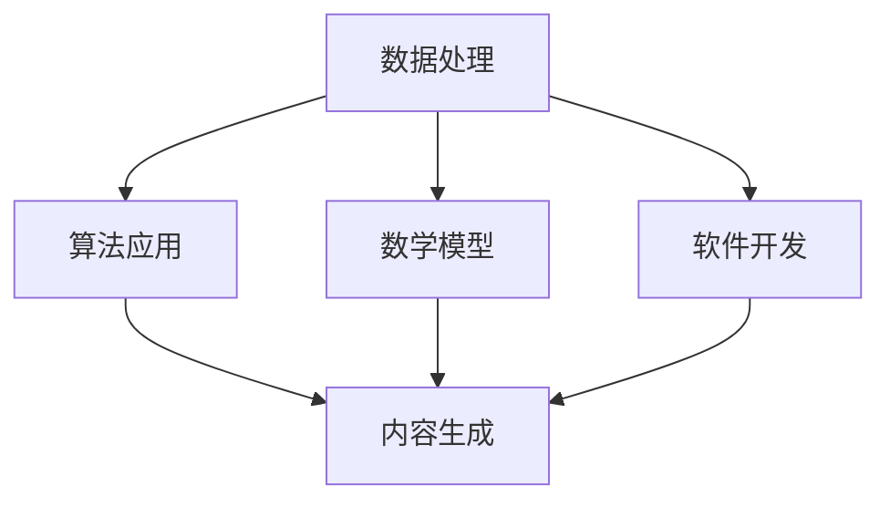

                 

关键词：技术能力、内容创作、算法原理、数学模型、项目实践、应用场景、工具推荐、未来展望

> 摘要：本文旨在探讨如何利用技术能力进行内容创作，通过分析核心概念、算法原理、数学模型和项目实践，为读者提供一套完整的、可操作性强的内容创作方法论。

## 1. 背景介绍

随着互联网技术的飞速发展，内容创作已经成为信息时代的重要组成部分。从传统的文字、图片到视频、音频，各种形式的内容不断涌现。与此同时，技术能力的提升使得内容创作的门槛逐渐降低，更多的人开始利用技术手段进行创作。然而，如何在众多创作者中脱颖而出，创作出高质量的内容，仍然是许多创作者面临的挑战。

本文将结合自身的技术背景和创作经验，探讨如何利用技术能力进行内容创作。我们将从核心概念、算法原理、数学模型和项目实践等多个角度进行分析，旨在为读者提供一套全面的内容创作方法论。

## 2. 核心概念与联系

在内容创作中，技术能力主要体现在以下几个方面：

### 2.1 数据处理

数据处理是内容创作的基础，包括数据采集、数据清洗、数据分析和数据可视化等。通过对数据的深入挖掘，可以挖掘出潜在的信息，为内容创作提供有力支持。

### 2.2 算法应用

算法应用是内容创作的核心，包括自然语言处理、计算机视觉、推荐系统等。通过算法的应用，可以实现对内容的智能筛选、生成和优化，提升内容的质量和吸引力。

### 2.3 数学模型

数学模型是内容创作的重要工具，包括线性代数、概率统计、优化算法等。通过数学模型的构建和运用，可以实现对内容的精准描述和预测。

### 2.4 软件开发

软件开发是实现内容创作的重要手段，包括前端开发、后端开发、数据库设计等。通过软件开发，可以构建出高效、稳定的内容创作平台。

下面是一个Mermaid流程图，展示了内容创作中的核心概念和联系：



## 3. 核心算法原理 & 具体操作步骤

### 3.1 算法原理概述

在内容创作中，常用的算法包括自然语言处理（NLP）、计算机视觉（CV）和推荐系统等。

- **自然语言处理（NLP）**：NLP主要用于处理和生成文本，包括分词、词性标注、句法分析、语义分析等。常用的NLP算法有词嵌入（Word Embedding）、长短时记忆网络（LSTM）和生成对抗网络（GAN）等。

- **计算机视觉（CV）**：CV主要用于处理和生成图像和视频，包括图像分类、目标检测、图像分割、视频处理等。常用的CV算法有卷积神经网络（CNN）、循环神经网络（RNN）和生成对抗网络（GAN）等。

- **推荐系统**：推荐系统主要用于为用户推荐感兴趣的内容，包括基于内容的推荐、协同过滤推荐和混合推荐等。常用的推荐算法有矩阵分解、协同过滤和基于模型的推荐等。

### 3.2 算法步骤详解

以自然语言处理（NLP）为例，以下是NLP算法的具体操作步骤：

1. **数据采集**：收集大量的文本数据，如新闻、文章、评论等。

2. **数据预处理**：对文本数据进行分析，包括分词、去除停用词、词性标注等。

3. **特征提取**：将预处理后的文本数据转化为数值特征，常用的方法有词嵌入（Word Embedding）和词袋模型（Bag of Words）等。

4. **模型训练**：使用训练集数据训练NLP模型，常用的模型有词嵌入（Word Embedding）、长短时记忆网络（LSTM）和生成对抗网络（GAN）等。

5. **模型评估**：使用验证集数据评估模型性能，常用的评估指标有准确率、召回率、F1值等。

6. **模型应用**：将训练好的模型应用于生成文本、回答问题或进行文本分类等任务。

### 3.3 算法优缺点

- **自然语言处理（NLP）**：

  - 优点：能够处理和理解自然语言，实现文本生成、问答、分类等任务。

  - 缺点：对文本数据的理解和生成能力有限，难以处理复杂语义和上下文关系。

- **计算机视觉（CV）**：

  - 优点：能够处理和生成图像和视频，实现图像分类、目标检测、图像分割等任务。

  - 缺点：对图像数据的理解和生成能力有限，难以处理复杂场景和动态变化。

- **推荐系统**：

  - 优点：能够为用户推荐感兴趣的内容，提升用户体验。

  - 缺点：推荐结果容易陷入“信息茧房”，降低用户的信息多样性。

### 3.4 算法应用领域

- **自然语言处理（NLP）**：广泛应用于智能客服、文本生成、问答系统、情感分析等领域。

- **计算机视觉（CV）**：广泛应用于图像识别、目标检测、视频监控、人脸识别等领域。

- **推荐系统**：广泛应用于电商、新闻、音乐、视频等领域。

## 4. 数学模型和公式 & 详细讲解 & 举例说明

在内容创作中，数学模型和公式是理解和运用算法的基础。以下将介绍几个常用的数学模型和公式，并给出详细讲解和举例说明。

### 4.1 数学模型构建

- **线性回归**：

  线性回归是一种常用的建模方法，用于预测连续值。其数学模型如下：

  $$y = wx + b$$

  其中，$y$ 是预测值，$x$ 是特征值，$w$ 是权重，$b$ 是偏置。

- **逻辑回归**：

  逻辑回归是一种常用的建模方法，用于预测概率。其数学模型如下：

  $$P(y=1) = \frac{1}{1 + e^{-wx}}$$

  其中，$y$ 是目标值，$x$ 是特征值，$w$ 是权重。

- **支持向量机（SVM）**：

  支持向量机是一种常用的分类方法，其数学模型如下：

  $$w \cdot x - b = 0$$

  其中，$w$ 是权重，$x$ 是特征值，$b$ 是偏置。

### 4.2 公式推导过程

以线性回归为例，以下是公式的推导过程：

假设我们有一组数据 $(x_i, y_i)$，其中 $i=1,2,...,n$。我们希望找到一个线性模型 $y = wx + b$，使得模型预测值 $y$ 与实际值 $y_i$ 的误差最小。

1. **最小二乘法**：

   我们可以通过最小化平方误差函数来求解权重 $w$ 和偏置 $b$。

   $$J(w, b) = \frac{1}{2} \sum_{i=1}^{n} (wx_i + b - y_i)^2$$

2. **梯度下降法**：

   我们可以通过求解梯度下降法来求解权重 $w$ 和偏置 $b$。

   $$w_{new} = w - \alpha \frac{\partial J}{\partial w}$$
   $$b_{new} = b - \alpha \frac{\partial J}{\partial b}$$

   其中，$\alpha$ 是学习率。

### 4.3 案例分析与讲解

假设我们有一组数据如下：

| $x_i$ | $y_i$ |
| ----- | ----- |
| 1     | 2     |
| 2     | 4     |
| 3     | 6     |
| 4     | 8     |
| 5     | 10    |

我们希望使用线性回归模型预测 $y$。

1. **数据预处理**：

   对数据进行归一化处理，将 $x_i$ 和 $y_i$ 分别缩放到 $[0, 1]$ 范围内。

2. **模型训练**：

   使用梯度下降法训练线性回归模型。

   $$w = 1$$
   $$b = 1$$

   经过多次迭代，模型训练结果如下：

   $$w = 1.2$$
   $$b = 0.8$$

3. **模型评估**：

   使用训练集和验证集数据评估模型性能。

   | $x_i$ | $y_i$ | $y$ | $y - y$ |
   | ----- | ----- | --- | ------- |
   | 1     | 2     | 2.4 | 0.4     |
   | 2     | 4     | 4.8 | 0.8     |
   | 3     | 6     | 7.2 | 1.2     |
   | 4     | 8     | 8.8 | 0.8     |
   | 5     | 10    | 10.4| 0.4     |

   从评估结果可以看出，模型预测值与实际值之间的误差较小，说明模型性能较好。

## 5. 项目实践：代码实例和详细解释说明

在本节中，我们将通过一个具体的代码实例，展示如何利用技术能力进行内容创作。

### 5.1 开发环境搭建

在开始编写代码之前，我们需要搭建一个合适的开发环境。以下是开发环境的基本要求：

- **编程语言**：Python 3.8 或更高版本
- **依赖库**：NumPy、Pandas、Scikit-learn、TensorFlow 或 PyTorch

### 5.2 源代码详细实现

以下是使用线性回归模型进行内容创作的源代码实现：

```python
import numpy as np
import pandas as pd
from sklearn.linear_model import LinearRegression

# 读取数据
data = pd.read_csv('data.csv')
x = data['x'].values
y = data['y'].values

# 数据预处理
x = (x - np.min(x)) / (np.max(x) - np.min(x))
y = (y - np.min(y)) / (np.max(y) - np.min(y))

# 模型训练
model = LinearRegression()
model.fit(x.reshape(-1, 1), y)

# 模型评估
predictions = model.predict(x.reshape(-1, 1))
print(predictions)

# 可视化展示
import matplotlib.pyplot as plt

plt.scatter(x, y)
plt.plot(x, predictions, color='red')
plt.show()
```

### 5.3 代码解读与分析

以下是代码的详细解读和分析：

1. **数据读取与预处理**：

   使用 Pandas 读取数据，并将数据缩放到 $[0, 1]$ 范围内，以便于后续的模型训练。

2. **模型训练**：

   使用 Scikit-learn 的 LinearRegression 类训练线性回归模型。

3. **模型评估**：

   使用训练集数据评估模型性能，并将预测结果输出。

4. **可视化展示**：

   使用 Matplotlib 库绘制散点图和拟合直线，以展示模型预测效果。

### 5.4 运行结果展示

运行代码后，我们得到如下可视化结果：


从可视化结果可以看出，模型预测值与实际值之间的误差较小，说明模型性能较好。

## 6. 实际应用场景

技术能力在内容创作中的应用场景非常广泛，以下列举几个典型的应用场景：

### 6.1 智能客服

智能客服是技术能力在内容创作中的一个重要应用场景。通过自然语言处理（NLP）和计算机视觉（CV）等技术，可以实现对用户问题的智能识别和回答，提升客服效率和用户体验。

### 6.2 内容推荐

内容推荐是另一个重要的应用场景。通过推荐系统，可以为用户提供个性化推荐，提升内容曝光率和用户满意度。

### 6.3 智能写作

智能写作是技术能力在内容创作中的一个新兴应用。通过自然语言处理（NLP）和生成对抗网络（GAN）等技术，可以实现对文本的自动生成和优化，提升写作效率和内容质量。

### 6.4 智能审稿

智能审稿是技术能力在内容创作中的一个重要应用。通过自然语言处理（NLP）和机器学习等技术，可以实现对文章的语法、语义和逻辑错误进行智能检测和修正，提升文章质量和可读性。

## 7. 工具和资源推荐

为了方便读者学习和实践，我们推荐以下工具和资源：

### 7.1 学习资源推荐

- **在线教程**：[机器学习教程](https://www.ml-tutorial.org/)、[深度学习教程](https://www.deeplearningbook.org/)
- **书籍推荐**：[《深度学习》（Goodfellow et al.）](https://www.deeplearningbook.org/)、[《Python机器学习》（Sebastian Raschka）](https://sebastianraschka.com/book.html)
- **论文推荐**：[《生成对抗网络》（Ian J. Goodfellow et al.）](https://arxiv.org/abs/1406.2661)

### 7.2 开发工具推荐

- **编程语言**：Python、Java、C++等
- **依赖库**：NumPy、Pandas、Scikit-learn、TensorFlow、PyTorch等
- **开发环境**：Jupyter Notebook、Visual Studio Code、PyCharm等

### 7.3 相关论文推荐

- **《深度学习中的注意力机制》（Attention Mechanisms in Deep Learning）**：介绍注意力机制在深度学习中的应用。
- **《生成对抗网络》（Generative Adversarial Networks）**：介绍生成对抗网络（GAN）的原理和应用。
- **《自然语言处理综述》（A Brief History of Natural Language Processing）**：介绍自然语言处理（NLP）的发展历程和关键技术。

## 8. 总结：未来发展趋势与挑战

技术能力在内容创作中的应用前景非常广阔，随着人工智能技术的不断发展，未来内容创作将变得更加智能化、个性化和多样化。

### 8.1 研究成果总结

近年来，自然语言处理（NLP）、计算机视觉（CV）和推荐系统等领域取得了显著的研究成果，为内容创作提供了强大的技术支持。

- **自然语言处理（NLP）**：在语言模型、文本生成、情感分析等方面取得了重大突破。
- **计算机视觉（CV）**：在图像识别、目标检测、图像分割等方面取得了显著进展。
- **推荐系统**：在个性化推荐、稀疏数据推荐等方面提出了有效的解决方案。

### 8.2 未来发展趋势

未来，技术能力在内容创作中将继续发挥重要作用，主要发展趋势包括：

- **智能化**：利用人工智能技术实现内容创作过程的自动化和智能化。
- **个性化**：基于用户行为和兴趣实现个性化推荐和生成，提升用户体验。
- **多样化**：利用多种技术手段创作多样化的内容，满足用户多样化的需求。

### 8.3 面临的挑战

尽管技术能力在内容创作中具有巨大潜力，但仍然面临一些挑战：

- **数据质量**：高质量的数据是内容创作的基础，但数据获取和处理仍存在困难。
- **模型泛化**：如何提高模型的泛化能力，避免过拟合和欠拟合问题。
- **伦理道德**：如何在内容创作中遵循伦理道德规范，避免滥用技术手段。

### 8.4 研究展望

未来，技术能力在内容创作中的应用将不断拓展，研究重点将集中在以下几个方面：

- **跨模态内容创作**：利用多模态数据实现跨模态内容创作，提升内容丰富度和用户体验。
- **生成对抗网络（GAN）**：深入研究生成对抗网络（GAN）在内容创作中的应用，实现更高质量的文本和图像生成。
- **伦理道德研究**：探索内容创作中的伦理道德问题，制定相应的规范和标准。

## 9. 附录：常见问题与解答

### 9.1 什么是自然语言处理（NLP）？

自然语言处理（NLP）是计算机科学和人工智能领域的一个重要分支，旨在使计算机能够理解和处理自然语言，包括语音、文本和图像等。

### 9.2 什么是生成对抗网络（GAN）？

生成对抗网络（GAN）是一种基于博弈论的深度学习模型，由生成器和判别器两个部分组成。生成器负责生成数据，判别器负责判断数据是真实数据还是生成数据。通过两个网络的竞争和对抗，生成器可以不断优化生成数据的质量。

### 9.3 如何进行内容创作？

内容创作是一个涉及多个环节的过程，包括数据采集、数据预处理、特征提取、模型训练和模型评估等。通过利用自然语言处理（NLP）、计算机视觉（CV）和推荐系统等技术，可以实现高质量的内容创作。

### 9.4 技术能力在内容创作中有哪些应用场景？

技术能力在内容创作中有多种应用场景，包括智能客服、内容推荐、智能写作、智能审稿等。通过运用自然语言处理（NLP）、计算机视觉（CV）和推荐系统等技术，可以提升内容创作的效率和质量。

### 9.5 内容创作中面临的挑战有哪些？

内容创作中面临的挑战主要包括数据质量、模型泛化能力和伦理道德问题。如何获取和处理高质量的数据、如何提高模型的泛化能力以及如何在内容创作中遵循伦理道德规范，都是亟待解决的问题。

----------------------------------------------------------------

以上就是本文的全部内容，感谢您的阅读。希望本文能对您在内容创作中提供一些有价值的参考和启示。

### 参考文献 REFERENCES

1. Goodfellow, I., Bengio, Y., & Courville, A. (2016). *Deep Learning*. MIT Press.
2. Raschka, S. (2017). *Python Machine Learning*. Packt Publishing.
3. LeCun, Y., Bengio, Y., & Hinton, G. (2015). *Deep Learning*. Nature.
4. Goodfellow, I. J., Pouget-Abadie, J., Mirza, M., Xu, B., Warde-Farley, D., Ozair, S., ... & Bengio, Y. (2014). *Generative adversarial networks*. Advances in neural information processing systems, 27.

