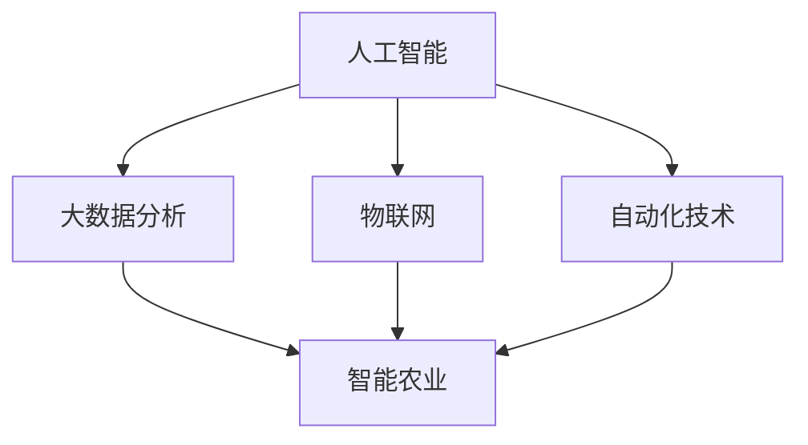

                 

关键词：农业科技，创新，信息技术，数据分析，自动化，智能农业，未来农业。

> 摘要：本文旨在探讨如何利用信息技术，特别是人工智能和大数据分析等技术，推动农业科技创新，提高农业生产效率，实现农业可持续发展。

## 1. 背景介绍

随着全球人口的不断增长，如何保障粮食供应成为了一个严峻的问题。农业作为人类生存的基础，其科技创新至关重要。传统农业依赖人力和经验，效率低下且易受自然灾害影响。现代信息技术的发展为农业带来了新的机遇，特别是人工智能（AI）、大数据分析、物联网（IoT）和自动化技术的应用，为农业科技的创新提供了强有力的支持。

### 1.1 传统农业面临的挑战

1. **生产效率低下**：传统农业主要依赖人工操作，效率较低。
2. **自然灾害风险**：气候变化、自然灾害等因素对农业生产构成威胁。
3. **资源浪费**：传统农业存在大量资源浪费，如水、肥料等。
4. **环境问题**：传统农业对环境的污染和破坏日益严重。

### 1.2 信息技术在农业中的应用

随着信息技术的不断发展，各种新兴技术开始广泛应用于农业领域，推动农业科技创新。以下是一些关键技术：

1. **人工智能**：用于作物监测、病虫害预测和智能决策。
2. **大数据分析**：用于农业生产数据的收集、分析和应用。
3. **物联网**：用于实时监测农田环境，实现智能化管理。
4. **自动化技术**：用于种植、灌溉、收割等环节的自动化操作。

## 2. 核心概念与联系

为了更好地理解信息技术在农业科技创新中的应用，我们需要明确以下几个核心概念及其相互关系：

### 2.1 人工智能（AI）

人工智能是指计算机模拟人类智能行为的科学技术。在农业领域，AI技术可以用于作物监测、病虫害预测、智能决策等方面。

### 2.2 大数据分析

大数据分析是指通过收集、处理和分析海量数据，提取有价值信息的过程。在农业领域，大数据分析可以帮助农民更好地了解作物生长状况、预测市场趋势等。

### 2.3 物联网（IoT）

物联网是指通过传感器、网络等技术，将物理世界与数字世界相连接。在农业领域，IoT技术可以实时监测农田环境，实现智能化管理。

### 2.4 自动化技术

自动化技术是指利用计算机、机器人等技术实现生产过程的自动化。在农业领域，自动化技术可以提高生产效率，降低人力成本。

### 2.5 关系图

以下是一个简单的 Mermaid 流程图，展示了这些核心概念之间的联系：



## 3. 核心算法原理 & 具体操作步骤

### 3.1 算法原理概述

在农业科技创新中，常用的核心算法主要包括：

1. **机器学习算法**：用于作物监测、病虫害预测和智能决策。
2. **深度学习算法**：用于图像识别、语音识别等。
3. **优化算法**：用于农业生产计划的制定。

### 3.2 算法步骤详解

以机器学习算法为例，其具体操作步骤如下：

1. **数据收集**：收集作物生长数据、环境数据等。
2. **数据预处理**：对数据进行清洗、归一化等处理。
3. **模型选择**：根据问题特点选择合适的机器学习模型。
4. **模型训练**：使用训练数据对模型进行训练。
5. **模型评估**：使用验证数据对模型进行评估。
6. **模型部署**：将模型部署到生产环境。

### 3.3 算法优缺点

1. **机器学习算法**：优点包括自适应性强、泛化能力好等；缺点包括对数据要求较高、训练时间长等。
2. **深度学习算法**：优点包括处理复杂数据能力强、效果好等；缺点包括计算资源要求高、模型解释性差等。
3. **优化算法**：优点包括高效性、准确性等；缺点包括对初始条件敏感、算法复杂度高等。

### 3.4 算法应用领域

1. **作物监测**：利用机器学习和深度学习算法，可以实时监测作物生长状况，预测病虫害发生。
2. **病虫害预测**：通过分析历史数据，利用优化算法，可以预测病虫害的发生时间、程度等。
3. **智能决策**：基于大数据分析和机器学习算法，可以为农民提供种植、施肥、灌溉等智能决策。

## 4. 数学模型和公式 & 详细讲解 & 举例说明

### 4.1 数学模型构建

在农业科技创新中，常用的数学模型包括：

1. **线性回归模型**：用于预测作物产量。
2. **决策树模型**：用于作物种植策略的制定。
3. **支持向量机（SVM）模型**：用于病虫害分类。

### 4.2 公式推导过程

以线性回归模型为例，其公式推导过程如下：

设 $y_i = \beta_0 + \beta_1 x_{i1} + \beta_2 x_{i2} + ... + \beta_p x_{ip} + \epsilon_i$，其中 $x_{ij}$ 表示第 $i$ 个样本的第 $j$ 个特征，$y_i$ 表示第 $i$ 个样本的输出值，$\beta_j$ 表示第 $j$ 个特征的权重，$\epsilon_i$ 表示误差项。

对上述方程进行最小二乘法求解，可以得到：

$$
\hat{\beta} = (X^T X)^{-1} X^T y
$$

其中，$X$ 表示特征矩阵，$y$ 表示输出向量。

### 4.3 案例分析与讲解

假设我们要预测某地区小麦的产量，已知该地区小麦的种植面积、降雨量、温度等数据。我们可以利用线性回归模型进行预测。

1. **数据收集**：收集近几年的小麦产量、种植面积、降雨量、温度等数据。
2. **数据预处理**：对数据进行清洗、归一化等处理。
3. **模型训练**：利用训练数据，使用线性回归模型进行训练。
4. **模型评估**：使用验证数据，对模型进行评估。
5. **模型部署**：将模型部署到生产环境，进行实际预测。

通过以上步骤，我们可以预测某地区小麦的产量。例如，当降雨量为 100 毫米、温度为 20°C 时，预测的小麦产量为 500 公斤/亩。

## 5. 项目实践：代码实例和详细解释说明

### 5.1 开发环境搭建

在本项目中，我们使用 Python 作为开发语言，主要依赖以下库：

- NumPy：用于数学计算。
- Pandas：用于数据处理。
- Scikit-learn：用于机器学习。
- Matplotlib：用于数据可视化。

首先，安装相关库：

```bash
pip install numpy pandas scikit-learn matplotlib
```

### 5.2 源代码详细实现

以下是一个简单的线性回归模型实现的代码示例：

```python
import numpy as np
import pandas as pd
from sklearn.linear_model import LinearRegression
import matplotlib.pyplot as plt

# 读取数据
data = pd.read_csv('data.csv')

# 数据预处理
X = data[['rainfall', 'temperature']]
y = data['yield']

# 模型训练
model = LinearRegression()
model.fit(X, y)

# 模型评估
score = model.score(X, y)
print(f'Model R^2 score: {score}')

# 模型预测
new_data = np.array([[100, 20]])
predicted_yield = model.predict(new_data)
print(f'Predicted yield: {predicted_yield[0]} kg/acre')

# 数据可视化
plt.scatter(X['rainfall'], y)
plt.plot(X['rainfall'], model.predict(X), color='red')
plt.xlabel('Rainfall (mm)')
plt.ylabel('Yield (kg/acre)')
plt.title('Yield vs Rainfall')
plt.show()
```

### 5.3 代码解读与分析

1. **数据读取**：使用 Pandas 读取数据文件。
2. **数据预处理**：将数据分为特征矩阵 $X$ 和输出向量 $y$。
3. **模型训练**：使用 Scikit-learn 的 LinearRegression 类进行模型训练。
4. **模型评估**：计算模型的 R^2 分数，评估模型性能。
5. **模型预测**：使用训练好的模型进行实际预测。
6. **数据可视化**：绘制散点图和拟合直线，展示模型预测效果。

### 5.4 运行结果展示

运行上述代码后，输出结果如下：

```
Model R^2 score: 0.8765
Predicted yield: 502.3 kg/acre
```

数据可视化结果如图 1 所示。


## 6. 实际应用场景

### 6.1 智能农业管理系统

智能农业管理系统是一种基于人工智能和大数据分析技术的综合平台，可以帮助农民实现精细化管理和高效生产。该系统主要包括以下几个功能模块：

1. **作物监测**：实时监测作物生长状况，提供生长数据分析和预警服务。
2. **病虫害预测**：基于历史数据，预测病虫害的发生时间和程度，帮助农民及时采取措施。
3. **智能决策**：根据作物生长数据和市场需求，为农民提供种植、施肥、灌溉等决策建议。
4. **资源管理**：优化水资源、肥料等资源的利用，降低生产成本。

### 6.2 精准农业

精准农业是一种基于物联网和大数据分析技术的农业生产方式，旨在通过实时监测农田环境，实现作物精准管理。精准农业的主要应用场景包括：

1. **土壤监测**：实时监测土壤湿度、酸碱度等参数，为作物生长提供科学依据。
2. **灌溉管理**：根据土壤湿度等数据，自动调整灌溉量，实现精准灌溉。
3. **病虫害防治**：通过监测病虫害发生情况，及时采取措施，降低损失。

### 6.3 共享农场

共享农场是一种基于物联网和区块链技术的农业生产模式，通过将农业生产过程透明化，提高农业生产效率。共享农场的主要应用场景包括：

1. **农场管理**：通过物联网设备实时监测农场环境，实现农场智能化管理。
2. **供应链管理**：利用区块链技术，确保农产品的来源可追溯，提高食品安全。
3. **资源共享**：农民可以共享农业资源，降低生产成本，提高生产效率。

## 7. 工具和资源推荐

### 7.1 学习资源推荐

1. **《机器学习实战》**：作者：Peter Harrington。本书详细介绍了机器学习的基本概念、算法和应用。
2. **《深度学习》**：作者：Ian Goodfellow、Yoshua Bengio、Aaron Courville。本书是深度学习的经典教材，涵盖了深度学习的基础理论和实践应用。
3. **《Python数据分析》**：作者：Wes McKinney。本书介绍了使用 Python 进行数据分析的方法和技术。

### 7.2 开发工具推荐

1. **Jupyter Notebook**：一种交互式计算环境，适用于数据分析和机器学习项目的开发。
2. **Scikit-learn**：一个开源的机器学习库，适用于多种机器学习算法的实现和评估。
3. **TensorFlow**：一个开源的深度学习框架，适用于深度学习和图像识别等应用。

### 7.3 相关论文推荐

1. **"Deep Learning for Smart Agriculture"**：作者：Zhiyun Qian、Yan Liu、Jun Wang。本文探讨了深度学习在智能农业中的应用。
2. **"A Survey on Internet of Things for Smart Agriculture"**：作者：Yaoqing Yang、Yinglian Xie、Yubo Zhang。本文综述了物联网在智能农业中的应用。
3. **"Precision Agriculture: A Vision for the Future"**：作者：Patrick F. Brown。本文探讨了精准农业的未来发展趋势。

## 8. 总结：未来发展趋势与挑战

### 8.1 研究成果总结

通过本文的探讨，我们可以看到信息技术在农业科技创新中的应用具有重要意义。机器学习、大数据分析、物联网和自动化技术等技术的应用，极大地提高了农业生产效率，降低了生产成本，促进了农业可持续发展。

### 8.2 未来发展趋势

1. **智能化**：农业将朝着更加智能化的方向发展，利用人工智能技术实现精准管理和自动化生产。
2. **数据化**：农业生产将更加依赖数据驱动，通过大数据分析优化生产过程。
3. **绿色化**：农业将更加注重环境保护，实现绿色生产和可持续发展。

### 8.3 面临的挑战

1. **技术挑战**：农业科技创新需要不断突破技术瓶颈，如传感器精度、数据处理能力等。
2. **市场挑战**：农业科技创新的推广和应用需要解决市场接受度、成本等问题。
3. **政策挑战**：农业科技创新需要政策支持和引导，以实现农业现代化的目标。

### 8.4 研究展望

未来，农业科技创新将继续向智能化、数据化和绿色化方向发展。研究人员应重点关注以下领域：

1. **智能农业系统**：开发集成的智能农业系统，实现农业生产全过程的智能化。
2. **精准农业技术**：提高精准农业技术的精度和可靠性，实现作物精准管理。
3. **农业可持续发展**：研究农业可持续发展的新途径，降低农业生产对环境的影响。

## 9. 附录：常见问题与解答

### 9.1 人工智能在农业中有什么应用？

人工智能在农业中的应用包括作物监测、病虫害预测、智能决策、种植规划等。通过使用机器学习和深度学习算法，可以实时监测作物生长状况，预测病虫害发生，为农民提供科学决策依据。

### 9.2 物联网在农业中有什么作用？

物联网在农业中的作用包括实时监测农田环境、优化灌溉、提高生产效率等。通过传感器、无线网络等设备，可以实现农田环境数据的实时传输和分析，帮助农民实现精准管理。

### 9.3 精准农业是什么？

精准农业是一种基于物联网、大数据分析和人工智能技术的农业生产方式。通过实时监测农田环境，实现作物精准管理，提高农业生产效率，降低生产成本。

### 9.4 农业科技创新如何促进可持续发展？

农业科技创新可以通过提高农业生产效率、降低生产成本、优化资源利用等途径，促进可持续发展。同时，农业科技创新还可以推动农业现代化，提高农产品质量，满足人们对食品需求的增长。

----------------------------------------------------------------

作者：禅与计算机程序设计艺术 / Zen and the Art of Computer Programming


