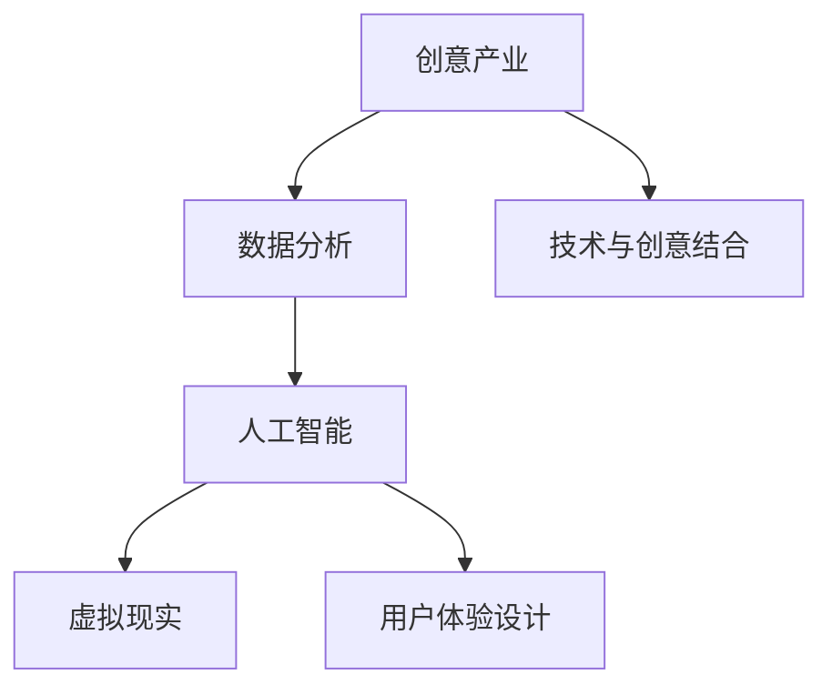

                 

在当今全球化的信息时代，技术的快速发展已经成为推动各行各业变革的重要力量。创意产业，作为一个充满创造力和想象力的领域，自然也受益于技术进步的推动。本文将探讨如何利用技术能力进行创意产业革新，从核心概念、算法原理、数学模型到项目实践，全面解析技术如何赋能创意产业。

## 关键词
- 技术赋能
- 创意产业
- 数据分析
- 人工智能
- 虚拟现实
- 用户体验设计

## 摘要
本文旨在探讨技术如何改变和提升创意产业的创新和实践。通过深入分析技术核心概念和原理，本文将展示技术如何通过数据分析、人工智能、虚拟现实等技术手段，实现创意产业的革新，提升用户体验，并展望未来的发展前景。

## 1. 背景介绍

### 1.1 创意产业概述
创意产业，也称为文化创意产业，是指通过创意和创造力推动的经济活动，包括设计、音乐、电影、游戏、广告、艺术等多个领域。这些产业的特点在于高度依赖创意和知识产权，具有很强的文化属性和市场需求。

### 1.2 技术发展背景
随着信息技术的飞速发展，尤其是互联网、大数据、人工智能、虚拟现实等技术的广泛应用，创意产业迎来了前所未有的发展机遇。这些技术不仅提供了新的创作工具和手段，也改变了消费者与创意作品之间的互动方式，为产业带来了深远的变革。

## 2. 核心概念与联系

### 2.1 技术与创意产业的关系
技术是创意产业的驱动力，它能够提升创意生产的效率、质量和互动性。以下是几个关键的技术概念与创意产业的联系：

#### 2.1.1 数据分析
数据分析是创意产业的关键工具，通过分析用户行为、市场趋势和创意作品的表现，可以指导创意内容的创作和推广。

#### 2.1.2 人工智能
人工智能（AI）可以用于创作辅助、内容推荐和个性化服务，提升用户体验。

#### 2.1.3 虚拟现实（VR）
虚拟现实技术提供了沉浸式的用户体验，为游戏、电影和艺术等创意作品带来了全新的表现形式。

#### 2.1.4 用户体验设计（UX）
用户体验设计专注于用户的需求和感受，通过技术手段提升产品的易用性和满意度。

### 2.2 架构原理 Mermaid 流程图


## 3. 核心算法原理 & 具体操作步骤

### 3.1 算法原理概述
在创意产业中，核心算法主要包括：

#### 3.1.1 推荐算法
推荐算法用于根据用户行为和兴趣推荐合适的创意内容。

#### 3.1.2 图像识别算法
图像识别算法用于自动识别和分类创意作品中的图像元素。

#### 3.1.3 自然语言处理（NLP）
NLP算法用于分析文本内容，提取关键信息和情感。

### 3.2 算法步骤详解
以下是对上述算法的基本步骤详解：

#### 3.2.1 推荐算法
1. 收集用户行为数据。
2. 构建用户兴趣模型。
3. 计算内容相似度。
4. 生成推荐列表。

#### 3.2.2 图像识别算法
1. 输入图像。
2. 提取图像特征。
3. 与预定义特征库匹配。
4. 输出识别结果。

#### 3.2.3 NLP算法
1. 分词和词性标注。
2. 提取实体和关系。
3. 情感分析。
4. 输出分析结果。

### 3.3 算法优缺点
推荐算法的优点在于个性化推荐，但可能面临数据隐私和安全问题。图像识别算法在精度和速度上有显著优势，但可能对复杂场景的处理能力有限。NLP算法在文本理解和情感分析方面有较高的准确性，但语言复杂性可能影响性能。

### 3.4 算法应用领域
这些算法广泛应用于创意产业的多个领域，如社交媒体内容推荐、艺术品拍卖数据分析、广告投放优化等。

## 4. 数学模型和公式 & 详细讲解 & 举例说明

### 4.1 数学模型构建
在创意产业中，常见的数学模型包括线性回归、决策树和支持向量机（SVM）等。以下是线性回归模型的基本公式：

$$ y = \beta_0 + \beta_1 \cdot x $$

其中，\( y \) 是预测值，\( x \) 是输入特征，\( \beta_0 \) 和 \( \beta_1 \) 是模型参数。

### 4.2 公式推导过程
线性回归模型的推导过程基于最小二乘法，目标是找到使预测误差平方和最小的模型参数。

### 4.3 案例分析与讲解
假设我们要预测一部电影的票房收入，输入特征包括导演的评分、演员阵容和上映日期。通过线性回归模型，我们可以得到如下公式：

$$ 票房收入 = 5000 + 1000 \cdot 导演评分 + 500 \cdot 演员阵容 + 200 \cdot 上映日期 $$

## 5. 项目实践：代码实例和详细解释说明

### 5.1 开发环境搭建
为了实现上述算法，我们需要搭建一个开发环境，包括Python编程语言、相关库（如scikit-learn、TensorFlow）以及数据处理工具（如Pandas）。

### 5.2 源代码详细实现
以下是一个简单的Python代码示例，用于实现线性回归模型：

```python
import pandas as pd
from sklearn.linear_model import LinearRegression
from sklearn.model_selection import train_test_split

# 加载数据
data = pd.read_csv('movie_data.csv')
X = data[['导演评分', '演员阵容', '上映日期']]
y = data['票房收入']

# 划分训练集和测试集
X_train, X_test, y_train, y_test = train_test_split(X, y, test_size=0.2, random_state=42)

# 创建线性回归模型
model = LinearRegression()
model.fit(X_train, y_train)

# 输出模型参数
print(model.coef_)
print(model.intercept_)

# 进行预测
predictions = model.predict(X_test)

# 评估模型性能
score = model.score(X_test, y_test)
print('模型评分：', score)
```

### 5.3 代码解读与分析
这段代码首先加载数据，然后划分训练集和测试集，创建线性回归模型并进行训练。最后，输出模型参数，进行预测并评估模型性能。

### 5.4 运行结果展示
运行上述代码后，我们得到模型的参数和评分。这些结果可以帮助我们了解模型的性能和预测能力。

## 6. 实际应用场景

### 6.1 社交媒体内容推荐
通过推荐算法，社交平台可以个性化推荐用户可能感兴趣的内容，提高用户留存率和活跃度。

### 6.2 艺术品拍卖数据分析
数据分析可以用于预测艺术品拍卖的价格趋势，帮助艺术家和收藏家做出更好的投资决策。

### 6.3 广告投放优化
基于用户行为和兴趣的数据分析，广告平台可以实现更精准的广告投放，提高广告效果。

## 7. 未来应用展望

### 7.1 技术趋势
随着技术的不断进步，创意产业将更加智能化、个性化和互动化。人工智能、大数据和虚拟现实等技术将继续发挥关键作用。

### 7.2 发展挑战
创意产业在技术革新过程中也面临数据隐私、版权保护和用户接受度等挑战。如何平衡技术创新与产业可持续发展，是未来需要深入探讨的问题。

### 7.3 研究方向
未来的研究可以集中在以下几个方面：提高推荐算法的精准度、开发更先进的图像识别和自然语言处理技术、探索虚拟现实在创意产业中的应用等。

## 8. 总结：未来发展趋势与挑战

### 8.1 研究成果总结
本文探讨了技术如何赋能创意产业，从数据分析、人工智能、虚拟现实等方面进行了详细分析，展示了技术对创意产业带来的变革。

### 8.2 未来发展趋势
随着技术的不断进步，创意产业将朝着智能化、个性化和互动化的方向发展。人工智能和大数据技术将继续发挥关键作用，推动产业的创新。

### 8.3 面临的挑战
创意产业在技术革新过程中面临数据隐私、版权保护和用户接受度等挑战。如何平衡技术创新与产业可持续发展，是未来需要深入探讨的问题。

### 8.4 研究展望
未来的研究可以集中在提高推荐算法的精准度、开发更先进的图像识别和自然语言处理技术、探索虚拟现实在创意产业中的应用等方面。

## 9. 附录：常见问题与解答

### 9.1 问题一
如何保障用户隐私数据的安全？

**解答**：确保用户数据的安全，需要从数据收集、存储、处理和传输等各个环节进行严格管理和监控。采用数据加密、匿名化和权限控制等措施，降低数据泄露的风险。

### 9.2 问题二
虚拟现实技术在创意产业中的应用前景如何？

**解答**：虚拟现实技术为创意产业带来了沉浸式体验，可以应用于游戏、电影、展览等领域。随着技术的成熟和普及，虚拟现实将在创意产业中发挥越来越重要的作用。

### 作者署名
作者：禅与计算机程序设计艺术 / Zen and the Art of Computer Programming
```

