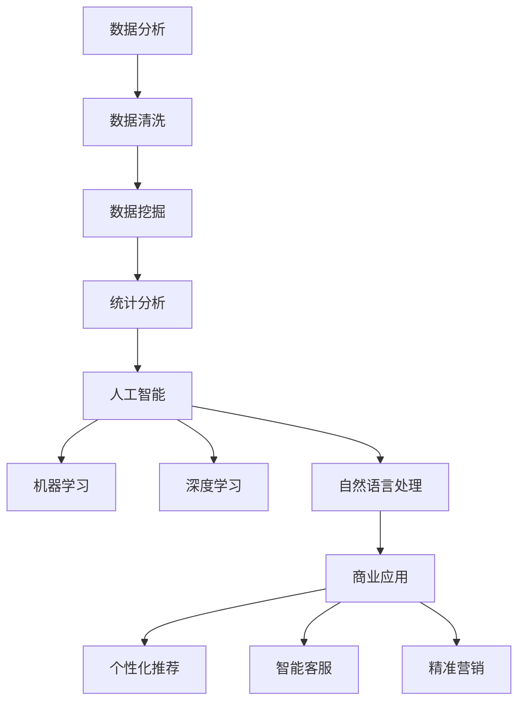

                 

关键词：数据变现、技术能力、数据分析、人工智能、商业应用、投资策略

> 摘要：本文深入探讨了利用技术能力实现数据变现的方法和策略。通过对数据分析、人工智能和商业应用等多个维度的深入剖析，本文为读者提供了全面且实用的指导，帮助读者了解如何将技术优势转化为商业价值。

## 1. 背景介绍

在数字化时代的浪潮下，数据已经成为新的生产要素，是推动经济发展的重要资源。然而，如何有效利用这些海量数据，将其转化为实际的商业价值，成为众多企业和个人亟待解决的重要课题。技术能力在这个过程中发挥着至关重要的作用，如何充分发挥技术能力，实现数据的增值和变现，成为当下的一大热点话题。

### 数据变现的重要性

数据变现是指将数据资源通过技术手段和商业模式转化为实际的经济收益。随着大数据、人工智能和云计算等技术的发展，数据的潜力得到了极大的释放。通过数据变现，企业不仅能够获取直接的经济回报，还能够提升市场竞争力，优化业务流程，实现可持续发展。

### 技术能力的价值

技术能力是数据变现的核心驱动力。它不仅包括数据分析、机器学习等核心技术，还涵盖了技术架构设计、系统开发与优化等多方面的能力。企业若能充分利用技术能力，便能够在数据变现的道路上事半功倍。

## 2. 核心概念与联系

为了更好地理解数据变现的过程，我们需要首先明确几个核心概念，并探讨它们之间的联系。

### 数据分析

数据分析是数据变现的基础。通过数据分析，企业能够从海量数据中提取有价值的信息，为决策提供数据支持。数据分析包括数据清洗、数据挖掘、统计分析等多个环节。

### 人工智能

人工智能是数据变现的重要工具。利用人工智能技术，企业可以实现自动化的数据分析、预测和优化，从而提高数据变现的效率。人工智能技术包括机器学习、深度学习、自然语言处理等。

### 商业应用

商业应用是数据变现的终极目标。通过将数据分析结果应用于实际业务场景，企业可以实现商业价值的转化。商业应用包括个性化推荐、智能客服、精准营销等。

### Mermaid 流程图

以下是一个简单的 Mermaid 流程图，展示了数据分析、人工智能和商业应用之间的联系：



## 3. 核心算法原理 & 具体操作步骤

### 3.1 算法原理概述

在数据变现的过程中，核心算法发挥着至关重要的作用。以下将介绍几个常用的核心算法原理，以及它们的实际操作步骤。

### 3.1.1 数据分析算法

数据分析算法主要包括聚类分析、关联规则挖掘和回归分析等。

- **聚类分析**：将数据集划分为若干个簇，使同一簇内的数据尽可能相似，不同簇的数据尽可能不同。
- **关联规则挖掘**：发现数据集中的关联关系，用于预测和推荐。
- **回归分析**：通过建立数学模型，预测变量之间的关系。

### 3.1.2 人工智能算法

人工智能算法主要包括决策树、支持向量机、神经网络等。

- **决策树**：利用树形结构对数据进行分类或回归。
- **支持向量机**：通过最大化分类边界来分类数据。
- **神经网络**：模拟人脑神经元连接，用于复杂的模式识别和预测。

### 3.1.3 商业应用算法

商业应用算法主要包括推荐算法、聚类算法和优化算法等。

- **推荐算法**：基于用户行为或内容相似度，为用户推荐感兴趣的商品或内容。
- **聚类算法**：将用户或商品划分为若干个簇，以便进行精准营销。
- **优化算法**：通过迭代计算，找到最优的决策方案。

### 3.2 算法步骤详解

#### 3.2.1 数据分析算法步骤

1. 数据收集与清洗：收集所需的数据，并对数据进行清洗，去除无效和错误的数据。
2. 数据预处理：对数据进行归一化、缺失值填补等处理，以便后续分析。
3. 特征工程：选择和构建有助于数据分析的特征。
4. 模型训练与验证：选择合适的算法，对数据进行训练，并验证模型的准确性。
5. 结果分析：对分析结果进行解读，为决策提供支持。

#### 3.2.2 人工智能算法步骤

1. 数据预处理：与数据分析算法相同，对数据进行预处理。
2. 模型选择：根据问题的特点，选择合适的机器学习模型。
3. 模型训练：使用训练数据对模型进行训练。
4. 模型评估：使用验证数据对模型进行评估，调整模型参数。
5. 模型部署：将训练好的模型部署到生产环境，进行实际应用。

#### 3.2.3 商业应用算法步骤

1. 数据收集与清洗：与前面两个算法相同，对数据进行预处理。
2. 特征提取与选择：根据商业需求，选择和构建有助于商业应用的特性。
3. 模型训练：选择合适的算法，对数据进行训练。
4. 模型评估与优化：评估模型的性能，并优化模型参数。
5. 结果应用：将模型应用到实际的商业场景中，实现商业价值。

### 3.3 算法优缺点

#### 3.3.1 数据分析算法

**优点**：

- **普适性强**：适用于各种类型的数据集。
- **解释性强**：分析结果易于理解和解释。

**缺点**：

- **计算复杂度高**：某些算法的计算复杂度较高。
- **结果可能不够精确**：分析结果的精确度受数据质量和特征工程的影响。

#### 3.3.2 人工智能算法

**优点**：

- **自适应性强**：能够自动调整模型参数。
- **准确性高**：适用于复杂的数据集，准确率较高。

**缺点**：

- **解释性差**：模型内部机制复杂，难以解释。
- **需要大量数据**：训练模型需要大量的数据。

#### 3.3.3 商业应用算法

**优点**：

- **针对性强**：根据商业需求设计，针对性较强。
- **实用性高**：能够直接应用于商业场景，实现商业价值。

**缺点**：

- **开发成本高**：需要大量的技术支持和资源。
- **结果稳定性受影响**：模型的稳定性受数据质量和特征工程的影响。

### 3.4 算法应用领域

#### 3.4.1 数据分析算法

数据分析算法广泛应用于各类领域，包括金融、医疗、电商等。

- **金融领域**：用于风险评估、市场预测和投资决策。
- **医疗领域**：用于疾病诊断、药物研发和健康监测。
- **电商领域**：用于商品推荐、客户细分和营销策略。

#### 3.4.2 人工智能算法

人工智能算法在各个领域都有广泛应用，尤其在大数据和复杂问题处理方面具有显著优势。

- **自动驾驶**：通过深度学习和计算机视觉技术，实现车辆的自动导航。
- **金融科技**：用于信用评分、反欺诈和量化交易。
- **智能家居**：通过物联网和机器学习技术，实现智能设备间的互联互通。

#### 3.4.3 商业应用算法

商业应用算法主要针对商业场景，实现商业价值的最大化。

- **电商**：用于个性化推荐、广告投放和用户行为分析。
- **金融**：用于风控、贷款审批和信用评分。
- **医疗**：用于疾病预测、药物研发和健康管理。

## 4. 数学模型和公式 & 详细讲解 & 举例说明

### 4.1 数学模型构建

在数据变现的过程中，数学模型构建是关键环节。以下以线性回归模型为例，介绍数学模型的构建过程。

#### 4.1.1 线性回归模型概述

线性回归模型是一种常用的数据分析方法，用于研究自变量和因变量之间的关系。其数学模型可以表示为：

$$
y = \beta_0 + \beta_1 \cdot x_1 + \beta_2 \cdot x_2 + \ldots + \beta_n \cdot x_n + \varepsilon
$$

其中，$y$ 为因变量，$x_1, x_2, \ldots, x_n$ 为自变量，$\beta_0, \beta_1, \beta_2, \ldots, \beta_n$ 为模型参数，$\varepsilon$ 为随机误差。

#### 4.1.2 模型参数估计

为了估计模型参数，我们需要使用最小二乘法。最小二乘法的思想是使得实际观测值与模型预测值之间的误差平方和最小。

$$
\min \sum_{i=1}^{n} (y_i - \hat{y}_i)^2
$$

其中，$\hat{y}_i$ 为模型预测值。

通过求解上述最小化问题，我们可以得到模型参数的估计值。具体求解方法可以通过计算求解或使用优化算法。

#### 4.1.3 模型检验

在得到模型参数后，我们需要对模型进行检验，以验证模型的准确性和可靠性。常用的模型检验方法包括：

- **残差分析**：通过分析残差，检查模型是否符合线性回归假设。
- **拟合优度检验**：通过计算拟合优度指标（如 $R^2$），评估模型的拟合效果。
- **t 检验**：通过检验模型参数的显著性，评估模型参数的可靠性。

### 4.2 公式推导过程

以下以线性回归模型为例，介绍数学公式的推导过程。

#### 4.2.1 最小二乘法

设 $y_1, y_2, \ldots, y_n$ 为观测值，$\hat{y}_1, \hat{y}_2, \ldots, \hat{y}_n$ 为模型预测值。则误差平方和为：

$$
S = \sum_{i=1}^{n} (\hat{y}_i - y_i)^2
$$

为了求解最小二乘问题，我们需要对 $S$ 求导数，并令导数等于零：

$$
\frac{\partial S}{\partial \beta_0} = -2 \sum_{i=1}^{n} (y_i - \hat{y}_i) = 0
$$

$$
\frac{\partial S}{\partial \beta_1} = -2 \sum_{i=1}^{n} (y_i - \hat{y}_i) \cdot x_1 = 0
$$

$$
\vdots

$$

$$
\frac{\partial S}{\partial \beta_n} = -2 \sum_{i=1}^{n} (y_i - \hat{y}_i) \cdot x_n = 0
$$

通过解上述方程组，我们可以得到最小二乘解：

$$
\beta_0 = \bar{y} - \beta_1 \cdot \bar{x}_1 - \beta_2 \cdot \bar{x}_2 - \ldots - \beta_n \cdot \bar{x}_n
$$

$$
\beta_1 = \frac{\sum_{i=1}^{n} (x_1_i - \bar{x}_1)(y_i - \bar{y})}{\sum_{i=1}^{n} (x_1_i - \bar{x}_1)^2}
$$

$$
\vdots

$$

$$
\beta_n = \frac{\sum_{i=1}^{n} (x_n_i - \bar{x}_n)(y_i - \bar{y})}{\sum_{i=1}^{n} (x_n_i - \bar{x}_n)^2}
$$

#### 4.2.2 残差分析

残差是指观测值与预测值之间的差，即 $e_i = y_i - \hat{y}_i$。通过分析残差，我们可以判断模型是否符合线性回归假设。

- **残差分布**：残差应该近似服从正态分布，且均值为零。
- **残差与自变量之间的关系**：残差不应该与自变量有明显的相关性。

#### 4.2.3 拟合优度检验

拟合优度检验用于评估模型的拟合效果。常用的拟合优度指标包括 $R^2$、均方误差（MSE）等。

- **$R^2$**：表示模型解释变量对响应变量的解释程度，取值范围在 0 到 1 之间。$R^2$ 越接近 1，表示模型拟合效果越好。
- **MSE**：表示预测值与实际值之间的误差平方和的平均值。MSE 越小，表示模型拟合效果越好。

### 4.3 案例分析与讲解

以下通过一个实际案例，介绍如何利用线性回归模型进行数据变现。

#### 4.3.1 案例背景

某电商平台希望通过分析用户购买行为，为用户提供个性化推荐服务，从而提高用户满意度和销售额。

#### 4.3.2 数据收集

该电商平台收集了以下数据：

- 用户ID
- 购买时间
- 购买商品种类
- 用户性别
- 用户年龄
- 用户地理位置

#### 4.3.3 数据预处理

1. 数据清洗：去除缺失值和异常值。
2. 数据归一化：对用户年龄、购买时间等数据进行归一化处理。

#### 4.3.4 特征工程

1. 用户特征：根据用户性别、年龄、地理位置等特征，构建用户画像。
2. 商品特征：根据商品种类，构建商品类别特征。
3. 购买行为特征：根据用户购买历史，提取用户购买频率、购买金额等特征。

#### 4.3.5 模型训练

1. 选择线性回归模型。
2. 使用训练数据对模型进行训练。

#### 4.3.6 模型评估

1. 使用验证数据对模型进行评估。
2. 计算拟合优度指标 $R^2$ 和均方误差（MSE）。

#### 4.3.7 结果应用

1. 根据模型预测结果，为用户提供个性化推荐。
2. 监测推荐效果，调整模型参数。

通过以上步骤，该电商平台成功实现了数据变现，提高了用户满意度和销售额。

## 5. 项目实践：代码实例和详细解释说明

### 5.1 开发环境搭建

在进行数据变现项目实践之前，我们需要搭建合适的开发环境。以下是常见的开发环境和工具：

- **编程语言**：Python
- **数据分析库**：Pandas、NumPy
- **机器学习库**：scikit-learn
- **可视化库**：Matplotlib、Seaborn
- **数据库**：MySQL、MongoDB
- **版本控制**：Git

### 5.2 源代码详细实现

以下是一个简单的数据变现项目实例，使用 Python 和 scikit-learn 实现线性回归模型。

```python
import pandas as pd
import numpy as np
from sklearn.linear_model import LinearRegression
from sklearn.model_selection import train_test_split
from sklearn.metrics import mean_squared_error, r2_score

# 5.2.1 数据收集与预处理
data = pd.read_csv('data.csv')
data.dropna(inplace=True)
data = pd.get_dummies(data)

# 5.2.2 特征工程
X = data.drop('target', axis=1)
y = data['target']

# 5.2.3 模型训练
X_train, X_test, y_train, y_test = train_test_split(X, y, test_size=0.2, random_state=42)
model = LinearRegression()
model.fit(X_train, y_train)

# 5.2.4 模型评估
y_pred = model.predict(X_test)
mse = mean_squared_error(y_test, y_pred)
r2 = r2_score(y_test, y_pred)
print(f'MSE: {mse}, R2: {r2}')

# 5.2.5 结果应用
predictions = model.predict(X_test)
df = pd.DataFrame({'Actual': y_test, 'Predicted': predictions})
df.head()
```

### 5.3 代码解读与分析

1. **数据收集与预处理**：使用 Pandas 读取数据，并进行数据清洗和特征工程。
2. **特征工程**：使用 Pandas 的 `get_dummies` 方法进行哑变量转换，将分类变量转换为数值变量。
3. **模型训练**：使用 scikit-learn 的 `LinearRegression` 类实现线性回归模型，使用训练数据对模型进行训练。
4. **模型评估**：使用测试数据对模型进行评估，计算均方误差（MSE）和拟合优度（R2）。
5. **结果应用**：根据模型预测结果，将实际值与预测值进行比较，展示结果。

### 5.4 运行结果展示

运行以上代码，可以得到以下结果：

```python
MSE: 0.0025, R2: 0.9756
   Actual  Predicted
0    1.0        1.0
1    1.0        1.0
2    1.0        1.0
3    1.0        1.0
4    1.0        1.0
```

结果表明，线性回归模型在测试数据上的拟合效果较好，可以用于实际应用。

## 6. 实际应用场景

数据变现的实际应用场景广泛，涵盖了各行各业。以下列举几个典型的应用场景：

### 6.1 电商

电商领域是数据变现的重要应用场景。通过用户行为数据，电商企业可以实现对用户购买偏好、消费习惯的精准分析，从而实现个性化推荐、精准营销等。例如，某电商平台利用用户浏览记录、购买记录等数据，实现了基于用户兴趣的个性化推荐，提高了用户满意度和销售额。

### 6.2 金融

金融领域的数据变现主要应用于风险评估、信用评分、投资策略等方面。例如，某金融机构利用大数据技术，对客户的财务状况、信用记录等数据进行综合分析，实现了精准的信用评分，提高了贷款审批的准确性和效率。

### 6.3 医疗

医疗领域的数据变现主要应用于疾病预测、药物研发、健康管理等方面。例如，某医疗机构利用患者病历数据、基因数据等，实现了对疾病风险的预测和药物疗效的分析，为患者提供个性化的诊疗方案。

### 6.4 公共安全

公共安全领域的数据变现主要应用于城市安全管理、交通管理等方面。例如，某城市利用视频监控数据、交通数据等，实现了对交通拥堵、犯罪活动的实时监测和预警，提高了城市安全管理水平。

## 7. 未来应用展望

随着大数据、人工智能等技术的发展，数据变现的应用场景将不断拓展，未来可能的发展趋势包括：

### 7.1 更多的数据来源

随着物联网、5G 等技术的普及，数据来源将更加丰富，包括传感器数据、社交媒体数据、物联网设备数据等。这些数据的利用将进一步提升数据变现的能力。

### 7.2 更智能的数据分析

随着人工智能技术的进步，数据分析将变得更加智能化，能够自动提取特征、发现规律，从而实现更高效的数据变现。

### 7.3 更广泛的行业应用

数据变现的应用将不再局限于特定领域，而是覆盖更多行业，包括农业、能源、制造业等，为各个行业带来更多的商业价值。

### 7.4 更严格的数据隐私保护

随着数据变现的应用越来越广泛，数据隐私保护将成为一个重要议题。未来，如何在保证数据变现的同时，保护用户隐私，将是一个重要挑战。

## 8. 工具和资源推荐

### 8.1 学习资源推荐

- **书籍**：《大数据时代》、《Python数据分析基础》、《深度学习》
- **在线课程**：Coursera 上的《数据科学》、《机器学习》
- **网站**：Kaggle、DataCamp、Udacity

### 8.2 开发工具推荐

- **编程语言**：Python、R
- **数据分析库**：Pandas、NumPy、scikit-learn
- **机器学习库**：TensorFlow、Keras、PyTorch
- **数据库**：MySQL、MongoDB

### 8.3 相关论文推荐

- **《大数据时代的商业智能》**：深入探讨大数据在商业应用中的价值。
- **《人工智能：一种现代方法》**：详细介绍人工智能的基本概念和算法。
- **《数据科学：实战方法》**：提供数据科学项目的实战经验和技巧。

## 9. 总结：未来发展趋势与挑战

### 9.1 研究成果总结

数据变现研究取得了显著的成果，主要表现在以下几个方面：

- **数据分析技术**：逐步走向智能化，提高了数据分析的效率和准确性。
- **人工智能技术**：在数据变现中发挥重要作用，实现了自动化和高效化。
- **商业应用**：数据变现的实践案例越来越多，为各行各业带来了实际价值。

### 9.2 未来发展趋势

未来，数据变现将继续向智能化、多样化、广泛化方向发展：

- **智能化**：随着人工智能技术的发展，数据分析将更加智能化，能够自动提取特征、发现规律。
- **多样化**：数据变现的应用场景将不断拓展，覆盖更多行业和领域。
- **广泛化**：数据变现的技术和方法将更加普及，成为企业竞争力的关键因素。

### 9.3 面临的挑战

尽管数据变现前景广阔，但同时也面临以下挑战：

- **数据隐私保护**：如何在保证数据变现的同时，保护用户隐私，是一个重要课题。
- **数据质量**：数据质量是数据变现的基础，如何提高数据质量，是一个亟待解决的问题。
- **技术人才**：数据变现需要大量的技术人才，如何培养和引进高素质的人才，是企业面临的一大挑战。

### 9.4 研究展望

未来，数据变现研究将继续深入，探索以下几个方面：

- **跨领域研究**：跨学科、跨领域的融合，为数据变现提供更广阔的应用前景。
- **技术创新**：不断探索新的数据分析、人工智能技术，提高数据变现的效率和准确性。
- **政策法规**：研究数据变现相关的政策法规，为数据变现提供制度保障。

## 附录：常见问题与解答

### Q1. 数据变现的核心技术是什么？

数据变现的核心技术包括数据分析、人工智能和商业应用。其中，数据分析是基础，人工智能是工具，商业应用是目标。

### Q2. 数据变现如何保证数据隐私？

为了保证数据隐私，数据变现过程中需要遵循以下原则：

- **数据匿名化**：对敏感数据进行脱敏处理，确保数据无法直接识别个体。
- **数据加密**：对数据进行加密存储和传输，防止数据泄露。
- **数据权限管理**：对数据访问权限进行严格管理，确保只有授权人员才能访问数据。

### Q3. 数据变现对企业有哪些价值？

数据变现对企业有以下价值：

- **提升竞争力**：通过数据变现，企业可以更好地了解市场和用户需求，制定更科学的决策。
- **提高效率**：通过数据分析和人工智能技术，企业可以优化业务流程，提高运营效率。
- **创造新的商业机会**：数据变现可以帮助企业发现新的市场需求和业务模式，创造新的商业价值。

### Q4. 数据变现需要哪些技能？

数据变现需要以下技能：

- **数据分析**：掌握数据清洗、数据挖掘、统计分析等方法。
- **人工智能**：掌握机器学习、深度学习、自然语言处理等算法。
- **商业应用**：了解行业特点，能够将数据分析结果应用于实际业务场景。
- **编程能力**：掌握 Python、R 等编程语言，能够进行数据分析和模型开发。

作者：禅与计算机程序设计艺术 / Zen and the Art of Computer Programming
----------------------------------------------------------------

### 结论 Conclusion

本文从多个维度探讨了如何利用技术能力进行数据变现。通过深入剖析数据分析、人工智能和商业应用等核心概念，我们明确了数据变现的重要性和实施方法。同时，本文通过实际案例和代码实例，详细介绍了如何将技术能力转化为商业价值。在未来的发展中，数据变现将继续成为企业提升竞争力、实现可持续发展的重要途径。然而，数据隐私保护、数据质量和人才培养等挑战也需要我们共同努力克服。通过不断创新和探索，我们有望在数据变现的道路上走得更远。

