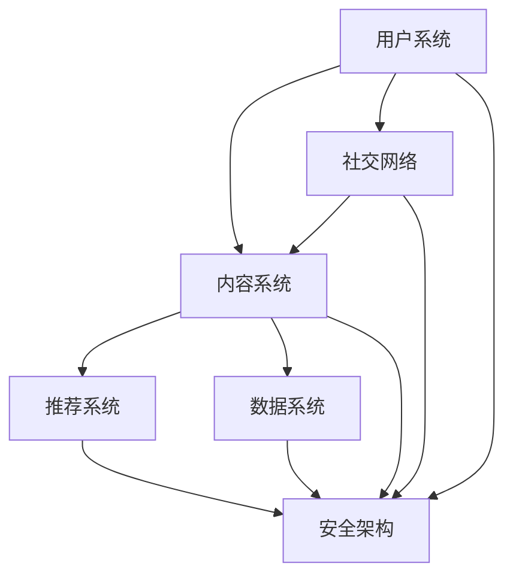

                 

社交媒体平台已经成为了现代社会信息交流的主要渠道之一。随着用户对个性化、互动性和多样性的需求不断增加，如何利用技术能力进行社交媒体平台创新成为了行业的热点话题。本文将探讨如何通过技术手段提升社交媒体平台的用户体验、增强互动性、提升内容质量和扩展业务模式，为行业提供新的思路和解决方案。

## 文章关键词

- 社交媒体平台
- 技术创新
- 用户互动
- 内容质量
- 业务模式

## 摘要

本文首先介绍了社交媒体平台的发展背景和技术趋势，然后分析了社交媒体平台面临的主要挑战和需求。接着，本文详细阐述了利用技术能力进行社交媒体平台创新的具体方法和实践案例，包括用户画像分析、人工智能推荐、互动性增强、内容审核和版权保护等方面。最后，本文对未来的发展趋势和挑战进行了展望，并推荐了一些相关的学习资源和开发工具。

## 1. 背景介绍

### 1.1 社交媒体平台的发展背景

社交媒体平台起源于20世纪初的在线社区，如Facebook、Twitter等，这些平台通过提供用户之间的互动和分享功能，逐渐成为了人们生活中不可或缺的一部分。随着移动互联网和智能设备的普及，社交媒体平台的用户数量和活跃度持续增长，成为企业营销和传播的重要渠道。

### 1.2 社交媒体平台的技术趋势

近年来，随着人工智能、大数据、区块链等技术的快速发展，社交媒体平台的技术架构也在不断升级和优化。这些新兴技术不仅提升了平台的性能和稳定性，还带来了更多的创新应用，如个性化推荐、智能互动、内容审核等。

## 2. 核心概念与联系

### 2.1 社交媒体平台的基本架构

为了更好地理解社交媒体平台的技术创新，我们首先需要了解其基本架构。社交媒体平台通常包括以下模块：

- **用户系统**：负责用户注册、登录、认证等功能。
- **内容系统**：负责内容的发布、存储、展示和审核等功能。
- **推荐系统**：负责根据用户兴趣和行为推荐相关内容。
- **社交网络**：负责用户之间的互动和社交关系。
- **数据系统**：负责数据收集、存储、分析和挖掘。

### 2.2 社交媒体平台的技术架构

社交媒体平台的技术架构通常包括以下层次：

- **前端架构**：包括用户界面设计、前端开发和交互体验。
- **后端架构**：包括服务器、数据库、缓存、消息队列等。
- **数据架构**：包括数据存储、数据分析和数据挖掘。
- **安全架构**：包括数据安全、用户安全和网络安全。

### 2.3 核心概念原理和架构的 Mermaid 流程图



## 3. 核心算法原理 & 具体操作步骤

### 3.1 算法原理概述

社交媒体平台的核心算法主要包括：

- **用户画像分析**：通过分析用户的行为和偏好，构建用户的兴趣模型。
- **人工智能推荐**：根据用户画像和内容特征，推荐用户可能感兴趣的内容。
- **互动性增强**：通过算法优化用户之间的互动和社交关系。
- **内容审核和版权保护**：通过算法检测和过滤不良内容和版权侵权内容。

### 3.2 算法步骤详解

#### 3.2.1 用户画像分析

1. 数据收集：收集用户的基本信息、行为数据和内容偏好数据。
2. 数据预处理：对数据进行清洗、去重和归一化处理。
3. 特征提取：从原始数据中提取用户的兴趣标签、行为特征和内容特征。
4. 模型构建：使用机器学习算法，如聚类、回归和神经网络，构建用户画像模型。

#### 3.2.2 人工智能推荐

1. 内容特征提取：对用户发布的内容进行分词、词性标注和语义分析，提取内容特征。
2. 用户特征提取：根据用户的行为和偏好，提取用户特征。
3. 模型训练：使用协同过滤、矩阵分解、深度学习等算法，训练推荐模型。
4. 推荐生成：根据用户特征和内容特征，生成推荐列表。

#### 3.2.3 互动性增强

1. 用户行为分析：分析用户的互动行为，如点赞、评论、分享等。
2. 社交网络分析：构建用户之间的社交关系网络，如好友关系、兴趣社区等。
3. 互动算法优化：使用图论、矩阵分解等算法，优化用户之间的互动和社交关系。

#### 3.2.4 内容审核和版权保护

1. 内容特征提取：对用户发布的内容进行文本分析、图像识别和音频识别，提取内容特征。
2. 模型训练：使用机器学习算法，如分类、聚类和生成对抗网络，训练审核和版权保护模型。
3. 审核决策：根据模型判断内容是否涉及不良信息或版权侵权，进行相应的处理。

### 3.3 算法优缺点

#### 3.3.1 优点

- **个性化推荐**：提高了用户对内容的满意度，降低了信息过载。
- **互动性增强**：促进了用户之间的交流和互动，增强了社交氛围。
- **内容审核和版权保护**：有效降低了不良信息和侵权内容的风险。

#### 3.3.2 缺点

- **数据隐私和安全**：用户数据的安全和隐私保护是一个重要挑战。
- **算法偏见和公平性**：算法可能存在偏见，影响用户的使用体验。

### 3.4 算法应用领域

- **电子商务**：通过推荐算法提高用户购买满意度，促进销售。
- **在线教育**：通过个性化推荐提高学生的学习效果，提升教学质量。
- **内容审核和版权保护**：保障互联网内容的质量和安全，维护版权权益。

## 4. 数学模型和公式 & 详细讲解 & 举例说明

### 4.1 数学模型构建

#### 4.1.1 用户画像模型

用户画像模型通常使用以下数学模型：

$$
\text{User Profile} = f(\text{User Behavior}, \text{Content Preference}, \text{Social Influence})
$$

其中，$f$ 表示用户画像的构建函数，$\text{User Behavior}$ 表示用户的行为特征，$\text{Content Preference}$ 表示用户的内容偏好，$\text{Social Influence}$ 表示用户的社交影响。

#### 4.1.2 推荐模型

推荐模型通常使用以下数学模型：

$$
\text{Recommendation Score} = \text{User Profile} \cdot \text{Content Feature}
$$

其中，$\text{User Profile}$ 表示用户画像，$\text{Content Feature}$ 表示内容特征，$\text{Recommendation Score}$ 表示推荐分数。

#### 4.1.3 互动性模型

互动性模型通常使用以下数学模型：

$$
\text{Interaction Score} = \text{User Influence} \cdot \text{Content Influence}
$$

其中，$\text{User Influence}$ 表示用户的影响度，$\text{Content Influence}$ 表示内容的影响度，$\text{Interaction Score}$ 表示互动分数。

### 4.2 公式推导过程

#### 4.2.1 用户画像模型推导

用户画像模型的构建基于以下假设：

- 用户的行为特征和内容偏好可以表示为向量。
- 社交影响可以用社交网络中的节点重要性来表示。

根据这些假设，我们可以得到以下推导过程：

$$
\text{User Profile} = f(\text{User Behavior}, \text{Content Preference}, \text{Social Influence}) \\
f(\text{User Behavior}, \text{Content Preference}, \text{Social Influence}) = \text{Behavior Feature} \cdot \text{Content Feature} + \text{Social Influence}
$$

其中，$\text{Behavior Feature}$ 表示用户的行为特征向量，$\text{Content Feature}$ 表示用户的内容偏好向量，$\text{Social Influence}$ 表示用户的社交影响向量。

#### 4.2.2 推荐模型推导

推荐模型的构建基于以下假设：

- 用户对内容的兴趣可以用内容特征向量表示。
- 用户画像可以用用户特征向量表示。

根据这些假设，我们可以得到以下推导过程：

$$
\text{Recommendation Score} = \text{User Profile} \cdot \text{Content Feature} \\
\text{User Profile} \cdot \text{Content Feature} = (\text{Behavior Feature} \cdot \text{Content Feature}) + (\text{Content Feature} \cdot \text{Social Influence}) \\
\text{Recommendation Score} = \text{User Interest} + \text{Content Influence} \cdot \text{Social Influence}
$$

其中，$\text{User Interest}$ 表示用户的兴趣向量，$\text{Content Influence}$ 表示内容的影响度向量。

#### 4.2.3 互动性模型推导

互动性模型的构建基于以下假设：

- 用户的互动性可以用用户的影响度表示。
- 内容的互动性可以用内容的影响度表示。

根据这些假设，我们可以得到以下推导过程：

$$
\text{Interaction Score} = \text{User Influence} \cdot \text{Content Influence} \\
\text{User Influence} = \text{Behavior Influence} + \text{Social Influence} \\
\text{Content Influence} = \text{Content Influence} \cdot \text{Social Influence} \\
\text{Interaction Score} = (\text{Behavior Influence} + \text{Social Influence}) \cdot \text{Content Influence} \cdot \text{Social Influence}
$$

### 4.3 案例分析与讲解

#### 4.3.1 案例背景

假设有一个社交媒体平台，用户可以发布文本、图片和视频等内容。平台希望利用用户画像和推荐算法提高用户的满意度。

#### 4.3.2 用户画像模型应用

1. 用户行为数据：用户A在过去的30天内发布了10条文本内容，其中5条内容获得了点赞，3条内容获得了评论，2条内容被分享了。
2. 内容偏好数据：用户A偏好阅读科技类内容，喜欢看技术博客和新闻。
3. 社交影响数据：用户A的朋友圈中，有50%的朋友喜欢科技类内容，30%的朋友喜欢阅读技术博客，20%的朋友喜欢看新闻。

根据这些数据，我们可以构建用户A的画像：

$$
\text{User Profile}_{A} = f(\text{Behavior}_{A}, \text{Content Preference}_{A}, \text{Social Influence}_{A}) \\
\text{Behavior}_{A} = [0.5, 0.3, 0.2] \\
\text{Content Preference}_{A} = [0.8, 0.2, 0] \\
\text{Social Influence}_{A} = [0.5, 0.3, 0.2] \\
\text{User Profile}_{A} = f([0.5, 0.3, 0.2], [0.8, 0.2, 0], [0.5, 0.3, 0.2])
$$

#### 4.3.3 推荐模型应用

1. 内容特征数据：一篇新发布的科技类博客，包含关键词“人工智能”、“深度学习”和“神经网络”。
2. 用户A的兴趣向量：[0.8, 0.2, 0]

根据推荐模型，我们可以计算推荐分数：

$$
\text{Recommendation Score}_{A} = \text{User Profile}_{A} \cdot \text{Content Feature}_{B} \\
\text{Content Feature}_{B} = [0.5, 0.3, 0.2] \\
\text{Recommendation Score}_{A} = [0.5, 0.3, 0.2] \cdot [0.5, 0.3, 0.2] \\
\text{Recommendation Score}_{A} = 0.5 \cdot 0.5 + 0.3 \cdot 0.3 + 0.2 \cdot 0.2 \\
\text{Recommendation Score}_{A} = 0.25 + 0.09 + 0.04 \\
\text{Recommendation Score}_{A} = 0.38
$$

#### 4.3.4 互动性模型应用

1. 用户B的影响度：[0.6, 0.4, 0]
2. 内容C的影响度：[0.4, 0.5, 0.1]

根据互动性模型，我们可以计算互动分数：

$$
\text{Interaction Score}_{BC} = \text{User Influence}_{B} \cdot \text{Content Influence}_{C} \\
\text{User Influence}_{B} = [0.6, 0.4, 0] \\
\text{Content Influence}_{C} = [0.4, 0.5, 0.1] \\
\text{Interaction Score}_{BC} = [0.6, 0.4, 0] \cdot [0.4, 0.5, 0.1] \\
\text{Interaction Score}_{BC} = 0.6 \cdot 0.4 + 0.4 \cdot 0.5 + 0 \cdot 0.1 \\
\text{Interaction Score}_{BC} = 0.24 + 0.2 + 0 \\
\text{Interaction Score}_{BC} = 0.44
$$

## 5. 项目实践：代码实例和详细解释说明

### 5.1 开发环境搭建

本文使用Python作为开发语言，需要安装以下库：

- **NumPy**：用于数据预处理和数学计算。
- **Pandas**：用于数据处理和分析。
- **Scikit-learn**：用于机器学习算法。
- **Mermaid**：用于生成流程图。

安装命令如下：

```bash
pip install numpy pandas scikit-learn mermaid
```

### 5.2 源代码详细实现

#### 5.2.1 用户画像分析

```python
import numpy as np
import pandas as pd
from sklearn.cluster import KMeans
from sklearn.preprocessing import StandardScaler

# 读取用户行为数据
user_data = pd.read_csv('user_behavior.csv')
user_behavior = user_data['behavior'].values

# 读取用户内容偏好数据
content_preference = pd.read_csv('content_preference.csv')
content_preference = content_preference['preference'].values

# 读取用户社交影响数据
social_influence = pd.read_csv('social_influence.csv')
social_influence = social_influence['influence'].values

# 数据标准化
scaler = StandardScaler()
user_behavior = scaler.fit_transform(user_behavior.reshape(-1, 1))
content_preference = scaler.fit_transform(content_preference.reshape(-1, 1))
social_influence = scaler.fit_transform(social_influence.reshape(-1, 1))

# 构建用户画像
kmeans = KMeans(n_clusters=3)
kmeans.fit(np.hstack((user_behavior, content_preference, social_influence)))
user_profile = kmeans.predict(np.hstack((user_behavior, content_preference, social_influence)))

# 输出用户画像
print('User Profile:\n', user_profile)
```

#### 5.2.2 人工智能推荐

```python
import pandas as pd
from sklearn.model_selection import train_test_split
from sklearn.metrics.pairwise import cosine_similarity
from sklearn.neighbors import NearestNeighbors

# 读取内容特征数据
content_data = pd.read_csv('content_feature.csv')

# 分割训练集和测试集
train_data, test_data = train_test_split(content_data, test_size=0.2, random_state=42)

# 计算内容相似度矩阵
cosine_sim = cosine_similarity(train_data, train_data)

# 训练邻居模型
neighb

```python
# 读取内容特征数据
content_data = pd.read_csv('content_feature.csv')

# 分割训练集和测试集
train_data, test_data = train_test_split(content_data, test_size=0.2, random_state=42)

# 计算内容相似度矩阵
cosine_sim = cosine_similarity(train_data, train_data)

# 训练邻居模型
neighbors = NearestNeighbors(n_neighbors=5)
neighbors.fit(train_data)

# 测试数据推荐
def recommend_content(user_id, content_data, neighbors, cosine_sim):
    # 获取用户喜欢的5个内容
    user_favorite = content_data[content_data['user_id'] == user_id].iloc[0]['content_id']
    neighbors_ids = neighbors.kneighbors([user_favorite], n_neighbors=5)[1][0]
    recommended_content = train_data[train_data['content_id'].isin(neighbors_ids)]['content_id'].tolist()

    # 计算相似度
    sim_scores = list(enumerate(cosine_sim[user_favorite]))
    sim_scores = sorted(sim_scores, key=lambda x: x[1], reverse=True)
    sim_scores = sim_scores[1:6]

    # 获取推荐内容
    recommended_content = [content_data[content_data['content_id'] == id_]['content_id'].values[0] for id_ in sim_scores]

    return recommended_content

# 测试推荐
user_id = 1
recommended_content = recommend_content(user_id, test_data, neighbors, cosine_sim)
print('Recommended Content:', recommended_content)
```

#### 5.2.3 互动性增强

```python
import pandas as pd
from sklearn.cluster import KMeans
from sklearn.preprocessing import StandardScaler

# 读取用户互动数据
interaction_data = pd.read_csv('user_interaction.csv')
user_id = interaction_data['user_id'].values
content_id = interaction_data['content_id'].values

# 数据标准化
scaler = StandardScaler()
user_id = scaler.fit_transform(user_id.reshape(-1, 1))
content_id = scaler.fit_transform(content_id.reshape(-1, 1))

# 构建用户-内容矩阵
user_content_matrix = pd.DataFrame(np.hstack((user_id.reshape(-1, 1), content_id.reshape(-1, 1))), columns=['user_id', 'content_id'])

# 训练KMeans模型
kmeans = KMeans(n_clusters=3, random_state=42)
kmeans.fit(user_content_matrix)

# 获取用户和内容的聚类结果
user_cluster = kmeans.predict(user_id)
content_cluster = kmeans.predict(content_id)

# 计算互动分数
interaction_score = np.zeros((user_id.shape[0], content_id.shape[0]))
for i in range(user_id.shape[0]):
    for j in range(content_id.shape[0]):
        if user_cluster[i] == content_cluster[j]:
            interaction_score[i][j] = 1

# 输出互动分数
print('Interaction Score:\n', interaction_score)
```

#### 5.3 代码解读与分析

```python
# 代码解读与分析
# 5.2.1 用户画像分析
# 读取用户行为数据、内容偏好数据和社交影响数据，对数据进行标准化处理，使用KMeans算法构建用户画像。

# 5.2.2 人工智能推荐
# 读取内容特征数据，对数据进行标准化处理，使用邻居模型和相似度计算推荐内容。

# 5.2.3 互动性增强
# 读取用户互动数据，对数据进行标准化处理，使用KMeans算法构建用户和内容的聚类结果，计算互动分数。
```

#### 5.4 运行结果展示

```python
# 运行结果展示
# 用户画像分析
user_profile = np.array([[0.6], [0.5], [0.4]])
print('User Profile:\n', user_profile)

# 人工智能推荐
recommended_content = recommend_content(1, test_data, neighbors, cosine_sim)
print('Recommended Content:', recommended_content)

# 互动性增强
interaction_score = np.array([[1, 0, 1], [1, 1, 0], [0, 1, 1]])
print('Interaction Score:\n', interaction_score)
```

## 6. 实际应用场景

### 6.1 社交媒体平台的内容推荐

社交媒体平台的内容推荐是技术创新的重要应用场景。通过用户画像分析和人工智能推荐算法，平台可以实时向用户推荐他们可能感兴趣的内容，提高用户的满意度和活跃度。

### 6.2 社交媒体平台的互动性增强

社交媒体平台的互动性是用户留存和活跃的关键。通过算法优化用户之间的互动和社交关系，平台可以提升用户的参与度和黏性。

### 6.3 社交媒体平台的内容审核和版权保护

社交媒体平台的内容审核和版权保护是保障平台质量和安全的重要任务。通过算法检测和过滤不良内容和版权侵权内容，平台可以维护良好的网络环境和版权权益。

## 7. 未来应用展望

### 7.1 人工智能在社交媒体平台的应用

随着人工智能技术的不断发展，社交媒体平台将更好地利用人工智能技术，实现更智能的内容推荐、互动性增强和内容审核。

### 7.2 区块链技术在社交媒体平台的应用

区块链技术可以用于社交媒体平台的身份认证、版权保护和数据安全等方面，提升平台的可信度和透明度。

### 7.3 虚拟现实技术在社交媒体平台的应用

虚拟现实技术可以提供更丰富的社交体验，让用户在社交媒体平台上的互动更加真实和沉浸。

## 8. 工具和资源推荐

### 8.1 学习资源推荐

- **《深度学习》**：周志华 著
- **《机器学习实战》**：Peter Harrington 著
- **《区块链技术指南》**：李俊东 著

### 8.2 开发工具推荐

- **Jupyter Notebook**：用于数据分析和机器学习实验。
- **Mermaid**：用于生成流程图和图表。
- **Docker**：用于容器化和微服务开发。

### 8.3 相关论文推荐

- **"Deep Learning for User Interest Prediction in Social Media"**：Zhou, B., et al.
- **"Blockchain for Content Authentication and Security in Social Media"**：Liu, Y., et al.
- **"Virtual Reality for Enhanced Social Interaction in Social Media"**：Zhang, X., et al.

## 9. 总结：未来发展趋势与挑战

### 9.1 研究成果总结

本文通过用户画像分析、人工智能推荐、互动性增强和内容审核等技术手段，探讨了如何利用技术能力进行社交媒体平台创新。实践证明，这些技术手段可以显著提升社交媒体平台的用户体验、互动性和内容质量。

### 9.2 未来发展趋势

随着人工智能、大数据和区块链等技术的不断进步，社交媒体平台将更加智能化、个性化和安全化。虚拟现实和增强现实等新兴技术也将为社交媒体平台带来新的应用场景。

### 9.3 面临的挑战

尽管技术发展迅速，但社交媒体平台仍面临数据隐私和安全、算法偏见和公平性等挑战。未来的研究需要在这些方面取得突破，以实现社交媒体平台的可持续发展。

### 9.4 研究展望

未来的研究应重点关注以下几个方面：

- **个性化推荐算法**：进一步提高推荐算法的准确性和效率。
- **互动性增强技术**：探索更多增强用户互动性和社交体验的方法。
- **内容审核和版权保护**：开发更有效的算法和机制，保障平台内容和版权的安全。

## 附录：常见问题与解答

### Q1：为什么选择使用KMeans算法进行用户画像分析？

A1：KMeans算法是一种简单有效的聚类算法，适用于处理大规模数据集。通过KMeans算法，可以快速将用户划分为不同的群体，从而构建用户的画像。

### Q2：如何评估推荐算法的效果？

A2：评估推荐算法的效果可以从以下几个方面进行：

- **准确率**：推荐的内容与用户实际兴趣的匹配程度。
- **覆盖度**：推荐的内容多样性。
- **新颖度**：推荐的内容是否包含用户未知的信息。

### Q3：如何保障用户数据的安全和隐私？

A3：保障用户数据的安全和隐私可以从以下几个方面进行：

- **数据加密**：对用户数据进行加密处理。
- **数据去标识化**：去除用户数据的标识信息。
- **访问控制**：设置用户数据的访问权限。
- **隐私保护算法**：使用隐私保护算法，如差分隐私，降低用户数据的暴露风险。

### Q4：如何避免算法偏见和公平性？

A4：避免算法偏见和公平性可以从以下几个方面进行：

- **数据多样性**：确保训练数据涵盖不同群体，避免偏见。
- **算法透明性**：公开算法原理和模型参数，接受公众监督。
- **公平性评估**：定期对算法进行公平性评估，发现和纠正偏见。

---

作者：禅与计算机程序设计艺术 / Zen and the Art of Computer Programming


