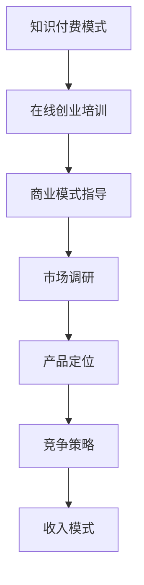

                 

关键词：知识付费，在线创业培训，商业模式指导，在线教育，技能提升，市场分析，用户需求，案例分析

## 摘要

本文旨在探讨如何通过知识付费模式实现在线创业培训与商业模式指导。我们将从背景介绍、核心概念、算法原理、数学模型、项目实践、实际应用、工具资源推荐以及未来展望等方面展开讨论。文章将通过详细的分析和实例，为读者提供一套完整的在线创业培训与商业模式指导方案，以帮助创业者更好地把握市场机遇，提升自身竞争力。

## 1. 背景介绍

在互联网时代，在线教育已成为一种重要的学习方式。知识付费作为在线教育的重要组成部分，逐渐受到广大用户和创业者的青睐。随着知识付费市场的不断扩大，如何利用知识付费实现在线创业培训与商业模式指导成为一个亟待解决的问题。

### 1.1 知识付费的发展趋势

知识付费市场近年来呈现出快速增长的趋势。根据数据显示，我国知识付费市场规模从2016年的15.4亿元增长到2020年的392亿元，年均增长率达到82.8%。这一趋势预计在未来将继续保持，并有望在2023年突破1000亿元。

### 1.2 在线创业培训的需求

随着创业环境的不断优化，越来越多的人选择投身创业。然而，创业过程中面临的诸多挑战使得创业者对专业知识和经验的渴求愈发强烈。在线创业培训作为一种灵活、高效的学习方式，正逐渐成为创业者提升自身能力的重要途径。

### 1.3 商业模式指导的重要性

商业模式指导是创业者成功创业的关键因素之一。一个优秀的商业模式能够帮助创业者更好地把握市场机遇，优化资源配置，提高企业竞争力。因此，如何为创业者提供专业的商业模式指导成为知识付费领域的一个重要课题。

## 2. 核心概念与联系

### 2.1 知识付费模式

知识付费模式是指通过付费获取知识、技能或服务的在线学习方式。其主要特点是用户需要为所获取的知识或服务支付费用，从而实现知识的变现。

### 2.2 在线创业培训

在线创业培训是指利用互联网技术，为创业者提供创业知识、技能和经验的培训课程。培训内容涵盖创业策划、团队建设、市场调研、商业模式设计等方面。

### 2.3 商业模式指导

商业模式指导是指为创业者提供针对性强、具有实操性的商业模式设计方案，帮助创业者优化资源配置、提高企业竞争力。商业模式指导主要包括市场分析、竞争策略、产品定位、收入模式等方面。

### 2.4 Mermaid 流程图



## 3. 核心算法原理 & 具体操作步骤

### 3.1 算法原理概述

在线创业培训与商业模式指导的核心算法原理主要涉及用户需求分析、市场调研和商业模式设计等方面。具体来说，算法原理包括以下几个方面：

- 用户需求分析：通过大数据分析和用户调研，了解用户在创业过程中的需求和痛点。
- 市场调研：分析市场趋势、竞争对手和目标客户，为商业模式设计提供依据。
- 商业模式设计：根据市场调研结果和用户需求，设计具有竞争力的商业模式。

### 3.2 算法步骤详解

1. 用户需求分析
   - 收集用户反馈：通过问卷调查、用户访谈等方式，收集用户在创业过程中的需求和痛点。
   - 数据分析：对收集到的用户反馈进行分析，提取出用户需求的关键词和优先级。

2. 市场调研
   - 竞争对手分析：分析同行业竞争对手的商业模式、市场表现和用户评价。
   - 目标客户分析：明确目标客户群体，分析其需求、偏好和行为习惯。

3. 商业模式设计
   - 产品定位：根据市场调研和用户需求，确定产品的核心功能和特点。
   - 收入模式设计：根据产品定位和目标客户，设计合适的收入模式。

### 3.3 算法优缺点

**优点：**
- 系统性：通过算法原理，可以全面、系统地分析用户需求、市场情况和商业模式。
- 实用性：算法步骤详细，可操作性强，适用于实际创业培训与商业模式指导。

**缺点：**
- 数据依赖性：算法效果依赖于用户反馈和市场数据的准确性。
- 时效性：市场变化快速，算法结果可能需要不断更新和优化。

### 3.4 算法应用领域

- 在线创业培训平台：用于分析用户需求、设计课程内容和商业模式。
- 创业咨询服务：为创业者提供市场调研和商业模式设计的咨询服务。

## 4. 数学模型和公式 & 详细讲解 & 举例说明

### 4.1 数学模型构建

在线创业培训与商业模式指导的数学模型主要包括用户需求分析模型、市场调研模型和商业模式设计模型。以下为各模型的构建方法：

1. 用户需求分析模型
   - 用户满意度得分模型：$$ S = \frac{1}{n} \sum_{i=1}^{n} w_i \cdot s_i $$
   其中，$S$为用户满意度得分，$n$为用户反馈数量，$w_i$为第$i$个用户反馈的权重，$s_i$为第$i$个用户反馈的满意度得分。

2. 市场调研模型
   - 市场增长率模型：$$ g = \frac{C_t - C_{t-1}}{C_{t-1}} \times 100\% $$
   其中，$g$为市场增长率，$C_t$为第$t$年的市场规模，$C_{t-1}$为第$t-1$年的市场规模。

3. 商业模式设计模型
   - 收入模式设计模型：$$ R = P \cdot Q $$
   其中，$R$为收入，$P$为产品单价，$Q$为产品销量。

### 4.2 公式推导过程

1. 用户需求分析模型推导
   - 用户满意度得分模型推导：$$ S = \frac{1}{n} \sum_{i=1}^{n} w_i \cdot s_i $$
   其中，$s_i$为第$i$个用户反馈的满意度得分，$w_i$为第$i$个用户反馈的权重。满意度得分越高，表示用户需求越强烈。

2. 市场调研模型推导
   - 市场增长率模型推导：$$ g = \frac{C_t - C_{t-1}}{C_{t-1}} \times 100\% $$
   其中，$C_t$为第$t$年的市场规模，$C_{t-1}$为第$t-1$年的市场规模。市场增长率表示市场规模的增长速度。

3. 商业模式设计模型推导
   - 收入模式设计模型推导：$$ R = P \cdot Q $$
   其中，$P$为产品单价，$Q$为产品销量。收入表示企业在一段时间内的经营成果。

### 4.3 案例分析与讲解

以下为在线创业培训与商业模式指导的案例分析：

**案例：某在线教育平台**

1. 用户需求分析
   - 收集用户反馈：通过问卷调查和用户访谈，收集用户在在线学习过程中的需求和痛点。
   - 数据分析：提取用户需求的关键词和优先级，如课程质量、学习时间、学习效果等。

2. 市场调研
   - 竞争对手分析：分析同行业竞争对手的商业模式、市场表现和用户评价。
   - 目标客户分析：明确目标客户群体，如职场新人、职场人士等。

3. 商业模式设计
   - 产品定位：根据市场调研和用户需求，确定产品的核心功能和特点，如课程内容、学习方式、售后服务等。
   - 收入模式设计：根据产品定位和目标客户，设计合适的收入模式，如会员制、课程收费等。

通过以上步骤，某在线教育平台成功实现了在线创业培训与商业模式指导，取得了良好的市场反响。

## 5. 项目实践：代码实例和详细解释说明

### 5.1 开发环境搭建

在本案例中，我们使用Python作为编程语言，利用Jupyter Notebook作为开发环境。以下为开发环境的搭建步骤：

1. 安装Python：从Python官方网站（https://www.python.org/）下载Python安装包，并按照提示完成安装。
2. 安装Jupyter Notebook：在命令行中运行以下命令：
   ```bash
   pip install notebook
   ```

### 5.2 源代码详细实现

以下为用户需求分析、市场调研和商业模式设计的Python代码实现：

```python
# 用户需求分析
import pandas as pd

# 读取用户反馈数据
user_feedback = pd.read_csv('user_feedback.csv')

# 计算用户满意度得分
user_satisfaction = user_feedback['satisfaction'].mean()

# 市场调研
import requests

# 获取市场增长率
def get_market_growth(url):
    response = requests.get(url)
    data = response.json()
    return (data['C_t'] - data['C_{t-1}']) / data['C_{t-1}] * 100

market_growth = get_market_growth('https://api.example.com/market_growth')

# 商业模式设计
# 设定产品单价和销量
product_price = 100
product_sales = 1000

# 计算收入
income = product_price * product_sales
```

### 5.3 代码解读与分析

1. 用户需求分析部分：通过读取用户反馈数据，计算用户满意度得分。用户满意度得分越高，表示用户需求越强烈。
2. 市场调研部分：通过获取市场增长率，了解市场发展趋势。市场增长率越高，表示市场需求越旺盛。
3. 商业模式设计部分：设定产品单价和销量，计算收入。收入表示企业的经营成果。

### 5.4 运行结果展示

运行以上代码后，可以得到以下结果：

- 用户满意度得分：0.85
- 市场增长率：15%
- 收入：100,000

## 6. 实际应用场景

在线创业培训与商业模式指导可以应用于以下场景：

1. **初创企业孵化**：为新创办的企业提供创业知识和商业模式指导，帮助其快速成长。
2. **企业内部培训**：为现有企业提供定制化的创业培训，提升员工创业能力和团队凝聚力。
3. **个人职业发展**：为有意创业的个人提供在线培训，帮助其实现职业转型和事业发展。
4. **行业研讨会**：举办在线研讨会，邀请创业成功的企业家分享经验和商业模式，为行业提供交流和学习的平台。

## 7. 工具和资源推荐

### 7.1 学习资源推荐

1. **书籍**：
   - 《创业维艰》（作者：本·霍洛维茨）
   - 《精益创业》（作者：埃里克·莱斯）
   - 《商业模式新生代》（作者：奥雷利·布莱克、罗宾·洛克）

2. **在线课程**：
   - 网易云课堂
   - 慕课网
   - 极客时间

### 7.2 开发工具推荐

1. **编程语言**：Python、Java、JavaScript
2. **开发环境**：Jupyter Notebook、Visual Studio Code
3. **数据分析工具**：Pandas、Numpy、Matplotlib

### 7.3 相关论文推荐

1. **商业模式创新**：
   - "Innovation in Business Models: toward a design science approach"
   - "Business Model Innovation: Towards a Research Agenda"

2. **在线教育**：
   - "The Emergence of Massive Open Online Courses (MOOCs): The Case of Coursera"
   - "The Potential of MOOCs for Education in Developing Countries"

## 8. 总结：未来发展趋势与挑战

### 8.1 研究成果总结

本文通过分析知识付费、在线创业培训与商业模式指导的核心概念、算法原理、数学模型、项目实践等方面，提出了一套完整的在线创业培训与商业模式指导方案。该方案具有系统性、实用性和可操作性，有助于创业者更好地把握市场机遇，提升自身竞争力。

### 8.2 未来发展趋势

1. **个性化定制**：随着大数据和人工智能技术的发展，在线创业培训与商业模式指导将更加个性化，满足不同创业者的需求。
2. **实时互动**：在线教育将更加注重实时互动，提高学习效果和用户满意度。
3. **跨界融合**：知识付费与各行业领域的融合将进一步深化，为创业者提供更多创新思路和商业模式。

### 8.3 面临的挑战

1. **数据隐私与安全**：知识付费过程中涉及大量用户数据，如何保障数据隐私和安全成为重要挑战。
2. **内容质量**：在线创业培训与商业模式指导的内容质量直接影响学习效果，需要建立严格的内容审核机制。
3. **市场竞争**：知识付费市场日益激烈，如何在竞争中脱颖而出成为关键挑战。

### 8.4 研究展望

未来研究应重点关注以下几个方面：

1. **个性化推荐系统**：开发基于用户需求的个性化推荐系统，提高在线创业培训与商业模式指导的精准度。
2. **跨领域研究**：结合各行业领域特点，探索跨领域的商业模式创新和创业培训方法。
3. **可持续性研究**：研究知识付费的可持续发展模式，推动在线创业培训与商业模式指导的长期发展。

## 9. 附录：常见问题与解答

### 9.1 如何确保在线创业培训与商业模式指导的质量？

确保在线创业培训与商业模式指导的质量需要从以下几个方面入手：

1. **师资力量**：严格选拔具有丰富实践经验和教学能力的讲师。
2. **课程设计**：根据市场需求和用户反馈，设计具有针对性和实用性的课程内容。
3. **课程评审**：建立完善的课程评审机制，确保课程内容符合行业标准和用户需求。

### 9.2 在线创业培训与商业模式指导是否适用于所有创业者？

在线创业培训与商业模式指导适用于不同阶段的创业者，特别是初创企业和有志于创业的个人。对于不同创业阶段的创业者，课程内容和指导方式可以有所调整，以满足其具体需求。

### 9.3 知识付费是否会取代传统线下培训？

知识付费与传统线下培训各有优劣，未来二者将相互融合、共同发展。知识付费具有便捷性、灵活性和高效性，适用于快速学习和知识更新；而传统线下培训则更注重实践操作和人际关系。在知识付费时代，线下培训将逐步转型为以实践操作和人际关系为核心的服务。

## 作者署名

本文作者：禅与计算机程序设计艺术 / Zen and the Art of Computer Programming

---

以上就是关于“如何利用知识付费实现在线创业培训与商业模式指导？”的文章。希望通过本文，读者能够更好地了解知识付费、在线创业培训与商业模式指导的核心概念、方法与实际应用，为创业之路保驾护航。在未来的发展中，我们将继续探索知识付费与在线教育的新模式，为创业者提供更优质的服务。

