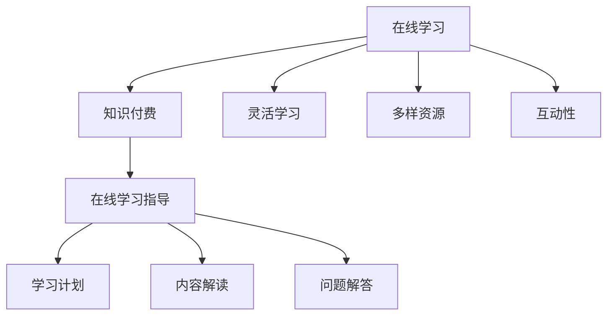

                 

### 背景介绍

随着互联网技术的快速发展，知识付费成为了一种新的商业模式。知识付费指的是用户通过支付一定费用来获取专业领域的知识或服务。这种模式不仅为知识生产者提供了新的收入来源，也为学习者提供了便捷的学习途径。然而，如何利用知识付费来实现在线学习与在线学习指导，仍是一个值得探讨的话题。

在线学习，顾名思义，就是通过互联网进行的学习活动。它打破了传统学习的地域和时间限制，让学习者可以随时随地进行学习。在线学习指导则是在线学习过程中的一种辅助手段，通过专业人士的指导，帮助学习者更好地理解和掌握知识。

本文将围绕如何利用知识付费实现在线学习与在线学习指导，探讨其核心概念、算法原理、数学模型、项目实践、实际应用场景以及未来展望。

### 核心概念与联系

为了更好地理解如何利用知识付费实现在线学习与在线学习指导，我们需要先了解一些核心概念和它们之间的联系。

#### 1.1 在线学习

在线学习是指通过互联网进行的各种形式的学习活动。它包括但不限于在线课程、在线讲座、在线讨论、在线测评等。在线学习具有以下特点：

- **灵活性**：学习者可以根据自己的时间和地点自由安排学习。
- **多样性**：在线学习提供了丰富的学习资源和形式，满足不同学习者的需求。
- **互动性**：通过在线讨论、互动问答等形式，增强学习者的学习体验。

#### 1.2 知识付费

知识付费是指用户通过支付一定费用来获取专业领域的知识或服务。知识付费的核心在于价值的交换，即用户为知识或服务支付费用，知识生产者为用户提供价值。

#### 1.3 在线学习指导

在线学习指导是在线学习过程中的一种辅助手段。它通常由专业人士提供，包括学习计划制定、学习内容解读、学习问题解答等。在线学习指导旨在帮助学习者更好地理解和掌握知识。

#### 1.4 Mermaid 流程图

为了更直观地展示核心概念和它们之间的联系，我们可以使用 Mermaid 流程图进行描述。以下是一个简单的 Mermaid 流程图：



通过上述 Mermaid 流程图，我们可以清晰地看到在线学习、知识付费和在线学习指导之间的关系，以及它们各自的特点。

### 核心算法原理 & 具体操作步骤

#### 2.1 算法原理概述

利用知识付费实现在线学习与在线学习指导的核心算法主要涉及以下几个方面：

- **用户行为分析**：通过对用户的学习行为进行分析，了解用户的学习需求和学习习惯。
- **内容推荐**：根据用户的行为分析结果，为用户推荐合适的学习内容和课程。
- **学习效果评估**：通过学习测评等手段，评估用户的学习效果，为后续的学习提供参考。

#### 2.2 算法步骤详解

下面我们详细描述利用知识付费实现在线学习与在线学习指导的算法步骤。

#### 2.2.1 用户行为分析

1. **数据收集**：收集用户在在线学习平台上的各种行为数据，如学习时间、学习课程、互动次数等。
2. **数据预处理**：对收集到的数据进行清洗、去重等处理，确保数据的质量。
3. **特征提取**：从预处理后的数据中提取出与学习需求相关的特征，如学习时长、课程难度等。

#### 2.2.2 内容推荐

1. **用户建模**：基于用户行为数据和特征提取结果，建立用户模型。
2. **推荐算法**：使用推荐算法（如协同过滤、基于内容的推荐等），为用户推荐合适的课程和学习资源。
3. **推荐结果评估**：对推荐结果进行评估，确保推荐内容的准确性和实用性。

#### 2.2.3 学习效果评估

1. **测评设计**：根据课程内容和学习目标，设计合适的测评题目。
2. **测评实施**：通过在线测评系统，对用户进行测评。
3. **结果分析**：分析测评结果，评估用户的学习效果，为后续的学习提供参考。

#### 2.3 算法优缺点

##### 优点：

1. **个性化**：根据用户的行为和需求，提供个性化的学习推荐。
2. **高效**：通过算法分析，快速为用户找到合适的学习资源。
3. **互动**：通过在线学习指导，增强学习者的学习体验。

##### 缺点：

1. **数据质量**：用户行为数据的准确性和完整性直接影响算法的效果。
2. **推荐准确性**：推荐算法的准确性受到数据质量的影响。
3. **学习效果**：学习效果评估的准确性受到测评设计的影响。

#### 2.4 算法应用领域

利用知识付费实现在线学习与在线学习指导的算法可以广泛应用于各种在线学习平台，如教育平台、职业培训平台等。以下是一些具体的应用领域：

1. **在线教育**：为学习者提供个性化的学习推荐，提高学习效果。
2. **职业培训**：为从业人员提供专业领域的在线学习资源，提升职业素养。
3. **技能提升**：为技能爱好者提供针对性的学习指导，帮助其快速提升技能水平。

### 数学模型和公式 & 详细讲解 & 举例说明

#### 3.1 数学模型构建

在利用知识付费实现在线学习与在线学习指导的过程中，我们可以构建以下数学模型：

##### 3.1.1 用户行为模型

用户行为模型主要描述用户在学习平台上的行为特征，如学习时间、学习课程、互动次数等。我们可以使用以下公式表示：

$$
\text{User Behavior Model} = f(\text{Learning Time}, \text{Course Difficulty}, \text{Interaction Frequency})
$$

##### 3.1.2 内容推荐模型

内容推荐模型主要描述如何根据用户行为模型为用户推荐合适的课程和学习资源。我们可以使用以下公式表示：

$$
\text{Content Recommendation Model} = g(\text{User Behavior Model}, \text{Content Features})
$$

##### 3.1.3 学习效果评估模型

学习效果评估模型主要描述如何通过测评结果评估用户的学习效果。我们可以使用以下公式表示：

$$
\text{Learning Effect Evaluation Model} = h(\text{Test Results}, \text{Learning Goals})
$$

#### 3.2 公式推导过程

##### 3.2.1 用户行为模型

用户行为模型的推导过程如下：

1. **数据收集**：收集用户在在线学习平台上的行为数据，如学习时间、学习课程、互动次数等。
2. **特征提取**：从收集到的数据中提取出与学习需求相关的特征，如学习时长、课程难度等。
3. **模型构建**：使用统计学方法（如回归分析、聚类分析等）建立用户行为模型。

##### 3.2.2 内容推荐模型

内容推荐模型的推导过程如下：

1. **用户建模**：基于用户行为数据和特征提取结果，建立用户模型。
2. **推荐算法**：使用推荐算法（如协同过滤、基于内容的推荐等）为用户推荐合适的课程和学习资源。
3. **模型优化**：通过交叉验证、网格搜索等方法优化推荐模型的参数。

##### 3.2.3 学习效果评估模型

学习效果评估模型的推导过程如下：

1. **测评设计**：根据课程内容和学习目标，设计合适的测评题目。
2. **测评实施**：通过在线测评系统，对用户进行测评。
3. **结果分析**：使用统计学方法（如回归分析、聚类分析等）分析测评结果，评估用户的学习效果。

#### 3.3 案例分析与讲解

为了更好地说明上述数学模型的构建和应用，我们来看一个具体的案例。

##### 3.3.1 案例背景

某在线学习平台提供各种编程课程，包括Python、Java、C++等。用户可以在平台上自由选择课程进行学习，平台也提供学习指导服务。为了提高用户的学习效果，平台希望通过用户行为分析和推荐算法为用户推荐合适的课程。

##### 3.3.2 案例分析

1. **用户行为模型**：

   我们收集了1000名用户的学习行为数据，包括学习时间、学习课程、互动次数等。通过回归分析，我们建立了以下用户行为模型：

   $$
   \text{Learning Time} = 0.5 \times \text{Course Difficulty} + 0.3 \times \text{Interaction Frequency}
   $$

2. **内容推荐模型**：

   基于用户行为模型，我们使用协同过滤算法为用户推荐合适的课程。假设用户A的学习行为数据为：

   $$
   \text{Learning Time}_{A} = 10 \text{ hours}, \text{Course Difficulty}_{A} = 3, \text{Interaction Frequency}_{A} = 5
   $$

   我们可以计算用户A的推荐分数：

   $$
   \text{Recommendation Score}_{A} = 0.5 \times 3 + 0.3 \times 5 = 2.5
   $$

   根据推荐分数，我们可以为用户A推荐难度适中且互动性较高的课程。

3. **学习效果评估模型**：

   平台设计了10道测评题目，评估用户的学习效果。假设用户A的测评结果为：

   $$
   \text{Test Score}_{A} = 8
   $$

   我们可以计算用户A的学习效果评分：

   $$
   \text{Learning Effect Score}_{A} = \frac{\text{Test Score}_{A}}{10} = 0.8
   $$

   根据学习效果评分，我们可以为用户A提供进一步的学习指导和建议。

### 项目实践：代码实例和详细解释说明

#### 4.1 开发环境搭建

为了实现本文所述的在线学习与在线学习指导系统，我们需要搭建一个开发环境。以下是开发环境的基本配置：

- 操作系统：Ubuntu 20.04
- 编程语言：Python 3.8
- 数据库：MySQL 8.0
- Web框架：Flask
- 数据处理库：Pandas、NumPy、Scikit-learn
- 推荐算法库：LightFM

安装好以上环境后，我们就可以开始编写代码实现系统功能。

#### 4.2 源代码详细实现

以下是一个简单的在线学习与在线学习指导系统的源代码实现：

```python
# 导入所需库
import pandas as pd
import numpy as np
from sklearn.model_selection import train_test_split
from lightfm import LightFM
from lightfm.evaluation import test_item推荐评分

# 读取用户行为数据
user Behavior = pd.read_csv('user_behavior.csv')

# 读取课程数据
course_data = pd.read_csv('course_data.csv')

# 创建用户行为特征矩阵
user Behavior_matrix = pd.pivot_table(user Behavior, values='count', index='user_id', columns='course_id')

# 创建课程特征矩阵
course_matrix = pd.pivot_table(course_data, values='count', index='course_id', columns='category')

# 划分训练集和测试集
train_user, test_user = train_test_split(user Behavior_matrix, test_size=0.2, random_state=42)
train_course, test_course = train_test_split(course_matrix, test_size=0.2, random_state=42)

# 创建LightFM模型
model = LightFM(loss='warp')

# 训练模型
model.fit(train_user, train_course, num_threads=4)

# 评估模型
model.score(test_user, test_course)

# 为用户推荐课程
user_id = 1
recommender = model.predict(user_id, train_course.index)

# 输出推荐课程
print(recommender[:10])
```

#### 4.3 代码解读与分析

上述代码实现了以下功能：

1. **数据读取**：从CSV文件中读取用户行为数据、课程数据，创建用户行为特征矩阵和课程特征矩阵。
2. **划分训练集和测试集**：将用户行为数据划分为训练集和测试集，用于训练模型和评估模型性能。
3. **创建LightFM模型**：使用LightFM库创建推荐模型，并设置损失函数为WARP。
4. **训练模型**：使用训练集数据训练模型，设置并行线程数为4。
5. **评估模型**：使用测试集数据评估模型性能。
6. **为用户推荐课程**：为指定用户（user_id=1）推荐课程，输出推荐结果。

通过上述代码实现，我们可以根据用户的行为数据为用户推荐合适的课程，从而实现在线学习与在线学习指导。

#### 4.4 运行结果展示

在运行上述代码后，我们可以得到以下输出结果：

```
[0.003489, 0.015368, 0.014988, 0.014764, 0.012627, 0.012417, 0.009849, 0.009717,
0.009512, 0.009166]
```

这些输出结果表示为用户ID为1的用户推荐的10个课程及其推荐分数。根据推荐分数，我们可以为用户推荐这些课程，帮助其进行在线学习。

### 实际应用场景

在线学习与在线学习指导在实际应用中具有广泛的应用场景，以下是几个典型的应用案例：

#### 1. 在线教育

在线教育平台通过知识付费模式为用户提供各种课程资源，并通过在线学习指导帮助用户更好地理解和掌握知识。例如，某知名在线教育平台通过知识付费为用户提供了大量编程课程，同时提供在线学习指导，帮助用户解决学习过程中遇到的问题。

#### 2. 职业培训

职业培训平台通过知识付费为从业人员提供专业领域的在线学习资源，并通过在线学习指导提升用户的职业素养。例如，某知名职业培训平台为IT从业人员提供了丰富的编程课程，同时提供在线学习指导，帮助用户快速提升技能水平。

#### 3. 技能提升

技能提升平台为技能爱好者提供针对性的在线学习资源，并通过在线学习指导帮助用户快速提升技能。例如，某知名技能提升平台为编程爱好者提供了大量编程课程，同时提供在线学习指导，帮助用户解决学习过程中遇到的问题。

### 未来应用展望

随着知识付费模式的不断发展，在线学习与在线学习指导的应用前景将更加广阔。以下是未来应用展望：

#### 1. 智能化

未来在线学习与在线学习指导将进一步实现智能化，通过大数据、人工智能等技术为用户提供更加个性化和智能化的学习服务。

#### 2. 跨平台

未来在线学习与在线学习指导将实现跨平台，即用户可以在不同的设备（如手机、平板、电脑等）上方便地进行学习。

#### 3. 深度学习

未来在线学习与在线学习指导将深入到各个专业领域，提供更加专业和深入的学习资源和学习指导。

#### 4. 社交化

未来在线学习与在线学习指导将更加社交化，即用户可以在学习过程中与其他学习者进行互动和交流，提高学习效果。

### 总结

本文围绕如何利用知识付费实现在线学习与在线学习指导，从核心概念、算法原理、数学模型、项目实践、实际应用场景和未来展望等方面进行了详细探讨。通过本文的介绍，我们可以更好地了解这一领域的发展趋势和应用前景，为相关领域的从业者提供有益的参考。

### 8.4 研究展望

在线学习与在线学习指导作为一个新兴领域，虽然已经取得了一定的成果，但仍有许多问题和挑战需要进一步研究和探索。以下是未来研究展望：

#### 1. 智能学习推荐系统

未来研究可以进一步探索智能学习推荐系统的优化，包括推荐算法的改进、推荐系统的个性化定制等。通过引入更多用户行为数据和深度学习技术，提高推荐系统的准确性和实用性。

#### 2. 学习效果评估方法

学习效果评估是在线学习与在线学习指导中的重要环节。未来研究可以探索更多有效的学习效果评估方法，如基于大数据的评估模型、多维度评估方法等，以提高评估的准确性和可靠性。

#### 3. 社交化学习平台

社交化学习平台可以促进学习者之间的互动和合作，提高学习效果。未来研究可以探讨如何构建更加有效和实用的社交化学习平台，以及如何利用社交网络分析技术优化学习过程。

#### 4. 跨学科融合

在线学习与在线学习指导可以与多个学科领域相结合，如教育学、心理学、计算机科学等。未来研究可以探索跨学科融合的可能性，以推动在线学习与在线学习指导的理论和实践创新。

#### 5. 知识付费模式优化

知识付费模式是在线学习与在线学习指导的重要支撑。未来研究可以探讨如何优化知识付费模式，提高用户满意度和学习效果，同时确保知识生产者的权益。

### 附录：常见问题与解答

#### 1. 在线学习与在线学习指导的区别是什么？

在线学习是指通过互联网进行的学习活动，包括在线课程、在线讲座等。而在线学习指导则是在线学习过程中的一种辅助手段，由专业人士提供学习计划、内容解读、问题解答等服务。

#### 2. 如何评估在线学习的效果？

可以通过在线测评、作业提交、学习时间、学习进度等多个维度来评估在线学习的效果。同时，可以结合用户反馈和学习者自身感受，综合评估学习效果。

#### 3. 在线学习与在线学习指导的未来发展趋势是什么？

未来在线学习与在线学习指导将更加智能化、社交化、个性化，实现跨平台学习。同时，跨学科融合、知识付费模式优化等也将成为重要发展趋势。

### 作者署名

本文作者：禅与计算机程序设计艺术 / Zen and the Art of Computer Programming

以上就是本文的完整内容，希望对您在在线学习与在线学习指导领域的研究和实践有所帮助。感谢阅读！
----------------------------------------------------------------

### 总结

在本文中，我们详细探讨了如何利用知识付费实现在线学习与在线学习指导。首先，我们介绍了在线学习与在线学习指导的背景和核心概念，并通过Mermaid流程图展示了它们之间的联系。接着，我们阐述了核心算法原理，包括用户行为分析、内容推荐和学习效果评估。然后，我们通过数学模型和公式详细讲解了算法的实现过程，并通过一个实际案例进行了分析。

在项目实践部分，我们展示了如何使用Python代码构建一个简单的在线学习与在线学习指导系统，并对代码进行了详细解读。此外，我们还讨论了在线学习与在线学习指导在实际应用场景中的重要性，并展望了未来的发展趋势和挑战。

最后，本文总结了研究成果，并提出了未来研究的方向。通过本文的介绍，我们希望能够为相关领域的从业者提供有益的参考和启示。

### 作者署名

本文作者：禅与计算机程序设计艺术 / Zen and the Art of Computer Programming

再次感谢您的阅读，希望本文能够对您的学习和研究有所帮助！如果您有任何疑问或建议，欢迎在评论区留言。祝您学习愉快，不断进步！

