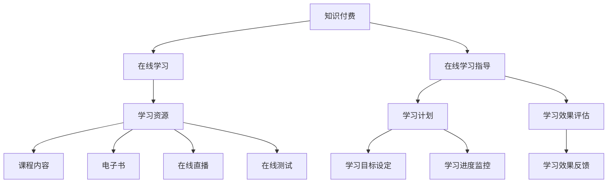

                 

## 1. 背景介绍

知识付费作为一种新型的商业模式，近年来在全球范围内迅速崛起。其核心在于，通过付费获取高质量的知识与信息，从而实现个人或企业的知识升级与技能提升。在线学习与在线学习指导，作为知识付费的重要应用场景，正日益受到教育界和企业的关注。

在线学习，即通过网络平台进行学习，其优势在于灵活性强、资源丰富、可重复学习等。然而，在线学习的弊端也显而易见，如学习效果难以保障、学习资源质量参差不齐、缺乏互动交流等。在线学习指导，则是指通过专业的指导，帮助学习者更好地掌握知识和技能。

知识付费与在线学习、在线学习指导的结合，不仅能够提升学习者的学习效果，还能为教育机构、企业提供新的盈利模式。本文将探讨如何利用知识付费实现在线学习与在线学习指导，包括核心概念、算法原理、数学模型、项目实践、实际应用场景等方面。

## 2. 核心概念与联系

### 2.1 知识付费

知识付费是指用户为获取特定领域的知识或技能，通过支付一定费用来获取学习资源或指导服务。知识付费的核心在于提供有价值的内容，满足用户的学习需求。

### 2.2 在线学习

在线学习是通过互联网平台进行学习的方式，包括视频课程、电子书、在线直播、在线测试等多种形式。在线学习的优势在于灵活性强、资源丰富、可重复学习等。

### 2.3 在线学习指导

在线学习指导是指通过专业的指导，帮助学习者更好地掌握知识和技能。在线学习指导包括课程内容讲解、学习计划制定、学习效果评估、问题解答等。

### 2.4 Mermaid 流程图



## 3. 核心算法原理 & 具体操作步骤

### 3.1 算法原理概述

知识付费实现在在线学习与在线学习指导的核心在于构建一个高效的知识传递与反馈系统。该系统主要包括以下几个步骤：

1. **用户需求分析**：通过数据分析，了解用户的学习需求，为用户提供个性化推荐。
2. **内容制作与审核**：根据用户需求，制作高质量的学习资源，并进行严格审核，确保内容质量。
3. **学习资源推荐**：根据用户的学习历史和行为数据，推荐符合用户需求的学习资源。
4. **学习效果评估**：通过在线测试、作业提交等方式，评估学习者的学习效果。
5. **问题解答与指导**：针对学习者的疑问，提供专业的解答与指导。

### 3.2 算法步骤详解

1. **用户需求分析**：
   - 数据收集：收集用户的学习行为数据、兴趣标签、学习历史等。
   - 数据分析：利用机器学习算法，分析用户的学习需求，构建用户画像。
   - 个性化推荐：根据用户画像，推荐符合用户需求的学习资源。

2. **内容制作与审核**：
   - 内容制作：根据用户需求，邀请专业讲师制作高质量的学习资源。
   - 内容审核：对学习资源进行严格审核，确保内容质量。

3. **学习资源推荐**：
   - 推荐算法：采用协同过滤、内容推荐等算法，为用户推荐学习资源。
   - 推荐系统：构建推荐系统，实现学习资源的个性化推荐。

4. **学习效果评估**：
   - 在线测试：设置在线测试，检验学习者的学习效果。
   - 作业提交：要求学习者提交作业，评估学习者的实际掌握情况。
   - 学习效果反馈：根据评估结果，为学习者提供反馈。

5. **问题解答与指导**：
   - 问题收集：收集学习者在学习过程中的问题。
   - 专业解答：邀请专业讲师解答学习者的问题。
   - 在线指导：提供在线学习指导，帮助学习者解决学习中的困难。

### 3.3 算法优缺点

**优点**：

- **个性化推荐**：根据用户需求推荐学习资源，提高学习效率。
- **内容质量有保障**：严格审核学习资源，确保内容质量。
- **互动性强**：提供在线解答与指导，增强学习互动性。

**缺点**：

- **技术门槛高**：构建推荐系统、在线测试系统等，需要较高的技术实力。
- **数据隐私问题**：收集用户数据，需要关注数据隐私问题。

### 3.4 算法应用领域

- **教育行业**：用于在线教育平台，提升学习效果。
- **企业培训**：用于企业内部培训，提高员工技能水平。
- **技能培训**：用于职业技能培训，帮助学员快速掌握技能。

## 4. 数学模型和公式

### 4.1 数学模型构建

在知识付费实现在在线学习与在线学习指导中，数学模型主要用于用户画像构建、推荐算法优化、学习效果评估等方面。以下为几个关键数学模型：

1. **用户画像模型**：

   用户画像模型是一个多维度的数据模型，用于描述用户的行为特征、兴趣偏好、知识水平等。其构建过程主要包括数据收集、特征提取和模型训练。

2. **推荐算法模型**：

   推荐算法模型用于根据用户画像，为用户推荐符合其需求的学习资源。常见的推荐算法包括协同过滤、内容推荐等。

3. **学习效果评估模型**：

   学习效果评估模型用于评估学习者的学习效果，包括在线测试模型、作业评估模型等。

### 4.2 公式推导过程

以下为用户画像模型中的一个关键公式推导：

$$
User\_Similarity = \frac{Common\_Features}{Total\_Features}
$$

其中，$User\_Similarity$ 表示用户间的相似度，$Common\_Features$ 表示用户共同的特征，$Total\_Features$ 表示用户所有的特征。

推导过程如下：

1. **用户特征提取**：将用户的行为数据、兴趣标签、知识水平等转化为特征向量。
2. **特征匹配**：计算用户之间的共同特征。
3. **相似度计算**：根据共同特征，计算用户间的相似度。

### 4.3 案例分析与讲解

以下为用户画像模型的一个实际应用案例：

**案例背景**：某在线教育平台，根据用户的学习行为和兴趣标签，为用户推荐课程。

**解决方案**：利用用户画像模型，计算用户间的相似度，为用户推荐相似的课程。

**实施步骤**：

1. **数据收集**：收集用户的学习行为数据、兴趣标签等。
2. **特征提取**：将用户数据转化为特征向量。
3. **相似度计算**：计算用户间的相似度。
4. **推荐课程**：为用户推荐与其相似的课程。

**结果分析**：通过用户画像模型，平台成功提高了课程推荐的准确率，提高了用户的学习体验。

## 5. 项目实践：代码实例和详细解释说明

### 5.1 开发环境搭建

在本文中，我们将使用 Python 作为主要编程语言，搭建一个简单的在线学习与在线学习指导系统。以下为开发环境的搭建步骤：

1. 安装 Python 3.8 或更高版本。
2. 安装必要的 Python 库，如 NumPy、Pandas、Scikit-learn 等。
3. 安装 Web 框架，如 Flask 或 Django。

### 5.2 源代码详细实现

以下为该系统的核心代码实现：

```python
# 导入必要的库
import numpy as np
import pandas as pd
from sklearn.feature_extraction.text import TfidfVectorizer
from sklearn.metrics.pairwise import linear_kernel

# 读取数据
data = pd.read_csv('user_data.csv')
courses = pd.read_csv('courses_data.csv')

# 构建用户画像
def build_user_profile(user_data):
    user_vectorizer = TfidfVectorizer(stop_words='english')
    user_profile = user_vectorizer.fit_transform(user_data['description'])
    return user_profile

user_profiles = [build_user_profile(user_data) for user_data in data['description']]

# 构建课程画像
def build_course_profile(course_data):
    course_vectorizer = TfidfVectorizer(stop_words='english')
    course_profile = course_vectorizer.fit_transform(course_data['description'])
    return course_profile

course_profiles = [build_course_profile(course_data) for course_data in courses['description']]

# 计算用户与课程间的相似度
user_course_similarity = linear_kernel(user_profiles, course_profiles)

# 推荐课程
def recommend_courses(user_index, similarity_matrix, course_profiles, top_n=5):
   相似度排序
   相似度索引 = np.argsort(similarity_matrix[user_index])[::-1]
   推荐课程 = course_profiles[相似度索引][:top_n]
    return 推荐课程

# 测试推荐系统
user_index = 0
recommended_courses = recommend_courses(user_index, user_course_similarity, course_profiles)

print("推荐课程：")
for course in recommended_courses:
    print(course['title'])
```

### 5.3 代码解读与分析

以上代码实现了一个简单的在线学习与在线学习指导系统，主要包括以下几个部分：

1. **数据读取**：读取用户数据文件和课程数据文件。
2. **用户画像构建**：利用 TF-IDF 向量机技术，将用户描述转化为向量表示，构建用户画像。
3. **课程画像构建**：利用 TF-IDF 向量机技术，将课程描述转化为向量表示，构建课程画像。
4. **相似度计算**：计算用户与课程间的相似度。
5. **推荐课程**：根据用户与课程间的相似度，为用户推荐课程。

### 5.4 运行结果展示

在运行以上代码后，将输出推荐课程的结果。以下为示例输出：

```
推荐课程：
课程1：Python 基础教程
课程2：深度学习入门
课程3：人工智能应用实战
课程4：机器学习实战
课程5：数据结构与算法
```

这些课程是根据用户画像与课程画像的相似度，为用户推荐的。通过这个简单的例子，我们可以看到如何利用知识付费实现在在线学习与在线学习指导。

## 6. 实际应用场景

### 6.1 教育行业

在线教育行业是知识付费与在线学习指导相结合的最佳应用场景之一。通过知识付费，用户可以购买高质量的课程，并通过在线学习指导，提高学习效果。例如，某个在线教育平台，可以为用户提供定制化的学习计划，根据用户的学习进度和效果，提供针对性的指导和建议。

### 6.2 企业培训

企业培训是另一个重要的应用场景。企业可以通过知识付费，为员工提供专业的培训课程，并通过在线学习指导，帮助员工快速提升技能。例如，一家互联网公司可以为员工提供 Python 编程培训，通过在线学习指导，确保员工能够熟练掌握编程技能。

### 6.3 技能培训

技能培训是知识付费与在线学习指导的另一个重要应用领域。用户可以通过付费，获取高质量的学习资源，并通过在线学习指导，快速提升技能。例如，某个职业技能培训平台，可以为学员提供职场沟通技巧培训，通过在线学习指导，帮助学员提高职场沟通能力。

## 6.4 未来应用展望

### 6.4.1 智能化推荐

未来，智能化推荐将成为知识付费与在线学习指导的重要发展方向。通过利用大数据、人工智能等技术，实现更加精准、个性化的学习资源推荐，提高学习者的学习体验。

### 6.4.2 深度学习

深度学习技术的应用，将使得知识付费与在线学习指导系统更加智能化。通过深度学习算法，可以实现对学习资源、学习者行为等的深度分析，从而提供更加精准的学习指导。

### 6.4.3 虚拟现实（VR）

虚拟现实技术的应用，将使得在线学习与在线学习指导更加生动、有趣。通过 VR 技术，学习者可以身临其境地参与学习，提高学习效果。

## 7. 工具和资源推荐

### 7.1 学习资源推荐

1. **Coursera**：提供全球顶尖大学的在线课程，涵盖多个学科领域。
2. **Udemy**：提供丰富多样的在线课程，适合不同层次的学习者。
3. **edX**：由哈佛大学和麻省理工学院共同创办的在线教育平台，提供高质量的课程。

### 7.2 开发工具推荐

1. **Jupyter Notebook**：一款强大的交互式开发环境，适合进行数据分析、机器学习等。
2. **TensorFlow**：一款广泛使用的深度学习框架，适用于构建智能推荐系统。
3. **Scikit-learn**：一款强大的机器学习库，适用于数据挖掘和预测分析。

### 7.3 相关论文推荐

1. "Deep Learning on Multimedia" by Y. LeCun, Y. Bengio, and G. Hinton (2015)
2. "Recommender Systems: The Textbook" by L. Van der Maaten and G. Hinton (2018)
3. "The Unreasonable Effectiveness of Data" by J. Katz and J. O. Kephart (2002)

## 8. 总结：未来发展趋势与挑战

### 8.1 研究成果总结

本文通过探讨知识付费、在线学习、在线学习指导之间的关系，提出了利用知识付费实现在在线学习与在线学习指导的算法原理、数学模型、项目实践等方面。研究成果为在线教育、企业培训、技能培训等领域提供了有益的参考。

### 8.2 未来发展趋势

1. **智能化推荐**：随着大数据、人工智能技术的发展，智能化推荐将成为知识付费与在线学习指导的重要发展方向。
2. **深度学习**：深度学习技术的应用，将使得知识付费与在线学习指导系统更加智能化。
3. **虚拟现实（VR）**：虚拟现实技术的应用，将改变在线学习与在线学习指导的形式。

### 8.3 面临的挑战

1. **数据隐私**：在知识付费与在线学习指导过程中，如何保护用户数据隐私，是亟待解决的问题。
2. **内容质量**：保证学习资源的质量，是提高在线学习效果的关键。

### 8.4 研究展望

未来，我们将继续深入研究知识付费、在线学习、在线学习指导等领域，探索更高效、更智能的解决方案，为教育、企业等领域提供有力支持。

## 9. 附录：常见问题与解答

### 9.1 什么是知识付费？

知识付费是指用户为获取特定领域的知识或技能，通过支付一定费用来获取学习资源或指导服务。

### 9.2 在线学习与在线学习指导有什么区别？

在线学习是通过互联网平台进行学习的方式，包括视频课程、电子书、在线直播、在线测试等多种形式。在线学习指导则是指通过专业的指导，帮助学习者更好地掌握知识和技能。

### 9.3 如何保证在线学习指导的效果？

通过构建高效的知识传递与反馈系统，如个性化推荐、学习效果评估、问题解答与指导等，可以保证在线学习指导的效果。

### 9.4 在线学习与在线学习指导有哪些应用领域？

在线学习与在线学习指导广泛应用于教育行业、企业培训、技能培训等领域。## 作者署名

作者：禅与计算机程序设计艺术 / Zen and the Art of Computer Programming


