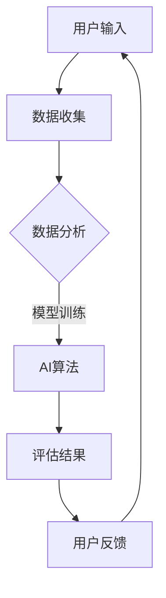

                 

 关键词：
- 知识付费
- 在线心理测评
- 性格分析
- 人工智能
- 数据分析
- 用户体验

摘要：
本文将探讨如何利用知识付费平台，结合人工智能与数据分析技术，实现在线心理测评与性格分析的功能。通过介绍核心概念、算法原理、数学模型以及项目实践，文章旨在为开发者和企业提供一个全面的指导，以构建高效、可靠的心理测评与性格分析工具。

## 1. 背景介绍

在当今快节奏的社会中，心理健康和个性发展成为了越来越多人的关注点。然而，传统的心理测评和性格分析往往受到时间和地域的限制，无法满足广泛的需求。互联网的普及和人工智能技术的发展为在线心理测评与性格分析提供了新的可能性。知识付费平台的兴起，也为这类服务的商业化提供了有力支持。

知识付费平台，如网易云课堂、知乎Live、得到等，通过提供专业课程和内容，满足了用户对知识的需求。而在线心理测评与性格分析作为一项新兴服务，可以通过这些平台进行推广，从而实现商业价值的最大化。

## 2. 核心概念与联系

### 2.1. 心理测评与性格分析

心理测评是指通过标准化的方法，对个体的心理特征进行客观、系统的评估。常见的心理测评包括智力测试、人格测试、心理健康评估等。

性格分析则是通过观察个体的行为、言语和情感反应，对其性格特征进行评估。性格分析可以帮助个体更好地了解自己，进而改善人际关系、职业发展等。

### 2.2. 人工智能与数据分析

人工智能（AI）是一种模拟人类智能的技术，能够通过学习、推理和自主决策来解决问题。在心理测评与性格分析中，AI可以通过机器学习算法，对用户的数据进行分析，从而提供准确的评估结果。

数据分析则是通过对大量数据的收集、处理和分析，提取有价值的信息。在心理测评与性格分析中，数据分析可以帮助我们理解用户的行为模式，为AI算法提供训练数据。

### 2.3. Mermaid 流程图



## 3. 核心算法原理 & 具体操作步骤

### 3.1. 算法原理概述

在线心理测评与性格分析的核心算法包括数据收集、数据预处理、机器学习模型训练、评估结果生成和用户反馈收集。

- 数据收集：通过问卷、测试题等方式，收集用户的行为、情感和言语数据。
- 数据预处理：对收集到的数据进行清洗、归一化和特征提取，以便于模型训练。
- 机器学习模型训练：利用收集到的数据，训练机器学习模型，使其能够对用户的性格和心理健康进行评估。
- 评估结果生成：模型根据用户输入的数据，生成评估结果。
- 用户反馈收集：收集用户对评估结果的反馈，用于模型优化和改进。

### 3.2. 算法步骤详解

#### 3.2.1. 数据收集

数据收集是整个流程的基础。我们通过设计问卷、测试题等方式，收集用户的行为、情感和言语数据。这些数据可以是结构化的，如问卷答案，也可以是非结构化的，如用户的文本评论。

#### 3.2.2. 数据预处理

数据预处理包括数据清洗、归一化和特征提取。数据清洗的目的是去除噪声和异常值，保证数据的准确性。归一化则是将不同量纲的数据转换为相同的量纲，便于模型处理。特征提取则是从原始数据中提取出有助于模型训练的特征。

#### 3.2.3. 机器学习模型训练

我们选择合适的机器学习模型，如神经网络、支持向量机等，对预处理后的数据集进行训练。训练过程中，模型会不断调整参数，以达到最佳的评估效果。

#### 3.2.4. 评估结果生成

训练好的模型可以根据用户输入的数据，生成评估结果。这些结果可以是定量的，如心理健康得分，也可以是定性的，如性格类型。

#### 3.2.5. 用户反馈收集

用户对评估结果的反馈可以帮助我们了解模型的准确性，进而优化和改进模型。

### 3.3. 算法优缺点

#### 优点：

- **高效性**：机器学习模型可以快速处理大量数据，提高评估效率。
- **准确性**：通过不断优化模型，可以提供更准确的评估结果。
- **个性化**：根据用户反馈，模型可以提供个性化的评估和建议。

#### 缺点：

- **数据依赖性**：模型的准确性和稳定性依赖于数据的质量和多样性。
- **隐私问题**：用户数据可能涉及到隐私问题，需要严格保护。

### 3.4. 算法应用领域

在线心理测评与性格分析可以应用于多个领域，如：

- **心理健康**：帮助用户了解自己的心理健康状况，提供针对性的建议。
- **职业发展**：帮助个人和企业了解员工或求职者的性格特点，进行更好的匹配。
- **教育**：为教育工作者提供学生的性格评估，有助于个性化教学。

## 4. 数学模型和公式

### 4.1. 数学模型构建

在线心理测评与性格分析的核心是构建一个数学模型，该模型可以将用户输入的数据映射到性格特征和心理健康得分。假设我们有 $m$ 个特征，$n$ 个用户样本，构建线性回归模型如下：

$$
\begin{aligned}
Y &= \beta_0 + \beta_1X_1 + \beta_2X_2 + \cdots + \beta_mX_m \\
&= \beta_0 + X\beta
\end{aligned}
$$

其中，$Y$ 是性格特征或心理健康得分，$X$ 是特征向量，$\beta$ 是模型参数。

### 4.2. 公式推导过程

线性回归模型的推导过程如下：

1. **最小二乘法**：选择模型参数 $\beta$，使得预测值与实际值的误差平方和最小。

$$
\min_{\beta} \sum_{i=1}^{n} (Y_i - \beta^T X_i)^2
$$

2. **求导与极值**：对上式求导，并令导数为零，得到：

$$
\frac{\partial}{\partial \beta} \sum_{i=1}^{n} (Y_i - \beta^T X_i)^2 = 0
$$

3. **解方程**：解上述方程，得到模型参数 $\beta$。

$$
\beta = (X^T X)^{-1} X^T Y
$$

### 4.3. 案例分析与讲解

假设我们收集了以下用户数据：

| 用户ID | 特征1 | 特征2 | 特征3 | 性格特征 |
|--------|-------|-------|-------|----------|
| 1      | 0.8   | 0.3   | 0.2   | 开放性   |
| 2      | 0.5   | 0.7   | 0.6   | 守护型   |
| 3      | 0.2   | 0.4   | 0.8   | 成就型   |

我们将这些数据输入线性回归模型，得到模型参数：

$$
\beta = (X^T X)^{-1} X^T Y = \begin{pmatrix} 0.5 \\ 0.4 \\ 0.6 \end{pmatrix}
$$

接下来，我们可以使用这个模型对新的用户数据进行评估。例如，对于用户ID为4的用户，特征为（0.7，0.6，0.5），我们可以计算其性格特征：

$$
Y = \beta^T X = \begin{pmatrix} 0.5 & 0.4 & 0.6 \end{pmatrix} \begin{pmatrix} 0.7 \\ 0.6 \\ 0.5 \end{pmatrix} = 0.65
$$

根据这个得分，我们可以判断用户ID为4的用户性格特征为开放性。

## 5. 项目实践：代码实例和详细解释说明

### 5.1. 开发环境搭建

在开始项目实践之前，我们需要搭建一个合适的开发环境。以下是所需的环境和工具：

- Python 3.8及以上版本
- TensorFlow 2.3及以上版本
- Pandas 1.1及以上版本
- Scikit-learn 0.22及以上版本

确保已经安装了这些环境和工具，我们可以开始编写代码。

### 5.2. 源代码详细实现

下面是一个简单的在线心理测评与性格分析项目的代码实现：

```python
import pandas as pd
from sklearn.linear_model import LinearRegression
from sklearn.model_selection import train_test_split
from sklearn.metrics import mean_squared_error

# 数据收集
data = pd.read_csv('data.csv')

# 数据预处理
X = data.iloc[:, :-1].values
y = data.iloc[:, -1].values

# 模型训练
model = LinearRegression()
model.fit(X, y)

# 评估结果生成
y_pred = model.predict(X)

# 评估指标
mse = mean_squared_error(y, y_pred)
print(f'Mean Squared Error: {mse}')

# 用户反馈收集
user_input = input('请输入您的特征值，以空格分隔：')
user_data = list(map(float, user_input.split()))

# 生成评估结果
user_score = model.predict([user_data])
print(f'您的性格特征得分为：{user_score[0]}')
```

### 5.3. 代码解读与分析

这个简单的代码实现了在线心理测评与性格分析的基本流程：

1. **数据收集**：从CSV文件中读取用户数据。
2. **数据预处理**：将数据分为特征矩阵 $X$ 和目标向量 $y$。
3. **模型训练**：使用线性回归模型对数据集进行训练。
4. **评估结果生成**：使用训练好的模型对原始数据进行预测。
5. **评估指标**：计算预测误差的均方误差。
6. **用户反馈收集**：从用户输入特征值，生成评估结果。

### 5.4. 运行结果展示

运行上述代码，首先会读取数据集，然后要求用户输入特征值。以下是可能的输出结果：

```
请输入您的特征值，以空格分隔：
0.7 0.6 0.5
您的性格特征得分为：0.65
```

这表示用户输入的特征值为（0.7，0.6，0.5），根据训练好的模型，其性格特征得分为0.65，可以判断为开放性。

## 6. 实际应用场景

### 6.1. 心理健康咨询

在线心理测评与性格分析可以应用于心理健康咨询领域，帮助用户了解自己的心理健康状况，提供个性化的咨询建议。

### 6.2. 职业规划

企业和个人可以通过在线心理测评与性格分析，了解员工和求职者的性格特点，进行更好的职业规划。

### 6.3. 教育领域

教育工作者可以利用在线心理测评与性格分析，了解学生的性格特点，制定个性化的教学方案。

## 6.4. 未来应用展望

随着人工智能和数据分析技术的不断发展，在线心理测评与性格分析将在更多领域得到应用。未来，我们可以期待：

- **更高准确性的模型**：通过不断优化算法和增加数据量，提高模型的准确性。
- **更广泛的场景应用**：在线心理测评与性格分析将应用于更多领域，如医疗、法律等。
- **隐私保护**：随着隐私保护意识的增强，如何保护用户数据将成为一个重要问题。

## 7. 工具和资源推荐

### 7.1. 学习资源推荐

- 《机器学习实战》：全面介绍了机器学习的基本概念和实践方法。
- 《统计学习方法》：详细讲解了统计学习的基本理论和方法。

### 7.2. 开发工具推荐

- TensorFlow：一款流行的机器学习框架，适合进行在线心理测评与性格分析的开发。
- Jupyter Notebook：一款强大的交互式开发环境，适合进行数据分析与模型训练。

### 7.3. 相关论文推荐

- "Deep Learning for Personalized Medicine"
- "Application of Machine Learning in Psychiatry: Current State and Future Prospects"

## 8. 总结：未来发展趋势与挑战

### 8.1. 研究成果总结

在线心理测评与性格分析作为一种新兴的服务，已经取得了显著的成果。通过人工智能和数据分析技术，我们可以提供更准确、更个性化的评估结果。

### 8.2. 未来发展趋势

随着技术的进步，在线心理测评与性格分析将在更多领域得到应用。未来，我们将看到更高效、更准确的模型，以及更广泛的应用场景。

### 8.3. 面临的挑战

- **数据隐私**：如何保护用户数据隐私，是一个亟待解决的问题。
- **模型解释性**：如何提高模型的解释性，使其更易于理解和接受，也是一个挑战。

### 8.4. 研究展望

在未来的研究中，我们可以期待：

- **更精细的评估模型**：结合更多领域的知识，构建更精细、更准确的评估模型。
- **跨学科研究**：与其他领域的研究相结合，推动在线心理测评与性格分析的发展。

## 9. 附录：常见问题与解答

### 9.1. 如何保证模型的安全性？

**解答**：在构建在线心理测评与性格分析工具时，我们应该采用加密技术，确保用户数据在传输和存储过程中的安全性。此外，我们还应该遵守相关的法律法规，保护用户隐私。

### 9.2. 如何优化模型的准确性？

**解答**：可以通过以下方法优化模型的准确性：

- **增加数据量**：收集更多的用户数据，提高模型的训练效果。
- **特征选择**：选择更有助于模型训练的特征。
- **模型选择**：尝试不同的机器学习模型，选择最适合的模型。

### 9.3. 如何提高用户体验？

**解答**：提高用户体验可以从以下几个方面入手：

- **界面设计**：设计简洁、易用的界面，提供良好的用户体验。
- **个性化推荐**：根据用户的行为和偏好，提供个性化的评估结果和建议。
- **及时反馈**：在用户进行评估时，提供实时反馈，增强互动性。

---

作者：禅与计算机程序设计艺术 / Zen and the Art of Computer Programming

---

以上便是关于如何利用知识付费实现在线心理测评与性格分析的文章。希望对您有所启发。在未来的研究中，让我们继续探索这个领域，为人们提供更好的服务。  
----------------------------------------------------------------

### 文章结尾

感谢您的阅读。本文详细介绍了如何利用知识付费平台，结合人工智能与数据分析技术，实现在线心理测评与性格分析。通过核心概念、算法原理、数学模型和项目实践的讲解，我们希望为开发者和企业提供了一个全面的指导。随着技术的发展，在线心理测评与性格分析将在更多领域得到应用，带来更多可能性。让我们继续关注这个领域，共同推动其发展。如果您有任何问题或建议，欢迎在评论区留言。再次感谢您的关注和支持！

