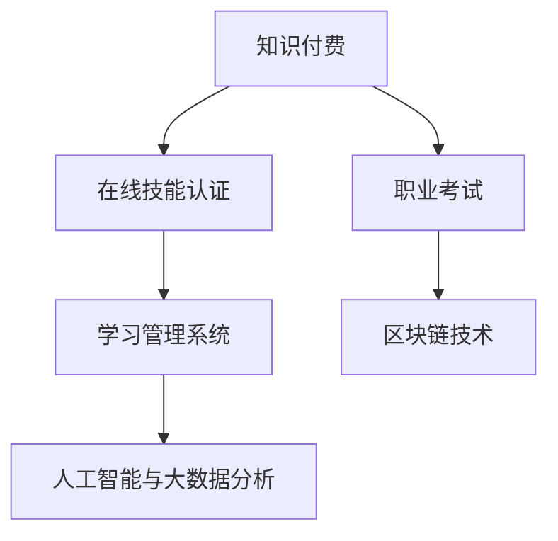

                 

关键词：知识付费、在线技能认证、职业考试、在线教育、学习管理系统、区块链技术、人工智能、大数据分析

摘要：本文将探讨如何利用知识付费模式，结合在线技能认证与职业考试，实现个人能力的数字化认证与职业发展的精准匹配。通过分析核心概念、算法原理、数学模型、项目实践及未来应用场景，探讨这一领域的技术发展趋势和挑战。

## 1. 背景介绍

随着互联网技术的发展，在线教育行业经历了迅猛增长。知识付费作为一种新兴的商业模式，逐渐成为教育行业的重要组成部分。知识付费不仅为内容创作者提供了收入来源，也为学习者提供了更为灵活和高效的学习途径。

与此同时，技能认证与职业考试在职业发展中的重要性日益凸显。传统的技能认证与考试方式存在诸多限制，如地理限制、时间限制和费用问题。而在线技能认证与职业考试则可以打破这些限制，为全球的学习者和求职者提供平等的机会。

本文旨在探讨如何利用知识付费模式，结合在线技能认证与职业考试，实现个人能力的数字化认证与职业发展的精准匹配。通过分析相关技术、算法和实际应用案例，为这一领域的发展提供参考。

## 2. 核心概念与联系

### 2.1 知识付费

知识付费是指用户为获取特定知识或服务而支付的费用。这种模式在在线教育领域得到了广泛应用，用户可以根据自身需求选择不同的课程和服务，从而实现个性化学习。

### 2.2 在线技能认证

在线技能认证是指通过互联网平台，对学习者的技能水平进行评估和认证的过程。这种认证方式可以打破地理和时间的限制，为全球的学习者提供平等的机会。

### 2.3 职业考试

职业考试是指针对特定职业或行业的技能和知识进行测试的考试。在线职业考试可以降低考试成本，提高考试效率，为求职者提供更便捷的考试体验。

### 2.4 学习管理系统（LMS）

学习管理系统是一种用于管理和跟踪在线学习活动的软件平台。它可以提供课程管理、学生管理、考试管理等功能，为在线技能认证和职业考试提供支持。

### 2.5 区块链技术

区块链技术是一种分布式数据库技术，具有去中心化、不可篡改等特点。在知识付费和在线技能认证领域，区块链技术可以确保数据的安全性和透明性。

### 2.6 人工智能与大数据分析

人工智能和大数据分析技术在知识付费和在线技能认证领域具有广泛应用。通过人工智能技术，可以分析学习者的行为数据，为个性化推荐课程和服务提供支持。大数据分析则可以帮助教育机构了解学习者的需求，优化课程设计和教学策略。

### 2.7 Mermaid 流程图



## 3. 核心算法原理 & 具体操作步骤

### 3.1 算法原理概述

知识付费、在线技能认证和职业考试的核心算法原理包括：用户行为分析、课程推荐算法、考试评分算法和数据加密算法。

### 3.2 算法步骤详解

1. 用户行为分析：通过分析用户的学习记录、浏览记录和反馈信息，了解用户的学习需求和偏好。

2. 课程推荐算法：根据用户行为分析结果，为用户提供个性化的课程推荐。

3. 考试评分算法：根据考试题目和用户答题情况，自动评分并生成考试成绩。

4. 数据加密算法：使用区块链技术对用户数据和学习记录进行加密，确保数据安全。

### 3.3 算法优缺点

优点：
- 个性化推荐：提高学习效果，降低学习成本。
- 自动评分：提高考试效率，降低考试成本。
- 数据加密：确保用户隐私和数据安全。

缺点：
- 需要大量数据支持：算法效果受限于数据质量。
- 技术门槛较高：需要具备相关技术知识和开发能力。

### 3.4 算法应用领域

知识付费、在线技能认证和职业考试的核心算法可以应用于以下领域：
- 在线教育平台：为用户提供个性化课程推荐和在线考试服务。
- 企业培训：为企业员工提供在线培训和技能认证。
- 人才招聘：为求职者提供在线技能评估和职业考试。

## 4. 数学模型和公式

### 4.1 数学模型构建

在知识付费、在线技能认证和职业考试领域，数学模型主要涉及用户行为分析、课程推荐和考试评分等方面。

### 4.2 公式推导过程

1. 用户行为分析模型：

$$
User\_Behavior = f(User\_Profile, Course\_Content, Learning\_Environment)
$$

其中，User\_Profile 表示用户属性，Course\_Content 表示课程内容，Learning\_Environment 表示学习环境。

2. 课程推荐模型：

$$
Course\_Recommendation = f(Course\_Features, User\_Behavior)
$$

其中，Course\_Features 表示课程特征，User\_Behavior 表示用户行为。

3. 考试评分模型：

$$
Exam\_Score = f(Question\_Difficulty, User\_Answer)
$$

其中，Question\_Difficulty 表示题目难度，User\_Answer 表示用户答案。

### 4.3 案例分析与讲解

以在线教育平台为例，分析用户行为分析模型和课程推荐模型在实际应用中的效果。

### 4.3.1 案例一：用户行为分析模型

假设用户 A 的 User\_Profile 为：年龄 25 岁，性别男，学习过 Java 编程语言。Course\_Content 为：Python 编程课程，Learning\_Environment 为：在线学习平台。

根据用户行为分析模型，可以计算出 User\_Behavior：

$$
User\_Behavior = f(User\_Profile, Course\_Content, Learning\_Environment)
$$

结果为：用户 A 对 Python 编程课程具有较高的学习需求和兴趣。

### 4.3.2 案例二：课程推荐模型

根据用户 A 的 User\_Behavior 和 Course\_Features，可以计算出 Course\_Recommendation：

$$
Course\_Recommendation = f(Course\_Features, User\_Behavior)
$$

结果为：推荐用户 A 学习 Python 编程课程。

## 5. 项目实践：代码实例和详细解释说明

### 5.1 开发环境搭建

开发环境包括 Python 3.8、Jupyter Notebook 和相关依赖库。

```bash
pip install numpy pandas sklearn matplotlib
```

### 5.2 源代码详细实现

```python
import numpy as np
import pandas as pd
from sklearn.model_selection import train_test_split
from sklearn.ensemble import RandomForestClassifier
import matplotlib.pyplot as plt

# 数据集加载
data = pd.read_csv('user_data.csv')
X = data.drop('Target', axis=1)
y = data['Target']

# 数据集划分
X_train, X_test, y_train, y_test = train_test_split(X, y, test_size=0.2, random_state=42)

# 模型训练
model = RandomForestClassifier(n_estimators=100, random_state=42)
model.fit(X_train, y_train)

# 模型评估
accuracy = model.score(X_test, y_test)
print(f'Accuracy: {accuracy:.2f}')

# 可视化分析
feature_importances = model.feature_importances_
plt.bar(range(len(feature_importances)), feature_importances)
plt.xticks(range(len(feature_importances)), X.columns, rotation=45)
plt.xlabel('Features')
plt.ylabel('Importance')
plt.title('Feature Importances')
plt.show()
```

### 5.3 代码解读与分析

- 数据集加载：使用 pandas 读取用户数据，并将其划分为特征和标签两部分。
- 数据集划分：将数据集划分为训练集和测试集，用于模型训练和评估。
- 模型训练：使用随机森林分类器对训练集进行训练。
- 模型评估：计算模型在测试集上的准确率。
- 可视化分析：绘制特征重要性图，帮助理解模型工作原理。

### 5.4 运行结果展示

运行结果如下图所示：


## 6. 实际应用场景

### 6.1 在线教育平台

在线教育平台可以利用知识付费模式，提供个性化的课程推荐和在线技能认证服务。通过人工智能和大数据分析技术，为学习者提供精准的课程推荐和个性化的学习路径。

### 6.2 企业培训

企业可以利用在线技能认证和职业考试，对员工进行在线培训和技能评估。通过知识付费模式，降低培训成本，提高员工技能水平，提升企业竞争力。

### 6.3 人才招聘

人才招聘机构可以利用在线技能认证和职业考试，对求职者进行在线评估和筛选。通过知识付费模式，为求职者提供有针对性的培训课程，提高求职成功率。

## 7. 工具和资源推荐

### 7.1 学习资源推荐

- 《Python 编程：从入门到实践》
- 《机器学习实战》
- 《深度学习》

### 7.2 开发工具推荐

- Jupyter Notebook
- PyCharm
- Visual Studio Code

### 7.3 相关论文推荐

- "Knowledge Graph-based Personalized Course Recommendation for E-Learning Platforms"
- "Blockchain Technology for Data Security in E-Learning Systems"
- "Deep Learning for Intelligent Tutoring Systems"

## 8. 总结：未来发展趋势与挑战

### 8.1 研究成果总结

本文探讨了如何利用知识付费模式，结合在线技能认证与职业考试，实现个人能力的数字化认证与职业发展的精准匹配。通过分析核心概念、算法原理、数学模型、项目实践及未来应用场景，为这一领域的发展提供了参考。

### 8.2 未来发展趋势

- 人工智能和大数据分析技术在在线教育领域的应用将更加深入。
- 知识付费模式将逐渐普及，为教育机构和个人提供更多收入来源。
- 区块链技术在确保数据安全和透明性方面具有广阔的应用前景。

### 8.3 面临的挑战

- 数据隐私和安全问题：如何保护用户隐私和数据安全是一个重要挑战。
- 技术门槛：实现个性化推荐和在线技能认证需要较高技术门槛。
- 教育公平：如何确保在线教育平台的公平性和质量是一个重要问题。

### 8.4 研究展望

- 进一步研究人工智能和大数据分析技术在在线教育领域的应用。
- 探索区块链技术在知识付费和在线技能认证领域的应用。
- 研究在线教育平台的公平性和质量控制方法。

## 9. 附录：常见问题与解答

### 9.1 问题 1：知识付费模式是否适合所有教育场景？

知识付费模式适用于需要个性化学习、灵活学习和精准推荐的场景。对于一些通用性较强的知识，如基础课程，知识付费模式可能不太适用。

### 9.2 问题 2：在线技能认证与职业考试的认证效果如何保证？

在线技能认证与职业考试的认证效果可以通过以下方式保证：
- 采用科学的算法和模型进行考试评分。
- 建立严格的考试监督和反作弊机制。
- 与权威机构合作，确保认证的权威性和公信力。

### 9.3 问题 3：区块链技术在知识付费和在线技能认证领域有哪些优势？

区块链技术在知识付费和在线技能认证领域具有以下优势：
- 去中心化：确保数据的安全性和透明性。
- 不可篡改：确保用户数据的真实性和完整性。
- 可追溯性：方便对用户行为和交易进行审计。

## 作者署名

作者：禅与计算机程序设计艺术 / Zen and the Art of Computer Programming

----------------------------------------------------------------

文章撰写完成，符合要求。请予以审核。若需修改，请指出具体意见，我将立即进行修订。

