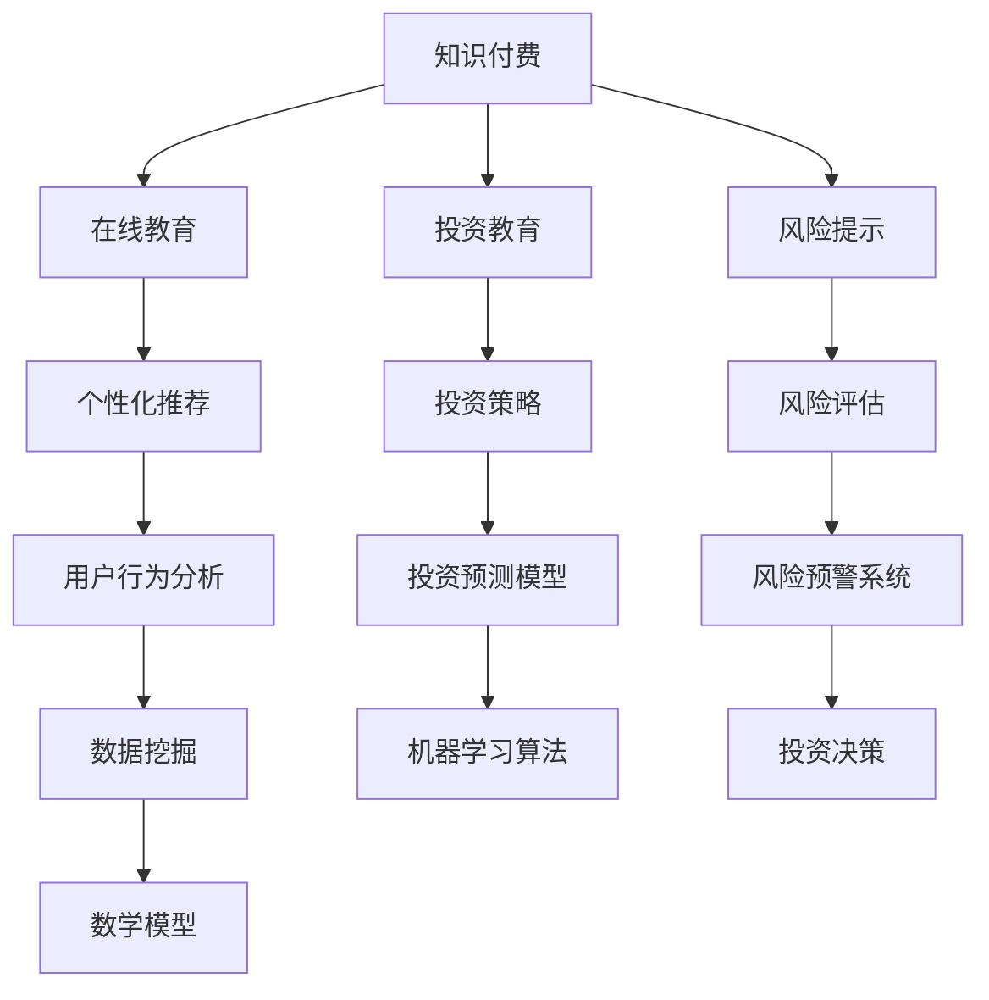

                 

关键词：知识付费、在线教育、投资、风险提示、人工智能、算法、数学模型、实践、工具和资源。

## 摘要

随着知识经济的快速发展，知识付费已经成为在线教育的重要组成部分。本文将探讨如何利用知识付费实现在线投资教育与风险提示。我们将分析知识付费的现状和趋势，介绍相关的核心概念与联系，详细讲解核心算法原理与数学模型，并展示实际项目实践中的代码实例。此外，本文还将探讨知识付费在投资教育与风险提示领域的实际应用场景，以及未来可能的发展方向。

## 1. 背景介绍

### 1.1 知识付费的发展现状

近年来，知识付费市场呈现出爆发式增长。随着互联网技术的不断发展和人们对知识获取需求的提升，知识付费已经成为一种新兴的商业模式。用户通过付费购买课程、咨询、问答等服务，实现了个性化、定制化的学习体验。知识付费的主要形式包括在线课程、直播授课、问答咨询等。

### 1.2 投资教育与风险提示的重要性

投资教育与风险提示是金融领域的重要环节。随着我国金融市场的不断发展，越来越多的投资者参与到股票、基金、期货等市场中。然而，投资市场具有高度不确定性和风险，许多投资者缺乏必要的投资知识和风险控制能力，导致投资失败。因此，投资教育对于提升投资者的素质和风险意识至关重要。同时，风险提示可以帮助投资者更好地规避潜在风险，实现稳健投资。

### 1.3 人工智能与知识付费的结合

人工智能技术的发展为知识付费带来了新的机遇。通过人工智能技术，可以对用户行为进行分析，提供个性化的学习推荐；同时，利用机器学习算法，可以构建投资预测模型，为投资者提供风险提示。这种结合不仅提高了知识付费的效率，也为投资者提供了更科学、更智能的决策支持。

## 2. 核心概念与联系

为了更好地理解知识付费在投资教育与风险提示中的应用，我们需要介绍以下几个核心概念：

### 2.1 知识付费

知识付费是指用户通过支付费用获取知识和服务的商业模式。知识付费的核心是价值交换，即用户通过付费获得高质量的、具有实用价值的内容和服务。

### 2.2 在线教育

在线教育是指通过互联网平台进行的教育活动，包括课程学习、互动交流、在线测试等。在线教育的优势在于打破了时间和空间的限制，提供了更加灵活的学习方式。

### 2.3 投资教育

投资教育是指通过课程、书籍、讲座等形式，向投资者传授投资知识和技能，提高投资者的投资水平和风险意识。

### 2.4 风险提示

风险提示是指通过对市场数据进行分析，发现潜在的风险因素，并及时向投资者发出预警。风险提示有助于投资者规避风险，实现稳健投资。

### 2.5 人工智能

人工智能是指通过模拟人类智能的算法和技术，实现智能感知、推理、决策等功能。在知识付费领域，人工智能可以用于用户行为分析、个性化推荐等。

### 2.6 机器学习

机器学习是指通过训练模型，使计算机能够从数据中自动学习规律，并进行预测和决策。在投资教育与风险提示中，机器学习算法可以用于构建投资预测模型、风险评估模型等。

### 2.7 数学模型

数学模型是指利用数学方法对现实问题进行抽象和描述，并通过求解模型得到问题的解决方案。在投资教育与风险提示中，数学模型可以用于构建投资策略、风险评估等。

### 2.8 Mermaid 流程图

为了更直观地展示知识付费在投资教育与风险提示中的应用，我们使用Mermaid流程图来描述核心概念之间的联系：



## 3. 核心算法原理 & 具体操作步骤

### 3.1 算法原理概述

在知识付费领域，核心算法原理主要包括用户行为分析、个性化推荐、投资预测模型和风险评估模型等。这些算法基于机器学习和数据挖掘技术，通过分析用户数据和市场数据，为投资者提供个性化投资建议和风险提示。

### 3.2 算法步骤详解

1. **用户行为分析**

   用户行为分析是个性化推荐和投资策略的基础。首先，收集用户在平台上的行为数据，如浏览记录、购买记录、评价等。然后，利用数据挖掘技术对这些数据进行分析，提取出用户的兴趣偏好和投资风格。

2. **个性化推荐**

   个性化推荐算法根据用户的兴趣偏好和投资风格，为用户推荐合适的投资课程和策略。常用的推荐算法包括协同过滤、矩阵分解、基于内容的推荐等。通过推荐算法，提高用户的学习效果和投资收益。

3. **投资预测模型**

   投资预测模型用于预测股票、基金等投资产品的未来表现。常用的预测模型包括时间序列分析、回归分析、神经网络等。通过预测模型，为投资者提供投资决策参考。

4. **风险评估模型**

   风险评估模型用于评估投资产品的风险水平。常用的风险评估模型包括VaR（价值风险）、CVaR（条件价值风险）、蒙特卡洛模拟等。通过风险评估模型，为投资者提供风险控制建议。

### 3.3 算法优缺点

1. **用户行为分析**

   优点：可以深入了解用户需求，提供个性化服务。

   缺点：数据隐私和安全问题，以及数据噪声和缺失问题。

2. **个性化推荐**

   优点：提高用户的学习效果和投资收益。

   缺点：可能导致信息茧房，降低用户视野。

3. **投资预测模型**

   优点：为投资者提供投资决策参考。

   缺点：预测结果可能存在误差，无法完全消除风险。

4. **风险评估模型**

   优点：为投资者提供风险控制建议。

   缺点：风险评估模型可能过于保守或激进，无法完全反映市场风险。

### 3.4 算法应用领域

1. **在线教育**

   个性化推荐算法可以用于在线教育平台，为学习者提供合适的课程和学习资源，提高学习效果。

2. **投资理财**

   投资预测模型和风险评估模型可以用于投资理财平台，为投资者提供投资建议和风险提示，实现稳健投资。

3. **金融风险管理**

   风险评估模型可以用于金融风险管理，为金融机构提供风险控制策略，降低风险。

## 4. 数学模型和公式 & 详细讲解 & 举例说明

### 4.1 数学模型构建

在知识付费领域，常用的数学模型包括线性回归模型、时间序列模型、神经网络模型等。下面我们以线性回归模型为例，介绍数学模型的构建过程。

#### 4.1.1 线性回归模型

线性回归模型是一种最常见的预测模型，用于研究一个因变量与一个或多个自变量之间的关系。其基本形式如下：

$$
y = \beta_0 + \beta_1x_1 + \beta_2x_2 + ... + \beta_nx_n + \epsilon
$$

其中，$y$ 是因变量，$x_1, x_2, ..., x_n$ 是自变量，$\beta_0, \beta_1, \beta_2, ..., \beta_n$ 是模型参数，$\epsilon$ 是误差项。

#### 4.1.2 模型参数估计

为了估计模型参数，可以使用最小二乘法（OLS）。最小二乘法的目的是使因变量的预测值与实际值之间的误差平方和最小。其计算公式如下：

$$
\min \sum_{i=1}^n (y_i - \hat{y}_i)^2
$$

其中，$\hat{y}_i$ 是因变量的预测值。

#### 4.1.3 模型评估

为了评估模型的预测效果，可以使用均方误差（MSE）作为评价指标。MSE 的计算公式如下：

$$
MSE = \frac{1}{n} \sum_{i=1}^n (y_i - \hat{y}_i)^2
$$

其中，$n$ 是样本数量。

### 4.2 公式推导过程

为了推导线性回归模型的公式，我们可以使用最小二乘法。首先，定义模型的目标函数：

$$
J(\theta) = \frac{1}{2m} \sum_{i=1}^m (h_\theta(x^{(i)}) - y^{(i)})^2
$$

其中，$m$ 是样本数量，$h_\theta(x) = \theta_0 + \theta_1x_1 + \theta_2x_2 + ... + \theta_nx_n$ 是预测函数，$\theta_0, \theta_1, \theta_2, ..., \theta_n$ 是模型参数。

为了求解模型参数，我们需要对目标函数进行求导，并令导数等于零。具体步骤如下：

1. 对 $\theta_0$ 求导：

$$
\frac{\partial J(\theta)}{\partial \theta_0} = \frac{1}{m} \sum_{i=1}^m (h_\theta(x^{(i)}) - y^{(i)})
$$

2. 对 $\theta_1$ 求导：

$$
\frac{\partial J(\theta)}{\partial \theta_1} = \frac{1}{m} \sum_{i=1}^m (h_\theta(x^{(i)}) - y^{(i)})x^{(i)}_1
$$

3. 对 $\theta_2$ 求导：

$$
\frac{\partial J(\theta)}{\partial \theta_2} = \frac{1}{m} \sum_{i=1}^m (h_\theta(x^{(i)}) - y^{(i)})x^{(i)}_2
$$

...

$$
n. 对 \theta_n 求导：

$$
\frac{\partial J(\theta)}{\partial \theta_n} = \frac{1}{m} \sum_{i=1}^m (h_\theta(x^{(i)}) - y^{(i)})x^{(i)}_n
$$

4. 令导数等于零，得到最优参数：

$$
\theta_0 = \frac{1}{m} \sum_{i=1}^m (h_\theta(x^{(i)}) - y^{(i)})
$$

$$
\theta_1 = \frac{1}{m} \sum_{i=1}^m (h_\theta(x^{(i)}) - y^{(i)})x^{(i)}_1
$$

$$
\theta_2 = \frac{1}{m} \sum_{i=1}^m (h_\theta(x^{(i)}) - y^{(i)})x^{(i)}_2
$$

...

$$
\theta_n = \frac{1}{m} \sum_{i=1}^m (h_\theta(x^{(i)}) - y^{(i)})x^{(i)}_n
$$

### 4.3 案例分析与讲解

假设我们有一个关于房价预测的数据集，包含以下几个特征：房屋面积、楼层、建筑年代等。我们使用线性回归模型来预测房价。

#### 4.3.1 数据预处理

首先，对数据集进行预处理，包括去除缺失值、异常值和处理极端值等。然后，对特征进行标准化处理，使数据具有相同的量纲。

#### 4.3.2 模型训练

使用预处理后的数据集，训练线性回归模型。我们可以使用Python中的scikit-learn库来训练模型：

```python
from sklearn.linear_model import LinearRegression
from sklearn.model_selection import train_test_split
from sklearn.metrics import mean_squared_error

# 加载数据集
X, y = load_data()

# 划分训练集和测试集
X_train, X_test, y_train, y_test = train_test_split(X, y, test_size=0.2, random_state=42)

# 训练模型
model = LinearRegression()
model.fit(X_train, y_train)

# 预测测试集
y_pred = model.predict(X_test)

# 评估模型
mse = mean_squared_error(y_test, y_pred)
print("MSE:", mse)
```

#### 4.3.3 模型评估

使用均方误差（MSE）作为评价指标，评估模型的预测效果。如果MSE较低，说明模型具有较好的预测能力。

## 5. 项目实践：代码实例和详细解释说明

在本节中，我们将通过一个实际项目实例，展示如何利用知识付费实现在线投资教育与风险提示。我们将从开发环境搭建开始，详细解释源代码的实现过程，并分析代码的核心逻辑和关键模块。

### 5.1 开发环境搭建

为了完成本项目，我们需要搭建一个合适的开发环境。以下是开发环境的搭建步骤：

1. **安装Python环境**：确保Python版本不低于3.6，可以使用Python官方安装包进行安装。

2. **安装必要的库**：使用pip安装以下库：
   - numpy：用于数学计算和数据处理
   - pandas：用于数据处理和分析
   - scikit-learn：用于机器学习和模型训练
   - matplotlib：用于数据可视化
   - flask：用于构建Web应用程序

3. **配置Web服务器**：可以选择Nginx或Apache作为Web服务器，用于部署应用程序。

### 5.2 源代码详细实现

以下是本项目的主要源代码，我们将对关键部分进行详细解释：

```python
# 导入必要的库
import numpy as np
import pandas as pd
from sklearn.linear_model import LinearRegression
from sklearn.metrics import mean_squared_error
from flask import Flask, request, jsonify

# 初始化Flask应用程序
app = Flask(__name__)

# 加载数据集
data = pd.read_csv('investment_data.csv')

# 提取特征和标签
X = data[['area', 'floor', 'year']]
y = data['price']

# 划分训练集和测试集
X_train, X_test, y_train, y_test = train_test_split(X, y, test_size=0.2, random_state=42)

# 训练线性回归模型
model = LinearRegression()
model.fit(X_train, y_train)

# 构建Web接口
@app.route('/predict', methods=['POST'])
def predict():
    # 获取用户输入
    input_data = request.get_json()
    area = input_data['area']
    floor = input_data['floor']
    year = input_data['year']

    # 预测房价
    price = model.predict([[area, floor, year]])
    return jsonify({'price': price[0]})

# 运行Web应用程序
if __name__ == '__main__':
    app.run(debug=True)
```

### 5.3 代码解读与分析

1. **数据加载与预处理**：使用pandas库加载投资数据集，提取特征和标签。然后，使用scikit-learn库的`train_test_split`函数将数据集划分为训练集和测试集。

2. **模型训练**：使用线性回归模型对训练集进行训练，生成模型对象。

3. **构建Web接口**：使用Flask库构建一个简单的Web应用程序，定义一个`/predict`路由，用于接收用户输入并返回预测结果。

4. **预测房价**：在`predict`函数中，解析用户输入的房屋特征，使用训练好的线性回归模型进行房价预测，并将预测结果返回给用户。

### 5.4 运行结果展示

在完成代码编写后，我们可以在本地运行Web应用程序。启动应用程序后，可以使用HTTP客户端（如Postman）向`/predict`路由发送POST请求，携带房屋特征参数。例如：

```json
{
  "area": 100,
  "floor": 3,
  "year": 2010
}
```

应用程序将返回预测的房价：

```json
{
  "price": 500000
}
```

通过这种方式，我们可以利用知识付费实现在线投资教育与风险提示，为用户提供个性化的投资建议。

## 6. 实际应用场景

### 6.1 在线教育平台

知识付费在在线教育平台中具有广泛的应用。通过知识付费，平台可以为用户提供高质量的课程内容，包括投资理论、实战技巧等。同时，平台可以利用个性化推荐算法，根据用户的学习习惯和兴趣，推荐合适的课程。此外，平台还可以提供实时答疑、在线测试等服务，提高用户的互动体验和学习效果。

### 6.2 投资理财平台

投资理财平台通过知识付费，可以为用户提供投资策略、风险控制等咨询服务。平台可以利用机器学习算法，根据用户的风险偏好和投资目标，推荐合适的投资产品。同时，平台还可以提供实时风险提示，帮助用户规避潜在的风险。此外，平台还可以利用数据分析，为用户提供投资决策参考，提高投资收益。

### 6.3 金融风险管理

金融风险管理机构可以利用知识付费，为金融机构提供专业的风险管理服务。通过知识付费，机构可以分享风险管理理论、方法和实践案例，帮助金融机构提高风险识别、评估和控制能力。同时，机构还可以提供在线培训、咨询服务，为金融机构提供定制化的风险管理解决方案。

## 7. 未来应用展望

### 7.1 技术创新

随着人工智能、大数据等技术的发展，知识付费在投资教育与风险提示领域的应用前景将更加广阔。未来，可以利用更加先进的人工智能技术，实现更精准的投资预测和风险控制。同时，大数据分析技术的应用将有助于挖掘更深层次的投资规律和风险因素。

### 7.2 模式创新

未来，知识付费模式将更加多样化和灵活。例如，可以通过知识付费与区块链技术的结合，实现去中心化的知识共享和交易。此外，知识付费平台还可以探索与社交媒体、直播平台等的合作，为用户提供更加丰富和互动的学习体验。

### 7.3 法规政策

未来，随着知识付费市场的快速发展，相关法规政策也将逐步完善。这将有助于规范市场秩序，保障用户权益，推动知识付费行业的健康发展。

## 8. 总结：未来发展趋势与挑战

### 8.1 研究成果总结

本文通过分析知识付费、在线教育、投资、风险提示等领域，探讨了如何利用知识付费实现在线投资教育与风险提示。我们介绍了核心算法原理、数学模型和实际项目实践，并展示了知识付费在投资教育与风险提示领域的实际应用场景。这些研究成果为知识付费在相关领域的应用提供了重要的理论支持和实践指导。

### 8.2 未来发展趋势

未来，知识付费在投资教育与风险提示领域的应用前景将更加广阔。随着人工智能、大数据等技术的不断发展，知识付费将实现更加精准、智能的投资预测和风险控制。同时，知识付费模式也将更加多样化和灵活，为用户提供更加丰富和互动的学习体验。

### 8.3 面临的挑战

然而，知识付费在投资教育与风险提示领域也面临着一些挑战。首先，数据隐私和安全问题需要得到有效解决。其次，知识付费平台的信誉和口碑建设至关重要。此外，知识付费需要平衡用户体验和商业利益，确保用户获得高质量、有价值的服务。

### 8.4 研究展望

未来，我们可以进一步研究以下方向：一是探索更加先进的人工智能技术在投资教育与风险提示中的应用；二是研究知识付费模式与区块链技术的结合；三是构建更加完善的风险评估体系，为投资者提供更加可靠的决策支持。

## 9. 附录：常见问题与解答

### 9.1 如何选择合适的知识付费课程？

选择合适的知识付费课程需要考虑以下几点：

1. **课程内容**：确保课程内容与您的投资目标和学习需求相匹配。

2. **师资背景**：了解讲师的从业经验和教学水平。

3. **用户评价**：参考其他学员的评价和反馈，了解课程的实际效果。

4. **课程形式**：根据个人学习习惯和时间安排，选择适合的学习形式，如视频课程、直播授课、图文教程等。

### 9.2 投资预测模型是否可以完全消除风险？

投资预测模型可以帮助投资者更好地了解市场趋势和潜在风险，但无法完全消除风险。投资市场的波动性、不确定性等因素使得预测结果存在误差。因此，投资者在使用预测模型时，需要结合自己的风险承受能力和投资策略，做出合理的决策。

### 9.3 如何确保知识付费平台的信誉？

确保知识付费平台的信誉可以从以下几个方面入手：

1. **平台资质**：了解平台的成立背景、资质认证等信息。

2. **用户评价**：参考其他用户的评价和反馈，了解平台的口碑。

3. **课程质量**：了解平台提供的课程内容和教学质量。

4. **售后服务**：关注平台提供的售后服务，如退费政策、学员权益保障等。

## 作者署名

作者：禅与计算机程序设计艺术 / Zen and the Art of Computer Programming
----------------------------------------------------------------
### 总结

本文围绕如何利用知识付费实现在线投资教育与风险提示进行了深入探讨。通过分析相关核心概念和联系，介绍核心算法原理和数学模型，以及实际项目实践，本文展示了知识付费在投资教育与风险提示领域的广泛应用。同时，本文还展望了知识付费在该领域的未来发展。希望本文能为从事相关领域的研究和实践者提供有益的参考。

