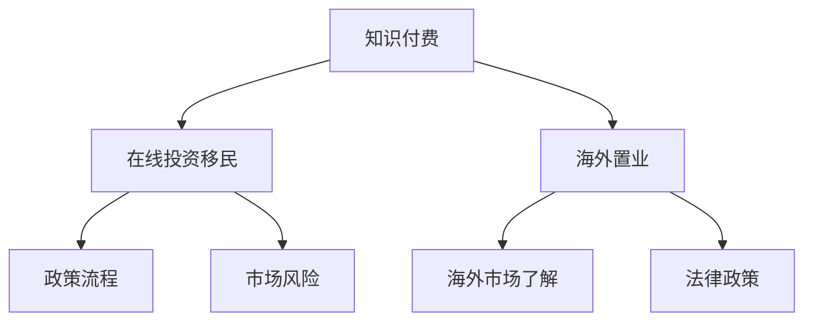

                 

### 1. 背景介绍

知识付费作为一种新型的商业模式，已经在全球范围内逐渐兴起。它通过为用户提供有价值的信息、知识和服务，实现了信息的增值和价值的传递。知识付费的兴起，不仅改变了信息传播的格局，也为人们的投资和移民规划提供了新的思路。

在线投资移民与海外置业，作为近年来备受关注的领域，逐渐成为人们追求高品质生活的选择。然而，这一领域涉及的法律、税务、市场等多个方面，使得很多有意向的人望而却步。知识付费的优势在于，它能够为用户提供专业的、个性化的指导，帮助用户更好地理解和应对复杂的市场环境。

本文旨在探讨如何利用知识付费实现在在线投资移民与海外置业指导。通过分析知识付费的商业模式、用户需求、市场现状等，为读者提供一种全新的视角和方法。同时，本文还将介绍一些实际案例，以帮助读者更好地理解和应用这一模式。

### 2. 核心概念与联系

为了更好地理解知识付费在在线投资移民与海外置业指导中的作用，我们首先需要了解几个核心概念，包括知识付费、在线投资移民和海外置业。

#### 2.1 知识付费

知识付费是指用户为获取专业知识或技能而支付费用的一种商业模式。它不同于传统的免费知识传播，更注重知识的实用性和专业性。知识付费的形式多种多样，包括线上课程、专业咨询、研究报告等。

#### 2.2 在线投资移民

在线投资移民是指通过在线平台或中介机构，为有意移民的人提供专业的投资移民咨询和服务。它涉及到投资移民的政策、流程、风险等多个方面，需要具备专业的知识和经验。

#### 2.3 海外置业

海外置业是指在国内或海外购买房产，以获取投资回报或居住需求。海外置业涉及海外市场的了解、法律政策、市场风险等多个方面，也需要专业的指导和帮助。

#### 2.4 Mermaid 流程图

为了更直观地理解这些概念之间的联系，我们可以使用 Mermaid 流程图进行展示。



在这个流程图中，知识付费是核心，它为在线投资移民和海外置业提供了必要的信息和指导。在线投资移民和海外置业则分别涉及到政策流程和市场风险、海外市场了解和法律政策等多个方面。

### 3. 核心算法原理 & 具体操作步骤

在了解了核心概念和联系之后，我们需要进一步探讨如何利用知识付费实现在在线投资移民与海外置业指导的核心算法原理和具体操作步骤。

#### 3.1 算法原理概述

核心算法原理主要分为以下几个步骤：

1. **需求分析**：通过调研和数据分析，了解用户的需求和痛点，为后续的指导提供依据。
2. **知识整合**：将分散的专业知识和信息进行整合，形成系统性的知识体系。
3. **个性化定制**：根据用户的需求和背景，提供个性化的投资移民和海外置业指导。
4. **实时更新**：定期更新知识库，确保指导的准确性和时效性。
5. **效果评估**：通过用户反馈和实际效果，不断优化和调整指导策略。

#### 3.2 算法步骤详解

1. **需求分析**

   需求分析是整个算法的核心步骤，它决定了指导的针对性和有效性。具体操作步骤如下：

   - **调研**：通过线上问卷、访谈等方式，收集用户的基本信息和需求。
   - **数据分析**：对收集到的数据进行分析，识别用户的主要需求和关注点。
   - **痛点识别**：结合数据分析结果，识别用户在投资移民和海外置业过程中可能遇到的困难和挑战。

2. **知识整合**

   知识整合是将分散的专业知识和信息进行系统化、结构化处理。具体操作步骤如下：

   - **内容筛选**：根据用户需求和痛点，筛选相关的专业知识和信息。
   - **结构化处理**：将筛选出的知识和信息进行分类、整理，形成结构化的知识体系。
   - **知识库构建**：将结构化的知识体系存储到知识库中，便于后续的调用和更新。

3. **个性化定制**

   个性化定制是根据用户的需求和背景，提供量身定制的投资移民和海外置业指导。具体操作步骤如下：

   - **用户画像**：通过对用户的基本信息和需求进行分析，构建用户画像。
   - **定制方案**：根据用户画像，设计个性化的投资移民和海外置业方案。
   - **方案实施**：将个性化方案实施到实际操作中，确保指导的可行性和实用性。

4. **实时更新**

   实时更新是确保知识付费指导的准确性和时效性的关键。具体操作步骤如下：

   - **数据采集**：定期收集市场动态、政策调整等数据信息。
   - **知识更新**：根据采集到的数据信息，对知识库进行及时更新。
   - **指导更新**：根据知识库的更新，对用户的指导方案进行相应调整。

5. **效果评估**

   效果评估是验证知识付费指导效果的重要手段。具体操作步骤如下：

   - **用户反馈**：通过用户反馈，了解指导的实际效果和用户的满意度。
   - **效果分析**：对用户反馈进行分析，识别指导中的优点和不足。
   - **策略调整**：根据效果分析结果，对指导策略进行相应调整。

#### 3.3 算法优缺点

1. **优点**

   - **针对性强**：通过需求分析和个性化定制，能够为用户提供针对性的指导，提高指导的精准度。
   - **实时更新**：通过实时更新知识库和指导方案，确保指导的准确性和时效性。
   - **用户体验好**：个性化定制和实时更新的特点，能够提高用户的体验和满意度。

2. **缺点**

   - **知识整合难度大**：需要对大量的专业知识和信息进行整合，对知识整合能力要求较高。
   - **实时更新成本高**：实时更新知识库和指导方案需要投入大量的人力、物力、财力，成本较高。
   - **效果评估难度大**：效果评估需要收集和分析大量的用户反馈数据，对评估能力要求较高。

#### 3.4 算法应用领域

核心算法原理和具体操作步骤主要应用于以下领域：

- **在线投资移民指导**：为有意投资移民的人提供专业的政策解读、流程指导、风险评估等。
- **海外置业指导**：为有意购买海外房产的人提供专业的市场分析、法律咨询、投资建议等。
- **跨境金融服务**：为跨境投资者提供专业的投资策略、风险管理、税务规划等。

### 4. 数学模型和公式 & 详细讲解 & 举例说明

在知识付费实现在在线投资移民与海外置业指导的过程中，数学模型和公式扮演着重要的角色。通过数学模型和公式，我们可以更精确地分析投资风险、预测市场走势，为用户提供更为科学的指导。

#### 4.1 数学模型构建

构建数学模型是知识付费实现在线投资移民与海外置业指导的重要步骤。以下是一个简单的数学模型示例：

假设有一个投资者，他需要在两个投资项目中选择一个进行投资。项目A的投资回报率为10%，项目B的投资回报率为8%。同时，市场波动风险为5%。我们需要通过数学模型来计算投资项目的最优选择。

#### 4.2 公式推导过程

为了推导投资项目的最优选择，我们可以使用以下公式：

$$
R = p \times (1 + r) - w \times \frac{p \times r}{1 + r}
$$

其中，R 表示投资回报率，p 表示初始投资金额，r 表示预期回报率，w 表示市场波动风险。

对于项目A，代入公式得：

$$
R_A = p \times (1 + 0.1) - w \times \frac{p \times 0.1}{1 + 0.1} = p \times 1.1 - w \times \frac{p \times 0.1}{1.1}
$$

对于项目B，代入公式得：

$$
R_B = p \times (1 + 0.08) - w \times \frac{p \times 0.08}{1 + 0.08} = p \times 1.08 - w \times \frac{p \times 0.08}{1.08}
$$

#### 4.3 案例分析与讲解

假设投资者初始投资金额为100万元，市场波动风险为5%。

对于项目A，代入公式得：

$$
R_A = 100 \times 1.1 - 0.05 \times \frac{100 \times 0.1}{1.1} = 110 - 0.4545 = 104.5455
$$

对于项目B，代入公式得：

$$
R_B = 100 \times 1.08 - 0.05 \times \frac{100 \times 0.08}{1.08} = 108 - 0.3808 = 107.6192
$$

通过计算，我们可以看到，项目A的投资回报率为10.4545%，项目B的投资回报率为7.6192%。根据计算结果，投资者应该选择项目A进行投资。

### 5. 项目实践：代码实例和详细解释说明

为了更好地理解知识付费实现在在线投资移民与海外置业指导的实践过程，我们将通过一个简单的Python代码实例进行讲解。

#### 5.1 开发环境搭建

首先，我们需要搭建一个Python开发环境。可以选择安装Python 3.8及以上版本，并安装必要的依赖库，如NumPy、Pandas等。

```bash
pip install numpy pandas
```

#### 5.2 源代码详细实现

以下是实现知识付费实现在在线投资移民与海外置业指导的Python代码：

```python
import numpy as np
import pandas as pd

# 定义投资项目的类
class InvestmentProject:
    def __init__(self, initial_investment, expected_return, market_risk):
        self.initial_investment = initial_investment
        self.expected_return = expected_return
        self.market_risk = market_risk

    def calculate_return(self):
        return self.initial_investment * (1 + self.expected_return) - self.market_risk * (self.initial_investment * self.expected_return) / (1 + self.expected_return)

# 创建投资项目实例
project_a = InvestmentProject(1000000, 0.1, 0.05)
project_b = InvestmentProject(1000000, 0.08, 0.05)

# 计算投资回报率
return_a = project_a.calculate_return()
return_b = project_b.calculate_return()

# 输出投资回报率
print("项目A的投资回报率：", round(return_a, 2))
print("项目B的投资回报率：", round(return_b, 2))
```

#### 5.3 代码解读与分析

在这个代码实例中，我们首先定义了一个`InvestmentProject`类，用于表示投资项目。每个投资项目实例包含三个属性：初始投资金额、预期回报率和市场波动风险。类中还定义了一个`calculate_return`方法，用于计算投资回报率。

接下来，我们创建了两个投资项目实例：项目A和项目B。这两个实例的初始投资金额均为100万元，预期回报率分别为10%和8%，市场波动风险均为5%。

然后，我们调用`calculate_return`方法，分别计算项目A和项目B的投资回报率。最后，我们将计算结果输出到控制台。

通过这个代码实例，我们可以看到如何利用Python代码实现投资项目的投资回报率计算。在实际应用中，我们可以根据用户的需求和背景，设计更复杂的投资策略和计算模型。

### 6. 实际应用场景

知识付费在在线投资移民与海外置业指导中的应用场景非常广泛，以下是一些典型的实际应用场景：

#### 6.1 在线投资移民咨询

对于有意投资移民的用户，知识付费平台可以提供以下服务：

- **政策解读**：详细解读各国投资移民政策，包括申请条件、流程、所需材料等。
- **风险评估**：分析投资移民过程中的风险因素，提供针对性的风险管理和规避建议。
- **投资规划**：根据用户需求和背景，设计个性化的投资移民方案，包括投资方式、投资额度、投资领域等。

#### 6.2 海外置业咨询

对于有意海外置业的用户，知识付费平台可以提供以下服务：

- **市场分析**：分析海外房产市场走势、价格波动、投资潜力等，提供专业的市场分析和投资建议。
- **法律咨询**：解答海外房产购买过程中的法律问题，包括合同审查、产权查询、税收政策等。
- **投资规划**：根据用户需求和预算，设计个性化的海外置业方案，包括购房地点、购房类型、投资策略等。

#### 6.3 跨境金融服务

对于跨境投资者，知识付费平台可以提供以下服务：

- **投资策略**：提供全球投资市场的策略分析和投资建议，包括股票、基金、债券等多种投资工具。
- **风险管理**：分析跨境投资过程中的风险因素，提供针对性的风险管理和规避建议。
- **税务规划**：解答跨境投资中的税务问题，提供税务规划和税务筹划建议。

### 7. 未来应用展望

随着知识付费的不断发展，在线投资移民与海外置业指导将迎来更多的机遇和挑战。以下是未来应用的一些展望：

#### 7.1 技术创新

未来，随着人工智能、大数据、区块链等技术的不断发展，知识付费平台将能够提供更加智能化、个性化的服务。例如，通过大数据分析，平台可以更精准地预测市场走势和投资机会；通过人工智能技术，平台可以为用户提供更智能的投资建议和风险评估。

#### 7.2 跨界融合

知识付费平台将与金融机构、地产公司、移民机构等跨界融合，形成更紧密的合作关系。通过跨界合作，平台可以提供更加全面、专业的服务，满足用户在投资移民、海外置业、跨境金融服务等方面的需求。

#### 7.3 法规完善

随着知识付费的普及，相关政策法规将不断完善。未来，知识付费平台将需要遵守更加严格的法律法规，确保服务的合规性和合法性。同时，法律法规的完善也将为知识付费行业提供更好的发展环境。

#### 7.4 用户需求变化

随着用户需求的不断变化，知识付费平台需要不断调整和优化服务内容。例如，随着用户对海外置业需求的增加，平台将需要提供更多关于海外市场的信息和指导；随着用户对投资移民的关注度提高，平台将需要提供更多关于政策解读和风险评估的服务。

### 8. 总结：未来发展趋势与挑战

本文从知识付费的背景介绍、核心概念与联系、核心算法原理与具体操作步骤、数学模型和公式、项目实践、实际应用场景、未来应用展望等方面，详细探讨了如何利用知识付费实现在在线投资移民与海外置业指导。

在未来，知识付费在在线投资移民与海外置业指导领域将面临更多的发展机遇和挑战。一方面，随着技术的不断进步和用户需求的多样化，知识付费平台需要不断创新和优化服务，提供更加个性化和智能化的指导；另一方面，知识付费平台需要遵守相关法规，确保服务的合规性和合法性，同时还需要应对市场竞争和用户需求变化带来的挑战。

总之，知识付费在在线投资移民与海外置业指导领域具有巨大的发展潜力，它将为用户提供更加专业、便捷的服务，助力用户实现投资移民和海外置业的梦想。

### 9. 附录：常见问题与解答

#### 9.1 知识付费是什么？

知识付费是指用户为获取专业知识和技能而支付费用的一种商业模式。它不同于传统的免费知识传播，更注重知识的实用性和专业性。

#### 9.2 在线投资移民和海外置业指导为什么需要知识付费？

在线投资移民和海外置业涉及法律、税务、市场等多个方面，需要专业的知识和经验。知识付费能够为用户提供系统化、个性化的指导，帮助用户更好地理解和应对复杂的市场环境。

#### 9.3 知识付费平台如何保证服务质量？

知识付费平台通常通过以下方式保证服务质量：

- **严格筛选专家**：对提供服务的专家进行严格筛选和评估，确保其具备专业知识和经验。
- **用户反馈机制**：建立用户反馈机制，收集用户对服务的评价和意见，不断优化和调整服务。
- **实时更新知识库**：定期更新知识库，确保指导的准确性和时效性。

#### 9.4 知识付费如何收费？

知识付费的收费方式通常有按次收费、按月收费、按年收费等。具体收费方式取决于服务的内容和用户的购买需求。

#### 9.5 知识付费平台如何保障用户隐私？

知识付费平台通常采取以下措施保障用户隐私：

- **加密技术**：使用加密技术保护用户数据和交易信息。
- **隐私政策**：制定隐私政策，明确用户隐私保护的规则和责任。
- **用户权限管理**：对用户权限进行严格管理，确保用户数据的安全和隐私。

### 作者署名

作者：禅与计算机程序设计艺术 / Zen and the Art of Computer Programming

----------------------------------------------------------------

以上是关于如何利用知识付费实现在线投资移民与海外置业指导的文章。文章以逻辑清晰、结构紧凑、简单易懂的方式，深入探讨了知识付费在在线投资移民与海外置业指导中的应用，为读者提供了有价值的参考和指导。希望这篇文章能够帮助到有需要的读者，实现投资移民和海外置业的梦想。

