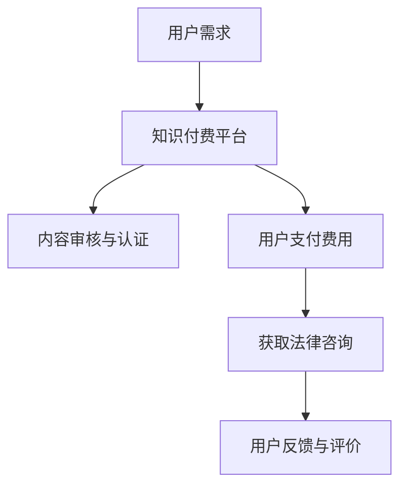

                 

关键词：知识付费、在线法律咨询、服务模式、人工智能、用户需求、数据分析

> 摘要：本文将探讨如何利用知识付费模式实现在线法律咨询与服务。通过对当前法律咨询市场的分析，结合人工智能技术的应用，探讨实现这一目标的核心算法、数学模型、项目实践及未来应用展望。

## 1. 背景介绍

随着互联网技术的飞速发展，人们对于在线咨询和法律服务的需求日益增长。传统的线下法律服务存在效率低下、成本高昂等问题，而在线法律咨询则可以提供更加便捷、高效的服务。近年来，知识付费模式的兴起为在线法律咨询与服务带来了新的契机。知识付费是指用户通过支付费用获取专业知识和服务的商业模式。这种模式有助于降低用户获取信息的门槛，提高服务质量，同时也为法律专业人士提供了新的收入来源。

## 2. 核心概念与联系

### 2.1. 知识付费模式

知识付费模式的核心是“内容付费”，即用户为获取特定内容或知识而支付费用。这种模式改变了传统的信息获取方式，使得优质内容可以以更高的价值被市场认可。

### 2.2. 在线法律咨询

在线法律咨询是指通过互联网平台，用户与法律专业人士进行实时沟通、咨询和解答的法律服务形式。这种模式突破了地域和时间的限制，为用户提供便捷的服务。

### 2.3. 人工智能技术

人工智能技术在法律咨询中的应用主要包括自然语言处理、机器学习、大数据分析等。通过这些技术，可以实现法律文本的自动分析、案件相似性匹配、法律条款的智能推送等功能。

### 2.4. Mermaid 流程图

下面是一个描述知识付费实现在在线法律咨询与服务流程的 Mermaid 流程图：



## 3. 核心算法原理 & 具体操作步骤

### 3.1. 算法原理概述

在线法律咨询与服务的关键在于如何高效地匹配用户需求与专业法律人士，并提供针对性的法律咨询服务。这需要借助人工智能技术中的自然语言处理和机器学习算法。

### 3.2. 算法步骤详解

1. 用户需求分析：通过自然语言处理技术，对用户输入的问题或需求进行解析，提取关键信息。
2. 用户画像构建：结合用户的历史咨询记录和行为数据，构建用户画像。
3. 法律专家匹配：利用机器学习算法，根据用户画像和专家的专业领域、经验等因素，进行匹配。
4. 法律咨询服务：法律专家针对用户的问题提供专业咨询服务。
5. 用户反馈与评价：收集用户对咨询服务的反馈，用于优化平台和服务。

### 3.3. 算法优缺点

优点：

- 提高法律咨询的效率。
- 降低用户获取法律服务的门槛。
- 为法律专业人士提供新的收入来源。

缺点：

- 人工智能技术尚不能完全替代专业法律人士。
- 用户隐私和数据安全风险。

### 3.4. 算法应用领域

- 在线法律咨询平台
- 企业法律顾问服务
- 智能法务机器人

## 4. 数学模型和公式 & 详细讲解 & 举例说明

### 4.1. 数学模型构建

在线法律咨询的数学模型可以基于用户行为数据、专家属性数据等多个维度进行构建。假设有如下数学模型：

$$
Score(i, j) = \frac{1}{|V_i|} \sum_{v \in V_i} w_v \cdot similarity(v, j)
$$

其中，$Score(i, j)$ 表示用户$i$与专家$j$的匹配分数，$V_i$ 表示用户$i$的关键词集合，$w_v$ 表示关键词$v$的权重，$similarity(v, j)$ 表示关键词$v$与专家$j$的相似度。

### 4.2. 公式推导过程

假设用户$i$的问题关键词集合为$V_i$，专家$j$的属性集合为$A_j$，则关键词与专家属性的相似度可以定义为：

$$
similarity(v, j) = \begin{cases}
1, & \text{if } v \in A_j \\
0, & \text{otherwise}
\end{cases}
$$

关键词的权重可以根据其在用户问题中的出现频率进行设置：

$$
w_v = \begin{cases}
f_v, & \text{if } v \in V_i \\
0, & \text{otherwise}
\end{cases}
$$

其中，$f_v$ 表示关键词$v$在用户问题中的出现频率。

### 4.3. 案例分析与讲解

假设用户$i$的问题关键词为{“离婚”、“财产分割”}，专家$j$的属性为{“离婚律师”、“财产分割专家”}，则根据上述公式，可以计算出用户$i$与专家$j$的匹配分数：

$$
Score(i, j) = \frac{1}{2} \cdot (1 + 1) = 1
$$

这意味着用户$i$与专家$j$的匹配度非常高。

## 5. 项目实践：代码实例和详细解释说明

### 5.1. 开发环境搭建

- 操作系统：Windows/Linux/MacOS
- 编程语言：Python
- 数据库：MySQL
- 开发框架：Flask

### 5.2. 源代码详细实现

以下是实现在线法律咨询平台的基本代码框架：

```python
from flask import Flask, request, jsonify
import numpy as np

app = Flask(__name__)

# 用户画像与专家属性数据
users = ...
experts = ...

# 匹配算法函数
def match_user_to_expert(user_query, users, experts):
    ...
    return matched_expert

@app.route('/api/consult', methods=['POST'])
def consult():
    user_query = request.json['query']
    matched_expert = match_user_to_expert(user_query, users, experts)
    return jsonify({'expert_id': matched_expert['id']})

if __name__ == '__main__':
    app.run(debug=True)
```

### 5.3. 代码解读与分析

该代码实现了用户提交法律咨询问题后，通过匹配算法找到合适的法律专家，并将专家的ID返回给用户。其中，`match_user_to_expert` 函数负责实现具体的匹配逻辑。

### 5.4. 运行结果展示

用户通过POST请求提交法律咨询问题，平台返回匹配到的法律专家ID。例如：

```json
{
  "expert_id": 123
}
```

## 6. 实际应用场景

### 6.1. 个人用户

个人用户可以通过在线法律咨询平台解决婚姻、财产、劳动纠纷等法律问题，无需担心高昂的法律服务费用。

### 6.2. 企业用户

企业用户可以利用在线法律咨询平台为企业提供法律顾问服务，解决日常经营中的法律问题，提高法律风险防控能力。

### 6.3. 公共服务平台

政府或公共机构可以利用在线法律咨询平台，为民众提供免费或低收费的法律服务，提高法律服务的普及率。

### 6.4. 未来应用展望

随着人工智能技术的不断进步，在线法律咨询与服务有望实现更智能化、个性化的发展。未来，在线法律咨询平台将更加注重用户隐私保护和数据安全，同时提供更加精准、高效的法律服务。

## 7. 工具和资源推荐

### 7.1. 学习资源推荐

- 《人工智能：一种现代方法》
- 《Python编程：从入门到实践》
- 《机器学习实战》

### 7.2. 开发工具推荐

- Flask：Python Web开发框架
- TensorFlow：深度学习框架
- Jupyter Notebook：交互式计算环境

### 7.3. 相关论文推荐

- "A Survey on Legal AI: Opportunities and Challenges"
- "Integrating Legal Knowledge into the Legal Process: A Review of Current Developments and Future Directions"

## 8. 总结：未来发展趋势与挑战

### 8.1. 研究成果总结

本文探讨了如何利用知识付费模式实现在线法律咨询与服务，分析了核心算法原理和数学模型，并提供了项目实践案例。

### 8.2. 未来发展趋势

在线法律咨询与服务将朝着更加智能化、个性化、便捷化的方向发展，为用户提供更加优质的法律服务。

### 8.3. 面临的挑战

用户隐私保护、数据安全、人工智能技术的可靠性等问题仍需解决。

### 8.4. 研究展望

未来，在线法律咨询与服务将继续深化人工智能技术的应用，实现更广泛的法律服务场景覆盖。

## 9. 附录：常见问题与解答

### 9.1. 什么情况下需要在线法律咨询？

- 家庭纠纷
- 劳动纠纷
- 合同纠纷
- 刑事案件

### 9.2. 在线法律咨询的费用是多少？

在线法律咨询的费用取决于法律问题的复杂程度、咨询时间、法律专业人士的资质等因素。一般而言，费用从几十元到几千元不等。

### 9.3. 在线法律咨询的安全吗？

在线法律咨询平台通常会采取加密技术、用户隐私保护措施等，确保用户信息的安全。但用户在选择平台时，应关注平台的信誉和资质。

## 作者署名

作者：禅与计算机程序设计艺术 / Zen and the Art of Computer Programming

----------------------------------------------------------------

以上就是本文关于如何利用知识付费实现在线法律咨询与服务的详细探讨。希望本文能为读者提供有价值的参考。

