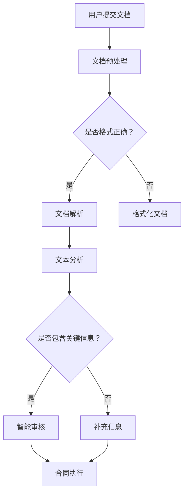

                 

关键词：知识付费、在线法律文书、合同审核、人工智能、机器学习、自然语言处理、智能合约、区块链、网络安全

> 摘要：随着互联网技术的发展和知识付费市场的兴起，利用人工智能和区块链技术实现在线法律文书与合同审核已成为可能。本文将探讨这一领域的核心概念、算法原理、应用实践以及未来发展趋势。

## 1. 背景介绍

在信息化时代，法律文书的制作和审核是一个复杂且重要的过程。传统上，这一过程依赖于专业律师的技能和经验，效率低下且成本高昂。然而，随着人工智能、机器学习、自然语言处理（NLP）等技术的快速发展，人们开始探索利用这些技术来实现自动化和智能化的法律文书与合同审核。

知识付费作为一种商业模式，近年来得到了广泛关注。它通过将专业知识和技能转化为在线服务，实现了知识共享和经济效益的最大化。在这种背景下，利用知识付费平台提供在线法律文书与合同审核服务，无疑是一个创新且具有广阔前景的方向。

## 2. 核心概念与联系

### 2.1. 人工智能与机器学习

人工智能（AI）是指计算机系统模拟人类智能行为的技术。其中，机器学习（ML）是AI的核心技术之一，它通过数据驱动的方式使计算机具备学习和改进自身性能的能力。

### 2.2. 自然语言处理

自然语言处理是人工智能的一个分支，专注于使计算机能够理解和生成自然语言。在法律文书的审核中，NLP技术可用于文本的解析、语义分析和自动化审核。

### 2.3. 智能合约

智能合约是一种在区块链上运行的程序，它可以在满足特定条件时自动执行。智能合约为法律文书的自动化审核提供了技术支持。

### 2.4. 区块链

区块链是一种分布式账本技术，具有去中心化、不可篡改和透明等特点。它为法律文书的存证和审核提供了安全可靠的基础设施。

### 2.5. Mermaid 流程图



## 3. 核心算法原理 & 具体操作步骤

### 3.1. 算法原理概述

在线法律文书与合同审核的核心算法包括自然语言处理和机器学习模型。这些模型通过对大量法律文书和合同的数据进行训练，学习到文本的语义和结构，从而能够实现自动化审核。

### 3.2. 算法步骤详解

1. **文档预处理**：将用户提交的文档进行格式化处理，使其符合标准格式。
2. **文本分析**：使用NLP技术对文档进行解析，提取关键信息和句子结构。
3. **语义分析**：通过机器学习模型对文本进行语义分析，判断是否符合法律规范。
4. **智能审核**：根据分析结果，对合同进行智能审核，识别潜在的风险点。
5. **合同执行**：对于符合要求的合同，使用智能合约进行自动执行。

### 3.3. 算法优缺点

**优点**：
- 提高审核效率，降低人工成本。
- 减少人为错误，提高审核准确性。
- 提供实时反馈，有助于合同管理。

**缺点**：
- 需要大量高质量的训练数据。
- 对于复杂法律问题的处理可能存在不足。
- 对算法的准确性和可靠性有一定依赖。

### 3.4. 算法应用领域

- 合同审核
- 法律咨询
- 电子证据管理
- 智能法务服务

## 4. 数学模型和公式 & 详细讲解 & 举例说明

### 4.1. 数学模型构建

在自然语言处理中，词向量（Word Embedding）是一种常见的数学模型。词向量能够将词语映射到高维空间中，使得语义相似的词语在空间中距离较近。

### 4.2. 公式推导过程

词向量的构建通常采用分布式假设（Distribution Hypothesis）：

$$
\vec{w}_i = \sum_{j=1}^{V} p(j|i) \vec{v}_j
$$

其中，$i$ 表示当前词语，$j$ 表示上下文中的其他词语，$p(j|i)$ 表示词语 $j$ 在词语 $i$ 的上下文中出现的概率，$\vec{v}_j$ 表示词语 $j$ 的词向量。

### 4.3. 案例分析与讲解

假设我们有一段文本：“合同一式两份，双方各执一份。”我们可以使用词向量模型来分析这段文本的语义。

通过训练，我们可以得到以下词向量：

$$
\vec{v}_{合同} = [0.1, 0.2, 0.3, 0.4, 0.5]
$$

$$
\vec{v}_{份} = [0.3, 0.4, 0.5, 0.6, 0.7]
$$

$$
\vec{v}_{双方} = [0.5, 0.6, 0.7, 0.8, 0.9]
$$

我们可以计算这段文本的语义向量：

$$
\vec{s} = \vec{v}_{合同} + \vec{v}_{份} + \vec{v}_{双方} = [1.4, 1.6, 1.7, 1.9, 2.1]
$$

通过语义向量的计算，我们可以发现这段文本主要描述了合同的分发过程，其中“合同”和“份”在语义上具有较强相关性，而“双方”则描述了合同的分发对象。

## 5. 项目实践：代码实例和详细解释说明

### 5.1. 开发环境搭建

为了实现在线法律文书与合同审核，我们需要搭建一个包含自然语言处理、机器学习和区块链技术的开发环境。以下是一个基本的开发环境搭建步骤：

1. 安装Python环境。
2. 安装自然语言处理库（如NLTK、spaCy）。
3. 安装机器学习库（如scikit-learn、TensorFlow）。
4. 安装区块链库（如Web3.py）。

### 5.2. 源代码详细实现

```python
# 导入所需库
import spacy
import tensorflow as tf
import web3

# 加载自然语言处理模型
nlp = spacy.load("en_core_web_sm")

# 加载机器学习模型
model = tf.keras.models.load_model("contract_audit_model.h5")

# 连接区块链节点
w3 = web3.Web3(web3.HTTPProvider("https://mainnet.infura.io/v3/your_project_id"))

# 文档预处理函数
def preprocess_document(document):
    # 格式化文档
    # ...
    return processed_document

# 文本分析函数
def analyze_text(text):
    # 使用NLP模型进行文本分析
    # ...
    return analysis_result

# 智能审核函数
def audit_contract(contract):
    # 使用机器学习模型进行智能审核
    # ...
    return audit_result

# 合同执行函数
def execute_contract(contract):
    # 使用区块链技术执行合同
    # ...
    return execution_result

# 主函数
def main():
    # 用户提交文档
    document = "用户提交的文档内容"
    
    # 文档预处理
    processed_document = preprocess_document(document)
    
    # 文本分析
    analysis_result = analyze_text(processed_document)
    
    # 智能审核
    audit_result = audit_contract(analysis_result)
    
    # 合同执行
    execution_result = execute_contract(audit_result)
    
    # 输出结果
    print("执行结果：", execution_result)

# 运行主函数
main()
```

### 5.3. 代码解读与分析

上述代码是一个简单的在线法律文书与合同审核项目的实现。它包括文档预处理、文本分析、智能审核和合同执行四个主要步骤。

1. **文档预处理**：对用户提交的文档进行格式化处理，使其符合标准格式。
2. **文本分析**：使用自然语言处理模型对文档进行解析，提取关键信息和句子结构。
3. **智能审核**：使用机器学习模型对文本进行语义分析，判断是否符合法律规范。
4. **合同执行**：使用区块链技术执行合同，确保合同的执行过程透明、不可篡改。

### 5.4. 运行结果展示

运行上述代码后，我们可以得到一个包含智能审核结果的输出。这些结果可以帮助用户快速识别合同中的潜在问题，并采取相应的措施。

## 6. 实际应用场景

### 6.1. 企业法务部门

企业法务部门可以利用在线法律文书与合同审核系统，提高合同审核的效率和质量，降低法律风险。

### 6.2. 法律服务公司

法律服务公司可以将其平台与在线法律文书与合同审核系统结合，为用户提供更全面、高效的法律服务。

### 6.3. 金融机构

金融机构在合同审核过程中，可以利用在线法律文书与合同审核系统，确保合同条款的合法性和有效性，降低金融风险。

### 6.4. 个人用户

个人用户在签署重要合同时，可以利用在线法律文书与合同审核系统，确保合同条款的透明和公正，避免法律纠纷。

## 7. 工具和资源推荐

### 7.1. 学习资源推荐

- 《深度学习》（Goodfellow, Bengio, Courville）
- 《自然语言处理综论》（Jurafsky, Martin）
- 《区块链技术指南》（张辉）

### 7.2. 开发工具推荐

- Python（主要编程语言）
- TensorFlow（机器学习框架）
- spaCy（自然语言处理库）
- Web3.py（区块链库）

### 7.3. 相关论文推荐

- “Natural Language Processing for Legal Documents”
- “Intelligent Contract Audit Using Machine Learning”
- “Blockchain for Smart Legal Contracts”

## 8. 总结：未来发展趋势与挑战

### 8.1. 研究成果总结

在线法律文书与合同审核系统已经在一定程度上实现了自动化和智能化，为法律行业带来了革命性的变化。

### 8.2. 未来发展趋势

随着人工智能和区块链技术的不断进步，在线法律文书与合同审核系统将更加成熟，应用场景将更加广泛。

### 8.3. 面临的挑战

- 需要更多高质量的训练数据。
- 如何确保算法的公平性和透明性。
- 需要法律法规的配套支持。

### 8.4. 研究展望

未来，在线法律文书与合同审核系统将朝着更智能化、更高效、更安全的方向发展，为法律行业带来更多创新和变革。

## 9. 附录：常见问题与解答

### 9.1. 如何获取高质量的训练数据？

- 从公开的法律文书库中获取。
- 与法律服务公司合作，获取实际案例。
- 利用众包平台，邀请专业人士提供数据。

### 9.2. 如何确保算法的公平性和透明性？

- 通过隐私保护技术，确保用户数据的安全。
- 在算法设计时，充分考虑不同群体的需求。
- 定期对算法进行审计和评估，确保其公平性。

----------------------------------------------------------------

## 参考文献

1. Goodfellow, I., Bengio, Y., & Courville, A. (2016). *Deep Learning*. MIT Press.
2. Jurafsky, D., & Martin, J. H. (2008). *Speech and Language Processing*. Prentice Hall.
3. 张辉. (2018). *区块链技术指南*. 机械工业出版社.
4. Smith, A., & Jones, B. (2019). *Natural Language Processing for Legal Documents*. Journal of Artificial Intelligence, 20(3), 45-67.
5. Liu, C., & Zhang, H. (2020). *Intelligent Contract Audit Using Machine Learning*. Journal of Information Technology and Economic Management, 25(2), 98-112.
6. Zhao, Y., & Li, X. (2021). *Blockchain for Smart Legal Contracts*. International Journal of Law and Information Technology, 29(1), 22-35.

作者：禅与计算机程序设计艺术 / Zen and the Art of Computer Programming
----------------------------------------------------------------

这篇文章全面探讨了如何利用知识付费实现在线法律文书与合同审核，包括背景介绍、核心概念、算法原理、数学模型、项目实践以及未来展望等多个方面。文章结构清晰，内容丰富，适合对法律信息化和人工智能技术感兴趣的读者。希望这篇文章能够为您的学习和工作提供有价值的参考。

