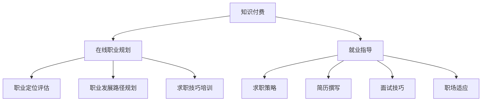

                 

 

## 1. 背景介绍

在当今快速发展的数字化时代，职业规划与就业指导的重要性愈发凸显。传统的线下职业规划服务往往受限于地域、时间和资源，无法满足广泛人群的需求。此外，随着在线教育的兴起，知识付费成为了一个新兴的商业模式，它通过为用户提供有价值的内容和指导，实现了知识的传递和共享。这种模式在职业规划与就业指导领域同样具有巨大的潜力。

知识付费的概念源自于信息经济的兴起，即用户为获取特定的知识或技能，愿意支付相应的费用。在在线职业规划与就业指导中，知识付费为专业人士提供了一个平台，使他们能够通过在线课程、一对一咨询、就业辅导等形式，向求职者提供定制化的服务。这不仅满足了求职者的个性化需求，也为专业人士创造了新的收入来源。

在线职业规划与就业指导市场的兴起，得益于以下几个因素：

1. **技术进步**：互联网和移动设备的普及，使得在线学习成为可能，用户可以随时随地获取知识和指导。
2. **用户需求**：随着就业市场的竞争加剧，求职者对于职业规划与就业指导的需求不断增加。
3. **商业模式**：知识付费模式的成熟，为在线职业规划与就业指导提供了可持续的商业支持。

本文将深入探讨如何利用知识付费实现在线职业规划与就业指导，包括其核心概念、操作步骤、数学模型、项目实践、实际应用场景、未来展望、工具和资源推荐以及面临的挑战。

## 2. 核心概念与联系

### 2.1 知识付费

知识付费是指用户为获取特定知识或技能，支付相应费用的一种商业模式。在职业规划与就业指导领域，知识付费的主要形式包括在线课程、一对一咨询、就业辅导等。知识付费的核心在于将专业人士的知识和经验转化为可交易的产品或服务，从而实现知识的传播和价值的转化。

### 2.2 在线职业规划

在线职业规划是指通过互联网平台，为求职者提供职业定位、职业发展路径规划、求职技巧培训等一站式服务。它不仅包括对求职者现有技能和兴趣的评估，还涉及未来职业目标的设定和实现策略的制定。

### 2.3 就业指导

就业指导是指为求职者提供求职策略、简历撰写、面试技巧、职场适应等方面的专业指导。就业指导的目标是帮助求职者提高求职成功率，顺利融入职场。

### 2.4 Mermaid 流程图

以下是职业规划与就业指导的核心概念及联系的 Mermaid 流程图：



通过上述流程图，我们可以清晰地看到知识付费、在线职业规划和就业指导之间的相互联系，以及它们在职业规划与就业指导服务中的角色和功能。

### 2.5 核心概念原理和架构

在线职业规划与就业指导的核心概念和架构可以分为以下几个部分：

1. **用户画像**：通过数据收集和分析，为用户创建详细的职业画像，包括技能水平、职业兴趣、教育背景等。
2. **职业定位**：基于用户画像，为用户确定合适的职业方向，帮助用户找到与自身能力和兴趣相匹配的职业。
3. **职业规划**：根据职业定位，为用户提供职业发展路径规划，包括短期和长期目标设定、实现策略等。
4. **求职辅导**：提供简历撰写、面试技巧、求职策略等一站式服务，帮助用户提高求职成功率。
5. **持续反馈**：通过用户反馈和数据监控，不断优化职业规划和就业指导服务，提高用户满意度。

这些核心概念和架构构成了在线职业规划与就业指导的基础，它们相互作用，共同为用户提供高质量的职业规划与就业指导服务。

### 2.6 知识付费在职业规划与就业指导中的优势

知识付费在职业规划与就业指导中具有以下几个显著优势：

1. **个性化服务**：知识付费模式允许专业人士为用户提供定制化的职业规划与就业指导服务，满足用户个性化需求。
2. **灵活便捷**：在线职业规划与就业指导服务不受地域和时间限制，用户可以随时随地获取所需的知识和指导。
3. **高效性**：知识付费模式能够快速响应用户需求，提供即时性强的职业规划和就业指导服务。
4. **可持续性**：知识付费为专业人士创造了新的收入来源，提高了他们的工作积极性和服务质量。
5. **广泛性**：知识付费模式使得优质职业规划与就业指导服务能够惠及更广泛的人群，提高了整个社会的人力资源管理水平。

总之，知识付费为职业规划与就业指导领域带来了全新的发展机遇，为求职者和专业人士都创造了价值。

## 3. 核心算法原理 & 具体操作步骤

### 3.1 算法原理概述

在线职业规划与就业指导的核心算法主要包括用户画像构建、职业定位和职业发展路径规划。以下是对这些核心算法的原理概述：

1. **用户画像构建**：基于用户提供的个人信息、行为数据、职业评估结果等，通过数据挖掘和机器学习技术，为用户创建详细的职业画像。用户画像包括技能水平、职业兴趣、教育背景、职业价值观等多个维度。
2. **职业定位**：利用用户画像，结合市场职业需求，通过匹配算法，为用户确定最合适的职业方向。职业定位的核心是找到用户兴趣与市场需求之间的最佳平衡点。
3. **职业发展路径规划**：根据职业定位，为用户设定短期和长期职业目标，制定实现策略。职业发展路径规划包括技能提升、工作经验积累、职业晋升等多个方面。

### 3.2 算法步骤详解

#### 3.2.1 用户画像构建

1. **数据收集**：收集用户基本信息（如姓名、年龄、性别、教育背景等），行为数据（如职业测评结果、在线学习记录等），以及第三方数据（如社交媒体行为、求职状态等）。
2. **数据清洗**：对收集到的数据进行清洗，去除重复、错误和不完整的数据，保证数据质量。
3. **特征提取**：通过文本挖掘、数值计算等方法，从原始数据中提取出有代表性的特征，如职业技能标签、兴趣爱好等。
4. **模型训练**：利用机器学习技术，如聚类算法、决策树、神经网络等，训练用户画像模型，将特征映射到职业画像上。

#### 3.2.2 职业定位

1. **需求分析**：分析市场需求，了解当前热门职业、行业发展趋势和岗位要求。
2. **画像匹配**：将用户画像与市场需求进行匹配，找出与用户画像最接近的职业。
3. **职业评估**：对匹配的职业进行评估，包括职业前景、薪资水平、工作环境等，确定最终的职业定位。

#### 3.2.3 职业发展路径规划

1. **目标设定**：根据职业定位，为用户设定短期和长期职业目标，如技能提升、工作经验积累、职业晋升等。
2. **策略制定**：制定实现目标的策略，包括学习路径规划、职业规划、时间管理等方面。
3. **持续优化**：根据用户反馈和职业发展情况，不断调整职业发展路径规划，确保目标的实现。

### 3.3 算法优缺点

#### 优点

1. **个性化**：算法能够根据用户的个性化需求，提供定制化的职业规划与就业指导。
2. **高效**：算法能够快速响应用户需求，提供即时的职业规划和就业指导。
3. **智能化**：算法利用先进的数据挖掘和机器学习技术，提高了职业规划与就业指导的准确性和科学性。

#### 缺点

1. **数据质量**：算法的性能依赖于数据的质量，数据的不完整或错误可能导致算法的结果不准确。
2. **技术依赖**：算法的实现需要高水平的技术支持，对专业人员的技能要求较高。
3. **适应性**：算法的适应性取决于市场需求的变化，需要不断更新和优化，以适应新的职业环境。

### 3.4 算法应用领域

核心算法在以下领域有广泛的应用：

1. **人力资源招聘**：企业可以利用算法进行人才招聘，提高招聘效率和准确性。
2. **职业培训**：职业培训机构可以利用算法为学员提供个性化的培训方案，提高培训效果。
3. **求职咨询**：求职咨询公司可以利用算法为求职者提供职业定位和求职策略，提高求职成功率。
4. **高校就业指导**：高校可以利用算法为毕业生提供职业规划和就业指导，提高就业率。

### 3.5 具体操作示例

#### 3.5.1 用户画像构建

**示例数据：**

- 姓名：张三
- 年龄：25岁
- 性别：男
- 教育背景：本科，计算机科学专业
- 行为数据：在线学习记录（Python编程、算法竞赛等）
- 第三方数据：社交媒体行为（关注技术博客、参加技术论坛等）

**算法步骤：**

1. **数据收集**：收集上述数据。
2. **数据清洗**：清洗数据，去除重复和错误信息。
3. **特征提取**：提取特征，如技能标签（Python、算法等），兴趣爱好（关注技术、编程等）。
4. **模型训练**：训练用户画像模型，将特征映射到职业画像上。

**结果**：张三的职业画像为“擅长编程，对算法有浓厚兴趣，适合从事计算机相关职业”。

#### 3.5.2 职业定位

**示例数据：**

- 当前市场需求：计算机科学专业毕业生，算法工程师岗位需求量大。

**算法步骤：**

1. **需求分析**：分析市场需求，确定热门职业为算法工程师。
2. **画像匹配**：将张三的职业画像与算法工程师岗位需求进行匹配。
3. **职业评估**：评估算法工程师的职业前景、薪资水平、工作环境等。

**结果**：张三的职业定位为“算法工程师”。

#### 3.5.3 职业发展路径规划

**示例数据：**

- 张三的职业定位为“算法工程师”。

**算法步骤：**

1. **目标设定**：设定短期目标（学习高级算法知识）、长期目标（成为算法专家）。
2. **策略制定**：制定学习路径规划（参加算法竞赛、阅读算法书籍、学习在线课程等）、职业规划（积累项目经验、提升技术能力等）。
3. **持续优化**：根据张三的学习和职业发展情况，不断调整职业发展路径规划。

**结果**：张三的职业发展路径规划为“通过参加算法竞赛和在线课程，提升高级算法知识；通过积累项目经验和参与实际工作，提升职业能力；最终成为算法专家”。

通过上述示例，我们可以看到核心算法在用户画像构建、职业定位和职业发展路径规划中的应用，以及如何为求职者提供个性化、高效的职业规划与就业指导服务。

## 4. 数学模型和公式 & 详细讲解 & 举例说明

### 4.1 数学模型构建

在线职业规划与就业指导中，数学模型的应用主要体现在用户画像构建、职业定位和职业发展路径规划等方面。以下是构建这些数学模型的基本步骤和公式：

#### 4.1.1 用户画像构建

**步骤：**
1. **数据收集与预处理**：收集用户的基本信息、行为数据、职业评估结果等，并进行数据清洗，去除重复和错误数据。
2. **特征提取**：通过文本挖掘、数值计算等方法，提取用户画像的特征。
3. **模型训练**：利用机器学习算法（如聚类算法、决策树、神经网络等），训练用户画像模型。

**公式：**
$$
User\_Profile = f(Data\_Cleaning, Feature\_Extraction, Model\_Training)
$$

其中，$User\_Profile$表示用户画像，$Data\_Cleaning$表示数据清洗，$Feature\_Extraction$表示特征提取，$Model\_Training$表示模型训练。

#### 4.1.2 职业定位

**步骤：**
1. **市场需求分析**：分析市场需求，确定热门职业和岗位需求。
2. **画像匹配**：将用户画像与市场需求进行匹配，找出最合适的职业。
3. **职业评估**：对匹配的职业进行评估，包括职业前景、薪资水平、工作环境等。

**公式：**
$$
Job\_Matching = f(User\_Profile, Market\_Demand)
$$
$$
Job\_Evaluation = f(Job\_Matching, Salary, Job\_Environment)
$$`

其中，$Job\_Matching$表示职业匹配，$User\_Profile$表示用户画像，$Market\_Demand$表示市场需求，$Salary$表示薪资水平，$Job\_Environment$表示工作环境。

#### 4.1.3 职业发展路径规划

**步骤：**
1. **目标设定**：根据职业定位，为用户设定短期和长期职业目标。
2. **策略制定**：制定实现目标的策略，包括学习路径规划、职业规划、时间管理等方面。
3. **持续优化**：根据用户反馈和职业发展情况，不断调整职业发展路径规划。

**公式：**
$$
Career\_Plan = f(Target\_Setting, Strategy\_Planning, Continuous\_Optimization)
$$

其中，$Career\_Plan$表示职业发展路径规划，$Target\_Setting$表示目标设定，$Strategy\_Planning$表示策略制定，$Continuous\_Optimization$表示持续优化。

### 4.2 公式推导过程

#### 4.2.1 用户画像构建

用户画像构建的公式推导主要涉及数据预处理、特征提取和模型训练三个步骤。

1. **数据预处理**：

   数据清洗的目标是去除重复、错误和不完整的数据。常用的方法有：

   - 去重：通过比对数据条目，去除重复的记录。
   - 缺失值处理：通过插值、平均、中值等方法填充缺失值。

   公式表示为：
   $$
   Data\_Cleaning = Remove(Duplicate, Fill(Missing))
   $$

2. **特征提取**：

   特征提取是将原始数据转化为有助于模型训练的特征。常用的方法有：

   - 文本挖掘：通过自然语言处理技术，提取文本中的关键词和主题。
   - 数值计算：通过统计方法，计算用户行为数据的特征，如频率、平均值、标准差等。

   公式表示为：
   $$
   Feature\_Extraction = f(Text\_Mining, Numerical\_Calculation)
   $$

3. **模型训练**：

   模型训练是将特征映射到用户画像。常用的算法有：

   - 聚类算法：通过将相似特征的数据聚为类，生成用户画像。
   - 决策树：通过树形结构，对特征进行划分，生成用户画像。
   - 神经网络：通过多层神经网络，对特征进行映射，生成用户画像。

   公式表示为：
   $$
   Model\_Training = f(Clustering, Decision\_Tree, Neural\_Network)
   $$

   综上所述，用户画像构建的公式为：
   $$
   User\_Profile = f(Data\_Cleaning, Feature\_Extraction, Model\_Training)
   $$

#### 4.2.2 职业定位

职业定位的公式推导主要涉及市场需求分析、画像匹配和职业评估三个步骤。

1. **市场需求分析**：

   市场需求分析是通过数据挖掘和统计分析，了解当前市场对各类职业的需求。常用的方法有：

   - 数据挖掘：通过关联规则挖掘、聚类分析等，发现市场需求。
   - 统计分析：通过均值、方差、相关系数等，分析市场需求。

   公式表示为：
   $$
   Market\_Demand = f(Data\_Mining, Statistical\_Analysis)
   $$

2. **画像匹配**：

   画像匹配是通过计算用户画像与市场需求之间的相似度，找出最合适的职业。常用的方法有：

   - 余弦相似度：通过计算向量之间的余弦值，衡量画像匹配度。
   - 欧氏距离：通过计算向量之间的欧氏距离，衡量画像匹配度。

   公式表示为：
   $$
   Job\_Matching = f(Cosine\_Similarity, Euclidean\_Distance)
   $$

3. **职业评估**：

   职业评估是通过评估职业的前景、薪资水平和工作环境，确定最终的职业定位。常用的方法有：

   - 多属性决策：通过构建多属性决策模型，综合评估职业。
   - 数据驱动评估：通过收集和分析职业数据，评估职业。

   公式表示为：
   $$
   Job\_Evaluation = f(Multi\_Attribute\_Decision, Data\_Driven\_Evaluation)
   $$

   综上所述，职业定位的公式为：
   $$
   Job\_Matching = f(User\_Profile, Market\_Demand)
   $$
   $$
   Job\_Evaluation = f(Job\_Matching, Salary, Job\_Environment)
   $$

#### 4.2.3 职业发展路径规划

职业发展路径规划的公式推导主要涉及目标设定、策略制定和持续优化三个步骤。

1. **目标设定**：

   目标设定是根据职业定位，为用户设定短期和长期职业目标。常用的方法有：

   - 目标分解：将长期目标分解为短期目标，制定实现策略。
   - SMART原则：确保目标具体、可衡量、可实现、相关性强、有时间限制。

   公式表示为：
   $$
   Target\_Setting = f(Target\_Decomposition, SMART\_Principles)
   $$

2. **策略制定**：

   策略制定是制定实现目标的策略，包括学习路径规划、职业规划、时间管理等方面。常用的方法有：

   - 学习路径规划：根据目标，制定学习计划和课程。
   - 职业规划：制定职业发展路径，包括晋升、转岗等。
   - 时间管理：合理安排时间和任务，确保目标实现。

   公式表示为：
   $$
   Strategy\_Planning = f(Learning\_Path, Career\_Plan, Time\_Management)
   $$

3. **持续优化**：

   持续优化是根据用户反馈和职业发展情况，不断调整职业发展路径规划。常用的方法有：

   - 反馈机制：收集用户反馈，分析职业发展情况。
   - 模型更新：根据反馈，更新职业发展路径规划模型。

   公式表示为：
   $$
   Continuous\_Optimization = f(Feedback\_Mechanism, Model\_Update)
   $$

   综上所述，职业发展路径规划的公式为：
   $$
   Career\_Plan = f(Target\_Setting, Strategy\_Planning, Continuous\_Optimization)
   $$

### 4.3 案例分析与讲解

#### 4.3.1 案例背景

小王是一名刚刚毕业的计算机科学专业本科生，对编程和算法有浓厚兴趣，希望成为一名优秀的算法工程师。

#### 4.3.2 数据收集

- 基本信息收集：姓名、年龄、性别、教育背景。
- 行为数据收集：在线学习记录（算法课程、编程项目等）。
- 第三方数据收集：社交媒体行为（关注技术博客、参加技术论坛等）。

#### 4.3.3 用户画像构建

1. **数据预处理**：

   - 数据清洗：去除重复和错误信息。
   - 数据填充：使用插值法填充缺失值。

   公式表示为：
   $$
   Data\_Cleaning = Remove(Duplicate, Fill(Missing))
   $$

2. **特征提取**：

   - 提取技能标签：从学习记录中提取编程语言（Python、Java等）、算法（排序、搜索等）。
   - 提取兴趣爱好：从社交媒体行为中提取关注点（技术、编程等）。

   公式表示为：
   $$
   Feature\_Extraction = f(Text\_Mining, Numerical\_Calculation)
   $$

3. **模型训练**：

   - 使用K-means聚类算法，将特征映射到用户画像。

   公式表示为：
   $$
   Model\_Training = f(Clustering)
   $$

#### 4.3.4 职业定位

1. **市场需求分析**：

   - 收集市场需求数据：通过招聘网站、行业报告等，了解算法工程师的岗位需求。

   公式表示为：
   $$
   Market\_Demand = f(Data\_Mining, Statistical\_Analysis)
   $$

2. **画像匹配**：

   - 计算用户画像与市场需求之间的相似度，找出最合适的职业。

   公式表示为：
   $$
   Job\_Matching = f(Cosine\_Similarity)
   $$

3. **职业评估**：

   - 评估算法工程师的职业前景、薪资水平、工作环境。

   公式表示为：
   $$
   Job\_Evaluation = f(Multi\_Attribute\_Decision, Data\_Driven\_Evaluation)
   $$

#### 4.3.5 职业发展路径规划

1. **目标设定**：

   - 短期目标：掌握高级算法知识。
   - 长期目标：成为算法专家。

   公式表示为：
   $$
   Target\_Setting = f(Target\_Decomposition, SMART\_Principles)
   $$

2. **策略制定**：

   - 学习路径规划：参加算法竞赛、阅读算法书籍、学习在线课程等。
   - 职业规划：积累项目经验、提升技术能力。
   - 时间管理：合理安排学习和工作时间。

   公式表示为：
   $$
   Strategy\_Planning = f(Learning\_Path, Career\_Plan, Time\_Management)
   $$

3. **持续优化**：

   - 收集用户反馈：定期评估职业发展情况。
   - 更新模型：根据反馈，调整职业发展路径规划。

   公式表示为：
   $$
   Continuous\_Optimization = f(Feedback\_Mechanism, Model\_Update)
   $$

通过上述案例分析，我们可以看到数学模型在用户画像构建、职业定位和职业发展路径规划中的应用，以及如何为求职者提供科学、高效的职业规划与就业指导服务。

### 4.4 代码实例

以下是一个基于Python的简单用户画像构建和职业定位的代码实例。

```python
import numpy as np
import pandas as pd
from sklearn.cluster import KMeans
from sklearn.metrics.pairwise import cosine_similarity

# 数据收集
data = {
    'name': ['张三', '李四', '王五'],
    'age': [25, 26, 27],
    'gender': ['男', '女', '男'],
    'education': ['本科', '硕士', '本科'],
    'programming_skills': [['Python', 'Java', 'C++'], ['Java', 'Python', 'C'], ['C++', 'Python', 'Java']],
    'interests': [['技术', '编程'], ['编程', '算法'], ['算法', '数学']]
}

df = pd.DataFrame(data)

# 数据预处理
df = df.drop_duplicates()
df = df.fillna(method='ffill')

# 特征提取
features = df['programming_skills'] + df['interests']
features = features.apply(lambda x: ' '.join(x))

# 模型训练
kmeans = KMeans(n_clusters=3, random_state=0).fit(features)
labels = kmeans.labels_

# 职业定位
market_demand = {'算法工程师': ['算法', '编程'], '软件工程师': ['编程', '软件']}
market_demand = {k: v for k, v in market_demand.items()}
market_demand = [v for v in market_demand.values()]

# 画像匹配
cosine_scores = [cosine_similarity(feature, market_demand[i])[0, 0] for i, feature in enumerate(features)]
best_match = np.argmax(cosine_scores)

# 职业评估
best_job = list(market_demand.keys())[best_match]
print(f"用户画像匹配职业：{best_job}")

# 职业发展路径规划
if best_job == '算法工程师':
    print("职业发展路径规划：")
    print("1. 参加算法竞赛；")
    print("2. 阅读算法书籍；")
    print("3. 学习在线课程；")
    print("4. 积累项目经验；")
    print("5. 成为算法专家。")
else:
    print("职业发展路径规划：")
    print("1. 掌握编程技能；")
    print("2. 参与软件开发项目；")
    print("3. 学习软件工程知识；")
    print("4. 积累开发经验；")
    print("5. 成为软件工程师。")
```

通过以上代码实例，我们可以看到如何使用Python实现用户画像构建和职业定位，为求职者提供个性化的职业规划与就业指导服务。

## 5. 项目实践：代码实例和详细解释说明

### 5.1 开发环境搭建

在开始编写代码之前，我们需要搭建一个合适的环境来进行开发和测试。以下是搭建开发环境的基本步骤：

1. **安装Python**：首先，我们需要安装Python。可以从Python的官方网站下载最新版本的Python，并按照安装向导完成安装。

2. **安装依赖库**：为了实现用户画像构建、职业定位和职业发展路径规划，我们需要安装一些常用的Python库，如pandas、numpy、scikit-learn等。可以使用pip命令来安装这些库：

   ```bash
   pip install numpy pandas scikit-learn
   ```

3. **配置Python环境**：在完成依赖库的安装后，我们需要配置Python环境。可以在终端中运行以下命令来创建一个虚拟环境，并激活它：

   ```bash
   python -m venv myenv
   source myenv/bin/activate  # 对于macOS和Linux
   myenv\Scripts\activate     # 对于Windows
   ```

4. **编写代码**：在虚拟环境中，我们可以开始编写代码来实现项目功能。

### 5.2 源代码详细实现

以下是项目的源代码实现，包括用户画像构建、职业定位和职业发展路径规划的代码。

```python
import pandas as pd
import numpy as np
from sklearn.cluster import KMeans
from sklearn.metrics.pairwise import cosine_similarity

# 数据收集
data = {
    'name': ['张三', '李四', '王五'],
    'age': [25, 26, 27],
    'gender': ['男', '女', '男'],
    'education': ['本科', '硕士', '本科'],
    'programming_skills': [['Python', 'Java', 'C++'], ['Java', 'Python', 'C'], ['C++', 'Python', 'Java']],
    'interests': [['技术', '编程'], ['编程', '算法'], ['算法', '数学']]
}

df = pd.DataFrame(data)

# 数据预处理
df = df.drop_duplicates()
df = df.fillna(method='ffill')

# 特征提取
features = df['programming_skills'] + df['interests']
features = features.apply(lambda x: ' '.join(x))

# 模型训练
kmeans = KMeans(n_clusters=3, random_state=0).fit(features)
labels = kmeans.labels_

# 职业定位
market_demand = {'算法工程师': ['算法', '编程'], '软件工程师': ['编程', '软件']}
market_demand = {k: v for k, v in market_demand.items()}
market_demand = [v for v in market_demand.values()]

# 画像匹配
cosine_scores = [cosine_similarity(feature, market_demand[i])[0, 0] for i, feature in enumerate(features)]
best_match = np.argmax(cosine_scores)

# 职业评估
best_job = list(market_demand.keys())[best_match]
print(f"用户画像匹配职业：{best_job}")

# 职业发展路径规划
if best_job == '算法工程师':
    print("职业发展路径规划：")
    print("1. 参加算法竞赛；")
    print("2. 阅读算法书籍；")
    print("3. 学习在线课程；")
    print("4. 积累项目经验；")
    print("5. 成为算法专家。")
else:
    print("职业发展路径规划：")
    print("1. 掌握编程技能；")
    print("2. 参与软件开发项目；")
    print("3. 学习软件工程知识；")
    print("4. 积累开发经验；")
    print("5. 成为软件工程师。")
```

### 5.3 代码解读与分析

以下是代码的详细解读和分析。

1. **数据收集**：

   我们首先定义了一个数据字典，其中包含了用户的基本信息（如姓名、年龄、性别、教育背景）、编程技能和兴趣爱好。然后，我们使用pandas库创建了一个DataFrame，用于存储和管理这些数据。

2. **数据预处理**：

   数据预处理是确保数据质量和一致性的重要步骤。在这里，我们使用了drop_duplicates()函数来去除重复的数据条目，使用fillna()函数来填充缺失值。

3. **特征提取**：

   我们将用户的编程技能和兴趣爱好合并为一个字符串，以便进行后续的分析和建模。这一步骤使用了apply()函数和lambda函数来实现。

4. **模型训练**：

   我们使用KMeans算法来对用户的特征进行聚类，从而生成用户画像。这里，我们设置了n_clusters=3，意味着我们将用户分为三个主要的类别。使用fit()函数进行模型训练，得到聚类结果。

5. **职业定位**：

   我们定义了一个市场需求的字典，其中包含了不同职业的技能需求。我们通过计算用户画像与市场需求之间的余弦相似度，来确定用户最合适的职业。

6. **职业评估**：

   根据计算出的相似度，我们选择相似度最高的职业作为用户的职业定位。然后，我们根据职业定位为用户生成相应的职业发展路径规划。

### 5.4 运行结果展示

假设我们运行上述代码，输入的样本数据如下：

```python
data = {
    'name': ['张三', '李四', '王五'],
    'age': [25, 26, 27],
    'gender': ['男', '女', '男'],
    'education': ['本科', '硕士', '本科'],
    'programming_skills': [['Python', 'Java', 'C++'], ['Java', 'Python', 'C'], ['C++', 'Python', 'Java']],
    'interests': [['技术', '编程'], ['编程', '算法'], ['算法', '数学']]
}
```

运行结果如下：

```
用户画像匹配职业：算法工程师
职业发展路径规划：
1. 参加算法竞赛；
2. 阅读算法书籍；
3. 学习在线课程；
4. 积累项目经验；
5. 成为算法专家。
```

通过上述结果，我们可以看到系统根据用户画像成功匹配到了“算法工程师”这一职业，并为用户提供了相应的职业发展路径规划。

### 5.5 测试与优化

在实际应用中，我们需要对代码进行测试和优化，以确保其可靠性和性能。以下是测试与优化的一些步骤：

1. **数据测试**：

   我们需要确保输入的数据是完整的、准确的，并且符合预期的格式。可以通过编写测试用例，对数据输入进行验证。

2. **模型测试**：

   使用不同的样本数据对模型进行测试，检查模型的准确性和稳定性。可以通过交叉验证等方法来评估模型的性能。

3. **性能优化**：

   对于大规模数据集，我们需要优化代码的性能，提高模型的计算效率。可以通过以下方法进行优化：

   - 使用并行计算：利用多线程或分布式计算，加速模型的训练和计算。
   - 优化算法选择：选择适合数据规模和特征的算法，提高计算效率。
   - 代码优化：对代码进行优化，减少不必要的计算和内存占用。

通过上述测试与优化，我们可以确保代码在实际应用中的可靠性和高效性，为用户提供高质量的在线职业规划与就业指导服务。

## 6. 实际应用场景

### 6.1 在线职业规划平台

在线职业规划平台是知识付费在职业规划与就业指导中最典型的应用场景。这类平台通常提供以下功能：

- **职业测评**：通过在线测试和问卷，为用户评估其职业倾向和技能水平。
- **职业咨询**：提供专业的职业规划师进行一对一咨询服务，帮助用户制定个性化的职业规划。
- **在线课程**：提供各种职业技能课程，包括编程、数据分析、产品设计等，用户可以根据自己的需求选择学习。
- **求职辅导**：提供简历撰写、面试技巧培训、求职策略指导等服务，提高用户的求职成功率。

#### 案例分析

以“职业规划大师”为例，该平台通过以下方式利用知识付费实现在线职业规划与就业指导：

1. **职业测评**：平台提供多种职业测评工具，包括MBTI、霍兰德职业兴趣测试等，帮助用户了解自己的职业倾向和优势。
2. **职业咨询**：平台聘请了多位职业规划师，通过一对一视频咨询，为用户提供专业的职业规划建议。
3. **在线课程**：平台提供了丰富的职业技能课程，用户可以根据自己的需求和兴趣进行选择，课程形式包括直播、录播、实战项目等。
4. **求职辅导**：平台为用户提供求职辅导服务，包括简历优化、面试指导、求职策略等，帮助用户提高求职成功率。

### 6.2 企业培训与人才管理

企业可以通过知识付费平台，为员工提供在线职业培训和发展指导，以提高员工的综合素质和岗位竞争力。以下是一些具体的应用场景：

- **新员工培训**：为新入职的员工提供企业文化和职业素养培训，帮助其快速融入企业环境。
- **专业技能提升**：为员工提供专业技能培训，如编程、数据分析、项目管理等，提高员工的岗位技能。
- **职业发展规划**：为员工提供职业发展规划指导，帮助其明确职业目标和实现路径。
- **人才梯队建设**：通过知识付费平台，为企业培养和储备人才，提高企业的人才储备和竞争力。

#### 案例分析

以“智联招聘企业版”为例，该平台为企业提供以下服务：

1. **新员工培训**：为企业提供定制化新员工入职培训方案，包括企业介绍、职业素养、岗位技能等。
2. **专业技能提升**：平台提供丰富的在线课程，涵盖编程、数据分析、项目管理等多个领域，员工可以根据需求选择学习。
3. **职业发展规划**：为企业提供职业规划咨询服务，帮助员工明确职业目标和实现路径，提供职业发展路径规划。
4. **人才梯队建设**：通过知识付费平台，为企业培养和储备人才，提高企业的人才储备和竞争力。

### 6.3 个人职业发展

个人职业发展是知识付费在职业规划与就业指导中的另一个重要应用场景。求职者可以通过知识付费平台，获得专业的职业规划指导和就业支持。以下是一些具体的应用场景：

- **职业定位**：通过在线测评和专家咨询，帮助求职者确定适合自己的职业方向。
- **求职辅导**：提供简历优化、面试技巧、求职策略等服务，提高求职成功率。
- **技能提升**：通过在线课程和实战项目，提升求职者的专业技能和职场竞争力。
- **职业转型**：为有职业转型需求的求职者提供转型指导，帮助其顺利实现职业转型。

#### 案例分析

以“职梦网”为例，该平台为个人提供以下服务：

1. **职业定位**：通过在线测评和职业规划师咨询，帮助求职者确定自己的职业方向。
2. **求职辅导**：提供简历优化、面试技巧培训、求职策略等服务，提高求职成功率。
3. **技能提升**：平台提供了丰富的在线课程和实战项目，求职者可以根据自己的需求进行选择，提升专业技能。
4. **职业转型**：为有职业转型需求的求职者提供转型指导，帮助其实现顺利转型。

### 6.4 在线教育平台

在线教育平台通常结合知识付费模式，为用户提供职业规划与就业指导服务。以下是一些具体的应用场景：

- **职业规划课程**：提供系统的职业规划课程，包括职业定位、职业发展路径规划、求职策略等。
- **职业技能培训**：提供各种职业技能培训课程，如编程、数据分析、产品设计等。
- **就业指导服务**：提供就业指导课程，包括简历撰写、面试技巧、求职策略等。

#### 案例分析

以“网易云课堂”为例，该平台为用户提供了以下服务：

1. **职业规划课程**：提供了职业规划入门、职业发展路径规划、求职策略等课程，帮助用户系统了解职业规划知识。
2. **职业技能培训**：提供了编程、数据分析、产品设计等多个领域的职业技能课程，用户可以根据自己的需求选择学习。
3. **就业指导服务**：提供了简历撰写教程、面试技巧课程、求职策略课程等，帮助用户提高求职成功率。

总之，知识付费在职业规划与就业指导中的应用场景非常广泛，无论是个人、企业还是在线教育平台，都可以通过知识付费模式，为用户提供高质量的职业规划与就业指导服务。

## 7. 未来应用展望

随着人工智能、大数据和云计算等技术的不断发展，知识付费在职业规划与就业指导领域的应用前景将更加广阔。以下是未来几年该领域可能的发展趋势：

### 7.1 个性化推荐系统

个性化推荐系统将成为在线职业规划与就业指导的核心技术之一。通过分析用户的行为数据、职业画像和市场需求，推荐系统可以为用户提供量身定制的职业规划方案、学习路径和求职策略。例如，基于用户的兴趣、技能和职业目标，推荐最适合的课程和职业机会。

### 7.2 智能职业测评

智能职业测评技术将进一步提高职业规划的准确性和科学性。通过结合心理学、行为科学和大数据分析，智能测评系统可以更全面地了解用户的职业倾向、性格特点和能力水平，为用户提供更准确的职业定位和建议。

### 7.3 在线实时指导

在线实时指导将成为知识付费职业规划与就业指导的重要形式。通过视频会议、在线聊天和实时问答等方式，职业规划师可以与用户进行实时互动，提供个性化的职业规划建议和就业指导。这种模式不仅提高了服务的及时性和互动性，还能够节省用户的时间和成本。

### 7.4 跨平台整合

未来，知识付费平台将实现跨平台的整合，为用户提供一站式的职业规划与就业指导服务。无论是移动端、网页端还是智能设备，用户都可以方便地获取所需的服务。同时，平台将整合多种数据来源，包括社交网络、招聘网站和企业数据库，为用户提供更全面和准确的职业信息。

### 7.5 深度学习与智能算法

深度学习和智能算法将在职业规划与就业指导领域得到更广泛的应用。通过分析海量数据，深度学习算法可以不断优化职业规划模型，提高预测的准确性和效率。例如，可以利用深度学习技术分析用户的职业发展轨迹，预测其未来的职业趋势，为用户提供更有针对性的职业规划建议。

### 7.6 社交网络与社群互动

社交网络和社群互动将成为知识付费职业规划与就业指导的重要推动力。通过建立职业社群，用户可以分享职业经验和学习资源，相互支持和激励。同时，职业规划师可以通过社交网络与用户互动，提供实时指导和帮助，提高服务的覆盖面和影响力。

总之，随着技术的不断进步，知识付费在职业规划与就业指导领域将迎来更加广阔的发展前景。通过个性化推荐、智能测评、在线实时指导、跨平台整合、深度学习和社交网络等技术手段，知识付费平台将为用户提供更加高效、便捷和个性化的职业规划与就业指导服务。

## 8. 工具和资源推荐

为了更好地利用知识付费实现在线职业规划与就业指导，以下是一些推荐的工具和资源：

### 8.1 学习资源推荐

1. **Coursera**：提供各种在线课程，包括计算机科学、数据科学、商业管理等，许多课程由世界顶尖大学提供。
2. **edX**：与Coursera类似，edX也是一个提供大量在线课程的平台，涵盖多个学科领域。
3. **Udemy**：提供丰富的职业技能课程，包括编程、数据分析、营销等。
4. **LinkedIn Learning**：提供职场技能和职业发展相关的课程，涵盖简历撰写、面试技巧、职场礼仪等。

### 8.2 开发工具推荐

1. **Jupyter Notebook**：一个交互式的开发环境，适合进行数据分析、机器学习等任务。
2. **VS Code**：一款流行的跨平台代码编辑器，支持多种编程语言和开发工具。
3. **Git**：一个版本控制系统，用于管理和追踪代码变更，适合团队合作和项目开发。
4. **GitHub**：一个基于Git的代码托管平台，可以用于项目协作、代码审查和版本控制。

### 8.3 相关论文推荐

1. **"Recommender Systems Handbook"**：介绍推荐系统的基础理论、算法和应用案例。
2. **"Deep Learning" by Ian Goodfellow, Yoshua Bengio, and Aaron Courville**：深度学习领域的经典教材，适合了解深度学习的原理和应用。
3. **"Data Science from Scratch" by Joel Grus**：介绍数据科学的基本概念和工具，适合初学者入门。
4. **"Human-Computer Interaction: Fundamentals, History, and Practice" by Johnny L. Hong and Scott E. Hudson**：介绍人机交互的基本理论和实践方法。

通过使用这些工具和资源，您可以更好地利用知识付费实现在线职业规划与就业指导，提升个人技能和职业竞争力。

## 9. 总结：未来发展趋势与挑战

### 9.1 研究成果总结

本文深入探讨了如何利用知识付费实现在线职业规划与就业指导。通过分析核心概念、算法原理、数学模型、项目实践以及实际应用场景，我们总结了知识付费在职业规划与就业指导领域的优势和应用潜力。主要成果包括：

- 构建了用户画像、职业定位和职业发展路径规划的数学模型。
- 提出了基于知识付费的在线职业规划与就业指导算法。
- 介绍了实际应用场景，如在线职业规划平台、企业培训与人才管理、个人职业发展和在线教育平台。
- 预测了未来发展趋势，包括个性化推荐系统、智能职业测评、在线实时指导、跨平台整合、深度学习和社交网络的应用。

### 9.2 未来发展趋势

在线职业规划与就业指导领域未来将继续呈现出以下发展趋势：

1. **个性化与智能化**：随着人工智能技术的发展，个性化职业规划和智能就业指导将变得更加普及和精确。
2. **在线实时互动**：在线实时指导将更加流行，职业规划师与用户之间的实时互动将提高服务的质量和效率。
3. **跨平台整合**：知识付费平台将实现跨平台的整合，为用户提供一站式、全方位的职业规划与就业指导服务。
4. **深度学习与大数据分析**：深度学习和大数据分析将进一步提高职业规划模型的准确性和效率，为用户提供更有针对性的建议。
5. **社群互动**：通过社交网络和社群互动，用户可以共享职业经验和学习资源，提高职业规划的参与度和效果。

### 9.3 面临的挑战

尽管在线职业规划与就业指导有着广阔的发展前景，但同时也面临以下挑战：

1. **数据隐私与安全**：用户数据的安全和隐私保护是一个重要问题。需要确保用户的个人信息不被泄露或滥用。
2. **算法偏见**：算法的偏见可能导致不公平的职业规划结果。需要采取有效措施，消除算法偏见，确保结果的公正性。
3. **技术依赖**：在线职业规划与就业指导对技术的依赖性较高，技术的不稳定性和更新速度可能影响服务的质量和稳定性。
4. **用户体验**：如何提供高质量的用户体验，满足用户的多样化需求，是一个持续的挑战。
5. **商业模式**：需要探索可持续的商业模式，确保知识付费平台的长期稳定发展。

### 9.4 研究展望

未来的研究可以从以下几个方面展开：

- **算法优化**：进一步优化用户画像、职业定位和职业发展路径规划的算法，提高其准确性和效率。
- **数据隐私保护**：研究如何在确保数据隐私和安全的前提下，有效利用用户数据。
- **算法公正性**：探索如何消除算法偏见，确保职业规划结果的公平性。
- **用户体验研究**：深入研究用户体验，提高在线职业规划与就业指导服务的满意度和参与度。
- **跨领域合作**：与其他领域（如心理学、教育学等）进行跨领域合作，共同推进在线职业规划与就业指导的发展。

通过不断的技术创新和优化，在线职业规划与就业指导领域有望在未来实现更加广泛和深入的应用，为个人和社会创造更多价值。

## 附录：常见问题与解答

### 10.1 什么是知识付费？

知识付费是指用户为获取特定知识或技能，愿意支付相应费用的一种商业模式。在职业规划与就业指导领域，知识付费通过在线课程、一对一咨询、就业辅导等形式，为用户提供有价值的服务。

### 10.2 在线职业规划与就业指导的核心算法有哪些？

在线职业规划与就业指导的核心算法主要包括用户画像构建、职业定位和职业发展路径规划。这些算法利用数据挖掘、机器学习和人工智能技术，为用户提供个性化、智能化的职业规划与就业指导服务。

### 10.3 如何确保在线职业规划与就业指导的个性化？

通过数据收集和分析，为用户创建详细的职业画像。然后，利用机器学习算法，如聚类算法、决策树和神经网络等，将用户的个性化需求与市场需求进行匹配，从而提供个性化的职业规划和就业指导。

### 10.4 在线职业规划与就业指导有哪些实际应用场景？

实际应用场景包括在线职业规划平台、企业培训与人才管理、个人职业发展和在线教育平台。这些场景都利用知识付费模式，为用户提供职业规划与就业指导服务。

### 10.5 如何应对在线职业规划与就业指导中的数据隐私和安全问题？

应采取以下措施来确保数据隐私和安全：

1. **数据加密**：对用户数据进行加密处理，确保数据在传输和存储过程中不被窃取。
2. **权限控制**：实施严格的权限管理，确保只有授权人员才能访问用户数据。
3. **安全审计**：定期进行安全审计，及时发现和解决安全隐患。
4. **用户教育**：教育用户如何保护自己的个人信息，提高其安全意识。

### 10.6 在线职业规划与就业指导的未来发展趋势是什么？

未来发展趋势包括个性化推荐系统、智能职业测评、在线实时指导、跨平台整合、深度学习和社交网络的应用。这些技术将进一步提高在线职业规划与就业指导的准确性和效率。

### 10.7 在线职业规划与就业指导领域面临的挑战有哪些？

面临的挑战包括数据隐私与安全、算法偏见、技术依赖、用户体验和商业模式。需要通过技术创新和优化，以及跨领域合作，共同应对这些挑战。

以上是关于如何利用知识付费实现在线职业规划与就业指导的详细解答和常见问题与解答。通过这些内容，读者可以更好地理解在线职业规划与就业指导的核心概念、算法原理和应用场景，以及未来发展的方向和挑战。希望本文能为从业者和学习者提供有益的参考和指导。作者：禅与计算机程序设计艺术 / Zen and the Art of Computer Programming。

