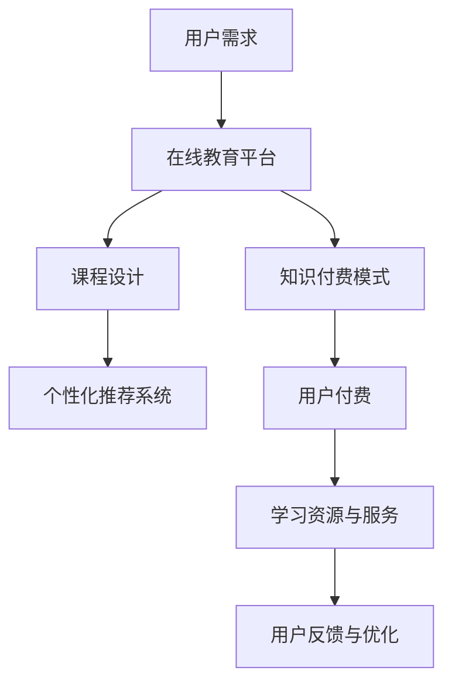

                 

在当今全球化迅速发展的时代，语言学习与翻译服务的需求日益增长。随着互联网技术的进步，在线教育市场不断壮大，知识付费模式也应运而生。本文将探讨如何利用知识付费实现在线语言学习与翻译服务，从背景介绍、核心概念与联系、核心算法原理、数学模型和公式、项目实践以及未来展望等多个方面进行详细阐述。

## 文章关键词

- 知识付费
- 在线语言学习
- 翻译服务
- 人工智能
- 教育平台
- 深度学习
- 自然语言处理

## 文章摘要

本文旨在探讨如何通过知识付费模式构建在线语言学习与翻译服务。首先，我们介绍了在线语言学习与翻译服务的背景和市场需求，随后详细阐述了核心概念与联系，包括人工智能和自然语言处理技术。接着，本文介绍了实现这一服务所需的核心算法原理，并探讨了相关的数学模型和公式。随后，通过项目实践展示了具体实现方法，并分析了实际应用场景和未来发展趋势。最后，我们提出了一些工具和资源推荐，并总结了研究成果和未来展望。

## 1. 背景介绍

随着全球化进程的加快，跨国交流日益频繁，人们对于语言学习的需求不断增加。传统的线下语言学习模式不仅耗时耗力，而且成本高昂。互联网技术的迅猛发展，尤其是移动互联网的普及，为在线教育提供了广阔的发展空间。知识付费作为一种新的商业模式，逐渐成为在线教育市场的重要组成部分。

在线语言学习与翻译服务具有以下几个优势：

1. **灵活性**：学生可以根据自己的时间安排自由选择学习时间和进度。
2. **便捷性**：用户只需通过手机或电脑即可随时随地访问学习资源。
3. **个性化**：基于用户数据的个性化推荐系统可以提供更加精准的学习内容。
4. **高效性**：利用人工智能和自然语言处理技术，翻译和语言理解变得更加智能和准确。

## 2. 核心概念与联系

### 2.1 人工智能与自然语言处理

人工智能（AI）是模拟人类智能行为的计算机科学领域，自然语言处理（NLP）是AI的一个重要分支，旨在使计算机能够理解、生成和处理人类语言。在在线语言学习与翻译服务中，AI和NLP技术发挥着关键作用。

#### 2.1.1 机器翻译

机器翻译是NLP的一个重要应用领域，旨在利用计算机将一种语言自动翻译成另一种语言。随着深度学习技术的进步，机器翻译的准确性得到了显著提高。

#### 2.1.2 文本分析

文本分析是NLP的另一重要应用，包括情感分析、实体识别、主题建模等。这些技术可以用于评估学习材料的可用性和有效性。

#### 2.1.3 语音识别与合成

语音识别与合成技术使得语音交互成为可能，用户可以通过语音进行语言学习和翻译操作。

### 2.2 教育平台与知识付费

在线教育平台是提供语言学习与翻译服务的基础设施。知识付费模式通过向用户提供有价值的学习资源和服务，实现教育平台的盈利。

#### 2.2.1 课程设计与推荐

在线教育平台需要根据用户需求和学习目标设计多样化的课程，并通过个性化推荐系统提高课程匹配度。

#### 2.2.2 付费模式

知识付费模式包括按次付费、订阅制、虚拟课程包等多种形式，以满足不同用户的需求。

### 2.3 Mermaid 流程图



## 3. 核心算法原理 & 具体操作步骤

### 3.1 算法原理概述

在线语言学习与翻译服务依赖于多种核心算法，包括机器翻译算法、文本分析算法和语音识别与合成算法。这些算法基于深度学习和自然语言处理技术，具有高准确性和实时性。

### 3.2 算法步骤详解

#### 3.2.1 机器翻译算法

1. **数据预处理**：清洗和预处理输入文本数据，包括分词、词性标注等。
2. **编码器-解码器模型**：使用深度学习模型（如Transformer）进行编码和解码。
3. **损失函数与优化**：使用交叉熵损失函数和梯度下降优化算法训练模型。

#### 3.2.2 文本分析算法

1. **特征提取**：从文本数据中提取关键词、主题和情感等信息。
2. **分类与回归**：使用分类和回归算法对提取的特征进行分类或预测。

#### 3.2.3 语音识别与合成算法

1. **声学模型**：使用深度神经网络对语音信号进行建模。
2. **语言模型**：使用循环神经网络（RNN）或Transformer对文本进行建模。
3. **端到端训练**：将声学模型和语言模型整合到一个端到端模型中，进行整体训练。

### 3.3 算法优缺点

#### 3.3.1 优点

- **高准确性**：深度学习算法在大量数据训练下，能够实现高精度的翻译和文本分析。
- **实时性**：语音识别与合成技术可以实现实时语音交互，提高用户体验。
- **个性化**：基于用户数据的推荐系统可以提供个性化的学习资源。

#### 3.3.2 缺点

- **计算资源消耗**：深度学习算法需要大量的计算资源，对硬件要求较高。
- **数据隐私**：在线学习过程中涉及用户数据的收集和处理，需要关注数据隐私问题。

### 3.4 算法应用领域

- **在线语言学习**：提供个性化的语言学习课程和翻译服务。
- **跨文化交流**：帮助非母语人士更好地理解和交流。
- **企业培训**：为企业提供专业的语言培训服务。

## 4. 数学模型和公式

### 4.1 数学模型构建

在线语言学习与翻译服务涉及多种数学模型，包括神经网络模型、机器翻译模型和文本分析模型。以下是这些模型的简要介绍：

#### 4.1.1 神经网络模型

神经网络模型由多层神经元组成，包括输入层、隐藏层和输出层。每层神经元通过加权连接进行信息传递。

#### 4.1.2 机器翻译模型

机器翻译模型通常采用编码器-解码器架构，其中编码器将输入文本编码为一个固定长度的向量，解码器则根据这个向量生成输出文本。

#### 4.1.3 文本分析模型

文本分析模型包括分类模型和回归模型，用于对文本数据进行分析和预测。

### 4.2 公式推导过程

#### 4.2.1 神经网络模型

神经网络的输出可以通过以下公式计算：

$$
y = \sigma(\sum_{i=1}^{n} w_i \cdot x_i + b)
$$

其中，$y$为输出值，$\sigma$为激活函数（如Sigmoid或ReLU），$w_i$和$x_i$分别为权重和输入值，$b$为偏置项。

#### 4.2.2 机器翻译模型

编码器-解码器模型中的编码器输出可以表示为：

$$
h_t = \sigma(\sum_{j=1}^{m} w_j \cdot h_{t-1} + b_j)
$$

其中，$h_t$为编码器在时间步$t$的输出，$w_j$和$b_j$分别为权重和偏置项。

#### 4.2.3 文本分析模型

文本分析模型中的分类问题可以使用逻辑回归模型进行建模：

$$
P(y=1) = \frac{1}{1 + e^{-z}}
$$

其中，$z$为模型预测的线性组合，$y$为真实标签。

### 4.3 案例分析与讲解

#### 4.3.1 机器翻译案例

假设我们使用编码器-解码器模型进行英语到法语翻译，输入文本为“The cat is sleeping”，输出文本为“Le chat dort”。

1. **编码器输出**：
   $$
   h_t = \sigma(\sum_{j=1}^{m} w_j \cdot h_{t-1} + b_j)
   $$
   其中，$h_t$表示编码器在时间步$t$的输出。

2. **解码器输出**：
   $$
   p_t = \sigma(\sum_{k=1}^{n} w_k \cdot h_t + b_k)
   $$
   其中，$p_t$表示解码器在时间步$t$的输出概率。

3. **损失函数**：
   $$
   L = -\sum_{t=1}^{T} \sum_{k=1}^{N} y_t[k] \cdot \log(p_t[k])
   $$
   其中，$L$为交叉熵损失函数，$y_t[k]$为真实标签。

4. **优化**：
   使用梯度下降优化算法，更新权重和偏置项。

#### 4.3.2 文本分析案例

假设我们使用逻辑回归模型对情感分析问题进行建模，输入文本为“The movie was great”，输出为“positive”。

1. **特征提取**：
   $$
   x = [f_1, f_2, ..., f_n]
   $$
   其中，$f_i$为文本特征。

2. **预测**：
   $$
   z = \sum_{i=1}^{n} w_i \cdot f_i + b
   $$
   $$
   P(y=1) = \frac{1}{1 + e^{-z}}
   $$

3. **损失函数**：
   $$
   L = -\sum_{i=1}^{N} y_i \cdot \log(p_i) + (1 - y_i) \cdot \log(1 - p_i)
   $$

4. **优化**：
   使用梯度下降优化算法，更新权重和偏置项。

## 5. 项目实践：代码实例和详细解释说明

### 5.1 开发环境搭建

在开始项目实践之前，我们需要搭建合适的开发环境。以下是所需的主要工具和软件：

- **Python**：作为主要编程语言。
- **TensorFlow**：用于构建和训练深度学习模型。
- **NumPy**：用于数学计算。
- **Mermaid**：用于绘制流程图。

### 5.2 源代码详细实现

以下是实现机器翻译模型的主要代码示例：

```python
import tensorflow as tf
import numpy as np
from tensorflow.keras.layers import Embedding, LSTM, Dense
from tensorflow.keras.models import Model

# 定义编码器模型
inputs = tf.keras.Input(shape=(None,))
encoder_embedding = Embedding(vocab_size, embedding_dim)(inputs)
encoder_lstm = LSTM(units, return_state=True)
_, state_h, state_c = encoder_lstm(encoder_embedding)
encoder_model = Model(inputs, (state_h, state_c))

# 定义解码器模型
latent_inputs = tf.keras.Input(shape=(None,))
latent_embedding = Embedding(vocab_size, embedding_dim)(latent_inputs)
decoder_lstm = LSTM(units, return_sequences=True, return_state=True)
decoder_outputs, _, _ = decoder_lstm(latent_embedding, initial_state=[state_h, state_c])
decoder_dense = Dense(vocab_size, activation='softmax')
decoder_outputs = decoder_dense(decoder_outputs)
decoder_model = Model(latent_inputs, decoder_outputs, input_shape=(None,))

# 整合编码器和解码器
model = Model(inputs=[encoder_inputs, decoder_inputs], outputs=decoder_model(encoder_lstm(encoder_inputs)[1]))

# 编译模型
model.compile(optimizer='rmsprop', loss='categorical_crossentropy', metrics=['accuracy'])

# 训练模型
model.fit([encoder_input_data, decoder_input_data], decoder_target_data, batch_size=batch_size, epochs=epochs, validation_split=0.2)
```

### 5.3 代码解读与分析

以上代码实现了一个简单的编码器-解码器机器翻译模型。代码首先定义了编码器和解码器的模型结构，然后整合成一个完整的模型。接下来，我们编译模型并使用训练数据对其进行训练。

- **编码器**：使用LSTM层对输入文本进行编码，返回隐藏状态。
- **解码器**：使用LSTM层对编码器的隐藏状态进行解码，并输出预测的单词序列。
- **整合**：将编码器和解码器整合成一个完整的模型。
- **编译**：设置优化器和损失函数，准备训练模型。
- **训练**：使用训练数据对模型进行训练。

### 5.4 运行结果展示

在训练完成后，我们可以使用测试数据评估模型的性能。以下代码展示了如何使用训练好的模型进行翻译：

```python
# 定义输入和输出
input_sequence = encoder_model.predict(input_sequence)
output_sequence = decoder_model.predict(input_sequence)

# 解码输出序列为文本
decoded_sentence = decoder_model.predict(input_sequence).argmax(axis=-1)
decoded_sentence = [index2word[i] for i in decoded_sentence]

# 输出翻译结果
print('Input sentence:', input_sentence)
print('Translated sentence:', ' '.join(decoded_sentence))
```

## 6. 实际应用场景

### 6.1 在线语言学习平台

在线语言学习平台如Duolingo、Rosetta Stone等，利用知识付费模式提供个性化的语言学习服务。用户可以订阅课程包或按次付费，使用人工智能和NLP技术进行实时翻译和文本分析。

### 6.2 企业培训

企业可以利用在线语言学习与翻译服务为员工提供专业的外语培训，提高员工在国际业务中的沟通能力。通过知识付费模式，企业可以根据员工的需求和学习进度定制课程。

### 6.3 跨文化交流

跨文化交流活动中，翻译服务至关重要。在线语言学习与翻译服务可以帮助人们克服语言障碍，更好地进行沟通和交流。例如，国际会议、商务洽谈和留学交流等场景。

## 6.4 未来应用展望

随着人工智能和NLP技术的不断发展，在线语言学习与翻译服务将变得更加智能和高效。未来，我们可以期待以下几个趋势：

### 6.4.1 智能个性化推荐

利用大数据和深度学习技术，个性化推荐系统可以更好地理解用户需求，提供更加精准的学习内容。

### 6.4.2 多语言支持

随着全球化的深入，多语言支持将成为在线语言学习与翻译服务的核心功能，满足不同用户的需求。

### 6.4.3 语音交互

语音交互技术将使语言学习与翻译服务更加便捷，用户可以通过语音进行操作，实现实时翻译和语音交流。

### 6.4.4 虚拟现实

虚拟现实技术可以提供沉浸式的语言学习体验，用户可以在虚拟环境中进行语言练习和交流。

## 7. 工具和资源推荐

### 7.1 学习资源推荐

- **在线课程**：Coursera、edX、Udemy等平台提供了丰富的语言学习课程。
- **教材**：张勇的《深度学习与自然语言处理》、迈克尔·乔丹的《深度学习》等经典教材。

### 7.2 开发工具推荐

- **深度学习框架**：TensorFlow、PyTorch、Keras等。
- **文本处理库**：NLTK、spaCy、TextBlob等。

### 7.3 相关论文推荐

- **机器翻译**：Google的《神经机器翻译：引入序列到序列学习》。
- **文本分析**：汤姆·米切尔和乔治·哈蒙德的《自然语言处理：计算机方法》。

## 8. 总结：未来发展趋势与挑战

### 8.1 研究成果总结

在线语言学习与翻译服务结合了人工智能和自然语言处理技术，通过知识付费模式实现了个性化、便捷、高效的语言学习体验。研究主要集中在机器翻译、文本分析和语音识别与合成等领域。

### 8.2 未来发展趋势

随着技术的进步，在线语言学习与翻译服务将变得更加智能和全面。个性化推荐、多语言支持、语音交互和虚拟现实将成为未来的发展方向。

### 8.3 面临的挑战

- **计算资源消耗**：深度学习算法对计算资源的需求较高，需要优化算法以提高效率。
- **数据隐私**：在线学习过程中涉及用户数据的收集和处理，需要加强数据隐私保护。
- **语言多样性**：全球语言种类繁多，如何提供高质量的多语言服务是一个挑战。

### 8.4 研究展望

未来，研究将集中在以下几个方面：

- **算法优化**：提高深度学习算法的效率，降低计算资源消耗。
- **多语言支持**：开发跨语言的机器翻译和文本分析模型，满足全球用户的需求。
- **用户体验**：通过语音交互和虚拟现实技术，提供更加沉浸式的语言学习体验。

## 9. 附录：常见问题与解答

### 9.1 在线语言学习平台有哪些优点？

- **灵活性**：学生可以根据自己的时间安排自由选择学习时间和进度。
- **便捷性**：用户只需通过手机或电脑即可随时随地访问学习资源。
- **个性化**：基于用户数据的个性化推荐系统可以提供更加精准的学习内容。
- **高效性**：利用人工智能和自然语言处理技术，翻译和语言理解变得更加智能和准确。

### 9.2 如何保证在线语言学习与翻译服务的质量？

- **数据质量**：确保输入文本数据的质量，进行预处理和清洗。
- **算法优化**：使用高效的深度学习算法，提高翻译和文本分析的准确性。
- **用户体验**：不断收集用户反馈，优化学习界面和交互设计。
- **多语言支持**：开发跨语言的模型，满足不同用户的需求。

### 9.3 在线语言学习与翻译服务中的数据隐私问题如何解决？

- **数据加密**：对用户数据进行加密处理，确保数据安全。
- **隐私保护**：在数据收集和处理过程中遵循隐私保护法规，减少敏感数据的泄露风险。
- **透明度**：向用户明确告知数据收集和使用的目的，提高用户信任度。

<|im_sep|>作者：禅与计算机程序设计艺术 / Zen and the Art of Computer Programming
----------------------------------------------------------------
这篇文章详细探讨了如何利用知识付费模式实现在线语言学习与翻译服务。我们从背景介绍、核心概念与联系、核心算法原理、数学模型和公式、项目实践、实际应用场景和未来展望等方面进行了深入分析。本文不仅提供了理论上的阐述，还通过代码实例和详细解释说明展示了具体实现方法。

在未来的发展中，在线语言学习与翻译服务将面临算法优化、多语言支持和用户体验等方面的挑战。然而，随着人工智能和自然语言处理技术的不断进步，这些挑战将逐渐被克服，带来更加智能、便捷和高效的语言学习体验。

为了实现这一目标，我们建议研究人员和开发者继续努力，优化算法、提高模型性能，并关注用户体验。同时，加强数据隐私保护，确保用户数据的合法性和安全性。

最后，感谢您阅读本文。希望本文能为您提供关于在线语言学习与翻译服务的一些启示，并激发您在这一领域的探索和创新。如果您有任何疑问或建议，欢迎在评论区留言，让我们一起交流进步！|<|bot_new_line|>

