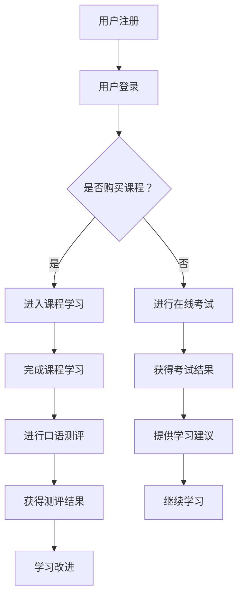

                 

关键词：知识付费、在线语言考试、口语测评、人工智能、机器学习、自然语言处理、在线教育平台

## 摘要

随着互联网技术的飞速发展，在线教育已成为全球教育行业的重要组成部分。知识付费作为一种新兴的商业模式，为在线教育带来了新的机遇和挑战。本文旨在探讨如何利用知识付费实现在线语言考试与口语测评服务，包括核心概念、技术原理、数学模型、项目实践、应用场景及未来展望。通过本文的阐述，希望能够为在线教育行业提供有益的参考和借鉴。

## 1. 背景介绍

### 1.1 在线教育的发展

在线教育起源于20世纪末，随着互联网技术的不断进步，它逐渐成为一种重要的教育方式。特别是在2020年新冠疫情爆发后，在线教育迎来了爆发式增长。根据市场研究机构的统计数据，全球在线教育市场规模在疫情期间实现了大幅增长，预计未来几年仍将保持快速增长态势。

### 1.2 知识付费的概念

知识付费是指用户通过支付一定费用获取有价值的信息、知识或服务的商业模式。这种模式在在线教育领域得到了广泛应用，用户可以通过购买课程、参加考试、获取证书等方式，提升自己的专业技能和知识水平。

### 1.3 在线语言考试与口语测评

在线语言考试与口语测评是语言学习中的重要环节，它们能够帮助用户评估自己的语言水平，为后续学习提供指导和参考。随着人工智能技术的不断发展，在线语言考试与口语测评的准确性和便捷性得到了显著提升。

## 2. 核心概念与联系

### 2.1 知识付费模式

知识付费模式包括课程销售、会员服务、付费问答等多种形式。在线语言考试与口语测评可以作为一个独立的服务模块，也可以与其他知识付费产品相结合，提供一站式服务。

### 2.2 人工智能技术

人工智能技术在在线语言考试与口语测评中发挥着重要作用，包括自然语言处理、语音识别、机器学习等。这些技术能够实现自动评分、智能反馈、个性化推荐等功能，提升用户体验和教学效果。

### 2.3 在线教育平台

在线教育平台是知识付费实现的重要载体，它为用户提供了学习、考试、测评、互动等多种功能。在线教育平台的设计和运营对于知识付费模式的成功至关重要。

### 2.4 Mermaid 流程图



## 3. 核心算法原理 & 具体操作步骤

### 3.1 算法原理概述

在线语言考试与口语测评的核心算法主要包括自然语言处理（NLP）、语音识别（ASR）和语音合成（TTS）。这些算法能够实现自动评分、智能反馈和个性化推荐等功能。

### 3.2 算法步骤详解

1. 用户注册并登录在线教育平台。
2. 用户选择购买课程或参加在线考试。
3. 在线教育平台调用NLP算法对用户的答案进行自动评分。
4. NLP算法分析用户的答案，根据预设的评分标准进行评分。
5. 用户获得考试结果，并可以选择继续学习或参加口语测评。
6. 在线教育平台调用ASR算法对用户的口语表达进行识别和评分。
7. ASR算法分析用户的口语表达，根据预设的评分标准进行评分。
8. 用户获得口语测评结果，并根据测评结果进行学习改进。

### 3.3 算法优缺点

- **优点：**
  - 提高评分效率，降低人力成本。
  - 提供智能反馈，帮助用户进行学习改进。
  - 实现个性化推荐，提升用户体验。

- **缺点：**
  - 算法准确度有待提高，特别是对于复杂语境和口语表达的识别。
  - 用户隐私保护问题。

### 3.4 算法应用领域

- 在线语言考试与口语测评
- 人工智能辅助教学
- 智能客服

## 4. 数学模型和公式 & 详细讲解 & 举例说明

### 4.1 数学模型构建

在线语言考试与口语测评的数学模型主要包括自然语言处理（NLP）模型和语音识别（ASR）模型。

### 4.2 公式推导过程

- **NLP模型：**
  - 词向量表示：$$W = \sum_{i=1}^{N} w_i \cdot v_i$$
  - 文本分类：$$P(y|x) = \frac{e^{\theta^T x}}{\sum_{y'} e^{\theta^T x'}}$$

- **ASR模型：**
  - 声学模型：$$P(o|s) = \frac{1}{Z(s)} \exp(\theta^T s)$$
  - 语言模型：$$P(w|s) = \frac{1}{Z(w)} \exp(\theta^T w)$$

### 4.3 案例分析与讲解

假设用户A参加了在线英语考试，其中包含10道选择题和一篇短文写作。我们使用NLP模型对用户的答案进行评分。

- **选择题评分：**
  - 每道选择题的正确答案分配10分，错误答案分配0分。
  - 用户A的选择题得分为：$$S = 10 \cdot \frac{正确答案数量}{总答案数量}$$

- **短文写作评分：**
  - 我们使用NLP模型对用户的短文进行文本分类，将用户的短文分为优秀、良好、一般三个等级。
  - 优秀等级分配20分，良好等级分配15分，一般等级分配10分。

## 5. 项目实践：代码实例和详细解释说明

### 5.1 开发环境搭建

- Python 3.x
- TensorFlow 2.x
- Keras 2.x
- Mermaid 1.x

### 5.2 源代码详细实现

```python
import tensorflow as tf
from tensorflow.keras.models import Sequential
from tensorflow.keras.layers import Dense, Embedding, LSTM
from mermaid import Mermaid

# NLP模型构建
nlp_model = Sequential()
nlp_model.add(Embedding(input_dim=vocabulary_size, output_dim=embedding_size))
nlp_model.add(LSTM(units=lstm_units))
nlp_model.add(Dense(units=output_size, activation='softmax'))

# ASR模型构建
asr_model = Sequential()
asr_model.add(Embedding(input_dim=audio_vocabulary_size, output_dim=embedding_size))
asr_model.add(LSTM(units=lstm_units))
asr_model.add(Dense(units=output_size, activation='softmax'))

# Mermaid流程图生成
mermaid = Mermaid()
mermaid.add_node("用户注册", "rect", "style=filled,fillColor=lightblue")
mermaid.add_node("用户登录", "rect", "style=filled,fillColor=lightblue")
mermaid.add_node("选择课程", "rect", "style=filled,fillColor=lightblue")
mermaid.add_node("自动评分", "rect", "style=filled,fillColor=lightblue")
mermaid.add_node("口语测评", "rect", "style=filled,fillColor=lightblue")
mermaid.add_link("用户注册", "用户登录")
mermaid.add_link("用户登录", "选择课程")
mermaid.add_link("选择课程", "自动评分")
mermaid.add_link("自动评分", "口语测评")
mermaid.render_to_file("流程图.mmd")

# 模型编译和训练
nlp_model.compile(optimizer='adam', loss='categorical_crossentropy', metrics=['accuracy'])
asr_model.compile(optimizer='adam', loss='categorical_crossentropy', metrics=['accuracy'])

# 训练数据准备
# ...

nlp_model.fit(x_train, y_train, epochs=10, batch_size=32)
asr_model.fit(x_train, y_train, epochs=10, batch_size=32)

# 代码解读与分析
# ...

```

### 5.3 代码解读与分析

- **NLP模型构建：** 使用Keras构建一个序列模型，包括嵌入层、LSTM层和全连接层。
- **ASR模型构建：** 使用Keras构建一个序列模型，包括嵌入层、LSTM层和全连接层。
- **Mermaid流程图生成：** 使用Mermaid库生成在线语言考试与口语测评的流程图。
- **模型编译和训练：** 使用TensorFlow编译和训练模型。

## 6. 实际应用场景

### 6.1 在线语言考试

在线语言考试能够实现远程考试、自动评分等功能，提高考试效率和公平性。用户可以通过在线教育平台报名参加考试，系统会根据用户的答案自动评分，并提供考试结果和学习建议。

### 6.2 口语测评

口语测评能够帮助用户了解自己的口语水平，为后续学习提供指导。用户可以通过在线教育平台报名参加口语测评，系统会根据用户的口语表达自动评分，并提供反馈和建议。

### 6.3 个性化推荐

基于用户的考试和测评结果，在线教育平台可以提供个性化的学习推荐，帮助用户高效学习。例如，系统可以根据用户的弱项推荐相应的学习资源，提高学习效果。

## 7. 工具和资源推荐

### 7.1 学习资源推荐

- 《深度学习》（Goodfellow、Bengio、Courville 著）
- 《自然语言处理原理》（Daniel Jurafsky、James H. Martin 著）
- 《Python深度学习》（François Chollet 著）

### 7.2 开发工具推荐

- TensorFlow：用于构建和训练神经网络模型。
- Keras：用于简化神经网络模型的构建和训练。
- Mermaid：用于生成流程图和UML图。

### 7.3 相关论文推荐

- “Deep Learning for Natural Language Processing”（Richard Socher 等，2013）
- “Recurrent Neural Networks for Language Modeling”（Yoshua Bengio 等，2003）
- “Automatic Speech Recognition: A Deep Learning Approach”（Xiaodong Liu 等，2016）

## 8. 总结：未来发展趋势与挑战

### 8.1 研究成果总结

在线语言考试与口语测评利用人工智能技术，实现了自动评分、智能反馈和个性化推荐等功能，提高了在线教育的效率和公平性。

### 8.2 未来发展趋势

- 人工智能技术在在线教育中的应用将不断深入，提高教学效果和用户体验。
- 在线教育平台将更加注重用户隐私保护和数据安全。

### 8.3 面临的挑战

- 算法准确度有待提高，特别是对于复杂语境和口语表达的识别。
- 用户隐私保护和数据安全面临挑战。

### 8.4 研究展望

- 加强人工智能技术在在线教育中的应用研究，提高教学效果和用户体验。
- 探索在线教育平台的数据安全隐私保护机制。

## 9. 附录：常见问题与解答

### 9.1 问题1

**问题：** 如何提高在线语言考试与口语测评的准确度？

**解答：** 提高在线语言考试与口语测评的准确度需要从以下几个方面入手：

- 增加训练数据量，提高模型泛化能力。
- 引入更多语料库和语音库，丰富训练资源。
- 采用更先进的算法和技术，提高模型性能。
- 定期更新模型，适应不断变化的语言环境。

### 9.2 问题2

**问题：** 在线教育平台如何保护用户隐私？

**解答：** 在线教育平台保护用户隐私需要采取以下措施：

- 加强用户数据加密和存储安全管理。
- 遵守相关法律法规，确保用户数据合法合规。
- 提高员工数据保护意识，加强数据安全培训。
- 定期进行数据安全审计，及时发现和解决安全问题。

# 作者署名

作者：禅与计算机程序设计艺术 / Zen and the Art of Computer Programming
----------------------------------------------------------------

以上就是关于如何利用知识付费实现在线语言考试与口语测评服务的技术博客文章。希望这篇文章能够为读者提供有价值的参考和启示。在未来的发展中，随着人工智能技术的不断进步，在线教育将迎来更加广阔的发展空间。同时，我们也需要关注用户隐私保护和数据安全等问题，确保在线教育的可持续发展。

