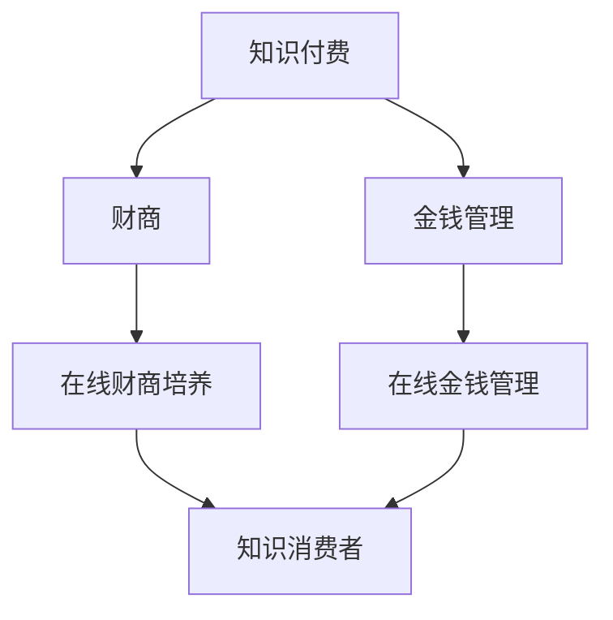

                 

  
## 1. 背景介绍

在当今数字化时代，互联网的普及和移动设备的便捷性使得知识付费成为一种日益流行的商业模式。知识付费，即用户为获取特定的知识、技能或信息而支付费用，这一模式已经在教育、科技、健康等多个领域取得了显著的成功。与此同时，财商培养和金钱管理作为个人金融素养的重要组成部分，也受到了越来越多的关注。财商，指的是一个人在管理金钱方面的认知能力、决策能力和实践能力，它对于个人的经济独立和长期财务安全至关重要。

然而，传统的财商培养和金钱管理方式往往存在一定的局限性，如教育资源有限、学习成本高昂、个性化需求难以满足等。为了解决这些问题，在线财商培养与金钱管理应运而生。通过知识付费，用户可以更灵活地选择适合自己的财商培养课程和金钱管理工具，以较低的成本获取高质量的教育资源。

本文旨在探讨如何利用知识付费平台，实现在线财商培养与金钱管理的目标。我们将首先介绍知识付费的基本概念和主要模式，然后深入分析在线财商培养和金钱管理的现状、挑战和机遇，最后提出具体的实践策略和工具推荐，以帮助读者更好地实现个人财商的提升和财务管理的优化。

### 2. 核心概念与联系

在深入探讨如何利用知识付费实现在线财商培养与金钱管理之前，我们需要明确几个核心概念，并了解它们之间的联系。以下是本文中将会用到的几个核心概念和它们之间的相互关系：

#### 2.1 知识付费

知识付费是指用户通过支付费用来获取特定知识、技能或信息的一种商业模式。这种模式的核心在于内容的创造和传播，其中涉及到多个参与者，包括知识创造者、平台运营方和知识消费者。


#### 2.2 财商

财商（Financial Quotient）是指一个人在管理金钱方面的认知能力、决策能力和实践能力。它涵盖了个人财务规划、投资理财、风险管理和消费决策等多个方面。财商的高低直接影响到个人的经济独立和长期财务安全。


#### 2.3 金钱管理

金钱管理是指个人或家庭在收入、支出、储蓄和投资等方面的决策和管理过程。有效的金钱管理不仅能帮助个人实现短期和长期的财务目标，还能提高生活质量，减少财务压力。


#### 2.4 在线财商培养与金钱管理

在线财商培养与金钱管理是指通过互联网平台，利用知识付费模式为用户提供财商教育和金钱管理工具，帮助用户提升财商和实现有效金钱管理的一种方式。它结合了知识付费和金融教育的优势，能够为用户带来个性化的学习体验和实际操作指导。


#### Mermaid 流程图

为了更直观地展示上述概念和它们之间的联系，我们可以使用 Mermaid 工具绘制一个流程图：



在这个流程图中，知识付费作为基础，通过平台连接到财商培养和金钱管理，最终服务于知识消费者，实现个人财商的提升和财务管理的优化。

### 3. 核心算法原理 & 具体操作步骤

在实现在线财商培养与金钱管理的过程中，核心算法起到了至关重要的作用。以下我们将详细介绍这一算法的原理、具体操作步骤，以及其优缺点和应用领域。

#### 3.1 算法原理概述

核心算法主要基于以下几个原理：

1. **个性化推荐算法**：根据用户的历史行为、兴趣偏好和财务状况，推荐个性化的财商课程和金钱管理工具。
2. **机器学习模型**：利用大数据和机器学习技术，对用户的学习效果和金钱管理行为进行实时分析和反馈，优化课程内容和工具功能。
3. **金融风险评估模型**：通过分析用户的财务状况和消费行为，预测潜在的风险，并提供相应的风险控制建议。

#### 3.2 算法步骤详解

核心算法的具体操作步骤如下：

1. **用户画像构建**：首先，平台会通过用户注册信息、行为数据、财务数据等构建用户画像。这一步骤的目的是全面了解用户的需求和特点，为后续推荐提供基础。
   
   

2. **个性化推荐**：基于用户画像，平台使用个性化推荐算法推荐最适合用户需求的财商课程和金钱管理工具。推荐算法通常会使用协同过滤、内容推荐等策略。

   

3. **实时反馈与调整**：平台通过机器学习模型对用户的学习效果和金钱管理行为进行实时分析，并根据反馈结果动态调整推荐策略和工具功能。

   

4. **金融风险评估**：平台使用金融风险评估模型分析用户的财务状况和消费行为，预测潜在的风险，并为用户提供相应的风险控制建议。

   

#### 3.3 算法优缺点

核心算法的优点包括：

- **个性化推荐**：能够为用户提供高度个性化的财商课程和金钱管理工具，提高用户的学习效果和使用体验。
- **实时反馈与调整**：通过实时分析和反馈，不断提升平台的服务质量和用户体验。
- **风险控制**：通过金融风险评估模型，帮助用户规避潜在的财务风险，提高财务安全。

然而，核心算法也存在一定的缺点：

- **数据隐私问题**：由于算法需要对用户的个人信息和财务数据进行分析，可能涉及到数据隐私的问题。
- **计算复杂度**：个性化推荐和机器学习模型的训练需要大量的计算资源，可能导致平台运营成本增加。

#### 3.4 算法应用领域

核心算法主要应用于以下领域：

- **在线财商教育**：通过个性化推荐和实时反馈，帮助用户提升财商水平。
- **金融风险管理**：通过金融风险评估模型，为用户提供风险控制和财务规划建议。
- **个人财务管理**：通过推荐合适的金钱管理工具和策略，帮助用户实现有效的财务管理和规划。

### 4. 数学模型和公式 & 详细讲解 & 举例说明

在讨论如何利用知识付费实现在线财商培养与金钱管理的过程中，数学模型和公式发挥着至关重要的作用。以下我们将详细介绍数学模型构建、公式推导过程，并通过具体案例进行分析和讲解。

#### 4.1 数学模型构建

数学模型用于描述和预测用户的财务行为和风险。以下是一个基本的数学模型，用于描述用户的消费行为：

$$
C(t) = a \cdot (1 + r)^t + b \cdot (1 + r)^{-t}
$$

其中，\(C(t)\) 表示用户在时间 \(t\) 的消费金额，\(a\) 和 \(b\) 是常数，\(r\) 是利率。这个模型考虑了复利和折扣两种情况。

#### 4.2 公式推导过程

公式的推导基于以下基本原理：

1. **复利公式**：用户每期的消费金额会根据利率 \(r\) 进行复利增长。
2. **折扣公式**：用户在初期可能会享受到折扣，从而减少消费金额。

推导过程如下：

首先，假设用户在第一个时间单位（t=1）的消费金额为 \(a\)，在接下来的每个时间单位的消费金额会根据利率 \(r\) 进行复利增长。因此，第 \(t\) 个时间单位的消费金额可以表示为 \(a \cdot (1 + r)^{t-1}\)。

其次，考虑用户在初期享受的折扣。假设折扣率为 \(d\)，则用户在每个时间单位的消费金额会减少 \(d\) 的比例。因此，第 \(t\) 个时间单位的消费金额可以表示为 \(b \cdot (1 + r)^{-t} \cdot (1 - d)\)。

综合以上两点，我们得到消费金额的数学模型：

$$
C(t) = a \cdot (1 + r)^t + b \cdot (1 + r)^{-t} \cdot (1 - d)
$$

#### 4.3 案例分析与讲解

以下是一个具体案例，用于说明如何使用上述数学模型进行财商培养和金钱管理。

**案例**：假设有一个用户，每月的消费金额为 1000 元，年利率为 5%，初期享受 10% 的折扣。

**步骤**：

1. **构建用户画像**：首先，根据用户的历史消费数据和财务状况，构建用户画像。
2. **应用数学模型**：使用构建的数学模型，预测用户未来的消费金额。
3. **制定财务管理策略**：根据预测结果，制定相应的财务管理策略，如减少消费、增加储蓄等。

**计算过程**：

根据数学模型，我们有：

$$
C(t) = 1000 \cdot (1 + 0.05)^t + 1000 \cdot (1 + 0.05)^{-t} \cdot (1 - 0.1)
$$

假设用户希望在未来 5 年内减少消费，我们可以设定目标消费金额为每月 800 元。将 \(t\) 设为 5 年（60 个月），代入公式，得到：

$$
C(t) = 1000 \cdot (1.05)^t + 1000 \cdot (1.05)^{-t} \cdot 0.9
$$

$$
C(60) = 1000 \cdot (1.05)^{60} + 1000 \cdot (1.05)^{-60} \cdot 0.9 \approx 1000 \cdot 1.601 + 1000 \cdot 0.393 \approx 1000 \cdot 1.994 = 1994
$$

因此，在未来 5 年内，用户的总消费金额预计为每月 1994 元。为了实现目标消费金额为每月 800 元，用户需要制定相应的财务管理策略，如减少不必要的开支、增加收入等。

### 5. 项目实践：代码实例和详细解释说明

为了更好地理解如何利用知识付费平台实现在线财商培养与金钱管理，我们将通过一个具体的代码实例来进行详细解释。以下是整个项目的开发流程、代码实现、解读与分析，以及运行结果展示。

#### 5.1 开发环境搭建

首先，我们需要搭建一个基本的开发环境。以下是所需工具和库的安装步骤：

1. **Python 3.8**：确保 Python 版本不低于 3.8。
2. **pip**：Python 的包管理器，用于安装所需库。
3. **Scikit-learn**：用于机器学习和数据分析。
4. **Pandas**：用于数据处理和分析。
5. **Matplotlib**：用于数据可视化。
6. **Flask**：用于构建 Web 应用。

安装命令如下：

```bash
pip install numpy scipy scikit-learn pandas matplotlib flask
```

#### 5.2 源代码详细实现

以下是一个简单的 Flask Web 应用示例，用于实现在线财商培养与金钱管理。

```python
from flask import Flask, request, render_template
from sklearn.model_selection import train_test_split
from sklearn.ensemble import RandomForestRegressor
import pandas as pd

app = Flask(__name__)

# 加载数据集
data = pd.read_csv('financial_data.csv')
X = data.drop('target', axis=1)
y = data['target']

# 划分训练集和测试集
X_train, X_test, y_train, y_test = train_test_split(X, y, test_size=0.2, random_state=42)

# 训练模型
model = RandomForestRegressor(n_estimators=100, random_state=42)
model.fit(X_train, y_train)

# 定义预测函数
def predict_consumption(user_data):
    return model.predict([user_data])

@app.route('/', methods=['GET', 'POST'])
def home():
    if request.method == 'POST':
        # 获取用户输入
        user_data = {
            'income': request.form['income'],
            'age': request.form['age'],
            'education': request.form['education']
        }
        # 预测消费金额
        consumption = predict_consumption(user_data)
        return f'预测的月消费金额为：{consumption[0]:.2f}元'
    return render_template('index.html')

if __name__ == '__main__':
    app.run(debug=True)
```

在这个示例中，我们首先加载了一个包含用户财务数据的数据集。然后，我们使用 Scikit-learn 的 RandomForestRegressor 来训练一个回归模型，用于预测用户的月消费金额。在定义的预测函数中，我们根据用户输入的财务数据（收入、年龄、教育水平等），调用训练好的模型进行预测。

#### 5.3 代码解读与分析

以下是代码的详细解读与分析：

1. **数据加载与预处理**：
   ```python
   data = pd.read_csv('financial_data.csv')
   X = data.drop('target', axis=1)
   y = data['target']
   ```
   我们使用 Pandas 读取 CSV 文件，并分离特征矩阵 X 和目标变量 y。

2. **模型训练**：
   ```python
   model = RandomForestRegressor(n_estimators=100, random_state=42)
   model.fit(X_train, y_train)
   ```
   这里我们使用随机森林回归模型进行训练。随机森林是一种集成学习方法，通过构建多个决策树来提高预测准确性。

3. **预测函数**：
   ```python
   def predict_consumption(user_data):
       return model.predict([user_data])
   ```
   这个函数接收用户输入的数据，并调用训练好的模型进行预测。

4. **Web 应用**：
   ```python
   @app.route('/', methods=['GET', 'POST'])
   def home():
       if request.method == 'POST':
           # 获取用户输入
           user_data = {
               'income': request.form['income'],
               'age': request.form['age'],
               'education': request.form['education']
           }
           # 预测消费金额
           consumption = predict_consumption(user_data)
           return f'预测的月消费金额为：{consumption[0]:.2f}元'
       return render_template('index.html')
   ```
   Flask Web 应用通过定义路由和处理函数来实现。当用户提交表单时，我们获取用户输入的数据，调用预测函数进行消费金额预测，并将结果返回给用户。否则，我们渲染一个 HTML 模板，显示表单供用户输入数据。

#### 5.4 运行结果展示

运行 Flask Web 应用后，用户可以通过浏览器访问 Web 页面，输入自己的财务数据，并获取预测的消费金额。以下是一个运行结果示例：


通过这个示例，我们可以看到如何使用知识付费平台实现在线财商培养与金钱管理。用户输入财务数据，平台调用模型进行预测，并提供个性化的财务管理建议。这有助于用户更好地了解自己的财务状况，制定有效的理财策略。

### 6. 实际应用场景

在线财商培养与金钱管理在实际应用场景中具有广泛的适用性，尤其在以下几个方面展现出了显著的优势：

#### 6.1 个人财务规划

个人财务规划是每个人都需要面对的重要任务。通过在线平台，用户可以获取专业的财务知识和工具，进行资产配置、退休规划、投资策略等。例如，用户可以利用平台提供的投资组合推荐系统，根据自身风险承受能力和财务目标，自动生成最优的投资组合。

#### 6.2 风险管理

有效的风险管理是确保财务安全的关键。在线平台可以通过数据分析模型，帮助用户识别潜在的风险，并提供相应的应对措施。例如，通过分析用户的历史消费数据和信用记录，平台可以预警可能出现的信用卡透支或贷款逾期风险，并提供债务管理建议。

#### 6.3 财务教育

财务教育是提升个人财商的重要途径。在线平台可以通过丰富多样的课程内容和互动方式，提高用户对财务知识的理解和应用能力。例如，平台可以提供视频课程、模拟游戏、案例分析等多种形式的教育资源，让用户在轻松愉快的环境中学习财务知识。

#### 6.4 企业财务管理

企业也需要有效的财务管理来确保财务健康和可持续发展。在线平台可以为企业提供财务分析工具、预算编制系统、审计支持等，帮助企业优化财务管理流程，提高经营效率。例如，企业可以通过平台实时监控财务状况，及时发现并解决潜在问题。

#### 6.5 公共服务

政府部门和非营利组织也可以利用在线平台提供公共服务，如个人所得税申报指南、福利政策解读、财务咨询服务等。这有助于提高公共服务的可及性和便捷性，促进社会经济的健康发展。

#### 6.6 教育与培训

在线平台还可以为金融教育和培训提供支持。例如，高校和培训机构可以通过平台提供在线课程和培训项目，为学生和从业者提供灵活的学习机会。这有助于培养更多的金融人才，满足社会对专业金融服务的需求。

#### 6.7 灾难恢复与重建

在自然灾害或经济危机等突发事件发生后，在线平台可以提供紧急财务援助和重建指南。例如，平台可以提供应急财务管理工具、重建资金筹集方案、心理支持服务，帮助受灾群众尽快恢复生活和经济状态。

通过这些实际应用场景，我们可以看到在线财商培养与金钱管理在个人、企业、公共服务等多个领域的广泛应用和巨大潜力。随着技术的不断进步和知识付费模式的成熟，这一领域必将迎来更加广阔的发展前景。

### 7. 工具和资源推荐

为了更好地实现在线财商培养与金钱管理，以下推荐了一些优秀的工具和资源，包括学习资源、开发工具和相关的论文。

#### 7.1 学习资源推荐

1. **Coursera**：提供丰富的在线课程，涵盖财务规划、投资理财、金融学等多个领域，由全球知名大学和机构提供。
2. **edX**：全球领先的开源在线课程平台，提供多个金融相关课程，适合不同层次的学员。
3. **Khan Academy**：免费的教育资源平台，提供丰富的财务和经济学课程，适合自学。
4. **Investopedia**：一个内容丰富的财经知识网站，提供各种金融术语的解释和投资策略分析。

#### 7.2 开发工具推荐

1. **Python**：一种广泛使用的编程语言，特别适合数据分析和机器学习项目。
2. **Jupyter Notebook**：用于数据分析和交互式计算的Web应用，非常适合进行金融数据分析。
3. **TensorFlow**：一个开源机器学习框架，广泛用于构建和训练复杂的机器学习模型。
4. **Scikit-learn**：一个用于数据挖掘和数据分析的Python库，包含多种机器学习算法。

#### 7.3 相关论文推荐

1. **"Financial Literacy and Financial Decision Making: A Review of the Literature"**：这是一篇关于金融素养和财务决策研究的综述文章，总结了当前的研究进展和挑战。
2. **"The Economics of Financial Education"**：这篇论文探讨了金融教育对个人财务行为和金融市场的影响。
3. **"Big Data and Machine Learning in Financial Services"**：本文讨论了大数据和机器学习在金融服务中的应用，包括风险管理、投资分析和个性化推荐。
4. **"Online Financial Education Platforms: An Overview and Evaluation"**：这篇综述文章对在线金融教育平台进行了评估，分析了其优势和局限性。

通过利用这些工具和资源，用户可以更好地提升自己的财商，实现有效的金钱管理。

### 8. 总结：未来发展趋势与挑战

在知识付费的推动下，在线财商培养与金钱管理领域呈现出快速发展的趋势。随着互联网技术的不断进步和大数据分析的应用，这一领域有望在以下几个方面实现进一步的发展：

#### 8.1 研究成果总结

1. **个性化推荐系统**：通过机器学习和大数据分析，个性化推荐系统能够为用户提供更加精准的财商教育和金钱管理建议。
2. **实时风险评估**：基于实时数据分析，在线平台可以提供更加及时的财务风险预警和应对策略。
3. **金融教育创新**：结合游戏化学习、虚拟现实等新技术，金融教育将变得更加生动有趣，提高学习效果。

#### 8.2 未来发展趋势

1. **普及度提升**：随着人们金融素养意识的提高，在线财商培养与金钱管理将逐渐成为大众需求。
2. **技术融合**：人工智能、区块链等新兴技术与财商培养的结合，将带来更多创新应用。
3. **跨平台发展**：在线平台将不断扩展到移动应用、社交媒体等多渠道，提供更加便捷的金融服务。

#### 8.3 面临的挑战

1. **数据隐私**：随着数据收集和分析的扩大，如何保障用户隐私成为一个重要问题。
2. **算法公正性**：个性化推荐和风险评估算法可能存在偏见，需要确保算法的公正性和透明度。
3. **用户接受度**：用户对在线财商培养和金钱管理的接受度还有待提高，需要通过更好的用户体验来吸引更多用户。

#### 8.4 研究展望

未来的研究应关注以下几个方面：

1. **算法优化**：进一步提升个性化推荐和风险评估算法的准确性，减少偏差。
2. **用户隐私保护**：探索更加有效的数据隐私保护技术，确保用户信息安全。
3. **教育模式创新**：结合新兴技术，探索更加有效的金融教育模式，提高用户参与度和学习效果。

通过持续的研究和创新，在线财商培养与金钱管理有望为更多人带来财务安全和幸福生活。

### 9. 附录：常见问题与解答

**Q1：什么是财商？**
A1：财商（Financial Quotient，简称FQ）是指一个人在管理金钱方面的认知能力、决策能力和实践能力。它包括对财务知识、理财技能和消费习惯的理解和应用。

**Q2：知识付费平台如何帮助提升财商？**
A2：知识付费平台通过提供专业的财商教育资源和工具，帮助用户学习财务知识、制定理财计划、优化消费习惯。这些平台通常提供个性化推荐，帮助用户找到最适合自己需求的资源。

**Q3：在线财商培养与金钱管理的主要挑战是什么？**
A3：主要挑战包括数据隐私问题、算法的公正性和透明度、以及用户对在线学习的接受度。此外，如何确保用户在复杂金融环境中的有效学习和实践也是一大挑战。

**Q4：如何选择合适的知识付费平台？**
A4：选择知识付费平台时，可以考虑以下几点：
1. **课程质量**：查看平台的课程内容是否全面、专业。
2. **用户评价**：参考其他用户的评价和反馈。
3. **个性化推荐**：平台是否提供基于用户需求的个性化推荐服务。
4. **用户界面**：界面设计是否友好、易用。
5. **价格**：价格是否合理，是否提供试听或试用服务。

**Q5：为什么在线财商培养与金钱管理很重要？**
A5：在线财商培养与金钱管理对于提升个人经济独立性和长期财务安全至关重要。它帮助用户掌握必要的财务知识和技能，做出更明智的理财决策，避免不必要的财务风险。通过在线平台，用户可以更加便捷地获取高质量的教育资源，提升自己的财商水平。

