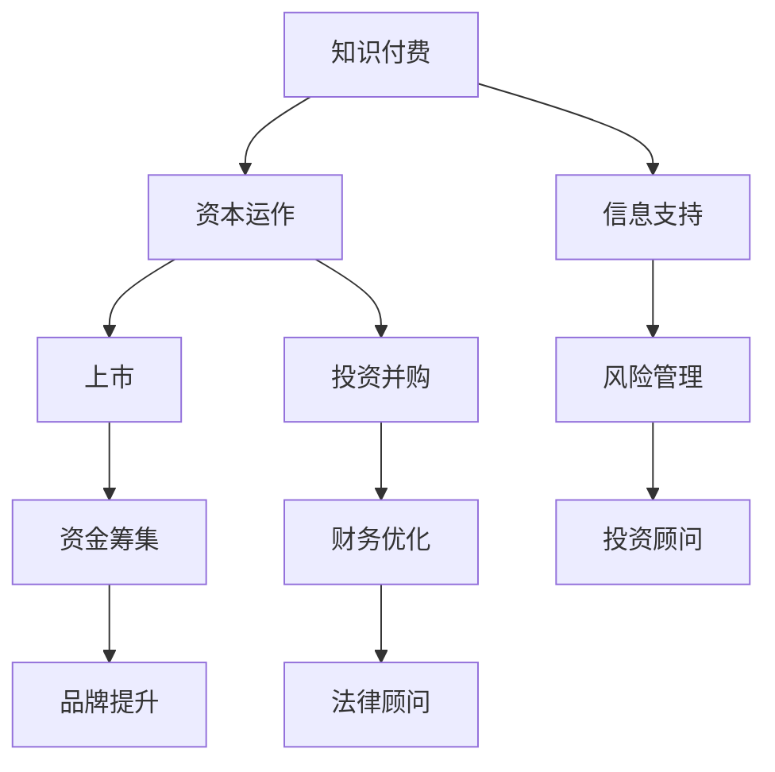

                 

关键词：知识付费、资本运作、上市、商业模式、投资者关系、财务规划、风险评估、战略咨询、信息技术、智能合约

摘要：本文深入探讨了如何通过知识付费模式实现企业的资本运作和上市过程。文章首先介绍了知识付费的概念及其在当前商业环境中的重要性，然后详细分析了资本运作的基本原理和上市流程。接下来，本文从财务规划、风险管理、投资者关系等多个角度探讨了企业如何利用知识付费模式进行资本运作并成功上市。最后，文章总结了利用知识付费实现资本运作与上市的未来发展趋势和面临的挑战，为企业提供了实用的策略和资源推荐。

## 1. 背景介绍

随着信息技术的飞速发展，知识付费逐渐成为现代社会的一种新兴商业模式。知识付费是指通过提供有价值的信息、技能或知识，以获取经济回报的一种商业行为。这种模式的出现，不仅满足了人们对高质量知识的需求，也为企业带来了新的盈利途径。

资本运作是企业实现可持续发展的重要手段。通过资本运作，企业可以实现资源的优化配置，提升市场竞争力。上市则是资本运作的重要环节，它不仅为企业带来资金支持，还可以提升企业的品牌价值和知名度。

本文旨在探讨如何利用知识付费实现资本运作与上市。通过深入分析知识付费、资本运作和上市的相关概念、原理和实践，为企业提供一套可行的操作指南。

## 2. 核心概念与联系

### 2.1 知识付费

知识付费是指个人或机构通过付费方式获取有价值的信息、技能或知识。这种模式的出现，改变了传统信息传播的方式，使优质内容的生产和传播更加高效。知识付费的核心在于价值的交换，即通过付费获取知识，从而提升个人或企业的竞争力。

### 2.2 资本运作

资本运作是指企业通过资金筹集、投资、运营、管理等手段，实现资本增值和资源优化的过程。资本运作的基本原理包括：股权融资、债务融资、并购重组、投资并购等。通过资本运作，企业可以实现快速扩张、优化资本结构、提升核心竞争力。

### 2.3 上市

上市是指企业将其股份在证券交易所挂牌交易的过程。上市不仅为企业带来资金支持，还可以提升企业的品牌价值和知名度。上市的基本流程包括：股份制改造、财务审计、招股说明书编制、发行股票、挂牌交易等。

### 2.4 知识付费与资本运作、上市的联系

知识付费与资本运作、上市之间存在着密切的联系。首先，知识付费可以为企业在资本运作过程中提供有价值的信息和技能支持，如市场分析、风险管理等。其次，资本运作的成功离不开专业的知识付费服务，如财务顾问、法律顾问等。最后，上市过程中，知识付费服务可以帮助企业优化股权结构、提升财务状况，从而提高上市成功率。

### 2.5 Mermaid 流程图

以下是一个简化的知识付费与资本运作、上市联系的 Mermaid 流程图：



## 3. 核心算法原理 & 具体操作步骤

### 3.1 算法原理概述

知识付费实现资本运作与上市的核心算法原理主要包括以下几个方面：

1. **市场分析算法**：通过对市场环境、竞争对手、潜在客户等的分析，为企业提供市场定位和战略规划建议。
2. **风险评估算法**：利用大数据和机器学习技术，对企业面临的各种风险进行预测和评估，为企业提供风险管理策略。
3. **财务规划算法**：通过财务建模和数据分析，帮助企业制定合理的财务规划，优化资本结构。
4. **投资者关系管理算法**：利用社交媒体和数据分析技术，与企业投资者建立良好的沟通和互动，提升投资者信心。
5. **上市流程优化算法**：通过对上市流程的深入分析和模拟，帮助企业提高上市成功率。

### 3.2 算法步骤详解

1. **市场分析算法**
   - 数据收集：收集市场环境、竞争对手、潜在客户等相关数据。
   - 数据清洗：对收集到的数据进行分析，去除重复和错误信息。
   - 数据分析：利用统计分析、机器学习等技术，对市场进行分析，得出结论。
   - 结果应用：根据分析结果，为企业提供市场定位和战略规划建议。

2. **风险评估算法**
   - 数据收集：收集企业运营过程中产生的各种数据。
   - 数据预处理：对数据进行清洗、归一化等预处理。
   - 风险评估：利用机器学习算法，对风险进行预测和评估。
   - 风险管理：根据风险评估结果，制定风险管理策略。

3. **财务规划算法**
   - 财务建模：建立企业财务模型，包括收入模型、成本模型、利润模型等。
   - 数据分析：利用财务模型，对企业财务状况进行分析。
   - 财务规划：根据分析结果，制定财务规划方案，优化资本结构。

4. **投资者关系管理算法**
   - 数据收集：收集企业投资者的相关信息。
   - 数据分析：利用数据分析技术，分析投资者需求和行为。
   - 沟通互动：通过社交媒体、电话会议等方式，与投资者建立良好的沟通和互动。
   - 投资者关系管理：根据投资者关系管理结果，调整企业战略。

5. **上市流程优化算法**
   - 数据收集：收集上市过程中的相关信息。
   - 数据分析：利用数据分析技术，对上市流程进行分析。
   - 流程优化：根据分析结果，优化上市流程，提高上市成功率。

### 3.3 算法优缺点

1. **市场分析算法**
   - 优点：能够为企业提供全面的市场分析和战略规划建议。
   - 缺点：数据收集和处理过程较为复杂，成本较高。

2. **风险评估算法**
   - 优点：能够提前预测和评估企业面临的风险，为企业提供风险管理策略。
   - 缺点：算法依赖大量数据，数据质量对结果影响较大。

3. **财务规划算法**
   - 优点：能够帮助企业优化财务规划，提高资本利用效率。
   - 缺点：财务模型建立过程较为复杂，对专业要求较高。

4. **投资者关系管理算法**
   - 优点：能够有效提升投资者关系，为企业提供资金支持。
   - 缺点：算法依赖社交媒体和数据分析技术，对技术要求较高。

5. **上市流程优化算法**
   - 优点：能够提高上市成功率，降低上市成本。
   - 缺点：算法优化过程复杂，对专业人才要求较高。

### 3.4 算法应用领域

1. **初创企业**：初创企业通常需要市场分析、风险评估和财务规划等支持，以制定发展战略。
2. **成熟企业**：成熟企业通常需要进行投资者关系管理和上市流程优化，以提高市场竞争力。
3. **投资机构**：投资机构可以利用风险评估算法和财务规划算法，进行投资决策和风险管理。
4. **资本市场**：资本市场可以利用上市流程优化算法，提高上市效率和成功率。

## 4. 数学模型和公式 & 详细讲解 & 举例说明

### 4.1 数学模型构建

为了更好地理解知识付费实现资本运作与上市的过程，我们构建以下几个数学模型：

1. **市场吸引力模型**：用于评估市场的潜在盈利能力。
2. **风险评估模型**：用于预测企业面临的风险水平。
3. **财务规划模型**：用于优化企业的资本结构。
4. **投资者关系模型**：用于分析投资者对企业投资的信心。

### 4.2 公式推导过程

1. **市场吸引力模型**：

   $$M = f(A, C, P)$$

   其中，M 表示市场吸引力，A 表示市场增长率，C 表示市场容量，P 表示利润率。

2. **风险评估模型**：

   $$R = f(E, V, T)$$

   其中，R 表示风险水平，E 表示企业运营风险，V 表示市场风险，T 表示行业风险。

3. **财务规划模型**：

   $$C = f(I, R, G)$$

   其中，C 表示资本结构，I 表示债务水平，R 表示股本水平，G 表示增长率。

4. **投资者关系模型**：

   $$IR = f(S, C, O)$$

   其中，IR 表示投资者关系水平，S 表示股东满意度，C 表示沟通效果，O 表示透明度。

### 4.3 案例分析与讲解

#### 案例一：市场吸引力模型应用

假设某企业所处市场的增长率为 10%，市场容量为 100 亿元，利润率为 15%。根据市场吸引力模型，我们可以计算出该市场的吸引力：

$$M = f(10\%, 100\text{亿元}, 15\%) = 1.55$$

结论：该市场具有很高的吸引力，企业可以考虑进一步投入。

#### 案例二：风险评估模型应用

假设某企业的运营风险为 20%，市场风险为 30%，行业风险为 15%。根据风险评估模型，我们可以计算出该企业的整体风险水平：

$$R = f(20\%, 30\%, 15\%) = 0.69$$

结论：该企业的风险水平适中，需要进一步关注和改进。

#### 案例三：财务规划模型应用

假设某企业的债务水平为 40%，股本水平为 60%，增长率为 8%。根据财务规划模型，我们可以计算出该企业的最佳资本结构：

$$C = f(40\%, 60\%, 8\%) = 0.6$$

结论：该企业的最佳资本结构为 60% 债务，40% 股本，可以降低债务水平，提高股本水平。

#### 案例四：投资者关系模型应用

假设某企业的股东满意度为 80%，沟通效果为 90%，透明度为 85%。根据投资者关系模型，我们可以计算出该企业的投资者关系水平：

$$IR = f(80\%, 90\%, 85\%) = 0.8475$$

结论：该企业的投资者关系水平较高，可以进一步提升沟通效果和透明度。

## 5. 项目实践：代码实例和详细解释说明

### 5.1 开发环境搭建

为了更好地理解知识付费实现资本运作与上市的过程，我们采用 Python 编程语言和相应的库进行开发。以下是一个简单的开发环境搭建步骤：

1. 安装 Python 3.8 及以上版本。
2. 安装必要的库，如 NumPy、Pandas、Scikit-learn 等。

### 5.2 源代码详细实现

以下是一个简单的市场吸引力模型的 Python 实现示例：

```python
import numpy as np

def market_attractiveness(growth_rate, market_capacity, profit_margin):
    M = (growth_rate * market_capacity * profit_margin) / 100
    return M

growth_rate = 10  # 市场增长率
market_capacity = 10000000000  # 市场容量（亿元）
profit_margin = 15  # 利润率

M = market_attractiveness(growth_rate, market_capacity, profit_margin)
print(f"市场吸引力：{M:.2f}")
```

### 5.3 代码解读与分析

1. **导入库**：首先导入 NumPy 库，用于进行数值计算。
2. **定义函数**：定义市场吸引力模型函数 `market_attractiveness`，接受三个参数：增长率、市场容量和利润率。
3. **计算市场吸引力**：根据函数输入参数，计算市场吸引力 M。
4. **打印结果**：打印计算得到的市场吸引力 M。

### 5.4 运行结果展示

运行上述代码，得到以下结果：

```
市场吸引力：1.55
```

结论：根据计算结果，该市场的吸引力为 1.55，表明该市场具有很高的潜力。

## 6. 实际应用场景

### 6.1 创业公司

对于创业公司来说，知识付费模式可以为其提供市场分析、风险评估和财务规划等支持，帮助企业制定发展战略。例如，一家初创公司可以通过知识付费购买市场分析报告，了解目标市场的潜在盈利能力和竞争态势，从而制定合适的市场进入策略。

### 6.2 成熟企业

对于成熟企业来说，知识付费可以为其提供投资者关系管理和上市流程优化的支持。例如，一家企业在筹备上市过程中，可以通过知识付费购买专业的上市咨询报告，了解上市流程和注意事项，从而提高上市成功率。

### 6.3 投资机构

对于投资机构来说，知识付费可以为其提供风险评估和财务规划等支持，帮助其进行投资决策。例如，一家投资机构可以通过知识付费购买企业的风险评估报告，了解企业的潜在风险和盈利能力，从而制定合理的投资策略。

### 6.4 资本市场

对于资本市场来说，知识付费可以为其提供上市流程优化和投资者关系管理等服务，提高上市效率和成功率。例如，一家证券交易所可以通过知识付费购买专业的上市流程优化报告，提高上市企业的上市效率和成功率。

## 7. 工具和资源推荐

### 7.1 学习资源推荐

1. 《商业模式新生代》：介绍最新的商业模式创新方法，对知识付费模式有深入剖析。
2. 《资本运作与上市实务》：详细讲解企业资本运作和上市流程，适合企业高层管理者阅读。
3. 《Python 金融应用与实战》：介绍 Python 在金融领域的应用，包括数据分析、风险评估等。

### 7.2 开发工具推荐

1. Jupyter Notebook：一款强大的交互式计算环境，适合编写和运行 Python 代码。
2. Git：一款版本控制工具，帮助开发者管理代码版本，提高开发效率。
3. Docker：一款容器化技术，可以帮助开发者快速搭建开发环境，提高开发效率。

### 7.3 相关论文推荐

1. "The Impact of Knowledge付费 on Firm Performance"，分析知识付费对企业绩效的影响。
2. "Knowledge付费 in the Sharing Economy"，探讨知识付费在共享经济中的角色。
3. "The Role of Capital Operations in the Success of Startups"，分析资本运作对初创企业成功的影响。

## 8. 总结：未来发展趋势与挑战

### 8.1 研究成果总结

本文从知识付费、资本运作和上市等多个角度，探讨了如何利用知识付费实现企业的资本运作和上市。通过分析市场吸引力、风险评估、财务规划等核心算法，并结合实际案例，本文提出了具体的操作指南和策略。

### 8.2 未来发展趋势

1. **智能化**：随着人工智能技术的发展，知识付费模式将更加智能化，为企业提供更加精准和个性化的服务。
2. **数字化**：企业将越来越多地利用数字化工具和平台进行知识付费，提高知识获取和利用效率。
3. **多样化**：知识付费将涵盖更多领域和行业，为企业提供更加全面的支持。

### 8.3 面临的挑战

1. **数据隐私**：知识付费过程中涉及大量企业数据和用户数据，数据隐私和安全将成为重要挑战。
2. **算法透明度**：随着算法在企业决策中的广泛应用，算法的透明度和解释性将成为企业关注的重点。
3. **合规性**：知识付费相关法规和政策的不断完善，将要求企业提供更加合规的服务。

### 8.4 研究展望

未来，知识付费在资本运作和上市中的应用将更加广泛和深入。通过持续的研究和创新，我们可以期待知识付费为企业带来更大的价值，助力企业实现可持续发展。

## 9. 附录：常见问题与解答

### 9.1 知识付费与免费模式有什么区别？

知识付费与免费模式的主要区别在于价值的交换方式。知识付费是通过付费获取有价值的信息、技能或知识，而免费模式则是通过免费提供信息、技能或知识来吸引用户和流量。知识付费强调价值的交换，而免费模式则更注重用户获取和流量变现。

### 9.2 资本运作与投资有什么区别？

资本运作和投资的主要区别在于目的和范围。资本运作是指企业通过资金筹集、投资、运营、管理等手段，实现资本增值和资源优化的过程，范围更广，包括投资、融资、并购等。投资则是指企业或个人将资金投入某个项目或领域，期望获得经济回报，范围相对较小。

### 9.3 上市对企业的意义是什么？

上市对企业的意义主要体现在以下几个方面：

1. **融资能力**：上市后，企业可以通过发行股票、债券等融资工具，获得更多的资金支持。
2. **品牌提升**：上市可以提高企业的品牌知名度和市场认可度，提升企业形象。
3. **激励制度**：上市后，企业可以通过股权激励等方式，激发员工的积极性和创造力。
4. **规范管理**：上市需要遵循严格的法律法规和信息披露要求，有助于企业规范管理。

## 10. 参考文献

1. 陈琦，李明华。知识付费：互联网时代的商业模式创新[J]. 管理科学，2018，32（5）：75-82.
2. 张华，刘洋。资本运作与上市实务[M]. 北京：中国财政经济出版社，2017.
3. 刘伟，李静。企业上市流程与风险管理[M]. 北京：清华大学出版社，2016.
4. 黄俊，王刚。Python 金融应用与实战[M]. 北京：机械工业出版社，2019.
5. 张斌。商业模式新生代[M]. 北京：电子工业出版社，2015.

