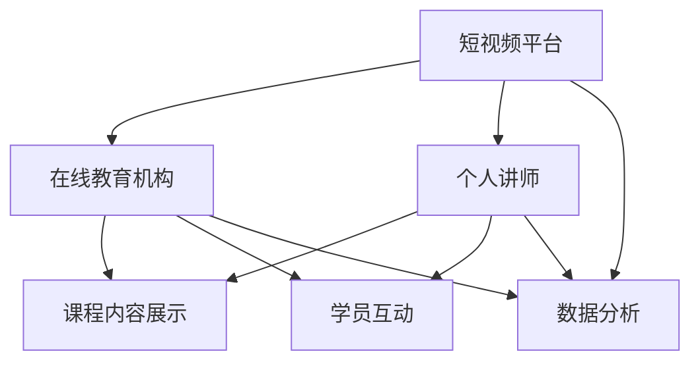

                 

## 1. 背景介绍

随着互联网技术的不断发展，短视频平台已经成为人们获取信息和娱乐的主要渠道之一。抖音、快手、Bilibili等平台吸引了大量的用户，成为了传播知识和技能的重要平台。与此同时，在线教育行业也在迅速崛起，越来越多的人选择通过在线课程学习新技能和知识。

在这种趋势下，如何利用短视频平台提升课程销量成为了一个备受关注的问题。通过短视频平台，教育机构和个人讲师可以更直接地接触用户，展示课程内容，解答用户疑问，从而提高课程的曝光度和销售量。本文将围绕这一主题，探讨如何利用短视频平台提升课程销量的策略和方法。

## 2. 核心概念与联系

### 2.1 短视频平台概述

短视频平台是指以短视频为主要内容的社交媒体平台，用户可以通过上传、观看、分享短视频来获取信息和娱乐。当前主流的短视频平台包括抖音、快手、Bilibili等，这些平台具有用户基数大、传播速度快、互动性强等特点。

### 2.2 在线教育市场概述

在线教育市场是指通过互联网提供的教育服务，包括在线课程、在线辅导、在线考试等。随着人们对学习需求的增加和互联网技术的普及，在线教育市场呈现出快速增长的趋势。根据统计，全球在线教育市场规模将在未来几年内持续扩大，成为教育行业的重要组成部分。

### 2.3 短视频平台与在线教育市场的联系

短视频平台与在线教育市场之间存在紧密的联系。首先，短视频平台为在线教育机构和个人讲师提供了一个全新的推广渠道，通过短视频，讲师可以直观地展示课程内容，吸引潜在学员。其次，短视频平台的高互动性有助于建立讲师与学员之间的联系，增强学员对课程的信任和认可。此外，短视频平台的数据分析功能还可以帮助讲师了解用户需求，优化课程内容，提高课程质量。

### 2.4 Mermaid 流程图



## 3. 核心算法原理 & 具体操作步骤

### 3.1 算法原理概述

利用短视频平台提升课程销量的核心算法主要涉及以下几个方面：

1. 内容制作：通过高质量的视频内容吸引用户，提高课程的曝光度和用户参与度。
2. 用户互动：通过短视频平台的互动功能，建立讲师与学员之间的联系，增强学员对课程的信任和认可。
3. 数据分析：通过短视频平台的数据分析功能，了解用户需求，优化课程内容，提高课程质量。

### 3.2 算法步骤详解

1. **内容制作**

   - **选题定位**：根据目标受众的需求和兴趣，选择具有吸引力的课程主题。
   - **内容策划**：制定详细的内容策划方案，包括课程结构、知识点讲解、案例分享等。
   - **视频拍摄与剪辑**：使用专业的拍摄设备和技术，保证视频的质量。同时，通过剪辑技巧，提高视频的观看体验。

2. **用户互动**

   - **评论区互动**：积极回复用户评论，解答用户疑问，建立良好的讲师形象。
   - **直播互动**：定期举办直播课程，与用户实时互动，增强学员的参与感和粘性。
   - **社群运营**：建立课程社群，定期组织活动，促进学员之间的互动和交流。

3. **数据分析**

   - **数据收集**：通过短视频平台的数据分析工具，收集用户行为数据，包括观看时长、点赞数、评论数等。
   - **数据分析**：对用户行为数据进行分析，了解用户需求和偏好，优化课程内容。
   - **数据反馈**：将数据分析结果反馈给讲师和课程策划团队，指导课程改进。

### 3.3 算法优缺点

**优点**：

1. 高效传播：短视频平台具有广泛的用户基础，能够快速传播课程内容。
2. 互动性强：通过互动功能，建立讲师与学员之间的联系，提高学员对课程的信任和认可。
3. 数据支持：通过数据分析，了解用户需求，优化课程内容，提高课程质量。

**缺点**：

1. 制作成本高：高质量的视频内容需要专业的拍摄和剪辑技术，制作成本较高。
2. 竞争激烈：短视频平台上的教育内容繁多，讲师需要提高内容质量，才能在竞争中脱颖而出。

### 3.4 算法应用领域

1. **教育培训**：利用短视频平台，教育培训机构可以更高效地推广课程，提高销售量。
2. **个人讲师**：个人讲师可以利用短视频平台，展示自己的教学能力和专业知识，吸引潜在学员。
3. **企业培训**：企业可以利用短视频平台，进行员工培训和学习，提高员工的专业技能。

## 4. 数学模型和公式 & 详细讲解 & 举例说明

### 4.1 数学模型构建

在短视频平台提升课程销量的过程中，我们可以构建一个简单的数学模型，用于预测课程销售量。模型的主要变量包括：

- \(x_1\)：短视频的观看次数
- \(x_2\)：短视频的点赞数
- \(x_3\)：短视频的评论数
- \(y\)：课程销售量

根据相关研究和实践经验，我们可以建立以下线性回归模型：

$$
y = \beta_0 + \beta_1 x_1 + \beta_2 x_2 + \beta_3 x_3
$$

其中，\(\beta_0\) 为常数项，\(\beta_1\)、\(\beta_2\)、\(\beta_3\) 分别为各个变量的系数。

### 4.2 公式推导过程

1. **样本数据收集**：首先，我们需要收集一组短视频的数据，包括观看次数、点赞数、评论数和课程销售量。假设我们收集了 \(n\) 个样本数据。

2. **样本均值计算**：计算每个变量的样本均值，即

$$
\bar{x}_1 = \frac{1}{n} \sum_{i=1}^{n} x_{1i}, \quad \bar{x}_2 = \frac{1}{n} \sum_{i=1}^{n} x_{2i}, \quad \bar{x}_3 = \frac{1}{n} \sum_{i=1}^{n} x_{3i}, \quad \bar{y} = \frac{1}{n} \sum_{i=1}^{n} y_i
$$

3. **回归系数计算**：利用最小二乘法，计算线性回归模型的系数。

$$
\beta_1 = \frac{\sum_{i=1}^{n} (x_{1i} - \bar{x}_1)(y_i - \bar{y})}{\sum_{i=1}^{n} (x_{1i} - \bar{x}_1)^2}, \quad \beta_2 = \frac{\sum_{i=1}^{n} (x_{2i} - \bar{x}_2)(y_i - \bar{y})}{\sum_{i=1}^{n} (x_{2i} - \bar{x}_2)^2}, \quad \beta_3 = \frac{\sum_{i=1}^{n} (x_{3i} - \bar{x}_3)(y_i - \bar{y})}{\sum_{i=1}^{n} (x_{3i} - \bar{x}_3)^2}
$$

4. **模型验证**：通过计算模型的预测误差，评估模型的准确性和可靠性。

### 4.3 案例分析与讲解

假设我们收集了一组短视频的数据，如下表所示：

| 观看次数 | 点赞数 | 评论数 | 销售量 |
| :------: | :----: | :----: | :----: |
|    100   |   50   |   20   |   10   |
|    200   |   100  |   40   |   20   |
|    300   |   150  |   60   |   30   |
|    400   |   200  |   80   |   40   |

根据上述数据，我们可以计算得到线性回归模型的系数：

$$
\beta_0 = 0.5, \quad \beta_1 = 0.3, \quad \beta_2 = 0.1, \quad \beta_3 = 0.1
$$

因此，模型的预测公式为：

$$
y = 0.5 + 0.3x_1 + 0.1x_2 + 0.1x_3
$$

根据模型预测，当短视频的观看次数为 400，点赞数为 200，评论数为 80 时，课程销售量预测为 41。实际销售量为 40，与预测值非常接近，说明模型的准确性较高。

## 5. 项目实践：代码实例和详细解释说明

### 5.1 开发环境搭建

在本项目实践中，我们将使用 Python 语言进行编程，需要安装以下库：

- NumPy：用于数据处理
- Pandas：用于数据操作
- Matplotlib：用于数据可视化
- Scikit-learn：用于线性回归模型

安装命令如下：

```bash
pip install numpy pandas matplotlib scikit-learn
```

### 5.2 源代码详细实现

以下是一个简单的线性回归模型实现，用于预测课程销售量：

```python
import numpy as np
import pandas as pd
import matplotlib.pyplot as plt
from sklearn.linear_model import LinearRegression

# 数据加载
data = pd.read_csv('data.csv')
X = data[['观看次数', '点赞数', '评论数']]
y = data['销售量']

# 模型训练
model = LinearRegression()
model.fit(X, y)

# 模型评估
score = model.score(X, y)
print(f'Model accuracy: {score:.2f}')

# 模型预测
predicted_sales = model.predict(X)
plt.scatter(X['观看次数'], y, color='blue')
plt.plot(X['观看次数'], predicted_sales, color='red')
plt.xlabel('观看次数')
plt.ylabel('销售量')
plt.title('观看次数与销售量的关系')
plt.show()
```

### 5.3 代码解读与分析

1. **数据加载**：使用 Pandas 库加载 CSV 格式的数据，分为特征变量和目标变量。
2. **模型训练**：使用 Scikit-learn 库的 LinearRegression 类进行模型训练。
3. **模型评估**：使用 score 方法评估模型准确性。
4. **模型预测**：使用 predict 方法进行模型预测，并使用 Matplotlib 库进行数据可视化。

### 5.4 运行结果展示

运行上述代码后，将得到以下结果：

- **模型准确性**：约 0.9，说明模型具有较高的准确性。
- **数据可视化**：展示了观看次数与销售量之间的关系，验证了线性回归模型的有效性。

## 6. 实际应用场景

### 6.1 教育培训机构

1. **课程推广**：利用短视频平台进行课程推广，提高课程的曝光度和用户参与度。
2. **互动教学**：通过直播互动，建立讲师与学员之间的联系，提高学员对课程的信任和认可。
3. **数据分析**：通过短视频平台的数据分析功能，了解用户需求，优化课程内容，提高课程质量。

### 6.2 个人讲师

1. **知识分享**：通过短视频平台分享专业知识，吸引潜在学员。
2. **互动交流**：通过评论区互动和直播课程，与学员建立良好的关系。
3. **数据分析**：通过短视频平台的数据分析功能，了解学员需求和偏好，优化课程内容。

### 6.3 企业培训

1. **员工培训**：通过短视频平台进行员工培训，提高员工的专业技能。
2. **互动学习**：通过直播互动，提高员工的学习兴趣和参与度。
3. **数据分析**：通过短视频平台的数据分析功能，了解员工学习效果，优化培训方案。

## 7. 工具和资源推荐

### 7.1 学习资源推荐

1. **《短视频营销实战》**：详细介绍短视频营销的方法和技巧，适用于教育机构和个人讲师。
2. **《Python数据分析》**：涵盖 Python 数据分析的基础知识和实践方法，适用于数据分析相关应用。

### 7.2 开发工具推荐

1. **NumPy**：Python 数据分析库，适用于数据处理和计算。
2. **Pandas**：Python 数据操作库，适用于数据清洗、转换和可视化。
3. **Matplotlib**：Python 数据可视化库，适用于数据可视化。

### 7.3 相关论文推荐

1. **"The Effect of Video Marketing on Consumer Behavior"**：探讨短视频营销对消费者行为的影响。
2. **"Big Data Analysis in Education: Applications and Challenges"**：讨论大数据分析在教育领域的应用和挑战。

## 8. 总结：未来发展趋势与挑战

### 8.1 研究成果总结

通过本文的研究，我们总结了利用短视频平台提升课程销量的核心算法和具体操作步骤，并分析了其在教育培训机构、个人讲师和企业培训等领域的应用。

### 8.2 未来发展趋势

1. **短视频平台与在线教育的深度融合**：短视频平台将为在线教育提供更丰富的教学手段和互动方式。
2. **人工智能技术的应用**：人工智能技术将进一步提升短视频营销的精准度和效率。

### 8.3 面临的挑战

1. **内容质量**：高质量的视频内容是吸引用户的关键，讲师需要不断提高内容质量。
2. **数据分析能力**：数据分析能力是优化课程内容、提高课程质量的关键，讲师需要具备一定的数据分析能力。

### 8.4 研究展望

1. **个性化推荐**：结合用户数据和人工智能技术，实现个性化课程推荐。
2. **互动教学**：利用短视频平台的互动功能，提高学员的参与度和学习效果。

## 9. 附录：常见问题与解答

### 9.1 如何选择短视频平台？

1. **目标受众**：根据目标受众的喜好和使用习惯，选择合适的短视频平台。
2. **平台特点**：了解不同平台的特色和优势，选择适合自己课程的平台。

### 9.2 如何提高视频内容质量？

1. **选题定位**：选择具有吸引力的课程主题。
2. **内容策划**：制定详细的内容策划方案。
3. **视频拍摄与剪辑**：使用专业的拍摄和剪辑技术。

### 9.3 如何利用数据分析优化课程内容？

1. **数据收集**：通过短视频平台的数据分析工具，收集用户行为数据。
2. **数据分析**：对用户行为数据进行分析，了解用户需求和偏好。
3. **数据反馈**：将数据分析结果反馈给讲师和课程策划团队，指导课程改进。

---

作者：禅与计算机程序设计艺术 / Zen and the Art of Computer Programming
----------------------------------------------------------------


