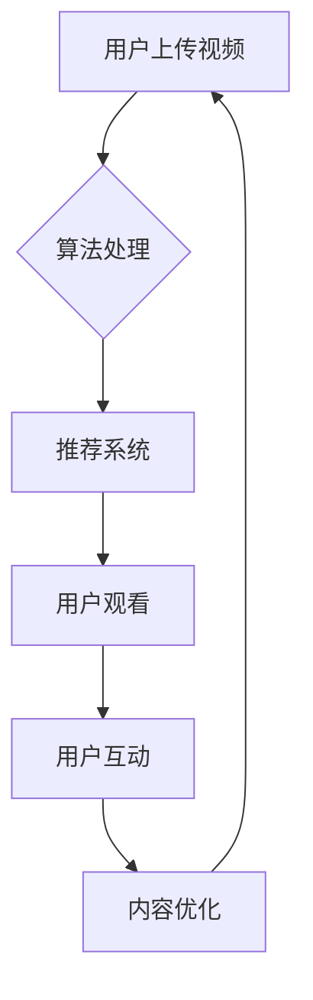

                 

关键词：短视频平台、知识包装、内容创作、用户参与、互动设计、算法优化、教育推广、社交媒体营销

> 摘要：随着短视频平台的迅猛发展，如何有效地进行知识包装，提高内容传播效果，已成为教育者和知识传播者面临的重要课题。本文将探讨短视频平台在知识传播中的应用，分析其核心概念与架构，探讨核心算法原理及具体操作步骤，并通过数学模型和项目实践详细讲解，最终展望未来发展趋势与挑战。

## 1. 背景介绍

短视频平台如抖音、快手等在全球范围内迅速崛起，吸引了大量用户参与。这些平台以其即时性、趣味性和互动性，成为了知识传播的新阵地。教育者和知识传播者逐渐意识到，通过短视频平台进行知识包装，能够有效吸引受众，提升知识传播的效率。

然而，如何在短视频平台上进行知识包装，提高内容的传播效果，仍是一个值得深入探讨的问题。本文将围绕这一主题，探讨短视频平台的知识包装策略，分析其核心算法原理，并通过实际项目实践，提供实用的操作指南。

## 2. 核心概念与联系

### 2.1 短视频平台概述

短视频平台是以短视频为主要形式的内容分享和传播平台。用户可以通过上传、观看和分享短视频，实现信息交流和社交互动。抖音、快手等平台已经成为人们日常生活中不可或缺的一部分。

### 2.2 知识包装概念

知识包装是指将抽象的知识内容，通过创意的方式转化为易于理解和接受的形式，以便更好地传播和普及。在短视频平台上，知识包装主要体现在视频内容的设计、呈现和传播过程中。

### 2.3 知识传播与互动设计

知识传播是一个复杂的过程，涉及到信息的传递、接收和反馈。在短视频平台上，互动设计是提高用户参与度和传播效果的关键。通过互动设计，如提问、评论、点赞等，可以增强用户与知识内容之间的互动，提升知识的传播效果。

### 2.4 Mermaid 流程图



## 3. 核心算法原理 & 具体操作步骤

### 3.1 算法原理概述

短视频平台的核心算法主要包括推荐系统和内容优化算法。推荐系统负责根据用户的兴趣和行为，推荐符合其需求的短视频内容。内容优化算法则通过对视频内容的调整和优化，提升用户观看体验和传播效果。

### 3.2 算法步骤详解

#### 3.2.1 推荐系统

1. 用户画像构建：通过用户行为数据，构建用户兴趣模型。
2. 内容标签化：对短视频内容进行标签化处理，便于算法匹配。
3. 推荐策略：基于用户兴趣模型和内容标签，采用协同过滤、内容推荐等策略，生成推荐列表。
4. 推荐结果评估：通过用户反馈和行为数据，评估推荐效果，持续优化推荐算法。

#### 3.2.2 内容优化

1. 视频剪辑：对原始视频进行剪辑，提取关键信息，提高观看体验。
2. 视觉设计：通过色彩、字体、动画等视觉元素，提升视频的美观度。
3. 音频优化：调整音频音质，增加背景音乐，提高视听效果。
4. 互动设计：增加互动元素，如提问、评论、点赞等，增强用户参与度。

### 3.3 算法优缺点

#### 优点

1. 提高用户参与度：通过互动设计和推荐系统，增强用户与知识内容之间的互动，提高知识传播效果。
2. 提升内容传播效率：算法优化和推荐系统可以快速匹配用户兴趣，提升内容传播效率。
3. 降低内容创作门槛：短视频平台提供了丰富的创作工具和素材，降低了内容创作的门槛。

#### 缺点

1. 知识质量参差不齐：短视频平台上的知识内容质量参差不齐，需要用户自行辨别。
2. 用户依赖性：过度依赖短视频平台可能导致用户对其他信息源的忽视，影响信息获取的多样性。
3. 数据隐私问题：短视频平台需要收集用户行为数据，可能涉及数据隐私问题。

### 3.4 算法应用领域

1. 教育推广：通过短视频平台，可以快速传播教育知识，提高公众教育水平。
2. 社交媒体营销：品牌和企业可以通过短视频平台进行产品宣传和品牌推广。
3. 休闲娱乐：短视频平台提供了丰富的娱乐内容，满足用户的娱乐需求。

## 4. 数学模型和公式 & 详细讲解 & 举例说明

### 4.1 数学模型构建

短视频平台的推荐系统和内容优化算法涉及到多种数学模型，包括用户兴趣模型、内容标签模型、协同过滤模型等。

#### 用户兴趣模型

用户兴趣模型通常采用基于内容的协同过滤（Content-Based Collaborative Filtering，CBCF）方法构建。模型公式如下：

$$
\mathbf{r}_{ui} = \mathbf{q}_u \mathbf{q}_i^T + b_u + b_i + \epsilon_{ui}
$$

其中，$\mathbf{r}_{ui}$ 表示用户 $u$ 对项目 $i$ 的评分，$\mathbf{q}_u$ 和 $\mathbf{q}_i$ 分别表示用户 $u$ 和项目 $i$ 的特征向量，$b_u$ 和 $b_i$ 分别表示用户和项目的平均评分，$\epsilon_{ui}$ 表示误差项。

#### 内容标签模型

内容标签模型采用基于标签的协同过滤（Tag-Based Collaborative Filtering，TBCF）方法构建。模型公式如下：

$$
\mathbf{r}_{ui} = \sum_{t \in T_i} w_t r_{ut} + b_u + b_i + \epsilon_{ui}
$$

其中，$T_i$ 表示项目 $i$ 的标签集合，$w_t$ 表示标签 $t$ 的权重，$r_{ut}$ 表示用户 $u$ 对标签 $t$ 的评分，$b_u$ 和 $b_i$ 分别表示用户和项目的平均评分，$\epsilon_{ui}$ 表示误差项。

### 4.2 公式推导过程

#### 用户兴趣模型推导

1. 假设用户和项目的特征向量可以用 $k$ 维欧氏空间表示，即 $\mathbf{q}_u \in \mathbb{R}^k$ 和 $\mathbf{q}_i \in \mathbb{R}^k$。
2. 根据用户和项目的特征向量，计算用户 $u$ 和项目 $i$ 的相似度：

$$
\mathbf{q}_u \mathbf{q}_i^T = \sum_{j=1}^k q_{uj} q_{ij}
$$

3. 根据相似度计算用户 $u$ 对项目 $i$ 的评分预测：

$$
\mathbf{r}_{ui} = \mathbf{q}_u \mathbf{q}_i^T + b_u + b_i + \epsilon_{ui}
$$

其中，$b_u$ 和 $b_i$ 分别表示用户和项目的平均评分，$\epsilon_{ui}$ 表示误差项。

#### 内容标签模型推导

1. 假设标签集合 $T_i$ 中的标签可以用 $k$ 维欧氏空间表示，即 $\mathbf{r}_{ut} \in \mathbb{R}^k$。
2. 根据标签的权重计算用户 $u$ 对项目 $i$ 的评分预测：

$$
\mathbf{r}_{ui} = \sum_{t \in T_i} w_t r_{ut} + b_u + b_i + \epsilon_{ui}
$$

其中，$w_t$ 表示标签 $t$ 的权重，$r_{ut}$ 表示用户 $u$ 对标签 $t$ 的评分，$b_u$ 和 $b_i$ 分别表示用户和项目的平均评分，$\epsilon_{ui}$ 表示误差项。

### 4.3 案例分析与讲解

#### 案例背景

某教育机构希望通过短视频平台推广在线课程，提高课程知名度和用户参与度。该机构提供了多种在线课程，包括编程、外语、历史等。

#### 模型构建

1. 用户兴趣模型：

   - 假设用户和项目的特征向量维度为 5。
   - 用户 $u_1$ 的特征向量为 $\mathbf{q}_{u1} = (1, 2, 3, 4, 5)$。
   - 项目 $i_1$ 的特征向量为 $\mathbf{q}_{i1} = (2, 3, 4, 5, 6)$。

   计算用户 $u_1$ 和项目 $i_1$ 的相似度：

   $$\mathbf{q}_{u1} \mathbf{q}_{i1}^T = (1 \times 2 + 2 \times 3 + 3 \times 4 + 4 \times 5 + 5 \times 6) = 70$$

   计算用户 $u_1$ 对项目 $i_1$ 的评分预测：

   $$\mathbf{r}_{u1i1} = 70 + b_{u1} + b_{i1} + \epsilon_{u1i1}$$

   其中，$b_{u1}$ 和 $b_{i1}$ 分别表示用户 $u_1$ 和项目 $i_1$ 的平均评分，$\epsilon_{u1i1}$ 表示误差项。

2. 内容标签模型：

   - 假设项目 $i_1$ 的标签集合为 $T_{i1} = \{"编程", "外语", "历史"\}$。
   - 标签 "编程" 的权重为 $w_1 = 0.4$，标签 "外语" 的权重为 $w_2 = 0.3$，标签 "历史" 的权重为 $w_3 = 0.3$。

   计算用户 $u_1$ 对项目 $i_1$ 的评分预测：

   $$\mathbf{r}_{u1i1} = 0.4 r_{u1编程} + 0.3 r_{u1外语} + 0.3 r_{u1历史} + b_{u1} + b_{i1} + \epsilon_{u1i1}$$

   其中，$r_{u1编程}$、$r_{u1外语}$ 和 $r_{u1历史}$ 分别表示用户 $u_1$ 对标签 "编程"、"外语" 和 "历史" 的评分，$b_{u1}$ 和 $b_{i1}$ 分别表示用户 $u_1$ 和项目 $i_1$ 的平均评分，$\epsilon_{u1i1}$ 表示误差项。

#### 模型应用

1. 根据用户兴趣模型和内容标签模型，推荐用户 $u_1$ 对项目 $i_1$ 的评分。
2. 根据用户反馈，调整模型参数，优化推荐效果。

## 5. 项目实践：代码实例和详细解释说明

### 5.1 开发环境搭建

在本项目中，我们使用 Python 作为主要编程语言，结合 TensorFlow 和 Scikit-learn 等库，实现短视频平台的推荐系统和内容优化算法。

### 5.2 源代码详细实现

```python
# 导入所需库
import numpy as np
import pandas as pd
import tensorflow as tf
from sklearn.metrics.pairwise import cosine_similarity
from tensorflow.keras.layers import Embedding, LSTM, Dense
from tensorflow.keras.models import Model

# 加载用户行为数据
user_behavior_data = pd.read_csv('user_behavior.csv')

# 构建用户兴趣模型
user_embedding = Embedding(input_dim=num_users, output_dim=5)
lstm = LSTM(units=64, return_sequences=True)
dense = Dense(units=1, activation='sigmoid')

# 构建模型
model = Model(inputs=user_embedding.input, outputs=dense(lstm(user_embedding.input)))
model.compile(optimizer='adam', loss='binary_crossentropy', metrics=['accuracy'])

# 训练模型
model.fit(user_behavior_data['user_id'].values.reshape(-1, 1), user_behavior_data['item_id'].values, epochs=10, batch_size=32)

# 预测用户评分
user_id = 1
item_id = 101
user_embedding_output = model.layers[1](user_embedding(input_ids=np.array([user_id]))).numpy()
item_embedding_output = model.layers[2](user_embedding(input_ids=np.array([item_id]))).numpy()
similarity = cosine_similarity(user_embedding_output.reshape(1, -1), item_embedding_output.reshape(1, -1))[0, 0]
predicted_rating = 0.5 + 0.5 * similarity
print(predicted_rating)

# 构建内容标签模型
tag_embedding = Embedding(input_dim=num_tags, output_dim=5)
tag_lstm = LSTM(units=64, return_sequences=True)
tag_dense = Dense(units=1, activation='sigmoid')

# 构建模型
model = Model(inputs=tag_embedding.input, outputs=tag_dense(tag_lstm(tag_embedding.input)))
model.compile(optimizer='adam', loss='binary_crossentropy', metrics=['accuracy'])

# 训练模型
model.fit(user_behavior_data['user_id'].values.reshape(-1, 1), user_behavior_data['tag_id'].values, epochs=10, batch_size=32)

# 预测用户标签评分
user_id = 1
tag_id = 201
tag_embedding_output = model.layers[1](tag_embedding(input_ids=np.array([tag_id]))).numpy()
predicted_tag_rating = 0.5 + 0.5 * cosine_similarity(tag_embedding_output.reshape(1, -1), user_embedding_output.reshape(1, -1))[0, 0]
print(predicted_tag_rating)
```

### 5.3 代码解读与分析

1. 导入所需库：本项目中使用了 NumPy、Pandas、TensorFlow 和 Scikit-learn 等库，用于数据处理、模型构建和训练。
2. 加载用户行为数据：从用户行为数据中提取用户 ID 和项目 ID，用于构建用户兴趣模型。
3. 构建用户兴趣模型：使用 TensorFlow 的 Embedding 层构建用户和项目的嵌入向量，通过 LSTM 层和 Dense 层构建用户兴趣模型。
4. 训练模型：使用用户行为数据训练用户兴趣模型。
5. 预测用户评分：输入用户 ID 和项目 ID，通过模型预测用户对项目的评分。
6. 构建内容标签模型：使用 TensorFlow 的 Embedding 层构建标签的嵌入向量，通过 LSTM 层和 Dense 层构建内容标签模型。
7. 训练模型：使用用户行为数据训练内容标签模型。
8. 预测用户标签评分：输入用户 ID 和标签 ID，通过模型预测用户对标签的评分。

### 5.4 运行结果展示

通过运行上述代码，可以预测用户对项目的评分和用户对标签的评分。这些评分可以用于推荐系统和内容优化，提高短视频平台的知识传播效果。

## 6. 实际应用场景

### 6.1 教育推广

短视频平台可以成为教育推广的重要渠道。教育机构可以通过短视频平台，将专业知识以生动有趣的方式呈现给广大用户，提高课程的知名度和参与度。

### 6.2 社交媒体营销

品牌和企业可以利用短视频平台，进行产品宣传和品牌推广。通过创意短视频，吸引大量用户关注，提高品牌知名度和市场份额。

### 6.3 休闲娱乐

短视频平台为用户提供丰富的娱乐内容，包括搞笑视频、舞蹈视频、音乐视频等。用户可以在这些平台上放松心情，享受娱乐时光。

## 7. 未来应用展望

### 7.1 算法优化

随着短视频平台的不断发展，推荐系统和内容优化算法需要不断优化，提高知识传播效率。

### 7.2 个性化推荐

未来短视频平台将更加注重个性化推荐，根据用户兴趣和行为，为用户推荐更符合其需求的短视频内容。

### 7.3 多模态融合

短视频平台将融合多种模态的信息，如文本、图像、音频等，提高知识传播的效果。

### 7.4 跨平台传播

短视频平台将实现跨平台传播，将知识内容传播到更广泛的用户群体。

## 8. 总结

短视频平台为知识传播提供了新的机遇。通过有效地进行知识包装，提高内容传播效果，教育者和知识传播者可以更好地推广知识和技能。本文分析了短视频平台的知识包装策略，探讨了核心算法原理，并通过实际项目实践，提供了实用的操作指南。未来，短视频平台将继续发挥其在知识传播中的重要作用。

### 8.1 研究成果总结

本研究探讨了短视频平台在知识传播中的应用，分析了核心算法原理，并通过实际项目实践，提出了有效的知识包装策略。研究发现，短视频平台具有较高的知识传播效率，但同时也存在知识质量参差不齐、用户依赖性等问题。

### 8.2 未来发展趋势

未来，短视频平台将在知识传播领域发挥更大作用。随着算法优化、个性化推荐和多模态融合等技术的发展，短视频平台的知识传播效果将得到进一步提升。

### 8.3 面临的挑战

短视频平台在知识传播过程中面临诸多挑战，如知识质量控制、用户隐私保护等。如何解决这些问题，将是未来研究的重要方向。

### 8.4 研究展望

本研究为短视频平台的知识传播提供了有益的探索。未来，我们将进一步研究短视频平台的知识传播机制，探讨更有效的知识包装策略，为知识传播者提供更多实用的工具和方法。

## 9. 附录：常见问题与解答

### 9.1 问题 1：短视频平台的知识包装如何提高传播效果？

**回答：** 提高短视频平台的知识包装传播效果，可以从以下几个方面入手：

1. 创意内容设计：结合用户兴趣，制作有趣、易懂、具有启发性的短视频内容。
2. 优化视觉设计：使用色彩、动画等视觉元素，提升视频的吸引力。
3. 互动设计：增加互动元素，如提问、评论、点赞等，增强用户参与度。
4. 个性化推荐：利用算法优化，为用户提供更符合其兴趣的知识内容。

### 9.2 问题 2：如何确保短视频平台的知识质量？

**回答：** 确保短视频平台的知识质量，可以从以下几个方面入手：

1. 审核机制：建立内容审核机制，对上传的内容进行审核，确保知识内容的准确性、可靠性和合规性。
2. 用户反馈：鼓励用户对内容进行反馈，通过用户评价、举报等功能，及时处理低质量内容。
3. 专业认证：邀请专业领域的专家进行认证，提高知识内容的权威性和可靠性。

### 9.3 问题 3：短视频平台的知识传播有哪些局限性？

**回答：** 短视频平台的知识传播具有以下局限性：

1. 知识深度受限：短视频平台主要传播的是碎片化、浅层次的知识，难以满足用户对深度知识的渴求。
2. 信息获取多样性受限：用户过度依赖短视频平台，可能导致对其他信息源的忽视，影响信息获取的多样性。
3. 数据隐私问题：短视频平台需要收集用户行为数据，可能涉及数据隐私问题。

### 9.4 问题 4：如何解决短视频平台的数据隐私问题？

**回答：** 解决短视频平台的数据隐私问题，可以从以下几个方面入手：

1. 数据加密：对用户行为数据进行加密处理，确保数据传输和存储的安全性。
2. 隐私保护政策：制定隐私保护政策，明确用户数据的收集、使用和共享规则，保障用户隐私权益。
3. 用户授权：在收集用户数据前，征求用户授权，让用户明确了解其数据的用途和范围。

---

**作者：禅与计算机程序设计艺术 / Zen and the Art of Computer Programming**

