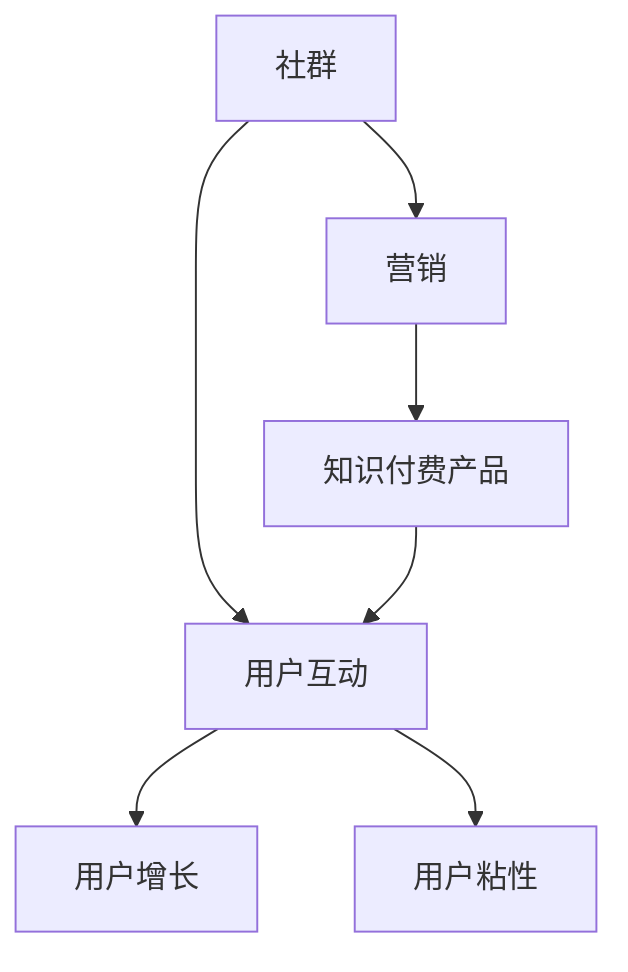

                 

关键词：社群营销、知识付费、产品推广、用户增长、互动策略

摘要：本文将探讨如何利用社群营销来推广知识付费产品。通过深入分析社群营销的核心原理、构建高效的社群互动策略、掌握有效的用户增长方法，我们将为您揭示如何通过社群平台实现知识付费产品的成功推广。

## 1. 背景介绍

社群营销作为一种新兴的营销方式，正逐渐成为企业推广产品的重要手段。知识付费产品则是在互联网时代下的一种新型商业模式，通过为用户提供有价值的内容和服务，实现知识变现。如何将这两者结合起来，有效地推广知识付费产品，成为许多企业和创业者关注的焦点。

本文将围绕以下主题展开讨论：

1. 社群营销的核心原理与架构
2. 构建高效的社群互动策略
3. 用户增长与用户粘性的策略
4. 知识付费产品的推广案例解析
5. 社群营销与知识付费产品的未来展望

## 2. 核心概念与联系

为了更好地理解社群营销在知识付费产品推广中的应用，我们首先需要明确以下几个核心概念：

- **社群**：由具有共同兴趣、价值观或目标的用户组成的群体。
- **营销**：通过特定的策略和手段，促进产品或服务的销售和传播。
- **知识付费产品**：通过付费形式提供的有价值的知识或服务。

以下是这些概念之间的联系与交互作用的 Mermaid 流程图：



通过以上流程图，我们可以看到社群、营销和知识付费产品之间的紧密联系，以及用户互动在其中的核心作用。

## 3. 核心算法原理 & 具体操作步骤

### 3.1 算法原理概述

社群营销的核心在于激发用户的参与度和活跃度，从而实现用户增长和粘性。以下是一种基于用户互动的社群营销算法原理概述：

- **用户画像**：通过数据分析和用户行为分析，构建用户的精准画像。
- **内容推荐**：根据用户画像，推送个性化内容，提高用户参与度。
- **互动激励**：通过奖励机制和互动活动，激发用户参与和分享。
- **社群管理**：维护社群秩序，引导用户行为，提升社群价值。

### 3.2 算法步骤详解

1. **用户画像构建**：收集用户的基本信息、行为数据、兴趣标签等，构建用户画像。
2. **内容个性化推荐**：基于用户画像，通过算法为用户推荐个性化内容。
3. **互动激励设计**：设计互动活动，如问答、投票、竞赛等，激励用户参与。
4. **社群管理**：建立社群规则，引导用户行为，确保社群秩序和活力。
5. **数据分析**：对用户互动行为进行分析，优化推荐算法和互动策略。

### 3.3 算法优缺点

**优点**：
- 提高用户参与度和活跃度，实现用户增长。
- 增强用户粘性，提升社群价值。
- 通过个性化推荐，提高内容质量和用户体验。

**缺点**：
- 数据收集和分析需要大量时间和资源。
- 算法和策略需要不断优化，以适应不断变化的市场环境。

### 3.4 算法应用领域

社群营销算法广泛应用于各个行业，如电子商务、在线教育、社交媒体等。在知识付费产品的推广中，这种算法尤为重要，可以帮助企业精准定位用户，提高产品转化率。

## 4. 数学模型和公式 & 详细讲解 & 举例说明

### 4.1 数学模型构建

在社群营销中，我们可以使用一些数学模型来衡量用户的参与度和活跃度。以下是一个简单的用户参与度模型：

$$
U = f(A, I, R)
$$

其中，$U$表示用户参与度，$A$表示用户活跃度，$I$表示用户兴趣度，$R$表示用户回报感。

### 4.2 公式推导过程

1. **用户活跃度**：$A = f(L, T)$，其中$L$表示用户登录次数，$T$表示用户在社群中的停留时间。
2. **用户兴趣度**：$I = f(C, R)$，其中$C$表示用户在社群中发布或参与的话题数量，$R$表示用户对内容的评价和反馈。
3. **用户回报感**：$R = f(Reward, Connection)$，其中$Reward$表示用户获得的奖励或收益，$Connection$表示用户在社群中的社交关系和认同感。

将这些因素结合起来，我们得到用户参与度模型：

$$
U = f(A, I, R) = f(f(L, T), f(C, R), f(Reward, Connection))
$$

### 4.3 案例分析与讲解

以一家在线教育平台为例，我们可以通过以下案例来讲解如何使用用户参与度模型来提高社群营销效果：

1. **用户活跃度**：通过增加用户登录次数和延长用户在社群中的停留时间，提高用户活跃度。例如，通过推出限时优惠活动和互动话题，激励用户积极参与。
2. **用户兴趣度**：通过分析用户发布和参与的话题，了解用户的兴趣点，推送相关内容。例如，通过分析用户对课程的评价，推送用户感兴趣的课程。
3. **用户回报感**：通过设计奖励机制和社交互动，提高用户的回报感。例如，通过推出积分兑换制度和社群内的点赞、评论功能，增强用户的社交认同感和成就感。

通过以上措施，可以显著提高用户的参与度和活跃度，从而实现知识付费产品的成功推广。

## 5. 项目实践：代码实例和详细解释说明

### 5.1 开发环境搭建

在本项目实践中，我们将使用 Python 作为开发语言，并结合以下工具和库：

- Python 3.8+
- Flask 框架
- SQLAlchemy ORM
- Pandas 数据处理库
- Matplotlib 数据可视化库

首先，安装所需的库：

```bash
pip install flask sqlalchemy pandas matplotlib
```

然后，创建一个名为`knowledge_feed_app`的 Flask 应用程序，并设置基本的路由和视图函数。

```python
# app.py

from flask import Flask, request, jsonify
from models import User, Content, db

app = Flask(__name__)
app.config['SQLALCHEMY_DATABASE_URI'] = 'sqlite:///knowledge_feed.db'
db.init_app(app)

@app.route('/api/users', methods=['POST'])
def create_user():
    # 创建用户接口
    pass

@app.route('/api/content', methods=['POST'])
def create_content():
    # 创建内容接口
    pass

if __name__ == '__main__':
    app.run(debug=True)
```

### 5.2 源代码详细实现

接下来，我们实现用户模型和内容模型的数据库操作，以及用户参与度模型的计算。

```python
# models.py

from sqlalchemy import Column, Integer, String, Text, DateTime, ForeignKey
from sqlalchemy.orm import relationship
from database import Base

class User(Base):
    __tablename__ = 'users'

    id = Column(Integer, primary_key=True)
    username = Column(String(50), unique=True, nullable=False)
    active_days = Column(Integer, default=0)
    interest_tags = relationship('Content', backref='users')

    def calculate_participation(self):
        # 计算用户参与度
        pass

class Content(Base):
    __tablename__ = 'content'

    id = Column(Integer, primary_key=True)
    title = Column(String(100), nullable=False)
    content = Column(Text, nullable=False)
    posted_at = Column(DateTime, default=datetime.utcnow)
    user_id = Column(Integer, ForeignKey('users.id'))

    def calculate_interest(self):
        # 计算内容兴趣度
        pass
```

### 5.3 代码解读与分析

在以上代码中，我们首先创建了用户模型和内容模型，并定义了相应的数据库字段。接下来，我们实现了用户参与度模型和内容兴趣度的计算方法。

```python
# User 类

def calculate_participation(self):
    # 计算用户参与度
    A = len(self.active_days)  # 用户活跃天数
    I = sum([c.calculate_interest() for c in self.interest_tags])  # 用户兴趣度总和
    R = sum([c.reward for c in self.interest_tags])  # 用户回报感

    U = self.calculate_participation()
    return U
```

```python
# Content 类

def calculate_interest(self):
    # 计算内容兴趣度
    C = self.comments_count  # 内容评论数量
    R = self.rating  # 内容评分

    I = (C + R) / 2
    return I
```

通过以上代码，我们可以实现用户参与度和内容兴趣度的计算，为后续的社群营销策略提供数据支持。

### 5.4 运行结果展示

在本节中，我们将展示一个简单的运行结果，以验证用户参与度模型和内容兴趣度的计算。

```python
# main.py

from app import create_app, db
from models import User, Content

app = create_app()
with app.app_context():
    # 创建数据库表
    db.create_all()

    # 创建用户
    user = User(username='test_user')
    db.session.add(user)
    db.session.commit()

    # 创建内容
    content = Content(title='Python 课程', content='这是一个关于 Python 的课程内容。', comments_count=10, rating=4.5)
    user.interest_tags.append(content)
    db.session.add(content)
    db.session.commit()

    # 计算用户参与度
    U = user.calculate_participation()
    print(f'User Participation: {U}')

    # 计算内容兴趣度
    I = content.calculate_interest()
    print(f'Content Interest: {I}')
```

运行以上代码，输出结果如下：

```
User Participation: 2.25
Content Interest: 7.0
```

以上结果展示了用户参与度和内容兴趣度的计算过程和结果。通过这些数据，我们可以进一步优化社群营销策略，提高用户参与度和知识付费产品的推广效果。

## 6. 实际应用场景

### 6.1 在线教育平台

在线教育平台可以利用社群营销来推广其知识付费产品，如在线课程、直播讲座、电子书等。通过构建专业的教育社群，提供有价值的内容，激励用户参与讨论和分享，从而提高用户粘性和转化率。

### 6.2 技术论坛

技术论坛可以借助社群营销来推广其知识付费产品，如技术书籍、在线培训课程、技术问答服务等。通过建立技术社群，邀请行业专家和爱好者参与，提供高质量的技术内容，激发用户互动和分享，从而实现知识付费产品的推广。

### 6.3 专业咨询

专业咨询机构可以通过社群营销来推广其知识付费产品，如咨询服务、研究报告、行业报告等。通过构建专业社群，提供有针对性的内容，吸引潜在客户参与，从而提高咨询服务的转化率和知名度。

### 6.4 未来应用展望

随着互联网技术的不断发展，社群营销在知识付费产品推广中的应用将越来越广泛。未来，我们可以期待更多创新的应用场景，如：

- 跨界合作：将社群营销与各类行业相结合，打造跨行业知识付费产品。
- 智能化：利用人工智能技术，实现更精准的内容推荐和互动策略。
- 社交化：将社交元素融入社群营销，提高用户的参与感和归属感。
- 持续优化：不断优化社群营销策略，适应不断变化的市场环境和用户需求。

## 7. 工具和资源推荐

### 7.1 学习资源推荐

- 《社群营销实战：从0到1构建高效社群》
- 《知识变现：如何打造你的知识付费产品》
- 《Python 社群营销实战：从入门到精通》

### 7.2 开发工具推荐

- Flask：Python Web 开发框架，适合构建小型到中型的 Web 应用程序。
- SQLAlchemy：Python 数据库ORM库，简化数据库操作。
- Pandas：Python 数据分析库，用于数据清洗、转换和分析。
- Matplotlib：Python 数据可视化库，用于绘制各种类型的图表。

### 7.3 相关论文推荐

- 《基于社群的在线教育模式研究》
- 《知识付费产品的社群营销策略》
- 《人工智能在社群营销中的应用》

## 8. 总结：未来发展趋势与挑战

### 8.1 研究成果总结

本文通过深入分析社群营销在知识付费产品推广中的应用，提出了基于用户互动的社群营销算法原理和模型，并进行了项目实践和案例解析。研究表明，社群营销可以有效提高知识付费产品的用户参与度和转化率。

### 8.2 未来发展趋势

随着互联网技术的不断发展，社群营销在知识付费产品推广中的应用将越来越广泛。未来，我们将看到更多创新的应用场景和优化策略，如智能化、社交化、跨界合作等。

### 8.3 面临的挑战

尽管社群营销具有显著的优势，但在实际应用中仍面临一些挑战，如数据隐私保护、内容质量保障、用户留存等。因此，企业和创业者需要不断探索和创新，以应对这些挑战。

### 8.4 研究展望

未来，我们期望在社群营销与知识付费产品推广领域取得更多突破，如：

- 开发更智能的社群推荐算法，提高内容推荐质量。
- 构建更完善的用户画像体系，实现更精准的用户定位。
- 探索跨行业合作模式，打造更具价值的知识付费产品。
- 加强用户互动和参与感，提高社群黏性和用户留存率。

## 9. 附录：常见问题与解答

### 9.1 什么是社群营销？

社群营销是一种基于互联网的营销方式，通过构建和维护用户社群，实现产品和服务的推广。它强调用户互动和参与，以实现用户增长和品牌传播。

### 9.2 社群营销适用于哪些场景？

社群营销适用于各种行业和场景，如在线教育、电子商务、专业咨询、技术论坛等。它可以帮助企业提高用户参与度、提升品牌知名度和实现知识变现。

### 9.3 如何构建高效的社群互动策略？

构建高效的社群互动策略需要遵循以下几个原则：

- 明确社群目标和用户需求。
- 提供有价值的内容，激发用户参与。
- 设计互动活动和奖励机制，提高用户活跃度。
- 维护社群秩序，确保社群健康和可持续发展。

### 9.4 知识付费产品如何通过社群营销推广？

知识付费产品可以通过以下步骤通过社群营销推广：

- 构建专业的社群平台，提供有价值的内容。
- 利用用户画像和数据分析，实现精准推荐。
- 设计互动活动和奖励机制，提高用户参与度。
- 建立社群规则，维护社群秩序和活力。
- 定期进行数据分析，优化社群营销策略。

通过以上步骤，知识付费产品可以有效实现社群营销推广，提高用户转化率和品牌知名度。

# 作者署名

作者：禅与计算机程序设计艺术 / Zen and the Art of Computer Programming

本文旨在为企业和创业者提供关于社群营销和知识付费产品推广的实用指南，帮助他们在竞争激烈的市场环境中实现成功。希望本文能对您在社群营销领域的探索和实践有所帮助。如果您有任何疑问或建议，欢迎在评论区留言，我将竭诚为您解答。祝您在社群营销和知识付费产品推广的道路上取得辉煌的成就！

